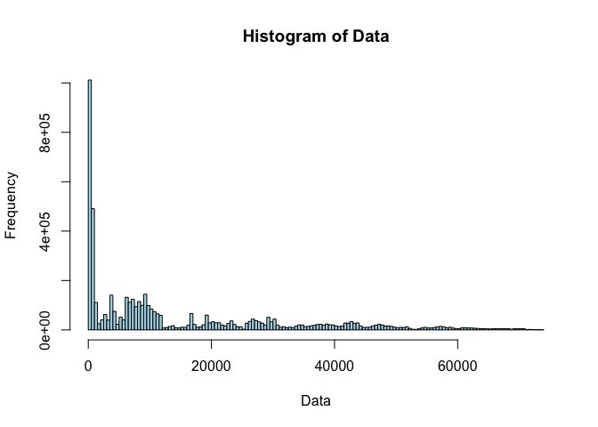
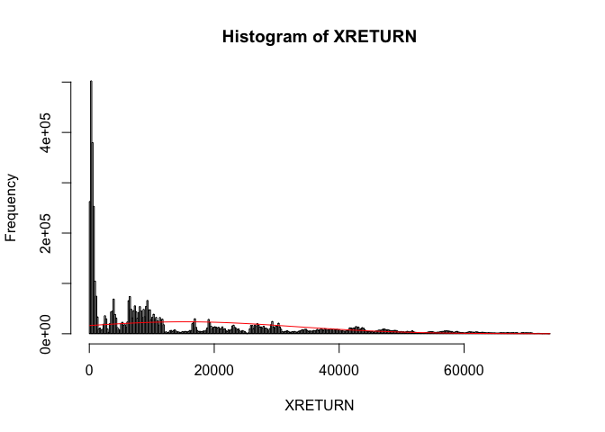
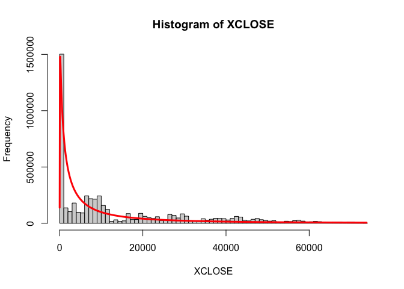
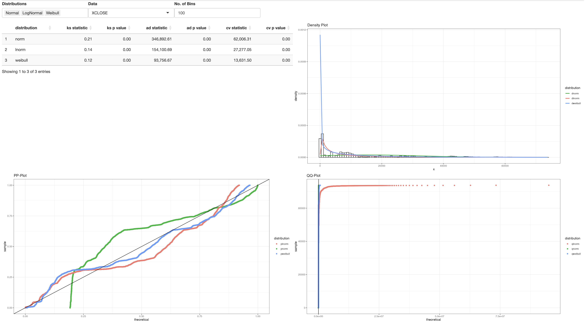

SA2
================
Karl Isaiah Buenafe, Jan Edward Macagba
2024-05-09

    ## Loading required package: MASS

    ## Loading required package: survival

    ##        Timestamp  Open  High   Low Close       Volume
    ## 1     1325317920  4.39  4.39  4.39  4.39 4.555809e-01
    ## 2     1325346600  4.39  4.39  4.39  4.39 4.800000e+01
    ## 3     1325350740  4.50  4.57  4.50  4.57 3.786230e+01
    ## 4     1325350800  4.58  4.58  4.58  4.58 9.000000e+00
    ## 5     1325391360  4.58  4.58  4.58  4.58 1.502000e+00
    ## 6     1325431680  4.84  4.84  4.84  4.84 1.000000e+01
    ## 7     1325457900  5.00  5.00  5.00  5.00 1.010000e+01
    ## 8     1325534640  5.00  5.00  5.00  5.00 1.904800e+01
    ## 9     1325591100  5.32  5.32  5.32  5.32 2.419173e+00
    ## 10    1325600520  5.14  5.14  5.14  5.14 6.800000e-01
    ## 11    1325602440  5.26  5.26  5.26  5.26 2.931939e+01
    ## 12    1325604720  5.29  5.29  5.29  5.29 2.930246e+01
    ## 13    1325610600  5.29  5.29  5.29  5.29 1.128544e+01
    ## 14    1325610840  5.14  5.14  5.14  5.14 2.000000e-02
    ## 15    1325611560  5.29  5.29  5.29  5.29 1.100000e+01
    ## 16    1325611620  5.29  5.29  5.29  5.29 4.010815e+00
    ## 17    1325650620  4.93  4.93  4.93  4.93 2.320000e+00
    ## 18    1325653500  4.93  4.93  4.93  4.93 9.680000e+00
    ## 19    1325680860  5.19  5.19  5.19  5.19 2.641618e+00
    ## 20    1325681820  5.19  5.19  5.19  5.19 8.724470e+00
    ## 21    1325691540  5.19  5.19  5.19  5.19 1.634473e+01
    ## 22    1325692380  5.32  5.32  5.32  5.32 1.860902e-01
    ## 23    1325692440  5.32  5.32  5.32  5.32 1.039474e+01
    ## 24    1325692800  5.36  5.37  5.36  5.37 1.362942e+01
    ## 25    1325699460  5.37  5.57  5.37  5.57 4.331220e+01
    ## 26    1325727600  5.72  5.72  5.72  5.72 5.000000e+00
    ## 27    1325735520  5.75  5.75  5.75  5.75 5.200000e+00
    ## 28    1325747940  5.75  5.79  5.75  5.79 1.480000e+01
    ## 29    1325753880  6.00  6.00  6.00  6.00 2.236667e+00
    ## 30    1325754180  6.00  6.00  6.00  6.00 1.684827e-01
    ## 31    1325756880  6.15  6.15  6.15  6.15 1.000000e+01
    ## 32    1325758080  6.19  6.19  6.19  6.19 5.718901e-01
    ## 33    1325758200  6.19  6.23  6.19  6.23 1.600000e+01
    ## 34    1325760480  6.23  6.25  6.23  6.25 1.400000e+01
    ## 35    1325762400  6.46  6.46  6.46  6.46 7.739938e-01
    ## 36    1325762460  6.46  6.46  6.46  6.46 1.780186e-01
    ## 37    1325762880  6.43  6.43  6.43  6.43 3.110420e-01
    ## 38    1325768820  6.44  6.44  6.44  6.44 3.105590e-01
    ## 39    1325770680  6.43  6.43  6.43  6.43 4.665630e-01
    ## 40    1325773860  6.42  6.42  6.42  6.42 3.115265e-01
    ## 41    1325803800  6.43  6.43  6.43  6.43 3.115265e-01
    ## 42    1325806500  6.44  6.44  6.44  6.44 4.665630e-01
    ## 43    1325806740  6.47  6.47  6.47  6.47 9.520124e-01
    ## 44    1325806860  6.65  6.65  6.65  6.65 2.077744e+01
    ## 45    1325806980  6.65  6.65  6.65  6.65 1.466276e+00
    ## 46    1325807160  6.65  6.65  6.65  6.65 4.992658e-01
    ## 47    1325829720  6.65  6.65  6.65  6.65 1.425498e+00
    ## 48    1325829840  6.69  6.73  6.69  6.73 6.310000e+00
    ## 49    1325856000  6.80  6.90  6.80  6.90 9.310559e+00
    ## 50    1325863260  6.76  6.76  6.76  6.76 2.958580e-01
    ## 51    1325864160  6.50  6.50  6.50  6.50 5.000000e-01
    ## 52    1325864220  6.49  6.49  6.49  6.49 1.540832e+00
    ## 53    1325867820  6.40  6.40  6.40  6.40 5.000000e-01
    ## 54    1325872740  6.40  6.40  6.40  6.40 1.550388e+00
    ## 55    1325872800  6.40  6.40  6.40  6.40 8.387597e-01
    ## 56    1325875320  6.40  6.40  6.40  6.40 9.110853e+00
    ## 57    1325881080  6.30  6.30  6.30  6.30 5.000000e-01
    ## 58    1325881140  6.20  6.20  6.20  6.20 5.000000e-01
    ## 59    1325881260  6.10  6.10  6.10  6.10 5.000000e-01
    ## 60    1325881320  6.00  6.00  6.00  6.00 1.000000e+00
    ## 61    1325960040  6.80  6.80  6.80  6.80 2.958580e-01
    ## 62    1326032400  6.90  6.90  6.90  6.90 4.000000e+00
    ## 63    1326065460  7.00  7.00  7.00  7.00 1.000000e+00
    ## 64    1326084000  6.99  6.99  6.90  6.90 5.000000e+00
    ## 65    1326110640  6.90  6.90  6.90  6.90 7.043488e+00
    ## 66    1326110760  6.90  6.90  6.90  6.90 1.468429e+00
    ## 67    1326110820  6.90  6.90  6.90  6.90 1.472754e+00
    ## 68    1326110880  6.90  6.90  6.90  6.90 1.522070e+00
    ## 69    1326110940  6.90  6.90  6.90  6.90 6.992588e-01
    ## 70    1326111300  6.50  6.50  6.50  6.50 1.560062e+00
    ## 71    1326111360  6.50  6.50  6.50  6.50 1.560062e+00
    ## 72    1326111420  6.50  6.50  6.50  6.50 1.569859e+00
    ## 73    1326111480  6.50  6.50  6.50  6.50 1.557632e+00
    ## 74    1326111540  6.50  6.50  6.50  6.50 1.564945e+00
    ## 75    1326111600  6.50  6.50  6.50  6.50 1.545595e+00
    ## 76    1326111840  6.50  6.50  6.50  6.50 1.360000e+01
    ## 77    1326115560  6.58  6.58  6.58  6.58 1.519757e+00
    ## 78    1326115620  6.60  6.60  6.60  6.60 1.480243e+00
    ## 79    1326115680  6.60  6.60  6.60  6.60 8.000000e-01
    ## 80    1326115980  6.57  6.57  6.57  6.57 7.610350e-01
    ## 81    1326117480  6.50  6.50  6.50  6.50 4.184381e-02
    ## 82    1326119580  6.60  6.60  6.60  6.60 1.515152e+00
    ## 83    1326122760  6.60  6.60  6.60  6.60 1.515152e+00
    ## 84    1326122820  6.60  6.60  6.60  6.60 1.515152e+00
    ## 85    1326122880  6.60  6.60  6.60  6.60 1.515152e+00
    ## 86    1326123780  6.60  6.60  6.60  6.60 1.517451e+00
    ## 87    1326124560  6.60  6.60  6.60  6.60 1.515152e+00
    ## 88    1326124680  6.60  6.60  6.60  6.60 1.515152e+00
    ## 89    1326124800  6.60  6.60  6.60  6.60 1.515152e+00
    ## 90    1326124980  6.60  6.60  6.60  6.60 1.515152e+00
    ## 91    1326125040  6.60  6.60  6.60  6.60 1.515152e+00
    ## 92    1326125160  6.60  6.60  6.60  6.60 1.515152e+00
    ## 93    1326129120  6.36  6.36  6.36  6.36 3.144654e-01
    ## 94    1326130020  6.38  6.38  6.38  6.38 5.579937e-01
    ## 95    1326132180  6.49  6.49  6.49  6.49 5.608629e-01
    ## 96    1326132300  6.48  6.48  6.48  6.48 1.000000e+00
    ## 97    1326138120  6.35  6.35  6.35  6.35 1.000000e+00
    ## 98    1326138240  6.23  6.23  6.23  6.23 1.000000e+00
    ## 99    1326149820  6.30  6.30  6.30  6.30 1.000000e+00
    ## 100   1326189360  6.24  6.24  6.24  6.24 3.205128e+00
    ## 101   1326189420  6.24  6.24  6.24  6.24 1.602564e+00
    ## 102   1326189480  6.24  6.24  6.24  6.24 1.602564e+00
    ## 103   1326189540  6.24  6.24  6.24  6.24 1.602564e+00
    ## 104   1326189600  6.24  6.24  6.24  6.24 1.237180e+00
    ## 105   1326192120  6.40  6.40  6.40  6.40 1.000000e+00
    ## 106   1326200400  6.54  6.54  6.54  6.54 1.000000e+00
    ## 107   1326200460  6.54  6.54  6.54  6.54 1.529052e+00
    ## 108   1326200520  6.54  6.54  6.54  6.54 1.529052e+00
    ## 109   1326200580  6.54  6.54  6.54  6.54 1.529052e+00
    ## 110   1326200640  6.54  6.54  6.54  6.54 1.538462e+00
    ## 111   1326200700  6.54  6.54  6.54  6.54 1.538462e+00
    ## 112   1326201000  6.54  6.54  6.54  6.54 1.529052e+00
    ## 113   1326201060  6.54  6.54  6.54  6.54 1.529052e+00
    ## 114   1326201120  6.54  6.54  6.54  6.54 1.529052e+00
    ## 115   1326201360  6.54  6.54  6.54  6.54 3.256881e-01
    ## 116   1326207300  6.55  6.55  6.55  6.55 5.608629e-01
    ## 117   1326207600  6.55  6.55  6.55  6.55 1.526718e+00
    ## 118   1326208620  6.55  6.55  6.55  6.55 1.014000e+01
    ## 119   1326208860  6.70  6.70  6.70  6.70 7.610350e-01
    ## 120   1326208920  6.70  6.70  6.70  6.70 1.503759e+00
    ## 121   1326208980  6.70  6.70  6.70  6.70 1.512859e+00
    ## 122   1326209040  6.70  6.70  6.70  6.70 7.652859e+00
    ## 123   1326210060  6.55  6.55  6.55  6.55 1.529052e+00
    ## 124   1326210240  6.55  6.55  6.55  6.55 1.531394e+00
    ## 125   1326219120  7.10  7.10  7.10  7.10 4.000000e+00
    ## 126   1326219180  7.10  7.10  7.10  7.10 1.510574e+00
    ## 127   1326219240  7.10  7.10  7.10  7.10 1.510574e+00
    ## 128   1326219300  7.10  7.10  7.10  7.10 1.253308e-01
    ## 129   1326236220  7.14  7.14  7.14  7.14 4.598039e+00
    ## 130   1326265500  7.14  7.14  7.14  7.14 1.401961e+00
    ## 131   1326265560  7.14  7.14  7.14  7.14 1.447178e+00
    ## 132   1326265620  7.14  7.14  7.14  7.14 1.447178e+00
    ## 133   1326265680  7.14  7.14  7.14  7.14 1.447178e+00
    ## 134   1326265740  7.14  7.14  7.14  7.14 1.447178e+00
    ## 135   1326265800  7.14  7.14  7.14  7.14 1.447178e+00
    ## 136   1326265860  7.14  7.14  7.14  7.14 1.447178e+00
    ## 137   1326265920  7.14  7.14  7.14  7.14 1.447178e+00
    ## 138   1326265980  7.14  7.14  7.14  7.14 1.447178e+00
    ## 139   1326266040  7.14  7.14  7.14  7.14 1.447178e+00
    ## 140   1326266100  7.14  7.14  7.14  7.14 1.449275e+00
    ## 141   1326266160  7.14  7.14  7.14  7.14 1.449275e+00
    ## 142   1326266220  7.14  7.14  7.14  7.14 1.449275e+00
    ## 143   1326266340  7.14  7.14  7.14  7.14 1.449275e+00
    ## 144   1326266400  7.14  7.14  7.14  7.14 1.237120e+00
    ## 145   1326269520  6.25  6.25  6.25  6.25 1.015000e+01
    ## 146   1326269580  6.25  6.25  6.25  6.25 8.500000e-01
    ## 147   1326275160  7.00  7.00  7.00  7.00 1.000000e+00
    ## 148   1326285300  7.20  7.20  7.20  7.20 1.000000e+00
    ## 149   1326285360  7.20  7.20  7.20  7.20 1.414427e+00
    ## 150   1326285420  7.20  7.20  7.20  7.20 1.414427e+00
    ## 151   1326285480  7.20  7.20  7.20  7.20 1.412429e+00
    ## 152   1326285540  7.20  7.20  7.20  7.20 1.404494e+00
    ## 153   1326285660  7.20  7.20  7.20  7.20 1.406470e+00
    ## 154   1326285720  7.20  7.20  7.20  7.20 1.406470e+00
    ## 155   1326285780  7.20  7.20  7.20  7.20 1.412429e+00
    ## 156   1326285840  7.20  7.20  7.20  7.20 1.406470e+00
    ## 157   1326285900  7.20  7.20  7.20  7.20 1.404494e+00
    ## 158   1326285960  7.20  7.20  7.20  7.20 1.404494e+00
    ## 159   1326286020  7.20  7.20  7.20  7.20 1.402525e+00
    ## 160   1326286080  7.20  7.20  7.20  7.20 1.402525e+00
    ## 161   1326286140  7.20  7.20  7.20  7.20 1.402525e+00
    ## 162   1326286200  7.20  7.20  7.20  7.20 1.404494e+00
    ## 163   1326286260  7.20  7.20  7.20  7.20 1.404494e+00
    ## 164   1326286320  7.20  7.20  7.20  7.20 1.406470e+00
    ## 165   1326286440  7.20  7.20  7.20  7.20 1.402525e+00
    ## 166   1326286500  7.20  7.20  7.20  7.20 1.402525e+00
    ## 167   1326286560  7.20  7.20  7.20  7.20 1.412429e+00
    ## 168   1326286620  7.20  7.20  7.20  7.20 1.412429e+00
    ## 169   1326286680  7.20  7.20  7.20  7.20 1.412429e+00
    ## 170   1326286740  7.20  7.20  7.20  7.20 1.412429e+00
    ## 171   1326290280  7.21  7.21  7.21  7.21 3.000000e+00
    ## 172   1326290340  7.21  7.21  7.21  7.21 1.406470e+00
    ## 173   1326291900  7.22  7.33  7.22  7.33 1.292299e+01
    ## 174   1326294120  6.90  6.90  6.90  6.90 1.000000e+00
    ## 175   1326307140  7.00  7.00  7.00  7.00 4.974286e+00
    ## 176   1326316320  7.00  7.00  7.00  7.00 8.025714e+00
    ## 177   1326316500  7.00  7.00  7.00  7.00 8.604286e+00
    ## 178   1326337440  6.95  6.95  6.95  6.95 8.800000e+00
    ## 179   1326363480  7.30  7.30  7.30  7.30 9.541096e+00
    ## 180   1326372780  7.30  7.30  7.30  7.30 4.589041e-01
    ## 181   1326375600  7.25  7.25  7.25  7.25 1.159418e+01
    ## 182   1326375660  7.25  7.25  7.25  7.25 1.447178e+00
    ## 183   1326375720  7.38  7.38  7.38  7.38 3.940000e+01
    ## 184   1326378120  7.36  7.36  7.36  7.36 5.997283e+00
    ## 185   1326378720  6.80  6.80  6.80  6.80 1.000000e+00
    ## 186   1326382260  6.70  6.70  6.70  6.70 1.000000e+00
    ## 187   1326382440  6.60  6.60  6.60  6.60 1.000000e+00
    ## 188   1326391080  7.35  7.35  7.35  7.35 1.082993e+00
    ## 189   1326391980  6.51  6.51  6.51  6.51 9.800000e-01
    ## 190   1326420000  6.80  6.80  6.80  6.80 1.000000e+00
    ## 191   1326430500  6.70  6.70  6.70  6.70 1.000000e+00
    ## 192   1326456180  6.70  6.70  6.70  6.70 1.038806e+00
    ## 193   1326459780  6.70  6.70  6.70  6.70 8.432836e-01
    ## 194   1326460620  6.70  6.70  6.70  6.70 1.179104e-01
    ## 195   1326461640  6.99  6.99  6.99  6.99 2.117910e+00
    ## 196   1326461700  6.99  6.99  6.82  6.82 1.466276e+00
    ## 197   1326463380  7.00  7.00  7.00  7.00 1.510000e+00
    ## 198   1326463440  7.00  7.25  6.86  7.25 5.574967e+00
    ## 199   1326463500  7.25  7.35  7.25  7.35 2.799765e+00
    ## 200   1326463560  7.35  7.35  6.86  6.86 1.457726e+00
    ## 201   1326463620  7.36  7.36  7.36  7.36 1.081522e+00
    ## 202   1326464760  7.00  7.00  6.90  6.90 1.455604e+00
    ## 203   1326464880  6.90  6.90  6.90  6.90 5.443959e-01
    ## 204   1326465060  6.90  6.90  6.90  6.90 1.000000e+00
    ## 205   1326474660  6.90  6.90  6.90  6.90 1.466276e+00
    ## 206   1326474720  6.90  6.90  6.90  6.90 1.466276e+00
    ## 207   1326474780  6.90  6.90  6.90  6.90 1.466276e+00
    ## 208   1326474900  6.90  6.90  6.90  6.90 1.466276e+00
    ## 209   1326474960  6.90  6.90  6.90  6.90 1.466276e+00
    ## 210   1326475020  6.90  6.90  6.90  6.90 1.466276e+00
    ## 211   1326475380  6.80  6.80  6.80  6.80 1.000000e+00
    ## 212   1326475440  6.76  6.90  6.76  6.90 8.210000e-01
    ## 213   1326484320  6.70  6.70  6.70  6.70 1.000000e+00
    ## 214   1326485100  7.25  7.25  7.25  7.25 5.910000e+00
    ## 215   1326485160  7.25  7.25  7.25  7.25 1.481481e+00
    ## 216   1326485220  7.25  7.25  7.25  7.25 1.481481e+00
    ## 217   1326485280  7.25  7.25  7.25  7.25 1.479290e+00
    ## 218   1326485700  7.34  7.34  7.34  7.34 9.523161e-01
    ## 219   1326486720  7.34  7.34  7.34  7.34 1.047684e+00
    ## 220   1326486840  6.72  6.72  6.72  6.72 9.910714e-01
    ## 221   1326499020  6.60  6.60  6.60  6.60 1.000000e+00
    ## 222   1326501660  6.50  6.50  6.50  6.50 1.540832e+00
    ## 223   1326501780  6.50  6.50  6.50  6.50 1.540832e+00
    ## 224   1326502620  6.50  6.50  6.50  6.50 1.545595e+00
    ## 225   1326502740  6.50  6.50  6.50  6.50 4.740000e+00
    ## 226   1326503280  6.50  6.50  6.50  6.50 1.543210e+00
    ## 227   1326503340  6.50  6.50  6.40  6.40 1.689531e+00
    ## 228   1326573720  6.30  6.30  6.30  6.30 1.000000e+00
    ## 229   1326573780  6.30  6.30  6.30  6.30 1.512859e+00
    ## 230   1326573840  6.30  6.30  6.30  6.30 1.510574e+00
    ## 231   1326573900  6.30  6.30  6.30  6.30 2.125667e-01
    ## 232   1326623100  7.15  7.15  7.15  7.15 1.142450e+01
    ## 233   1326623220  7.15  7.15  7.15  7.15 1.424501e+00
    ## 234   1326623280  7.15  7.15  7.15  7.15 1.424501e+00
    ## 235   1326623340  7.15  7.15  7.15  7.15 1.424501e+00
    ## 236   1326623400  7.15  7.15  7.15  7.15 1.001295e+00
    ## 237   1326729000  6.20  6.20  6.20  6.20 1.000000e+00
    ## 238   1326729060  6.20  6.20  6.20  6.20 1.499250e+00
    ## 239   1326729120  6.20  6.20  6.20  6.20 9.007496e-01
    ## 240   1326735900  7.10  7.10  7.10  7.10 6.000000e+00
    ## 241   1326735960  7.10  7.10  7.10  7.10 1.438849e+00
    ## 242   1326736080  7.10  7.10  7.10  7.10 1.443001e+00
    ## 243   1326736140  7.10  7.10  7.10  7.10 3.674454e-01
    ## 244   1326801900  6.50  6.50  6.50  6.50 1.000000e+00
    ## 245   1326801960  6.50  6.50  6.50  6.50 1.000000e+00
    ## 246   1326809760  6.90  6.90  6.90  6.90 2.000000e+00
    ## 247   1326812640  6.90  6.90  6.90  6.90 7.246377e+00
    ## 248   1326839580  6.40  6.40  6.40  6.40 1.000000e+00
    ## 249   1326839640  6.30  6.30  6.20  6.20 1.623377e+00
    ## 250   1326839700  6.20  6.20  6.00  6.00 1.776199e+00
    ## 251   1326839760  6.00  6.00  6.00  6.00 1.776199e+00
    ## 252   1326839880  6.00  6.00  6.00  6.00 1.904762e+00
    ## 253   1326839940  6.00  6.00  6.00  6.00 1.904762e+00
    ## 254   1326840000  6.00  6.00  6.00  6.00 2.016129e+00
    ## 255   1326840060  6.00  6.00  6.00  6.00 1.945525e+00
    ## 256   1326840120  6.00  6.00  6.00  6.00 1.908397e+00
    ## 257   1326840180  6.00  6.00  6.00  6.00 1.858736e+00
    ## 258   1326840240  6.00  6.00  6.00  6.00 1.792115e+00
    ## 259   1326840300  6.00  6.00  6.00  6.00 1.769912e+00
    ## 260   1326840360  6.00  6.00  6.00  6.00 1.739130e+00
    ## 261   1326840420  6.00  6.00  6.00  6.00 1.739130e+00
    ## 262   1326840480  6.00  6.00  6.00  6.00 1.739130e+00
    ## 263   1326840540  6.00  6.00  6.00  6.00 1.739130e+00
    ## 264   1326840660  6.00  6.00  6.00  6.00 1.084998e+00
    ## 265   1326840960  6.00  6.00  6.00  6.00 4.150000e+00
    ## 266   1326841140  6.00  6.00  6.00  6.00 1.553237e+01
    ## 267   1326841320  6.00  6.00  6.00  6.00 2.026763e+01
    ## 268   1326849300  5.99  5.99  5.99  5.99 1.631321e+00
    ## 269   1326849360  5.99  5.99  5.99  5.99 1.620746e+00
    ## 270   1326849420  5.99  5.99  5.99  5.99 1.620746e+00
    ## 271   1326849480  5.99  5.99  5.99  5.99 1.620746e+00
    ## 272   1326849600  5.99  5.99  5.99  5.99 1.620746e+00
    ## 273   1326849660  5.99  5.99  5.99  5.99 1.639344e+00
    ## 274   1326849720  5.99  5.99  5.99  5.99 1.631321e+00
    ## 275   1326849780  5.99  5.99  5.99  5.99 1.639344e+00
    ## 276   1326849840  5.99  5.99  5.99  5.99 1.572327e+00
    ## 277   1326849900  5.99  5.99  5.99  5.99 1.574803e+00
    ## 278   1326849960  5.99  5.99  5.99  5.99 1.574803e+00
    ## 279   1326850020  5.99  5.99  5.99  5.99 1.766190e+01
    ## 280   1326850080  5.99  5.99  5.99  5.99 1.615509e+00
    ## 281   1326850140  5.99  5.99  5.99  5.99 1.297635e+01
    ## 282   1326850200  6.01  6.01  6.01  6.01 2.000000e+00
    ## 283   1326850260  6.02  6.30  6.02  6.30 3.136321e+01
    ## 284   1326857400  6.10  6.10  6.02  6.02 1.677852e+00
    ## 285   1326857580  6.02  6.02  6.02  6.02 8.994347e-01
    ## 286   1326875280  6.50  6.50  6.50  6.50 8.592499e+00
    ## 287   1326875340  6.50  6.50  6.50  6.50 1.631321e+00
    ## 288   1326875400  6.50  6.50  6.50  6.50 1.644737e+00
    ## 289   1326875460  6.50  6.50  6.50  6.50 1.631321e+00
    ## 290   1326875580  6.50  6.50  6.50  6.50 1.633987e+00
    ## 291   1326875640  6.50  6.50  6.50  6.50 1.631321e+00
    ## 292   1326875700  6.50  6.50  6.50  6.50 1.631321e+00
    ## 293   1326875760  6.50  6.50  6.50  6.50 1.631321e+00
    ## 294   1326875820  6.50  6.50  6.50  6.50 1.631321e+00
    ## 295   1326875880  6.50  6.50  6.50  6.50 1.633987e+00
    ## 296   1326875940  6.50  6.50  6.50  6.50 1.631321e+00
    ## 297   1326876000  6.50  6.50  6.50  6.50 1.631321e+00
    ## 298   1326876060  6.50  6.50  6.50  6.50 1.633987e+00
    ## 299   1326876120  6.50  6.50  6.50  6.50 3.155891e-01
    ## 300   1326877020  6.50  6.50  6.50  6.50 1.577287e+00
    ## 301   1326893160  6.00  6.00  6.00  6.00 1.200000e+01
    ## 302   1326897600  6.00  6.00  6.00  6.00 3.423623e+00
    ## 303   1326898080  7.10  7.10  7.10  7.10 2.000000e+00
    ## 304   1326953520  5.52  5.52  5.52  5.52 2.000000e+00
    ## 305   1326966660  7.00  7.00  7.00  7.00 4.520000e+00
    ## 306   1326967560  6.19  6.19  6.19  6.19 3.000000e+01
    ## 307   1326967620  6.19  6.19  6.19  6.19 2.717342e+01
    ## 308   1326970860  6.09  6.09  6.09  6.09 2.976844e+01
    ## 309   1326993120  7.00  7.00  7.00  7.00 1.890429e+01
    ## 310   1326997680  6.15  6.15  6.15  6.15 2.259502e+01
    ## 311   1326997740  6.15  6.15  6.15  6.15 1.250482e+01
    ## 312   1326997800  6.01  6.01  6.01  6.01 6.000000e+00
    ## 313   1326997860  6.01  6.01  6.01  6.01 5.000000e+00
    ## 314   1327000860  6.07  6.07  6.07  6.07 1.150482e+01
    ## 315   1327015260  6.28  6.28  6.28  6.28 1.900000e+01
    ## 316   1327015380  6.28  6.28  6.28  6.28 2.859502e+01
    ## 317   1327015500  6.22  6.22  6.22  6.22 2.915000e+01
    ## 318   1327045320  6.90  6.90  6.90  6.90 1.038887e+00
    ## 319   1327057260  6.90  6.90  6.90  6.90 2.659664e+00
    ## 320   1327057440  6.90  6.90  6.90  6.90 5.127997e-01
    ## 321   1327059300  6.90  6.90  6.90  6.90 2.240243e+01
    ## 322   1327059360  6.90  6.90  6.90  6.90 1.000000e+01
    ## 323   1327059420  6.85  6.85  6.85  6.85 2.000000e+01
    ## 324   1327063080  6.55  6.55  6.55  6.55 2.600000e+01
    ## 325   1327063140  6.55  6.55  6.55  6.55 1.139566e+01
    ## 326   1327073520  6.95  6.95  6.95  6.95 3.150641e-01
    ## 327   1327073580  6.95  6.95  6.95  6.95 1.501502e+00
    ## 328   1327176180  6.30  6.30  6.30  6.30 1.460434e+01
    ## 329   1327176240  6.30  6.30  6.30  6.30 2.665360e+01
    ## 330   1327179300  6.28  6.28  6.28  6.28 1.500000e+01
    ## 331   1327180140  6.28  6.28  6.28  6.28 2.483260e+01
    ## 332   1327182060  6.77  6.77  6.77  6.77 3.233084e-01
    ## 333   1327218120  6.79  6.79  6.79  6.79 3.223611e-01
    ## 334   1327218180  6.79  6.79  6.79  6.79 1.567398e+00
    ## 335   1327218720  6.28  6.28  6.28  6.28 2.572105e+01
    ## 336   1327242180  6.28  6.28  6.28  6.28 1.600000e-01
    ## 337   1327244520  6.09  6.09  6.09  6.09 2.572105e+01
    ## 338   1327244580  6.03  6.03  6.03  6.03 2.538101e+01
    ## 339   1327247400  6.83  6.83  6.83  6.83 1.748170e+00
    ## 340   1327265700  6.79  6.79  6.79  6.79 6.500000e-01
    ## 341   1327311300  6.50  6.50  6.50  6.50 3.738461e-01
    ## 342   1327316280  6.40  6.40  6.40  6.40 3.625000e-01
    ## 343   1327319880  6.00  6.00  6.00  6.00 3.500000e-01
    ## 344   1327331520  6.35  6.35  6.35  6.35 3.719338e+01
    ## 345   1327332000  6.35  6.35  6.35  6.35 7.687444e+00
    ## 346   1327332060  6.35  6.35  6.35  6.35 1.074655e+01
    ## 347   1327334880  6.40  6.40  6.40  6.40 4.637500e+00
    ## 348   1327335120  6.50  6.50  6.50  6.50 6.887692e+00
    ## 349   1327336380  6.50  6.50  6.50  6.50 4.276923e-01
    ## 350   1327340040  6.50  6.50  6.50  6.50 3.107692e-01
    ## 351   1327340520  6.52  6.52  6.52  6.52 1.526074e+00
    ## 352   1327342740  6.52  6.52  6.52  6.52 2.441718e+01
    ## 353   1327371660  6.52  6.52  6.52  6.52 7.070552e-01
    ## 354   1327392240  6.00  6.00  6.00  6.00 6.000000e+00
    ## 355   1327395300  6.50  6.50  6.50  6.50 8.000000e+00
    ## 356   1327398300  6.50  6.50  6.50  6.50 1.547988e+00
    ## 357   1327398420  6.50  6.50  6.50  6.50 1.540832e+00
    ## 358   1327398780  6.55  6.55  6.55  6.55 5.984733e-01
    ## 359   1327401960  6.28  6.28  6.28  6.28 2.074655e+01
    ## 360   1327405800  6.55  6.55  6.55  6.55 6.401527e+00
    ## 361   1327405860  6.55  6.55  6.55  6.55 1.552795e+00
    ## 362   1327405920  6.55  6.55  6.55  6.55 1.177010e+00
    ## 363   1327419060  6.57  6.57  6.57  6.57 2.200000e+01
    ## 364   1327419840  6.55  6.55  6.55  6.55 2.687444e+00
    ## 365   1327429260  6.55  6.55  6.55  6.55 5.000000e+00
    ## 366   1327430400  6.55  6.55  6.55  6.55 1.536098e+00
    ## 367   1327430460  6.55  6.55  6.55  6.55 1.536098e+00
    ## 368   1327430520  6.55  6.55  6.55  6.55 1.536098e+00
    ## 369   1327430580  6.55  6.55  6.55  6.55 1.536098e+00
    ## 370   1327430640  6.55  6.55  6.55  6.55 1.342175e+00
    ## 371   1327482180  6.26  6.26  6.26  6.26 3.000000e+01
    ## 372   1327490640  6.84  6.84  6.84  6.84 1.440306e+00
    ## 373   1327490700  6.84  6.84  6.84  6.84 1.562500e+00
    ## 374   1327490760  6.84  6.84  6.84  6.84 1.562500e+00
    ## 375   1327490820  6.84  6.84  6.84  6.84 1.562500e+00
    ## 376   1327490880  6.84  6.84  6.84  6.84 1.562500e+00
    ## 377   1327490940  6.84  6.84  6.84  6.84 1.263432e+00
    ## 378   1327491180  6.85  6.85  6.85  6.85 3.195181e-01
    ## 379   1327491240  6.86  6.86  6.86  6.86 1.300000e+00
    ## 380   1327491300  6.86  6.86  6.86  6.86 6.000000e-01
    ## 381   1327496400  6.85  6.85  6.85  6.85 5.000000e-01
    ## 382   1327515600  6.09  6.09  6.09  6.09 1.683502e+00
    ## 383   1327515660  6.09  6.09  6.09  6.09 1.686341e+00
    ## 384   1327515780  6.09  6.09  6.09  6.09 1.686341e+00
    ## 385   1327515840  6.09  6.09  6.09  6.09 1.694915e+00
    ## 386   1327515900  6.09  6.09  6.09  6.09 1.694915e+00
    ## 387   1327515960  6.09  6.09  6.09  6.09 1.694915e+00
    ## 388   1327516020  6.09  6.09  6.09  6.09 1.703578e+00
    ## 389   1327516080  6.09  6.09  6.09  6.09 1.694915e+00
    ## 390   1327516140  6.09  6.09  6.09  6.09 1.694915e+00
    ## 391   1327516200  6.09  6.09  6.00  6.00 1.694915e+00
    ## 392   1327516260  6.00  6.00  6.00  6.00 1.712329e+00
    ## 393   1327516320  6.00  6.00  6.00  6.00 1.709402e+00
    ## 394   1327516440  6.00  6.00  6.00  6.00 1.712329e+00
    ## 395   1327516500  6.00  6.00  6.00  6.00 1.712329e+00
    ## 396   1327516560  6.00  6.00  6.00  6.00 1.724138e+00
    ## 397   1327516620  6.00  6.00  6.00  6.00 1.724138e+00
    ## 398   1327516740  6.00  6.00  6.00  6.00 1.724138e+00
    ## 399   1327516800  6.00  6.00  6.00  6.00 1.724138e+00
    ## 400   1327516860  6.00  6.00  6.00  6.00 1.724138e+00
    ## 401   1327516920  6.00  6.00  6.00  6.00 1.724138e+00
    ## 402   1327516980  6.00  6.00  6.00  6.00 1.718213e+00
    ## 403   1327517040  6.00  6.00  6.00  6.00 1.680672e+00
    ## 404   1327517160  6.00  6.00  6.00  6.00 1.530647e+00
    ## 405   1327527060  6.31  6.31  6.31  6.31 2.000000e-01
    ## 406   1327527420  6.31  6.31  6.31  6.31 2.000000e-01
    ## 407   1327588380  6.27  6.27  6.27  6.27 6.980307e-01
    ## 408   1327588440  6.27  6.27  6.27  6.27 1.715266e+00
    ## 409   1327588500  6.27  6.27  6.27  6.27 1.715266e+00
    ## 410   1327588560  6.27  6.27  6.27  6.27 1.715266e+00
    ## 411   1327588620  6.27  6.27  6.27  6.27 1.730104e+00
    ## 412   1327588680  6.27  6.27  6.27  6.27 1.715266e+00
    ## 413   1327588740  6.27  6.27  6.27  6.27 1.715266e+00
    ## 414   1327588800  6.27  6.27  6.27  6.27 1.715266e+00
    ## 415   1327588920  6.27  6.27  6.27  6.27 1.715266e+00
    ## 416   1327588980  6.27  6.27  6.27  6.27 1.573035e+00
    ## 417   1327589820  6.27  6.27  6.27  6.27 3.509311e-01
    ## 418   1327613340  5.91  5.91  5.91  5.91 8.000000e+00
    ## 419   1327613580  6.08  6.08  6.08  6.08 3.601088e-01
    ## 420   1327613640  6.14  6.30  6.14  6.30 4.000000e+00
    ## 421   1327614000  6.20  6.20  6.20  6.20 2.000000e-01
    ## 422   1327618980  5.50  5.50  5.50  5.50 1.000000e+00
    ## 423   1327629480  3.80  3.80  3.80  3.80 2.700000e-01
    ## 424   1327629540  6.03  6.03  6.03  6.03 2.968491e-01
    ## 425   1327662240  5.00  5.00  5.00  5.00 1.941748e+00
    ## 426   1327662300  5.00  5.00  5.00  5.00 6.202524e-01
    ## 427   1327670640  5.74  5.74  5.74  5.74 6.848429e+00
    ## 428   1327670700  5.74  5.74  5.74  5.74 4.848429e+00
    ## 429   1327670760  5.74  5.74  5.74  5.74 3.845018e+00
    ## 430   1327670820  5.74  5.74  5.74  5.74 2.732121e+01
    ## 431   1327670880  5.74  5.74  5.74  5.74 2.845018e+00
    ## 432   1327670940  5.74  5.74  5.74  5.74 1.845018e+00
    ## 433   1327671000  5.74  5.74  5.74  5.74 1.845018e+00
    ## 434   1327671120  5.74  5.74  5.74  5.74 1.848429e+00
    ## 435   1327671180  5.74  5.74  5.74  5.74 1.848429e+00
    ## 436   1327671240  5.74  5.74  5.74  5.74 1.848429e+00
    ## 437   1327671300  5.74  5.74  5.74  5.74 1.848429e+00
    ## 438   1327671360  5.74  5.74  5.74  5.74 1.848429e+00
    ## 439   1327671420  5.74  5.74  5.74  5.74 1.848429e+00
    ## 440   1327671480  5.74  5.74  5.74  5.74 1.848429e+00
    ## 441   1327671540  5.74  5.74  5.74  5.74 1.848429e+00
    ## 442   1327671600  5.74  5.74  5.74  5.74 1.848429e+00
    ## 443   1327671660  5.74  5.74  5.74  5.74 1.848429e+00
    ## 444   1327672980  5.81  5.81  5.81  5.81 3.000000e+00
    ## 445   1327673040  5.81  5.81  5.81  5.81 1.845018e+00
    ## 446   1327673100  5.81  5.81  5.81  5.81 1.845018e+00
    ## 447   1327673160  5.81  5.81  5.81  5.81 1.858736e+00
    ## 448   1327680240  5.83  5.83  5.83  5.83 2.377783e+00
    ## 449   1327680720  5.88  5.88  5.88  5.88 1.142159e+00
    ## 450   1327680840  5.88  5.88  5.88  5.88 9.000000e+00
    ## 451   1327723440  4.91  4.91  4.91  4.91 2.500000e-01
    ## 452   1327806840  5.89  5.89  5.89  5.89 1.680815e-01
    ## 453   1327811160  5.89  5.89  5.89  5.89 1.144392e+00
    ## 454   1327811460  5.90  5.90  5.90  5.90 5.423729e-01
    ## 455   1327863960  5.30  5.30  5.30  5.30 2.600000e+00
    ## 456   1327878420  5.50  5.50  5.50  5.50 5.000000e+00
    ## 457   1327927200  5.30  5.30  5.30  5.30 2.400000e+00
    ## 458   1327937220  5.58  5.58  5.58  5.58 7.795699e+00
    ## 459   1327944420  5.58  5.58  5.58  5.58 2.204301e+00
    ## 460   1327945260  5.58  5.58  5.58  5.58 2.000000e+00
    ## 461   1327945440  5.58  5.58  5.58  5.58 1.900000e-01
    ## 462   1327945620  5.58  5.58  5.58  5.58 1.900000e-01
    ## 463   1327953180  5.58  5.58  5.58  5.58 1.900000e-01
    ## 464   1327953240  5.58  5.58  5.58  5.58 1.900000e-01
    ## 465   1327988580  5.70  5.70  5.70  5.70 2.000000e+00
    ## 466   1327997700  5.58  5.58  5.58  5.58 3.800000e-01
    ## 467   1327997760  5.58  5.58  5.58  5.58 7.600000e-01
    ## 468   1327997820  5.58  5.58  5.58  5.58 3.800000e-01
    ## 469   1327997880  5.58  5.58  5.58  5.58 7.600000e-01
    ## 470   1327997940  5.58  5.58  5.58  5.58 7.600000e-01
    ## 471   1327998000  5.58  5.58  5.58  5.58 5.700000e-01
    ## 472   1327998060  5.58  5.58  5.58  5.58 2.365332e+00
    ## 473   1327998120  5.58  5.58  5.58  5.58 3.800000e-01
    ## 474   1327998180  5.58  5.58  5.58  5.58 3.800000e-01
    ## 475   1327998240  5.58  5.58  5.58  5.58 3.800000e-01
    ## 476   1327998300  5.58  5.58  5.58  5.58 5.700000e-01
    ## 477   1327998360  5.58  5.58  5.58  5.58 5.700000e-01
    ## 478   1327998420  5.58  5.58  5.58  5.58 3.800000e-01
    ## 479   1327998480  5.58  5.58  5.58  5.58 5.700000e-01
    ## 480   1327998540  5.58  5.58  5.58  5.58 5.700000e-01
    ## 481   1327998600  5.58  5.58  5.58  5.58 3.800000e-01
    ## 482   1327998660  5.58  5.58  5.58  5.58 3.800000e-01
    ## 483   1327998720  5.58  5.58  5.58  5.58 5.700000e-01
    ## 484   1327998780  5.58  5.58  5.58  5.58 3.800000e-01
    ## 485   1327998840  5.58  5.58  5.58  5.58 3.800000e-01
    ## 486   1327998900  5.58  5.58  5.58  5.58 3.800000e-01
    ## 487   1327998960  5.58  5.58  5.58  5.58 3.800000e-01
    ## 488   1327999020  5.58  5.58  5.58  5.58 3.800000e-01
    ## 489   1327999080  5.58  5.58  5.58  5.58 5.700000e-01
    ## 490   1327999140  5.58  5.58  5.58  5.58 5.700000e-01
    ## 491   1327999200  5.58  5.58  5.58  5.58 1.900000e-01
    ## 492   1327999980  5.58  5.58  5.58  5.58 1.795332e+00
    ## 493   1328000040  5.58  5.58  5.58  5.58 1.795332e+00
    ## 494   1328018520  5.85  5.85  5.85  5.85 9.418803e-01
    ## 495   1328021400  5.85  5.85  5.85  5.85 1.341880e+01
    ## 496   1328025360  5.85  5.85  5.85  5.85 1.565641e+01
    ## 497   1328031420  5.85  5.85  5.85  5.85 7.166826e+00
    ## 498   1328031480  5.90  6.00  5.69  6.00 1.587067e+01
    ## 499   1328031540  6.01  6.17  5.69  6.17 2.472121e+01
    ## 500   1328031600  6.17  6.22  6.17  6.22 5.586533e+00
    ## 501   1328035440  6.00  6.00  6.00  6.00 5.500000e-01
    ## 502   1328035500  5.55  5.55  5.55  5.55 5.000000e-01
    ## 503   1328036700  3.80  3.80  3.80  3.80 5.000000e+00
    ## 504   1328037060  6.00  6.00  6.00  6.00 1.650000e-01
    ## 505   1328037780  5.30  5.30  5.30  5.30 1.000000e+00
    ## 506   1328101560  5.53  5.53  5.52  5.52 9.200000e-01
    ## 507   1328106900  5.99  5.99  5.99  5.99 6.467446e+00
    ## 508   1328128680  5.54  5.54  5.54  5.54 2.000000e-01
    ## 509   1328131140  5.96  5.96  5.96  5.96 2.000000e-01
    ## 510   1328132460  5.99  5.99  5.99  5.99 8.700000e-01
    ## 511   1328133960  5.55  5.88  5.55  5.88 1.700680e+00
    ## 512   1328134020  5.55  5.55  5.55  5.55 2.000000e-01
    ## 513   1328134080  5.88  5.88  5.88  5.88 1.500680e+00
    ## 514   1328142720  5.99  5.99  5.99  5.99 2.140000e+00
    ## 515   1328157720  5.89  5.89  5.89  5.89 2.000000e-01
    ## 516   1328157900  5.89  5.89  5.89  5.89 2.000000e-01
    ## 517   1328166000  6.16  6.16  6.16  6.16 2.090044e+00
    ## 518   1328187240  6.16  6.16  6.16  6.16 5.625155e+00
    ## 519   1328187360  6.16  6.16  6.16  6.16 1.639344e+00
    ## 520   1328187480  6.16  6.16  6.16  6.16 1.639344e+00
    ## 521   1328187540  6.16  6.16  6.16  6.16 1.639344e+00
    ## 522   1328187600  6.16  6.16  6.16  6.16 1.633987e+00
    ## 523   1328187660  6.16  6.16  6.16  6.16 1.633987e+00
    ## 524   1328187720  6.16  6.16  6.16  6.16 1.633987e+00
    ## 525   1328187780  6.16  6.16  6.16  6.16 1.631321e+00
    ## 526   1328187840  6.16  6.16  6.16  6.16 1.631321e+00
    ## 527   1328187900  6.17  6.17  6.16  6.16 3.246629e+00
    ## 528   1328187960  6.17  6.17  6.17  6.17 2.079601e+00
    ## 529   1328188020  6.17  6.17  6.17  6.17 1.631321e+00
    ## 530   1328188080  6.20  6.20  6.17  6.17 4.261271e+00
    ## 531   1328188140  6.17  6.22  6.17  6.22 4.290644e+00
    ## 532   1328188200  6.22  6.22  6.17  6.17 1.628664e+00
    ## 533   1328188260  6.23  6.25  6.23  6.25 7.482253e+00
    ## 534   1328188320  6.25  6.25  6.23  6.23 1.631321e+00
    ## 535   1328188380  6.16  6.16  6.16  6.16 1.631321e+00
    ## 536   1328188440  6.16  6.16  6.16  6.16 1.633987e+00
    ## 537   1328188500  6.16  6.16  6.16  6.16 1.633987e+00
    ## 538   1328188620  6.17  6.26  6.16  6.26 2.300121e+00
    ## 539   1328188680  6.16  6.16  6.16  6.16 1.633987e+00
    ## 540   1328188740  6.16  6.16  6.16  6.16 1.633987e+00
    ## 541   1328188800  6.16  6.16  6.16  6.16 1.633987e+00
    ## 542   1328188860  6.16  6.16  6.16  6.16 1.633987e+00
    ## 543   1328188920  6.16  6.16  6.16  6.16 1.633987e+00
    ## 544   1328188980  6.16  6.16  6.16  6.16 1.633987e+00
    ## 545   1328189040  6.16  6.16  6.16  6.16 1.633987e+00
    ## 546   1328189100  6.16  6.16  6.16  6.16 8.071609e-01
    ## 547   1328190060  6.25  6.25  6.25  6.25 2.000000e+00
    ## 548   1328191740  6.25  6.25  6.25  6.25 1.936000e-01
    ## 549   1328197860  6.25  6.25  6.25  6.25 7.060387e+00
    ## 550   1328197920  6.25  6.25  6.25  6.25 1.633987e+00
    ## 551   1328199180  6.26  6.26  6.26  6.26 1.589457e+00
    ## 552   1328200200  5.90  5.90  5.90  5.90 3.388800e+01
    ## 553   1328205840  6.25  6.25  6.25  6.25 4.000000e-01
    ## 554   1328206200  6.26  6.26  6.26  6.26 1.111821e+00
    ## 555   1328206920  6.26  6.26  6.26  6.26 1.000000e+00
    ## 556   1328207040  6.26  6.26  6.26  6.26 1.000000e+00
    ## 557   1328210580  6.20  6.20  6.20  6.20 1.000000e+00
    ## 558   1328211120  6.20  6.20  6.20  6.20 2.459303e+01
    ## 559   1328212800  6.20  6.20  6.20  6.20 1.425248e+01
    ## 560   1328212860  6.20  6.20  6.20  6.20 1.729093e+01
    ## 561   1328212920  6.20  6.20  6.20  6.20 1.299942e+00
    ## 562   1328212980  6.20  6.20  6.20  6.20 3.024347e+01
    ## 563   1328213100  6.10  6.10  6.10  6.10 1.000000e+00
    ## 564   1328216160  6.10  6.10  6.10  6.10 3.230000e+01
    ## 565   1328219520  6.26  6.26  6.26  6.26 1.755399e-01
    ## 566   1328219640  6.26  6.26  6.26  6.26 3.980000e+00
    ## 567   1328221680  6.28  6.28  6.28  6.28 2.375796e+00
    ## 568   1328224200  6.09  6.09  6.09  6.09 1.000000e+00
    ## 569   1328224260  6.05  6.05  6.05  6.05 1.000000e+00
    ## 570   1328225820  6.28  6.28  6.28  6.28 1.578467e+00
    ## 571   1328229480  6.29  6.29  6.29  6.29 1.093917e+01
    ## 572   1328230200  6.30  6.30  6.30  6.30 8.411290e-01
    ## 573   1328232480  6.31  6.31  6.31  6.31 3.535849e-01
    ## 574   1328232540  6.31  6.31  6.31  6.31 2.640000e+00
    ## 575   1328233560  6.31  6.31  6.04  6.04 1.300000e+00
    ## 576   1328235420  6.32  6.32  6.32  6.32 1.330613e+00
    ## 577   1328235600  6.33  6.33  6.33  6.33 1.947706e+00
    ## 578   1328235840  6.35  6.35  6.35  6.35 6.897965e-01
    ## 579   1328245380  6.00  6.00  6.00  6.00 1.000000e+00
    ## 580   1328260860  6.29  6.29  6.29  6.29 1.581876e+01
    ## 581   1328265000  6.00  6.00  6.00  6.00 2.700000e+01
    ## 582   1328265060  6.00  6.00  6.00  6.00 2.229415e+00
    ## 583   1328265120  6.27  6.27  6.27  6.27 1.538000e+00
    ## 584   1328265180  6.27  6.27  6.27  6.27 1.700000e+00
    ## 585   1328265240  6.27  6.27  6.27  6.27 1.280000e+00
    ## 586   1328265300  6.27  6.27  6.27  6.27 2.550000e+00
    ## 587   1328265360  6.27  6.27  6.27  6.27 8.500000e-01
    ## 588   1328268240  5.93  5.93  5.93  5.93 2.319304e+01
    ## 589   1328273220  6.20  6.20  6.20  6.20 1.604000e+01
    ## 590   1328273580  6.20  6.20  6.20  6.20 8.387100e-03
    ## 591   1328275260  6.20  6.20  6.20  6.20 2.511290e+00
    ## 592   1328275320  6.20  6.20  6.20  6.20 3.164516e+00
    ## 593   1328285820  6.19  6.19  6.19  6.19 1.780000e+00
    ## 594   1328285880  6.19  6.19  6.19  6.19 7.990000e+00
    ## 595   1328286360  5.94  5.94  5.94  5.94 2.121580e+01
    ## 596   1328287800  6.29  6.29  6.29  6.29 1.381240e+00
    ## 597   1328300040  6.30  6.30  6.30  6.30 4.260000e+00
    ## 598   1328323080  6.35  6.35  6.35  6.35 2.344687e+00
    ## 599   1328323200  6.37  6.37  6.37  6.37 9.884352e-01
    ## 600   1328335920  5.95  5.95  5.95  5.95 4.970000e+00
    ## 601   1328344620  5.96  5.96  5.96  5.96 2.121581e+01
    ## 602   1328344680  5.96  5.96  5.96  5.96 2.113987e+01
    ## 603   1328344800  5.97  5.97  5.97  5.97 4.028798e+00
    ## 604   1328348100  6.38  6.40  6.38  6.40 7.000000e+00
    ## 605   1328361900  5.95  5.95  5.95  5.95 3.000000e-02
    ## 606   1328361960  5.94  5.94  5.94  5.94 2.000000e-01
    ## 607   1328362080  5.94  5.94  5.94  5.94 2.000000e-01
    ## 608   1328362260  5.94  5.94  5.94  5.94 2.000000e-01
    ## 609   1328362320  5.94  5.94  5.94  5.94 2.000000e-01
    ## 610   1328364180  6.48  6.48  6.48  6.48 1.527778e-01
    ## 611   1328365740  6.50  6.50  6.50  6.50 7.646154e-01
    ## 612   1328391540  5.94  5.94  5.94  5.94 1.990000e+00
    ## 613   1328395740  5.94  5.94  5.94  5.94 2.210000e+00
    ## 614   1328401260  5.93  5.93  5.93  5.93 2.000000e-01
    ## 615   1328401440  5.93  5.93  5.93  5.93 5.000000e+00
    ## 616   1328401500  5.93  5.93  5.93  5.93 4.000000e-01
    ## 617   1328401680  5.92  5.92  5.92  5.92 4.561372e+00
    ## 618   1328407860  5.92  5.92  5.92  5.92 3.600000e-01
    ## 619   1328407980  5.92  5.92  5.91  5.91 9.100000e-01
    ## 620   1328408100  5.91  5.91  5.91  5.91 8.600000e-01
    ## 621   1328409600  5.91  5.91  5.91  5.91 3.308628e+00
    ## 622   1328409660  5.90  5.90  5.90  5.90 1.657000e+00
    ## 623   1328414940  5.90  5.90  5.90  5.90 4.899862e+00
    ## 624   1328420940  5.90  5.90  5.90  5.90 4.400000e-01
    ## 625   1328429160  5.90  5.90  5.90  5.90 3.138380e-03
    ## 626   1328434920  5.82  5.82  5.82  5.82 1.000000e+01
    ## 627   1328442420  5.90  5.90  5.90  5.90 1.677966e-01
    ## 628   1328442480  5.90  5.90  5.90  5.90 3.340678e+00
    ## 629   1328446680  5.81  5.81  5.81  5.81 7.150000e+00
    ## 630   1328446920  5.80  5.80  5.80  5.80 1.000000e+00
    ## 631   1328458320  5.70  5.70  5.70  5.70 1.000000e+00
    ## 632   1328464200  5.70  5.70  5.70  5.70 4.082095e-01
    ## 633   1328473500  6.15  6.15  6.15  6.15 3.837398e-01
    ## 634   1328478660  5.60  5.60  5.60  5.60 1.000000e+00
    ## 635   1328479980  5.60  5.60  5.60  5.60 2.000000e-01
    ## 636   1328483100  5.60  5.60  5.60  5.60 4.000000e-01
    ## 637   1328483160  5.60  5.60  5.60  5.60 2.000000e-01
    ## 638   1328521080  5.60  5.60  5.60  5.60 8.000000e-01
    ## 639   1328523660  5.21  5.21  5.21  5.21 1.000000e-02
    ## 640   1328529540  5.20  5.20  5.20  5.20 9.440000e+00
    ## 641   1328529600  5.20  5.20  5.20  5.20 2.783738e+00
    ## 642   1328546580  5.90  5.90  5.90  5.90 1.694915e-01
    ## 643   1328554080  5.90  5.90  5.90  5.90 1.097511e+01
    ## 644   1328570640  5.60  5.60  5.60  5.60 4.970000e+00
    ## 645   1328571240  5.60  5.60  5.60  5.60 3.000000e-02
    ## 646   1328607720  5.50  5.50  5.50  5.50 5.000000e+00
    ## 647   1328608860  5.50  5.50  5.50  5.50 3.000000e-01
    ## 648   1328617020  5.60  5.60  5.60  5.60 2.476139e+01
    ## 649   1328617080  5.60  5.60  5.60  5.60 2.476113e+01
    ## 650   1328621160  5.87  5.87  5.87  5.87 6.470000e+00
    ## 651   1328621220  5.87  5.87  5.87  5.87 2.390307e+00
    ## 652   1328621400  5.88  5.88  5.88  5.88 5.000000e+00
    ## 653   1328627700  5.60  5.60  5.60  5.60 9.000000e+00
    ## 654   1328631000  5.88  5.88  5.88  5.88 9.950680e+00
    ## 655   1328631600  5.88  5.88  5.88  5.88 1.326871e+01
    ## 656   1328632980  5.51  5.51  5.51  5.51 2.476322e+00
    ## 657   1328633460  5.59  5.59  5.59  5.59 1.576113e+01
    ## 658   1328634360  5.60  5.60  5.60  5.60 2.476139e+01
    ## 659   1328634420  5.51  5.51  5.51  5.51 2.523678e+00
    ## 660   1328647020  5.69  5.69  5.69  5.69 1.898067e+01
    ## 661   1328701140  5.79  5.79  5.79  5.79 8.229488e+00
    ## 662   1328703480  5.79  5.79  5.79  5.79 1.075119e+01
    ## 663   1328715360  5.66  5.66  5.66  5.66 2.000000e+01
    ## 664   1328738940  5.67  5.67  5.67  5.67 6.952352e+00
    ## 665   1328739000  5.67  5.68  5.67  5.68 3.100899e+01
    ## 666   1328739240  5.87  5.87  5.87  5.87 6.630000e+00
    ## 667   1328772900  5.52  5.52  5.52  5.52 9.442477e+00
    ## 668   1328772960  5.52  5.52  5.52  5.52 8.854107e+00
    ## 669   1328775540  5.51  5.51  5.51  5.51 1.800000e+00
    ## 670   1328784480  5.86  5.86  5.86  5.86 1.353820e+01
    ## 671   1328794140  5.70  5.70  5.70  5.70 4.889346e+00
    ## 672   1328796780  5.87  5.87  5.87  5.87 4.467778e+00
    ## 673   1328796840  5.87  5.87  5.87  5.87 2.625978e-02
    ## 674   1328807700  5.87  5.87  5.87  5.87 1.459000e+01
    ## 675   1328815980  5.87  5.87  5.87  5.87 1.000000e+00
    ## 676   1328816520  5.87  5.87  5.87  5.87 2.970000e+00
    ## 677   1328816580  5.87  5.87  5.87  5.87 7.200000e+00
    ## 678   1328816640  5.87  5.87  5.87  5.87 7.300000e-01
    ## 679   1328816940  5.88  5.88  5.88  5.88 1.044137e+01
    ## 680   1328817120  5.89  5.89  5.89  5.89 3.653650e+00
    ## 681   1328849160  5.88  5.88  5.88  5.88 5.000000e+00
    ## 682   1328849220  5.88  5.88  5.88  5.88 9.800000e-01
    ## 683   1328863740  5.88  5.88  5.88  5.88 5.076531e+00
    ## 684   1328864160  5.80  5.80  5.80  5.80 1.452272e+00
    ## 685   1328864640  5.88  5.88  5.88  5.88 5.076531e+00
    ## 686   1328865060  5.88  5.88  5.88  5.88 1.228571e+01
    ## 687   1328867100  5.88  5.88  5.88  5.88 2.332313e+01
    ## 688   1328868120  5.88  5.88  5.88  5.88 5.000000e+00
    ## 689   1328868180  5.88  5.88  5.88  5.88 2.860000e+00
    ## 690   1328872140  5.88  5.88  5.88  5.88 2.860000e+00
    ## 691   1328873520  5.88  5.88  5.88  5.88 1.404762e+00
    ## 692   1328882100  5.88  5.88  5.88  5.88 6.430272e+00
    ## 693   1328883060  5.88  5.88  5.88  5.88 3.354422e+01
    ## 694   1328896440  5.88  5.88  5.88  5.88 1.000000e+01
    ## 695   1328896500  5.88  5.88  5.88  5.88 4.200000e+00
    ## 696   1328896560  5.88  5.88  5.88  5.88 5.600000e+00
    ## 697   1328896620  5.88  5.88  5.88  5.88 4.200000e+00
    ## 698   1328896680  5.88  5.88  5.88  5.88 5.600000e+00
    ## 699   1328896740  5.88  5.88  5.88  5.88 5.600000e+00
    ## 700   1328896800  5.88  5.88  5.88  5.88 4.200000e+00
    ## 701   1328896860  5.88  5.88  5.88  5.88 4.200000e+00
    ## 702   1328896920  5.88  5.88  5.88  5.88 5.600000e+00
    ## 703   1328896980  5.88  5.88  5.88  5.88 5.600000e+00
    ## 704   1328897040  5.88  5.88  5.88  5.88 1.400000e+00
    ## 705   1328898660  5.88  5.88  5.88  5.88 8.503401e-01
    ## 706   1328899620  5.88  5.88  5.88  5.88 1.458673e+01
    ## 707   1328948460  5.71  5.71  5.71  5.71 1.794878e-01
    ## 708   1328953200  5.50  5.50  5.50  5.50 1.700000e+00
    ## 709   1329050640  5.78  5.78  5.78  5.78 3.400000e+01
    ## 710   1329060480  5.55  5.55  5.55  5.55 6.000000e-01
    ## 711   1329074520  5.55  5.55  5.55  5.55 3.200000e-01
    ## 712   1329084660  5.67  5.67  5.67  5.67 2.992343e+01
    ## 713   1329102060  5.53  5.53  5.53  5.53 8.000000e-01
    ## 714   1329102300  5.53  5.53  5.53  5.53 7.000000e-01
    ## 715   1329102420  5.50  5.50  5.50  5.50 2.732240e+00
    ## 716   1329102600  5.50  5.50  5.50  5.50 2.677596e-01
    ## 717   1329128640  5.69  5.69  5.69  5.69 5.300000e+00
    ## 718   1329128700  5.69  5.69  5.69  5.69 1.534000e+01
    ## 719   1329129180  5.69  5.69  5.69  5.69 2.000000e-01
    ## 720   1329137760  5.73  5.73  5.73  5.73 6.000000e+00
    ## 721   1329137820  5.73  5.73  5.73  5.73 2.260000e+01
    ## 722   1329142500  5.75  5.75  5.75  5.75 3.450984e+01
    ## 723   1329151320  5.79  5.79  5.79  5.79 1.133460e+01
    ## 724   1329187380  5.20  5.20  5.20  5.20 4.590000e+00
    ## 725   1329187440  5.20  5.20  5.20  5.20 2.700000e-01
    ## 726   1329195720  5.20  5.20  5.20  5.20 2.080000e+00
    ## 727   1329197760  5.25  5.25  5.25  5.25 9.700000e-01
    ## 728   1329198840  5.25  5.25  5.11  5.11 5.000000e+00
    ## 729   1329199860  5.11  5.11  5.11  5.11 3.010000e+00
    ## 730   1329199920  5.11  5.11  5.05  5.05 5.000000e+00
    ## 731   1329205020  5.05  5.05  4.99  4.99 3.450984e+01
    ## 732   1329214020  5.52  5.52  5.52  5.52 7.225656e+00
    ## 733   1329214080  5.52  5.52  5.52  5.52 4.460000e+00
    ## 734   1329216720  5.50  5.50  5.50  5.50 6.361323e+00
    ## 735   1329218220  5.63  5.63  5.63  5.63 4.694620e+00
    ## 736   1329221040  5.33  5.33  5.33  5.33 6.604128e-01
    ## 737   1329223800  4.87  4.87  4.87  4.87 7.200000e+00
    ## 738   1329223860  4.70  4.70  4.70  4.70 6.700000e+00
    ## 739   1329224280  4.70  4.70  4.70  4.70 9.000000e-01
    ## 740   1329225060  5.33  5.33  5.33  5.33 1.598937e+00
    ## 741   1329225180  5.75  5.75  5.75  5.75 9.700000e-01
    ## 742   1329225720  5.78  5.78  5.78  5.78 5.000000e-01
    ## 743   1329226080  5.78  5.78  5.78  5.78 2.000000e+00
    ## 744   1329226440  5.78  5.78  5.78  5.78 4.973500e+00
    ## 745   1329227100  5.79  5.79  5.79  5.79 5.000000e+00
    ## 746   1329227280  5.80  5.80  5.80  5.80 1.706897e-01
    ## 747   1329227640  5.05  5.05  5.05  5.05 2.000000e+00
    ## 748   1329228540  4.89  4.89  4.89  4.89 2.500000e-01
    ## 749   1329229200  4.70  4.70  4.70  4.70 4.000000e-01
    ## 750   1329233760  4.87  4.87  4.87  4.87 1.020534e+00
    ## 751   1329235980  4.86  4.89  4.86  4.89 7.300000e+00
    ## 752   1329237420  4.87  4.87  4.87  4.87 1.200000e+00
    ## 753   1329238500  4.87  4.87  4.87  4.87 9.000000e-01
    ## 754   1329241200  4.89  4.89  4.89  4.89 5.725971e-01
    ## 755   1329243480  4.56  4.56  4.56  4.56 1.350000e+00
    ## 756   1329252960  4.89  4.89  4.89  4.89 4.506822e+00
    ## 757   1329309180  4.90  4.90  4.90  4.90 7.240816e+00
    ## 758   1329309300  4.90  4.90  4.90  4.90 3.061224e+00
    ## 759   1329313200  4.89  4.89  4.89  4.89 5.494888e+00
    ## 760   1329313380  4.89  4.89  4.89  4.89 1.017382e+01
    ## 761   1329313860  4.89  4.89  4.89  4.89 9.007612e-01
    ## 762   1329314160  4.89  4.89  4.89  4.89 1.000000e+00
    ## 763   1329314520  4.94  4.94  4.94  4.94 4.517396e+00
    ## 764   1329314700  4.94  4.94  4.94  4.94 7.600000e-01
    ## 765   1329315000  4.94  4.94  4.94  4.94 2.500000e-01
    ## 766   1329315180  5.03  5.03  5.03  5.03 4.133201e+00
    ## 767   1329317280  5.03  5.03  5.03  5.03 8.830153e-01
    ## 768   1329317340  5.03  5.03  5.03  5.03 8.710000e+00
    ## 769   1329317940  5.04  5.04  5.04  5.04 2.742542e+00
    ## 770   1329318540  5.08  5.08  5.08  5.08 1.171260e+01
    ## 771   1329318660  4.98  4.98  4.98  4.98 9.600000e-01
    ## 772   1329325260  5.08  5.08  5.08  5.08 1.968504e-01
    ## 773   1329329460  4.98  4.98  4.98  4.98 5.204818e-02
    ## 774   1329329700  4.84  4.84  4.84  4.84 1.010331e+00
    ## 775   1329330360  4.69  4.69  4.69  4.69 3.989669e+00
    ## 776   1329354360  4.50  4.50  4.50  4.50 9.900000e-01
    ## 777   1329354420  4.50  4.50  4.50  4.50 3.900000e+00
    ## 778   1329354540  4.50  4.50  4.40  4.40 3.030000e+00
    ## 779   1329354660  4.40  4.40  4.40  4.40 4.200000e-01
    ## 780   1329354900  4.40  4.40  4.40  4.40 7.590000e+00
    ## 781   1329356820  4.35  4.35  4.35  4.35 9.700000e-01
    ## 782   1329356940  4.35  4.35  4.30  4.30 2.760000e+00
    ## 783   1329357060  4.30  4.30  4.30  4.30 2.210000e+00
    ## 784   1329358140  4.17  4.17  4.17  4.17 4.000000e+00
    ## 785   1329366600  4.70  4.70  4.70  4.70 2.400000e-01
    ## 786   1329386880  4.61  4.61  4.61  4.61 7.916836e+00
    ## 787   1329386940  4.61  4.61  4.61  4.61 6.050000e+00
    ## 788   1329387600  4.61  4.61  4.55  4.55 5.200000e-01
    ## 789   1329396240  4.64  4.64  4.64  4.64 2.573276e+00
    ## 790   1329401760  4.64  4.64  4.64  4.64 2.573276e+00
    ## 791   1329402060  4.59  4.59  4.59  4.59 3.200000e-01
    ## 792   1329410040  4.66  4.66  4.66  4.66 5.325396e+00
    ## 793   1329410100  4.66  4.66  4.66  4.66 7.410000e+00
    ## 794   1329410160  4.66  4.66  4.61  4.61 2.300000e-01
    ## 795   1329412020  4.70  4.70  4.70  4.70 3.186989e+00
    ## 796   1329412620  4.72  4.72  4.72  4.72 2.369603e+00
    ## 797   1329413280  4.73  4.73  4.73  4.73 2.868319e+00
    ## 798   1329415020  4.65  4.65  4.61  4.61 1.355501e+00
    ## 799   1329415080  4.59  4.59  4.59  4.59 1.551198e-02
    ## 800   1329415320  4.55  4.55  4.55  4.55 1.865881e-02
    ## 801   1329415380  4.15  4.15  4.15  4.15 1.070113e+00
    ## 802   1329416520  4.73  4.73  4.73  4.73 5.260988e+00
    ## 803   1329416760  4.76  4.76  4.76  4.76 4.755038e+00
    ## 804   1329416820  4.79  4.79  4.79  4.79 2.366463e+00
    ## 805   1329416880  4.98  4.98  4.98  4.98 1.231727e+01
    ## 806   1329429720  4.80  4.80  4.80  4.80 1.000000e+01
    ## 807   1329430740  4.68  4.68  4.68  4.68 1.000000e+00
    ## 808   1329433800  4.68  4.68  4.68  4.68 1.068376e-02
    ## 809   1329433860  4.51  4.51  4.51  4.51 1.000000e+01
    ## 810   1329447120  4.67  4.68  4.67  4.68 9.069316e+00
    ## 811   1329460440  4.79  4.79  4.79  4.79 5.000000e+00
    ## 812   1329460680  4.74  4.74  4.74  4.74 2.900000e-01
    ## 813   1329461940  4.74  4.74  4.74  4.74 7.000000e-01
    ## 814   1329463440  4.79  4.79  4.79  4.79 1.002088e+00
    ## 815   1329464460  4.74  4.74  4.74  4.74 5.400000e-01
    ## 816   1329465060  4.79  4.79  4.79  4.79 5.000000e+00
    ## 817   1329467340  4.74  4.74  4.74  4.74 1.460000e+00
    ## 818   1329468540  4.74  4.74  4.62  4.62 5.600000e-01
    ## 819   1329468720  4.62  4.62  4.62  4.62 4.800000e-01
    ## 820   1329480240  4.65  4.65  4.65  4.65 1.640178e+01
    ## 821   1329480300  4.65  4.65  4.65  4.65 1.640178e+01
    ## 822   1329480360  4.62  4.62  4.50  4.50 2.900000e-01
    ## 823   1329481080  4.75  4.80  4.75  4.80 4.700000e+01
    ## 824   1329481440  4.70  4.70  4.70  4.70 9.800000e-01
    ## 825   1329482040  4.70  4.70  4.70  4.70 4.900000e+00
    ## 826   1329482100  4.70  4.70  4.70  4.70 1.306383e-01
    ## 827   1329482160  4.50  4.50  4.50  4.50 2.327888e+00
    ## 828   1329482940  4.79  4.79  4.79  4.79 2.098121e+01
    ## 829   1329483000  4.74  4.74  4.74  4.74 1.010549e+01
    ## 830   1329483300  4.60  4.60  4.60  4.60 1.950000e+00
    ## 831   1329488040  4.66  4.66  4.66  4.66 1.500000e+01
    ## 832   1329495900  4.51  4.51  4.51  4.51 1.424000e+01
    ## 833   1329496680  4.74  4.74  4.74  4.74 2.099156e+00
    ## 834   1329496740  4.69  4.69  4.69  4.69 2.060000e+00
    ## 835   1329500220  4.71  4.71  4.71  4.71 1.500000e+01
    ## 836   1329500280  4.71  4.71  4.71  4.71 1.500000e+01
    ## 837   1329503160  4.74  4.74  4.74  4.74 2.204008e+01
    ## 838   1329503400  4.69  4.69  4.69  4.69 1.000000e+01
    ## 839   1329503640  4.69  4.69  4.69  4.69 1.681450e-01
    ## 840   1329514020  4.72  4.72  4.72  4.72 1.762712e+00
    ## 841   1329514320  4.67  4.67  4.67  4.67 1.730000e+00
    ## 842   1329529500  4.67  4.67  4.67  4.67 5.158458e-02
    ## 843   1329529620  4.50  4.50  4.45  4.45 1.459458e+01
    ## 844   1329529680  4.45  4.45  4.45  4.45 5.000000e+00
    ## 845   1329530400  4.45  4.45  4.45  4.45 1.000000e+01
    ## 846   1329530460  4.45  4.45  4.45  4.45 1.192000e+01
    ## 847   1329530640  4.45  4.45  4.45  4.45 5.000000e+00
    ## 848   1329531360  4.45  4.45  4.45  4.45 5.000000e+00
    ## 849   1329531420  4.45  4.45  4.45  4.45 6.480000e+00
    ## 850   1329533520  4.45  4.45  4.45  4.45 6.959551e+00
    ## 851   1329542400  4.45  4.45  4.45  4.45 7.007301e+01
    ## 852   1329549840  4.45  4.45  4.45  4.45 1.600000e+01
    ## 853   1329549900  4.45  4.45  4.45  4.45 1.589292e+01
    ## 854   1329549960  4.45  4.45  4.45  4.45 2.774209e+01
    ## 855   1329550020  4.45  4.45  4.45  4.45 3.649896e-01
    ## 856   1329556680  4.73  4.73  4.73  4.73 2.536998e-01
    ## 857   1329558000  4.40  4.40  4.40  4.40 1.010000e+01
    ## 858   1329566820  4.40  4.40  4.40  4.40 1.363636e-02
    ## 859   1329566880  4.39  4.39  4.39  4.39 3.690205e-01
    ## 860   1329566940  4.30  4.30  4.28  4.28 8.000000e-01
    ## 861   1329567000  4.27  4.27  4.27  4.27 2.000000e+00
    ## 862   1329567300  4.24  4.24  4.21  4.21 1.148636e+01
    ## 863   1329582120  4.14  4.14  4.14  4.14 2.243837e+00
    ## 864   1329582180  4.14  4.14  4.14  4.14 4.587433e+00
    ## 865   1329587760  4.25  4.25  4.25  4.25 2.000000e+01
    ## 866   1329589680  4.38  4.38  4.38  4.38 2.457534e+00
    ## 867   1329601860  4.23  4.23  4.23  4.23 5.000000e+00
    ## 868   1329610800  4.38  4.38  4.38  4.38 2.706677e+01
    ## 869   1329610860  4.30  4.30  4.30  4.30 3.360000e+01
    ## 870   1329610920  4.30  4.30  4.30  4.30 1.500000e+01
    ## 871   1329610980  4.30  4.30  4.30  4.30 8.466772e+00
    ## 872   1329646020  4.33  4.33  4.33  4.33 3.550000e+00
    ## 873   1329674460  4.38  4.38  4.38  4.38 5.000000e+00
    ## 874   1329733140  4.72  4.72  4.72  4.72 8.724576e+00
    ## 875   1329733380  4.67  4.67  4.67  4.67 5.000000e+00
    ## 876   1329733440  4.67  4.67  4.67  4.67 3.817987e+00
    ## 877   1329746400  4.67  4.67  4.67  4.67 8.625268e+00
    ## 878   1329746640  4.50  4.65  4.50  4.65 4.693200e+01
    ## 879   1329751860  4.59  4.59  4.59  4.59 9.126068e+00
    ## 880   1329751920  4.59  4.59  4.59  4.59 8.000000e-01
    ## 881   1329752400  4.59  4.59  4.59  4.59 5.000000e+00
    ## 882   1329752460  4.59  4.59  4.59  4.59 1.097000e+01
    ## 883   1329752520  4.60  4.60  4.54  4.54 2.525870e+01
    ## 884   1329753180  4.59  4.59  4.59  4.59 3.214687e+01
    ## 885   1329753240  4.59  4.59  4.59  4.59 1.130000e+00
    ## 886   1329753540  4.59  4.59  4.59  4.59 2.310000e+01
    ## 887   1329753600  4.59  4.59  4.59  4.59 2.780000e+01
    ## 888   1329753660  4.59  4.59  4.59  4.59 1.800000e+00
    ## 889   1329753720  4.59  4.59  4.59  4.59 3.600000e+00
    ## 890   1329753780  4.60  4.60  4.60  4.60 1.538478e+01
    ## 891   1329756660  4.54  4.54  4.54  4.54 2.517601e+00
    ## 892   1329757860  4.54  4.54  4.54  4.54 6.810593e+00
    ## 893   1329762960  4.40  4.40  4.40  4.40 1.000000e+01
    ## 894   1329768420  4.41  4.41  4.40  4.40 1.546677e+01
    ## 895   1329772080  4.49  4.49  4.49  4.49 1.792819e+01
    ## 896   1329772620  4.49  4.49  4.49  4.49 5.755647e-01
    ## 897   1329772740  4.50  4.50  4.50  4.50 5.384191e+00
    ## 898   1329772860  4.50  4.50  4.50  4.50 5.000000e+00
    ## 899   1329773400  4.54  4.54  4.54  4.54 1.524009e+01
    ## 900   1329775920  4.44  4.44  4.44  4.44 7.300000e+00
    ## 901   1329780720  4.44  4.44  4.44  4.44 5.000000e-01
    ## 902   1329802080  4.52  4.52  4.52  4.52 5.000000e+00
    ## 903   1329802140  4.52  4.52  4.52  4.52 5.000000e+00
    ## 904   1329802320  4.53  4.53  4.53  4.53 2.130000e+00
    ## 905   1329806040  4.53  4.53  4.53  4.53 1.990000e+00
    ## 906   1329810660  4.47  4.47  4.47  4.47 5.762864e+00
    ## 907   1329810780  4.44  4.44  4.39  4.39 1.254714e+01
    ## 908   1329812160  4.39  4.39  4.39  4.39 4.085296e+00
    ## 909   1329812280  4.35  4.35  4.35  4.35 5.000000e+01
    ## 910   1329812340  4.35  4.35  4.33  4.33 6.507737e+00
    ## 911   1329812400  4.30  4.30  4.30  4.30 3.940697e+01
    ## 912   1329820260  4.53  4.53  4.53  4.53 8.580000e+00
    ## 913   1329820320  4.53  4.53  4.53  4.53 3.530000e+00
    ## 914   1329820440  4.53  4.53  4.48  4.48 2.160000e+00
    ## 915   1329820560  4.54  4.54  4.54  4.54 1.446476e+01
    ## 916   1329822000  4.51  4.51  4.51  4.51 1.299557e+01
    ## 917   1329822900  4.48  4.48  4.48  4.48 5.548308e-02
    ## 918   1329832500  4.47  4.47  4.47  4.47 2.899000e+01
    ## 919   1329832560  4.47  4.47  4.47  4.47 1.517696e+01
    ## 920   1329836220  4.48  4.48  4.48  4.48 2.340000e+01
    ## 921   1329836880  4.49  4.49  4.49  4.49 2.102580e+01
    ## 922   1329836940  4.49  4.49  4.49  4.49 1.000000e+01
    ## 923   1329837000  4.49  4.49  4.49  4.49 5.000000e+00
    ## 924   1329837540  4.54  4.54  4.54  4.54 1.868546e+01
    ## 925   1329839640  4.44  4.44  4.43  4.43 1.115116e+01
    ## 926   1329845460  4.53  4.53  4.53  4.53 1.841000e+01
    ## 927   1329845520  4.53  4.53  4.53  4.53 1.790991e+01
    ## 928   1329861120  4.51  4.51  4.51  4.51 1.099000e+01
    ## 929   1329861420  4.51  4.51  4.51  4.51 4.100000e-01
    ## 930   1329861540  4.51  4.51  4.51  4.51 2.600000e-01
    ## 931   1329861780  4.52  4.52  4.52  4.52 1.106194e-02
    ## 932   1329867660  4.52  4.52  4.52  4.52 2.789029e+00
    ## 933   1329868320  4.58  4.58  4.58  4.58 2.401746e-02
    ## 934   1329869160  4.47  4.47  4.46  4.46 1.127542e+01
    ## 935   1329907500  4.57  4.57  4.57  4.57 1.654705e+01
    ## 936   1329911220  4.52  4.52  4.52  4.52 8.165929e+00
    ## 937   1329914700  4.52  4.52  4.52  4.52 5.530619e+00
    ## 938   1329921840  4.57  4.57  4.57  4.57 2.873085e+00
    ## 939   1329946500  4.57  4.57  4.57  4.57 1.379467e+01
    ## 940   1329946560  4.57  4.57  4.57  4.57 1.000000e+00
    ## 941   1329946620  4.59  4.59  4.59  4.59 2.220000e-01
    ## 942   1329953340  4.52  4.52  4.51  4.51 1.590000e+01
    ## 943   1329975240  4.59  4.59  4.59  4.59 5.000000e+00
    ## 944   1329975300  4.59  4.59  4.59  4.59 1.000000e+01
    ## 945   1329975360  4.59  4.59  4.59  4.59 6.170000e+00
    ## 946   1329975420  4.59  4.59  4.59  4.59 6.240000e+00
    ## 947   1329975480  4.59  4.59  4.59  4.59 2.649815e+00
    ## 948   1329975660  4.63  4.63  4.63  4.63 5.000000e-01
    ## 949   1329975960  4.59  4.59  4.59  4.59 6.700000e+00
    ## 950   1329976020  4.59  4.59  4.59  4.59 1.230000e+01
    ## 951   1329976080  4.59  4.59  4.59  4.59 6.100000e+00
    ## 952   1329976440  4.63  4.63  4.63  4.63 5.000000e-01
    ## 953   1329976500  4.63  4.64  4.63  4.64 5.469344e+01
    ## 954   1329976560  4.64  4.65  4.64  4.65 1.770000e+01
    ## 955   1329976680  4.65  4.65  4.65  4.65 2.218000e+01
    ## 956   1329976740  4.65  4.65  4.65  4.65 2.781000e+01
    ## 957   1329977880  4.73  4.73  4.73  4.73 5.000000e+00
    ## 958   1329978420  4.73  4.73  4.73  4.73 1.705851e+00
    ## 959   1329986400  4.80  4.80  4.80  4.80 5.379513e+01
    ## 960   1329990420  4.80  4.80  4.80  4.80 2.048676e-01
    ## 961   1329990480  4.76  4.76  4.76  4.76 9.265487e+01
    ## 962   1329990540  4.55  4.55  4.55  4.55 7.140000e+00
    ## 963   1330005060  4.92  4.92  4.92  4.92 2.300000e+00
    ## 964   1330005720  4.99  4.99  4.99  4.99 1.700000e+00
    ## 965   1330005900  4.99  4.99  4.99  4.99 3.000000e-01
    ## 966   1330006380  5.00  5.00  5.00  5.00 2.314000e+00
    ## 967   1330029780  5.00  5.04  5.00  5.04 2.327489e+01
    ## 968   1330034940  5.00  5.00  5.00  5.00 8.000000e+01
    ## 969   1330035000  5.00  5.00  5.00  5.00 1.229411e+01
    ## 970   1330036320  5.06  5.06  5.06  5.06 4.480316e+00
    ## 971   1330036980  5.08  5.08  5.08  5.08 3.732566e+00
    ## 972   1330037640  5.12  5.12  5.12  5.12 4.242658e+00
    ## 973   1330038300  5.17  5.17  5.17  5.17 1.380000e+01
    ## 974   1330038600  5.17  5.17  5.17  5.17 5.200000e+00
    ## 975   1330038660  5.17  5.17  5.17  5.17 1.010000e+01
    ## 976   1330038960  5.18  5.18  5.18  5.18 6.479373e+00
    ## 977   1330039620  5.19  5.19  5.19  5.19 6.600000e+00
    ## 978   1330039680  5.19  5.19  5.19  5.19 2.570000e+01
    ## 979   1330039740  5.19  5.19  5.19  5.19 1.290000e+01
    ## 980   1330040160  5.19  5.19  5.19  5.19 7.100000e+01
    ## 981   1330040220  5.20  5.20  5.19  5.20 5.938314e+01
    ## 982   1330040280  5.20  5.20  5.20  5.20 2.480000e+01
    ## 983   1330040880  5.21  5.21  5.21  5.21 4.359896e+00
    ## 984   1330041480  5.22  5.22  5.22  5.22 8.390804e-01
    ## 985   1330056120  5.12  5.12  5.02  5.02 8.094541e+00
    ## 986   1330080180  5.20  5.20  5.20  5.20 2.908876e+00
    ## 987   1330081380  5.14  5.14  5.14  5.14 2.000000e-01
    ## 988   1330082880  5.18  5.18  5.18  5.18 3.000000e+00
    ## 989   1330082940  5.19  5.19  5.19  5.19 1.320000e+01
    ## 990   1330088880  5.14  5.14  5.14  5.14 1.823346e+00
    ## 991   1330089120  5.12  5.12  5.12  5.12 2.000000e+00
    ## 992   1330111680  5.22  5.22  5.22  5.22 2.860153e+00
    ## 993   1330111800  5.17  5.17  5.17  5.17 1.490000e+00
    ## 994   1330115040  4.95  4.95  4.95  4.95 2.020202e+00
    ## 995   1330158120  5.11  5.11  5.11  5.11 7.849315e+00
    ## 996   1330168980  5.05  5.05  5.05  5.05 2.000000e+00
    ## 997   1330175040  5.11  5.11  5.11  5.11 3.861057e+00
    ## 998   1330179240  5.05  5.05  5.00  5.00 5.010000e+01
    ## 999   1330180380  5.00  5.00  5.00  5.00 2.000000e-01
    ## 1000  1330185360  5.00  5.00  5.00  5.00 3.930000e+01
    ## 1001  1330185420  5.00  5.00  5.00  5.00 1.649703e+01
    ## 1002  1330241940  4.79  4.79  4.78  4.78 1.370000e+01
    ## 1003  1330242060  4.79  4.79  4.79  4.79 2.200000e+00
    ## 1004  1330242180  5.07  5.07  5.07  5.07 5.000000e+00
    ## 1005  1330242240  5.07  5.07  5.07  5.07 3.300000e+00
    ## 1006  1330251120  4.96  4.96  4.96  4.96 5.000000e+00
    ## 1007  1330285260  5.03  5.03  5.03  5.03 3.700000e+00
    ## 1008  1330287360  4.98  4.98  4.98  4.98 8.000000e+00
    ## 1009  1330314780  4.97  4.97  4.97  4.97 1.601000e+00
    ## 1010  1330343940  5.08  5.08  5.08  5.08 2.046591e+01
    ## 1011  1330344300  5.08  5.08  5.08  5.08 5.019685e-01
    ## 1012  1330349340  5.08  5.08  5.08  5.08 7.500000e+00
    ## 1013  1330349580  5.08  5.08  5.08  5.08 5.300000e+00
    ## 1014  1330349640  5.08  5.08  5.08  5.08 2.020000e+01
    ## 1015  1330349700  5.08  5.08  5.08  5.08 2.300000e+01
    ## 1016  1330349760  5.08  5.08  5.08  5.08 2.060000e+01
    ## 1017  1330349820  5.08  5.08  5.08  5.08 3.707087e+00
    ## 1018  1330351980  5.02  5.02  5.02  5.02 4.047809e+00
    ## 1019  1330352640  4.97  4.97  4.97  4.97 4.231449e-01
    ## 1020  1330352700  4.95  4.95  4.95  4.95 4.479046e+00
    ## 1021  1330353600  5.05  5.05  5.05  5.05 2.143000e+01
    ## 1022  1330354260  5.10  5.10  5.10  5.10 4.490196e+00
    ## 1023  1330355340  5.04  5.04  5.04  5.04 2.010000e+00
    ## 1024  1330357620  4.99  4.99  4.99  4.99 2.024048e+00
    ## 1025  1330357980  4.99  4.99  4.99  4.99 6.000000e+01
    ## 1026  1330358100  4.95  4.95  4.95  4.95 4.000000e+00
    ## 1027  1330363260  5.10  5.10  5.10  5.10 1.773333e+01
    ## 1028  1330363320  5.10  5.10  5.10  5.10 2.344475e+01
    ## 1029  1330363380  5.10  5.10  5.10  5.10 2.530000e+00
    ## 1030  1330363560  5.10  5.10  5.04  5.04 1.000000e+01
    ## 1031  1330363620  5.04  5.04  5.04  5.04 2.100000e-01
    ## 1032  1330364520  5.10  5.10  5.10  5.10 3.255011e+01
    ## 1033  1330364880  5.10  5.10  5.10  5.10 6.803922e+00
    ## 1034  1330370160  5.04  5.04  5.04  5.04 1.000000e+01
    ## 1035  1330388880  5.09  5.09  5.09  5.09 6.900000e+01
    ## 1036  1330402440  5.04  5.04  5.04  5.04 2.100000e-01
    ## 1037  1330423260  5.10  5.10  5.10  5.10 2.110000e+01
    ## 1038  1330423320  5.10  5.10  5.10  5.10 1.813137e+01
    ## 1039  1330424280  5.10  5.10  5.10  5.10 8.194118e+00
    ## 1040  1330424760  5.10  5.10  5.10  5.10 5.072745e+01
    ## 1041  1330426500  5.09  5.09  5.09  5.09 2.619450e+01
    ## 1042  1330428240  5.03  5.03  5.03  5.03 5.000000e+00
    ## 1043  1330428300  5.03  5.03  5.03  5.03 5.000000e+00
    ## 1044  1330428360  5.03  5.03  5.03  5.03 2.400000e-01
    ## 1045  1330440240  5.06  5.06  5.06  5.06 1.316206e+00
    ## 1046  1330444080  4.96  4.96  4.96  4.96 1.890000e+00
    ## 1047  1330444140  4.96  4.96  4.96  4.96 4.470000e+00
    ## 1048  1330444740  5.04  5.04  5.04  5.04 2.700000e+01
    ## 1049  1330444800  5.04  5.04  5.04  5.04 1.283400e+01
    ## 1050  1330444920  5.03  5.04  5.03  5.04 3.983400e+01
    ## 1051  1330445100  4.96  4.96  4.94  4.94 1.169063e+01
    ## 1052  1330449180  4.90  4.90  4.90  4.90 4.063000e+01
    ## 1053  1330453020  4.71  4.71  4.71  4.71 4.600000e+00
    ## 1054  1330453080  4.71  4.71  4.71  4.71 2.400000e-01
    ## 1055  1330456440  5.04  5.04  5.04  5.04 7.934683e+00
    ## 1056  1330462200  5.01  5.01  5.01  5.01 2.000000e+00
    ## 1057  1330468560  4.97  4.97  4.97  4.97 1.030181e+00
    ## 1058  1330469160  4.95  4.95  4.94  4.94 2.000000e+01
    ## 1059  1330469220  4.95  4.95  4.95  4.95 2.093110e+01
    ## 1060  1330469280  4.95  4.95  4.95  4.95 1.924102e+01
    ## 1061  1330469340  4.95  4.95  4.95  4.95 1.941231e+00
    ## 1062  1330469400  4.88  4.88  4.88  4.88 1.886089e+01
    ## 1063  1330473840  4.97  4.97  4.97  4.97 2.002012e+00
    ## 1064  1330524060  4.85  4.85  4.85  4.85 1.115654e+01
    ## 1065  1330524720  4.95  4.95  4.95  4.95 2.557865e+01
    ## 1066  1330524780  4.95  4.95  4.95  4.95 2.000000e+01
    ## 1067  1330524840  4.95  4.95  4.95  4.95 1.500000e+01
    ## 1068  1330524900  4.95  4.95  4.95  4.95 1.070000e+01
    ## 1069  1330525380  4.96  4.96  4.96  4.96 6.048380e-03
    ## 1070  1330526760  4.95  4.95  4.95  4.95 3.900000e+01
    ## 1071  1330527240  4.95  4.95  4.91  4.91 8.944282e+00
    ## 1072  1330527300  4.91  4.91  4.91  4.91 3.005572e+01
    ## 1073  1330527360  4.91  4.91  4.91  4.91 8.725900e+00
    ## 1074  1330528440  4.90  4.90  4.90  4.90 1.000000e+01
    ## 1075  1330529820  4.97  4.97  4.97  4.97 8.062374e+00
    ## 1076  1330531920  4.97  4.97  4.97  4.97 2.503018e+00
    ## 1077  1330532760  4.99  4.99  4.99  4.99 8.773547e+00
    ## 1078  1330543020  4.99  4.99  4.99  4.99 2.842000e+01
    ## 1079  1330543080  4.99  4.99  4.99  4.99 1.145976e+01
    ## 1080  1330544400  4.99  4.99  4.99  4.99 2.500000e-01
    ## 1081  1330558860  5.00  5.00  5.00  5.00 6.000000e-01
    ## 1082  1330559340  4.99  4.99  4.99  4.99 1.000000e+00
    ## 1083  1330560720  4.99  4.99  4.99  4.99 1.404810e+00
    ## 1084  1330560840  4.99  4.99  4.99  4.99 1.002004e+00
    ## 1085  1330565340  5.00  5.00  5.00  5.00 1.813386e+01
    ## 1086  1330566000  5.05  5.05  5.05  5.05 3.738614e+00
    ## 1087  1330589040  4.99  4.99  4.99  4.99 3.780000e+00
    ## 1088  1330590720  4.95  4.95  4.95  4.95 2.525252e-01
    ## 1089  1330590780  4.94  4.94  4.94  4.94 1.274747e+01
    ## 1090  1330591980  4.94  4.94  4.90  4.90 8.267091e+00
    ## 1091  1330592100  4.90  4.90  4.90  4.90 1.017531e+01
    ## 1092  1330600740  4.91  4.91  4.91  4.91 8.714219e+00
    ## 1093  1330600860  4.94  4.94  4.94  4.94 3.871432e+01
    ## 1094  1330600980  5.05  5.05  5.05  5.05 5.921314e+00
    ## 1095  1330601040  5.05  5.05  5.05  5.05 3.180468e+01
    ## 1096  1330604280  5.05  5.05  5.05  5.05 9.900990e-01
    ## 1097  1330608540  5.00  5.00  5.00  5.00 1.000000e+00
    ## 1098  1330609740  5.04  5.04  5.04  5.04 1.906481e+01
    ## 1099  1330610160  5.04  5.04  5.04  5.04 1.500000e+00
    ## 1100  1330610400  5.05  5.05  5.05  5.05 4.316832e-01
    ## 1101  1330610520  4.98  4.98  4.98  4.98 2.001000e+00
    ## 1102  1330610640  5.05  5.05  5.05  5.05 2.115013e+01
    ## 1103  1330610700  5.05  5.05  5.05  5.05 6.434029e+00
    ## 1104  1330612500  5.04  5.04  5.04  5.04 9.920635e-01
    ## 1105  1330615980  5.03  5.03  5.03  5.03 1.391650e+00
    ## 1106  1330624260  5.03  5.03  5.03  5.03 1.606362e+00
    ## 1107  1330633860  5.02  5.02  5.02  5.02 5.976096e+00
    ## 1108  1330634760  5.02  5.02  5.02  5.02 5.310757e+00
    ## 1109  1330639980  5.02  5.02  5.02  5.02 1.992032e+00
    ## 1110  1330642740  5.00  5.00  5.00  5.00 4.872600e+01
    ## 1111  1330642800  5.00  5.00  5.00  5.00 2.294064e+01
    ## 1112  1330642860  5.00  5.00  5.00  5.00 5.000000e+00
    ## 1113  1330660500  4.99  4.99  4.98  4.98 1.860000e+01
    ## 1114  1330660560  4.98  4.98  4.96  4.96 7.400000e+00
    ## 1115  1330661160  4.91  4.91  4.85  4.85 1.450000e+01
    ## 1116  1330661340  4.85  4.85  4.80  4.80 1.150000e+01
    ## 1117  1330664760  4.70  4.70  4.65  4.65 7.850000e+00
    ## 1118  1330665000  4.64  4.64  4.64  4.64 1.920000e+01
    ## 1119  1330665060  4.64  4.64  4.64  4.64 2.580000e+01
    ## 1120  1330665120  4.64  4.64  4.64  4.64 2.310000e+01
    ## 1121  1330665180  4.64  4.64  4.64  4.64 6.300000e+00
    ## 1122  1330674360  4.75  4.75  4.75  4.75 1.549191e+01
    ## 1123  1330674480  4.76  4.76  4.76  4.76 2.600000e+01
    ## 1124  1330674540  4.76  4.76  4.76  4.76 4.149191e+01
    ## 1125  1330682040  4.85  4.85  4.85  4.85 1.030928e+00
    ## 1126  1330688100  4.81  4.81  4.81  4.81 4.158004e-01
    ## 1127  1330690980  4.70  4.70  4.64  4.64 2.110000e+01
    ## 1128  1330704420  4.80  4.80  4.80  4.80 1.000000e+00
    ## 1129  1330712580  4.79  4.79  4.79  4.79 5.194154e+00
    ## 1130  1330736700  4.81  4.81  4.81  4.81 3.723493e+00
    ## 1131  1330741560  4.85  4.85  4.85  4.85 6.564948e+00
    ## 1132  1330741620  4.85  4.85  4.85  4.85 4.770759e+00
    ## 1133  1330742280  4.99  4.99  4.99  4.99 3.599198e+00
    ## 1134  1330761780  4.80  4.80  4.74  4.74 1.800000e+01
    ## 1135  1330781580  4.60  4.60  4.60  4.60 4.263000e+01
    ## 1136  1330781640  4.65  4.65  4.65  4.65 3.724142e+01
    ## 1137  1330781700  4.67  4.67  4.67  4.67 4.388500e+00
    ## 1138  1330781760  4.65  4.65  4.65  4.65 5.000000e+00
    ## 1139  1330868100  4.78  4.78  4.78  4.78 3.449725e+01
    ## 1140  1330868760  4.79  4.79  4.79  4.79 1.252609e-02
    ## 1141  1330870980  4.77  4.77  4.77  4.77 1.232156e+01
    ## 1142  1330871460  4.80  4.80  4.80  4.80 6.452083e+00
    ## 1143  1330882380  4.81  4.81  4.81  4.81 1.142500e+01
    ## 1144  1330884180  4.81  4.81  4.81  4.81 4.890000e+01
    ## 1145  1330910400  4.80  4.80  4.80  4.80 1.494000e+01
    ## 1146  1330910700  4.90  4.90  4.90  4.90 1.105663e+01
    ## 1147  1330913160  4.97  4.97  4.97  4.97 6.036217e-01
    ## 1148  1330913280  4.97  4.97  4.97  4.97 1.408451e+00
    ## 1149  1330930680  4.86  4.86  4.86  4.86 4.678000e+00
    ## 1150  1330934460  4.86  4.86  4.86  4.86 3.000000e+01
    ## 1151  1330934520  4.86  4.86  4.86  4.86 1.560000e+00
    ## 1152  1330935960  4.86  4.86  4.85  4.85 1.339258e+01
    ## 1153  1330937940  4.77  4.77  4.77  4.77 2.015000e+00
    ## 1154  1330938240  4.88  4.88  4.88  4.88 1.127327e+01
    ## 1155  1330939500  4.84  4.84  4.84  4.84 7.310332e+00
    ## 1156  1330942920  4.84  4.84  4.84  4.84 4.970000e+00
    ## 1157  1330945440  4.84  4.84  4.84  4.84 7.000000e+00
    ## 1158  1330946280  4.94  4.94  4.94  4.94 7.955466e+00
    ## 1159  1330946820  4.92  4.92  4.92  4.92 2.921883e+01
    ## 1160  1330947480  4.95  4.95  4.95  4.95 1.173151e+01
    ## 1161  1330950720  4.97  4.97  4.97  4.97 1.006036e+00
    ## 1162  1330951980  4.95  4.95  4.93  4.93 3.463662e+01
    ## 1163  1330952040  4.93  4.93  4.93  4.93 2.000000e+01
    ## 1164  1330952820  4.92  4.92  4.92  4.92 1.963670e+01
    ## 1165  1330954500  4.97  4.97  4.97  4.97 1.884209e+01
    ## 1166  1330955160  4.98  4.98  4.98  4.98 6.178715e+00
    ## 1167  1330956660  4.93  4.93  4.93  4.93 6.500000e-01
    ## 1168  1330962660  4.98  4.98  4.98  4.98 3.734286e+01
    ## 1169  1330962720  4.98  4.98  4.98  4.98 7.402008e+00
    ## 1170  1330971000  4.94  4.94  4.94  4.94 1.983000e+01
    ## 1171  1330971180  4.99  4.99  4.99  4.99 1.000000e+01
    ## 1172  1330973280  5.00  5.00  5.00  5.00 2.000000e+00
    ## 1173  1330973760  5.00  5.00  5.00  5.00 4.548000e+00
    ## 1174  1330974420  4.94  4.94  4.94  4.94 4.520000e-01
    ## 1175  1330980240  5.02  5.02  5.02  5.02 1.192488e+01
    ## 1176  1330980660  5.02  5.02  5.02  5.02 2.390000e+00
    ## 1177  1330980900  5.03  5.03  5.03  5.03 1.379972e+01
    ## 1178  1330981320  5.04  5.04  5.04  5.04 5.000000e+00
    ## 1179  1330981500  5.04  5.04  5.04  5.04 5.433359e+00
    ## 1180  1330982160  5.05  5.05  5.05  5.05 3.718199e+01
    ## 1181  1330989120  5.05  5.05  5.05  5.05 1.423907e+00
    ## 1182  1330989900  5.04  5.04  5.04  5.04 4.800000e+01
    ## 1183  1330989960  5.03  5.03  5.03  5.03 8.000000e+00
    ## 1184  1330990080  5.03  5.03  5.03  5.03 2.800000e+01
    ## 1185  1330990980  5.05  5.06  5.05  5.06 1.526200e+01
    ## 1186  1331010540  5.00  5.00  5.00  5.00 1.000000e+00
    ## 1187  1331010840  5.00  5.00  5.00  5.00 4.100000e-01
    ## 1188  1331016960  4.99  4.99  4.99  4.99 6.920641e+00
    ## 1189  1331017020  4.98  4.98  4.98  4.98 1.019359e+00
    ## 1190  1331017080  4.98  4.98  4.98  4.98 1.862167e+00
    ## 1191  1331017140  4.96  4.96  4.96  4.96 1.137833e+00
    ## 1192  1331032620  4.96  4.96  4.95  4.95 1.200000e+01
    ## 1193  1331043300  5.05  5.05  5.05  5.05 1.000000e+00
    ## 1194  1331047080  5.05  5.05  5.05  5.05 1.000000e+00
    ## 1195  1331052600  4.96  4.96  4.96  4.96 1.000000e+00
    ## 1196  1331056320  5.04  5.04  5.04  5.04 9.302689e+00
    ## 1197  1331059740  4.99  4.99  4.99  4.99 1.450000e+00
    ## 1198  1331064600  5.03  5.03  5.03  5.03 2.917948e+00
    ## 1199  1331072640  4.99  5.00  4.99  5.00 8.862414e+00
    ## 1200  1331072700  4.99  4.99  4.99  4.99 1.000000e+01
    ## 1201  1331072760  5.00  5.00  5.00  5.00 5.168622e+01
    ## 1202  1331072820  5.00  5.00  5.00  5.00 3.071592e+01
    ## 1203  1331072880  5.00  5.00  5.00  5.00 3.628408e+01
    ## 1204  1331072940  5.00  5.00  5.00  5.00 3.868622e+01
    ## 1205  1331073120  4.99  4.99  4.99  4.99 2.000000e+00
    ## 1206  1331073180  4.99  4.99  4.99  4.99 8.833811e+00
    ## 1207  1331073240  4.99  4.99  4.99  4.99 2.885241e+01
    ## 1208  1331073360  4.98  4.98  4.98  4.98 3.968622e+01
    ## 1209  1331109720  5.05  5.05  5.05  5.05 1.136832e+01
    ## 1210  1331109780  5.05  5.05  5.05  5.05 1.296783e+01
    ## 1211  1331110440  5.06  5.09  5.06  5.09 5.312765e+01
    ## 1212  1331110980  5.06  5.06  5.06  5.06 2.700000e+00
    ## 1213  1331111100  5.09  5.09  5.09  5.09 1.768172e-02
    ## 1214  1331111400  5.09  5.09  5.09  5.09 3.323183e+01
    ## 1215  1331111700  5.09  5.09  5.09  5.09 3.511471e+01
    ## 1216  1331111760  5.09  5.09  5.09  5.09 1.614538e+01
    ## 1217  1331113200  5.09  5.09  5.09  5.09 1.461499e+01
    ## 1218  1331113260  5.09  5.09  5.09  5.09 5.969607e+00
    ## 1219  1331113680  5.03  5.03  5.03  5.03 4.294235e+00
    ## 1220  1331113740  5.03  5.03  5.03  5.03 4.576541e-02
    ## 1221  1331114400  5.09  5.09  5.09  5.09 2.559876e+01
    ## 1222  1331117160  5.09  5.09  5.09  5.09 6.407339e+00
    ## 1223  1331118780  5.09  5.09  5.09  5.09 5.511395e+01
    ## 1224  1331121180  5.04  5.04  5.04  5.04 2.000000e+00
    ## 1225  1331131440  5.09  5.09  5.09  5.09 5.049116e+00
    ## 1226  1331132220  5.09  5.09  5.09  5.09 1.358546e+01
    ## 1227  1331132760  5.04  5.04  5.04  5.04 4.330000e+00
    ## 1228  1331133480  5.09  5.09  5.09  5.09 2.580354e+01
    ## 1229  1331137200  5.08  5.08  5.08  5.08 9.900000e-01
    ## 1230  1331137260  5.08  5.08  5.03  5.03 7.275565e+00
    ## 1231  1331143620  5.09  5.09  5.09  5.09 1.025176e+01
    ## 1232  1331145360  5.03  5.03  5.01  5.01 2.860000e+00
    ## 1233  1331148600  5.09  5.09  5.09  5.09 7.624754e+00
    ## 1234  1331148840  5.03  5.03  5.03  5.03 1.110000e+00
    ## 1235  1331148900  5.03  5.03  5.03  5.03 3.300000e-01
    ## 1236  1331153760  4.99  4.99  4.99  4.99 1.434870e+00
    ## 1237  1331154000  4.97  4.97  4.93  4.93 1.412924e+01
    ## 1238  1331175480  4.94  4.94  4.92  4.92 2.107285e+01
    ## 1239  1331176200  4.91  4.91  4.91  4.91 7.375000e+00
    ## 1240  1331178960  4.90  4.90  4.90  4.90 1.030000e+01
    ## 1241  1331198940  4.88  4.88  4.88  4.88 2.400000e+01
    ## 1242  1331199360  4.87  4.87  4.87  4.87 6.000000e+00
    ## 1243  1331200200  4.95  4.95  4.95  4.95 1.436802e+00
    ## 1244  1331200320  5.08  5.08  5.08  5.08 1.612008e+01
    ## 1245  1331200560  5.02  5.02  5.02  5.02 1.440000e+00
    ## 1246  1331200860  5.04  5.04  5.04  5.04 5.595238e-01
    ## 1247  1331206260  4.91  4.91  4.91  4.91 6.000000e+01
    ## 1248  1331206560  4.91  4.91  4.91  4.91 2.000000e+01
    ## 1249  1331212380  4.96  4.97  4.96  4.97 2.537177e+00
    ## 1250  1331217120  4.98  4.98  4.98  4.98 1.937437e+00
    ## 1251  1331218020  4.96  4.96  4.96  4.96 2.649395e+01
    ## 1252  1331225160  5.00  5.00  5.00  5.00 9.144279e+01
    ## 1253  1331239020  5.03  5.03  5.03  5.03 2.593810e+01
    ## 1254  1331239680  5.07  5.07  5.07  5.07 2.761341e-02
    ## 1255  1331244060  5.07  5.07  5.07  5.07 9.150563e+00
    ## 1256  1331247300  5.01  5.01  5.01  5.01 7.338676e-01
    ## 1257  1331270280  5.01  5.01  4.97  4.97 6.900000e+00
    ## 1258  1331289900  5.02  5.02  5.02  5.02 1.007905e+02
    ## 1259  1331290560  5.07  5.07  5.07  5.07 2.256410e+00
    ## 1260  1331295060  5.07  5.07  5.07  5.07 3.532544e+01
    ## 1261  1331295420  5.01  5.01  5.01  5.01 1.453094e+00
    ## 1262  1331296080  4.97  4.97  4.97  4.97 1.501006e+00
    ## 1263  1331296140  4.95  4.95  4.95  4.95 4.590016e-02
    ## 1264  1331303880  5.07  5.07  5.07  5.07 1.553247e+01
    ## 1265  1331311560  5.02  5.02  5.01  5.02 4.115162e+01
    ## 1266  1331311620  4.99  4.99  4.99  4.99 3.969852e+01
    ## 1267  1331313420  5.07  5.07  5.07  5.07 2.573450e+01
    ## 1268  1331331540  5.01  5.01  4.93  4.93 7.200000e+00
    ## 1269  1331372580  4.91  4.91  4.89  4.89 7.465364e+00
    ## 1270  1331372820  4.88  4.88  4.87  4.87 7.300000e+00
    ## 1271  1331372880  4.87  4.87  4.85  4.85 2.037603e+01
    ## 1272  1331379720  4.85  4.85  4.85  4.85 5.169852e+01
    ## 1273  1331379780  4.85  4.85  4.85  4.85 2.500000e+01
    ## 1274  1331394960  4.99  4.99  4.99  4.99 4.008016e-01
    ## 1275  1331395020  4.99  4.99  4.99  4.99 6.012024e-01
    ## 1276  1331395980  4.99  4.99  4.99  4.99 1.002004e+00
    ## 1277  1331399580  4.94  4.94  4.94  4.94 2.050000e-01
    ## 1278  1331424120  4.94  4.94  4.94  4.94 1.780000e+00
    ## 1279  1331471160  4.84  4.84  4.84  4.84 1.455253e+01
    ## 1280  1331480700  5.00  5.00  5.00  5.00 8.350000e+00
    ## 1281  1331560380  4.85  4.85  4.85  4.85 1.400000e+01
    ## 1282  1331564100  4.94  4.94  4.94  4.94 6.072874e-01
    ## 1283  1331566080  4.94  4.94  4.94  4.94 7.291762e+00
    ## 1284  1331566740  4.97  4.97  4.97  4.97 5.296926e+01
    ## 1285  1331568300  4.97  4.97  4.97  4.97 7.008048e+00
    ## 1286  1331568780  4.98  4.98  4.98  4.98 9.989960e+00
    ## 1287  1331569200  4.98  4.98  4.98  4.98 1.198795e+00
    ## 1288  1331576580  4.98  4.98  4.98  4.98 1.158835e+01
    ## 1289  1331589300  4.99  4.99  4.99  4.99 2.094188e+00
    ## 1290  1331592660  4.99  4.99  4.99  4.99 2.014028e+00
    ## 1291  1331638080  4.99  4.99  4.99  4.99 2.099399e+01
    ## 1292  1331640180  4.99  4.99  4.99  4.99 4.000000e+00
    ## 1293  1331640240  4.99  4.99  4.99  4.99 4.719947e+01
    ## 1294  1331640300  4.99  4.99  4.99  4.99 2.770000e+01
    ## 1295  1331640420  4.99  4.99  4.99  4.99 1.000000e+01
    ## 1296  1331640480  4.99  4.99  4.99  4.99 4.550000e+01
    ## 1297  1331640540  4.99  4.99  4.99  4.99 4.070000e+01
    ## 1298  1331640600  4.99  4.99  4.99  4.99 9.418837e-02
    ## 1299  1331641140  4.99  4.99  4.99  4.99 8.114608e+00
    ## 1300  1331641200  4.99  4.99  4.99  4.99 3.990000e+01
    ## 1301  1331641260  4.99  4.99  4.99  4.99 5.600000e+00
    ## 1302  1331641320  5.00  5.00  5.00  5.00 8.661295e+00
    ## 1303  1331641380  5.00  5.00  5.00  5.00 8.700000e+00
    ## 1304  1331641800  5.02  5.03  5.00  5.03 2.151063e+01
    ## 1305  1331641920  5.03  5.03  5.03  5.03 1.988072e-01
    ## 1306  1331641980  5.03  5.03  5.03  5.03 1.757329e+01
    ## 1307  1331642040  5.03  5.03  5.03  5.03 7.000000e-01
    ## 1308  1331642280  5.03  5.03  5.03  5.03 5.016181e+00
    ## 1309  1331642940  5.04  5.04  5.04  5.04 1.431907e+01
    ## 1310  1331643600  5.05  5.05  5.05  5.05 1.432225e+01
    ## 1311  1331643720  5.05  5.05  4.98  4.98 9.330000e+01
    ## 1312  1331644680  5.09  5.09  5.09  5.09 1.026329e+01
    ## 1313  1331644980  5.03  5.03  5.00  5.00 8.769579e+00
    ## 1314  1331645100  4.97  4.97  4.97  4.97 2.465318e+00
    ## 1315  1331645280  4.97  4.97  4.97  4.97 1.902891e+00
    ## 1316  1331645340  4.96  4.96  4.96  4.96 1.000000e+01
    ## 1317  1331645700  4.97  4.97  4.97  4.97 4.882202e+00
    ## 1318  1331646300  5.08  5.08  5.01  5.01 7.645079e+01
    ## 1319  1331648820  5.03  5.03  5.03  5.03 3.972579e+01
    ## 1320  1331652780  5.08  5.10  5.08  5.10 3.187500e+01
    ## 1321  1331653200  5.20  5.20  5.20  5.20 1.430000e+01
    ## 1322  1331653260  5.20  5.25  5.20  5.25 2.560000e+01
    ## 1323  1331653320  5.25  5.27  5.25  5.27 2.270000e+01
    ## 1324  1331653380  5.27  5.28  5.27  5.28 6.774118e+00
    ## 1325  1331653440  5.30  5.30  5.30  5.30 8.983751e+00
    ## 1326  1331653500  5.32  5.32  5.32  5.32 1.165573e+01
    ## 1327  1331655480  5.24  5.24  5.24  5.24 4.389313e+00
    ## 1328  1331666460  5.28  5.28  5.28  5.28 4.816288e+00
    ## 1329  1331676600  5.25  5.25  5.25  5.25 5.200041e+00
    ## 1330  1331678820  5.29  5.30  5.29  5.30 9.796055e+00
    ## 1331  1331703180  5.32  5.33  5.32  5.33 6.500000e+00
    ## 1332  1331706960  5.32  5.32  5.32  5.32 2.917516e+01
    ## 1333  1331710080  5.33  5.37  5.33  5.37 4.104410e+01
    ## 1334  1331712420  5.27  5.27  5.27  5.27 5.169852e+01
    ## 1335  1331716020  5.37  5.37  5.37  5.37 2.134652e+02
    ## 1336  1331716680  5.38  5.38  5.38  5.38 2.714692e+01
    ## 1337  1331717340  5.39  5.39  5.39  5.39 2.579506e+01
    ## 1338  1331718000  5.40  5.40  5.40  5.40 1.074298e+01
    ## 1339  1331718660  5.42  5.42  5.42  5.42 4.943569e+01
    ## 1340  1331718720  5.42  5.42  5.42  5.42 6.020000e+01
    ## 1341  1331723400  5.43  5.43  5.43  5.43 5.954679e+00
    ## 1342  1331723820  5.43  5.43  5.43  5.43 5.495396e+00
    ## 1343  1331728440  5.43  5.44  5.43  5.44 4.447172e+01
    ## 1344  1331729460  5.44  5.44  5.44  5.44 5.528284e+00
    ## 1345  1331732580  5.33  5.33  5.33  5.33 4.066518e+00
    ## 1346  1331736600  5.44  5.44  5.44  5.44 2.376838e+00
    ## 1347  1331739720  5.38  5.38  5.38  5.38 2.403346e+00
    ## 1348  1331740380  5.33  5.33  5.33  5.33 2.475601e+02
    ## 1349  1331740440  5.32  5.32  5.32  5.32 3.653047e-02
    ## 1350  1331741580  5.44  5.44  5.44  5.44 5.275735e-01
    ## 1351  1331742420  5.32  5.32  5.32  5.32 2.337721e+02
    ## 1352  1331742480  5.32  5.32  5.32  5.32 2.122788e+01
    ## 1353  1331743140  5.44  5.44  5.44  5.44 2.375000e+01
    ## 1354  1331750400  5.38  5.38  5.38  5.38 3.100000e+00
    ## 1355  1331753880  5.38  5.38  5.38  5.38 1.044981e+00
    ## 1356  1331753940  5.31  5.31  5.27  5.27 1.322371e+01
    ## 1357  1331781900  5.27  5.27  5.27  5.27 2.500000e+01
    ## 1358  1331795580  5.27  5.27  5.27  5.27 2.300000e+00
    ## 1359  1331795820  5.27  5.27  5.27  5.27 3.000000e+00
    ## 1360  1331803800  5.31  5.31  5.31  5.31 5.430000e+00
    ## 1361  1331805840  5.31  5.31  5.31  5.31 1.512000e+01
    ## 1362  1331807640  5.43  5.43  5.43  5.43 3.261694e+01
    ## 1363  1331821140  5.37  5.37  5.30  5.30 5.510000e+01
    ## 1364  1331823720  5.37  5.37  5.37  5.37 1.927561e+01
    ## 1365  1331824680  5.37  5.37  5.37  5.37 1.111750e+02
    ## 1366  1331824980  5.31  5.31  5.31  5.31 8.199623e+00
    ## 1367  1331825520  5.37  5.37  5.37  5.37 1.111750e+02
    ## 1368  1331826300  5.37  5.37  5.37  5.37 1.738633e+02
    ## 1369  1331826480  5.31  5.31  5.31  5.31 8.200000e+00
    ## 1370  1331831280  5.37  5.37  5.37  5.37 1.850000e+01
    ## 1371  1331844660  5.38  5.38  5.38  5.38 1.202230e+01
    ## 1372  1331851500  5.39  5.39  5.39  5.39 3.219000e+01
    ## 1373  1331878260  5.30  5.30  5.30  5.30 9.993993e+00
    ## 1374  1331881320  5.28  5.28  5.28  5.28 2.646000e+01
    ## 1375  1331901540  5.27  5.27  5.27  5.27 3.000000e+00
    ## 1376  1331913600  5.30  5.30  5.30  5.30 6.006920e-03
    ## 1377  1331914260  5.38  5.38  5.38  5.38 7.720000e+01
    ## 1378  1331914920  5.39  5.39  5.39  5.39 3.525046e-02
    ## 1379  1331927820  5.39  5.39  5.39  5.39 3.027290e+00
    ## 1380  1331927880  5.39  5.39  5.39  5.39 9.840550e+00
    ## 1381  1331927940  5.39  5.39  5.39  5.39 8.659450e+00
    ## 1382  1331928480  5.40  5.40  5.40  5.40 6.125080e+00
    ## 1383  1331929080  5.41  5.41  5.41  5.41 9.221811e+00
    ## 1384  1331931000  5.27  5.27  5.27  5.27 3.304195e+00
    ## 1385  1331931600  5.26  5.26  5.26  5.26 8.243181e-01
    ## 1386  1331972880  5.38  5.38  5.38  5.38 3.599000e+01
    ## 1387  1331972940  5.38  5.38  5.38  5.38 3.599000e+01
    ## 1388  1331977020  5.41  5.41  5.41  5.41 9.042960e+00
    ## 1389  1331977440  5.41  5.41  5.41  5.41 1.809166e+00
    ## 1390  1331980800  5.40  5.40  5.40  5.40 2.712485e+01
    ## 1391  1331980860  5.40  5.40  5.40  5.40 5.043291e+00
    ## 1392  1331980920  5.40  5.40  5.40  5.40 2.208155e+01
    ## 1393  1332007920  5.42  5.42  5.42  5.42 5.597786e+00
    ## 1394  1332008100  5.42  5.42  5.42  5.42 1.193727e+00
    ## 1395  1332057000  5.41  5.41  5.41  5.41 4.778189e+00
    ## 1396  1332062400  5.33  5.33  5.33  5.33 5.083051e+01
    ## 1397  1332062460  5.33  5.33  5.33  5.33 1.835095e+01
    ## 1398  1332068160  5.42  5.42  5.42  5.42 5.531364e+01
    ## 1399  1332068220  5.42  5.42  5.42  5.42 4.950000e+01
    ## 1400  1332068280  5.42  5.42  5.42  5.42 1.802597e+00
    ## 1401  1332068760  5.32  5.32  5.32  5.32 2.000000e-01
    ## 1402  1332071100  5.33  5.33  5.33  5.33 3.459000e+01
    ## 1403  1332071160  5.33  5.33  5.33  5.33 9.806267e+00
    ## 1404  1332071280  5.33  5.33  5.32  5.32 2.645035e+01
    ## 1405  1332071640  5.32  5.32  5.32  5.32 2.500000e-01
    ## 1406  1332071700  5.31  5.31  5.31  5.31 2.500000e-01
    ## 1407  1332072180  5.31  5.31  5.31  5.31 1.000000e+00
    ## 1408  1332077220  5.34  5.34  5.34  5.34 3.917112e+00
    ## 1409  1332077280  5.34  5.34  5.33  5.33 2.999954e+01
    ## 1410  1332077340  5.33  5.33  5.33  5.33 1.000000e+01
    ## 1411  1332093780  5.30  5.30  5.30  5.30 3.131500e+00
    ## 1412  1332094440  5.29  5.29  5.29  5.29 1.117202e+00
    ## 1413  1332094500  5.28  5.28  5.28  5.28 3.131931e+00
    ## 1414  1332094560  5.27  5.27  5.27  5.27 1.255890e+01
    ## 1415  1332094620  5.26  5.26  5.26  5.26 2.645940e+01
    ## 1416  1332094680  5.25  5.25  5.25  5.25 3.612151e+01
    ## 1417  1332094740  5.24  5.24  5.24  5.24 7.956531e-02
    ## 1418  1332101940  5.36  5.36  5.36  5.36 2.984258e+00
    ## 1419  1332102240  5.36  5.36  5.36  5.36 2.337687e+00
    ## 1420  1332102900  5.24  5.24  5.24  5.24 1.792423e+00
    ## 1421  1332108240  5.25  5.25  5.25  5.25 1.411000e+01
    ## 1422  1332108840  5.34  5.34  5.34  5.34 2.940000e+00
    ## 1423  1332108900  5.25  5.34  5.25  5.34 5.900000e+00
    ## 1424  1332108960  5.25  5.25  5.25  5.25 2.960000e+00
    ## 1425  1332139260  5.24  5.24  5.24  5.24 2.640000e+01
    ## 1426  1332150000  5.24  5.24  5.24  5.24 9.500000e+00
    ## 1427  1332156180  5.24  5.24  5.24  5.24 3.050000e+00
    ## 1428  1332159540  5.23  5.23  5.23  5.23 1.370000e+01
    ## 1429  1332160500  5.23  5.23  5.22  5.22 1.880000e+01
    ## 1430  1332163440  5.22  5.22  5.21  5.21 1.580000e+01
    ## 1431  1332166380  5.21  5.21  5.20  5.20 1.260000e+01
    ## 1432  1332166440  5.20  5.20  5.19  5.19 7.400000e+00
    ## 1433  1332169800  5.19  5.19  5.14  5.14 1.236303e+01
    ## 1434  1332170940  5.12  5.12  5.12  5.12 1.190000e+01
    ## 1435  1332171180  5.11  5.11  5.02  5.02 2.316797e+01
    ## 1436  1332180600  5.08  5.08  5.08  5.08 2.998575e+00
    ## 1437  1332180900  5.14  5.14  5.14  5.14 3.988575e+00
    ## 1438  1332180960  5.14  5.14  5.14  5.14 1.980000e+00
    ## 1439  1332181260  5.34  5.34  5.34  5.34 6.481273e+00
    ## 1440  1332181560  5.37  5.37  5.37  5.37 3.055847e+01
    ## 1441  1332182040  5.00  5.00  5.00  5.00 2.392039e+01
    ## 1442  1332184020  5.09  5.09  5.09  5.09 2.567780e+00
    ## 1443  1332186360  4.97  4.97  4.97  4.97 4.378270e+00
    ## 1444  1332187560  4.96  4.96  4.96  4.96 7.470297e+00
    ## 1445  1332189960  4.97  4.97  4.97  4.97 4.562173e+01
    ## 1446  1332190620  4.99  4.99  4.99  4.99 7.204409e+00
    ## 1447  1332196140  4.95  4.95  4.94  4.94 6.620000e+01
    ## 1448  1332197160  4.94  4.94  4.89  4.89 3.214300e+01
    ## 1449  1332198000  4.88  4.88  4.83  4.83 2.500000e+01
    ## 1450  1332207420  4.82  4.82  4.82  4.82 2.948729e+00
    ## 1451  1332214140  4.91  4.92  4.91  4.92 5.964608e+00
    ## 1452  1332229080  4.89  4.89  4.89  4.89 1.500000e+00
    ## 1453  1332230940  4.89  4.89  4.89  4.89 7.000000e-01
    ## 1454  1332232380  4.89  4.89  4.88  4.88 8.898418e+00
    ## 1455  1332235020  4.92  4.92  4.92  4.92 4.000000e-01
    ## 1456  1332235200  4.92  4.92  4.92  4.92 3.000000e-01
    ## 1457  1332235440  4.92  4.92  4.92  4.92 1.041667e+01
    ## 1458  1332238440  4.92  4.92  4.92  4.92 3.252040e-03
    ## 1459  1332238500  4.93  4.93  4.93  4.93 2.983693e+00
    ## 1460  1332238560  4.95  4.95  4.95  4.95 2.983693e+00
    ## 1461  1332238680  4.97  4.97  4.97  4.97 5.967386e+00
    ## 1462  1332238740  4.97  4.97  4.97  4.97 5.311871e+00
    ## 1463  1332239160  4.94  4.94  4.94  4.94 1.006073e+00
    ## 1464  1332240360  4.94  4.94  4.94  4.94 5.846194e+01
    ## 1465  1332245100  4.97  4.97  4.97  4.97 3.961771e+01
    ## 1466  1332253980  4.97  4.97  4.97  4.97 7.923541e+00
    ## 1467  1332256740  4.97  4.97  4.97  4.97 1.057143e+01
    ## 1468  1332261600  4.84  4.84  4.84  4.84 1.000000e+01
    ## 1469  1332262200  4.83  4.83  4.82  4.82 9.274380e+00
    ## 1470  1332269040  4.82  4.82  4.80  4.80 4.808253e+01
    ## 1471  1332274200  4.95  4.95  4.95  4.95 1.000000e+00
    ## 1472  1332274620  4.96  4.96  4.96  4.96 5.660000e+00
    ## 1473  1332276840  4.79  4.79  4.79  4.79 3.978000e+01
    ## 1474  1332329760  4.90  4.90  4.90  4.90 3.750000e+00
    ## 1475  1332330420  4.95  4.95  4.95  4.95 1.000000e+00
    ## 1476  1332331080  4.96  4.96  4.96  4.96 4.578629e+00
    ## 1477  1332374580  4.86  4.86  4.86  4.86 8.750000e+00
    ## 1478  1332375240  4.85  4.85  4.85  4.85 1.000000e+01
    ## 1479  1332375300  4.82  4.82  4.82  4.82 9.289751e+00
    ## 1480  1332375360  4.81  4.81  4.81  4.81 2.196025e+01
    ## 1481  1332410880  4.81  4.81  4.81  4.81 2.383000e+01
    ## 1482  1332411540  4.94  4.94  4.94  4.94 1.000000e+00
    ## 1483  1332411600  4.94  4.94  4.94  4.94 2.824899e+01
    ## 1484  1332414120  4.95  4.96  4.95  4.96 5.974196e+00
    ## 1485  1332414420  4.98  4.98  4.98  4.98 4.600000e+00
    ## 1486  1332414480  4.98  4.98  4.98  4.98 2.607831e+01
    ## 1487  1332415140  4.98  4.98  4.98  4.98 3.165261e+01
    ## 1488  1332420480  4.98  4.98  4.98  4.98 3.956661e+01
    ## 1489  1332425220  4.98  4.98  4.98  4.98 3.165094e+01
    ## 1490  1332426420  4.81  4.81  4.79  4.79 2.240000e+01
    ## 1491  1332427320  4.79  4.79  4.79  4.79 6.879522e+00
    ## 1492  1332437760  4.80  4.80  4.80  4.80 1.000000e+01
    ## 1493  1332447960  4.78  4.78  4.76  4.76 3.770000e+01
    ## 1494  1332450900  4.97  4.97  4.97  4.97 2.600000e+00
    ## 1495  1332450960  4.97  4.97  4.97  4.97 4.024144e-02
    ## 1496  1332451980  4.76  4.76  4.74  4.74 3.697410e+01
    ## 1497  1332454140  4.73  4.73  4.73  4.73 1.355880e+01
    ## 1498  1332454260  4.72  4.72  4.72  4.72 1.040000e+01
    ## 1499  1332455280  4.98  4.98  4.98  4.98 9.247330e+00
    ## 1500  1332458820  4.91  4.91  4.91  4.91 4.009345e+00
    ## 1501  1332490680  4.73  4.73  4.73  4.73 3.102724e+00
    ## 1502  1332503520  4.73  4.73  4.73  4.73 1.000000e+00
    ## 1503  1332505500  4.72  4.72  4.60  4.60 1.629450e+02
    ## 1504  1332505560  4.60  4.60  4.60  4.60 1.914681e+02
    ## 1505  1332521820  4.87  4.87  4.87  4.87 2.043121e+01
    ## 1506  1332521880  4.80  4.80  4.80  4.80 6.633333e+00
    ## 1507  1332522240  4.88  4.88  4.88  4.88 2.038934e+00
    ## 1508  1332522600  4.88  4.89  4.78  4.78 5.510911e+00
    ## 1509  1332597960  4.72  4.72  4.72  4.72 4.000000e-01
    ## 1510  1332606780  4.72  4.72  4.72  4.72 3.000000e-01
    ## 1511  1332628320  4.72  4.72  4.72  4.72 2.390438e+00
    ## 1512  1332628980  4.68  4.68  4.68  4.68 3.097730e+00
    ## 1513  1332629040  4.62  4.62  4.62  4.62 1.951183e+01
    ## 1514  1332630000  4.83  4.83  4.83  4.83 1.658000e+02
    ## 1515  1332630060  4.83  4.83  4.83  4.83 3.850932e-02
    ## 1516  1332654180  4.61  4.61  4.61  4.61 1.300000e+00
    ## 1517  1332677040  4.84  4.84  4.84  4.84 2.066116e-01
    ## 1518  1332681660  4.62  4.62  4.62  4.62 1.000000e+00
    ## 1519  1332683340  4.60  4.60  4.60  4.60 7.000000e+00
    ## 1520  1332683640  4.54  4.54  4.54  4.54 5.966960e+00
    ## 1521  1332733980  4.60  4.60  4.60  4.60 2.970000e+00
    ## 1522  1332735240  4.60  4.62  4.60  4.62 1.009751e+00
    ## 1523  1332739500  4.55  4.55  4.55  4.55 1.500000e+01
    ## 1524  1332739560  4.55  4.55  4.55  4.55 1.000000e+01
    ## 1525  1332741600  4.66  4.66  4.66  4.66 1.000000e+00
    ## 1526  1332773160  4.54  4.54  4.54  4.54 2.500000e+00
    ## 1527  1332774840  4.54  4.54  4.54  4.54 1.000000e-01
    ## 1528  1332778740  4.54  4.54  4.54  4.54 2.900000e+00
    ## 1529  1332778800  4.54  4.54  4.54  4.54 2.210000e+01
    ## 1530  1332781800  4.67  4.67  4.67  4.67 2.986363e+00
    ## 1531  1332783180  4.68  4.68  4.68  4.68 1.170000e+00
    ## 1532  1332786120  4.68  4.68  4.68  4.68 1.928446e+00
    ## 1533  1332798000  4.75  4.75  4.75  4.75 5.000000e-01
    ## 1534  1332798720  4.75  4.75  4.75  4.75 3.000000e-01
    ## 1535  1332799560  4.73  4.73  4.73  4.73 3.000000e-01
    ## 1536  1332811500  4.54  4.54  4.54  4.54 2.500000e+01
    ## 1537  1332826140  4.60  4.60  4.60  4.60 1.600000e+00
    ## 1538  1332828360  4.57  4.57  4.57  4.57 5.593000e+00
    ## 1539  1332832200  4.72  4.72  4.72  4.72 1.000000e+00
    ## 1540  1332832860  4.75  4.75  4.75  4.75 1.100000e+00
    ## 1541  1332833460  4.78  4.78  4.78  4.78 6.020193e+00
    ## 1542  1332847740  4.73  4.73  4.73  4.73 4.526544e+01
    ## 1543  1332847800  4.73  4.73  4.73  4.73 1.632558e+01
    ## 1544  1332848940  4.77  4.77  4.77  4.77 3.000000e+00
    ## 1545  1332849600  4.78  4.78  4.78  4.78 1.639540e+01
    ## 1546  1332850500  4.77  4.77  4.77  4.77 1.000000e+00
    ## 1547  1332850560  4.77  4.77  4.77  4.77 2.096440e-03
    ## 1548  1332851220  4.73  4.73  4.73  4.73 1.660000e+00
    ## 1549  1332851400  4.73  4.73  4.73  4.73 1.319446e+00
    ## 1550  1332854880  4.69  4.69  4.69  4.69 8.000000e-01
    ## 1551  1332856020  4.77  4.77  4.77  4.77 2.979446e+00
    ## 1552  1332856140  4.77  4.77  4.77  4.77 1.867296e+01
    ## 1553  1332858060  4.73  4.73  4.73  4.73 2.979446e+00
    ## 1554  1332858300  4.76  4.76  4.76  4.76 4.598739e+00
    ## 1555  1332858720  4.77  4.77  4.77  4.77 2.096436e+01
    ## 1556  1332858780  4.77  4.77  4.77  4.77 2.096436e+01
    ## 1557  1332859200  4.77  4.77  4.77  4.77 2.114165e+01
    ## 1558  1332859260  4.77  4.77  4.77  4.77 8.928721e+00
    ## 1559  1332859680  4.78  4.78  4.78  4.78 1.108159e+01
    ## 1560  1332860220  4.78  4.78  4.78  4.78 1.238378e+00
    ## 1561  1332860880  4.86  4.86  4.86  4.86 9.070853e+00
    ## 1562  1332860940  4.86  4.86  4.86  4.86 3.104165e+00
    ## 1563  1332861000  4.86  4.86  4.86  4.86 3.104165e+00
    ## 1564  1332861060  4.86  4.86  4.86  4.86 9.900000e-01
    ## 1565  1332861120  4.86  4.86  4.86  4.86 3.099705e+00
    ## 1566  1332861180  4.86  4.86  4.86  4.86 3.099705e+00
    ## 1567  1332861240  4.86  4.86  4.86  4.86 2.109705e+00
    ## 1568  1332861300  4.86  4.86  4.86  4.86 9.900000e-01
    ## 1569  1332861360  4.86  4.86  4.86  4.86 3.099705e+00
    ## 1570  1332861420  4.86  4.86  4.86  4.86 3.099705e+00
    ## 1571  1332861480  4.89  4.89  4.89  4.89 8.726487e+00
    ## 1572  1332861540  4.89  4.89  4.89  4.89 1.989277e+00
    ## 1573  1332861600  4.89  4.89  4.89  4.89 1.063022e+01
    ## 1574  1332862380  4.73  4.73  4.73  4.73 1.666000e+00
    ## 1575  1332862680  4.73  4.73  4.73  4.73 1.303221e+00
    ## 1576  1332865380  4.78  4.78  4.78  4.78 2.979446e+00
    ## 1577  1332865440  4.97  4.97  4.97  4.97 3.043421e+01
    ## 1578  1332870480  4.76  4.76  4.76  4.76 2.979446e+00
    ## 1579  1332870600  4.90  4.90  4.90  4.90 1.000000e+00
    ## 1580  1332870780  4.97  4.97  4.97  4.97 2.302414e+01
    ## 1581  1332872460  4.75  4.75  4.75  4.75 2.500000e-01
    ## 1582  1332872940  4.73  4.73  4.73  4.73 2.500000e+00
    ## 1583  1332878040  4.72  4.73  4.72  4.73 3.208893e+00
    ## 1584  1332883980  4.77  4.77  4.77  4.77 2.979446e+00
    ## 1585  1332884580  4.81  4.81  4.81  4.81 2.979446e+00
    ## 1586  1332892680  4.84  4.84  4.84  4.84 1.542048e+00
    ## 1587  1332893340  4.75  4.75  4.72  4.72 9.845795e+01
    ## 1588  1332916440  4.81  4.81  4.81  4.81 1.548780e+00
    ## 1589  1332916500  4.80  4.80  4.79  4.79 6.548884e+00
    ## 1590  1332916560  4.80  4.80  4.80  4.80 3.451116e+00
    ## 1591  1332916680  4.79  4.79  4.79  4.79 3.447882e+00
    ## 1592  1332916740  4.79  4.79  4.79  4.79 2.843337e+00
    ## 1593  1332917460  4.78  4.78  4.78  4.78 2.000000e+01
    ## 1594  1332934380  4.91  4.91  4.91  4.91 5.530540e+00
    ## 1595  1332934500  4.91  4.91  4.91  4.91 2.040816e+00
    ## 1596  1332934560  4.91  4.91  4.91  4.91 2.040816e+00
    ## 1597  1332934800  4.92  4.95  4.92  4.95 5.700500e+00
    ## 1598  1332934860  4.95  4.95  4.95  4.95 2.036660e+00
    ## 1599  1332934980  4.95  4.95  4.95  4.95 2.036660e+00
    ## 1600  1332935100  4.95  4.95  4.95  4.95 2.036660e+00
    ## 1601  1332935160  4.95  4.95  4.95  4.95 2.044990e+00
    ## 1602  1332935220  4.95  4.95  4.95  4.95 2.044990e+00
    ## 1603  1332935280  4.95  4.95  4.95  4.95 2.044990e+00
    ## 1604  1332935340  4.95  4.95  4.95  4.95 2.044990e+00
    ## 1605  1332935400  4.95  4.95  4.95  4.95 2.036660e+00
    ## 1606  1332935520  4.95  4.95  4.95  4.95 2.049180e+00
    ## 1607  1332935580  4.95  4.95  4.95  4.95 6.423721e+00
    ## 1608  1332937020  4.77  4.77  4.77  4.77 1.549198e+00
    ## 1609  1332937320  4.77  4.93  4.77  4.93 1.516802e+00
    ## 1610  1332937380  4.93  4.93  4.93  4.93 1.119492e+02
    ## 1611  1332937440  4.93  4.93  4.93  4.93 2.040816e+00
    ## 1612  1332937620  4.93  4.93  4.93  4.93 6.660000e-01
    ## 1613  1332937680  4.93  4.93  4.93  4.93 2.049180e+00
    ## 1614  1332937800  4.93  4.93  4.93  4.93 2.040816e+00
    ## 1615  1332937860  4.93  4.93  4.93  4.93 1.204499e+01
    ## 1616  1332937920  4.93  4.93  4.93  4.93 2.044990e+00
    ## 1617  1332937980  4.93  4.93  4.93  4.93 2.044990e+00
    ## 1618  1332938040  4.93  4.93  4.93  4.93 2.044990e+00
    ## 1619  1332938100  4.93  4.93  4.93  4.93 1.204499e+01
    ## 1620  1332938160  4.93  4.93  4.93  4.93 2.040816e+00
    ## 1621  1332938280  4.93  4.93  4.93  4.93 1.204082e+01
    ## 1622  1332938340  4.93  4.93  4.93  4.93 6.750000e+00
    ## 1623  1332938400  4.93  4.93  4.93  4.93 2.040816e+00
    ## 1624  1332938460  4.93  4.93  4.93  4.93 2.040816e+00
    ## 1625  1332938820  4.93  4.93  4.93  4.93 2.040816e+00
    ## 1626  1332939480  4.79  4.79  4.79  4.79 6.986819e-01
    ## 1627  1332940140  4.76  4.76  4.76  4.76 2.454284e+01
    ## 1628  1332941640  4.87  4.87  4.87  4.87 1.287245e+01
    ## 1629  1332942600  4.94  4.94  4.94  4.94 1.874089e+01
    ## 1630  1332949920  4.87  4.87  4.87  4.87 4.000000e-01
    ## 1631  1332950280  4.87  4.87  4.87  4.87 2.057613e+00
    ## 1632  1332950700  4.87  4.87  4.87  4.87 1.069938e+00
    ## 1633  1332972840  4.82  4.82  4.82  4.82 7.000000e-01
    ## 1634  1332979140  4.93  4.93  4.93  4.93 2.165399e+00
    ## 1635  1332979200  4.93  4.93  4.93  4.93 6.110463e+00
    ## 1636  1332998100  4.82  4.82  4.82  4.82 8.529815e-01
    ## 1637  1333009440  4.81  4.81  4.80  4.80 2.083333e+00
    ## 1638  1333017240  4.82  4.82  4.82  4.82 5.470185e-01
    ## 1639  1333017900  4.87  4.87  4.87  4.87 1.031622e+01
    ## 1640  1333020240  4.80  4.80  4.80  4.80 6.000000e-01
    ## 1641  1333040460  4.80  4.80  4.80  4.80 6.000000e-01
    ## 1642  1333044300  4.88  4.90  4.88  4.90 5.000000e+00
    ## 1643  1333046340  4.80  4.80  4.80  4.80 1.586508e+00
    ## 1644  1333047000  4.79  4.79  4.79  4.79 6.195872e+00
    ## 1645  1333047060  4.78  4.78  4.78  4.78 6.199608e+00
    ## 1646  1333047120  4.77  4.77  4.77  4.77 3.616012e+00
    ## 1647  1333051800  4.85  4.85  4.85  4.85 3.334284e+01
    ## 1648  1333051860  4.85  4.85  4.85  4.85 2.006256e+01
    ## 1649  1333051920  4.84  4.84  4.84  4.84 1.328028e+01
    ## 1650  1333083900  4.81  4.81  4.79  4.79 9.852861e+00
    ## 1651  1333083960  4.79  4.79  4.78  4.78 6.351410e+00
    ## 1652  1333084020  4.77  4.77  4.77  4.77 2.100000e+00
    ## 1653  1333084080  4.77  4.77  4.76  4.76 8.600000e+00
    ## 1654  1333086240  4.77  4.77  4.77  4.77 1.200000e+00
    ## 1655  1333097820  4.80  4.80  4.80  4.80 1.524146e+01
    ## 1656  1333098600  4.80  4.90  4.80  4.90 4.242713e+01
    ## 1657  1333099560  4.91  4.91  4.91  4.91 2.380000e+01
    ## 1658  1333109460  4.90  4.90  4.90  4.90 5.394921e+00
    ## 1659  1333111440  4.91  4.91  4.91  4.91 5.527495e+00
    ## 1660  1333112280  4.91  4.91  4.91  4.91 2.694501e+00
    ## 1661  1333119360  4.76  4.76  4.76  4.76 1.000000e+00
    ## 1662  1333123740  4.90  4.90  4.90  4.90 8.000000e+00
    ## 1663  1333132680  4.88  4.88  4.88  4.88 2.920902e+01
    ## 1664  1333178100  4.90  4.92  4.90  4.92 2.385438e+01
    ## 1665  1333178640  4.92  4.92  4.92  4.92 1.600000e+00
    ## 1666  1333178760  4.92  4.92  4.92  4.92 1.547753e+00
    ## 1667  1333188120  4.91  4.91  4.91  4.91 1.281982e+01
    ## 1668  1333188180  4.91  4.91  4.91  4.91 2.331366e+01
    ## 1669  1333188240  4.91  4.91  4.91  4.91 3.134284e+01
    ## 1670  1333189320  4.90  4.90  4.90  4.90 3.549115e+00
    ## 1671  1333197060  4.90  4.90  4.90  4.90 1.613994e+00
    ## 1672  1333197720  4.91  4.91  4.91  4.91 5.232505e+01
    ## 1673  1333200360  4.89  4.89  4.89  4.89 8.000000e-01
    ## 1674  1333220700  4.92  4.92  4.92  4.92 1.213445e+00
    ## 1675  1333232940  4.90  4.90  4.90  4.90 4.393736e+00
    ## 1676  1333260720  4.89  4.89  4.89  4.89 1.600000e+00
    ## 1677  1333275420  4.89  4.89  4.85  4.85 6.500000e+00
    ## 1678  1333279620  4.85  4.85  4.83  4.83 2.074689e+00
    ## 1679  1333279680  4.83  4.83  4.83  4.83 1.028009e+00
    ## 1680  1333281360  4.80  4.80  4.80  4.80 4.500000e+01
    ## 1681  1333281420  4.80  4.82  4.80  4.82 1.926758e+01
    ## 1682  1333281480  4.82  4.82  4.82  4.82 4.900000e+00
    ## 1683  1333281600  4.80  4.80  4.80  4.80 2.751810e+01
    ## 1684  1333289280  4.79  4.79  4.79  4.79 3.426699e+01
    ## 1685  1333289340  4.79  4.80  4.79  4.80 2.719992e+01
    ## 1686  1333293300  4.78  4.78  4.78  4.78 3.307613e+00
    ## 1687  1333293360  4.78  4.78  4.78  4.78 2.169239e+01
    ## 1688  1333296060  4.77  4.77  4.77  4.77 7.705761e+01
    ## 1689  1333296120  4.77  4.77  4.77  4.77 2.410565e+01
    ## 1690  1333298640  4.77  4.77  4.77  4.77 1.000000e+00
    ## 1691  1333306680  4.89  4.89  4.89  4.89 5.017980e+00
    ## 1692  1333306740  4.89  4.89  4.89  4.89 6.969325e+00
    ## 1693  1333356780  4.80  4.80  4.80  4.80 5.000000e+00
    ## 1694  1333363080  4.78  4.78  4.78  4.78 2.448849e+00
    ## 1695  1333363140  4.78  4.78  4.78  4.78 1.755115e+01
    ## 1696  1333363200  4.87  4.87  4.87  4.87 3.309856e+01
    ## 1697  1333363560  4.81  4.81  4.81  4.81 3.219626e+00
    ## 1698  1333368180  4.81  4.81  4.81  4.81 5.200000e+00
    ## 1699  1333373100  4.88  4.88  4.88  4.88 2.459016e+00
    ## 1700  1333373160  4.88  4.88  4.88  4.88 7.715620e+00
    ## 1701  1333373820  4.89  4.90  4.89  4.90 4.906264e+00
    ## 1702  1333373880  4.89  4.91  4.82  4.82 4.700258e+01
    ## 1703  1333379040  4.91  4.91  4.91  4.91 1.347251e+01
    ## 1704  1333381080  4.92  4.92  4.92  4.92 1.005970e+01
    ## 1705  1333381140  4.92  4.92  4.92  4.92 9.930138e+00
    ## 1706  1333382220  4.92  4.92  4.92  4.92 1.747919e+01
    ## 1707  1333382340  4.84  4.84  4.84  4.84 7.696421e+00
    ## 1708  1333382880  4.87  4.87  4.87  4.87 1.996008e+00
    ## 1709  1333383240  4.87  4.87  4.87  4.87 1.604405e+00
    ## 1710  1333383540  4.89  4.93  4.89  4.93 1.074533e+02
    ## 1711  1333383660  4.93  4.93  4.93  4.93 7.500000e+01
    ## 1712  1333383900  4.93  4.93  4.93  4.93 5.490000e+01
    ## 1713  1333383960  4.93  4.93  4.93  4.93 5.147300e-03
    ## 1714  1333384080  4.93  4.93  4.93  4.93 1.542607e+00
    ## 1715  1333384200  4.85  4.85  4.85  4.85 1.267000e+02
    ## 1716  1333384860  4.94  4.95  4.94  4.95 2.197723e+01
    ## 1717  1333385100  4.96  4.97  4.96  4.97 1.048666e+01
    ## 1718  1333385220  4.98  4.98  4.98  4.98 2.319000e+00
    ## 1719  1333385340  4.98  4.98  4.98  4.98 5.758107e+01
    ## 1720  1333385400  4.98  4.98  4.98  4.98 4.700000e+01
    ## 1721  1333385460  4.99  5.01  4.99  5.01 7.198347e+01
    ## 1722  1333385640  5.00  5.00  5.00  5.00 2.820000e+01
    ## 1723  1333386780  5.00  5.00  5.00  5.00 4.498000e+00
    ## 1724  1333387140  5.01  5.01  5.01  5.01 2.200000e+00
    ## 1725  1333387200  5.01  5.01  5.01  5.01 1.100000e+00
    ## 1726  1333387260  5.01  5.01  5.01  5.01 6.000000e-01
    ## 1727  1333387320  5.01  5.01  5.01  5.01 3.000000e-01
    ## 1728  1333387440  5.01  5.01  5.01  5.01 2.220000e+01
    ## 1729  1333387800  5.02  5.02  5.02  5.02 5.976090e-03
    ## 1730  1333388880  5.02  5.02  5.02  5.02 2.970904e+00
    ## 1731  1333389540  5.04  5.04  5.04  5.04 4.914683e+00
    ## 1732  1333392360  4.93  4.93  4.93  4.93 1.186613e+00
    ## 1733  1333393500  4.93  4.93  4.93  4.93 2.040000e+00
    ## 1734  1333394160  5.03  5.03  5.03  5.03 3.477614e+01
    ## 1735  1333394460  5.03  5.03  5.03  5.03 4.572564e-02
    ## 1736  1333398480  5.04  5.04  5.04  5.04 1.575198e+01
    ## 1737  1333427520  5.04  5.04  5.04  5.04 1.319841e+01
    ## 1738  1333443240  4.90  4.90  4.90  4.90 3.165306e+00
    ## 1739  1333444380  4.99  4.99  4.99  4.99 5.500000e+00
    ## 1740  1333449480  4.98  4.98  4.98  4.98 3.000000e+00
    ## 1741  1333449600  5.00  5.00  5.00  5.00 2.347400e+01
    ## 1742  1333454340  5.00  5.00  5.00  5.00 1.050000e+01
    ## 1743  1333459200  4.86  4.86  4.86  4.86 2.000000e+00
    ## 1744  1333480620  4.97  4.97  4.97  4.97 8.008048e-01
    ## 1745  1333481580  4.95  4.95  4.95  4.95 4.007576e+01
    ## 1746  1333484880  4.97  4.97  4.97  4.97 5.321408e+01
    ## 1747  1333486740  4.96  4.96  4.96  4.96 3.000000e-01
    ## 1748  1333486920  4.96  4.96  4.96  4.96 7.870000e+01
    ## 1749  1333487100  4.98  4.98  4.98  4.98 5.309237e+00
    ## 1750  1333487400  4.98  4.98  4.98  4.98 2.416000e+00
    ## 1751  1333491000  4.99  4.99  4.99  4.99 2.649299e+00
    ## 1752  1333527240  4.92  4.92  4.91  4.91 2.819945e+01
    ## 1753  1333527420  4.91  4.91  4.91  4.91 4.433594e+01
    ## 1754  1333531500  4.92  4.92  4.92  4.92 2.000000e+00
    ## 1755  1333533120  4.92  4.92  4.92  4.92 6.602600e+01
    ## 1756  1333534980  4.92  4.92  4.92  4.92 1.000000e+00
    ## 1757  1333541820  4.95  4.95  4.95  4.95 2.242306e+00
    ## 1758  1333544640  4.95  4.95  4.95  4.95 1.853447e+00
    ## 1759  1333545300  4.99  4.99  4.99  4.99 1.650000e+01
    ## 1760  1333545600  4.99  4.99  4.99  4.99 2.204408e-02
    ## 1761  1333546260  4.92  4.92  4.92  4.92 4.018416e+00
    ## 1762  1333546320  4.89  4.89  4.89  4.89 9.595397e-01
    ## 1763  1333548300  5.01  5.01  5.01  5.01 1.696711e+01
    ## 1764  1333550160  4.90  4.90  4.90  4.90 5.129611e+00
    ## 1765  1333550820  4.87  4.87  4.87  4.87 9.483893e+01
    ## 1766  1333550880  4.86  4.86  4.86  4.86 3.145531e-02
    ## 1767  1333561860  4.93  4.93  4.93  4.93 8.730000e-01
    ## 1768  1333561920  4.93  4.93  4.93  4.93 1.746000e+00
    ## 1769  1333565340  4.91  4.91  4.91  4.91 3.000000e+00
    ## 1770  1333570200  4.96  4.96  4.96  4.96 2.286391e+00
    ## 1771  1333570860  5.01  5.01  5.01  5.01 2.000000e+00
    ## 1772  1333570920  5.01  5.01  5.01  5.01 1.140599e+01
    ## 1773  1333615260  4.99  4.99  4.99  4.99 3.000000e-01
    ## 1774  1333615560  4.99  4.99  4.99  4.99 3.000000e-01
    ## 1775  1333615920  5.02  5.02  5.02  5.02 5.153386e+00
    ## 1776  1333616040  4.91  4.91  4.91  4.91 4.494847e+01
    ## 1777  1333616100  4.90  4.90  4.89  4.89 5.575900e+01
    ## 1778  1333627560  4.94  4.94  4.94  4.94 2.163309e+01
    ## 1779  1333638840  4.95  4.95  4.95  4.95 5.508997e+00
    ## 1780  1333639440  5.04  5.04  5.04  5.04 2.357143e+00
    ## 1781  1333643100  4.89  4.89  4.89  4.89 2.400000e+00
    ## 1782  1333651020  4.90  4.90  4.90  4.90 1.646000e+01
    ## 1783  1333657500  5.00  5.00  5.00  5.00 1.043930e+02
    ## 1784  1333658700  4.90  4.90  4.90  4.90 1.100000e+01
    ## 1785  1333662540  5.00  5.00  5.00  5.00 7.269579e+01
    ## 1786  1333662600  5.00  5.00  5.00  5.00 5.795601e+01
    ## 1787  1333685160  4.90  4.90  4.87  4.87 1.657000e+02
    ## 1788  1333685280  4.86  4.86  4.81  4.81 7.000000e+00
    ## 1789  1333685460  4.83  4.83  4.82  4.82 9.630000e+01
    ## 1790  1333685640  4.83  4.83  4.83  4.83 7.710000e+01
    ## 1791  1333687260  4.92  4.92  4.92  4.92 4.999715e+00
    ## 1792  1333687560  4.93  4.94  4.93  4.94 7.300000e+00
    ## 1793  1333689540  4.89  4.89  4.89  4.89 8.500000e+00
    ## 1794  1333692120  4.87  4.87  4.87  4.87 1.658000e+02
    ## 1795  1333704120  4.93  4.95  4.93  4.95 6.000000e+00
    ## 1796  1333708680  4.92  4.92  4.92  4.92 2.703000e+01
    ## 1797  1333710840  4.92  4.92  4.92  4.92 1.000000e+00
    ## 1798  1333712580  4.92  4.92  4.92  4.92 1.000000e+00
    ## 1799  1333717140  4.95  4.95  4.95  4.95 9.067252e+00
    ## 1800  1333718700  4.94  4.94  4.94  4.94 7.000000e+01
    ## 1801  1333720020  4.94  4.94  4.94  4.94 2.000000e+00
    ## 1802  1333723440  4.94  4.94  4.94  4.94 3.000000e+00
    ## 1803  1333726740  4.95  4.95  4.95  4.95 5.018626e+00
    ## 1804  1333729020  4.96  4.97  4.96  4.97 1.005588e+01
    ## 1805  1333730640  4.98  4.98  4.98  4.98 1.627884e+00
    ## 1806  1333737360  4.98  4.98  4.98  4.98 9.252256e+00
    ## 1807  1333743600  4.94  4.94  4.94  4.94 1.816888e+00
    ## 1808  1333743660  4.94  4.94  4.94  4.94 5.373112e+00
    ## 1809  1333749240  4.98  4.98  4.98  4.98 3.540000e+01
    ## 1810  1333749900  4.99  4.99  4.99  4.99 5.616105e+00
    ## 1811  1333764480  4.94  4.94  4.93  4.93 1.387486e+01
    ## 1812  1333764600  4.92  4.92  4.92  4.92 9.988894e+00
    ## 1813  1333769760  4.91  4.91  4.91  4.91 1.310000e+01
    ## 1814  1333783920  4.91  4.91  4.89  4.89 2.078634e+01
    ## 1815  1333788960  4.92  4.92  4.92  4.92 3.034553e+00
    ## 1816  1333800240  4.87  4.87  4.87  4.87 2.332649e+00
    ## 1817  1333800660  4.91  4.91  4.91  4.91 2.657637e+01
    ## 1818  1333815960  4.85  4.85  4.85  4.85 3.095253e+00
    ## 1819  1333816020  4.84  4.84  4.83  4.83 2.850660e+00
    ## 1820  1333820520  4.77  4.77  4.70  4.70 3.000000e+01
    ## 1821  1333820580  4.70  4.70  4.70  4.70 1.000000e+02
    ## 1822  1333834800  4.73  4.73  4.73  4.73 1.000000e+00
    ## 1823  1333834860  4.71  4.71  4.71  4.71 1.000000e+00
    ## 1824  1333842360  4.70  4.70  4.70  4.70 1.016050e+00
    ## 1825  1333856280  4.80  4.80  4.80  4.80 4.750000e-01
    ## 1826  1333856340  4.80  4.80  4.80  4.80 4.527718e+00
    ## 1827  1333861380  4.69  4.69  4.69  4.69 1.268095e+01
    ## 1828  1333861860  4.79  4.79  4.79  4.79 2.908142e+00
    ## 1829  1333866180  4.75  4.75  4.75  4.75 5.353945e+00
    ## 1830  1333866840  4.79  4.79  4.79  4.79 1.874739e+00
    ## 1831  1333881420  4.70  4.70  4.70  4.70 2.000000e+00
    ## 1832  1333886640  4.76  4.76  4.76  4.76 2.823395e+01
    ## 1833  1333888320  4.77  4.78  4.77  4.78 1.356306e+01
    ## 1834  1333894320  4.79  4.79  4.79  4.79 8.880315e+00
    ## 1835  1333895340  4.80  4.80  4.80  4.80 2.840000e+00
    ## 1836  1333895700  4.80  4.80  4.80  4.80 8.998915e+00
    ## 1837  1333901340  4.73  4.73  4.73  4.73 7.100000e+01
    ## 1838  1333912440  4.80  4.80  4.80  4.80 8.881218e+00
    ## 1839  1333912560  4.76  4.76  4.76  4.76 5.000000e+00
    ## 1840  1333949280  4.70  4.70  4.70  4.70 2.400000e+00
    ## 1841  1333988280  4.78  4.78  4.78  4.78 7.500000e-01
    ## 1842  1333995300  4.79  4.79  4.79  4.79 1.750000e+00
    ## 1843  1333995960  4.80  4.80  4.80  4.80 5.920812e+00
    ## 1844  1333996620  4.81  4.81  4.81  4.81 8.879412e+00
    ## 1845  1333997280  4.82  4.82  4.82  4.82 1.064970e+01
    ## 1846  1333997640  4.82  4.82  4.82  4.82 1.410344e+01
    ## 1847  1333998240  4.83  4.83  4.83  4.83 6.046292e+00
    ## 1848  1333998900  4.84  4.84  4.84  4.84 6.046292e+00
    ## 1849  1333999500  4.85  4.85  4.85  4.85 2.012371e+00
    ## 1850  1334003160  4.75  4.75  4.75  4.75 1.000000e+02
    ## 1851  1334039940  4.75  4.75  4.75  4.75 6.050000e+01
    ## 1852  1334042400  4.84  4.84  4.84  4.84 9.359504e-01
    ## 1853  1334056860  4.84  4.84  4.84  4.84 1.074938e+02
    ## 1854  1334069400  4.85  4.86  4.85  4.86 3.212333e+00
    ## 1855  1334078700  4.86  4.86  4.86  4.86 5.798441e+00
    ## 1856  1334079360  4.87  4.87  4.87  4.87 3.350339e+01
    ## 1857  1334079660  4.87  4.87  4.87  4.87 3.373717e+00
    ## 1858  1334080260  4.80  4.80  4.80  4.80 2.083333e+00
    ## 1859  1334080380  4.80  4.80  4.80  4.80 5.000000e+00
    ## 1860  1334080560  4.80  4.80  4.80  4.80 1.000000e+00
    ## 1861  1334080680  4.80  4.80  4.80  4.80 4.000000e-01
    ## 1862  1334081640  4.80  4.80  4.80  4.80 8.444600e+00
    ## 1863  1334081700  4.80  4.80  4.80  4.80 8.307207e+01
    ## 1864  1334119620  4.86  4.86  4.86  4.86 4.500000e+00
    ## 1865  1334126640  4.78  4.78  4.78  4.78 5.000000e+00
    ## 1866  1334138040  4.82  4.83  4.82  4.83 2.400000e+01
    ## 1867  1334139000  4.84  4.84  4.84  4.84 1.600000e+01
    ## 1868  1334148960  4.83  4.83  4.83  4.83 2.966800e+00
    ## 1869  1334149080  4.83  4.83  4.83  4.83 1.781486e+00
    ## 1870  1334149560  4.84  4.84  4.84  4.84 8.000000e+00
    ## 1871  1334156940  4.85  4.85  4.85  4.85 4.150000e+00
    ## 1872  1334157180  4.85  4.85  4.85  4.85 3.214854e+00
    ## 1873  1334157360  4.85  4.85  4.85  4.85 1.607193e+01
    ## 1874  1334157900  4.85  4.85  4.85  4.85 5.721757e+00
    ## 1875  1334158080  4.85  4.85  4.85  4.85 2.324328e+00
    ## 1876  1334158920  4.86  4.86  4.86  4.86 5.347737e+00
    ## 1877  1334159280  4.86  4.86  4.86  4.86 3.475926e+01
    ## 1878  1334159580  4.86  4.86  4.86  4.86 1.336831e+01
    ## 1879  1334164620  4.86  4.86  4.86  4.86 2.872700e+00
    ## 1880  1334166660  4.86  4.86  4.86  4.86 3.475926e+01
    ## 1881  1334167740  4.86  4.86  4.86  4.86 4.259193e+01
    ## 1882  1334168040  4.87  4.87  4.87  4.87 2.627700e+00
    ## 1883  1334168340  4.87  4.87  4.87  4.87 2.137230e+01
    ## 1884  1334168460  4.88  4.88  4.88  4.88 1.065000e+01
    ## 1885  1334174460  4.88  4.88  4.88  4.88 1.637315e+01
    ## 1886  1334175120  4.89  4.89  4.89  4.89 3.989695e+01
    ## 1887  1334175720  4.90  4.90  4.90  4.90 4.042857e+00
    ## 1888  1334176620  4.90  4.90  4.90  4.90 1.000000e+00
    ## 1889  1334176680  4.90  4.90  4.90  4.90 4.000000e+00
    ## 1890  1334176740  4.90  4.90  4.90  4.90 2.493800e+00
    ## 1891  1334176800  4.90  4.90  4.90  4.90 5.000000e+00
    ## 1892  1334176980  4.90  4.90  4.90  4.90 2.670000e-01
    ## 1893  1334177460  4.90  4.90  4.90  4.90 4.059774e+01
    ## 1894  1334178780  4.90  4.90  4.90  4.90 9.766373e-01
    ## 1895  1334178840  4.91  4.92  4.91  4.92 4.662515e+01
    ## 1896  1334178900  4.92  4.92  4.92  4.92 2.251000e+00
    ## 1897  1334200740  4.87  4.87  4.87  4.87 5.537988e+00
    ## 1898  1334201400  4.86  4.86  4.86  4.86 2.388200e+00
    ## 1899  1334201460  4.85  4.85  4.85  4.85 3.055670e+00
    ## 1900  1334201520  4.84  4.84  4.84  4.84 9.167355e+00
    ## 1901  1334201580  4.83  4.83  4.83  4.83 3.053830e+00
    ## 1902  1334201640  4.81  4.81  4.81  4.81 1.158252e+01
    ## 1903  1334201700  4.80  4.80  4.80  4.80 1.065625e+01
    ## 1904  1334201760  4.79  4.79  4.79  4.79 1.064741e+01
    ## 1905  1334201820  4.77  4.77  4.77  4.77 3.075681e+01
    ## 1906  1334201880  4.78  4.78  4.78  4.78 9.230000e+00
    ## 1907  1334201940  4.76  4.76  4.76  4.76 3.092437e+00
    ## 1908  1334202000  4.74  4.74  4.74  4.74 3.092827e+00
    ## 1909  1334202060  4.73  4.73  4.73  4.73 9.773870e+01
    ## 1910  1334202120  4.74  4.74  4.74  4.74 4.000000e-01
    ## 1911  1334202180  4.74  4.74  4.74  4.74 3.000000e-01
    ## 1912  1334202300  4.74  4.74  4.74  4.74 2.297960e+00
    ## 1913  1334230440  4.90  4.90  4.90  4.90 2.691837e+00
    ## 1914  1334231640  4.91  4.91  4.91  4.91 5.835156e+01
    ## 1915  1334234760  4.86  4.86  4.86  4.86 5.600000e+00
    ## 1916  1334239020  4.90  4.90  4.90  4.90 3.000000e+00
    ## 1917  1334239200  4.86  4.86  4.86  4.86 1.000000e+01
    ## 1918  1334242320  4.90  4.90  4.90  4.90 2.659184e+00
    ## 1919  1334244000  4.85  4.85  4.85  4.85 9.404124e+00
    ## 1920  1334244480  4.85  4.85  4.85  4.85 3.225112e+00
    ## 1921  1334245680  4.85  4.85  4.85  4.85 2.686598e+00
    ## 1922  1334247900  4.85  4.85  4.84  4.84 3.468417e+01
    ## 1923  1334248440  4.89  4.89  4.89  4.89 1.740000e+00
    ## 1924  1334248620  4.89  4.89  4.89  4.89 1.730000e+00
    ## 1925  1334248800  4.90  4.90  4.90  4.90 4.241168e+00
    ## 1926  1334248860  4.91  4.91  4.91  4.91 3.005877e+00
    ## 1927  1334253540  4.87  4.87  4.87  4.87 7.326000e+01
    ## 1928  1334255280  4.92  4.92  4.92  4.92 2.640995e+01
    ## 1929  1334258340  4.86  4.86  4.86  4.86 8.804527e+00
    ## 1930  1334258460  4.86  4.86  4.86  4.86 7.519547e+01
    ## 1931  1334263680  4.87  4.87  4.87  4.87 3.005877e+00
    ## 1932  1334263740  4.86  4.86  4.86  4.86 1.579500e+02
    ## 1933  1334269800  4.92  4.92  4.92  4.92 4.162293e+01
    ## 1934  1334270460  4.93  4.93  4.93  4.93 2.452822e+01
    ## 1935  1334288760  4.88  4.88  4.88  4.88 1.207000e+00
    ## 1936  1334294880  4.88  4.88  4.88  4.88 1.994118e+00
    ## 1937  1334297280  4.88  4.88  4.88  4.88 4.012785e+00
    ## 1938  1334297940  4.93  4.93  4.93  4.93 3.478232e+01
    ## 1939  1334298600  4.94  4.94  4.94  4.94 3.404082e+01
    ## 1940  1334298720  4.94  4.94  4.94  4.94 2.028398e+00
    ## 1941  1334298780  4.94  4.94  4.94  4.94 2.028398e+00
    ## 1942  1334298840  4.94  4.94  4.94  4.94 2.028398e+00
    ## 1943  1334298900  4.94  4.94  4.94  4.94 1.429736e+01
    ## 1944  1334298960  4.94  4.94  4.94  4.94 2.028398e+00
    ## 1945  1334299020  4.94  4.94  4.94  4.94 2.028398e+00
    ## 1946  1334299080  4.94  4.94  4.94  4.94 2.028398e+00
    ## 1947  1334299140  4.94  4.94  4.94  4.94 2.028398e+00
    ## 1948  1334299260  4.94  4.95  4.94  4.95 2.965668e+01
    ## 1949  1334306160  4.90  4.90  4.90  4.90 1.620000e+01
    ## 1950  1334306700  4.89  4.89  4.89  4.89 2.024291e+00
    ## 1951  1334307180  4.90  4.90  4.90  4.90 1.143469e+01
    ## 1952  1334309400  4.89  4.89  4.89  4.89 1.960000e+01
    ## 1953  1334309460  4.89  4.89  4.89  4.89 3.482429e+01
    ## 1954  1334309520  4.88  4.88  4.88  4.88 7.900000e+00
    ## 1955  1334309580  4.88  4.88  4.87  4.87 4.461361e+01
    ## 1956  1334309700  4.85  4.85  4.85  4.85 5.692429e+01
    ## 1957  1334309760  4.84  4.84  4.82  4.82 9.100000e+00
    ## 1958  1334310420  4.82  4.82  4.81  4.81 7.987389e+00
    ## 1959  1334314140  4.88  4.88  4.88  4.88 3.225119e+00
    ## 1960  1334314200  4.88  4.88  4.88  4.88 3.504389e+00
    ## 1961  1334322300  4.88  4.88  4.88  4.88 6.748037e+01
    ## 1962  1334325420  4.87  4.87  4.87  4.87 2.533881e+00
    ## 1963  1334325540  4.84  4.84  4.84  4.84 1.218000e+01
    ## 1964  1334330220  4.87  4.87  4.87  4.87 6.034890e+00
    ## 1965  1334330880  4.89  4.89  4.89  4.89 5.507157e+00
    ## 1966  1334331600  4.89  4.89  4.89  4.89 1.737832e+01
    ## 1967  1334337480  4.88  4.89  4.88  4.89 8.039201e+00
    ## 1968  1334337540  4.89  4.89  4.89  4.89 3.528040e+01
    ## 1969  1334337720  4.89  4.89  4.88  4.88 7.582840e+01
    ## 1970  1334337780  4.88  4.88  4.88  4.88 2.560000e+01
    ## 1971  1334338140  4.89  4.89  4.89  4.89 1.252127e+02
    ## 1972  1334342700  4.90  4.90  4.90  4.90 9.055299e+00
    ## 1973  1334343360  4.89  4.89  4.89  4.89 4.208000e+01
    ## 1974  1334347980  4.91  4.91  4.91  4.91 7.958501e+00
    ## 1975  1334351340  4.86  4.86  4.86  4.86 3.500000e+00
    ## 1976  1334353020  4.90  4.90  4.90  4.90 2.338900e+02
    ## 1977  1334353080  4.91  4.92  4.91  4.92 1.000000e+01
    ## 1978  1334353260  4.92  4.93  4.92  4.93 8.598863e+00
    ## 1979  1334356200  4.93  4.93  4.93  4.93 5.458000e+01
    ## 1980  1334362680  4.94  4.95  4.94  4.95 4.210000e+01
    ## 1981  1334363940  4.95  4.96  4.95  4.96 4.110000e+01
    ## 1982  1334364060  4.96  4.97  4.96  4.97 3.787567e+01
    ## 1983  1334364120  4.98  4.98  4.98  4.98 3.557426e+01
    ## 1984  1334364540  4.99  4.99  4.99  4.99 4.288546e+01
    ## 1985  1334370840  4.97  4.97  4.97  4.97 1.791762e+00
    ## 1986  1334371980  4.97  4.97  4.97  4.97 9.229487e+00
    ## 1987  1334374200  4.98  4.98  4.98  4.98 8.000000e+00
    ## 1988  1334374560  4.99  4.99  4.99  4.99 8.000000e+00
    ## 1989  1334374680  5.00  5.00  5.00  5.00 3.850000e+01
    ## 1990  1334374800  5.00  5.01  5.00  5.01 1.600000e+01
    ## 1991  1334378880  4.97  4.97  4.97  4.97 3.590826e+00
    ## 1992  1334380020  4.97  4.99  4.97  4.99 8.400000e+00
    ## 1993  1334380080  4.99  5.00  4.97  5.00 1.600000e+01
    ## 1994  1334383080  4.98  4.98  4.95  4.96 3.200000e+01
    ## 1995  1334383140  4.99  4.99  4.99  4.99 8.000000e+00
    ## 1996  1334386740  4.97  4.97  4.97  4.97 6.290786e+00
    ## 1997  1334387760  5.00  5.00  5.00  5.00 1.420000e+01
    ## 1998  1334393100  4.96  4.96  4.96  4.96 2.000000e+00
    ## 1999  1334404620  4.95  4.95  4.95  4.95 9.400000e+00
    ## 2000  1334404920  4.95  4.95  4.95  4.95 3.000000e+01
    ## 2001  1334405280  5.00  5.00  5.00  5.00 5.294000e+00
    ## 2002  1334405520  5.00  5.00  5.00  5.00 5.560000e-01
    ## 2003  1334415540  4.95  4.95  4.95  4.95 2.700830e+00
    ## 2004  1334421540  4.98  4.98  4.98  4.98 2.622490e+00
    ## 2005  1334435820  4.97  4.97  4.97  4.97 1.478414e+00
    ## 2006  1334438100  4.96  4.96  4.96  4.96 1.210600e+02
    ## 2007  1334459460  4.96  4.96  4.96  4.96 9.400000e-01
    ## 2008  1334459940  4.94  4.94  4.94  4.94 2.136032e+01
    ## 2009  1334475540  4.95  4.95  4.95  4.95 1.057359e+01
    ## 2010  1334475600  4.96  4.96  4.96  4.96 6.056100e+00
    ## 2011  1334495220  4.95  4.95  4.95  4.95 3.016162e+00
    ## 2012  1334509260  4.93  4.93  4.92  4.92 1.400000e+01
    ## 2013  1334527380  4.95  4.95  4.95  4.95 1.210000e+01
    ## 2014  1334527560  4.95  4.96  4.95  4.96 6.086104e+00
    ## 2015  1334527860  4.97  4.97  4.97  4.97 9.389015e+00
    ## 2016  1334533200  4.96  4.98  4.96  4.98 1.265280e+01
    ## 2017  1334533800  4.99  4.99  4.99  4.99 1.880000e+01
    ## 2018  1334549460  4.93  4.93  4.93  4.93 8.000000e+00
    ## 2019  1334552700  4.94  4.94  4.94  4.94 8.000000e+00
    ## 2020  1334554980  4.95  4.95  4.95  4.95 8.000000e+00
    ## 2021  1334556660  4.95  4.95  4.95  4.95 4.045000e+01
    ## 2022  1334556900  4.96  4.96  4.96  4.96 8.000000e+00
    ## 2023  1334578560  4.97  4.97  4.97  4.97 8.000000e+00
    ## 2024  1334583720  4.98  4.98  4.98  4.98 1.298594e+01
    ## 2025  1334585280  4.98  4.98  4.98  4.98 2.594378e+00
    ## 2026  1334586720  4.98  4.98  4.98  4.98 3.891566e+00
    ## 2027  1334590860  4.96  4.96  4.96  4.96 1.960000e+01
    ## 2028  1334593140  4.96  4.96  4.96  4.96 1.000000e-02
    ## 2029  1334593800  4.97  4.97  4.97  4.97 1.477903e+01
    ## 2030  1334594400  4.96  4.96  4.96  4.96 1.025000e+02
    ## 2031  1334595660  4.96  4.96  4.96  4.96 3.010081e+00
    ## 2032  1334595960  4.95  4.95  4.95  4.95 9.941414e+01
    ## 2033  1334597700  4.95  4.95  4.95  4.95 7.350000e+01
    ## 2034  1334598960  4.94  4.94  4.94  4.94 6.000000e-01
    ## 2035  1334608080  4.95  4.95  4.95  4.95 2.831578e+01
    ## 2036  1334608740  4.97  4.97  4.97  4.97 1.000000e+00
    ## 2037  1334609400  4.98  4.98  4.98  4.98 1.301807e+01
    ## 2038  1334613900  4.98  4.98  4.98  4.98 3.133855e+01
    ## 2039  1334657580  4.99  4.99  4.99  4.99 5.237597e+01
    ## 2040  1334658600  4.99  4.99  4.99  4.99 7.036072e+00
    ## 2041  1334659080  4.99  4.99  4.99  4.99 3.388397e+01
    ## 2042  1334660040  4.99  4.99  4.99  4.99 5.210421e+00
    ## 2043  1334661600  4.99  4.99  4.99  4.99 2.605210e+00
    ## 2044  1334662320  4.99  4.99  4.99  4.99 2.606413e+01
    ## 2045  1334664420  4.99  4.99  4.99  4.99 1.563790e+01
    ## 2046  1334672820  4.99  4.99  4.99  4.99 2.085020e+01
    ## 2047  1334676480  4.99  4.99  4.99  4.99 3.080000e+01
    ## 2048  1334676660  4.99  4.99  4.99  4.99 8.290000e+00
    ## 2049  1334682960  4.99  4.99  4.99  4.99 3.909820e+00
    ## 2050  1334685300  4.99  4.99  4.99  4.99 2.593186e+00
    ## 2051  1334687100  4.95  4.95  4.95  4.95 5.900000e+01
    ## 2052  1334690580  4.99  4.99  4.99  4.99 8.078156e+00
    ## 2053  1334694120  4.99  4.99  4.99  4.99 5.180361e+00
    ## 2054  1334702700  4.98  4.98  4.98  4.98 1.000000e+00
    ## 2055  1334707920  4.98  5.00  4.98  5.00 8.080000e+01
    ## 2056  1334709300  5.00  5.00  5.00  5.00 2.342813e-02
    ## 2057  1334717580  5.01  5.01  5.01  5.01 6.424303e+00
    ## 2058  1334717940  5.01  5.01  5.01  5.01 1.860000e+01
    ## 2059  1334718060  5.01  5.02  5.01  5.02 2.760000e+01
    ## 2060  1334718180  5.02  5.04  5.02  5.04 2.250000e+01
    ## 2061  1334718300  5.00  5.00  5.00  5.00 2.125201e+00
    ## 2062  1334718600  5.05  5.05  5.05  5.05 1.648059e+01
    ## 2063  1334718660  5.06  5.07  5.06  5.07 1.308702e+01
    ## 2064  1334718720  5.07  5.07  5.07  5.07 1.038230e+01
    ## 2065  1334718780  5.08  5.08  5.08  5.08 3.000000e-01
    ## 2066  1334720460  5.08  5.09  5.08  5.09 2.519606e+01
    ## 2067  1334720700  5.10  5.10  5.10  5.10 8.000000e+00
    ## 2068  1334728320  5.10  5.10  5.10  5.10 1.000000e+00
    ## 2069  1334731620  5.08  5.08  5.08  5.08 1.806483e+00
    ## 2070  1334732580  5.09  5.09  5.09  5.09 1.000000e+00
    ## 2071  1334733240  5.11  5.11  5.11  5.11 4.262231e+00
    ## 2072  1334737560  5.04  5.04  5.04  5.04 1.000000e+00
    ## 2073  1334738220  5.11  5.11  5.11  5.11 2.860000e+01
    ## 2074  1334738340  5.12  5.12  5.12  5.12 2.561996e+01
    ## 2075  1334738880  5.13  5.13  5.13  5.13 2.998575e+00
    ## 2076  1334739240  5.14  5.14  5.14  5.14 2.427106e+00
    ## 2077  1334740020  5.10  5.10  5.10  5.10 1.000000e+00
    ## 2078  1334740260  5.14  5.14  5.14  5.14 2.410000e+01
    ## 2079  1334740320  5.14  5.14  5.14  5.14 1.490000e+01
    ## 2080  1334740440  5.14  5.14  5.14  5.14 4.500000e+01
    ## 2081  1334740500  5.14  5.14  5.14  5.14 3.000000e+00
    ## 2082  1334740620  5.14  5.14  5.14  5.14 6.000000e-01
    ## 2083  1334742120  5.07  5.07  5.07  5.07 1.000000e+00
    ## 2084  1334742360  5.14  5.14  5.14  5.14 1.215175e+01
    ## 2085  1334742660  5.12  5.12  5.12  5.12 2.541695e+01
    ## 2086  1334744280  5.10  5.10  5.10  5.10 2.107919e+00
    ## 2087  1334744940  5.14  5.14  5.14  5.14 1.704280e+00
    ## 2088  1334771880  5.15  5.15  5.15  5.15 5.000000e+01
    ## 2089  1334775300  5.12  5.12  5.12  5.12 2.335200e+02
    ## 2090  1334775540  5.18  5.18  5.18  5.18 5.023166e+00
    ## 2091  1334776380  5.16  5.16  5.16  5.16 5.000000e+01
    ## 2092  1334776620  5.11  5.11  5.11  5.11 5.000000e+01
    ## 2093  1334781120  5.16  5.16  5.16  5.16 2.017442e+01
    ## 2094  1334801340  5.17  5.17  5.17  5.17 8.660000e+00
    ## 2095  1334802000  5.18  5.18  5.18  5.18 5.416409e+01
    ## 2096  1334803020  5.08  5.08  5.08  5.08 1.899684e+02
    ## 2097  1334803620  5.07  5.07  5.07  5.07 3.164893e-02
    ## 2098  1334811780  5.07  5.07  5.06  5.06 4.912242e+01
    ## 2099  1334811960  5.07  5.07  5.07  5.07 3.000000e+00
    ## 2100  1334812020  5.07  5.07  5.07  5.07 1.877578e+00
    ## 2101  1334815740  5.10  5.10  5.10  5.10 2.140000e+00
    ## 2102  1334816400  5.13  5.13  5.13  5.13 3.171905e+00
    ## 2103  1334816460  5.14  5.14  5.14  5.14 4.878716e+00
    ## 2104  1334825460  5.15  5.15  5.15  5.15 5.052427e+00
    ## 2105  1334836680  5.15  5.15  5.15  5.15 3.916205e+00
    ## 2106  1334842860  5.10  5.10  5.10  5.10 2.000000e+01
    ## 2107  1334843580  5.11  5.12  5.11  5.12 3.433000e+01
    ## 2108  1334843700  5.11  5.11  5.11  5.11 1.590000e+00
    ## 2109  1334844120  5.12  5.13  5.12  5.13 9.100000e+00
    ## 2110  1334844180  5.11  5.11  5.11  5.11 5.000000e+00
    ## 2111  1334846280  5.10  5.10  5.10  5.10 2.113000e+01
    ## 2112  1334846340  5.10  5.10  5.10  5.10 3.588563e+00
    ## 2113  1334846820  5.13  5.13  5.13  5.13 8.994000e+00
    ## 2114  1334847480  5.14  5.14  5.14  5.14 3.671206e+00
    ## 2115  1334848320  5.14  5.14  5.14  5.14 2.400000e-01
    ## 2116  1334848380  5.14  5.14  5.14  5.14 2.400000e-01
    ## 2117  1334851320  5.14  5.14  5.14  5.14 1.184879e+01
    ## 2118  1334851980  5.15  5.15  5.15  5.15 7.980582e-01
    ## 2119  1334852520  5.15  5.15  5.15  5.15 6.310680e+00
    ## 2120  1334853960  5.15  5.15  5.15  5.15 2.130000e+00
    ## 2121  1334855940  5.15  5.15  5.15  5.15 1.476126e+01
    ## 2122  1334856000  5.16  5.16  5.16  5.16 2.309496e+01
    ## 2123  1334857140  5.16  5.16  5.16  5.16 7.558140e+00
    ## 2124  1334861400  5.16  5.16  5.16  5.16 1.928295e+00
    ## 2125  1334866440  5.13  5.13  5.13  5.13 8.986000e+00
    ## 2126  1334866860  5.16  5.16  5.16  5.16 4.287403e+01
    ## 2127  1334872740  5.13  5.13  5.13  5.13 8.494375e+00
    ## 2128  1334890020  5.15  5.15  5.15  5.15 2.400000e-01
    ## 2129  1334901060  5.16  5.16  5.16  5.16 1.259811e+01
    ## 2130  1334903580  5.11  5.11  5.11  5.11 8.000000e+00
    ## 2131  1334905260  5.12  5.13  5.12  5.13 4.000000e+01
    ## 2132  1334908980  5.11  5.11  5.11  5.11 8.000000e+00
    ## 2133  1334909760  5.13  5.13  5.13  5.13 3.686053e+01
    ## 2134  1334909880  5.13  5.13  5.13  5.13 1.163750e+00
    ## 2135  1334916120  5.16  5.16  5.16  5.16 1.260078e+01
    ## 2136  1334922060  5.16  5.16  5.16  5.16 5.802755e+00
    ## 2137  1334922420  5.16  5.16  5.16  5.16 1.000000e+01
    ## 2138  1334922720  5.17  5.17  5.17  5.17 2.034515e+01
    ## 2139  1334923380  5.18  5.18  5.18  5.18 1.695668e+00
    ## 2140  1334924580  5.17  5.17  5.17  5.17 2.164930e+00
    ## 2141  1334925720  5.12  5.12  5.12  5.12 5.748849e+00
    ## 2142  1334925780  5.12  5.12  5.12  5.12 1.597967e+01
    ## 2143  1334942400  5.15  5.15  5.15  5.15 7.469760e+00
    ## 2144  1334943060  5.13  5.13  5.13  5.13 4.309493e+00
    ## 2145  1334943120  5.12  5.12  5.12  5.12 2.158955e+00
    ## 2146  1334943180  5.11  5.11  5.11  5.11 2.190226e+00
    ## 2147  1334943240  5.10  5.10  5.10  5.10 2.197982e+00
    ## 2148  1334943300  5.09  5.09  5.09  5.09 2.067359e+01
    ## 2149  1334949780  5.15  5.15  5.15  5.15 9.458560e+00
    ## 2150  1334949840  5.16  5.19  5.16  5.19 7.349065e+01
    ## 2151  1334949900  5.19  5.22  5.19  5.22 1.236399e+01
    ## 2152  1334950680  5.20  5.20  5.19  5.19 1.860000e+01
    ## 2153  1334952840  5.23  5.23  5.23  5.23 3.528391e+00
    ## 2154  1334953080  5.24  5.24  5.24  5.24 5.787612e+00
    ## 2155  1334955300  5.28  5.28  5.28  5.28 2.947516e+00
    ## 2156  1334957460  5.31  5.31  5.31  5.31 2.919887e+00
    ## 2157  1334958900  5.35  5.35  5.35  5.35 2.911626e+00
    ## 2158  1334959080  5.36  5.36  5.36  5.36 5.855898e+00
    ## 2159  1334959200  5.37  5.38  5.37  5.38 1.477157e+01
    ## 2160  1334968080  5.40  5.43  5.40  5.43 2.407880e+01
    ## 2161  1334971020  5.37  5.37  5.37  5.37 2.220000e+01
    ## 2162  1334976600  5.37  5.37  5.37  5.37 2.483092e+00
    ## 2163  1334987400  5.37  5.37  5.37  5.37 3.140000e+00
    ## 2164  1334987460  5.37  5.37  5.37  5.37 2.890000e+00
    ## 2165  1334987580  5.37  5.37  5.37  5.37 7.600000e-01
    ## 2166  1334989860  5.36  5.36  5.36  5.36 1.835150e+00
    ## 2167  1334990460  5.35  5.35  5.35  5.35 1.317060e+00
    ## 2168  1334990940  5.35  5.35  5.34  5.34 1.356517e+01
    ## 2169  1334995260  5.32  5.32  5.32  5.32 7.100000e+00
    ## 2170  1335007560  5.32  5.32  5.32  5.32 7.494015e+00
    ## 2171  1335010560  5.29  5.29  5.29  5.29 6.700000e+00
    ## 2172  1335011580  5.29  5.29  5.25  5.25 5.151315e+00
    ## 2173  1335012240  5.20  5.20  5.20  5.20 1.000000e+00
    ## 2174  1335012360  5.20  5.20  5.20  5.20 1.136873e+00
    ## 2175  1335016140  5.20  5.20  5.20  5.20 2.171740e+00
    ## 2176  1335020400  5.19  5.19  5.19  5.19 5.066889e+01
    ## 2177  1335025020  5.19  5.19  5.19  5.19 5.119181e+00
    ## 2178  1335030000  5.19  5.19  5.19  5.19 9.060000e+01
    ## 2179  1335034500  5.24  5.24  5.24  5.24 5.276220e+00
    ## 2180  1335036060  5.25  5.26  5.25  5.26 4.225605e+01
    ## 2181  1335051120  5.24  5.24  5.24  5.24 5.000000e+00
    ## 2182  1335060060  5.24  5.24  5.24  5.24 6.398703e+00
    ## 2183  1335060120  5.23  5.23  5.21  5.21 9.650302e+00
    ## 2184  1335080760  5.21  5.21  5.21  5.21 1.270000e+01
    ## 2185  1335099360  5.21  5.21  5.21  5.21 1.268861e+01
    ## 2186  1335101700  5.25  5.25  5.25  5.25 8.193006e+00
    ## 2187  1335103560  5.20  5.20  5.20  5.20 1.155250e+01
    ## 2188  1335106380  5.24  5.24  5.24  5.24 2.484038e+01
    ## 2189  1335106440  5.24  5.24  5.24  5.24 3.625954e-02
    ## 2190  1335106500  5.21  5.21  5.21  5.21 3.000000e+00
    ## 2191  1335110280  5.20  5.20  5.20  5.20 1.915000e+01
    ## 2192  1335111540  5.20  5.20  5.19  5.19 9.800000e+00
    ## 2193  1335111600  5.19  5.19  5.18  5.18 5.900000e+00
    ## 2194  1335121260  5.18  5.18  5.18  5.18 7.673491e+00
    ## 2195  1335129240  5.17  5.17  5.17  5.17 7.985384e+00
    ## 2196  1335153600  5.20  5.25  5.20  5.23 9.415385e+00
    ## 2197  1335157320  5.19  5.19  5.19  5.19 7.000000e+00
    ## 2198  1335159960  5.19  5.19  5.17  5.17 1.013151e+01
    ## 2199  1335165720  5.21  5.21  5.21  5.21 3.002305e+01
    ## 2200  1335168960  5.17  5.17  5.17  5.17 8.979681e+00
    ## 2201  1335175380  5.19  5.19  5.19  5.19 4.452485e+00
    ## 2202  1335175440  5.19  5.19  5.19  5.19 3.047515e+00
    ## 2203  1335175560  5.19  5.20  5.19  5.20 3.230000e+01
    ## 2204  1335179700  5.17  5.17  5.17  5.17 1.692000e+01
    ## 2205  1335181980  5.20  5.20  5.20  5.20 1.605074e+01
    ## 2206  1335183480  5.17  5.17  5.17  5.17 2.536082e+00
    ## 2207  1335183660  5.17  5.17  5.17  5.17 5.180000e+01
    ## 2208  1335183720  5.17  5.17  5.17  5.17 1.520000e+01
    ## 2209  1335186300  5.17  5.17  5.17  5.17 1.000000e+00
    ## 2210  1335186720  5.17  5.17  5.17  5.17 5.000000e+00
    ## 2211  1335186780  5.16  5.17  5.16  5.17 9.794971e+00
    ## 2212  1335187020  5.17  5.17  5.17  5.17 3.096586e+00
    ## 2213  1335187980  5.16  5.16  5.16  5.16 3.222638e+00
    ## 2214  1335195660  5.18  5.18  5.18  5.18 1.598000e+00
    ## 2215  1335201780  5.16  5.16  5.15  5.15 1.630597e+01
    ## 2216  1335202620  5.15  5.15  5.15  5.15 1.825825e+01
    ## 2217  1335203940  5.14  5.14  5.14  5.14 6.881678e+01
    ## 2218  1335204360  5.14  5.14  5.14  5.14 3.005161e+02
    ## 2219  1335206100  5.15  5.15  5.15  5.15 1.200000e+01
    ## 2220  1335220740  5.15  5.15  5.15  5.15 1.937984e+01
    ## 2221  1335221280  5.15  5.15  5.15  5.15 9.732364e+01
    ## 2222  1335222840  5.15  5.15  5.15  5.15 3.931278e+01
    ## 2223  1335224640  5.14  5.14  5.13  5.13 2.650000e+01
    ## 2224  1335224700  5.13  5.13  5.13  5.13 1.431775e-02
    ## 2225  1335225180  5.11  5.11  5.10  5.10 6.350000e+01
    ## 2226  1335225240  5.10  5.10  5.08  5.08 7.304688e+00
    ## 2227  1335225420  5.05  5.05  5.00  5.00 4.665996e+01
    ## 2228  1335225840  4.99  4.99  4.98  4.98 7.300000e+00
    ## 2229  1335226980  5.06  5.06  5.06  5.06 6.409091e+00
    ## 2230  1335243660  5.03  5.05  5.03  5.05 7.692255e+00
    ## 2231  1335245280  5.08  5.08  5.08  5.08 2.333467e+00
    ## 2232  1335245700  5.08  5.08  5.08  5.08 6.665325e-01
    ## 2233  1335246300  5.05  5.05  5.05  5.05 1.005000e+02
    ## 2234  1335246480  5.05  5.05  5.05  5.05 6.000000e+00
    ## 2235  1335246540  5.05  5.05  5.05  5.05 8.040000e+01
    ## 2236  1335246600  5.05  5.05  5.05  5.05 3.200000e-01
    ## 2237  1335246720  5.05  5.05  5.05  5.05 4.900000e+00
    ## 2238  1335252300  5.05  5.05  5.05  5.05 1.773267e+01
    ## 2239  1335254880  5.04  5.04  5.04  5.04 1.816865e+01
    ## 2240  1335255720  5.04  5.04  5.04  5.04 2.103175e-01
    ## 2241  1335255900  5.04  5.05  5.04  5.05 4.034336e+01
    ## 2242  1335257520  5.07  5.07  5.07  5.07 2.030162e+02
    ## 2243  1335257580  5.07  5.07  5.07  5.07 9.540000e+01
    ## 2244  1335257640  5.07  5.08  5.07  5.07 5.672874e+01
    ## 2245  1335257700  5.07  5.07  5.07  5.07 2.860000e+01
    ## 2246  1335257760  5.07  5.07  5.07  5.07 2.350000e+01
    ## 2247  1335258000  5.07  5.07  5.07  5.07 5.100000e+00
    ## 2248  1335258180  5.08  5.08  5.08  5.08 1.097638e+01
    ## 2249  1335258300  5.07  5.07  5.07  5.07 2.494557e+00
    ## 2250  1335258660  5.08  5.08  5.08  5.08 2.562000e+02
    ## 2251  1335258960  5.08  5.08  5.08  5.08 2.546260e+01
    ## 2252  1335261000  5.07  5.08  5.07  5.08 1.176000e+02
    ## 2253  1335261060  5.08  5.08  5.08  5.08 4.160000e+01
    ## 2254  1335261120  5.07  5.07  5.07  5.07 6.220907e+00
    ## 2255  1335261480  5.08  5.08  5.08  5.08 8.910000e+01
    ## 2256  1335263280  5.08  5.08  5.08  5.08 5.137992e+01
    ## 2257  1335263700  5.08  5.08  5.08  5.08 2.500000e+00
    ## 2258  1335264360  5.08  5.08  5.08  5.08 8.600000e+00
    ## 2259  1335264720  5.08  5.08  5.08  5.08 1.275510e-03
    ## 2260  1335264840  5.09  5.09  5.09  5.09 8.044830e+01
    ## 2261  1335265080  5.10  5.10  5.10  5.10 8.172382e-01
    ## 2262  1335265380  5.11  5.11  5.11  5.11 1.050446e+00
    ## 2263  1335266040  5.13  5.13  5.13  5.13 2.494557e+00
    ## 2264  1335266700  5.14  5.14  5.14  5.14 2.171848e+00
    ## 2265  1335267240  5.14  5.14  5.14  5.14 9.500000e+00
    ## 2266  1335267360  5.15  5.15  5.15  5.15 1.747572e-02
    ## 2267  1335268320  5.15  5.15  5.15  5.15 2.150114e+00
    ## 2268  1335268380  5.15  5.15  5.15  5.15 9.828527e+00
    ## 2269  1335269040  5.11  5.11  5.11  5.11 5.899302e+00
    ## 2270  1335269880  5.15  5.15  5.15  5.15 7.602206e+01
    ## 2271  1335272280  5.11  5.11  5.11  5.11 6.000000e+00
    ## 2272  1335272400  5.11  5.11  5.11  5.11 6.000000e+00
    ## 2273  1335273420  5.12  5.12  5.12  5.12 1.943359e+00
    ## 2274  1335273540  5.12  5.12  5.12  5.12 6.572994e+00
    ## 2275  1335274620  5.12  5.12  5.12  5.12 4.279618e+00
    ## 2276  1335275400  5.11  5.11  5.11  5.11 3.825401e+00
    ## 2277  1335278820  5.11  5.11  5.11  5.11 8.390000e+01
    ## 2278  1335279000  5.11  5.11  5.11  5.11 1.945597e+01
    ## 2279  1335284100  5.10  5.10  5.10  5.10 2.746969e+01
    ## 2280  1335284220  5.09  5.09  5.09  5.09 2.877742e+00
    ## 2281  1335284340  5.09  5.09  5.09  5.09 2.053539e+01
    ## 2282  1335286740  5.11  5.11  5.11  5.11 1.021331e+01
    ## 2283  1335289440  5.11  5.11  5.11  5.11 1.691664e+02
    ## 2284  1335290160  5.14  5.14  5.14  5.14 1.000000e+01
    ## 2285  1335292200  5.12  5.12  5.12  5.12 3.421397e+00
    ## 2286  1335294300  5.11  5.11  5.11  5.11 2.866426e+00
    ## 2287  1335296100  5.11  5.11  5.11  5.11 5.410290e+00
    ## 2288  1335301080  5.12  5.12  5.12  5.12 7.773633e+01
    ## 2289  1335310860  5.08  5.08  5.08  5.08 6.300000e+00
    ## 2290  1335334440  5.12  5.13  5.12  5.13 8.840000e+01
    ## 2291  1335334500  5.13  5.13  5.13  5.13 5.040000e+01
    ## 2292  1335334560  5.13  5.13  5.13  5.13 1.017400e+01
    ## 2293  1335336360  5.12  5.12  5.12  5.12 5.952280e+00
    ## 2294  1335349080  5.13  5.13  5.13  5.13 2.133528e+01
    ## 2295  1335350820  5.10  5.10  5.10  5.10 8.945873e+00
    ## 2296  1335350880  5.09  5.09  5.09  5.09 5.378034e+00
    ## 2297  1335350940  5.08  5.08  5.07  5.07 1.992688e+01
    ## 2298  1335351000  5.06  5.06  5.06  5.06 2.798279e+00
    ## 2299  1335351360  5.13  5.13  5.13  5.13 1.275828e+01
    ## 2300  1335354720  5.11  5.11  5.11  5.11 1.653664e+00
    ## 2301  1335355320  5.12  5.12  5.12  5.12 2.720703e+00
    ## 2302  1335358800  5.08  5.08  5.08  5.08 1.158000e+02
    ## 2303  1335364560  5.11  5.11  5.11  5.11 2.000000e+01
    ## 2304  1335365040  5.11  5.11  5.11  5.11 1.594000e+01
    ## 2305  1335372900  5.11  5.12  5.11  5.12 2.505178e+01
    ## 2306  1335374040  5.13  5.13  5.13  5.13 1.549440e+01
    ## 2307  1335375660  5.14  5.14  5.14  5.14 1.990000e+01
    ## 2308  1335382560  5.10  5.10  5.05  5.05 1.000000e+02
    ## 2309  1335382620  5.05  5.05  5.00  5.05 2.855404e+02
    ## 2310  1335382860  5.02  5.02  5.02  5.02 3.000000e-01
    ## 2311  1335382920  5.02  5.02  5.02  5.02 1.120000e+02
    ## 2312  1335382980  5.02  5.02  5.02  5.02 4.140000e+01
    ## 2313  1335383160  5.01  5.01  5.01  5.01 3.300000e+01
    ## 2314  1335383520  5.00  5.00  5.00  5.00 1.355393e+02
    ## 2315  1335383580  4.98  4.98  4.98  4.98 1.570602e+01
    ## 2316  1335383640  4.97  4.97  4.97  4.97 8.850000e+00
    ## 2317  1335383700  4.96  4.96  4.96  4.96 6.106855e+00
    ## 2318  1335383760  4.95  4.95  4.95  4.95 3.058586e+00
    ## 2319  1335383820  4.92  4.92  4.92  4.92 2.183863e+01
    ## 2320  1335383880  4.91  4.91  4.91  4.91 1.183360e+02
    ## 2321  1335383940  4.90  4.90  4.90  4.90 1.744002e+02
    ## 2322  1335384000  4.89  4.89  4.89  4.89 1.801840e+01
    ## 2323  1335384060  4.88  4.88  4.88  4.88 4.860558e+00
    ## 2324  1335384120  4.87  4.87  4.87  4.87 1.008419e+01
    ## 2325  1335384180  4.86  4.86  4.86  4.86 6.440114e+01
    ## 2326  1335385140  4.93  4.98  4.93  4.98 4.994963e+00
    ## 2327  1335385440  5.03  5.03  5.03  5.03 6.203992e+00
    ## 2328  1335386280  5.07  5.07  5.07  5.07 2.100000e+00
    ## 2329  1335386520  5.07  5.09  5.07  5.09 8.060098e+00
    ## 2330  1335392940  5.11  5.12  5.11  5.12 3.223867e+00
    ## 2331  1335393000  5.13  5.13  5.13  5.13 5.013035e+00
    ## 2332  1335393360  5.14  5.14  5.14  5.14 8.548140e+00
    ## 2333  1335406740  5.10  5.10  5.06  5.06 2.312504e+01
    ## 2334  1335417960  5.06  5.06  5.05  5.05 1.167523e+01
    ## 2335  1335431520  5.09  5.09  5.09  5.09 2.866208e+00
    ## 2336  1335431700  5.10  5.10  5.10  5.10 8.439826e+00
    ## 2337  1335432120  5.11  5.11  5.11  5.11 4.837721e+01
    ## 2338  1335432360  5.12  5.12  5.12  5.12 5.186658e+00
    ## 2339  1335452100  5.11  5.11  5.11  5.11 6.415000e+00
    ## 2340  1335453600  5.11  5.11  5.11  5.11 5.173358e-01
    ## 2341  1335453780  5.11  5.11  5.10  5.10 2.467058e+01
    ## 2342  1335454380  5.12  5.12  5.12  5.12 2.560781e+01
    ## 2343  1335457620  5.10  5.10  5.10  5.10 2.430000e+01
    ## 2344  1335457680  5.10  5.10  5.10  5.10 2.270000e+01
    ## 2345  1335457800  5.10  5.10  5.10  5.10 1.865000e+00
    ## 2346  1335459120  5.10  5.10  5.10  5.10 1.285882e+01
    ## 2347  1335462900  5.08  5.08  5.08  5.08 8.815316e+00
    ## 2348  1335471720  5.07  5.07  5.07  5.07 3.517336e+00
    ## 2349  1335472740  5.06  5.06  5.06  5.06 1.002114e+01
    ## 2350  1335472800  5.05  5.05  5.05  5.05 1.253571e+01
    ## 2351  1335473400  5.04  5.04  5.04  5.04 5.968459e+00
    ## 2352  1335473460  5.03  5.03  5.03  5.03 7.038381e+00
    ## 2353  1335473520  5.02  5.02  5.02  5.02 2.222713e+02
    ## 2354  1335473580  5.01  5.01  5.01  5.01 7.356656e+01
    ## 2355  1335473640  5.01  5.01  5.00  5.00 5.540000e+01
    ## 2356  1335473700  5.00  5.00  4.98  4.98 1.305889e+01
    ## 2357  1335473760  4.93  4.93  4.93  4.93 6.582402e+00
    ## 2358  1335473820  4.91  4.91  4.91  4.91 3.000212e+00
    ## 2359  1335473880  4.89  4.89  4.89  4.89 1.036035e+02
    ## 2360  1335473940  4.88  4.88  4.88  4.88 3.420967e+00
    ## 2361  1335474000  4.88  4.88  4.88  4.88 8.400000e-01
    ## 2362  1335474060  4.86  4.86  4.86  4.86 1.932477e+00
    ## 2363  1335474660  4.91  4.91  4.91  4.91 3.766742e+00
    ## 2364  1335475080  4.94  4.98  4.94  4.98 8.186099e+00
    ## 2365  1335490020  5.03  5.06  5.03  5.06 8.895163e+00
    ## 2366  1335515280  5.07  5.07  5.07  5.07 4.415732e+00
    ## 2367  1335515940  5.08  5.08  5.08  5.08 4.760488e+00
    ## 2368  1335516000  5.08  5.08  5.08  5.08 3.564315e+00
    ## 2369  1335537660  5.00  5.00  5.00  5.00 2.900000e+01
    ## 2370  1335537720  4.99  4.99  4.99  4.99 5.800000e+00
    ## 2371  1335537780  4.99  4.99  4.99  4.99 5.110000e+01
    ## 2372  1335537840  4.99  4.99  4.99  4.99 1.218000e+02
    ## 2373  1335538140  4.99  4.99  4.99  4.99 2.610000e+01
    ## 2374  1335542220  5.03  5.03  5.03  5.03 9.170000e+01
    ## 2375  1335542280  5.03  5.03  5.03  5.03 3.270000e+01
    ## 2376  1335544080  5.01  5.01  5.01  5.01 1.158000e+02
    ## 2377  1335544140  5.01  5.01  5.01  5.01 8.420000e+01
    ## 2378  1335545280  5.00  5.00  5.00  5.00 4.300000e+01
    ## 2379  1335547980  5.03  5.03  5.03  5.03 6.240000e+01
    ## 2380  1335548160  5.03  5.03  5.03  5.03 1.550000e+01
    ## 2381  1335548580  5.03  5.03  5.03  5.03 1.065611e+01
    ## 2382  1335550080  5.04  5.04  5.04  5.04 6.100000e+00
    ## 2383  1335556440  5.04  5.04  5.04  5.04 5.222024e-01
    ## 2384  1335577920  5.07  5.07  5.07  5.07 3.916490e+01
    ## 2385  1335589380  5.03  5.03  5.03  5.03 1.000000e+00
    ## 2386  1335595380  5.03  5.03  5.02  5.02 7.193456e+00
    ## 2387  1335595560  5.00  5.00  4.98  4.98 2.990000e+01
    ## 2388  1335595920  4.98  4.98  4.96  4.96 1.025099e+01
    ## 2389  1335596040  4.95  4.95  4.95  4.95 7.277250e+00
    ## 2390  1335596700  4.94  4.94  4.92  4.92 8.097238e+00
    ## 2391  1335598020  4.92  4.92  4.91  4.91 9.600000e+00
    ## 2392  1335599580  4.97  4.99  4.97  4.99 9.900000e+00
    ## 2393  1335616320  4.96  4.96  4.96  4.96 7.700000e+00
    ## 2394  1335627180  4.93  4.93  4.93  4.93 4.239705e+00
    ## 2395  1335627240  4.92  4.92  4.92  4.92 5.887088e+00
    ## 2396  1335627420  4.91  4.91  4.90  4.90 7.691974e+00
    ## 2397  1335629400  4.93  4.93  4.93  4.93 1.311968e+01
    ## 2398  1335631440  4.87  4.87  4.87  4.87 2.000000e+00
    ## 2399  1335633480  4.93  4.93  4.93  4.93 5.000000e-01
    ## 2400  1335637080  4.87  4.87  4.85  4.85 3.610000e+01
    ## 2401  1335655380  4.91  4.91  4.91  4.91 5.403249e+00
    ## 2402  1335663840  4.92  4.93  4.92  4.93 5.588791e+00
    ## 2403  1335670320  4.95  4.96  4.95  4.96 1.028793e+01
    ## 2404  1335673920  4.86  4.86  4.81  4.81 3.150000e+01
    ## 2405  1335676260  4.86  4.90  4.86  4.90 4.160133e+00
    ## 2406  1335676320  4.90  4.90  4.90  4.90 4.289988e+00
    ## 2407  1335701520  4.91  4.91  4.91  4.91 6.500000e+00
    ## 2408  1335708000  4.91  4.91  4.91  4.91 5.517825e-01
    ## 2409  1335777540  4.92  4.92  4.92  4.92 3.192866e+00
    ## 2410  1335778380  4.92  4.92  4.92  4.92 6.423904e+00
    ## 2411  1335783120  4.90  4.90  4.90  4.90 1.077000e+02
    ## 2412  1335785340  4.93  4.93  4.93  4.93 6.300000e+00
    ## 2413  1335785640  4.90  4.90  4.90  4.90 1.784050e+00
    ## 2414  1335785760  4.93  4.94  4.93  4.94 1.765657e+00
    ## 2415  1335786360  4.94  4.94  4.94  4.94 9.802496e-02
    ## 2416  1335786600  4.94  4.94  4.94  4.94 2.560729e+00
    ## 2417  1335786900  4.95  4.95  4.95  4.95 6.439315e+00
    ## 2418  1335787020  4.96  4.97  4.96  4.97 6.580228e+00
    ## 2419  1335792780  4.95  4.95  4.95  4.95 1.426546e+00
    ## 2420  1335793440  4.97  4.97  4.97  4.97 5.186994e+00
    ## 2421  1335795000  4.87  4.87  4.87  4.87 4.000000e+01
    ## 2422  1335796380  4.92  4.92  4.92  4.92 3.052298e+00
    ## 2423  1335796620  4.96  4.96  4.96  4.96 4.880000e+01
    ## 2424  1335796800  4.97  4.97  4.97  4.97 1.601650e+02
    ## 2425  1335797040  4.97  4.97  4.97  4.97 2.233400e-01
    ## 2426  1335798600  4.97  4.97  4.97  4.97 2.194970e+01
    ## 2427  1335799980  4.92  4.92  4.92  4.92 9.200000e-01
    ## 2428  1335800700  4.92  4.92  4.92  4.92 7.994110e-03
    ## 2429  1335800940  4.97  4.97  4.97  4.97 1.372233e+01
    ## 2430  1335801600  4.98  4.98  4.98  4.98 2.405737e+00
    ## 2431  1335809280  4.98  4.98  4.98  4.98 3.535230e+00
    ## 2432  1335809700  4.99  4.99  4.99  4.99 7.069593e+00
    ## 2433  1335809820  5.00  5.00  5.00  5.00 7.277250e+00
    ## 2434  1335809940  5.01  5.02  5.01  5.02 2.148000e+01
    ## 2435  1335811920  5.00  5.00  5.00  5.00 1.051400e+01
    ## 2436  1335841620  4.94  4.94  4.94  4.94 1.518165e+01
    ## 2437  1335842280  4.92  4.92  4.92  4.92 1.264060e+00
    ## 2438  1335842340  4.90  4.90  4.90  4.90 5.069794e+00
    ## 2439  1335842400  4.89  4.89  4.89  4.89 3.680573e+01
    ## 2440  1335842460  4.88  4.88  4.88  4.88 5.604528e+01
    ## 2441  1335842520  4.86  4.86  4.86  4.86 8.121430e-03
    ## 2442  1335852720  4.92  4.92  4.92  4.92 6.410000e+01
    ## 2443  1335864300  4.91  4.91  4.91  4.91 2.000000e+00
    ## 2444  1335865920  4.93  4.93  4.93  4.93 5.386756e+00
    ## 2445  1335872580  4.93  4.93  4.93  4.93 2.659973e+01
    ## 2446  1335873240  4.94  4.94  4.94  4.94 2.024291e-02
    ## 2447  1335875460  4.94  4.94  4.94  4.94 4.000000e+00
    ## 2448  1335876540  4.94  4.94  4.94  4.94 9.910228e-01
    ## 2449  1335876840  4.95  4.95  4.95  4.95 1.116698e+02
    ## 2450  1335877500  4.96  4.96  4.96  4.96 8.444351e-01
    ## 2451  1335878160  4.97  4.97  4.97  4.97 2.777646e+00
    ## 2452  1335878640  4.98  5.00  4.98  5.00 2.780007e+02
    ## 2453  1335878700  5.02  5.02  5.02  5.02 2.760023e+01
    ## 2454  1335878760  5.02  5.02  5.02  5.02 2.000000e+01
    ## 2455  1335878820  5.02  5.02  5.02  5.02 2.000000e+01
    ## 2456  1335878880  5.02  5.02  5.02  5.02 2.000000e+01
    ## 2457  1335878940  5.02  5.02  5.02  5.02 2.000000e+01
    ## 2458  1335879000  5.02  5.02  5.02  5.02 2.000000e+01
    ## 2459  1335879060  5.02  5.02  5.02  5.02 2.000000e+01
    ## 2460  1335879120  5.02  5.02  5.02  5.02 2.000000e+01
    ## 2461  1335879180  5.02  5.02  5.02  5.02 8.386454e-01
    ## 2462  1335882240  5.03  5.03  5.03  5.03 1.186879e+01
    ## 2463  1335885180  5.04  5.04  5.04  5.04 2.036088e+01
    ## 2464  1335885240  5.04  5.04  5.04  5.04 1.149405e+01
    ## 2465  1335889200  4.97  4.97  4.97  4.97 8.818651e+00
    ## 2466  1335918600  5.01  5.01  5.01  5.01 1.028565e+01
    ## 2467  1335918960  5.02  5.02  5.02  5.02 2.095331e+00
    ## 2468  1335920040  5.04  5.05  5.04  5.05 1.976285e+01
    ## 2469  1335924720  5.05  5.05  5.05  5.05 1.976285e+01
    ## 2470  1335924780  5.05  5.05  5.05  5.05 1.976285e+01
    ## 2471  1335924840  5.05  5.05  5.05  5.05 1.976285e+01
    ## 2472  1335924900  5.05  5.05  5.05  5.05 1.290015e+02
    ## 2473  1335924960  5.06  5.06  5.06  5.06 1.006137e+01
    ## 2474  1335927180  5.07  5.09  5.07  5.09 2.171063e+01
    ## 2475  1335935940  5.09  5.09  5.09  5.09 1.964637e+01
    ## 2476  1335936660  5.09  5.09  5.09  5.09 2.390859e+01
    ## 2477  1335937200  5.10  5.10  5.10  5.10 1.960784e+01
    ## 2478  1335937260  5.10  5.10  5.10  5.10 1.960784e+01
    ## 2479  1335937440  5.10  5.10  5.10  5.10 1.960784e+01
    ## 2480  1335937620  5.10  5.10  5.10  5.10 1.960784e+01
    ## 2481  1335938220  5.11  5.11  5.11  5.11 1.960000e+01
    ## 2482  1335942360  5.11  5.13  5.11  5.13 5.340467e+00
    ## 2483  1335945660  5.10  5.10  5.10  5.10 3.780000e+01
    ## 2484  1335959100  5.13  5.13  5.13  5.13 6.475601e+00
    ## 2485  1335959760  5.14  5.14  5.14  5.14 3.937008e-01
    ## 2486  1335960420  5.15  5.15  5.15  5.15 3.351529e+00
    ## 2487  1335975780  5.09  5.09  5.09  5.09 2.370000e+01
    ## 2488  1335976440  5.09  5.09  5.08  5.08 2.531083e+00
    ## 2489  1335990060  5.12  5.12  5.12  5.12 1.193260e+01
    ## 2490  1335997800  5.06  5.06  5.06  5.06 1.000000e+01
    ## 2491  1336014120  5.06  5.06  5.05  5.05 3.274787e+01
    ## 2492  1336022040  5.09  5.09  5.09  5.09 2.817496e+00
    ## 2493  1336022400  5.09  5.09  5.09  5.09 4.344396e+00
    ## 2494  1336027860  5.09  5.10  5.09  5.10 8.352914e+00
    ## 2495  1336035660  5.10  5.10  5.10  5.10 2.554902e+00
    ## 2496  1336036680  5.07  5.07  5.07  5.07 1.000000e+00
    ## 2497  1336038000  5.10  5.10  5.10  5.10 3.551039e+01
    ## 2498  1336038540  5.10  5.10  5.10  5.10 1.022600e+01
    ## 2499  1336040220  5.10  5.10  5.10  5.10 1.278235e+01
    ## 2500  1336041420  5.10  5.10  5.10  5.10 1.424314e+01
    ## 2501  1336042020  5.10  5.10  5.10  5.10 1.022549e+01
    ## 2502  1336042200  5.10  5.10  5.10  5.10 5.160000e+01
    ## 2503  1336042260  5.10  5.10  5.10  5.10 9.290000e+01
    ## 2504  1336042860  5.11  5.11  5.11  5.11 6.201955e+00
    ## 2505  1336043520  5.12  5.12  5.12  5.12 3.408977e+01
    ## 2506  1336043760  5.12  5.12  5.12  5.12 3.455701e+00
    ## 2507  1336044420  5.13  5.13  5.13  5.13 1.281871e+01
    ## 2508  1336044720  5.12  5.12  5.12  5.12 4.066414e-01
    ## 2509  1336045980  5.13  5.13  5.13  5.13 2.541520e+01
    ## 2510  1336047840  5.13  5.13  5.13  5.13 1.144444e+01
    ## 2511  1336048920  5.13  5.13  5.13  5.13 5.818908e+01
    ## 2512  1336051740  5.12  5.12  5.12  5.12 1.273242e+01
    ## 2513  1336052820  5.12  5.12  5.12  5.12 2.164453e+01
    ## 2514  1336055340  5.10  5.10  5.10  5.10 1.286151e+01
    ## 2515  1336055820  5.10  5.10  5.10  5.10 1.000000e+01
    ## 2516  1336056000  5.12  5.12  5.12  5.12 2.775781e+01
    ## 2517  1336060440  5.10  5.10  5.10  5.10 3.784902e+01
    ## 2518  1336066020  5.10  5.10  5.10  5.10 1.104314e+01
    ## 2519  1336071960  5.10  5.10  5.10  5.10 5.570588e+01
    ## 2520  1336072500  5.10  5.10  5.10  5.10 1.010784e+01
    ## 2521  1336083540  5.10  5.10  5.10  5.10 1.406078e+01
    ## 2522  1336092240  5.10  5.10  5.10  5.10 3.130000e+01
    ## 2523  1336092360  5.10  5.15  5.10  5.15 2.547000e+02
    ## 2524  1336094280  5.08  5.08  5.08  5.08 1.919882e+01
    ## 2525  1336095360  5.07  5.07  5.07  5.07 2.908482e+01
    ## 2526  1336102140  5.07  5.07  5.07  5.07 6.100000e+00
    ## 2527  1336120440  5.09  5.09  5.09  5.09 2.500000e+01
    ## 2528  1336126860  5.11  5.11  5.11  5.11 2.857790e+01
    ## 2529  1336129020  5.11  5.11  5.11  5.11 1.655186e+01
    ## 2530  1336129500  5.11  5.11  5.11  5.11 1.276517e+01
    ## 2531  1336131060  5.09  5.09  5.08  5.08 1.375991e+01
    ## 2532  1336131120  5.08  5.08  5.08  5.08 3.928466e-01
    ## 2533  1336131960  5.08  5.08  5.08  5.08 1.000000e+00
    ## 2534  1336132080  5.11  5.11  5.11  5.11 1.027874e+02
    ## 2535  1336132740  5.12  5.12  5.12  5.12 8.995670e+00
    ## 2536  1336133880  5.12  5.12  5.12  5.12 1.239484e+00
    ## 2537  1336134000  5.12  5.12  5.12  5.12 4.103866e-01
    ## 2538  1336134540  5.13  5.13  5.13  5.13 7.240592e+00
    ## 2539  1336136160  5.12  5.12  5.12  5.12 4.071948e-01
    ## 2540  1336137540  5.08  5.08  5.08  5.08 4.960000e+00
    ## 2541  1336139220  5.10  5.10  5.10  5.10 1.000000e+00
    ## 2542  1336139640  5.12  5.12  5.12  5.12 3.098236e+00
    ## 2543  1336139880  5.13  5.13  5.13  5.13 1.623782e+00
    ## 2544  1336139940  5.13  5.13  5.13  5.13 2.471343e+01
    ## 2545  1336140300  5.14  5.14  5.14  5.14 7.927723e+00
    ## 2546  1336140360  5.14  5.14  5.14  5.14 1.094458e+01
    ## 2547  1336140540  5.15  5.15  5.15  5.15 2.551419e+01
    ## 2548  1336140600  5.15  5.15  5.15  5.15 6.763107e+00
    ## 2549  1336150320  5.13  5.13  5.13  5.13 4.164750e+00
    ## 2550  1336150920  5.14  5.14  5.14  5.14 4.167315e+00
    ## 2551  1336157400  5.11  5.11  5.10  5.10 3.949759e+00
    ## 2552  1336157460  5.10  5.10  5.10  5.10 3.450241e+00
    ## 2553  1336161720  5.14  5.14  5.14  5.14 3.407004e+01
    ## 2554  1336166760  5.11  5.11  5.10  5.10 1.047357e+01
    ## 2555  1336168080  5.09  5.09  5.09  5.09 6.100000e+00
    ## 2556  1336168140  5.14  5.14  5.14  5.14 2.325931e+00
    ## 2557  1336171200  5.09  5.09  5.09  5.09 4.396406e+00
    ## 2558  1336171380  5.08  5.08  5.08  5.08 1.000000e+00
    ## 2559  1336171860  5.08  5.08  5.08  5.08 5.603594e+00
    ## 2560  1336171980  5.08  5.08  5.08  5.08 5.514669e+00
    ## 2561  1336172100  5.08  5.08  5.08  5.08 3.000000e-01
    ## 2562  1336172220  5.08  5.08  5.08  5.08 3.000000e-01
    ## 2563  1336172280  5.08  5.08  5.08  5.08 1.388533e+01
    ## 2564  1336172400  5.12  5.12  5.12  5.12 1.000000e+00
    ## 2565  1336172940  5.11  5.11  5.11  5.11 6.620352e+00
    ## 2566  1336173660  5.08  5.08  5.08  5.08 6.063653e+00
    ## 2567  1336174260  5.08  5.08  5.07  5.07 1.655348e+01
    ## 2568  1336174320  5.07  5.07  5.07  5.07 4.651582e-02
    ## 2569  1336177860  5.09  5.09  5.09  5.09 1.009065e+00
    ## 2570  1336178040  5.10  5.10  5.10  5.10 6.970000e+01
    ## 2571  1336178220  5.10  5.10  5.07  5.07 1.480000e+01
    ## 2572  1336191540  5.08  5.08  5.08  5.08 8.768752e+00
    ## 2573  1336201860  5.07  5.07  5.07  5.07 1.592574e+01
    ## 2574  1336201920  5.07  5.07  5.07  5.07 1.507993e+01
    ## 2575  1336209360  5.07  5.07  5.07  5.07 6.131895e+00
    ## 2576  1336209420  5.07  5.07  5.07  5.07 3.868105e+00
    ## 2577  1336213560  5.08  5.08  5.08  5.08 1.007622e+00
    ## 2578  1336214940  5.10  5.10  5.10  5.10 1.815992e+01
    ## 2579  1336216020  5.10  5.10  5.10  5.10 2.555545e+00
    ## 2580  1336218420  5.11  5.11  5.11  5.11 2.909362e+01
    ## 2581  1336229220  5.08  5.08  5.08  5.08 1.050000e+01
    ## 2582  1336231320  5.08  5.08  5.08  5.08 1.000000e+00
    ## 2583  1336233360  5.08  5.08  5.08  5.08 2.072534e+00
    ## 2584  1336235460  5.07  5.07  5.07  5.07 1.225984e+01
    ## 2585  1336236780  5.06  5.06  5.05  5.05 9.936479e+00
    ## 2586  1336236840  5.05  5.05  5.05  5.05 5.100000e+00
    ## 2587  1336240140  5.04  5.04  5.04  5.04 1.729252e+01
    ## 2588  1336240200  5.04  5.04  5.04  5.04 3.000000e-01
    ## 2589  1336240260  5.04  5.04  5.04  5.04 3.000000e-01
    ## 2590  1336240380  5.04  5.04  5.04  5.04 3.000000e-01
    ## 2591  1336240500  5.04  5.04  5.04  5.04 3.000000e-01
    ## 2592  1336240560  5.04  5.04  5.04  5.04 1.387000e+02
    ## 2593  1336240620  5.04  5.04  5.04  5.04 7.481750e-03
    ## 2594  1336247040  5.04  5.04  5.04  5.04 6.000000e+00
    ## 2595  1336248000  5.04  5.04  5.04  5.04 1.000000e+01
    ## 2596  1336248540  5.04  5.04  5.04  5.04 1.540000e+01
    ## 2597  1336267320  5.06  5.06  5.06  5.06 6.100000e+00
    ## 2598  1336271460  5.07  5.07  5.07  5.07 6.368002e+00
    ## 2599  1336272300  5.06  5.06  5.05  5.05 9.187155e+00
    ## 2600  1336272840  5.04  5.04  5.03  5.03 9.583494e+00
    ## 2601  1336272900  5.02  5.02  5.02  5.02 2.620000e-01
    ## 2602  1336277760  5.05  5.05  5.03  5.03 3.849880e+02
    ## 2603  1336277820  5.05  5.05  5.05  5.05 6.300000e+01
    ## 2604  1336278540  5.05  5.05  5.05  5.05 6.520000e+01
    ## 2605  1336278960  5.05  5.05  5.05  5.05 2.670000e+01
    ## 2606  1336279320  5.05  5.05  5.05  5.05 2.580000e+01
    ## 2607  1336279500  5.05  5.05  5.05  5.05 2.460000e+01
    ## 2608  1336279560  5.05  5.05  5.05  5.05 2.310000e+01
    ## 2609  1336279620  5.05  5.05  5.05  5.05 2.310000e+01
    ## 2610  1336279740  5.05  5.05  5.05  5.05 1.920000e+01
    ## 2611  1336283640  5.07  5.08  5.07  5.08 3.592268e+00
    ## 2612  1336283700  5.08  5.08  5.08  5.08 4.858300e+01
    ## 2613  1336285140  5.06  5.06  5.06  5.06 9.300000e+01
    ## 2614  1336295580  5.08  5.08  5.08  5.08 1.025951e+01
    ## 2615  1336297380  5.07  5.07  5.07  5.07 6.098255e+00
    ## 2616  1336299780  5.08  5.08  5.08  5.08 6.099684e+00
    ## 2617  1336300380  5.06  5.06  5.05  5.05 1.741655e+02
    ## 2618  1336301040  5.08  5.08  5.08  5.08 1.851054e+00
    ## 2619  1336301700  5.09  5.09  5.09  5.09 8.334548e+00
    ## 2620  1336302360  5.10  5.10  5.10  5.10 6.169764e+01
    ## 2621  1336313760  5.05  5.05  5.05  5.05 2.000000e+01
    ## 2622  1336315020  5.10  5.10  5.10  5.10 1.041845e+01
    ## 2623  1336315080  5.10  5.10  5.10  5.10 2.026275e+01
    ## 2624  1336330860  5.05  5.05  5.05  5.05 3.000000e+01
    ## 2625  1336343580  5.07  5.09  5.07  5.08 5.249479e+01
    ## 2626  1336349640  5.05  5.05  5.05  5.05 2.000007e+01
    ## 2627  1336350780  5.05  5.05  5.05  5.05 3.000000e+00
    ## 2628  1336351860  5.05  5.05  5.05  5.05 1.820000e+01
    ## 2629  1336351920  5.05  5.05  5.03  5.03 1.187112e+01
    ## 2630  1336352400  5.02  5.02  5.01  5.01 2.364084e+01
    ## 2631  1336352460  5.01  5.01  5.01  5.01 3.759163e+00
    ## 2632  1336353600  4.99  4.99  4.97  4.97 2.733805e+01
    ## 2633  1336354320  4.99  4.99  4.97  4.97 1.694900e+01
    ## 2634  1336357020  4.99  4.99  4.97  4.97 3.074430e+01
    ## 2635  1336362180  5.00  5.00  5.00  5.00 3.907398e+01
    ## 2636  1336362240  5.00  5.00  5.00  5.00 1.031701e+01
    ## 2637  1336362300  5.00  5.00  5.00  5.00 2.183831e+01
    ## 2638  1336363740  5.01  5.01  5.01  5.01 3.301290e+00
    ## 2639  1336364160  5.00  5.00  5.00  5.00 6.000000e+01
    ## 2640  1336364760  5.03  5.03  5.03  5.03 3.091644e+00
    ## 2641  1336367040  5.05  5.05  5.05  5.05 1.229000e+02
    ## 2642  1336374360  5.03  5.03  5.03  5.03 4.135444e-01
    ## 2643  1336374420  5.03  5.03  5.03  5.03 2.066456e+00
    ## 2644  1336379940  5.03  5.03  5.03  5.03 5.688561e+00
    ## 2645  1336380000  5.03  5.03  5.03  5.03 2.311439e+00
    ## 2646  1336381020  5.03  5.03  5.03  5.03 3.740000e+01
    ## 2647  1336381260  5.03  5.03  5.03  5.03 3.524000e+01
    ## 2648  1336385280  5.04  5.04  5.04  5.04 2.300937e+01
    ## 2649  1336386660  5.03  5.03  5.03  5.03 4.335103e+01
    ## 2650  1336386720  5.02  5.02  5.01  5.01 1.072377e+01
    ## 2651  1336389540  5.05  5.05  5.05  5.05 1.773267e+01
    ## 2652  1336397220  5.06  5.06  5.06  5.06 1.527784e+01
    ## 2653  1336398300  5.06  5.06  5.06  5.06 1.273196e+01
    ## 2654  1336399800  5.06  5.06  5.06  5.06 1.976285e+01
    ## 2655  1336400820  5.05  5.05  5.05  5.05 2.870000e+01
    ## 2656  1336400880  5.05  5.05  5.05  5.05 7.021782e+00
    ## 2657  1336404960  5.05  5.05  5.05  5.05 6.009594e+00
    ## 2658  1336405260  5.06  5.06  5.06  5.06 2.019523e+01
    ## 2659  1336413060  5.07  5.07  5.07  5.07 5.045024e-01
    ## 2660  1336413120  5.07  5.07  5.07  5.07 1.205581e+01
    ## 2661  1336415160  5.08  5.08  5.08  5.08 4.135106e+01
    ## 2662  1336415940  5.06  5.06  5.06  5.06 2.048000e+01
    ## 2663  1336422300  5.06  5.06  5.06  5.06 6.080256e+00
    ## 2664  1336423080  5.07  5.07  5.07  5.07 3.729191e+01
    ## 2665  1336429860  5.06  5.06  5.06  5.06 6.084778e+00
    ## 2666  1336430940  5.05  5.05  5.05  5.05 1.497946e+01
    ## 2667  1336432260  5.05  5.05  5.05  5.05 3.199000e+01
    ## 2668  1336436640  5.06  5.06  5.06  5.06 3.029466e+00
    ## 2669  1336437180  5.05  5.05  5.05  5.05 6.096732e+00
    ## 2670  1336437240  5.05  5.05  5.05  5.05 4.615926e-01
    ## 2671  1336440720  5.06  5.06  5.06  5.06 6.057709e+00
    ## 2672  1336445100  5.07  5.08  5.07  5.08 1.514672e+01
    ## 2673  1336451220  5.06  5.06  5.04  5.04 1.966562e+01
    ## 2674  1336451280  5.04  5.04  5.03  5.03 3.205593e+01
    ## 2675  1336451640  5.02  5.02  5.00  5.00 3.344000e+01
    ## 2676  1336453500  5.01  5.01  4.99  4.99 3.279900e+01
    ## 2677  1336453620  5.03  5.03  5.03  5.03 2.900000e+01
    ## 2678  1336454460  5.03  5.03  5.03  5.03 6.000000e+00
    ## 2679  1336455180  5.01  5.01  5.01  5.01 6.677494e+00
    ## 2680  1336457880  5.01  5.01  5.01  5.01 6.000000e+00
    ## 2681  1336463460  5.03  5.04  5.03  5.04 1.086130e+01
    ## 2682  1336468740  5.06  5.06  5.06  5.06 2.555929e+01
    ## 2683  1336468920  5.07  5.07  5.07  5.07 6.488753e+00
    ## 2684  1336471680  5.07  5.07  5.07  5.07 9.580000e+01
    ## 2685  1336471740  5.07  5.07  5.07  5.07 4.449704e+01
    ## 2686  1336473660  5.07  5.07  5.07  5.07 5.866612e+00
    ## 2687  1336476420  5.07  5.07  5.07  5.07 6.637081e+00
    ## 2688  1336476600  5.03  5.03  5.03  5.03 1.095332e+01
    ## 2689  1336477980  5.06  5.06  5.06  5.06 3.065785e+01
    ## 2690  1336478640  5.07  5.07  5.07  5.07 9.861930e-03
    ## 2691  1336484700  5.06  5.06  5.06  5.06 1.313241e+01
    ## 2692  1336488360  5.06  5.06  5.06  5.06 3.893478e+01
    ## 2693  1336489680  5.06  5.06  5.06  5.06 3.580198e+01
    ## 2694  1336489740  5.06  5.06  5.06  5.06 9.073123e+00
    ## 2695  1336495680  5.04  5.04  5.04  5.04 6.060639e+00
    ## 2696  1336496160  5.04  5.04  5.04  5.04 2.609611e+01
    ## 2697  1336507560  5.05  5.05  5.05  5.05 1.282312e+01
    ## 2698  1336510440  5.03  5.03  5.02  5.02 1.050000e+01
    ## 2699  1336518180  5.02  5.02  5.02  5.02 6.170621e+00
    ## 2700  1336518300  5.02  5.02  5.02  5.02 3.910000e+01
    ## 2701  1336518360  5.02  5.02  5.02  5.02 9.104531e+00
    ## 2702  1336525140  5.02  5.02  5.02  5.02 6.100000e+00
    ## 2703  1336525500  5.02  5.02  5.01  5.01 6.159394e+00
    ## 2704  1336541880  5.03  5.03  5.03  5.03 4.165000e+01
    ## 2705  1336543440  5.05  5.05  5.05  5.05 2.636779e+01
    ## 2706  1336543800  5.06  5.06  5.06  5.06 6.428159e+00
    ## 2707  1336543860  5.06  5.06  5.06  5.06 8.307617e-01
    ## 2708  1336544100  5.07  5.07  5.07  5.07 1.107233e+01
    ## 2709  1336544520  5.07  5.07  5.07  5.07 1.913862e+00
    ## 2710  1336544640  5.03  5.03  5.03  5.03 2.000000e-01
    ## 2711  1336550100  5.04  5.04  5.04  5.04 8.500000e+00
    ## 2712  1336558380  5.07  5.07  5.07  5.07 2.540434e+00
    ## 2713  1336562820  5.08  5.08  5.08  5.08 1.054993e+01
    ## 2714  1336564260  5.05  5.05  5.05  5.05 4.000000e+00
    ## 2715  1336565220  5.06  5.06  5.06  5.06 1.000000e+01
    ## 2716  1336567800  5.06  5.06  5.06  5.06 2.000055e+01
    ## 2717  1336571400  5.06  5.06  5.06  5.06 5.084645e+00
    ## 2718  1336571820  5.05  5.05  5.04  5.04 1.735535e+01
    ## 2719  1336574220  5.07  5.07  5.07  5.07 3.808159e+00
    ## 2720  1336590720  5.04  5.04  5.04  5.04 4.838093e+01
    ## 2721  1336593840  5.03  5.03  5.03  5.03 4.000000e+00
    ## 2722  1336599960  5.03  5.03  5.02  5.02 4.641778e+01
    ## 2723  1336600740  5.02  5.02  5.02  5.02 5.280876e+00
    ## 2724  1336601160  5.02  5.02  5.02  5.02 1.500000e+01
    ## 2725  1336601520  5.02  5.02  5.02  5.02 4.600000e+00
    ## 2726  1336601640  5.02  5.02  5.02  5.02 2.200000e+00
    ## 2727  1336601700  5.02  5.02  5.02  5.02 1.100000e+00
    ## 2728  1336601760  5.02  5.02  5.02  5.02 2.052032e+01
    ## 2729  1336601820  5.02  5.02  5.02  5.02 3.000000e-01
    ## 2730  1336602180  5.02  5.02  5.02  5.02 1.992032e+01
    ## 2731  1336608120  5.02  5.02  5.02  5.02 9.960000e+00
    ## 2732  1336608180  5.02  5.02  5.02  5.02 9.980000e+00
    ## 2733  1336613400  5.01  5.01  5.01  5.01 1.844816e+01
    ## 2734  1336613460  5.00  5.00  5.00  5.00 2.493402e+01
    ## 2735  1336613940  5.00  5.00  5.00  5.00 1.321600e+01
    ## 2736  1336614060  4.99  4.99  4.99  4.99 5.401841e+00
    ## 2737  1336614120  4.99  4.99  4.99  4.99 9.710560e+00
    ## 2738  1336614180  4.98  4.98  4.98  4.98 2.729498e+01
    ## 2739  1336614240  4.97  4.97  4.97  4.97 4.104628e+00
    ## 2740  1336614300  4.96  4.96  4.96  4.96 3.748010e+01
    ## 2741  1336614360  4.95  4.95  4.95  4.95 3.788788e+00
    ## 2742  1336614420  4.92  4.92  4.92  4.92 5.421661e+00
    ## 2743  1336614480  4.91  4.91  4.91  4.91 2.295683e+01
    ## 2744  1336614540  4.90  4.90  4.90  4.90 6.309243e+01
    ## 2745  1336614720  5.00  5.00  5.00  5.00 4.399970e+00
    ## 2746  1336615380  5.02  5.02  5.02  5.02 1.914143e+01
    ## 2747  1336616880  4.95  5.00  4.95  5.00 7.984361e+00
    ## 2748  1336617960  5.02  5.02  5.02  5.02 1.487000e+02
    ## 2749  1336618800  5.02  5.02  5.02  5.02 1.800000e+02
    ## 2750  1336631220  4.99  4.99  4.99  4.99 1.967000e+01
    ## 2751  1336641420  5.02  5.02  5.02  5.02 1.535060e+01
    ## 2752  1336641660  5.02  5.02  5.02  5.02 6.394422e+00
    ## 2753  1336642920  5.02  5.02  5.02  5.02 1.278512e+01
    ## 2754  1336644120  5.02  5.02  5.02  5.02 2.180000e+01
    ## 2755  1336649520  5.02  5.02  5.02  5.02 3.073139e+00
    ## 2756  1336655160  5.04  5.04  5.04  5.04 1.955837e+01
    ## 2757  1336655220  5.04  5.04  5.04  5.04 2.670979e+00
    ## 2758  1336659060  5.04  5.04  5.04  5.04 3.057540e+00
    ## 2759  1336659960  5.04  5.04  5.04  5.04 1.539375e+01
    ## 2760  1336662840  5.01  5.01  5.01  5.01 1.000000e+00
    ## 2761  1336665900  5.01  5.01  5.01  5.01 1.000000e+01
    ## 2762  1336666080  5.01  5.01  5.01  5.01 2.698121e+00
    ## 2763  1336666140  5.01  5.01  5.01  5.01 6.158363e+00
    ## 2764  1336666200  5.00  5.00  5.00  5.00 6.170778e+00
    ## 2765  1336666260  4.99  4.99  4.99  4.99 6.188376e+00
    ## 2766  1336666320  4.98  4.98  4.98  4.98 4.184362e+00
    ## 2767  1336666380  4.98  4.98  4.98  4.98 2.011199e+00
    ## 2768  1336666560  4.96  4.96  4.96  4.96 7.988801e+00
    ## 2769  1336674900  4.97  4.97  4.97  4.97 9.114000e+00
    ## 2770  1336677600  5.01  5.01  5.01  5.01 3.075848e+00
    ## 2771  1336683720  5.00  5.00  5.00  5.00 9.960000e-01
    ## 2772  1336692960  4.97  4.97  4.97  4.97 1.950000e+01
    ## 2773  1336693980  4.97  4.97  4.88  4.88 8.739741e+01
    ## 2774  1336694040  4.88  4.88  4.87  4.87 4.861357e+00
    ## 2775  1336696440  4.97  4.97  4.97  4.97 4.004024e-01
    ## 2776  1336701360  4.94  4.94  4.94  4.94 3.000000e-01
    ## 2777  1336701540  4.94  4.94  4.94  4.94 4.931183e+00
    ## 2778  1336712340  4.92  4.92  4.92  4.92 8.400000e+00
    ## 2779  1336714500  4.94  4.94  4.94  4.94 3.439206e+01
    ## 2780  1336714740  4.94  4.94  4.94  4.94 1.157085e+01
    ## 2781  1336724880  4.92  4.92  4.91  4.91 1.596985e+01
    ## 2782  1336731720  4.88  4.88  4.87  4.87 3.602468e+00
    ## 2783  1336742820  4.92  4.93  4.92  4.93 5.800000e+01
    ## 2784  1336742880  4.93  4.93  4.93  4.93 7.000000e+00
    ## 2785  1336745820  4.92  4.92  4.92  4.92 4.690000e+01
    ## 2786  1336745880  4.92  4.92  4.92  4.92 8.130080e-03
    ## 2787  1336745940  4.90  4.90  4.90  4.90 1.257264e+01
    ## 2788  1336750200  4.93  4.93  4.93  4.93 4.421301e+01
    ## 2789  1336750380  4.93  4.93  4.93  4.93 2.612779e+01
    ## 2790  1336750980  4.93  4.93  4.93  4.93 2.080325e+01
    ## 2791  1336756080  4.90  4.90  4.90  4.90 9.000000e+00
    ## 2792  1336758240  4.90  4.90  4.90  4.90 1.723636e+01
    ## 2793  1336764240  4.92  4.92  4.92  4.92 7.395742e+00
    ## 2794  1336764900  4.93  4.93  4.93  4.93 1.132454e+01
    ## 2795  1336772400  4.93  4.93  4.93  4.93 5.060000e+01
    ## 2796  1336774200  4.93  4.93  4.93  4.93 3.842070e-03
    ## 2797  1336774860  4.94  4.94  4.94  4.94 2.994586e+00
    ## 2798  1336775520  4.95  4.95  4.95  4.95 1.642950e+01
    ## 2799  1336780740  4.95  4.95  4.95  4.95 3.650463e+00
    ## 2800  1336782660  4.95  4.95  4.95  4.95 5.814353e+00
    ## 2801  1336812600  4.96  4.96  4.96  4.96 6.932722e+00
    ## 2802  1336813260  4.97  4.97  4.97  4.97 1.308767e+01
    ## 2803  1336829760  4.97  4.97  4.97  4.97 6.036217e-01
    ## 2804  1336838520  4.97  4.97  4.97  4.97 3.004024e+00
    ## 2805  1336858320  4.94  4.94  4.94  4.94 1.060000e+01
    ## 2806  1336860240  4.94  4.94  4.94  4.94 4.463268e-01
    ## 2807  1336860660  4.92  4.92  4.92  4.92 3.901624e+00
    ## 2808  1336860720  4.92  4.92  4.92  4.92 1.749000e+02
    ## 2809  1336861320  4.91  4.91  4.91  4.91 4.354896e-02
    ## 2810  1336885740  4.95  4.95  4.95  4.95 1.940000e+01
    ## 2811  1336895640  4.95  4.95  4.95  4.95 9.057017e+00
    ## 2812  1336913520  4.94  4.94  4.94  4.94 3.505844e+01
    ## 2813  1336913580  4.94  4.94  4.94  4.94 1.835260e+01
    ## 2814  1336913640  4.95  4.95  4.95  4.95 4.223140e+01
    ## 2815  1336913700  4.94  4.94  4.94  4.94 5.935351e+01
    ## 2816  1336928340  4.94  4.94  4.94  4.94 1.243000e+02
    ## 2817  1336929360  4.94  4.94  4.94  4.94 8.770000e+01
    ## 2818  1336937820  4.94  4.94  4.94  4.94 1.000000e-02
    ## 2819  1336969680  4.93  4.93  4.93  4.93 9.821875e+00
    ## 2820  1336969800  4.92  4.92  4.92  4.92 9.610000e+00
    ## 2821  1336970280  4.92  4.92  4.92  4.92 1.080000e+01
    ## 2822  1336970460  4.91  4.91  4.91  4.91 4.084296e-02
    ## 2823  1336993200  4.92  4.92  4.92  4.92 1.685089e+00
    ## 2824  1336993860  4.91  4.91  4.91  4.91 8.314911e+00
    ## 2825  1336996620  4.91  4.91  4.91  4.91 1.000000e+01
    ## 2826  1337005020  4.92  4.92  4.92  4.92 5.864300e+01
    ## 2827  1337005080  4.92  4.92  4.92  4.92 1.614000e+02
    ## 2828  1337005140  4.92  4.92  4.92  4.92 2.190000e+01
    ## 2829  1337005200  4.93  4.93  4.93  4.93 8.250000e+01
    ## 2830  1337007180  4.95  4.95  4.95  4.95 6.030303e+01
    ## 2831  1337008740  4.91  4.91  4.91  4.91 1.355837e+01
    ## 2832  1337008800  4.91  4.91  4.91  4.91 1.000000e+00
    ## 2833  1337008860  4.91  4.91  4.91  4.91 5.000000e-01
    ## 2834  1337008920  4.91  4.91  4.91  4.91 3.000000e-01
    ## 2835  1337009340  4.91  4.91  4.91  4.91 1.400000e+01
    ## 2836  1337009400  4.90  4.90  4.90  4.90 2.509648e+01
    ## 2837  1337009460  4.89  4.89  4.89  4.89 4.554515e+01
    ## 2838  1337012820  4.91  4.91  4.91  4.91 3.000000e+00
    ## 2839  1337013120  4.94  4.94  4.94  4.94 2.250656e+00
    ## 2840  1337013780  4.95  4.95  4.94  4.94 1.883865e+01
    ## 2841  1337014440  4.91  4.91  4.91  4.91 9.579534e+00
    ## 2842  1337017260  4.91  4.91  4.91  4.91 3.083444e+01
    ## 2843  1337017920  4.89  4.89  4.89  4.89 4.247740e-01
    ## 2844  1337017980  4.88  4.88  4.88  4.88 1.228219e+01
    ## 2845  1337020860  4.93  4.93  4.93  4.93 1.835772e+00
    ## 2846  1337021040  4.95  4.95  4.95  4.95 1.097192e+01
    ## 2847  1337021700  4.96  4.96  4.96  4.96 2.246234e+01
    ## 2848  1337021820  4.97  4.97  4.97  4.97 2.671122e+01
    ## 2849  1337021940  4.98  4.98  4.98  4.98 2.900000e+01
    ## 2850  1337024160  4.98  4.98  4.98  4.98 2.853550e+00
    ## 2851  1337024820  4.99  4.99  4.99  4.99 6.653307e-01
    ## 2852  1337028960  4.93  4.93  4.93  4.93 1.000000e+00
    ## 2853  1337031060  4.93  4.93  4.93  4.93 1.000000e+00
    ## 2854  1337031240  4.93  4.93  4.93  4.93 1.000000e+01
    ## 2855  1337061720  4.95  4.95  4.95  4.95 3.842000e+01
    ## 2856  1337073720  4.95  4.95  4.95  4.95 8.000000e+00
    ## 2857  1337078340  4.96  4.96  4.96  4.96 1.000000e+01
    ## 2858  1337078400  4.96  4.96  4.96  4.96 1.000000e+01
    ## 2859  1337079300  4.98  4.98  4.98  4.98 2.397590e+00
    ## 2860  1337080500  4.96  4.96  4.96  4.96 1.000000e+00
    ## 2861  1337080560  4.96  4.96  4.96  4.96 1.900000e+01
    ## 2862  1337083560  4.96  4.96  4.96  4.96 1.308420e+01
    ## 2863  1337083620  4.96  4.96  4.96  4.96 3.000000e+00
    ## 2864  1337084220  4.95  4.95  4.95  4.95 1.550123e+00
    ## 2865  1337084280  4.94  4.94  4.94  4.94 6.607465e+00
    ## 2866  1337084340  4.93  4.93  4.93  4.93 3.521321e+00
    ## 2867  1337084400  4.92  4.92  4.92  4.92 3.100215e+00
    ## 2868  1337084460  4.91  4.91  4.91  4.91 5.679956e+01
    ## 2869  1337084520  4.90  4.90  4.90  4.90 2.337116e+00
    ## 2870  1337084820  4.98  4.98  4.98  4.98 9.684806e+00
    ## 2871  1337085120  4.98  4.98  4.98  4.98 5.355364e+00
    ## 2872  1337085360  4.98  4.98  4.98  4.98 1.689561e+00
    ## 2873  1337085480  4.99  4.99  4.99  4.99 2.995735e+01
    ## 2874  1337086140  5.00  5.00  5.00  5.00 5.537400e+01
    ## 2875  1337088960  5.00  5.00  5.00  5.00 7.643600e+01
    ## 2876  1337096460  5.00  5.00  5.00  5.00 5.975847e+00
    ## 2877  1337097120  5.01  5.01  5.01  5.01 1.945452e+01
    ## 2878  1337097480  5.01  5.01  5.01  5.01 9.001424e+00
    ## 2879  1337097540  5.01  5.01  5.01  5.01 1.249501e+00
    ## 2880  1337111580  4.95  4.95  4.95  4.95 4.962626e+01
    ## 2881  1337111640  4.95  4.95  4.95  4.95 4.030000e+01
    ## 2882  1337111700  4.95  4.95  4.95  4.95 3.540000e+01
    ## 2883  1337111760  4.95  4.95  4.95  4.95 2.930000e+01
    ## 2884  1337111820  4.95  4.95  4.95  4.95 2.440000e+01
    ## 2885  1337111880  4.95  4.95  4.95  4.95 2.030000e+01
    ## 2886  1337111940  4.95  4.95  4.95  4.95 8.673737e+00
    ## 2887  1337150700  5.00  5.00  5.00  5.00 1.639365e+01
    ## 2888  1337151600  4.99  4.99  4.98  4.98 3.122798e+01
    ## 2889  1337151660  4.98  4.98  4.98  4.98 1.542017e+00
    ## 2890  1337152740  5.01  5.01  5.01  5.01 6.412552e+00
    ## 2891  1337153400  5.02  5.02  5.02  5.02 6.279869e+00
    ## 2892  1337155320  5.02  5.02  5.02  5.02 5.067422e+00
    ## 2893  1337160900  5.02  5.02  5.02  5.02 3.053316e+00
    ## 2894  1337161560  5.03  5.03  5.03  5.03 1.465209e+00
    ## 2895  1337162700  5.02  5.02  5.02  5.02 3.984064e-01
    ## 2896  1337163360  4.99  4.99  4.99  4.99 3.360159e+01
    ## 2897  1337164260  5.03  5.03  5.03  5.03 2.507801e+01
    ## 2898  1337175300  5.03  5.03  5.03  5.03 1.952286e+00
    ## 2899  1337190420  5.03  5.03  5.03  5.03 1.375746e+00
    ## 2900  1337193780  5.03  5.03  5.03  5.03 2.594456e+01
    ## 2901  1337194440  5.04  5.04  5.04  5.04 6.975058e+00
    ## 2902  1337211240  5.04  5.04  5.04  5.04 1.126554e+01
    ## 2903  1337221620  5.02  5.02  5.02  5.02 1.663665e+01
    ## 2904  1337221680  5.02  5.02  5.02  5.02 4.620000e+01
    ## 2905  1337221740  5.02  5.02  5.02  5.02 3.710000e+01
    ## 2906  1337221800  5.02  5.02  5.02  5.02 2.990000e+01
    ## 2907  1337221860  5.02  5.02  5.02  5.02 2.560000e+01
    ## 2908  1337221920  5.02  5.02  5.02  5.02 2.120000e+01
    ## 2909  1337221980  5.02  5.02  5.02  5.02 1.770000e+01
    ## 2910  1337222100  5.02  5.02  5.02  5.02 1.130000e+01
    ## 2911  1337222160  5.02  5.02  5.02  5.02 2.630000e+01
    ## 2912  1337222220  5.02  5.02  5.02  5.02 4.063347e+00
    ## 2913  1337234520  5.02  5.02  5.02  5.02 1.593625e+00
    ## 2914  1337234760  5.02  5.02  5.02  5.02 1.688154e+00
    ## 2915  1337239620  5.03  5.03  5.03  5.03 1.105000e+02
    ## 2916  1337242020  5.03  5.03  5.03  5.03 6.272366e+00
    ## 2917  1337244960  5.02  5.02  5.02  5.02 1.000000e+00
    ## 2918  1337245140  5.02  5.02  5.02  5.02 8.396641e+00
    ## 2919  1337253480  5.03  5.03  5.03  5.03 3.600000e+00
    ## 2920  1337254440  5.03  5.03  5.03  5.03 5.021869e+00
    ## 2921  1337262120  5.02  5.02  5.02  5.02 5.000000e+00
    ## 2922  1337274780  5.02  5.02  5.02  5.02 1.539522e+01
    ## 2923  1337274840  5.03  5.03  5.01  5.01 1.598807e+01
    ## 2924  1337276460  5.03  5.03  5.03  5.03 5.188867e-01
    ## 2925  1337276940  5.03  5.03  5.03  5.03 6.080000e+01
    ## 2926  1337282220  5.03  5.03  5.03  5.03 1.021000e+02
    ## 2927  1337282280  5.03  5.03  5.03  5.03 3.650000e+01
    ## 2928  1337287500  5.02  5.02  5.02  5.02 8.380000e-01
    ## 2929  1337300460  5.03  5.03  5.03  5.03 3.744454e+00
    ## 2930  1337328480  5.04  5.04  5.04  5.04 1.020000e+01
    ## 2931  1337329320  5.04  5.04  5.04  5.04 4.501791e+00
    ## 2932  1337329680  5.05  5.05  5.05  5.05 2.325545e+01
    ## 2933  1337330220  5.04  5.04  5.04  5.04 1.000000e+00
    ## 2934  1337331060  5.05  5.05  5.05  5.05 1.094653e+01
    ## 2935  1337331240  5.05  5.05  5.05  5.05 2.431089e+01
    ## 2936  1337331840  5.05  5.05  5.05  5.05 1.086000e+02
    ## 2937  1337331900  5.05  5.05  5.05  5.05 2.290000e+01
    ## 2938  1337334600  5.05  5.05  5.05  5.05 2.985545e+01
    ## 2939  1337336280  5.05  5.05  5.05  5.05 2.986020e+02
    ## 2940  1337337180  5.04  5.04  5.04  5.04 6.127185e+00
    ## 2941  1337337840  5.03  5.03  5.03  5.03 3.387281e+01
    ## 2942  1337342820  5.04  5.05  5.04  5.05 2.874500e+01
    ## 2943  1337342880  5.05  5.05  5.05  5.05 4.560000e+01
    ## 2944  1337342940  5.05  5.05  5.05  5.05 3.800000e+01
    ## 2945  1337343000  5.05  5.05  5.05  5.05 3.100000e+01
    ## 2946  1337343060  5.05  5.05  5.05  5.05 2.470000e+01
    ## 2947  1337343120  5.05  5.05  5.05  5.05 2.030000e+01
    ## 2948  1337343180  5.05  5.05  5.05  5.05 1.680000e+01
    ## 2949  1337343240  5.05  5.05  5.05  5.05 1.100000e+01
    ## 2950  1337343300  5.05  5.05  5.05  5.05 3.780000e+01
    ## 2951  1337343360  5.05  5.05  5.05  5.05 1.300000e+01
    ## 2952  1337343420  5.05  5.05  5.05  5.05 1.448108e+00
    ## 2953  1337344320  5.06  5.06  5.06  5.06 4.400000e+00
    ## 2954  1337345220  5.06  5.06  5.06  5.06 3.500000e+00
    ## 2955  1337345280  5.06  5.06  5.06  5.06 5.100000e+00
    ## 2956  1337345340  5.06  5.06  5.06  5.06 1.800000e+00
    ## 2957  1337356020  5.06  5.06  5.06  5.06 7.285729e+00
    ## 2958  1337365320  5.05  5.05  5.05  5.05 7.401900e+00
    ## 2959  1337367180  5.06  5.06  5.06  5.06 1.000000e+00
    ## 2960  1337371320  5.05  5.05  5.05  5.05 1.000000e+00
    ## 2961  1337373660  5.05  5.05  5.05  5.05 2.079208e+01
    ## 2962  1337377680  5.07  5.07  5.07  5.07 1.393491e+01
    ## 2963  1337409720  5.08  5.08  5.08  5.08 2.484449e+01
    ## 2964  1337417580  5.06  5.06  5.06  5.06 3.557312e+00
    ## 2965  1337417640  5.06  5.06  5.06  5.06 1.879269e+01
    ## 2966  1337425740  5.05  5.05  5.05  5.05 1.720000e+00
    ## 2967  1337438760  5.07  5.07  5.07  5.07 3.828008e+01
    ## 2968  1337439360  5.07  5.07  5.07  5.07 3.493294e+01
    ## 2969  1337440680  5.07  5.07  5.07  5.07 1.420000e+01
    ## 2970  1337440740  5.07  5.07  5.07  5.07 1.431164e+00
    ## 2971  1337444700  5.07  5.07  5.07  5.07 2.550296e+00
    ## 2972  1337456880  5.05  5.05  5.05  5.05 5.262178e+00
    ## 2973  1337463600  5.05  5.05  5.05  5.05 5.557120e+00
    ## 2974  1337467200  5.07  5.07  5.07  5.07 1.687771e+01
    ## 2975  1337505180  5.03  5.03  5.03  5.03 1.172160e+00
    ## 2976  1337532000  5.08  5.08  5.08  5.08 2.108858e+01
    ## 2977  1337532660  5.03  5.03  5.03  5.03 1.000000e+00
    ## 2978  1337534580  5.08  5.08  5.08  5.08 2.141384e+00
    ## 2979  1337551920  5.03  5.03  5.03  5.03 1.000000e+00
    ## 2980  1337586240  5.04  5.04  5.01  5.01 1.100757e+01
    ## 2981  1337586360  5.01  5.01  5.01  5.01 2.049243e+01
    ## 2982  1337588160  5.01  5.01  5.01  5.01 7.229278e+00
    ## 2983  1337590560  5.01  5.01  5.01  5.01 1.095680e+00
    ## 2984  1337595420  5.07  5.07  5.07  5.07 1.250020e+01
    ## 2985  1337596080  5.08  5.08  5.08  5.08 0.000000e+00
    ## 2986  1337596320  5.08  5.08  5.08  5.08 8.732227e+00
    ## 2987  1337596620  5.04  5.04  5.04  5.04 1.000000e+00
    ## 2988  1337599800  5.04  5.04  5.04  5.04 1.400000e+01
    ## 2989  1337599860  5.04  5.04  5.04  5.04 1.000000e+01
    ## 2990  1337602860  5.08  5.08  5.08  5.08 5.000000e+01
    ## 2991  1337602920  5.08  5.09  5.08  5.09 5.000000e+01
    ## 2992  1337612040  5.05  5.05  5.05  5.05 3.125347e+01
    ## 2993  1337620140  5.06  5.06  5.06  5.06 3.900000e+00
    ## 2994  1337626740  5.04  5.04  5.04  5.04 2.380952e+00
    ## 2995  1337626860  5.03  5.03  5.03  5.03 2.400000e+01
    ## 2996  1337626920  5.01  5.01  5.01  5.01 3.618548e+00
    ## 2997  1337632860  5.05  5.05  5.05  5.05 4.046726e+00
    ## 2998  1337633520  5.06  5.06  5.06  5.06 1.127068e+01
    ## 2999  1337634180  5.07  5.07  5.07  5.07 7.320878e+01
    ## 3000  1337634840  5.08  5.08  5.08  5.08 1.432087e+01
    ## 3001  1337673300  5.05  5.05  5.05  5.05 6.265357e+00
    ## 3002  1337673420  5.06  5.07  5.06  5.06 1.342335e+02
    ## 3003  1337673540  5.07  5.07  5.07  5.07 5.220000e+01
    ## 3004  1337674380  5.06  5.06  5.06  5.06 9.200482e+00
    ## 3005  1337675040  5.07  5.07  5.07  5.07 4.556213e+00
    ## 3006  1337675220  5.07  5.07  5.07  5.07 8.700000e+01
    ## 3007  1337675460  5.05  5.05  5.05  5.05 1.000000e+01
    ## 3008  1337676000  5.03  5.03  5.03  5.03 1.000000e+00
    ## 3009  1337677020  5.07  5.07  5.03  5.03 2.802065e+01
    ## 3010  1337677080  5.03  5.03  5.02  5.02 2.314847e+01
    ## 3011  1337677380  5.02  5.02  5.02  5.02 1.110000e+01
    ## 3012  1337677740  5.00  5.00  5.00  5.00 1.175153e+01
    ## 3013  1337678880  5.07  5.07  5.07  5.07 1.000763e+01
    ## 3014  1337680140  5.05  5.05  5.05  5.05 3.600000e+00
    ## 3015  1337680800  5.07  5.07  5.07  5.07 1.390823e+01
    ## 3016  1337685900  5.07  5.07  5.07  5.07 1.876726e+01
    ## 3017  1337690340  5.07  5.07  5.07  5.07 5.102564e+00
    ## 3018  1337693700  5.03  5.03  5.03  5.03 9.449279e+00
    ## 3019  1337698800  5.03  5.03  5.03  5.03 2.000000e-01
    ## 3020  1337698860  5.07  5.07  5.07  5.07 7.457594e+00
    ## 3021  1337701740  5.07  5.07  5.07  5.07 1.250490e+01
    ## 3022  1337719440  5.07  5.07  5.07  5.07 1.751479e+01
    ## 3023  1337721720  5.03  5.03  5.03  5.03 7.847913e+01
    ## 3024  1337721780  5.03  5.03  5.03  5.03 1.226000e+02
    ## 3025  1337736540  5.02  5.02  5.02  5.02 5.000000e+00
    ## 3026  1337740680  5.07  5.09  5.07  5.09 3.030000e+01
    ## 3027  1337740740  5.09  5.09  5.09  5.09 6.060000e+01
    ## 3028  1337748600  5.05  5.05  5.05  5.05 5.174349e+00
    ## 3029  1337748960  5.05  5.05  5.05  5.05 1.113000e+02
    ## 3030  1337749260  5.03  5.03  5.03  5.03 8.644653e+01
    ## 3031  1337752560  5.08  5.08  5.08  5.08 9.559055e+00
    ## 3032  1337752860  5.09  5.09  5.09  5.09 4.221127e+01
    ## 3033  1337752920  5.09  5.09  5.09  5.09 9.941061e-01
    ## 3034  1337761260  5.10  5.10  5.10  5.10 1.562707e+01
    ## 3035  1337761860  5.10  5.10  5.10  5.10 2.457848e+00
    ## 3036  1337763540  5.09  5.09  5.09  5.09 1.524754e+01
    ## 3037  1337770740  5.06  5.06  5.06  5.06 1.000000e+00
    ## 3038  1337770800  5.06  5.06  5.06  5.06 6.823957e+00
    ## 3039  1337770860  5.05  5.05  5.05  5.05 3.000000e+01
    ## 3040  1337771460  5.04  5.04  5.04  5.04 1.017604e+01
    ## 3041  1337793180  5.05  5.05  5.05  5.05 1.980198e+00
    ## 3042  1337793480  5.08  5.08  5.08  5.08 2.640198e+01
    ## 3043  1337793540  5.08  5.08  5.08  5.08 1.071260e+01
    ## 3044  1337794980  5.04  5.04  5.04  5.04 3.969950e+01
    ## 3045  1337796840  5.08  5.08  5.08  5.08 5.000000e+00
    ## 3046  1337799240  5.07  5.07  5.07  5.07 1.000000e+00
    ## 3047  1337799360  5.08  5.08  5.08  5.08 1.899337e+00
    ## 3048  1337811660  5.09  5.09  5.09  5.09 2.601509e+00
    ## 3049  1337812320  5.10  5.10  5.10  5.10 3.593843e+01
    ## 3050  1337824020  5.08  5.08  5.08  5.08 1.238751e+01
    ## 3051  1337824680  5.05  5.05  5.05  5.05 1.679000e+02
    ## 3052  1337824740  5.04  5.04  5.04  5.04 1.971249e+01
    ## 3053  1337827920  5.05  5.05  5.05  5.05 2.513131e+00
    ## 3054  1337840400  5.05  5.05  5.05  5.05 2.769567e+01
    ## 3055  1337840460  5.05  5.05  5.05  5.05 9.804330e+00
    ## 3056  1337842020  5.06  5.06  5.06  5.06 2.503591e+00
    ## 3057  1337842500  5.05  5.05  5.05  5.05 1.500000e+01
    ## 3058  1337848080  5.06  5.06  5.06  5.06 2.503640e+00
    ## 3059  1337851260  5.06  5.06  5.06  5.06 4.192005e+00
    ## 3060  1337853060  5.09  5.09  5.09  5.09 1.158655e+01
    ## 3061  1337853720  5.10  5.10  5.10  5.10 3.798115e+01
    ## 3062  1337854140  5.11  5.12  5.11  5.12 1.000000e+02
    ## 3063  1337854380  5.12  5.12  5.12  5.12 2.857362e+01
    ## 3064  1337855520  5.11  5.11  5.11  5.11 7.322153e+01
    ## 3065  1337855880  5.11  5.11  5.11  5.11 1.464384e+01
    ## 3066  1337856960  5.11  5.11  5.11  5.11 1.785323e+01
    ## 3067  1337857200  5.09  5.09  5.09  5.09 5.520000e+01
    ## 3068  1337857260  5.11  5.11  5.11  5.11 2.000000e+01
    ## 3069  1337857380  5.12  5.12  5.12  5.12 8.000000e+00
    ## 3070  1337858220  5.12  5.12  5.12  5.12 4.804688e-01
    ## 3071  1337859840  5.11  5.11  5.11  5.11 3.090000e+01
    ## 3072  1337859900  5.11  5.11  5.11  5.11 6.646008e+01
    ## 3073  1337864820  5.08  5.08  5.08  5.08 6.000000e+00
    ## 3074  1337876940  5.09  5.09  5.09  5.09 2.345776e+00
    ## 3075  1337877660  5.09  5.09  5.09  5.09 6.620980e-01
    ## 3076  1337878980  5.12  5.12  5.12  5.12 4.409363e+01
    ## 3077  1337879040  5.12  5.12  5.12  5.12 5.705078e+00
    ## 3078  1337882580  5.11  5.11  5.09  5.09 2.138986e+01
    ## 3079  1337885880  5.09  5.09  5.09  5.09 7.000000e+00
    ## 3080  1337886300  5.10  5.10  5.10  5.10 7.560910e+00
    ## 3081  1337886540  5.12  5.12  5.12  5.12 4.784844e+01
    ## 3082  1337896380  5.12  5.12  5.12  5.12 9.701172e+00
    ## 3083  1337899260  5.12  5.12  5.12  5.12 2.332031e+01
    ## 3084  1337918820  5.09  5.09  5.09  5.09 1.300000e+01
    ## 3085  1337922060  5.09  5.09  5.09  5.09 1.451962e+01
    ## 3086  1337933220  5.09  5.09  5.09  5.09 2.595620e+00
    ## 3087  1337933640  5.09  5.09  5.09  5.09 5.952849e+00
    ## 3088  1337934900  5.09  5.09  5.09  5.09 5.471513e-01
    ## 3089  1337935560  5.10  5.10  5.10  5.10 1.072685e+01
    ## 3090  1337936940  5.09  5.09  5.09  5.09 2.277193e+00
    ## 3091  1337938620  5.09  5.09  5.09  5.09 6.038859e-01
    ## 3092  1337938860  5.09  5.09  5.09  5.09 4.888016e+00
    ## 3093  1337944620  5.09  5.09  5.09  5.09 3.734774e+00
    ## 3094  1337955960  5.09  5.09  5.09  5.09 9.754420e+00
    ## 3095  1337967540  5.09  5.09  5.09  5.09 5.237971e+01
    ## 3096  1337970240  5.09  5.09  5.09  5.09 4.933792e+01
    ## 3097  1337979900  5.09  5.09  5.09  5.09 2.500000e+01
    ## 3098  1337981580  5.08  5.08  5.08  5.08 5.746504e+01
    ## 3099  1337982060  5.08  5.08  5.08  5.08 2.212722e+01
    ## 3100  1337994840  5.08  5.08  5.08  5.08 6.226239e+00
    ## 3101  1337994900  5.08  5.08  5.08  5.08 6.507082e+00
    ## 3102  1337995860  5.08  5.08  5.08  5.08 8.338075e+00
    ## 3103  1337997240  5.08  5.08  5.08  5.08 7.451879e+00
    ## 3104  1337998020  5.09  5.09  5.09  5.09 7.819253e+00
    ## 3105  1337998860  5.09  5.09  5.09  5.09 1.161526e+01
    ## 3106  1338032640  5.09  5.09  5.09  5.09 3.221493e+02
    ## 3107  1338040380  5.07  5.07  5.07  5.07 1.000000e+00
    ## 3108  1338040440  5.07  5.07  5.07  5.07 7.856016e+00
    ## 3109  1338055020  5.07  5.07  5.07  5.07 4.744157e+00
    ## 3110  1338056280  5.06  5.06  5.06  5.06 1.000000e+00
    ## 3111  1338059220  5.08  5.08  5.08  5.08 3.598946e+00
    ## 3112  1338062280  5.07  5.07  5.07  5.07 4.000000e-01
    ## 3113  1338086280  5.08  5.08  5.08  5.08 1.181102e+00
    ## 3114  1338108780  5.08  5.08  5.08  5.08 3.057480e+01
    ## 3115  1338109620  5.08  5.08  5.08  5.08 1.000000e+00
    ## 3116  1338113100  5.08  5.08  5.08  5.08 1.285000e+02
    ## 3117  1338113340  5.08  5.08  5.08  5.08 1.028000e+02
    ## 3118  1338117600  5.07  5.07  5.07  5.07 2.315030e+01
    ## 3119  1338118380  5.07  5.07  5.07  5.07 4.120000e+01
    ## 3120  1338119460  5.07  5.07  5.07  5.07 1.960000e+01
    ## 3121  1338120240  5.07  5.07  5.07  5.07 4.970421e-02
    ## 3122  1338126600  5.07  5.07  5.07  5.07 3.944773e-01
    ## 3123  1338127200  5.06  5.06  5.06  5.06 4.714783e+01
    ## 3124  1338127260  5.05  5.05  5.05  5.05 1.979831e+02
    ## 3125  1338127320  5.04  5.04  5.04  5.04 8.002874e+01
    ## 3126  1338127380  5.04  5.04  5.03  5.03 3.559523e+01
    ## 3127  1338127440  5.02  5.02  5.02  5.02 4.007291e+01
    ## 3128  1338127500  5.01  5.01  5.01  5.01 7.630739e+00
    ## 3129  1338127560  5.00  5.00  5.00  5.00 5.661647e+01
    ## 3130  1338127620  5.00  5.00  5.00  5.00 1.000000e+01
    ## 3131  1338127680  5.00  5.00  5.00  5.00 2.453053e+01
    ## 3132  1338128160  5.01  5.01  5.01  5.01 2.341317e+00
    ## 3133  1338132300  5.01  5.01  5.01  5.01 2.865240e+00
    ## 3134  1338138060  5.05  5.05  5.05  5.05 1.093837e+01
    ## 3135  1338138120  5.06  5.06  5.06  5.06 7.510864e+00
    ## 3136  1338138300  5.08  5.08  5.08  5.08 2.769500e+01
    ## 3137  1338145980  5.06  5.06  5.06  5.06 6.400720e+00
    ## 3138  1338152400  5.07  5.07  5.07  5.07 3.722260e+00
    ## 3139  1338162900  5.07  5.07  5.07  5.07 4.000000e+00
    ## 3140  1338173520  5.08  5.08  5.08  5.08 2.850000e+01
    ## 3141  1338176940  5.07  5.07  5.07  5.07 4.719838e+00
    ## 3142  1338178140  5.08  5.08  5.08  5.08 5.244300e+00
    ## 3143  1338186660  5.08  5.08  5.08  5.08 1.125050e+00
    ## 3144  1338205620  5.08  5.08  5.08  5.08 1.968504e+00
    ## 3145  1338207600  5.08  5.08  5.08  5.08 2.190000e+01
    ## 3146  1338207660  5.08  5.08  5.08  5.08 3.850000e+01
    ## 3147  1338207720  5.08  5.08  5.08  5.08 8.600000e+00
    ## 3148  1338209460  5.08  5.08  5.08  5.08 2.903150e+01
    ## 3149  1338211200  5.08  5.08  5.08  5.08 3.937008e-01
    ## 3150  1338225000  5.08  5.08  5.08  5.08 1.469094e+01
    ## 3151  1338235080  5.08  5.08  5.08  5.08 1.231000e+01
    ## 3152  1338241200  5.07  5.07  5.07  5.07 7.700000e+00
    ## 3153  1338243840  5.07  5.07  5.07  5.07 6.000000e+00
    ## 3154  1338256020  5.07  5.07  5.07  5.07 2.050000e+01
    ## 3155  1338256080  5.07  5.07  5.06  5.06 1.260000e+01
    ## 3156  1338256380  5.06  5.06  5.04  5.04 6.956499e+00
    ## 3157  1338274380  5.05  5.05  5.05  5.05 3.000000e+00
    ## 3158  1338275640  5.05  5.05  5.05  5.05 4.686639e+00
    ## 3159  1338275700  5.05  5.05  5.05  5.05 9.200000e+00
    ## 3160  1338279300  5.05  5.05  5.05  5.05 2.642622e+00
    ## 3161  1338279480  5.05  5.05  5.05  5.05 3.086000e+01
    ## 3162  1338282720  5.07  5.07  5.07  5.07 1.514226e+01
    ## 3163  1338282780  5.08  5.09  5.08  5.09 3.000000e+02
    ## 3164  1338282840  5.09  5.09  5.09  5.09 1.097446e+01
    ## 3165  1338287100  5.08  5.08  5.08  5.08 2.740000e+01
    ## 3166  1338287160  5.08  5.08  5.08  5.08 3.940000e+01
    ## 3167  1338287220  5.08  5.08  5.08  5.08 3.280000e+01
    ## 3168  1338287280  5.08  5.08  5.08  5.08 4.000000e-01
    ## 3169  1338288120  5.09  5.09  5.09  5.09 3.760314e+00
    ## 3170  1338288180  5.09  5.09  5.09  5.09 4.285265e+01
    ## 3171  1338289440  5.09  5.09  5.09  5.09 2.444008e+00
    ## 3172  1338289680  5.09  5.09  5.09  5.09 3.673084e+01
    ## 3173  1338292080  5.09  5.09  5.09  5.09 7.345776e+00
    ## 3174  1338293220  5.09  5.09  5.09  5.09 2.900000e+01
    ## 3175  1338293520  5.08  5.08  5.08  5.08 1.099350e+01
    ## 3176  1338293580  5.08  5.08  5.08  5.08 3.160000e+01
    ## 3177  1338293640  5.08  5.08  5.08  5.08 2.770000e+01
    ## 3178  1338294060  5.08  5.08  5.08  5.08 3.230453e+01
    ## 3179  1338294480  5.08  5.08  5.08  5.08 1.000000e+00
    ## 3180  1338295020  5.08  5.08  5.08  5.08 1.420000e+01
    ## 3181  1338295080  5.08  5.08  5.08  5.08 2.460000e+01
    ## 3182  1338295140  5.08  5.08  5.08  5.08 1.570000e+01
    ## 3183  1338295200  5.08  5.08  5.08  5.08 2.413189e+01
    ## 3184  1338295260  5.08  5.08  5.08  5.08 7.800000e+00
    ## 3185  1338295380  5.08  5.08  5.08  5.08 3.700000e+00
    ## 3186  1338295440  5.08  5.08  5.08  5.08 9.868110e+00
    ## 3187  1338295800  5.09  5.09  5.09  5.09 1.001572e+01
    ## 3188  1338296460  5.08  5.08  5.08  5.08 9.459274e+00
    ## 3189  1338296520  5.08  5.08  5.08  5.08 1.040726e+00
    ## 3190  1338296580  5.08  5.08  5.08  5.08 1.075927e+01
    ## 3191  1338296640  5.08  5.08  5.08  5.08 1.960000e+01
    ## 3192  1338296700  5.08  5.08  5.08  5.08 2.070000e+01
    ## 3193  1338296760  5.08  5.08  5.08  5.08 7.100000e+00
    ## 3194  1338296820  5.08  5.08  5.08  5.08 2.000000e+01
    ## 3195  1338298620  5.07  5.07  5.07  5.07 1.303748e+01
    ## 3196  1338298680  5.08  5.08  5.08  5.08 2.598032e+00
    ## 3197  1338298740  5.08  5.08  5.08  5.08 5.885827e-01
    ## 3198  1338298920  5.05  5.05  5.05  5.05 2.924752e+00
    ## 3199  1338299100  5.04  5.04  5.04  5.04 1.758532e+01
    ## 3200  1338299160  5.03  5.03  5.03  5.03 1.572223e+01
    ## 3201  1338299220  5.02  5.02  5.02  5.02 5.400000e+00
    ## 3202  1338299280  5.01  5.01  5.01  5.01 1.858483e+01
    ## 3203  1338299340  5.00  5.00  4.99  4.99 1.533953e+01
    ## 3204  1338299400  4.99  4.99  4.99  4.99 3.000000e-01
    ## 3205  1338299460  4.98  4.98  4.98  4.98 2.304262e+01
    ## 3206  1338299580  4.97  4.97  4.97  4.97 1.034209e+01
    ## 3207  1338299640  4.97  4.97  4.96  4.96 1.380000e+01
    ## 3208  1338299700  4.95  4.95  4.95  4.95 1.202444e+01
    ## 3209  1338300720  5.00  5.00  5.00  5.00 1.100000e+00
    ## 3210  1338300780  5.01  5.01  5.01  5.01 2.046391e+00
    ## 3211  1338302640  5.01  5.05  5.01  5.05 5.000000e+00
    ## 3212  1338302700  5.05  5.10  5.05  5.10 5.000000e+00
    ## 3213  1338303000  5.04  5.04  5.04  5.04 2.021825e+00
    ## 3214  1338303120  5.04  5.04  5.04  5.04 3.011129e-01
    ## 3215  1338304620  5.06  5.06  5.06  5.06 4.701001e+00
    ## 3216  1338305100  5.07  5.07  5.07  5.07 1.609658e+00
    ## 3217  1338305880  5.09  5.09  5.09  5.09 1.204819e+00
    ## 3218  1338306480  5.10  5.10  5.10  5.10 1.365686e+01
    ## 3219  1338306540  5.10  5.10  5.10  5.10 2.136019e+00
    ## 3220  1338307200  5.11  5.11  5.11  5.11 1.127397e+01
    ## 3221  1338316860  5.10  5.10  5.10  5.10 7.178976e+00
    ## 3222  1338317520  5.08  5.08  5.08  5.08 9.399606e+00
    ## 3223  1338317580  5.05  5.05  5.05  5.05 1.090000e+02
    ## 3224  1338317640  5.04  5.04  5.04  5.04 2.942142e+01
    ## 3225  1338318660  5.12  5.12  5.12  5.12 1.945426e+01
    ## 3226  1338326040  5.11  5.11  5.11  5.11 1.469000e+01
    ## 3227  1338329700  5.11  5.11  5.11  5.11 1.005938e+01
    ## 3228  1338336240  5.07  5.07  5.07  5.07 1.000000e+00
    ## 3229  1338341460  5.07  5.07  5.07  5.07 4.069033e+00
    ## 3230  1338343260  5.10  5.10  5.10  5.10 6.324050e+00
    ## 3231  1338343740  5.07  5.07  5.07  5.07 1.831755e+01
    ## 3232  1338362820  5.10  5.10  5.10  5.10 2.007843e+00
    ## 3233  1338367980  5.09  5.09  5.09  5.09 4.269074e+00
    ## 3234  1338368520  5.10  5.10  5.10  5.10 3.948200e+01
    ## 3235  1338368580  5.11  5.11  5.11  5.11 1.529117e+01
    ## 3236  1338368640  5.12  5.12  5.12  5.12 1.361133e+01
    ## 3237  1338368820  5.12  5.12  5.12  5.12 6.045233e+00
    ## 3238  1338369480  5.13  5.13  5.13  5.13 5.463865e+01
    ## 3239  1338372600  5.12  5.13  5.12  5.13 1.900000e+01
    ## 3240  1338377460  5.13  5.13  5.13  5.13 1.000000e+00
    ## 3241  1338378360  5.09  5.09  5.09  5.09 2.000000e-01
    ## 3242  1338381240  5.09  5.09  5.09  5.09 3.308291e+01
    ## 3243  1338381300  5.09  5.09  5.09  5.09 1.007859e+00
    ## 3244  1338381660  5.09  5.09  5.09  5.09 2.584800e+01
    ## 3245  1338381900  5.08  5.08  5.08  5.08 4.006123e+01
    ## 3246  1338385380  5.12  5.12  5.12  5.12 1.000000e+00
    ## 3247  1338387600  5.12  5.12  5.12  5.12 7.338410e+00
    ## 3248  1338388020  5.12  5.12  5.12  5.12 1.198438e+01
    ## 3249  1338392760  5.13  5.13  5.13  5.13 2.022329e+01
    ## 3250  1338392820  5.13  5.13  5.13  5.13 7.878840e+01
    ## 3251  1338395700  5.13  5.13  5.13  5.13 4.805993e+00
    ## 3252  1338399000  5.14  5.14  5.14  5.14 1.000000e+01
    ## 3253  1338403020  5.13  5.13  5.13  5.13 1.045000e+01
    ## 3254  1338409920  5.13  5.13  5.13  5.13 9.611986e+00
    ## 3255  1338409980  5.13  5.13  5.13  5.13 3.887924e+01
    ## 3256  1338415200  5.13  5.13  5.13  5.13 6.264912e+01
    ## 3257  1338415380  5.13  5.13  5.13  5.13 7.000000e+00
    ## 3258  1338419460  5.09  5.09  5.09  5.09 8.614931e+00
    ## 3259  1338421560  5.13  5.14  5.13  5.13 1.090042e+02
    ## 3260  1338421620  5.13  5.14  5.13  5.14 3.979577e+01
    ## 3261  1338421680  5.14  5.14  5.14  5.14 2.300000e+01
    ## 3262  1338421740  5.14  5.14  5.14  5.14 2.000000e+01
    ## 3263  1338422700  5.14  5.14  5.14  5.14 1.700000e+01
    ## 3264  1338422760  5.14  5.14  5.14  5.14 7.000000e+00
    ## 3265  1338423300  5.14  5.14  5.14  5.14 2.100000e+01
    ## 3266  1338423480  5.14  5.14  5.14  5.14 2.300000e+01
    ## 3267  1338424800  5.14  5.14  5.14  5.14 1.400000e+01
    ## 3268  1338425160  5.14  5.14  5.14  5.14 5.000000e+01
    ## 3269  1338425220  5.14  5.14  5.14  5.14 1.000000e+01
    ## 3270  1338425280  5.14  5.14  5.14  5.14 1.012000e+02
    ## 3271  1338425340  5.14  5.14  5.14  5.14 1.400000e+01
    ## 3272  1338425520  5.14  5.14  5.14  5.14 5.000000e+00
    ## 3273  1338425640  5.13  5.13  5.13  5.13 5.000000e+00
    ## 3274  1338425700  5.14  5.14  5.14  5.14 1.200000e+01
    ## 3275  1338425820  5.14  5.14  5.14  5.14 1.600000e+01
    ## 3276  1338425940  5.13  5.13  5.13  5.13 5.000000e+00
    ## 3277  1338426240  5.13  5.13  5.13  5.13 4.760000e+01
    ## 3278  1338426420  5.13  5.13  5.13  5.13 7.810000e+01
    ## 3279  1338426540  5.14  5.14  5.14  5.14 2.100000e+01
    ## 3280  1338427020  5.14  5.14  5.14  5.14 5.000000e+00
    ## 3281  1338427080  5.14  5.14  5.14  5.14 1.300000e+01
    ## 3282  1338427440  5.14  5.14  5.14  5.14 1.200000e+01
    ## 3283  1338427860  5.14  5.14  5.14  5.14 1.100000e+01
    ## 3284  1338427980  5.14  5.14  5.14  5.14 1.100000e+01
    ## 3285  1338428280  5.13  5.13  5.13  5.13 5.406164e+01
    ## 3286  1338428400  5.12  5.12  5.12  5.12 2.000000e+01
    ## 3287  1338428820  5.13  5.14  5.13  5.14 5.700000e+01
    ## 3288  1338428880  5.13  5.13  5.13  5.13 1.400000e+01
    ## 3289  1338429360  5.11  5.11  5.10  5.10 3.190000e+01
    ## 3290  1338437940  5.14  5.14  5.14  5.14 6.357471e+00
    ## 3291  1338453660  5.10  5.10  5.10  5.10 2.063000e+01
    ## 3292  1338456240  5.14  5.14  5.14  5.14 1.180934e+01
    ## 3293  1338467220  5.14  5.14  5.14  5.14 4.780991e+00
    ## 3294  1338468660  5.15  5.15  5.15  5.15 3.000000e+00
    ## 3295  1338475200  5.15  5.15  5.15  5.15 1.178641e+01
    ## 3296  1338481140  5.15  5.15  5.15  5.15 1.429568e+01
    ## 3297  1338483480  5.14  5.14  5.14  5.14 1.995263e-01
    ## 3298  1338493500  5.15  5.15  5.14  5.14 9.349515e+00
    ## 3299  1338493620  5.14  5.14  5.14  5.14 4.500000e+00
    ## 3300  1338500460  5.14  5.14  5.10  5.10 4.145032e+01
    ## 3301  1338500520  5.10  5.10  5.10  5.10 5.854968e+01
    ## 3302  1338500580  5.10  5.10  5.10  5.10 7.623604e+00
    ## 3303  1338501780  5.15  5.15  5.15  5.15 6.293184e+00
    ## 3304  1338504780  5.13  5.13  5.10  5.10 1.000000e+02
    ## 3305  1338504840  5.10  5.10  5.10  5.10 7.900340e+01
    ## 3306  1338505620  5.15  5.15  5.15  5.15 3.649762e+00
    ## 3307  1338506640  5.15  5.15  5.15  5.15 5.000000e+00
    ## 3308  1338506700  5.16  5.16  5.15  5.15 1.411970e+01
    ## 3309  1338506760  5.16  5.16  5.16  5.16 9.379705e+00
    ## 3310  1338507000  5.15  5.15  5.15  5.15 5.000000e+00
    ## 3311  1338507540  5.17  5.17  5.17  5.17 1.000000e+01
    ## 3312  1338508800  5.17  5.17  5.17  5.17 3.647458e+01
    ## 3313  1338514200  5.18  5.18  5.18  5.18 9.256077e-01
    ## 3314  1338516120  5.18  5.19  5.18  5.19 9.800000e+00
    ## 3315  1338531180  5.18  5.18  5.18  5.18 3.088803e+00
    ## 3316  1338531240  5.17  5.17  5.17  5.17 5.781000e+00
    ## 3317  1338531960  5.19  5.19  5.19  5.19 1.646269e+00
    ## 3318  1338532620  5.17  5.17  5.17  5.17 1.667000e+00
    ## 3319  1338540720  5.20  5.20  5.20  5.20 9.492345e+00
    ## 3320  1338541020  5.18  5.18  5.18  5.18 5.330116e+00
    ## 3321  1338541260  5.17  5.17  5.16  5.16 5.448635e+00
    ## 3322  1338547260  5.20  5.20  5.20  5.20 2.425504e+00
    ## 3323  1338547560  5.20  5.20  5.20  5.20 1.148077e+00
    ## 3324  1338548100  5.20  5.20  5.20  5.20 3.647566e-01
    ## 3325  1338548760  5.21  5.21  5.21  5.21 7.766990e-01
    ## 3326  1338549420  5.22  5.22  5.22  5.22 2.961318e+01
    ## 3327  1338550080  5.23  5.23  5.23  5.23 1.708603e+01
    ## 3328  1338552420  5.23  5.23  5.23  5.23 8.166290e+00
    ## 3329  1338553020  5.23  5.23  5.23  5.23 4.638610e+00
    ## 3330  1338553200  5.23  5.23  5.23  5.23 6.957920e+00
    ## 3331  1338553500  5.17  5.17  5.17  5.17 3.887814e+00
    ## 3332  1338556980  5.22  5.22  5.22  5.22 1.831418e+01
    ## 3333  1338561000  5.21  5.21  5.21  5.21 2.291747e+00
    ## 3334  1338561060  5.21  5.21  5.21  5.21 2.517498e+01
    ## 3335  1338561720  5.22  5.22  5.22  5.22 6.965390e-01
    ## 3336  1338561960  5.21  5.21  5.21  5.21 7.677543e-01
    ## 3337  1338562020  5.17  5.17  5.17  5.17 3.537718e+00
    ## 3338  1338562860  5.21  5.21  5.21  5.21 9.578337e+00
    ## 3339  1338563820  5.16  5.16  5.16  5.16 2.000000e+00
    ## 3340  1338564180  5.17  5.17  5.17  5.17 2.255942e+00
    ## 3341  1338564300  5.21  5.21  5.21  5.21 2.589942e+00
    ## 3342  1338564420  5.22  5.22  5.22  5.22 5.000000e+00
    ## 3343  1338564480  5.22  5.22  5.22  5.22 4.072669e-01
    ## 3344  1338564540  5.22  5.22  5.22  5.22 1.525955e+01
    ## 3345  1338564960  5.22  5.22  5.22  5.22 2.272605e+01
    ## 3346  1338565620  5.23  5.23  5.23  5.23 2.921467e+00
    ## 3347  1338565860  5.23  5.23  5.23  5.23 3.987845e+00
    ## 3348  1338565920  5.24  5.24  5.24  5.24 3.000000e+00
    ## 3349  1338566400  5.22  5.22  5.22  5.22 1.000000e+01
    ## 3350  1338566460  5.22  5.22  5.22  5.22 2.000000e+00
    ## 3351  1338566520  5.22  5.22  5.22  5.22 5.666000e+00
    ## 3352  1338566580  5.22  5.22  5.22  5.22 5.595086e+01
    ## 3353  1338570060  5.21  5.21  5.21  5.21 1.000000e+01
    ## 3354  1338571020  5.24  5.24  5.24  5.24 9.494275e+00
    ## 3355  1338574440  5.21  5.21  5.21  5.21 6.700000e+01
    ## 3356  1338577500  5.21  5.21  5.21  5.21 1.079400e+01
    ## 3357  1338578100  5.22  5.22  5.22  5.22 2.000000e+00
    ## 3358  1338581760  5.21  5.21  5.21  5.21 2.012345e+01
    ## 3359  1338584760  5.21  5.21  5.21  5.21 4.072669e-01
    ## 3360  1338585660  5.20  5.22  5.20  5.22 3.940000e+00
    ## 3361  1338586800  5.22  5.22  5.22  5.22 1.060000e+00
    ## 3362  1338606240  5.20  5.20  5.20  5.20 4.370000e+01
    ## 3363  1338630000  5.20  5.20  5.20  5.20 5.401691e+00
    ## 3364  1338637320  5.20  5.20  5.20  5.20 1.767692e+01
    ## 3365  1338637440  5.19  5.19  5.19  5.19 5.266013e+00
    ## 3366  1338646440  5.19  5.19  5.19  5.19 5.000000e+00
    ## 3367  1338646560  5.17  5.17  5.17  5.17 4.445807e+00
    ## 3368  1338647400  5.18  5.18  5.18  5.18 1.200000e+01
    ## 3369  1338647880  5.18  5.18  5.18  5.18 1.069498e+00
    ## 3370  1338647940  5.18  5.18  5.18  5.18 9.930502e+00
    ## 3371  1338648240  5.19  5.19  5.19  5.19 1.937345e+01
    ## 3372  1338649140  5.19  5.19  5.19  5.19 5.000000e+00
    ## 3373  1338651240  5.18  5.18  5.18  5.18 1.000000e+00
    ## 3374  1338653940  5.19  5.19  5.19  5.19 1.009634e+00
    ## 3375  1338660480  5.19  5.19  5.19  5.19 5.208985e+00
    ## 3376  1338661260  5.20  5.20  5.20  5.20 4.885708e+01
    ## 3377  1338661320  5.21  5.21  5.21  5.21 2.495202e+00
    ## 3378  1338677640  5.19  5.19  5.19  5.19 5.000000e+00
    ## 3379  1338683100  5.19  5.19  5.19  5.19 1.210019e+00
    ## 3380  1338687960  5.19  5.19  5.19  5.19 8.125962e-01
    ## 3381  1338726120  5.20  5.20  5.20  5.20 1.000000e+00
    ## 3382  1338726300  5.19  5.19  5.19  5.19 2.000000e+00
    ## 3383  1338726600  5.19  5.19  5.19  5.19 3.121387e-01
    ## 3384  1338726840  5.19  5.20  5.19  5.20 2.000000e+00
    ## 3385  1338731100  5.20  5.20  5.20  5.20 2.000000e+00
    ## 3386  1338751680  5.19  5.19  5.19  5.19 5.000000e+00
    ## 3387  1338768300  5.18  5.18  5.18  5.18 2.430502e+01
    ## 3388  1338768960  5.17  5.17  5.17  5.17 5.149810e-01
    ## 3389  1338770280  5.17  5.17  5.17  5.17 1.000000e+00
    ## 3390  1338770340  5.17  5.17  5.17  5.17 3.000000e+00
    ## 3391  1338774060  5.19  5.19  5.19  5.19 2.994220e+00
    ## 3392  1338795960  5.18  5.18  5.18  5.18 3.861004e+00
    ## 3393  1338797220  5.18  5.19  5.18  5.19 1.600000e+01
    ## 3394  1338800460  5.18  5.18  5.18  5.18 2.407062e+00
    ## 3395  1338801660  5.19  5.19  5.19  5.19 4.153757e+01
    ## 3396  1338803820  5.18  5.18  5.15  5.15 3.500000e+02
    ## 3397  1338804960  5.17  5.17  5.17  5.17 2.990000e-01
    ## 3398  1338805860  5.19  5.19  5.19  5.19 1.186745e+01
    ## 3399  1338806220  5.19  5.19  5.19  5.19 2.967052e+01
    ## 3400  1338806340  5.19  5.19  5.19  5.19 3.018000e+02
    ## 3401  1338806400  5.19  5.19  5.19  5.19 4.310000e+01
    ## 3402  1338808980  5.18  5.18  5.14  5.14 3.010000e+01
    ## 3403  1338809100  5.16  5.16  5.15  5.16 3.100000e+01
    ## 3404  1338809280  5.20  5.20  5.20  5.20 1.629542e+01
    ## 3405  1338809940  5.21  5.21  5.21  5.21 3.541883e+00
    ## 3406  1338810600  5.22  5.22  5.22  5.22 1.884833e+01
    ## 3407  1338811260  5.23  5.23  5.23  5.23 8.038815e+01
    ## 3408  1338812760  5.22  5.23  5.22  5.23 2.000000e+00
    ## 3409  1338814260  5.23  5.23  5.22  5.22 2.000000e+00
    ## 3410  1338814320  5.22  5.22  5.22  5.22 1.000000e+00
    ## 3411  1338821400  5.24  5.24  5.24  5.24 2.000000e+00
    ## 3412  1338822600  5.23  5.23  5.23  5.23 7.040153e+00
    ## 3413  1338823740  5.23  5.23  5.23  5.23 4.000000e+00
    ## 3414  1338823800  5.23  5.23  5.23  5.23 2.764818e+00
    ## 3415  1338824160  5.23  5.23  5.23  5.23 9.000000e+00
    ## 3416  1338824340  5.21  5.21  5.21  5.21 1.000000e+00
    ## 3417  1338824820  5.22  5.22  5.22  5.22 1.000000e+00
    ## 3418  1338825060  5.22  5.22  5.22  5.22 1.000000e+00
    ## 3419  1338825120  5.22  5.23  5.22  5.23 1.000000e+00
    ## 3420  1338825180  5.22  5.22  5.22  5.22 1.000000e+00
    ## 3421  1338825480  5.21  5.22  5.21  5.22 7.000000e+00
    ## 3422  1338826980  5.21  5.21  5.21  5.21 9.656430e+00
    ## 3423  1338827040  5.20  5.20  5.19  5.19 8.900000e+00
    ## 3424  1338827100  5.19  5.19  5.19  5.19 2.400000e+00
    ## 3425  1338827220  5.20  5.20  5.20  5.20 4.000000e+00
    ## 3426  1338827340  5.20  5.20  5.20  5.20 1.000000e+00
    ## 3427  1338827520  5.20  5.20  5.20  5.20 2.000000e+00
    ## 3428  1338827700  5.19  5.19  5.19  5.19 2.800000e+00
    ## 3429  1338827760  5.18  5.18  5.18  5.18 2.840000e+01
    ## 3430  1338827820  5.17  5.17  5.17  5.17 8.447969e+00
    ## 3431  1338827880  5.16  5.16  5.16  5.16 6.232558e+00
    ## 3432  1338827940  5.15  5.16  5.15  5.16 5.741947e+01
    ## 3433  1338828240  5.16  5.16  5.16  5.16 3.000000e-01
    ## 3434  1338828300  5.16  5.16  5.16  5.16 3.000000e-01
    ## 3435  1338828540  5.16  5.16  5.16  5.16 3.000000e-01
    ## 3436  1338828720  5.16  5.16  5.16  5.16 3.000000e-01
    ## 3437  1338828840  5.16  5.16  5.16  5.16 3.000000e-01
    ## 3438  1338828960  5.16  5.16  5.16  5.16 3.000000e-01
    ## 3439  1338829200  5.16  5.16  5.16  5.16 3.000000e-01
    ## 3440  1338829380  5.16  5.16  5.16  5.16 3.000000e-01
    ## 3441  1338829500  5.16  5.16  5.16  5.16 3.000000e-01
    ## 3442  1338829680  5.16  5.16  5.16  5.16 3.000000e-01
    ## 3443  1338829740  5.16  5.16  5.16  5.16 3.000000e-01
    ## 3444  1338829860  5.16  5.16  5.16  5.16 3.000000e-01
    ## 3445  1338830040  5.16  5.16  5.16  5.16 3.000000e-01
    ## 3446  1338830220  5.16  5.16  5.16  5.16 3.000000e-01
    ## 3447  1338830280  5.16  5.16  5.16  5.16 9.070616e-01
    ## 3448  1338830340  5.16  5.16  5.16  5.16 3.000000e-01
    ## 3449  1338830400  5.15  5.15  5.15  5.15 6.070000e-01
    ## 3450  1338831120  5.16  5.16  5.16  5.16 4.500000e+00
    ## 3451  1338831180  5.16  5.16  5.15  5.15 2.099300e+01
    ## 3452  1338831240  5.14  5.15  5.14  5.15 3.995830e+00
    ## 3453  1338834180  5.20  5.20  5.20  5.20 4.400000e+00
    ## 3454  1338834240  5.20  5.20  5.20  5.20 1.867308e+00
    ## 3455  1338834300  5.19  5.19  5.19  5.19 1.800000e+00
    ## 3456  1338834360  5.17  5.17  5.17  5.17 3.000000e-01
    ## 3457  1338834420  5.16  5.16  5.16  5.16 3.875969e-01
    ## 3458  1338834480  5.16  5.16  5.16  5.16 3.875969e-01
    ## 3459  1338834540  5.20  5.20  5.20  5.20 3.125167e+00
    ## 3460  1338834600  5.16  5.16  5.16  5.16 1.537000e+00
    ## 3461  1338834720  5.21  5.21  5.21  5.21 1.000000e+00
    ## 3462  1338835200  5.21  5.21  5.21  5.21 1.537000e+00
    ## 3463  1338835740  5.20  5.20  5.20  5.20 7.140616e-01
    ## 3464  1338835800  5.22  5.22  5.22  5.22 1.775194e+00
    ## 3465  1338835920  5.23  5.24  5.23  5.24 7.088956e+01
    ## 3466  1338837000  5.21  5.21  5.20  5.20 6.596929e+00
    ## 3467  1338839940  5.23  5.23  5.23  5.23 2.355084e+01
    ## 3468  1338842940  5.22  5.22  5.22  5.22 1.000000e+00
    ## 3469  1338844680  5.22  5.22  5.22  5.22 1.240706e+01
    ## 3470  1338844740  5.22  5.22  5.22  5.22 4.748111e+00
    ## 3471  1338855120  5.22  5.23  5.22  5.23 1.380000e+01
    ## 3472  1338855180  5.23  5.23  5.23  5.23 8.700000e+00
    ## 3473  1338855720  5.23  5.24  5.23  5.24 1.490000e+01
    ## 3474  1338855900  5.24  5.25  5.24  5.25 3.968127e+01
    ## 3475  1338856260  5.26  5.26  5.26  5.26 1.923077e+00
    ## 3476  1338856500  5.26  5.26  5.26  5.26 1.961538e+01
    ## 3477  1338856560  5.26  5.26  5.26  5.26 1.818462e+01
    ## 3478  1338857160  5.26  5.27  5.26  5.27 2.347782e+01
    ## 3479  1338857340  5.28  5.28  5.28  5.28 3.831418e-01
    ## 3480  1338859860  5.28  5.28  5.28  5.28 4.068582e-01
    ## 3481  1338862860  5.28  5.28  5.28  5.28 1.153166e+00
    ## 3482  1338862920  5.28  5.28  5.28  5.28 4.300000e+00
    ## 3483  1338862980  5.26  5.26  5.26  5.26 7.604563e-01
    ## 3484  1338863040  5.26  5.26  5.26  5.26 3.524000e+00
    ## 3485  1338863160  5.28  5.28  5.28  5.28 4.300000e+00
    ## 3486  1338863220  5.28  5.28  5.26  5.26 8.491000e+00
    ## 3487  1338863640  5.28  5.28  5.28  5.28 1.000000e+00
    ## 3488  1338864060  5.28  5.28  5.28  5.28 2.000000e+00
    ## 3489  1338864180  5.28  5.28  5.28  5.28 5.000000e+00
    ## 3490  1338864540  5.28  5.29  5.28  5.29 1.429073e+01
    ## 3491  1338866640  5.28  5.28  5.28  5.28 3.000000e-01
    ## 3492  1338866700  5.28  5.28  5.28  5.28 2.000000e+00
    ## 3493  1338867000  5.29  5.29  5.29  5.29 1.000000e+00
    ## 3494  1338867360  5.30  5.30  5.30  5.30 2.763359e+00
    ## 3495  1338867420  5.30  5.30  5.30  5.30 9.200000e+00
    ## 3496  1338868980  5.31  5.31  5.31  5.31 4.107176e+00
    ## 3497  1338869640  5.32  5.32  5.32  5.32 4.760456e+00
    ## 3498  1338869820  5.32  5.32  5.32  5.32 9.024436e+00
    ## 3499  1338875880  5.32  5.32  5.32  5.32 7.320710e+00
    ## 3500  1338882360  5.28  5.28  5.28  5.28 5.000000e+01
    ## 3501  1338882420  5.28  5.28  5.28  5.28 3.057000e+00
    ## 3502  1338885540  5.29  5.29  5.29  5.29 4.200000e+00
    ## 3503  1338885600  5.29  5.29  5.28  5.28 9.995000e+00
    ## 3504  1338886080  5.31  5.31  5.31  5.31 3.395791e+00
    ## 3505  1338886740  5.33  5.33  5.33  5.33 7.500000e+00
    ## 3506  1338887340  5.34  5.34  5.34  5.34 8.197310e+00
    ## 3507  1338890700  5.34  5.34  5.34  5.34 1.647344e+00
    ## 3508  1338890760  5.35  5.35  5.34  5.34 1.951106e+00
    ## 3509  1338891300  5.38  5.38  5.38  5.38 1.065273e+01
    ## 3510  1338891360  5.39  5.39  5.39  5.39 3.819820e+01
    ## 3511  1338891780  5.40  5.40  5.40  5.40 2.523595e+00
    ## 3512  1338892800  5.41  5.41  5.41  5.41 1.173832e+00
    ## 3513  1338893280  5.42  5.42  5.42  5.42 8.624809e-01
    ## 3514  1338893400  5.42  5.42  5.42  5.42 7.375191e-01
    ## 3515  1338894420  5.43  5.43  5.43  5.43 2.352055e+00
    ## 3516  1338895440  5.45  5.45  5.45  5.45 1.340000e+01
    ## 3517  1338895980  5.49  5.49  5.49  5.49 2.247359e+01
    ## 3518  1338896520  5.45  5.45  5.45  5.45 3.152294e+00
    ## 3519  1338896640  5.45  5.45  5.45  5.45 1.007013e+01
    ## 3520  1338897180  5.45  5.45  5.45  5.45 6.482167e+00
    ## 3521  1338897300  5.43  5.43  5.41  5.41 4.620000e+01
    ## 3522  1338897900  5.46  5.47  5.46  5.47 1.622924e+01
    ## 3523  1338897960  5.47  5.47  5.47  5.47 4.446370e+00
    ## 3524  1338898020  5.47  5.47  5.47  5.47 6.447230e+00
    ## 3525  1338898080  5.47  5.47  5.47  5.47 1.109564e+01
    ## 3526  1338898440  5.45  5.45  5.45  5.45 4.055596e+01
    ## 3527  1338898620  5.43  5.43  5.43  5.43 6.000000e+00
    ## 3528  1338898920  5.44  5.44  5.40  5.40 7.425286e+01
    ## 3529  1338901860  5.40  5.40  5.40  5.40 1.750000e+00
    ## 3530  1338903300  5.40  5.40  5.40  5.40 4.620370e+00
    ## 3531  1338903780  5.40  5.40  5.39  5.39 1.411874e+00
    ## 3532  1338903840  5.37  5.37  5.37  5.37 1.425349e+00
    ## 3533  1338903900  5.42  5.42  5.42  5.42 4.963136e+00
    ## 3534  1338904080  5.42  5.42  5.42  5.42 1.620000e+01
    ## 3535  1338904140  5.42  5.42  5.42  5.42 1.752768e+00
    ## 3536  1338904260  5.42  5.42  5.42  5.42 2.763300e-01
    ## 3537  1338904620  5.41  5.41  5.41  5.41 3.000000e+00
    ## 3538  1338905100  5.37  5.37  5.37  5.37 4.141969e+00
    ## 3539  1338906660  5.38  5.40  5.38  5.40 6.095370e+01
    ## 3540  1338907680  5.40  5.40  5.40  5.40 2.369925e+01
    ## 3541  1338909000  5.40  5.40  5.40  5.40 1.135000e+01
    ## 3542  1338909480  5.40  5.41  5.40  5.41 2.140171e+01
    ## 3543  1338909660  5.41  5.41  5.41  5.41 5.000000e-01
    ## 3544  1338911160  5.41  5.41  5.41  5.41 4.598891e+00
    ## 3545  1338911220  5.40  5.40  5.40  5.40 3.000000e-01
    ## 3546  1338911340  5.39  5.39  5.37  5.37 2.000000e+00
    ## 3547  1338911640  5.37  5.37  5.37  5.37 1.450000e+00
    ## 3548  1338912060  5.40  5.40  5.40  5.40 3.293575e+00
    ## 3549  1338914760  5.36  5.36  5.36  5.36 6.588800e+00
    ## 3550  1338916560  5.39  5.39  5.39  5.39 1.064000e+01
    ## 3551  1338916620  5.39  5.39  5.39  5.39 1.183488e+01
    ## 3552  1338917400  5.39  5.39  5.39  5.39 4.000000e+00
    ## 3553  1338917460  5.39  5.39  5.37  5.37 8.064000e+00
    ## 3554  1338920280  5.39  5.39  5.39  5.39 1.144527e+01
    ## 3555  1338922620  5.37  5.37  5.37  5.37 2.195158e+01
    ## 3556  1338922680  5.36  5.36  5.36  5.36 3.000000e-01
    ## 3557  1338922740  5.35  5.35  5.35  5.35 1.780000e+01
    ## 3558  1338922800  5.35  5.35  5.35  5.35 2.826873e-02
    ## 3559  1338922920  5.35  5.35  5.35  5.35 3.738318e-01
    ## 3560  1338923520  5.34  5.34  5.33  5.33 1.874439e+00
    ## 3561  1338923760  5.33  5.33  5.33  5.33 9.000000e-01
    ## 3562  1338925380  5.33  5.33  5.33  5.33 9.060000e-01
    ## 3563  1338927900  5.36  5.36  5.36  5.36 1.000000e+00
    ## 3564  1338928020  5.37  5.37  5.37  5.37 3.000000e+00
    ## 3565  1338928200  5.37  5.37  5.37  5.37 3.469010e+00
    ## 3566  1338928800  5.39  5.39  5.39  5.39 2.750000e-01
    ## 3567  1338928860  5.39  5.39  5.39  5.39 2.750000e-01
    ## 3568  1338929460  5.39  5.39  5.39  5.39 1.675000e+00
    ## 3569  1338934980  5.36  5.36  5.36  5.36 9.000000e-01
    ## 3570  1338935040  5.36  5.36  5.36  5.36 4.000000e-01
    ## 3571  1338935100  5.36  5.36  5.36  5.36 3.000000e-01
    ## 3572  1338936060  5.35  5.35  5.35  5.35 1.121495e+00
    ## 3573  1338936840  5.35  5.35  5.35  5.35 6.675000e+00
    ## 3574  1338937260  5.36  5.36  5.36  5.36 6.385247e+00
    ## 3575  1338940740  5.37  5.37  5.37  5.37 4.306104e+00
    ## 3576  1338940920  5.39  5.39  5.39  5.39 3.487941e+00
    ## 3577  1338940980  5.39  5.39  5.39  5.39 1.480748e+00
    ## 3578  1338943560  5.40  5.40  5.40  5.40 2.994444e+00
    ## 3579  1338943920  5.40  5.40  5.40  5.40 3.909859e+00
    ## 3580  1338945060  5.40  5.40  5.40  5.40 1.500000e+00
    ## 3581  1338945120  5.40  5.40  5.40  5.40 4.088373e-01
    ## 3582  1338945360  5.41  5.41  5.41  5.41 9.547596e+00
    ## 3583  1338946020  5.42  5.42  5.42  5.42 7.898965e+00
    ## 3584  1338947100  5.41  5.41  5.41  5.41 8.971106e+00
    ## 3585  1338947640  5.41  5.41  5.41  5.41 4.587610e+00
    ## 3586  1338947820  5.41  5.41  5.41  5.41 5.000000e+00
    ## 3587  1338947880  5.41  5.41  5.41  5.41 5.000000e+00
    ## 3588  1338947940  5.41  5.41  5.41  5.41 5.000000e+00
    ## 3589  1338948000  5.41  5.41  5.41  5.41 5.000000e+00
    ## 3590  1338948120  5.41  5.41  5.41  5.41 5.000000e+00
    ## 3591  1338948180  5.41  5.41  5.41  5.41 5.000000e+00
    ## 3592  1338948240  5.41  5.41  5.41  5.41 5.000000e+00
    ## 3593  1338948300  5.41  5.41  5.41  5.41 5.000000e+00
    ## 3594  1338948360  5.41  5.41  5.41  5.41 5.000000e+00
    ## 3595  1338948420  5.41  5.41  5.41  5.41 4.850121e+00
    ## 3596  1338955860  5.40  5.40  5.40  5.40 5.000000e-01
    ## 3597  1338959220  5.40  5.40  5.40  5.40 8.548148e+00
    ## 3598  1338959280  5.39  5.39  5.39  5.39 5.371058e+00
    ## 3599  1338959400  5.38  5.38  5.38  5.38 7.290000e+00
    ## 3600  1338965820  5.38  5.38  5.38  5.38 1.200000e+00
    ## 3601  1338966420  5.39  5.39  5.39  5.39 3.710575e-01
    ## 3602  1338966480  5.39  5.39  5.39  5.39 7.000000e-01
    ## 3603  1338966540  5.39  5.39  5.39  5.39 4.000000e-01
    ## 3604  1338966600  5.39  5.39  5.39  5.39 3.000000e-01
    ## 3605  1338967080  5.38  5.38  5.38  5.38 2.825349e+01
    ## 3606  1338967140  5.37  5.37  5.37  5.37 3.997545e+01
    ## 3607  1338971640  5.38  5.38  5.37  5.37 6.355979e+00
    ## 3608  1338972300  5.41  5.41  5.41  5.41 1.960000e+00
    ## 3609  1338975600  5.41  5.41  5.41  5.41 3.242184e+00
    ## 3610  1338975720  5.42  5.42  5.42  5.42 1.142066e+01
    ## 3611  1338975840  5.42  5.42  5.42  5.42 6.100000e+00
    ## 3612  1338977100  5.42  5.42  5.42  5.42 2.241780e+00
    ## 3613  1338980580  5.42  5.42  5.42  5.42 6.249186e+00
    ## 3614  1338981420  5.43  5.49  5.43  5.49 1.725320e+02
    ## 3615  1338981960  5.45  5.45  5.45  5.45 1.155596e+01
    ## 3616  1338985440  5.45  5.45  5.45  5.45 2.000000e+01
    ## 3617  1338985560  5.45  5.45  5.45  5.45 4.000000e+01
    ## 3618  1338986280  5.45  5.45  5.45  5.45 6.240000e-01
    ## 3619  1338988020  5.45  5.46  5.45  5.46 1.450156e+01
    ## 3620  1338990180  5.47  5.47  5.47  5.47 1.991773e+01
    ## 3621  1338990540  5.45  5.45  5.45  5.45 5.049789e+00
    ## 3622  1338991620  5.45  5.47  5.45  5.47 3.900000e+01
    ## 3623  1338995220  5.47  5.47  5.47  5.47 2.715827e+00
    ## 3624  1338995400  5.47  5.47  5.47  5.47 2.236494e+01
    ## 3625  1338997140  5.46  5.46  5.46  5.46 1.000000e+01
    ## 3626  1338997200  5.45  5.45  5.45  5.45 4.306000e-01
    ## 3627  1339007880  5.45  5.45  5.45  5.45 1.608708e+01
    ## 3628  1339008060  5.45  5.45  5.45  5.45 2.277064e+00
    ## 3629  1339008540  5.43  5.43  5.43  5.43 1.000000e+01
    ## 3630  1339008600  5.42  5.42  5.42  5.42 1.663586e+01
    ## 3631  1339009620  5.47  5.47  5.47  5.47 1.805596e+01
    ## 3632  1339010280  5.48  5.48  5.48  5.48 4.978166e+01
    ## 3633  1339015980  5.42  5.42  5.42  5.42 5.420000e+01
    ## 3634  1339023000  5.42  5.42  5.41  5.41 2.000000e+01
    ## 3635  1339036980  5.41  5.41  5.41  5.41 1.498746e+00
    ## 3636  1339037040  5.40  5.40  5.40  5.40 2.350125e+01
    ## 3637  1339056960  5.40  5.40  5.40  5.40 7.000000e+00
    ## 3638  1339057020  5.44  5.44  5.44  5.44 5.726361e+00
    ## 3639  1339058340  5.44  5.44  5.44  5.44 7.000000e+00
    ## 3640  1339058940  5.44  5.44  5.44  5.44 2.749248e+01
    ## 3641  1339061040  5.45  5.45  5.45  5.45 1.349248e+01
    ## 3642  1339061460  5.46  5.46  5.46  5.46 5.704930e+00
    ## 3643  1339061700  5.46  5.46  5.46  5.46 4.360696e+01
    ## 3644  1339063800  5.46  5.46  5.46  5.46 1.438095e+01
    ## 3645  1339064340  5.46  5.46  5.46  5.46 9.483100e-01
    ## 3646  1339064640  5.46  5.46  5.46  5.46 2.368500e-01
    ## 3647  1339065000  5.45  5.46  5.45  5.46 2.241202e+01
    ## 3648  1339065420  5.45  5.46  5.45  5.46 4.478698e+01
    ## 3649  1339065660  5.46  5.47  5.46  5.47 2.369912e+01
    ## 3650  1339066740  5.46  5.46  5.46  5.46 2.685170e+00
    ## 3651  1339068180  5.46  5.46  5.46  5.46 2.000000e+01
    ## 3652  1339072680  5.47  5.47  5.47  5.47 4.550000e+01
    ## 3653  1339073580  5.43  5.43  5.43  5.43 1.995000e-01
    ## 3654  1339075920  5.43  5.43  5.43  5.43 2.059818e+00
    ## 3655  1339077540  5.46  5.46  5.46  5.46 1.157274e+01
    ## 3656  1339077900  5.47  5.47  5.47  5.47 2.285192e+01
    ## 3657  1339078020  5.47  5.49  5.47  5.49 1.020000e+02
    ## 3658  1339078200  5.48  5.48  5.48  5.48 4.386861e+00
    ## 3659  1339078620  5.46  5.46  5.46  5.46 1.000000e+00
    ## 3660  1339079160  5.48  5.48  5.48  5.48 7.375584e+01
    ## 3661  1339079280  5.49  5.49  5.49  5.49 4.474136e+01
    ## 3662  1339081440  5.50  5.50  5.50  5.50 3.541818e+00
    ## 3663  1339081620  5.50  5.50  5.50  5.50 1.100000e+01
    ## 3664  1339082340  5.50  5.50  5.50  5.50 2.265314e+01
    ## 3665  1339086840  5.50  5.50  5.50  5.50 4.500000e+01
    ## 3666  1339087920  5.46  5.46  5.46  5.46 6.450791e+01
    ## 3667  1339089480  5.46  5.46  5.46  5.46 2.000000e+01
    ## 3668  1339089540  5.46  5.46  5.46  5.46 2.000000e+00
    ## 3669  1339089780  5.46  5.46  5.46  5.46 5.000000e+00
    ## 3670  1339090020  5.46  5.46  5.46  5.46 1.700000e+01
    ## 3671  1339092060  5.45  5.45  5.45  5.45 5.840000e+00
    ## 3672  1339092600  5.46  5.46  5.46  5.46 1.091525e+01
    ## 3673  1339093980  5.45  5.45  5.45  5.45 5.438360e+00
    ## 3674  1339094040  5.45  5.45  5.45  5.45 4.456164e+01
    ## 3675  1339094100  5.45  5.45  5.45  5.45 5.000000e+01
    ## 3676  1339094160  5.45  5.45  5.45  5.45 3.407000e+01
    ## 3677  1339094220  5.45  5.45  5.45  5.45 5.000000e+01
    ## 3678  1339095420  5.44  5.44  5.44  5.44 5.000000e+01
    ## 3679  1339095540  5.43  5.43  5.43  5.43 2.000000e+00
    ## 3680  1339095900  5.44  5.44  5.44  5.44 3.770000e+01
    ## 3681  1339095960  5.44  5.44  5.44  5.44 1.230000e+01
    ## 3682  1339097520  5.47  5.47  5.47  5.47 3.407376e+00
    ## 3683  1339098240  5.48  5.48  5.48  5.48 9.551095e+00
    ## 3684  1339099860  5.49  5.49  5.49  5.49 3.658659e+00
    ## 3685  1339101780  5.48  5.50  5.45  5.50 2.086182e+01
    ## 3686  1339103160  5.50  5.50  5.50  5.50 2.748364e+01
    ## 3687  1339107720  5.50  5.50  5.50  5.50 1.186000e+02
    ## 3688  1339108440  5.50  5.51  5.50  5.51 5.180000e+01
    ## 3689  1339109040  5.51  5.52  5.51  5.52 1.070998e+02
    ## 3690  1339109340  5.53  5.53  5.53  5.53 4.644067e+00
    ## 3691  1339114740  5.48  5.48  5.48  5.48 2.000000e+02
    ## 3692  1339116060  5.47  5.47  5.47  5.47 1.252254e+02
    ## 3693  1339116720  5.46  5.46  5.46  5.46 4.588690e-03
    ## 3694  1339125900  5.53  5.55  5.53  5.55 4.347778e+01
    ## 3695  1339126500  5.47  5.47  5.47  5.47 1.066291e+02
    ## 3696  1339126560  5.47  5.47  5.47  5.47 2.203793e+01
    ## 3697  1339127220  5.56  5.56  5.56  5.56 1.070000e+01
    ## 3698  1339130520  5.52  5.52  5.52  5.52 1.000000e+00
    ## 3699  1339134540  5.51  5.51  5.50  5.50 1.117825e+01
    ## 3700  1339138140  5.53  5.56  5.53  5.56 7.797127e+00
    ## 3701  1339147620  5.57  5.57  5.57  5.57 1.362976e+00
    ## 3702  1339147980  5.58  5.58  5.58  5.58 8.421505e+00
    ## 3703  1339148040  5.58  5.58  5.58  5.58 1.178495e+00
    ## 3704  1339148700  5.59  5.59  5.59  5.59 1.540000e+01
    ## 3705  1339149360  5.60  5.60  5.60  5.60 1.934940e+01
    ## 3706  1339149660  5.60  5.60  5.60  5.60 4.270000e+01
    ## 3707  1339150020  5.61  5.61  5.61  5.61 2.796078e+01
    ## 3708  1339150320  5.61  5.61  5.61  5.61 5.760000e+01
    ## 3709  1339150380  5.61  5.61  5.61  5.61 1.650000e+01
    ## 3710  1339150560  5.61  5.61  5.61  5.61 1.570000e+01
    ## 3711  1339150620  5.61  5.61  5.61  5.61 1.480000e+01
    ## 3712  1339150740  5.61  5.61  5.61  5.61 1.420000e+01
    ## 3713  1339150980  5.62  5.62  5.62  5.62 5.320000e+01
    ## 3714  1339151040  5.62  5.62  5.62  5.62 3.470000e+01
    ## 3715  1339151160  5.62  5.62  5.62  5.62 5.971886e+00
    ## 3716  1339151760  5.62  5.62  5.62  5.62 1.766548e+01
    ## 3717  1339155720  5.60  5.60  5.60  5.60 5.800000e+00
    ## 3718  1339156080  5.62  5.62  5.62  5.62 5.000000e+00
    ## 3719  1339156140  5.60  5.60  5.60  5.60 5.000000e+00
    ## 3720  1339156200  5.62  5.62  5.62  5.62 2.471620e+00
    ## 3721  1339156920  5.55  5.55  5.55  5.55 1.000000e+00
    ## 3722  1339158120  5.63  5.63  5.63  5.63 3.295722e+01
    ## 3723  1339160880  5.63  5.63  5.63  5.63 9.916519e+00
    ## 3724  1339161360  5.60  5.60  5.60  5.60 4.225047e+00
    ## 3725  1339161600  5.63  5.63  5.63  5.63 5.735447e+00
    ## 3726  1339165020  5.62  5.62  5.62  5.62 1.081258e+02
    ## 3727  1339165080  5.62  5.62  5.62  5.62 6.539601e+01
    ## 3728  1339165140  5.62  5.62  5.62  5.62 5.371393e+00
    ## 3729  1339165380  5.60  5.60  5.60  5.60 6.000000e+00
    ## 3730  1339165740  5.61  5.61  5.61  5.61 8.848000e+00
    ## 3731  1339167900  5.61  5.61  5.61  5.61 1.674402e+01
    ## 3732  1339168080  5.62  5.62  5.62  5.62 1.067000e+02
    ## 3733  1339168140  5.62  5.62  5.62  5.62 3.900000e+01
    ## 3734  1339168200  5.62  5.62  5.62  5.62 2.607402e+01
    ## 3735  1339173180  5.62  5.62  5.62  5.62 9.259787e-01
    ## 3736  1339181940  5.62  5.62  5.62  5.62 1.000000e+00
    ## 3737  1339182120  5.62  5.62  5.62  5.62 8.078011e+00
    ## 3738  1339184580  5.61  5.61  5.61  5.61 8.868093e+00
    ## 3739  1339186560  5.60  5.60  5.60  5.60 2.445111e+01
    ## 3740  1339187880  5.56  5.56  5.56  5.56 8.499212e+00
    ## 3741  1339187940  5.56  5.56  5.56  5.56 1.150079e+01
    ## 3742  1339197000  5.61  5.61  5.61  5.61 5.000000e+00
    ## 3743  1339200180  5.60  5.60  5.60  5.60 5.000000e+00
    ## 3744  1339202760  5.60  5.60  5.60  5.60 5.000000e+00
    ## 3745  1339215840  5.60  5.60  5.60  5.60 1.000000e+01
    ## 3746  1339215900  5.60  5.60  5.60  5.60 1.000000e+01
    ## 3747  1339215960  5.60  5.60  5.60  5.60 1.000000e+01
    ## 3748  1339217040  5.61  5.61  5.61  5.61 1.940000e+00
    ## 3749  1339246860  5.60  5.60  5.60  5.60 1.112000e+01
    ## 3750  1339251960  5.59  5.59  5.59  5.59 2.229875e+01
    ## 3751  1339254840  5.60  5.60  5.60  5.60 2.580000e+01
    ## 3752  1339255440  5.61  5.61  5.61  5.61 2.516000e+01
    ## 3753  1339255560  5.62  5.62  5.62  5.62 5.116803e+01
    ## 3754  1339255620  5.62  5.62  5.62  5.62 4.602436e+00
    ## 3755  1339255800  5.62  5.62  5.62  5.62 3.103203e+00
    ## 3756  1339259580  5.56  5.56  5.56  5.56 4.456395e+00
    ## 3757  1339263480  5.56  5.56  5.56  5.56 1.388359e+01
    ## 3758  1339266660  5.55  5.55  5.55  5.55 4.110203e+01
    ## 3759  1339267320  5.54  5.54  5.54  5.54 2.097972e+00
    ## 3760  1339274820  5.54  5.54  5.51  5.51 2.385903e+01
    ## 3761  1339274880  5.50  5.50  5.50  5.50 1.570000e+01
    ## 3762  1339275720  5.58  5.59  5.58  5.59 3.565717e+01
    ## 3763  1339277040  5.50  5.50  5.49  5.49 1.791455e+01
    ## 3764  1339277100  5.49  5.49  5.49  5.49 6.037887e+00
    ## 3765  1339278660  5.48  5.48  5.47  5.47 3.300000e+00
    ## 3766  1339283100  5.48  5.48  5.48  5.48 4.455000e+00
    ## 3767  1339293660  5.54  5.54  5.54  5.54 5.924003e-01
    ## 3768  1339296900  5.49  5.49  5.49  5.49 2.299000e+01
    ## 3769  1339307460  5.54  5.54  5.54  5.54 5.028881e+00
    ## 3770  1339328460  5.53  5.53  5.53  5.53 1.972500e-01
    ## 3771  1339331760  5.53  5.53  5.53  5.53 2.007233e-01
    ## 3772  1339332960  5.53  5.53  5.53  5.53 1.889331e+01
    ## 3773  1339336740  5.48  5.48  5.48  5.48 1.519580e+01
    ## 3774  1339337100  5.47  5.47  5.47  5.47 6.198903e+00
    ## 3775  1339337940  5.46  5.46  5.46  5.46 5.000000e+00
    ## 3776  1339340100  5.46  5.46  5.46  5.46 4.106740e+00
    ## 3777  1339354440  5.52  5.52  5.52  5.52 1.874638e+01
    ## 3778  1339356000  5.53  5.53  5.53  5.53 1.799277e+01
    ## 3779  1339357020  5.46  5.46  5.46  5.46 2.684248e+01
    ## 3780  1339357380  5.45  5.45  5.45  5.45 1.850000e+01
    ## 3781  1339357680  5.45  5.45  5.44  5.44 1.410000e+01
    ## 3782  1339357800  5.44  5.44  5.43  5.43 2.546554e+01
    ## 3783  1339359000  5.42  5.42  5.42  5.42 7.090000e+01
    ## 3784  1339374660  5.48  5.48  5.48  5.48 2.000000e+00
    ## 3785  1339374720  5.48  5.48  5.48  5.48 2.000000e+00
    ## 3786  1339393860  5.45  5.45  5.45  5.45 7.320000e+00
    ## 3787  1339400220  5.45  5.45  5.45  5.45 2.995000e-01
    ## 3788  1339404300  5.45  5.45  5.45  5.45 2.011693e+00
    ## 3789  1339404480  5.44  5.44  5.40  5.40 2.715800e+02
    ## 3790  1339406100  5.46  5.46  5.46  5.46 3.917635e+00
    ## 3791  1339408560  5.48  5.48  5.48  5.48 5.000000e+00
    ## 3792  1339413900  5.47  5.47  5.47  5.47 3.685560e+00
    ## 3793  1339415760  5.45  5.45  5.45  5.45 5.567242e+00
    ## 3794  1339417320  5.47  5.47  5.47  5.47 5.973382e+01
    ## 3795  1339430820  5.47  5.49  5.47  5.49 7.000000e+01
    ## 3796  1339432140  5.49  5.50  5.49  5.50 3.300000e+01
    ## 3797  1339433160  5.50  5.50  5.50  5.50 1.368364e+01
    ## 3798  1339437600  5.49  5.49  5.49  5.49 2.739526e+00
    ## 3799  1339440480  5.50  5.50  5.50  5.50 4.560331e+01
    ## 3800  1339443300  5.51  5.51  5.51  5.51 2.090740e+01
    ## 3801  1339443360  5.51  5.51  5.51  5.51 1.825771e+00
    ## 3802  1339443720  5.52  5.52  5.52  5.52 8.123331e+00
    ## 3803  1339443900  5.52  5.52  5.52  5.52 7.223820e+00
    ## 3804  1339444380  5.53  5.53  5.53  5.53 2.095728e+01
    ## 3805  1339447500  5.53  5.53  5.53  5.53 1.990000e+01
    ## 3806  1339448160  5.54  5.54  5.54  5.54 2.767741e+00
    ## 3807  1339449300  5.50  5.50  5.50  5.50 2.694630e+00
    ## 3808  1339449480  5.50  5.50  5.50  5.50 1.272537e+01
    ## 3809  1339450860  5.53  5.53  5.53  5.53 1.187156e+00
    ## 3810  1339450920  5.54  5.55  5.54  5.55 1.252506e+01
    ## 3811  1339450980  5.56  5.56  5.56  5.56 4.348866e+00
    ## 3812  1339454520  5.56  5.56  5.56  5.56 8.533794e+00
    ## 3813  1339455180  5.57  5.57  5.57  5.57 1.381149e+01
    ## 3814  1339455300  5.51  5.51  5.51  5.51 9.900000e-01
    ## 3815  1339456380  5.52  5.52  5.52  5.52 2.735507e-01
    ## 3816  1339456440  5.52  5.52  5.52  5.52 7.350000e-01
    ## 3817  1339476240  5.57  5.57  5.57  5.57 1.755339e+00
    ## 3818  1339476900  5.59  5.59  5.59  5.59 4.613176e+01
    ## 3819  1339481040  5.53  5.53  5.53  5.53 1.800079e+01
    ## 3820  1339486860  5.59  5.59  5.59  5.59 2.047016e+00
    ## 3821  1339487220  5.59  5.59  5.59  5.59 9.701252e+00
    ## 3822  1339494540  5.54  5.54  5.54  5.54 2.061372e+00
    ## 3823  1339494600  5.53  5.53  5.53  5.53 1.084991e+00
    ## 3824  1339495620  5.53  5.53  5.53  5.53 5.037256e+00
    ## 3825  1339499580  5.59  5.59  5.59  5.59 1.084991e+00
    ## 3826  1339500300  5.59  5.59  5.59  5.59 1.008906e+00
    ## 3827  1339502880  5.58  5.58  5.58  5.58 8.370000e+00
    ## 3828  1339512720  5.59  5.60  5.59  5.60 3.398842e+01
    ## 3829  1339512780  5.60  5.60  5.60  5.60 5.542180e+00
    ## 3830  1339512840  5.60  5.60  5.60  5.60 1.018421e+02
    ## 3831  1339515300  5.61  5.61  5.61  5.61 2.038079e+01
    ## 3832  1339515720  5.60  5.60  5.60  5.60 1.000000e+00
    ## 3833  1339519200  5.60  5.60  5.60  5.60 5.545020e+00
    ## 3834  1339519260  5.60  5.60  5.60  5.60 5.545020e+00
    ## 3835  1339519320  5.60  5.60  5.60  5.60 5.545020e+00
    ## 3836  1339525380  5.62  5.62  5.62  5.62 1.290334e+01
    ## 3837  1339527960  5.63  5.63  5.63  5.63 3.690000e+01
    ## 3838  1339528020  5.63  5.64  5.63  5.64 8.000000e+00
    ## 3839  1339528140  5.64  5.64  5.64  5.64 1.159544e+01
    ## 3840  1339528500  5.65  5.65  5.65  5.65 3.578235e+01
    ## 3841  1339528860  5.66  5.66  5.66  5.66 2.120307e+01
    ## 3842  1339529100  5.66  5.66  5.66  5.66 7.871429e+00
    ## 3843  1339529820  5.67  5.70  5.67  5.70 7.500000e+01
    ## 3844  1339530000  5.70  5.90  5.70  5.90 2.548786e+02
    ## 3845  1339530060  5.90  5.90  5.90  5.90 2.015277e+02
    ## 3846  1339530120  5.90  5.90  5.90  5.90 7.072899e+01
    ## 3847  1339530180  5.90  5.90  5.90  5.90 3.226594e+01
    ## 3848  1339530240  5.90  5.90  5.90  5.90 1.904282e+01
    ## 3849  1339530300  5.90  5.90  5.90  5.90 1.072988e+01
    ## 3850  1339530360  5.90  5.90  5.90  5.90 1.112699e+01
    ## 3851  1339530420  5.90  5.90  5.90  5.90 1.372499e+01
    ## 3852  1339530480  5.90  5.90  5.90  5.90 1.072859e+01
    ## 3853  1339530540  5.90  5.90  5.90  5.90 1.265635e+01
    ## 3854  1339530600  5.90  5.90  5.90  5.90 5.728370e+00
    ## 3855  1339530660  5.90  5.90  5.90  5.90 7.655350e+00
    ## 3856  1339530720  5.90  5.90  5.90  5.90 7.449298e+00
    ## 3857  1339530900  5.90  5.90  5.90  5.90 6.000000e+02
    ## 3858  1339531680  5.90  5.90  5.90  5.90 1.000000e+02
    ## 3859  1339531740  5.90  5.90  5.90  5.90 3.000000e+02
    ## 3860  1339531800  5.90  5.90  5.90  5.90 1.000000e+02
    ## 3861  1339531980  5.90  5.90  5.90  5.90 8.599279e+02
    ## 3862  1339532040  5.90  5.90  5.90  5.90 5.000000e+00
    ## 3863  1339532100  5.90  5.90  5.90  5.90 1.000000e+02
    ## 3864  1339532160  5.90  5.90  5.90  5.90 2.471620e+00
    ## 3865  1339532220  5.90  5.90  5.90  5.90 2.178565e+02
    ## 3866  1339532640  5.90  5.90  5.90  5.90 2.427000e+02
    ## 3867  1339532700  5.90  5.90  5.90  5.90 4.890000e+01
    ## 3868  1339532760  5.90  5.90  5.90  5.90 7.078000e+02
    ## 3869  1339533000  5.90  5.90  5.90  5.90 6.726000e+02
    ## 3870  1339533060  5.90  5.90  5.90  5.90 1.868000e+02
    ## 3871  1339533120  5.90  5.90  5.90  5.90 2.900000e+01
    ## 3872  1339533180  5.90  5.90  5.90  5.90 1.400000e+02
    ## 3873  1339533240  5.90  5.90  5.90  5.90 5.000000e+01
    ## 3874  1339533300  5.90  5.90  5.90  5.90 7.000245e+00
    ## 3875  1339533360  5.90  5.90  5.90  5.90 2.000000e+01
    ## 3876  1339533420  5.90  5.90  5.90  5.90 1.000000e+02
    ## 3877  1339533480  5.90  5.90  5.90  5.90 8.429392e+01
    ## 3878  1339533540  5.90  5.90  5.90  5.90 9.000000e+01
    ## 3879  1339533660  5.90  5.90  5.90  5.90 1.520155e+02
    ## 3880  1339533780  5.90  5.90  5.90  5.90 1.600000e+02
    ## 3881  1339534080  5.90  5.90  5.90  5.90 3.200000e+00
    ## 3882  1339534500  5.90  5.90  5.90  5.90 2.800000e+02
    ## 3883  1339535280  5.90  5.90  5.90  5.90 6.670000e+01
    ## 3884  1339535340  5.90  5.90  5.90  5.90 2.720000e+01
    ## 3885  1339535400  5.90  5.90  5.90  5.90 6.800000e+00
    ## 3886  1339535460  5.90  5.90  5.90  5.90 2.651000e+02
    ## 3887  1339535520  5.90  5.90  5.90  5.90 1.205000e+02
    ## 3888  1339535580  5.90  5.90  5.90  5.90 1.250000e+02
    ## 3889  1339535640  5.90  5.90  5.90  5.90 3.060000e+01
    ## 3890  1339535760  5.90  5.90  5.90  5.90 4.200000e+00
    ## 3891  1339536240  5.90  5.90  5.90  5.90 2.057400e+02
    ## 3892  1339536300  5.90  5.90  5.90  5.90 5.711550e+00
    ## 3893  1339536360  5.90  5.90  5.90  5.90 5.720000e+00
    ## 3894  1339536480  5.90  5.90  5.90  5.90 5.711390e+00
    ## 3895  1339536540  5.90  5.90  5.90  5.90 1.572756e+01
    ## 3896  1339536600  5.90  5.90  5.90  5.90 4.430990e+01
    ## 3897  1339536660  5.90  5.90  5.90  5.90 3.573500e+01
    ## 3898  1339536720  5.90  5.90  5.90  5.90 1.573490e+01
    ## 3899  1339536780  5.90  5.90  5.90  5.90 5.734900e+00
    ## 3900  1339536840  5.90  5.90  5.90  5.90 8.545215e+02
    ## 3901  1339536900  5.90  5.90  5.90  5.90 5.720000e+00
    ## 3902  1339536960  5.90  5.90  5.90  5.90 5.734900e+00
    ## 3903  1339537020  5.90  5.90  5.85  5.85 2.379951e+02
    ## 3904  1339537080  5.85  5.85  5.85  5.85 1.776512e+01
    ## 3905  1339537500  5.80  5.80  5.80  5.80 5.719990e+00
    ## 3906  1339537620  5.80  5.80  5.80  5.80 5.739990e+00
    ## 3907  1339537680  5.80  5.80  5.70  5.70 7.057410e+02
    ## 3908  1339539600  5.77  5.77  5.77  5.77 6.211785e+01
    ## 3909  1339540560  5.70  5.70  5.70  5.70 1.439000e+01
    ## 3910  1339543140  5.71  5.71  5.71  5.71 2.600000e+01
    ## 3911  1339550280  5.77  5.77  5.77  5.77 5.366531e+00
    ## 3912  1339554660  5.71  5.71  5.71  5.71 5.000000e+01
    ## 3913  1339557900  5.72  5.72  5.71  5.71 1.810000e+02
    ## 3914  1339561260  5.77  5.80  5.77  5.80 3.294161e+01
    ## 3915  1339561320  5.80  5.80  5.80  5.80 5.881901e+00
    ## 3916  1339566960  5.82  5.82  5.82  5.82 1.023998e+01
    ## 3917  1339567140  5.83  5.83  5.83  5.83 2.523242e+00
    ## 3918  1339571580  5.82  5.82  5.82  5.82 2.127148e+00
    ## 3919  1339574640  5.82  5.82  5.82  5.82 6.382818e+00
    ## 3920  1339575120  5.82  5.82  5.82  5.82 2.890034e+00
    ## 3921  1339575780  5.83  5.83  5.83  5.83 1.400000e+00
    ## 3922  1339576440  5.85  5.85  5.85  5.85 7.360978e+00
    ## 3923  1339579800  5.85  5.85  5.85  5.85 2.952137e+00
    ## 3924  1339580820  5.85  5.85  5.85  5.85 2.687179e+00
    ## 3925  1339580880  5.85  5.85  5.85  5.85 1.600000e+00
    ## 3926  1339581360  5.85  5.85  5.85  5.85 5.782580e+00
    ## 3927  1339581480  5.86  5.86  5.86  5.86 2.173992e+00
    ## 3928  1339581600  5.88  5.88  5.88  5.88 1.170724e+00
    ## 3929  1339581660  5.88  5.88  5.88  5.88 5.783320e+00
    ## 3930  1339581720  5.88  5.88  5.88  5.88 5.783330e+00
    ## 3931  1339581780  5.88  5.88  5.86  5.86 2.895850e+01
    ## 3932  1339581840  5.86  5.86  5.86  5.86 5.783330e+00
    ## 3933  1339581900  5.86  5.86  5.86  5.86 5.790000e+00
    ## 3934  1339582020  5.86  5.86  5.86  5.86 5.790090e+00
    ## 3935  1339582080  5.86  5.86  5.86  5.86 1.033679e+01
    ## 3936  1339582140  5.89  5.89  5.89  5.89 1.911664e+01
    ## 3937  1339582200  5.89  5.89  5.89  5.89 5.790070e+00
    ## 3938  1339582260  5.89  5.89  5.89  5.89 5.790030e+00
    ## 3939  1339582320  5.89  5.89  5.89  5.89 5.790030e+00
    ## 3940  1339582380  5.89  5.89  5.89  5.89 5.800000e+00
    ## 3941  1339582440  5.90  5.90  5.90  5.90 1.482601e+01
    ## 3942  1339582500  5.90  5.90  5.90  5.90 4.498376e+00
    ## 3943  1339582560  5.90  5.90  5.90  5.90 3.730000e+01
    ## 3944  1339582680  5.89  5.89  5.89  5.89 1.078000e+02
    ## 3945  1339582740  5.93  5.93  5.93  5.93 3.984992e+01
    ## 3946  1339584000  5.93  5.96  5.93  5.96 1.353010e+01
    ## 3947  1339584060  5.96  5.97  5.96  5.97 1.633802e+01
    ## 3948  1339584660  5.97  5.97  5.97  5.97 2.680067e-02
    ## 3949  1339584840  5.89  5.89  5.89  5.89 1.921902e+00
    ## 3950  1339585200  5.82  5.82  5.82  5.82 4.870710e+01
    ## 3951  1339586220  5.88  5.88  5.88  5.88 1.183051e+00
    ## 3952  1339587900  5.88  5.88  5.88  5.88 1.380376e+01
    ## 3953  1339588380  5.88  5.88  5.88  5.88 6.872817e+00
    ## 3954  1339588500  5.89  5.89  5.89  5.89 1.465050e+01
    ## 3955  1339588800  5.84  5.89  5.84  5.89 2.000000e+00
    ## 3956  1339589220  5.89  5.89  5.89  5.89 3.014950e+01
    ## 3957  1339589880  5.91  5.91  5.91  5.91 2.170939e+00
    ## 3958  1339590540  5.94  5.94  5.94  5.94 1.967423e+00
    ## 3959  1339591200  5.95  5.95  5.95  5.95 1.339559e+00
    ## 3960  1339591800  5.97  5.97  5.97  5.97 1.800000e+00
    ## 3961  1339592040  5.97  5.97  5.97  5.97 3.499252e+00
    ## 3962  1339592100  5.97  5.97  5.97  5.97 3.499252e+00
    ## 3963  1339592160  5.97  5.97  5.97  5.97 7.002167e+00
    ## 3964  1339593360  5.92  5.92  5.92  5.92 2.229000e+01
    ## 3965  1339593780  5.92  5.92  5.92  5.92 5.000000e+00
    ## 3966  1339593900  5.97  5.97  5.97  5.97 5.014185e-01
    ## 3967  1339594860  5.93  5.93  5.93  5.93 5.067548e+00
    ## 3968  1339596120  5.95  5.95  5.95  5.95 7.667548e+00
    ## 3969  1339596780  5.96  5.96  5.96  5.96 2.714765e+00
    ## 3970  1339597500  5.96  5.96  5.96  5.96 4.283738e+00
    ## 3971  1339598160  5.97  5.97  5.97  5.97 4.499251e+00
    ## 3972  1339598280  5.99  5.99  5.99  5.99 1.365846e+00
    ## 3973  1339598760  5.99  5.99  5.99  5.99 4.844741e+00
    ## 3974  1339598820  6.00  6.00  6.00  6.00 7.786667e+00
    ## 3975  1339599000  5.92  5.92  5.92  5.92 1.000000e+00
    ## 3976  1339601520  5.92  5.92  5.90  5.90 5.537616e+01
    ## 3977  1339604940  5.90  5.90  5.90  5.90 3.764691e-01
    ## 3978  1339605360  5.89  5.89  5.88  5.88 5.000000e+01
    ## 3979  1339605840  5.88  5.88  5.88  5.88 3.395586e-01
    ## 3980  1339606020  5.87  5.87  5.87  5.87 1.180579e+00
    ## 3981  1339606140  5.87  5.87  5.87  5.87 5.395434e+00
    ## 3982  1339606440  5.88  5.88  5.88  5.88 3.954414e-01
    ## 3983  1339606800  5.90  5.90  5.90  5.90 1.600000e+00
    ## 3984  1339606920  5.92  5.92  5.92  5.92 5.883446e+00
    ## 3985  1339607220  5.90  5.90  5.90  5.90 1.000000e+00
    ## 3986  1339607460  5.92  5.92  5.92  5.92 1.216485e+01
    ## 3987  1339607760  5.92  5.92  5.92  5.92 3.499252e+00
    ## 3988  1339607820  5.92  5.92  5.92  5.92 1.000000e+00
    ## 3989  1339608120  5.94  5.94  5.94  5.94 2.153984e+00
    ## 3990  1339608720  5.94  5.94  5.94  5.94 3.499252e+00
    ## 3991  1339608780  5.95  5.95  5.92  5.92 1.425296e+00
    ## 3992  1339608900  5.90  5.90  5.90  5.90 4.499251e+00
    ## 3993  1339610760  5.90  5.90  5.90  5.90 3.010000e+00
    ## 3994  1339612680  5.90  5.90  5.90  5.90 6.026366e-01
    ## 3995  1339613340  5.92  5.92  5.92  5.92 3.662162e+00
    ## 3996  1339614000  5.93  5.93  5.93  5.93 1.144046e+00
    ## 3997  1339614660  5.95  5.95  5.95  5.95 4.509252e+00
    ## 3998  1339615320  5.96  5.96  5.96  5.96 4.060235e+01
    ## 3999  1339615980  5.95  5.95  5.95  5.95 3.361344e-01
    ## 4000  1339616640  5.87  5.87  5.87  5.87 2.742760e+00
    ## 4001  1339616700  5.86  5.86  5.86  5.86 1.156997e+00
    ## 4002  1339616760  5.85  5.85  5.85  5.85 4.254109e+00
    ## 4003  1339617360  5.95  5.95  5.95  5.95 1.672000e+01
    ## 4004  1339621560  5.89  5.89  5.89  5.89 3.284000e+01
    ## 4005  1339622460  5.89  5.89  5.89  5.89 2.300000e+01
    ## 4006  1339625820  5.86  5.86  5.86  5.86 6.825938e-01
    ## 4007  1339626120  5.86  5.86  5.86  5.86 3.174062e-01
    ## 4008  1339627380  5.87  5.87  5.87  5.87 4.460000e+00
    ## 4009  1339627800  5.87  5.87  5.87  5.87 1.017036e+00
    ## 4010  1339628340  5.87  5.87  5.87  5.87 4.660000e+01
    ## 4011  1339629300  5.86  5.86  5.86  5.86 6.867713e+01
    ## 4012  1339629360  5.86  5.86  5.86  5.86 5.432287e+01
    ## 4013  1339629660  5.86  5.86  5.86  5.86 7.010000e+01
    ## 4014  1339629720  5.86  5.86  5.86  5.86 1.049000e+02
    ## 4015  1339629840  5.86  5.86  5.86  5.86 1.780000e+02
    ## 4016  1339632240  5.86  5.86  5.86  5.86 8.280000e+00
    ## 4017  1339633260  5.89  5.89  5.89  5.89 2.077600e+00
    ## 4018  1339634400  5.86  5.86  5.86  5.86 5.053000e+01
    ## 4019  1339634940  5.86  5.86  5.86  5.86 5.000000e+01
    ## 4020  1339635420  5.86  5.86  5.86  5.86 9.120000e+01
    ## 4021  1339635480  5.86  5.86  5.86  5.86 2.380000e+01
    ## 4022  1339639080  5.87  5.87  5.87  5.87 1.509000e+02
    ## 4023  1339639140  5.87  5.87  5.87  5.87 1.007000e+02
    ## 4024  1339639200  5.87  5.87  5.87  5.87 6.890000e+01
    ## 4025  1339639320  5.87  5.87  5.87  5.87 7.690000e+01
    ## 4026  1339639380  5.87  5.87  5.87  5.87 3.055000e+02
    ## 4027  1339639500  5.87  5.87  5.87  5.87 8.791099e+00
    ## 4028  1339639680  5.86  5.86  5.86  5.86 2.832349e+01
    ## 4029  1339639740  5.86  5.86  5.86  5.86 2.000000e+00
    ## 4030  1339639860  5.86  5.86  5.86  5.86 3.340000e+01
    ## 4031  1339639920  5.86  5.86  5.86  5.86 3.958446e+01
    ## 4032  1339639980  5.86  5.86  5.86  5.86 2.980000e+01
    ## 4033  1339640100  5.86  5.86  5.86  5.86 1.000000e+01
    ## 4034  1339640280  5.86  5.86  5.86  5.86 1.000000e+01
    ## 4035  1339640400  5.86  5.86  5.86  5.86 3.510000e+01
    ## 4036  1339642080  5.85  5.85  5.80  5.80 1.000000e+02
    ## 4037  1339642320  5.81  5.81  5.81  5.81 8.120000e+01
    ## 4038  1339642560  5.83  5.83  5.83  5.83 2.000000e+00
    ## 4039  1339642620  5.83  5.83  5.83  5.83 2.559205e+01
    ## 4040  1339642680  5.83  5.83  5.83  5.83 7.000000e+01
    ## 4041  1339642800  5.83  5.83  5.83  5.83 3.260000e+01
    ## 4042  1339642860  5.83  5.83  5.83  5.83 9.440000e+01
    ## 4043  1339644660  5.82  5.82  5.80  5.80 1.642436e+02
    ## 4044  1339644780  5.80  5.80  5.80  5.80 5.740277e+01
    ## 4045  1339644840  5.80  5.80  5.80  5.80 2.750000e+01
    ## 4046  1339645020  5.80  5.80  5.80  5.80 4.085359e+01
    ## 4047  1339649220  5.81  5.81  5.81  5.81 1.005157e+00
    ## 4048  1339656840  5.82  5.82  5.82  5.82 3.870000e+00
    ## 4049  1339664040  5.85  5.85  5.85  5.85 1.867000e+01
    ## 4050  1339665060  5.84  5.84  5.84  5.84 5.000000e+00
    ## 4051  1339665120  5.84  5.84  5.84  5.84 5.000000e+00
    ## 4052  1339665300  5.84  5.84  5.84  5.84 5.000000e+00
    ## 4053  1339666080  5.85  5.85  5.85  5.85 3.401709e-01
    ## 4054  1339666200  5.84  5.84  5.80  5.80 2.698855e+02
    ## 4055  1339666500  5.80  5.80  5.80  5.80 1.458103e+01
    ## 4056  1339666860  5.79  5.79  5.79  5.79 1.000000e+01
    ## 4057  1339667820  5.80  5.80  5.79  5.79 3.260000e+01
    ## 4058  1339668060  5.80  5.80  5.80  5.80 1.370000e+01
    ## 4059  1339668300  5.79  5.79  5.79  5.79 3.000000e+00
    ## 4060  1339668540  5.80  5.80  5.80  5.80 1.390000e+01
    ## 4061  1339668600  5.80  5.84  5.80  5.84 1.283343e+01
    ## 4062  1339668780  5.85  5.85  5.85  5.85 1.709402e-01
    ## 4063  1339669020  5.84  5.84  5.84  5.84 2.742466e+00
    ## 4064  1339669140  5.84  5.84  5.84  5.84 1.583791e+00
    ## 4065  1339669800  5.85  5.85  5.85  5.85 1.194872e+00
    ## 4066  1339669920  5.84  5.84  5.84  5.84 3.600000e+00
    ## 4067  1339670580  5.80  5.80  5.80  5.80 1.400000e+00
    ## 4068  1339671600  5.84  5.84  5.84  5.84 1.255223e+01
    ## 4069  1339672440  5.82  5.82  5.82  5.82 9.892096e+00
    ## 4070  1339672920  5.82  5.82  5.82  5.82 5.700000e+00
    ## 4071  1339673400  5.82  5.84  5.82  5.84 9.200000e+01
    ## 4072  1339673760  5.84  5.84  5.84  5.84 2.000171e+01
    ## 4073  1339674600  5.81  5.81  5.81  5.81 2.200000e+01
    ## 4074  1339674660  5.84  5.84  5.84  5.84 5.111473e+01
    ## 4075  1339674960  5.84  5.84  5.84  5.84 3.856771e+00
    ## 4076  1339675440  5.81  5.81  5.81  5.81 5.010825e+00
    ## 4077  1339675680  5.84  5.85  5.84  5.85 1.600000e+01
    ## 4078  1339675860  5.85  5.85  5.85  5.85 2.126496e+01
    ## 4079  1339675920  5.85  5.85  5.85  5.85 5.274530e+01
    ## 4080  1339676460  5.85  5.85  5.85  5.85 3.491099e+00
    ## 4081  1339677900  5.85  5.85  5.85  5.85 1.000000e+00
    ## 4082  1339678200  5.81  5.81  5.81  5.81 3.491959e+00
    ## 4083  1339678260  5.85  5.85  5.85  5.85 3.491099e+00
    ## 4084  1339678440  5.81  5.81  5.81  5.81 5.000000e-01
    ## 4085  1339678560  5.85  5.85  5.85  5.85 5.000000e-01
    ## 4086  1339679220  5.81  5.81  5.81  5.81 8.775685e-01
    ## 4087  1339679280  5.85  5.85  5.85  5.85 1.000000e+01
    ## 4088  1339679760  5.85  5.85  5.85  5.85 5.331624e+00
    ## 4089  1339687680  5.81  5.81  5.81  5.81 1.000000e+00
    ## 4090  1339690620  5.83  5.83  5.83  5.83 4.852420e+01
    ## 4091  1339694700  5.83  5.83  5.83  5.83 1.664393e+01
    ## 4092  1339694940  5.83  5.83  5.83  5.83 1.390000e+01
    ## 4093  1339695000  5.83  5.83  5.83  5.83 4.810000e+01
    ## 4094  1339695060  5.83  5.83  5.83  5.83 1.980000e+01
    ## 4095  1339695120  5.83  5.83  5.83  5.83 2.560000e+01
    ## 4096  1339695180  5.83  5.83  5.83  5.83 1.500000e+01
    ## 4097  1339695300  5.83  5.83  5.83  5.83 2.690000e+01
    ## 4098  1339695360  5.83  5.83  5.83  5.83 6.000000e+00
    ## 4099  1339695420  5.83  5.83  5.83  5.83 2.180000e+01
    ## 4100  1339695480  5.83  5.83  5.83  5.83 9.600000e+00
    ## 4101  1339696260  5.83  5.83  5.83  5.83 8.300000e+00
    ## 4102  1339696320  5.83  5.83  5.83  5.83 1.120000e+01
    ## 4103  1339696380  5.83  5.83  5.83  5.83 4.590000e+01
    ## 4104  1339696440  5.83  5.83  5.83  5.83 1.890000e+01
    ## 4105  1339696500  5.83  5.83  5.83  5.83 3.204400e+01
    ## 4106  1339696620  5.83  5.83  5.83  5.83 1.629503e+00
    ## 4107  1339697580  5.83  5.83  5.83  5.83 3.000000e-01
    ## 4108  1339697700  5.83  5.83  5.83  5.83 4.709436e+01
    ## 4109  1339697760  5.85  5.85  5.85  5.85 3.131271e+00
    ## 4110  1339697820  5.85  5.85  5.85  5.85 3.000000e+00
    ## 4111  1339697880  5.86  5.86  5.86  5.86 2.608950e+00
    ## 4112  1339697940  5.87  5.87  5.87  5.87 2.300000e+00
    ## 4113  1339701840  5.87  5.87  5.87  5.87 1.109864e+01
    ## 4114  1339704060  5.85  5.85  5.85  5.85 2.195650e+00
    ## 4115  1339707600  5.87  5.87  5.87  5.87 7.877343e+00
    ## 4116  1339711260  5.87  5.87  5.87  5.87 1.000000e+01
    ## 4117  1339711320  5.87  5.87  5.87  5.87 1.000000e+01
    ## 4118  1339711380  5.87  5.87  5.87  5.87 1.480268e+01
    ## 4119  1339711440  5.87  5.87  5.87  5.87 2.787295e+00
    ## 4120  1339711500  5.87  5.87  5.87  5.87 2.000000e+01
    ## 4121  1339711560  5.87  5.87  5.87  5.87 1.278729e+01
    ## 4122  1339712160  5.87  5.87  5.85  5.85 1.771271e+01
    ## 4123  1339712400  5.87  5.87  5.87  5.87 1.771271e+01
    ## 4124  1339712460  5.88  5.88  5.88  5.88 1.584693e+01
    ## 4125  1339712520  5.86  5.86  5.86  5.86 5.000000e+00
    ## 4126  1339713420  5.89  5.89  5.89  5.89 9.095000e-01
    ## 4127  1339713480  5.89  5.89  5.89  5.89 3.294398e+00
    ## 4128  1339714200  5.90  5.90  5.90  5.90 2.931114e+01
    ## 4129  1339715700  5.91  5.91  5.91  5.91 4.717600e+00
    ## 4130  1339717380  5.90  5.90  5.90  5.90 7.700575e+00
    ## 4131  1339717620  5.90  5.90  5.90  5.90 3.100000e+01
    ## 4132  1339734300  5.88  5.88  5.88  5.88 1.600000e+01
    ## 4133  1339738740  5.86  5.86  5.84  5.84 1.147553e+02
    ## 4134  1339738860  5.83  5.83  5.83  5.83 3.000000e+00
    ## 4135  1339742280  5.88  5.88  5.88  5.88 3.470147e+01
    ## 4136  1339744620  5.88  5.88  5.88  5.88 2.069643e+01
    ## 4137  1339744680  5.88  5.88  5.88  5.88 6.088435e+00
    ## 4138  1339746000  5.86  5.86  5.86  5.86 1.019000e+01
    ## 4139  1339748160  5.86  5.86  5.86  5.86 2.165677e+00
    ## 4140  1339751940  5.88  5.88  5.88  5.88 4.263946e+01
    ## 4141  1339752000  5.88  5.88  5.88  5.88 1.492347e+01
    ## 4142  1339752600  5.86  5.86  5.81  5.81 5.849487e+01
    ## 4143  1339753380  5.87  5.87  5.87  5.87 1.000000e+00
    ## 4144  1339754760  5.90  5.90  5.90  5.90 7.305660e+00
    ## 4145  1339755180  5.90  5.91  5.90  5.91 5.213333e+01
    ## 4146  1339755480  5.88  5.92  5.88  5.92 1.041473e+01
    ## 4147  1339755720  5.92  5.93  5.92  5.93 6.234480e+00
    ## 4148  1339756740  5.87  5.87  5.87  5.87 1.370818e+01
    ## 4149  1339756800  5.87  5.87  5.87  5.87 1.268256e+02
    ## 4150  1339756860  5.87  5.87  5.87  5.87 5.040000e+01
    ## 4151  1339756920  5.87  5.87  5.87  5.87 2.080000e+01
    ## 4152  1339756980  5.87  5.87  5.87  5.87 8.700000e+00
    ## 4153  1339757400  5.86  5.86  5.86  5.86 4.553739e+01
    ## 4154  1339757460  5.85  5.85  5.85  5.85 1.318698e+01
    ## 4155  1339757520  5.84  5.84  5.84  5.84 7.965753e+00
    ## 4156  1339757580  5.83  5.83  5.83  5.83 7.000000e-01
    ## 4157  1339757640  5.82  5.82  5.82  5.82 1.016542e+01
    ## 4158  1339757700  5.81  5.81  5.81  5.81 3.423663e+01
    ## 4159  1339757760  5.80  5.80  5.80  5.80 6.699989e+01
    ## 4160  1339757820  5.79  5.79  5.79  5.79 3.043351e+00
    ## 4161  1339757880  5.75  5.75  5.75  5.75 1.020000e+01
    ## 4162  1339757940  5.74  5.74  5.74  5.74 9.026132e+00
    ## 4163  1339758000  5.72  5.72  5.71  5.71 8.500000e+00
    ## 4164  1339758060  5.71  5.71  5.71  5.71 5.865026e+01
    ## 4165  1339758120  5.70  5.70  5.70  5.70 3.336037e+01
    ## 4166  1339758180  5.62  5.62  5.62  5.62 1.542705e+00
    ## 4167  1339758240  5.61  5.61  5.61  5.61 3.839215e+00
    ## 4168  1339758300  5.60  5.60  5.60  5.60 2.191485e+01
    ## 4169  1339758360  5.60  5.60  5.60  5.60 1.000000e+00
    ## 4170  1339758420  5.59  5.59  5.59  5.59 3.396691e+01
    ## 4171  1339758480  5.59  5.59  5.58  5.58 1.637817e+02
    ## 4172  1339758540  5.57  5.57  5.57  5.57 8.263734e+01
    ## 4173  1339758600  5.56  5.71  5.56  5.71 9.961344e+00
    ## 4174  1339758720  5.89  5.89  5.89  5.89 3.000000e-01
    ## 4175  1339759140  5.62  5.64  5.62  5.64 2.994790e+00
    ## 4176  1339759320  5.66  5.69  5.66  5.69 2.890331e+00
    ## 4177  1339760100  5.76  5.80  5.76  5.80 2.048881e+00
    ## 4178  1339765320  5.87  5.87  5.87  5.87 1.721170e+00
    ## 4179  1339765980  5.88  5.88  5.88  5.88 1.000000e+00
    ## 4180  1339766040  5.89  5.89  5.89  5.89 9.983022e-01
    ## 4181  1339766340  5.89  5.89  5.89  5.89 1.000000e+00
    ## 4182  1339766640  5.89  5.89  5.89  5.89 1.520170e+01
    ## 4183  1339766820  5.89  5.89  5.89  5.89 1.000000e+01
    ## 4184  1339766880  5.90  5.90  5.90  5.90 9.000000e-01
    ## 4185  1339766940  5.90  5.90  5.89  5.89 5.700000e+01
    ## 4186  1339767000  5.90  5.90  5.90  5.90 1.000000e+00
    ## 4187  1339767240  5.89  5.89  5.89  5.89 6.000000e+01
    ## 4188  1339767300  5.90  5.90  5.90  5.90 1.458917e+01
    ## 4189  1339767960  5.91  5.91  5.91  5.91 3.000000e+00
    ## 4190  1339768020  5.91  5.91  5.91  5.91 2.218274e+00
    ## 4191  1339768680  5.89  5.89  5.89  5.89 1.784173e+01
    ## 4192  1339770480  5.92  5.92  5.92  5.92 3.900000e+01
    ## 4193  1339770600  5.93  5.95  5.93  5.95 5.016864e+01
    ## 4194  1339775280  5.95  5.95  5.95  5.95 3.000000e+00
    ## 4195  1339776120  5.95  5.95  5.95  5.95 7.600000e+00
    ## 4196  1339776180  5.95  5.96  5.95  5.96 1.026841e+01
    ## 4197  1339776240  5.96  5.96  5.96  5.96 1.190000e+01
    ## 4198  1339776300  5.96  5.96  5.96  5.96 1.600000e+00
    ## 4199  1339776360  5.96  5.96  5.96  5.96 1.837248e+00
    ## 4200  1339777140  5.97  5.97  5.97  5.97 6.150614e+00
    ## 4201  1339777440  5.98  5.98  5.98  5.98 5.728565e+00
    ## 4202  1339777680  5.99  5.99  5.99  5.99 7.495826e-01
    ## 4203  1339777800  5.99  5.99  5.99  5.99 2.023205e+01
    ## 4204  1339777980  5.99  5.99  5.99  5.99 3.700000e+00
    ## 4205  1339778580  5.99  5.99  5.99  5.99 1.162771e+01
    ## 4206  1339779540  5.99  5.99  5.99  5.99 2.176125e+01
    ## 4207  1339779960  5.99  5.99  5.99  5.99 5.210000e+01
    ## 4208  1339780020  5.99  5.99  5.99  5.99 4.730000e+01
    ## 4209  1339780080  5.99  5.99  5.99  5.99 1.430000e+01
    ## 4210  1339780320  5.99  6.00  5.99  6.00 1.360000e+01
    ## 4211  1339780920  6.00  6.03  6.00  6.03 9.600000e+00
    ## 4212  1339781580  6.01  6.01  6.01  6.01 2.958600e+00
    ## 4213  1339782480  6.01  6.04  6.01  6.04 8.600000e+00
    ## 4214  1339782540  6.04  6.05  6.04  6.05 2.800000e+01
    ## 4215  1339784940  6.05  6.08  6.05  6.08 7.600000e+00
    ## 4216  1339786560  6.08  6.09  6.08  6.09 6.700000e+00
    ## 4217  1339789740  6.04  6.04  6.04  6.04 3.827815e+00
    ## 4218  1339790040  6.08  6.08  6.08  6.08 1.312029e+02
    ## 4219  1339791180  6.05  6.05  6.05  6.05 5.000000e+00
    ## 4220  1339791660  6.09  6.09  6.09  6.09 1.503973e+00
    ## 4221  1339792320  6.10  6.10  6.10  6.10 9.459016e-01
    ## 4222  1339794120  6.10  6.10  6.10  6.10 6.052098e+00
    ## 4223  1339794780  6.11  6.11  6.11  6.11 6.247136e+00
    ## 4224  1339795260  6.11  6.11  6.11  6.11 5.528642e-01
    ## 4225  1339795320  6.12  6.12  6.12  6.12 1.500000e+01
    ## 4226  1339795380  6.13  6.13  6.13  6.13 9.447136e+00
    ## 4227  1339800120  6.13  6.13  6.13  6.13 6.800000e+00
    ## 4228  1339800480  6.13  6.14  6.13  6.14 7.500000e+00
    ## 4229  1339800540  6.14  6.15  6.14  6.15 8.000000e+00
    ## 4230  1339800900  6.15  6.24  6.15  6.24 9.400000e+00
    ## 4231  1339802100  6.24  6.24  6.24  6.24 3.400000e+00
    ## 4232  1339802460  6.24  6.24  6.24  6.24 2.200000e+00
    ## 4233  1339803480  6.42  6.42  6.42  6.42 2.187183e+00
    ## 4234  1339806600  6.41  6.41  6.41  6.41 8.680582e+00
    ## 4235  1339807200  6.39  6.39  6.39  6.39 3.476824e+00
    ## 4236  1339807560  6.38  6.38  6.38  6.38 6.000000e+00
    ## 4237  1339807800  6.38  6.38  6.38  6.38 5.000000e-01
    ## 4238  1339807860  6.21  6.21  6.21  6.21 4.452318e+01
    ## 4239  1339807920  6.21  6.21  6.21  6.21 4.635240e-02
    ## 4240  1339809000  6.30  6.30  6.30  6.30 3.476824e+00
    ## 4241  1339809960  6.21  6.21  6.18  6.18 1.546983e+02
    ## 4242  1339810020  6.18  6.18  6.18  6.18 6.772071e+01
    ## 4243  1339813380  6.27  6.31  6.27  6.31 2.030000e+01
    ## 4244  1339815180  6.12  6.12  6.12  6.12 5.000000e+00
    ## 4245  1339816920  6.19  6.19  6.19  6.19 1.067308e+00
    ## 4246  1339820820  6.22  6.31  6.22  6.31 3.247886e+00
    ## 4247  1339821240  6.32  6.38  6.32  6.38 3.777983e+01
    ## 4248  1339821480  6.41  6.41  6.41  6.41 1.199624e+01
    ## 4249  1339824600  6.45  6.45  6.45  6.45 6.000000e+00
    ## 4250  1339828380  6.42  6.42  6.42  6.42 2.007788e+00
    ## 4251  1339829460  6.42  6.42  6.42  6.42 5.065518e+00
    ## 4252  1339832340  6.45  6.45  6.45  6.45 2.100000e+01
    ## 4253  1339834140  6.48  6.48  6.48  6.48 3.131379e+02
    ## 4254  1339834200  6.48  6.48  6.48  6.48 1.313792e+01
    ## 4255  1339836360  6.45  6.45  6.45  6.45 2.978295e+00
    ## 4256  1339836420  6.28  6.28  6.28  6.28 8.702171e+01
    ## 4257  1339840200  6.48  6.48  6.48  6.48 1.000000e+00
    ## 4258  1339840260  6.48  6.48  6.48  6.48 7.782946e-01
    ## 4259  1339840320  6.48  6.49  6.48  6.49 8.991637e+00
    ## 4260  1339844700  6.49  6.49  6.49  6.49 4.930000e-01
    ## 4261  1339845840  6.49  6.49  6.49  6.49 1.934036e-01
    ## 4262  1339848540  6.50  6.50  6.50  6.50 1.408175e+01
    ## 4263  1339849080  6.52  6.52  6.52  6.52 1.000000e+00
    ## 4264  1339850820  6.50  6.50  6.50  6.50 1.231000e+01
    ## 4265  1339853220  6.50  6.50  6.50  6.50 1.000000e+01
    ## 4266  1339853460  6.50  6.50  6.50  6.50 1.982100e+00
    ## 4267  1339854660  6.50  6.50  6.50  6.50 1.000000e+00
    ## 4268  1339855260  6.50  6.50  6.50  6.50 4.617900e+00
    ## 4269  1339858680  6.52  6.52  6.52  6.52 4.676748e+00
    ## 4270  1339861380  6.49  6.49  6.49  6.49 5.000000e+00
    ## 4271  1339861500  6.49  6.49  6.49  6.49 1.075200e+01
    ## 4272  1339865280  6.48  6.48  6.48  6.48 3.418569e+00
    ## 4273  1339866540  6.45  6.45  6.45  6.45 5.000000e+00
    ## 4274  1339867020  6.45  6.45  6.45  6.45 8.139187e-01
    ## 4275  1339867080  6.44  6.44  6.44  6.44 1.015509e+00
    ## 4276  1339869120  6.47  6.47  6.44  6.44 8.418570e+00
    ## 4277  1339869180  6.44  6.44  6.43  6.43 9.295050e+00
    ## 4278  1339869540  6.42  6.42  6.35  6.35 7.325857e+00
    ## 4279  1339869600  6.34  6.34  6.34  6.34 5.400000e+00
    ## 4280  1339869660  6.34  6.34  6.34  6.34 1.427414e+01
    ## 4281  1339870320  6.40  6.40  6.35  6.35 1.000000e+01
    ## 4282  1339870380  6.34  6.34  6.34  6.34 2.400000e+00
    ## 4283  1339870440  6.34  6.34  6.34  6.34 3.418570e+00
    ## 4284  1339870560  6.34  6.34  6.34  6.34 2.400000e+00
    ## 4285  1339870620  6.34  6.34  6.34  6.34 2.781430e+00
    ## 4286  1339871220  6.34  6.34  6.34  6.34 2.045656e+00
    ## 4287  1339874700  6.37  6.37  6.37  6.37 5.000000e+00
    ## 4288  1339876740  6.40  6.40  6.40  6.40 6.208497e-01
    ## 4289  1339876860  6.40  6.40  6.40  6.40 6.625000e-01
    ## 4290  1339877700  6.40  6.40  6.40  6.40 3.513469e+00
    ## 4291  1339885020  6.43  6.45  6.43  6.45 1.694272e+01
    ## 4292  1339885260  6.46  6.46  6.46  6.46 3.095975e-01
    ## 4293  1339886820  6.41  6.41  6.41  6.41 2.162033e+00
    ## 4294  1339887720  6.41  6.41  6.41  6.41 4.613942e+00
    ## 4295  1339887780  6.41  6.41  6.41  6.41 2.400000e+00
    ## 4296  1339887840  6.41  6.41  6.41  6.41 1.670000e-01
    ## 4297  1339912320  6.41  6.41  6.41  6.41 2.009406e+00
    ## 4298  1339919520  6.47  6.47  6.47  6.47 2.100000e+00
    ## 4299  1339921200  6.47  6.47  6.47  6.47 4.228748e+00
    ## 4300  1339923660  6.47  6.47  6.47  6.47 1.500000e+00
    ## 4301  1339926060  6.43  6.43  6.40  6.40 6.000000e+00
    ## 4302  1339926660  6.40  6.40  6.40  6.40 1.000000e+01
    ## 4303  1339926720  6.40  6.40  6.40  6.40 1.138000e+01
    ## 4304  1339929000  6.47  6.47  6.47  6.47 5.000000e+00
    ## 4305  1339931100  6.46  6.46  6.46  6.46 3.364661e+00
    ## 4306  1339933740  6.40  6.40  6.40  6.40 3.364661e+00
    ## 4307  1339940760  6.40  6.40  6.40  6.40 1.999000e+01
    ## 4308  1339941120  6.40  6.40  6.40  6.40 3.656529e+01
    ## 4309  1339941300  6.39  6.39  6.39  6.39 1.660000e+01
    ## 4310  1339942800  6.39  6.39  6.39  6.39 5.400000e+00
    ## 4311  1339945200  6.39  6.39  6.39  6.39 8.300000e+00
    ## 4312  1339946820  6.39  6.39  6.39  6.39 7.900000e+00
    ## 4313  1339949520  6.39  6.39  6.39  6.39 3.018570e+00
    ## 4314  1339949700  6.37  6.37  6.37  6.37 2.000000e-01
    ## 4315  1339950180  6.37  6.37  6.37  6.37 1.095133e+00
    ## 4316  1339950240  6.36  6.36  6.36  6.36 9.827044e-01
    ## 4317  1339950300  6.34  6.34  6.34  6.34 3.154574e-01
    ## 4318  1339956840  6.32  6.32  6.32  6.32 4.512000e+01
    ## 4319  1339956960  6.30  6.30  6.30  6.30 3.476824e+00
    ## 4320  1339957140  6.29  6.29  6.29  6.29 1.405490e+00
    ## 4321  1339958520  6.29  6.29  6.27  6.27 1.100000e+01
    ## 4322  1339959300  6.30  6.30  6.30  6.30 2.842857e+00
    ## 4323  1339959360  6.30  6.30  6.30  6.30 3.547768e+00
    ## 4324  1339959420  6.30  6.30  6.30  6.30 4.349058e+00
    ## 4325  1339959480  6.27  6.27  6.27  6.27 6.048072e+00
    ## 4326  1339960140  6.30  6.30  6.30  6.30 1.999000e+01
    ## 4327  1339960800  6.38  6.38  6.38  6.38 6.211129e+01
    ## 4328  1339961580  6.21  6.21  6.21  6.21 2.800000e+00
    ## 4329  1339961820  6.21  6.21  6.21  6.21 1.000000e+00
    ## 4330  1339962180  6.19  6.19  6.14  6.14 3.620000e+01
    ## 4331  1339962240  6.16  6.16  6.16  6.16 1.400000e+00
    ## 4332  1339962360  6.15  6.16  6.15  6.16 1.719843e+00
    ## 4333  1339962420  6.16  6.16  6.16  6.16 1.692112e+00
    ## 4334  1339962480  6.16  6.16  6.16  6.16 3.000000e-01
    ## 4335  1339962660  6.16  6.16  6.16  6.16 7.000000e-01
    ## 4336  1339962780  6.16  6.16  6.16  6.16 1.000000e+00
    ## 4337  1339962840  6.14  6.14  6.14  6.14 1.360000e+00
    ## 4338  1339962900  6.15  6.15  6.15  6.15 1.000000e+00
    ## 4339  1339962960  6.16  6.16  6.16  6.16 2.360000e+00
    ## 4340  1339963440  6.15  6.15  6.15  6.15 1.000000e+00
    ## 4341  1339963620  6.14  6.14  6.14  6.14 1.600000e+00
    ## 4342  1339965360  6.14  6.14  6.14  6.14 2.181987e+00
    ## 4343  1339966980  6.30  6.30  6.30  6.30 5.898413e+00
    ## 4344  1339967700  6.23  6.23  6.23  6.23 5.818000e-01
    ## 4345  1339968120  6.30  6.30  6.30  6.30 5.164808e+00
    ## 4346  1339968240  6.35  6.35  6.35  6.35 1.000000e+01
    ## 4347  1339968960  6.30  6.30  6.30  6.30 5.241682e-01
    ## 4348  1339969680  6.20  6.20  6.20  6.20 1.000000e+00
    ## 4349  1339969920  6.19  6.19  6.19  6.19 1.000000e+00
    ## 4350  1339969980  6.20  6.20  6.20  6.20 1.000000e+00
    ## 4351  1339970100  6.20  6.20  6.20  6.20 1.011290e+00
    ## 4352  1339971000  6.13  6.13  6.13  6.13 1.535000e+01
    ## 4353  1339971480  6.15  6.15  6.15  6.15 2.300000e-01
    ## 4354  1339971540  6.15  6.15  6.15  6.15 7.600000e-01
    ## 4355  1339971600  6.15  6.15  6.15  6.15 1.800000e+00
    ## 4356  1339971660  6.15  6.15  6.15  6.15 5.452033e+00
    ## 4357  1339972260  6.14  6.14  6.14  6.14 1.000000e+00
    ## 4358  1339972320  6.14  6.14  6.14  6.14 1.464541e+00
    ## 4359  1339972920  6.14  6.14  6.14  6.14 2.000000e+00
    ## 4360  1339973100  6.14  6.14  6.14  6.14 2.000000e+00
    ## 4361  1339974600  6.19  6.19  6.19  6.19 2.433482e+00
    ## 4362  1339978320  6.13  6.13  6.13  6.13 1.900000e+01
    ## 4363  1339978440  6.12  6.12  6.11  6.11 2.300000e+01
    ## 4364  1339978680  6.11  6.11  6.11  6.11 6.505000e+01
    ## 4365  1339978740  6.10  6.11  6.10  6.11 5.930000e+01
    ## 4366  1339978800  6.11  6.11  6.11  6.11 4.810000e+01
    ## 4367  1339978920  6.11  6.11  6.11  6.11 2.070000e+01
    ## 4368  1339978980  6.11  6.11  6.11  6.11 2.740000e+01
    ## 4369  1339979340  6.10  6.10  6.10  6.10 5.213115e+00
    ## 4370  1339979400  6.07  6.07  6.07  6.07 5.223689e+01
    ## 4371  1339985340  6.06  6.06  6.06  6.06 1.000000e+01
    ## 4372  1339985460  6.06  6.06  6.06  6.06 1.000000e+01
    ## 4373  1339989180  6.13  6.19  6.13  6.19 5.400000e+00
    ## 4374  1339989480  6.17  6.17  6.17  6.17 7.440000e+01
    ## 4375  1339993440  6.13  6.13  6.13  6.13 1.535677e+01
    ## 4376  1339994040  6.13  6.19  6.13  6.19 4.801565e+00
    ## 4377  1339995660  6.11  6.11  6.11  6.11 1.010000e+00
    ## 4378  1339996080  6.11  6.11  6.06  6.06 2.030000e+02
    ## 4379  1339996140  6.06  6.06  5.98  5.98 1.470000e+02
    ## 4380  1339997280  6.09  6.09  6.09  6.09 1.000000e+00
    ## 4381  1340001900  6.13  6.20  6.13  6.20 5.340000e+01
    ## 4382  1340002080  6.20  6.20  6.20  6.20 5.000000e+01
    ## 4383  1340002140  6.20  6.23  6.20  6.23 4.680000e+01
    ## 4384  1340002560  6.23  6.23  6.23  6.23 5.000000e+01
    ## 4385  1340002860  6.23  6.23  6.23  6.23 5.120000e+01
    ## 4386  1340002980  6.23  6.23  6.23  6.23 4.000000e+01
    ## 4387  1340009340  6.22  6.22  6.22  6.22 2.098740e+01
    ## 4388  1340009700  6.22  6.22  6.22  6.22 3.959890e+00
    ## 4389  1340010000  6.22  6.25  6.22  6.25 1.971493e+01
    ## 4390  1340010480  6.25  6.27  6.25  6.27 1.018588e+01
    ## 4391  1340010600  6.34  6.34  6.34  6.34 6.273700e-01
    ## 4392  1340018820  6.23  6.23  6.23  6.23 1.600000e+02
    ## 4393  1340018880  6.23  6.23  6.23  6.23 1.500000e+02
    ## 4394  1340022600  6.20  6.20  6.20  6.20 1.000000e+00
    ## 4395  1340022660  6.20  6.20  6.20  6.20 2.000000e+00
    ## 4396  1340022720  6.20  6.20  6.20  6.20 2.100000e+00
    ## 4397  1340022780  6.20  6.20  6.20  6.20 4.000000e+00
    ## 4398  1340024460  6.24  6.24  6.24  6.24 2.451613e+00
    ## 4399  1340024880  6.25  6.25  6.25  6.25 5.300000e+01
    ## 4400  1340025120  6.25  6.25  6.25  6.25 6.839840e+01
    ## 4401  1340026200  6.25  6.25  6.25  6.25 2.300000e+01
    ## 4402  1340026500  6.25  6.25  6.25  6.25 1.000000e+00
    ## 4403  1340026560  6.21  6.21  6.21  6.21 7.385894e+01
    ## 4404  1340026620  6.21  6.21  6.21  6.21 4.714106e+01
    ## 4405  1340026920  6.21  6.21  6.21  6.21 1.000000e+00
    ## 4406  1340027160  6.22  6.22  6.22  6.22 9.951768e-01
    ## 4407  1340027640  6.21  6.21  6.21  6.21 1.896825e+01
    ## 4408  1340027880  6.22  6.22  6.22  6.22 4.951768e-01
    ## 4409  1340028780  6.20  6.20  6.20  6.20 5.500000e+00
    ## 4410  1340031780  6.14  6.14  6.14  6.14 1.000000e+00
    ## 4411  1340034720  6.14  6.14  6.14  6.14 6.241042e-01
    ## 4412  1340035020  6.14  6.22  6.14  6.22 1.310000e+01
    ## 4413  1340040840  6.20  6.20  6.20  6.20 2.215000e+01
    ## 4414  1340046540  6.10  6.10  6.10  6.10 1.164721e+02
    ## 4415  1340046600  6.10  6.10  6.10  6.10 2.910000e+01
    ## 4416  1340046960  6.10  6.10  6.10  6.10 1.040000e+01
    ## 4417  1340047020  6.10  6.10  6.10  6.10 2.500000e+01
    ## 4418  1340047080  6.10  6.10  6.10  6.10 1.060000e+01
    ## 4419  1340047140  6.10  6.10  6.10  6.10 3.700000e+00
    ## 4420  1340048700  6.10  6.10  6.10  6.10 2.586660e+02
    ## 4421  1340050020  6.10  6.10  6.10  6.10 8.004000e+01
    ## 4422  1340050500  6.10  6.10  6.10  6.10 5.000000e+00
    ## 4423  1340051040  6.10  6.10  6.10  6.10 8.099000e+01
    ## 4424  1340051520  6.10  6.10  6.10  6.10 4.398361e+01
    ## 4425  1340051760  6.10  6.10  6.10  6.10 2.752039e+01
    ## 4426  1340060520  6.06  6.06  6.06  6.06 1.000000e+00
    ## 4427  1340075640  6.13  6.14  6.13  6.14 8.000000e-01
    ## 4428  1340078340  6.14  6.14  6.14  6.14 1.000000e+00
    ## 4429  1340078460  6.14  6.21  6.14  6.21 8.444067e+00
    ## 4430  1340078520  6.22  6.24  6.22  6.24 4.002000e+00
    ## 4431  1340078580  6.24  6.25  6.24  6.25 3.821000e+01
    ## 4432  1340078640  6.25  6.25  6.25  6.25 1.774952e+00
    ## 4433  1340078700  6.26  6.26  6.26  6.26 2.983756e+00
    ## 4434  1340079000  6.27  6.27  6.27  6.27 6.300000e-01
    ## 4435  1340079060  6.27  6.27  6.27  6.27 6.300000e-01
    ## 4436  1340079240  6.27  6.27  6.27  6.27 2.827214e+00
    ## 4437  1340081940  6.28  6.28  6.28  6.28 2.000000e+00
    ## 4438  1340084760  6.28  6.34  6.28  6.34 5.013205e+01
    ## 4439  1340084820  6.35  6.35  6.35  6.35 2.500000e+01
    ## 4440  1340084880  6.35  6.38  6.35  6.38 5.476812e+01
    ## 4441  1340085180  6.40  6.40  6.40  6.40 2.780700e+01
    ## 4442  1340085300  6.40  6.40  6.40  6.40 2.592470e+01
    ## 4443  1340085540  6.40  6.40  6.40  6.40 7.826830e+01
    ## 4444  1340085600  6.40  6.40  6.40  6.40 2.779264e+01
    ## 4445  1340086080  6.40  6.40  6.40  6.40 1.400000e+01
    ## 4446  1340086320  6.40  6.40  6.40  6.40 3.073906e+01
    ## 4447  1340086680  6.28  6.28  6.28  6.28 2.189906e+00
    ## 4448  1340086980  6.28  6.28  6.28  6.28 2.104671e+00
    ## 4449  1340093700  6.41  6.41  6.41  6.41 6.721869e+00
    ## 4450  1340094360  6.42  6.42  6.42  6.42 3.121805e+00
    ## 4451  1340094660  6.43  6.43  6.43  6.43 9.814184e-01
    ## 4452  1340094960  6.44  6.44  6.44  6.44 1.840062e+00
    ## 4453  1340095320  6.44  6.44  6.44  6.44 1.804291e+01
    ## 4454  1340099040  6.44  6.44  6.44  6.44 1.942081e+01
    ## 4455  1340099100  6.44  6.44  6.44  6.44 2.070000e+01
    ## 4456  1340099280  6.45  6.45  6.45  6.45 7.576750e+00
    ## 4457  1340099640  6.45  6.45  6.45  6.45 8.175310e+00
    ## 4458  1340099760  6.45  6.45  6.45  6.45 3.567640e+00
    ## 4459  1340100000  6.45  6.45  6.45  6.45 1.325931e+01
    ## 4460  1340100240  6.45  6.45  6.45  6.45 5.335930e+00
    ## 4461  1340100420  6.45  6.45  6.45  6.45 2.148010e+00
    ## 4462  1340100600  6.45  6.46  6.45  6.46 2.000000e+01
    ## 4463  1340101140  6.46  6.46  6.46  6.46 1.016800e+01
    ## 4464  1340101800  6.42  6.42  6.42  6.42 2.051402e+00
    ## 4465  1340102040  6.40  6.40  6.40  6.40 1.908602e+01
    ## 4466  1340102280  6.40  6.40  6.40  6.40 1.098210e+01
    ## 4467  1340102400  6.40  6.40  6.40  6.40 2.194892e+01
    ## 4468  1340102880  6.40  6.40  6.40  6.40 5.000000e+00
    ## 4469  1340102940  6.40  6.40  6.40  6.40 3.000000e+00
    ## 4470  1340103180  6.40  6.40  6.40  6.40 4.030000e+00
    ## 4471  1340103240  6.40  6.40  6.40  6.40 2.862903e+01
    ## 4472  1340103420  6.40  6.40  6.40  6.40 2.850000e+01
    ## 4473  1340103480  6.40  6.40  6.40  6.40 4.198925e+01
    ## 4474  1340103660  6.40  6.40  6.40  6.40 1.664193e+01
    ## 4475  1340103780  6.40  6.40  6.40  6.40 6.000000e+00
    ## 4476  1340104260  6.40  6.47  6.40  6.47 1.902604e+02
    ## 4477  1340105040  6.45  6.47  6.45  6.47 1.700669e+01
    ## 4478  1340108280  6.42  6.42  6.42  6.42 1.000000e+00
    ## 4479  1340111160  6.47  6.47  6.47  6.47 2.000000e-01
    ## 4480  1340113500  6.42  6.42  6.42  6.42 2.433482e+00
    ## 4481  1340114880  6.46  6.47  6.46  6.47 6.600000e+01
    ## 4482  1340116200  6.47  6.49  6.47  6.49 4.900000e+01
    ## 4483  1340118240  6.48  6.48  6.48  6.48 1.930093e+01
    ## 4484  1340119020  6.48  6.48  6.48  6.48 1.000000e+01
    ## 4485  1340119560  6.48  6.48  6.48  6.48 1.000000e+00
    ## 4486  1340120100  6.48  6.48  6.48  6.48 4.000000e-01
    ## 4487  1340125920  6.48  6.48  6.48  6.48 9.000000e+00
    ## 4488  1340125980  6.49  6.49  6.49  6.49 1.711284e+01
    ## 4489  1340126460  6.49  6.49  6.49  6.49 1.500000e+01
    ## 4490  1340127120  6.49  6.49  6.49  6.49 1.900000e+00
    ## 4491  1340127180  6.49  6.49  6.49  6.49 7.654322e+00
    ## 4492  1340128380  6.45  6.45  6.42  6.42 6.844741e+01
    ## 4493  1340128560  6.41  6.41  6.41  6.41 5.000000e+00
    ## 4494  1340130660  6.41  6.41  6.41  6.41 9.952158e-01
    ## 4495  1340130720  6.41  6.41  6.41  6.41 1.040171e+01
    ## 4496  1340130900  6.45  6.45  6.45  6.45 1.860000e+00
    ## 4497  1340131140  6.41  6.41  6.41  6.41 1.000000e+00
    ## 4498  1340135220  6.41  6.41  6.41  6.41 3.777584e+00
    ## 4499  1340135580  6.40  6.40  6.40  6.40 3.879697e+01
    ## 4500  1340135640  6.39  6.39  6.31  6.31 3.682171e+01
    ## 4501  1340135820  6.28  6.28  6.26  6.26 2.060373e+01
    ## 4502  1340136000  6.44  6.44  6.44  6.44 3.277054e+00
    ## 4503  1340136060  6.45  6.45  6.45  6.45 6.200000e+00
    ## 4504  1340138820  6.35  6.39  6.35  6.39 1.219369e+00
    ## 4505  1340143800  6.44  6.44  6.44  6.44 2.563000e+01
    ## 4506  1340144460  6.45  6.45  6.45  6.45 7.802500e+00
    ## 4507  1340144580  6.46  6.46  6.46  6.46 1.900000e+01
    ## 4508  1340153520  6.40  6.40  6.40  6.40 3.193906e+01
    ## 4509  1340153580  6.40  6.40  6.40  6.40 2.639864e+01
    ## 4510  1340155920  6.46  6.46  6.46  6.46 9.800000e+00
    ## 4511  1340155980  6.46  6.46  6.46  6.46 1.239848e+01
    ## 4512  1340159280  6.41  6.41  6.41  6.41 2.000000e+01
    ## 4513  1340159940  6.40  6.40  6.40  6.40 2.800000e+01
    ## 4514  1340160000  6.32  6.32  6.32  6.32 1.511392e+00
    ## 4515  1340160060  6.26  6.32  6.26  6.32 1.915170e+00
    ## 4516  1340165280  6.32  6.32  6.32  6.32 2.800000e+00
    ## 4517  1340166480  6.27  6.27  6.26  6.26 1.000000e+02
    ## 4518  1340166600  6.26  6.26  6.26  6.26 2.500000e+01
    ## 4519  1340166840  6.45  6.45  6.45  6.45 8.355000e-01
    ## 4520  1340167200  6.45  6.45  6.45  6.45 1.501502e+00
    ## 4521  1340170140  6.35  6.35  6.35  6.35 2.205868e+00
    ## 4522  1340171520  6.46  6.46  6.46  6.46 3.400324e+00
    ## 4523  1340173920  6.39  6.39  6.39  6.39 1.013971e+00
    ## 4524  1340174100  6.46  6.46  6.46  6.46 2.267424e-01
    ## 4525  1340174160  6.47  6.47  6.47  6.47 3.452545e+00
    ## 4526  1340180280  6.47  6.49  6.47  6.49 3.393519e+01
    ## 4527  1340180340  6.50  6.50  6.50  6.50 1.665524e+01
    ## 4528  1340182920  6.43  6.43  6.43  6.43 2.139346e+00
    ## 4529  1340187120  6.47  6.47  6.47  6.47 5.187557e+00
    ## 4530  1340187180  6.48  6.48  6.48  6.48 5.000000e+00
    ## 4531  1340187780  6.49  6.49  6.49  6.49 5.000000e+00
    ## 4532  1340187840  6.50  6.50  6.50  6.50 3.371252e+01
    ## 4533  1340188440  6.50  6.50  6.50  6.50 3.048308e+01
    ## 4534  1340190060  6.50  6.50  6.50  6.50 2.841410e+00
    ## 4535  1340190960  6.50  6.50  6.50  6.50 2.273130e+00
    ## 4536  1340191080  6.50  6.50  6.50  6.50 9.471360e+00
    ## 4537  1340191260  6.50  6.50  6.50  6.50 4.356828e+01
    ## 4538  1340192400  6.49  6.49  6.40  6.40 7.579060e+01
    ## 4539  1340192940  6.39  6.39  6.29  6.29 9.920000e+01
    ## 4540  1340193600  6.50  6.50  6.50  6.50 2.902512e+01
    ## 4541  1340195400  6.48  6.48  6.48  6.48 3.129890e-01
    ## 4542  1340196600  6.49  6.49  6.49  6.49 3.115265e-01
    ## 4543  1340197260  6.50  6.50  6.50  6.50 7.076924e-02
    ## 4544  1340197320  6.51  6.51  6.51  6.51 4.509193e+00
    ## 4545  1340197920  6.51  6.51  6.51  6.51 8.278430e+00
    ## 4546  1340198280  6.52  6.52  6.52  6.52 1.962456e+01
    ## 4547  1340198580  6.53  6.53  6.53  6.53 3.860200e+00
    ## 4548  1340198820  6.53  6.53  6.53  6.53 1.000000e+01
    ## 4549  1340198880  6.53  6.53  6.53  6.53 5.983634e+01
    ## 4550  1340199000  6.53  6.53  6.53  6.53 3.401044e+00
    ## 4551  1340199240  6.54  6.54  6.54  6.54 5.090251e+01
    ## 4552  1340199900  6.55  6.55  6.55  6.55 4.481849e+01
    ## 4553  1340201640  6.55  6.55  6.55  6.55 1.201326e+01
    ## 4554  1340202000  6.56  6.56  6.56  6.56 3.259397e+01
    ## 4555  1340202300  6.56  6.56  6.56  6.56 1.136574e+02
    ## 4556  1340202960  6.57  6.57  6.57  6.57 5.900000e+01
    ## 4557  1340203620  6.58  6.58  6.58  6.58 6.960486e+00
    ## 4558  1340204040  6.56  6.56  6.56  6.56 1.719512e+00
    ## 4559  1340204460  6.56  6.56  6.56  6.56 2.804878e-01
    ## 4560  1340205360  6.58  6.58  6.58  6.58 1.910334e+00
    ## 4561  1340205600  6.58  6.58  6.58  6.58 2.097000e+01
    ## 4562  1340205840  6.59  6.60  6.59  6.60 6.000000e+01
    ## 4563  1340205900  6.59  6.59  6.59  6.59 2.160000e+01
    ## 4564  1340205960  6.60  6.60  6.60  6.60 1.000000e+01
    ## 4565  1340207460  6.61  6.63  6.61  6.63 8.094048e+00
    ## 4566  1340207520  6.63  6.63  6.63  6.63 3.905952e+00
    ## 4567  1340207760  6.63  6.63  6.63  6.63 7.294048e+00
    ## 4568  1340207820  6.63  6.63  6.63  6.63 3.924817e+01
    ## 4569  1340208540  6.63  6.63  6.63  6.63 4.000000e+01
    ## 4570  1340208780  6.58  6.58  6.58  6.58 2.500000e+00
    ## 4571  1340208900  6.60  6.60  6.60  6.60 4.800000e+00
    ## 4572  1340209020  6.60  6.60  6.60  6.60 6.870892e+00
    ## 4573  1340209080  6.60  6.60  6.60  6.60 3.283000e+00
    ## 4574  1340209200  6.61  6.63  6.61  6.61 4.350000e+01
    ## 4575  1340209260  6.63  6.63  6.63  6.63 2.790000e+01
    ## 4576  1340209320  6.63  6.63  6.63  6.63 1.840000e+01
    ## 4577  1340209440  6.63  6.63  6.63  6.63 1.580000e+01
    ## 4578  1340210040  6.63  6.63  6.63  6.63 1.140000e+01
    ## 4579  1340210400  6.63  6.63  6.63  6.63 1.270000e+01
    ## 4580  1340210520  6.63  6.63  6.63  6.63 1.160000e+01
    ## 4581  1340210700  6.63  6.63  6.63  6.63 3.460000e+01
    ## 4582  1340210820  6.63  6.63  6.63  6.63 2.430000e+01
    ## 4583  1340210880  6.63  6.63  6.63  6.63 2.050000e+01
    ## 4584  1340210940  6.63  6.63  6.63  6.63 1.680000e+01
    ## 4585  1340211000  6.63  6.63  6.63  6.63 8.000000e+00
    ## 4586  1340211060  6.63  6.63  6.63  6.63 1.310000e+01
    ## 4587  1340211180  6.63  6.63  6.63  6.63 6.000000e+00
    ## 4588  1340211240  6.63  6.63  6.63  6.63 5.900000e+00
    ## 4589  1340211300  6.63  6.63  6.63  6.63 5.400000e+00
    ## 4590  1340211420  6.63  6.63  6.63  6.63 9.360000e+00
    ## 4591  1340212260  6.63  6.63  6.63  6.63 9.954751e-01
    ## 4592  1340216100  6.63  6.63  6.63  6.63 1.000000e+02
    ## 4593  1340216160  6.62  6.62  6.62  6.62 8.650000e+01
    ## 4594  1340216700  6.62  6.62  6.62  6.62 1.830000e+01
    ## 4595  1340217000  6.61  6.63  6.61  6.63 1.560000e+01
    ## 4596  1340217120  6.61  6.61  6.61  6.61 2.700000e+00
    ## 4597  1340217300  6.61  6.61  6.61  6.61 6.320000e+01
    ## 4598  1340218800  6.61  6.61  6.61  6.61 3.401044e+00
    ## 4599  1340220300  6.64  6.64  6.64  6.64 1.480000e+01
    ## 4600  1340220360  6.65  6.65  6.65  6.65 2.000000e+01
    ## 4601  1340222160  6.65  6.65  6.65  6.65 9.380907e-02
    ## 4602  1340222400  6.65  6.65  6.64  6.64 5.730209e+01
    ## 4603  1340223840  6.65  6.65  6.65  6.65 6.025000e+00
    ## 4604  1340230560  6.64  6.64  6.64  6.64 6.599000e+01
    ## 4605  1340231400  6.64  6.64  6.64  6.64 6.507460e+00
    ## 4606  1340237700  6.66  6.66  6.66  6.66 6.104417e-02
    ## 4607  1340238360  6.66  6.66  6.66  6.66 2.126697e+00
    ## 4608  1340243880  6.67  6.67  6.67  6.67 3.100000e+00
    ## 4609  1340243940  6.67  6.67  6.67  6.67 1.600000e+00
    ## 4610  1340244000  6.67  6.67  6.67  6.67 5.886609e-01
    ## 4611  1340251140  6.67  6.67  6.67  6.67 1.000000e+01
    ## 4612  1340258160  6.66  6.66  6.66  6.66 1.000000e+00
    ## 4613  1340263020  6.66  6.66  6.66  6.66 2.179645e+01
    ## 4614  1340263140  6.66  6.66  6.66  6.66 3.374166e+00
    ## 4615  1340263380  6.65  6.65  6.65  6.65 5.000000e+00
    ## 4616  1340267400  6.65  6.65  6.65  6.65 1.223601e+01
    ## 4617  1340267460  6.65  6.65  6.65  6.65 5.000000e-01
    ## 4618  1340267940  6.64  6.64  6.64  6.64 6.200000e+01
    ## 4619  1340272260  6.66  6.66  6.66  6.66 3.668468e+01
    ## 4620  1340275980  6.66  6.67  6.66  6.67 1.108682e+01
    ## 4621  1340276160  6.67  6.67  6.67  6.67 9.640810e-01
    ## 4622  1340276280  6.67  6.67  6.67  6.67 2.399678e+01
    ## 4623  1340279100  6.67  6.67  6.67  6.67 1.000000e+01
    ## 4624  1340279700  6.67  6.67  6.67  6.67 3.715442e+01
    ## 4625  1340280300  6.65  6.65  6.64  6.64 3.600000e+01
    ## 4626  1340280780  6.67  6.67  6.67  6.67 3.547151e+01
    ## 4627  1340286360  6.67  6.67  6.67  6.67 2.856435e+00
    ## 4628  1340294640  6.67  6.67  6.67  6.67 5.000000e+00
    ## 4629  1340297880  6.67  6.67  6.67  6.67 7.458621e+01
    ## 4630  1340298000  6.68  6.69  6.68  6.69 1.504300e+01
    ## 4631  1340302800  6.66  6.66  6.66  6.66 2.716216e+00
    ## 4632  1340302860  6.65  6.65  6.64  6.64 7.898832e+00
    ## 4633  1340303460  6.64  6.64  6.64  6.64 1.497757e+01
    ## 4634  1340306220  6.64  6.64  6.64  6.64 1.000000e+00
    ## 4635  1340306340  6.65  6.65  6.65  6.65 2.088709e+00
    ## 4636  1340307120  6.64  6.64  6.64  6.64 2.693000e+01
    ## 4637  1340308200  6.65  6.65  6.65  6.65 1.285458e+00
    ## 4638  1340308620  6.64  6.64  6.64  6.64 3.025000e+00
    ## 4639  1340309760  6.64  6.64  6.64  6.64 1.000000e+00
    ## 4640  1340311920  6.65  6.65  6.65  6.65 5.673428e+00
    ## 4641  1340318100  6.64  6.64  6.64  6.64 2.019841e+00
    ## 4642  1340332500  6.64  6.64  6.64  6.64 5.400000e+01
    ## 4643  1340333220  6.65  6.65  6.65  6.65 6.120301e-01
    ## 4644  1340340660  6.63  6.63  6.63  6.63 1.495356e+01
    ## 4645  1340344140  6.63  6.63  6.63  6.63 1.012382e+00
    ## 4646  1340350320  6.66  6.66  6.63  6.63 1.553241e+02
    ## 4647  1340350380  6.63  6.63  6.63  6.63 1.000000e+01
    ## 4648  1340350620  6.63  6.63  6.63  6.63 4.374166e+00
    ## 4649  1340350980  6.62  6.62  6.62  6.62 2.309459e+01
    ## 4650  1340351040  6.61  6.61  6.61  6.61 6.191639e+01
    ## 4651  1340351100  6.60  6.60  6.60  6.60 2.546032e+01
    ## 4652  1340351160  6.59  6.59  6.59  6.59 7.462047e+01
    ## 4653  1340351340  6.63  6.63  6.63  6.63 2.476880e+00
    ## 4654  1340355360  6.63  6.64  6.63  6.64 4.310000e+00
    ## 4655  1340357520  6.64  6.64  6.64  6.64 1.019473e+00
    ## 4656  1340357700  6.65  6.65  6.65  6.65 1.271615e+01
    ## 4657  1340357880  6.65  6.66  6.65  6.66 1.765614e+01
    ## 4658  1340358060  6.66  6.66  6.66  6.66 1.493994e+01
    ## 4659  1340358540  6.66  6.66  6.66  6.66 3.740240e+00
    ## 4660  1340362680  6.64  6.64  6.64  6.64 1.000000e+00
    ## 4661  1340364780  6.65  6.65  6.65  6.65 1.000000e+00
    ## 4662  1340365440  6.66  6.66  6.66  6.66 2.766473e+01
    ## 4663  1340366100  6.67  6.67  6.67  6.67 2.491754e+00
    ## 4664  1340367660  6.64  6.64  6.63  6.63 1.482018e+01
    ## 4665  1340367720  6.63  6.63  6.63  6.63 3.060000e+01
    ## 4666  1340367900  6.62  6.62  6.62  6.62 8.356123e+00
    ## 4667  1340367960  6.62  6.62  6.60  6.60 1.305341e+01
    ## 4668  1340368080  6.59  6.59  6.59  6.59 4.476880e+00
    ## 4669  1340373780  6.60  6.60  6.60  6.60 1.946593e+00
    ## 4670  1340374440  6.61  6.61  6.61  6.61 8.576790e+00
    ## 4671  1340374500  6.61  6.61  6.61  6.61 1.494100e+00
    ## 4672  1340374860  6.60  6.60  6.60  6.60 4.800000e+00
    ## 4673  1340374920  6.60  6.60  6.59  6.59 4.676466e+01
    ## 4674  1340374980  6.59  6.59  6.59  6.59 6.531940e+00
    ## 4675  1340375040  6.59  6.59  6.59  6.59 6.500010e+00
    ## 4676  1340375100  6.59  6.59  6.58  6.58 2.914280e+01
    ## 4677  1340375160  6.58  6.58  6.58  6.58 3.197976e+00
    ## 4678  1340375280  6.56  6.56  6.56  6.56 1.163037e+00
    ## 4679  1340376300  6.56  6.56  6.56  6.56 9.000000e-01
    ## 4680  1340376720  6.56  6.56  6.56  6.56 5.000000e+00
    ## 4681  1340377440  6.56  6.56  6.56  6.56 6.499430e+00
    ## 4682  1340377500  6.56  6.56  6.56  6.56 7.570449e-01
    ## 4683  1340377560  6.55  6.55  6.54  6.54 9.000000e-01
    ## 4684  1340377620  6.54  6.54  6.54  6.54 1.103670e+00
    ## 4685  1340377740  6.53  6.53  6.53  6.53 3.000000e-01
    ## 4686  1340377860  6.53  6.53  6.53  6.53 1.000000e+01
    ## 4687  1340378700  6.53  6.53  6.53  6.53 2.000000e-01
    ## 4688  1340379060  6.54  6.54  6.54  6.54 7.000000e-01
    ## 4689  1340379300  6.54  6.56  6.54  6.56 1.636457e+01
    ## 4690  1340379900  6.56  6.56  6.56  6.56 3.193294e+00
    ## 4691  1340379960  6.56  6.56  6.53  6.53 1.341029e+01
    ## 4692  1340380020  6.53  6.53  6.51  6.51 1.600310e+01
    ## 4693  1340380080  6.50  6.50  6.50  6.50 6.981741e+00
    ## 4694  1340380320  6.50  6.50  6.49  6.49 1.598956e+00
    ## 4695  1340380380  6.49  6.49  6.48  6.48 6.911945e+00
    ## 4696  1340381040  6.48  6.48  6.48  6.48 1.100000e+01
    ## 4697  1340381280  6.57  6.61  6.57  6.61 3.100000e+01
    ## 4698  1340382660  6.56  6.56  6.56  6.56 1.000000e+00
    ## 4699  1340384520  6.56  6.56  6.56  6.56 2.413229e+00
    ## 4700  1340384580  6.60  6.60  6.60  6.60 5.186733e+00
    ## 4701  1340384700  6.61  6.65  6.61  6.65 3.002556e+01
    ## 4702  1340387640  6.64  6.64  6.63  6.63 8.238223e+00
    ## 4703  1340389020  6.63  6.63  6.63  6.63 1.000000e+00
    ## 4704  1340389740  6.62  6.62  6.62  6.62 2.000000e+00
    ## 4705  1340391600  6.62  6.62  6.62  6.62 1.715344e+00
    ## 4706  1340392260  6.61  6.61  6.61  6.61 3.413229e+00
    ## 4707  1340392500  6.60  6.60  6.59  6.59 5.550194e+00
    ## 4708  1340399580  6.61  6.61  6.61  6.61 8.238223e+00
    ## 4709  1340400000  6.61  6.61  6.61  6.61 2.008908e+00
    ## 4710  1340400240  6.62  6.62  6.62  6.62 3.413229e+00
    ## 4711  1340400600  6.62  6.62  6.62  6.62 2.886100e+01
    ## 4712  1340400840  6.65  6.65  6.65  6.65 1.061351e+01
    ## 4713  1340401500  6.66  6.66  6.66  6.66 1.022999e+01
    ## 4714  1340402160  6.67  6.67  6.67  6.67 8.621543e+00
    ## 4715  1340404920  6.59  6.59  6.59  6.59 2.000000e+00
    ## 4716  1340416860  6.60  6.60  6.60  6.60 6.826458e+00
    ## 4717  1340417520  6.61  6.61  6.61  6.61 5.567322e-01
    ## 4718  1340437860  6.59  6.59  6.59  6.59 1.102469e+00
    ## 4719  1340443080  6.59  6.59  6.59  6.59 1.665572e+01
    ## 4720  1340443260  6.58  6.58  6.57  6.57 1.434428e+01
    ## 4721  1340448360  6.57  6.57  6.50  6.50 9.211053e+01
    ## 4722  1340448420  6.50  6.50  6.50  6.50 2.468000e+01
    ## 4723  1340448480  6.50  6.50  6.50  6.50 3.085000e+01
    ## 4724  1340448540  6.50  6.50  6.50  6.50 4.750000e+00
    ## 4725  1340450700  6.55  6.55  6.55  6.55 1.000000e+00
    ## 4726  1340452800  6.54  6.54  6.54  6.54 3.396270e+00
    ## 4727  1340453940  6.53  6.53  6.53  6.53 8.396270e+00
    ## 4728  1340454120  6.52  6.52  6.52  6.52 4.782773e+00
    ## 4729  1340454180  6.51  6.51  6.51  6.51 8.810957e+00
    ## 4730  1340455020  6.51  6.51  6.51  6.51 1.000000e+00
    ## 4731  1340455200  6.51  6.51  6.51  6.51 3.000000e+00
    ## 4732  1340455380  6.51  6.51  6.51  6.51 3.349800e+00
    ## 4733  1340455440  6.51  6.51  6.51  6.51 4.427395e-01
    ## 4734  1340456460  6.51  6.51  6.51  6.51 2.261561e+00
    ## 4735  1340458500  6.51  6.51  6.51  6.51 1.589600e+00
    ## 4736  1340458620  6.51  6.51  6.51  6.51 9.700507e-01
    ## 4737  1340458680  6.51  6.51  6.51  6.51 5.367598e+00
    ## 4738  1340459220  6.52  6.52  6.52  6.52 1.160057e+01
    ## 4739  1340459460  6.53  6.53  6.53  6.53 4.396270e+00
    ## 4740  1340459520  6.53  6.53  6.53  6.53 1.481966e+01
    ## 4741  1340460240  6.50  6.50  6.50  6.50 6.811654e+00
    ## 4742  1340460600  6.50  6.50  6.50  6.50 4.548364e-01
    ## 4743  1340463480  6.50  6.50  6.50  6.50 6.337703e+00
    ## 4744  1340463540  6.49  6.49  6.49  6.49 3.996270e+00
    ## 4745  1340463600  6.48  6.48  6.48  6.48 4.306793e+00
    ## 4746  1340471820  6.54  6.54  6.54  6.54 2.009000e+01
    ## 4747  1340474940  6.51  6.51  6.50  6.50 6.818697e+00
    ## 4748  1340475000  6.49  6.49  6.48  6.48 1.429152e+01
    ## 4749  1340475300  6.47  6.47  6.47  6.47 8.797877e-01
    ## 4750  1340475360  6.47  6.47  6.47  6.47 1.000000e+01
    ## 4751  1340477100  6.47  6.47  6.46  6.46 3.602852e+01
    ## 4752  1340477520  6.45  6.45  6.44  6.44 2.245633e+02
    ## 4753  1340478540  6.40  6.40  6.40  6.40 1.183000e+02
    ## 4754  1340478600  6.40  6.40  6.40  6.40 2.317000e+02
    ## 4755  1340480160  6.36  6.36  6.36  6.36 2.073411e+00
    ## 4756  1340483100  6.38  6.38  6.38  6.38 7.430000e+01
    ## 4757  1340484300  6.45  6.45  6.45  6.45 3.020155e+00
    ## 4758  1340484480  6.38  6.38  6.37  6.37 7.230000e+01
    ## 4759  1340486400  6.45  6.45  6.45  6.45 7.550388e+00
    ## 4760  1340487420  6.33  6.33  6.33  6.33 2.000000e+01
    ## 4761  1340489220  6.45  6.45  6.45  6.45 6.258000e+00
    ## 4762  1340521560  6.35  6.35  6.35  6.35 3.771000e+00
    ## 4763  1340530740  6.35  6.35  6.35  6.35 2.794409e+01
    ## 4764  1340530800  6.35  6.35  6.35  6.35 8.920000e+01
    ## 4765  1340530860  6.35  6.35  6.35  6.35 6.350000e+01
    ## 4766  1340530920  6.35  6.35  6.35  6.35 1.086824e+02
    ## 4767  1340533980  6.39  6.39  6.39  6.39 1.000000e+00
    ## 4768  1340539500  6.39  6.39  6.39  6.39 7.355910e+00
    ## 4769  1340542500  6.40  6.43  6.40  6.43 5.100000e+00
    ## 4770  1340543580  6.36  6.36  6.36  6.36 4.498946e+00
    ## 4771  1340545320  6.43  6.45  6.43  6.45 2.230000e+02
    ## 4772  1340548560  6.36  6.36  6.36  6.36 4.600629e+00
    ## 4773  1340550180  6.44  6.44  6.44  6.44 3.479814e+00
    ## 4774  1340552340  6.44  6.44  6.44  6.44 1.934472e+01
    ## 4775  1340568420  6.40  6.40  6.40  6.40 2.000000e+01
    ## 4776  1340569440  6.40  6.40  6.40  6.40 3.940625e+00
    ## 4777  1340570460  6.37  6.37  6.35  6.35 6.394859e+00
    ## 4778  1340570580  6.35  6.35  6.35  6.35 6.068223e-01
    ## 4779  1340571480  6.40  6.40  6.40  6.40 5.328125e-01
    ## 4780  1340575740  6.40  6.40  6.40  6.40 6.220313e+00
    ## 4781  1340584500  6.35  6.35  6.35  6.35 8.568178e+00
    ## 4782  1340584860  6.34  6.34  6.30  6.30 2.611786e+01
    ## 4783  1340584920  6.30  6.30  6.30  6.30 5.980000e+00
    ## 4784  1340584980  6.30  6.30  6.30  6.30 1.939806e+02
    ## 4785  1340585820  6.27  6.27  6.27  6.27 8.420000e+01
    ## 4786  1340585940  6.27  6.27  6.27  6.27 1.800000e+00
    ## 4787  1340586060  6.27  6.27  6.27  6.27 9.000000e-01
    ## 4788  1340586480  6.26  6.26  6.26  6.26 8.245700e+01
    ## 4789  1340590260  6.30  6.30  6.30  6.30 8.650000e+01
    ## 4790  1340590320  6.30  6.30  6.30  6.30 7.550000e+01
    ## 4791  1340590380  6.30  6.30  6.30  6.30 5.390000e+01
    ## 4792  1340590860  6.30  6.30  6.30  6.30 9.300000e+00
    ## 4793  1340590920  6.30  6.30  6.30  6.30 1.140000e+01
    ## 4794  1340592000  6.30  6.30  6.30  6.30 1.200000e+00
    ## 4795  1340596800  6.27  6.27  6.27  6.27 4.000000e-01
    ## 4796  1340597460  6.26  6.26  6.26  6.26 6.000000e-01
    ## 4797  1340602860  6.26  6.26  6.26  6.26 1.062400e+02
    ## 4798  1340603160  6.26  6.26  6.26  6.26 2.480600e+02
    ## 4799  1340603640  6.26  6.26  6.26  6.26 9.000000e-01
    ## 4800  1340604300  6.26  6.26  6.26  6.26 1.000000e+02
    ## 4801  1340609280  6.26  6.26  6.26  6.26 7.471246e+00
    ## 4802  1340613120  6.25  6.25  6.25  6.25 1.316800e+00
    ## 4803  1340617920  6.25  6.25  6.25  6.25 4.978500e+00
    ## 4804  1340618700  6.25  6.26  6.25  6.26 1.210096e+01
    ## 4805  1340619540  6.24  6.24  6.24  6.24 5.000000e-01
    ## 4806  1340619780  6.26  6.26  6.26  6.26 3.979825e+01
    ## 4807  1340620500  6.24  6.24  6.21  6.21 4.529332e+01
    ## 4808  1340620560  6.21  6.21  6.20  6.20 3.142756e+01
    ## 4809  1340622120  6.20  6.20  6.20  6.20 3.379570e+00
    ## 4810  1340623380  6.19  6.19  6.11  6.11 8.400000e+01
    ## 4811  1340625480  6.20  6.20  6.20  6.20 1.000000e+00
    ## 4812  1340625540  6.20  6.20  6.20  6.20 2.000000e+00
    ## 4813  1340626140  6.20  6.20  6.20  6.20 1.000000e+01
    ## 4814  1340626200  6.20  6.20  6.20  6.20 5.000000e+00
    ## 4815  1340626260  6.20  6.20  6.20  6.20 1.000000e+01
    ## 4816  1340627220  6.20  6.20  6.18  6.18 1.600000e+01
    ## 4817  1340630040  6.18  6.20  6.18  6.20 1.487963e+02
    ## 4818  1340630100  6.20  6.20  6.20  6.20 2.949516e+01
    ## 4819  1340635200  6.17  6.17  6.17  6.17 1.000000e+00
    ## 4820  1340635260  6.17  6.17  6.17  6.17 1.000000e+00
    ## 4821  1340636460  6.20  6.20  6.20  6.20 2.118000e+00
    ## 4822  1340637180  6.20  6.20  6.20  6.20 1.000000e+00
    ## 4823  1340642280  6.20  6.20  6.20  6.20 3.049516e+01
    ## 4824  1340642760  6.20  6.20  6.20  6.20 1.823226e+01
    ## 4825  1340644140  6.20  6.20  6.20  6.20 7.699700e+01
    ## 4826  1340645820  6.20  6.20  6.20  6.20 7.952500e+01
    ## 4827  1340646300  6.20  6.20  6.20  6.20 7.953300e+01
    ## 4828  1340654100  6.20  6.20  6.20  6.20 3.209677e+00
    ## 4829  1340654220  6.20  6.20  6.20  6.20 8.024194e+00
    ## 4830  1340658660  6.21  6.21  6.21  6.21 5.717439e+00
    ## 4831  1340659020  6.22  6.22  6.22  6.22 4.977263e+00
    ## 4832  1340659260  6.23  6.23  6.23  6.23 3.379570e+00
    ## 4833  1340659320  6.24  6.25  6.24  6.25 2.790505e+01
    ## 4834  1340659380  6.25  6.25  6.25  6.25 7.768000e-01
    ## 4835  1340659440  6.25  6.25  6.25  6.25 4.202981e+00
    ## 4836  1340659500  6.26  6.26  6.26  6.26 1.813099e+00
    ## 4837  1340659980  6.26  6.26  6.26  6.26 5.295048e+01
    ## 4838  1340661300  6.26  6.26  6.26  6.26 2.310000e+00
    ## 4839  1340663640  6.26  6.26  6.26  6.26 5.000000e-01
    ## 4840  1340663760  6.26  6.26  6.26  6.26 5.000000e-01
    ## 4841  1340674020  6.26  6.26  6.26  6.26 1.659904e+01
    ## 4842  1340674680  6.24  6.30  6.24  6.30 7.700000e+01
    ## 4843  1340674740  6.30  6.30  6.30  6.30 1.669841e+00
    ## 4844  1340678340  6.30  6.35  6.30  6.35 4.617100e+01
    ## 4845  1340683500  6.29  6.29  6.29  6.29 5.156375e+00
    ## 4846  1340683560  6.28  6.28  6.28  6.28 3.539167e+01
    ## 4847  1340683620  6.27  6.27  6.27  6.27 1.289725e+01
    ## 4848  1340683680  6.26  6.26  6.26  6.26 6.783338e+00
    ## 4849  1340683800  6.25  6.25  6.25  6.25 3.633974e+01
    ## 4850  1340683860  6.24  6.24  6.24  6.24 6.771239e+00
    ## 4851  1340683980  6.23  6.23  6.23  6.23 1.642292e+01
    ## 4852  1340684040  6.22  6.22  6.22  6.22 6.540342e+00
    ## 4853  1340684100  6.21  6.21  6.21  6.21 3.379570e+00
    ## 4854  1340684160  6.20  6.20  6.20  6.20 1.351828e+01
    ## 4855  1340684220  6.19  6.19  6.19  6.19 4.449275e+00
    ## 4856  1340691540  6.20  6.20  6.20  6.20 2.000000e-01
    ## 4857  1340693280  6.20  6.20  6.20  6.20 6.311000e+01
    ## 4858  1340693340  6.19  6.19  6.18  6.18 2.394234e+01
    ## 4859  1340693400  6.17  6.17  6.17  6.17 2.947658e+00
    ## 4860  1340694480  6.36  6.40  6.36  6.40 1.889383e+01
    ## 4861  1340694540  6.40  6.40  6.40  6.40 2.454367e+01
    ## 4862  1340696580  6.30  6.30  6.30  6.30 9.724444e+00
    ## 4863  1340697780  6.30  6.30  6.30  6.30 7.896825e+00
    ## 4864  1340698380  6.30  6.35  6.30  6.35 1.000000e+02
    ## 4865  1340699760  6.35  6.35  6.35  6.35 5.861417e+00
    ## 4866  1340702700  6.35  6.35  6.35  6.35 1.216945e+01
    ## 4867  1340702940  6.36  6.38  6.36  6.38 1.017702e+01
    ## 4868  1340703060  6.39  6.40  6.39  6.40 1.131615e+01
    ## 4869  1340703300  6.41  6.41  6.41  6.41 1.934477e+00
    ## 4870  1340703780  6.41  6.41  6.41  6.41 1.155000e+01
    ## 4871  1340703960  6.42  6.42  6.42  6.42 3.372274e+00
    ## 4872  1340704380  6.42  6.42  6.42  6.42 3.864919e+01
    ## 4873  1340704440  6.43  6.43  6.43  6.43 8.200000e+00
    ## 4874  1340704680  6.42  6.42  6.42  6.42 6.500000e+00
    ## 4875  1340704980  6.42  6.42  6.42  6.42 9.473330e+00
    ## 4876  1340705340  6.42  6.43  6.42  6.43 1.514550e+01
    ## 4877  1340705520  6.43  6.45  6.43  6.45 1.121340e+02
    ## 4878  1340705640  6.40  6.40  6.40  6.40 5.106083e+00
    ## 4879  1340705700  6.44  6.45  6.44  6.45 2.565289e+01
    ## 4880  1340705880  6.39  6.39  6.30  6.30 8.648048e+01
    ## 4881  1340705940  6.30  6.30  6.30  6.30 7.961000e+00
    ## 4882  1340706000  6.30  6.30  6.30  6.30 1.177468e+01
    ## 4883  1340706060  6.30  6.30  6.30  6.30 3.000000e+00
    ## 4884  1340706120  6.30  6.30  6.30  6.30 5.973000e+00
    ## 4885  1340706180  6.30  6.30  6.30  6.30 5.849000e+00
    ## 4886  1340706240  6.30  6.30  6.30  6.30 3.687000e+00
    ## 4887  1340706360  6.30  6.30  6.30  6.30 1.247792e+02
    ## 4888  1340706480  6.30  6.30  6.30  6.30 2.000000e+00
    ## 4889  1340706540  6.30  6.30  6.30  6.30 1.380000e+01
    ## 4890  1340706600  6.30  6.30  6.30  6.30 8.000000e-01
    ## 4891  1340706660  6.30  6.30  6.30  6.30 1.023968e+01
    ## 4892  1340706840  6.30  6.30  6.30  6.30 1.530316e+01
    ## 4893  1340707080  6.30  6.30  6.30  6.30 1.810910e+00
    ## 4894  1340707320  6.30  6.30  6.30  6.30 7.723020e+00
    ## 4895  1340707440  6.30  6.30  6.30  6.30 7.913126e+00
    ## 4896  1340707500  6.30  6.30  6.30  6.30 2.185610e+00
    ## 4897  1340707680  6.30  6.30  6.30  6.30 1.158452e+01
    ## 4898  1340707980  6.30  6.30  6.30  6.30 1.641141e+01
    ## 4899  1340709120  6.30  6.30  6.30  6.30 1.030952e+01
    ## 4900  1340711220  6.30  6.30  6.30  6.30 1.181587e+01
    ## 4901  1340712360  6.30  6.30  6.30  6.30 3.300000e+01
    ## 4902  1340715300  6.30  6.30  6.30  6.30 2.954127e+01
    ## 4903  1340716620  6.30  6.30  6.30  6.30 2.361905e+00
    ## 4904  1340716860  6.30  6.30  6.30  6.30 9.846000e+00
    ## 4905  1340717580  6.30  6.30  6.30  6.30 7.871905e+01
    ## 4906  1340717760  6.30  6.30  6.30  6.30 1.535229e+02
    ## 4907  1340717820  6.31  6.31  6.31  6.31 8.100000e+01
    ## 4908  1340717880  6.31  6.31  6.31  6.31 7.736780e+01
    ## 4909  1340718060  6.31  6.34  6.31  6.34 2.000000e+02
    ## 4910  1340718180  6.34  6.46  6.34  6.46 4.700000e+01
    ## 4911  1340719440  6.39  6.39  6.39  6.39 4.793730e+00
    ## 4912  1340721180  6.39  6.39  6.39  6.39 3.600939e+00
    ## 4913  1340721300  6.39  6.39  6.39  6.39 9.702660e-01
    ## 4914  1340722740  6.38  6.38  6.38  6.38 3.394669e+00
    ## 4915  1340723160  6.38  6.38  6.38  6.38 3.394669e+00
    ## 4916  1340723280  6.38  6.38  6.38  6.38 1.934169e+00
    ## 4917  1340724480  6.38  6.38  6.38  6.38 1.944671e+01
    ## 4918  1340724720  6.38  6.38  6.38  6.38 6.555177e+00
    ## 4919  1340724780  6.39  6.39  6.39  6.39 1.318800e+01
    ## 4920  1340727000  6.38  6.38  6.38  6.38 2.250000e+01
    ## 4921  1340727660  6.39  6.39  6.39  6.39 3.578696e+01
    ## 4922  1340727960  6.35  6.35  6.35  6.35 4.606299e+00
    ## 4923  1340728200  6.35  6.35  6.35  6.35 1.574803e-01
    ## 4924  1340728620  6.34  6.34  6.34  6.34 2.362205e-01
    ## 4925  1340730120  6.35  6.35  6.35  6.35 1.300000e+00
    ## 4926  1340730300  6.35  6.35  6.35  6.35 1.200000e+00
    ## 4927  1340730960  6.37  6.37  6.37  6.37 3.394669e+00
    ## 4928  1340732160  6.36  6.36  6.36  6.36 5.000000e-01
    ## 4929  1340733960  6.38  6.38  6.38  6.38 1.406299e+00
    ## 4930  1340735460  6.39  6.39  6.39  6.39 2.336463e+00
    ## 4931  1340736480  6.39  6.39  6.39  6.39 1.058206e+00
    ## 4932  1340736900  6.40  6.40  6.40  6.40 2.001934e+01
    ## 4933  1340737140  6.41  6.41  6.41  6.41 8.569423e+00
    ## 4934  1340737560  6.41  6.41  6.41  6.41 4.825246e+00
    ## 4935  1340738220  6.42  6.42  6.42  6.42 1.339467e+01
    ## 4936  1340738880  6.43  6.43  6.43  6.43 1.662824e+01
    ## 4937  1340739060  6.44  6.44  6.44  6.44 9.640000e+00
    ## 4938  1340739540  6.44  6.44  6.44  6.44 5.368537e+00
    ## 4939  1340739900  6.44  6.44  6.44  6.44 1.707453e+01
    ## 4940  1340741220  6.38  6.38  6.38  6.38 6.788995e+00
    ## 4941  1340744760  6.37  6.37  6.37  6.37 5.025752e+00
    ## 4942  1340744820  6.36  6.36  6.36  6.36 1.022677e+01
    ## 4943  1340745720  6.38  6.38  6.37  6.37 6.789338e+00
    ## 4944  1340746080  6.39  6.39  6.39  6.39 4.800625e+00
    ## 4945  1340749200  6.38  6.38  6.38  6.38 1.100000e+00
    ## 4946  1340749260  6.38  6.38  6.38  6.38 2.294669e+00
    ## 4947  1340749380  6.39  6.39  6.39  6.39 3.394669e+00
    ## 4948  1340749500  6.40  6.40  6.40  6.40 6.789338e+00
    ## 4949  1340749560  6.41  6.41  6.41  6.41 6.789338e+00
    ## 4950  1340750040  6.42  6.42  6.42  6.42 6.789338e+00
    ## 4951  1340750160  6.43  6.43  6.43  6.43 1.178934e+01
    ## 4952  1340750820  6.44  6.44  6.44  6.44 1.340785e+01
    ## 4953  1340751360  6.44  6.44  6.44  6.44 1.039907e+01
    ## 4954  1340751840  6.37  6.37  6.35  6.35 1.455335e+01
    ## 4955  1340752620  6.41  6.41  6.41  6.41 2.915000e+01
    ## 4956  1340753040  6.41  6.41  6.41  6.41 9.621181e-01
    ## 4957  1340753520  6.41  6.41  6.41  6.41 1.341654e+01
    ## 4958  1340755620  6.41  6.41  6.41  6.41 4.800000e+00
    ## 4959  1340756340  6.41  6.41  6.41  6.41 3.900000e+00
    ## 4960  1340756460  6.41  6.41  6.41  6.41 7.600000e+00
    ## 4961  1340760900  6.41  6.41  6.41  6.41 1.554000e+01
    ## 4962  1340761440  6.41  6.41  6.41  6.41 1.600000e+00
    ## 4963  1340767740  6.40  6.40  6.39  6.39 6.789338e+00
    ## 4964  1340767980  6.38  6.38  6.38  6.38 3.394669e+00
    ## 4965  1340768040  6.37  6.37  6.35  6.35 2.355329e+01
    ## 4966  1340769180  6.35  6.35  6.35  6.35 3.000000e-01
    ## 4967  1340774580  6.35  6.35  6.35  6.35 2.232600e+01
    ## 4968  1340777220  6.34  6.34  6.34  6.34 2.218498e+00
    ## 4969  1340778240  6.35  6.35  6.35  6.35 2.000000e-01
    ## 4970  1340781300  6.35  6.35  6.35  6.35 2.400000e+00
    ## 4971  1340785860  6.35  6.35  6.35  6.35 7.300000e+01
    ## 4972  1340786100  6.35  6.35  6.35  6.35 1.713228e+01
    ## 4973  1340786400  6.34  6.34  6.34  6.34 2.700000e+00
    ## 4974  1340787600  6.35  6.35  6.35  6.35 1.269134e+01
    ## 4975  1340787960  6.35  6.35  6.35  6.35 1.115931e+02
    ## 4976  1340788080  6.39  6.41  6.39  6.41 2.400000e+01
    ## 4977  1340788140  6.41  6.41  6.41  6.41 2.101292e+02
    ## 4978  1340788440  6.42  6.42  6.42  6.42 3.000000e+02
    ## 4979  1340788620  6.43  6.43  6.43  6.43 3.354666e+02
    ## 4980  1340788800  6.43  6.43  6.43  6.43 6.453344e+01
    ## 4981  1340789100  6.44  6.45  6.44  6.45 6.953721e+01
    ## 4982  1340789460  6.45  6.45  6.45  6.45 4.391712e+01
    ## 4983  1340789760  6.46  6.46  6.46  6.46 8.194119e+01
    ## 4984  1340790120  6.47  6.47  6.47  6.47 5.112938e+01
    ## 4985  1340790420  6.48  6.48  6.48  6.48 6.132208e+01
    ## 4986  1340790780  6.49  6.49  6.49  6.49 9.112105e+01
    ## 4987  1340791080  6.50  6.50  6.50  6.50 5.887458e+02
    ## 4988  1340791140  6.51  6.51  6.51  6.51 1.121083e+01
    ## 4989  1340791440  6.51  6.51  6.51  6.51 4.484226e+02
    ## 4990  1340791560  6.52  6.52  6.52  6.52 2.112001e+01
    ## 4991  1340791680  6.51  6.51  6.51  6.51 2.938188e+02
    ## 4992  1340791740  6.52  6.52  6.52  6.52 1.521478e+01
    ## 4993  1340791800  6.52  6.52  6.52  6.52 1.800000e+00
    ## 4994  1340791860  6.52  6.52  6.52  6.52 9.000000e-01
    ## 4995  1340791920  6.52  6.52  6.52  6.52 3.500000e+00
    ## 4996  1340792100  6.53  6.53  6.53  6.53 1.056000e+02
    ## 4997  1340792160  6.53  6.53  6.53  6.53 5.343721e+01
    ## 4998  1340792340  6.54  6.55  6.54  6.55 2.073741e+01
    ## 4999  1340792760  6.55  6.55  6.55  6.55 7.262446e+01
    ## 5000  1340792820  6.56  6.57  6.56  6.57 3.705818e+01
    ## 5001  1340793000  6.57  6.58  6.57  6.58 8.710661e+02
    ## 5002  1340793300  6.57  6.58  6.57  6.58 1.504498e+02
    ## 5003  1340793420  6.58  6.58  6.58  6.58 8.317527e+02
    ## 5004  1340793480  6.59  6.59  6.59  6.59 4.919220e+00
    ## 5005  1340793540  6.58  6.58  6.58  6.58 9.800000e+00
    ## 5006  1340793600  6.58  6.58  6.58  6.58 2.460000e+01
    ## 5007  1340793660  6.59  6.59  6.59  6.59 8.016292e+01
    ## 5008  1340793720  6.59  6.59  6.59  6.59 1.620000e+01
    ## 5009  1340793960  6.59  6.59  6.59  6.59 1.500000e+02
    ## 5010  1340794080  6.60  6.60  6.60  6.60 7.775348e+01
    ## 5011  1340794140  6.60  6.60  6.60  6.60 1.640000e+01
    ## 5012  1340794320  6.61  6.61  6.61  6.61 3.538399e+01
    ## 5013  1340794440  6.61  6.61  6.61  6.61 3.437209e+00
    ## 5014  1340794620  6.62  6.65  6.61  6.61 4.714923e+01
    ## 5015  1340794680  6.64  6.64  6.64  6.64 8.197331e+01
    ## 5016  1340794740  6.64  6.64  6.64  6.64 7.229905e+01
    ## 5017  1340794860  6.64  6.64  6.64  6.64 3.897855e+01
    ## 5018  1340794920  6.64  6.64  6.64  6.64 1.254494e+00
    ## 5019  1340794980  6.65  6.65  6.65  6.65 1.849538e+02
    ## 5020  1340795040  6.66  6.67  6.65  6.65 4.116724e+01
    ## 5021  1340795100  6.65  6.65  6.65  6.65 1.254494e+00
    ## 5022  1340795160  6.65  6.65  6.65  6.65 4.525449e+01
    ## 5023  1340795220  6.65  6.65  6.65  6.65 5.000000e+01
    ## 5024  1340795280  6.65  6.65  6.65  6.65 7.100000e+01
    ## 5025  1340795340  6.67  6.67  6.67  6.67 4.086692e+02
    ## 5026  1340795400  6.67  6.67  6.67  6.67 2.532061e+01
    ## 5027  1340795460  6.67  6.67  6.67  6.67 1.259486e+01
    ## 5028  1340795520  6.65  6.65  6.65  6.65 4.225069e+01
    ## 5029  1340795580  6.65  6.65  6.65  6.65 1.813947e+01
    ## 5030  1340795640  6.68  6.68  6.68  6.68 4.490477e+01
    ## 5031  1340795700  6.68  6.68  6.68  6.68 3.100000e+02
    ## 5032  1340795760  6.68  6.68  6.68  6.68 2.050715e+01
    ## 5033  1340795820  6.68  6.68  6.68  6.68 1.400000e+02
    ## 5034  1340795880  6.68  6.68  6.68  6.68 3.059891e+02
    ## 5035  1340795940  6.68  6.68  6.68  6.68 5.549776e+01
    ## 5036  1340796120  6.68  6.68  6.51  6.51 1.506010e+02
    ## 5037  1340796240  6.51  6.51  6.50  6.50 4.061911e+01
    ## 5038  1340796480  6.50  6.50  6.50  6.50 4.746000e+01
    ## 5039  1340797080  6.53  6.53  6.53  6.53 3.437209e+00
    ## 5040  1340797140  6.54  6.54  6.54  6.54 3.437209e+00
    ## 5041  1340797200  6.52  6.52  6.52  6.52 7.181166e+00
    ## 5042  1340797260  6.51  6.51  6.51  6.51 3.437209e+00
    ## 5043  1340797560  6.58  6.58  6.58  6.58 1.487879e+00
    ## 5044  1340797620  6.58  6.58  6.58  6.58 4.933355e+00
    ## 5045  1340797680  6.58  6.58  6.58  6.58 6.694602e+00
    ## 5046  1340797740  6.58  6.58  6.58  6.58 3.409484e+00
    ## 5047  1340797800  6.57  6.57  6.57  6.57 6.694948e+00
    ## 5048  1340797860  6.57  6.57  6.57  6.57 3.617076e+00
    ## 5049  1340799240  6.52  6.52  6.52  6.52 3.437209e+00
    ## 5050  1340800320  6.52  6.52  6.52  6.52 3.437209e+00
    ## 5051  1340800980  6.53  6.53  6.53  6.53 4.822292e+00
    ## 5052  1340801220  6.54  6.54  6.54  6.54 3.437209e+00
    ## 5053  1340801640  6.55  6.55  6.55  6.55 2.403053e+00
    ## 5054  1340801880  6.55  6.55  6.55  6.55 1.034155e+00
    ## 5055  1340802540  6.56  6.56  6.55  6.55 3.708756e+01
    ## 5056  1340804520  6.55  6.55  6.53  6.53 3.436580e+01
    ## 5057  1340804580  6.52  6.52  6.52  6.52 1.024117e+01
    ## 5058  1340804640  6.52  6.52  6.52  6.52 4.383117e+00
    ## 5059  1340806560  6.52  6.52  6.50  6.50 5.457130e+02
    ## 5060  1340806620  6.50  6.50  6.50  6.50 2.228000e+02
    ## 5061  1340807400  6.50  6.50  6.50  6.50 1.000000e+00
    ## 5062  1340808240  6.52  6.52  6.52  6.52 5.705675e+01
    ## 5063  1340812860  6.49  6.49  6.47  6.47 3.300000e+02
    ## 5064  1340812920  6.47  6.47  6.47  6.47 6.171587e+00
    ## 5065  1340816040  6.46  6.46  6.46  6.46 2.121587e+00
    ## 5066  1340821440  6.52  6.52  6.52  6.52 6.171200e+01
    ## 5067  1340821500  6.52  6.52  6.52  6.52 1.131048e+02
    ## 5068  1340822280  6.53  6.53  6.53  6.53 1.585605e+01
    ## 5069  1340822880  6.50  6.50  6.50  6.50 2.096353e+00
    ## 5070  1340823300  6.50  6.50  6.50  6.50 6.479724e+02
    ## 5071  1340824140  6.51  6.51  6.50  6.50 3.981942e+02
    ## 5072  1340824680  6.52  6.52  6.52  6.52 1.471800e+01
    ## 5073  1340824740  6.52  6.52  6.52  6.52 5.539175e+01
    ## 5074  1340826120  6.52  6.52  6.52  6.52 9.340954e+00
    ## 5075  1340826480  6.52  6.52  6.52  6.52 1.700645e+01
    ## 5076  1340826540  6.52  6.52  6.52  6.52 3.000000e+00
    ## 5077  1340826600  6.52  6.52  6.52  6.52 1.148000e+01
    ## 5078  1340828040  6.52  6.52  6.52  6.52 8.807167e+01
    ## 5079  1340828700  6.52  6.52  6.52  6.52 5.307200e-01
    ## 5080  1340829300  6.52  6.52  6.52  6.52 7.116564e-01
    ## 5081  1340829420  6.52  6.52  6.52  6.52 5.839200e-01
    ## 5082  1340829600  6.52  6.53  6.52  6.53 1.167593e+02
    ## 5083  1340829660  6.53  6.53  6.53  6.53 1.233938e+02
    ## 5084  1340829720  6.53  6.53  6.53  6.53 5.530168e+01
    ## 5085  1340831460  6.53  6.53  6.53  6.53 3.500000e+00
    ## 5086  1340831940  6.53  6.53  6.53  6.53 1.034000e+02
    ## 5087  1340832420  6.53  6.53  6.53  6.53 4.478430e-03
    ## 5088  1340832480  6.54  6.54  6.54  6.54 1.300000e+00
    ## 5089  1340832840  6.50  6.50  6.50  6.50 2.100000e+00
    ## 5090  1340832900  6.54  6.54  6.54  6.54 1.890520e+01
    ## 5091  1340838180  6.49  6.49  6.49  6.49 1.615928e+02
    ## 5092  1340838240  6.49  6.49  6.49  6.49 3.300000e+01
    ## 5093  1340840460  6.49  6.49  6.49  6.49 1.011864e+01
    ## 5094  1340841900  6.49  6.49  6.49  6.49 1.910632e+01
    ## 5095  1340845140  6.49  6.49  6.49  6.49 2.000000e+00
    ## 5096  1340845620  6.49  6.49  6.49  6.49 3.611750e+01
    ## 5097  1340846040  6.49  6.49  6.49  6.49 3.806478e+01
    ## 5098  1340846160  6.53  6.53  6.53  6.53 4.359063e+00
    ## 5099  1340847120  6.54  6.54  6.54  6.54 5.587156e+00
    ## 5100  1340852400  6.49  6.49  6.49  6.49 2.000062e+01
    ## 5101  1340853060  6.48  6.48  6.48  6.48 3.735000e+01
    ## 5102  1340853120  6.47  6.47  6.47  6.47 3.480000e+01
    ## 5103  1340853180  6.46  6.46  6.46  6.46 7.849384e+00
    ## 5104  1340857680  6.47  6.47  6.46  6.46 6.561198e+01
    ## 5105  1340857740  6.46  6.46  6.45  6.45 3.438802e+01
    ## 5106  1340860860  6.46  6.46  6.46  6.46 2.067016e+00
    ## 5107  1340862900  6.46  6.46  6.40  6.40 2.911804e+02
    ## 5108  1340862960  6.40  6.40  6.40  6.40 4.600000e+00
    ## 5109  1340863020  6.40  6.40  6.40  6.40 6.770000e+01
    ## 5110  1340863080  6.40  6.40  6.39  6.40 3.830000e+01
    ## 5111  1340863140  6.40  6.40  6.40  6.40 9.160000e+01
    ## 5112  1340863200  6.40  6.40  6.40  6.40 3.970000e+01
    ## 5113  1340863260  6.40  6.40  6.40  6.40 1.115000e+02
    ## 5114  1340863320  6.40  6.40  6.40  6.40 8.100000e+01
    ## 5115  1340863380  6.40  6.40  6.40  6.40 6.970000e+01
    ## 5116  1340863440  6.40  6.40  6.40  6.40 1.340000e+01
    ## 5117  1340863560  6.40  6.40  6.40  6.40 3.500000e+00
    ## 5118  1340863680  6.40  6.40  6.40  6.40 1.781963e+01
    ## 5119  1340871240  6.52  6.52  6.52  6.52 4.816923e+00
    ## 5120  1340871840  6.53  6.53  6.53  6.53 2.836141e+00
    ## 5121  1340872440  6.53  6.54  6.53  6.54 1.115579e+01
    ## 5122  1340872680  6.54  6.54  6.54  6.54 3.718310e+00
    ## 5123  1340873040  6.54  6.54  6.54  6.54 1.859154e+01
    ## 5124  1340873220  6.54  6.54  6.54  6.54 1.301408e+01
    ## 5125  1340873400  6.54  6.54  6.54  6.54 1.301408e+01
    ## 5126  1340873580  6.54  6.54  6.54  6.54 3.718308e+01
    ## 5127  1340873700  6.54  6.54  6.54  6.54 9.667600e+00
    ## 5128  1340873880  6.54  6.54  6.54  6.54 6.228166e+01
    ## 5129  1340874540  6.54  6.54  6.54  6.54 3.416307e+00
    ## 5130  1340875800  6.54  6.54  6.54  6.54 1.900000e+00
    ## 5131  1340877480  6.54  6.54  6.54  6.54 1.000000e+01
    ## 5132  1340881320  6.54  6.54  6.54  6.54 7.584098e+01
    ## 5133  1340882160  6.53  6.53  6.53  6.53 5.000000e+00
    ## 5134  1340883300  6.53  6.53  6.53  6.53 2.000000e+01
    ## 5135  1340885220  6.53  6.53  6.53  6.53 1.581631e+01
    ## 5136  1340885940  6.53  6.53  6.53  6.53 1.898928e+01
    ## 5137  1340888460  6.52  6.52  6.52  6.52 9.200000e+00
    ## 5138  1340889900  6.52  6.52  6.52  6.52 5.400307e+00
    ## 5139  1340890080  6.52  6.52  6.52  6.52 8.762000e+00
    ## 5140  1340890740  6.53  6.53  6.53  6.53 7.963247e+00
    ## 5141  1340892000  6.52  6.52  6.52  6.52 8.400000e+00
    ## 5142  1340892660  6.48  6.48  6.48  6.48 8.800000e+00
    ## 5143  1340894940  6.48  6.48  6.48  6.48 1.133795e+01
    ## 5144  1340895600  6.41  6.41  6.41  6.41 9.790000e+01
    ## 5145  1340895660  6.40  6.40  6.40  6.40 2.440000e+01
    ## 5146  1340895720  6.38  6.38  6.38  6.38 2.340106e+01
    ## 5147  1340895780  6.37  6.37  6.37  6.37 4.037209e+00
    ## 5148  1340895840  6.36  6.36  6.36  6.36 1.400000e+00
    ## 5149  1340895900  6.35  6.35  6.35  6.35 4.037209e+00
    ## 5150  1340895960  6.34  6.34  6.34  6.34 8.421627e+00
    ## 5151  1340896020  6.33  6.33  6.33  6.33 1.757101e+01
    ## 5152  1340896080  6.32  6.32  6.32  6.32 2.337381e+01
    ## 5153  1340896140  6.31  6.31  6.31  6.31 1.075763e+02
    ## 5154  1340896200  6.30  6.30  6.30  6.30 2.178168e+01
    ## 5155  1340896260  6.29  6.29  6.29  6.29 1.017935e+01
    ## 5156  1340896320  6.28  6.28  6.28  6.28 8.775935e+01
    ## 5157  1340896380  6.27  6.27  6.27  6.27 9.765545e+00
    ## 5158  1340896440  6.26  6.26  6.26  6.26 3.992339e+00
    ## 5159  1340896500  6.25  6.25  6.25  6.25 3.992339e+00
    ## 5160  1340896560  6.24  6.24  6.24  6.24 3.392339e+00
    ## 5161  1340896620  6.23  6.23  6.23  6.23 3.392339e+00
    ## 5162  1340896680  6.20  6.20  6.20  6.20 4.660000e+01
    ## 5163  1340896740  6.19  6.19  6.19  6.19 2.000000e+00
    ## 5164  1340896800  6.18  6.18  6.18  6.18 3.236246e-01
    ## 5165  1340896860  6.17  6.17  6.17  6.17 1.733882e+02
    ## 5166  1340896920  6.16  6.16  6.16  6.16 4.379570e+00
    ## 5167  1340896980  6.15  6.15  6.15  6.15 6.595830e+00
    ## 5168  1340897040  6.14  6.14  6.14  6.14 4.579570e+00
    ## 5169  1340897100  6.13  6.13  6.13  6.13 8.537957e+01
    ## 5170  1340897160  6.12  6.12  6.12  6.12 1.611200e+02
    ## 5171  1340897220  6.10  6.10  6.10  6.10 1.629984e+01
    ## 5172  1340897280  6.08  6.08  6.08  6.08 5.974408e+00
    ## 5173  1340897340  6.07  6.07  6.07  6.07 3.600000e+00
    ## 5174  1340897400  6.06  6.06  6.06  6.06 2.930033e+00
    ## 5175  1340897460  6.05  6.05  6.05  6.05 9.060000e+01
    ## 5176  1340897520  6.03  6.03  6.03  6.03 3.600000e+00
    ## 5177  1340897580  6.00  6.00  6.00  6.00 2.687820e+02
    ## 5178  1340897640  5.99  5.99  5.99  5.99 6.561359e+02
    ## 5179  1340897880  6.39  6.39  6.39  6.39 7.507000e+01
    ## 5180  1340898060  6.05  6.05  6.05  6.05 2.076730e+00
    ## 5181  1340898300  6.13  6.13  6.13  6.13 3.300330e-01
    ## 5182  1340898360  6.25  6.25  6.25  6.25 3.236246e-01
    ## 5183  1340898660  6.39  6.39  6.39  6.39 8.000000e-01
    ## 5184  1340898900  6.39  6.39  6.39  6.39 9.703961e+01
    ## 5185  1340898960  6.39  6.39  6.39  6.39 1.440845e+01
    ## 5186  1340899020  6.39  6.39  6.39  6.39 1.000000e+01
    ## 5187  1340899080  6.39  6.39  6.39  6.39 3.416768e+00
    ## 5188  1340899140  6.39  6.39  6.39  6.39 3.416768e+00
    ## 5189  1340899260  6.39  6.39  6.39  6.39 3.416768e+00
    ## 5190  1340899320  6.39  6.39  6.39  6.39 1.060000e+01
    ## 5191  1340899440  6.39  6.39  6.39  6.39 2.341677e+01
    ## 5192  1340899500  6.39  6.39  6.39  6.39 8.041677e+01
    ## 5193  1340900160  6.44  6.44  6.44  6.44 5.000000e-01
    ## 5194  1340903220  6.44  6.44  6.44  6.44 1.250000e+01
    ## 5195  1340903400  6.46  6.46  6.46  6.46 2.550310e+01
    ## 5196  1340903460  6.46  6.47  6.46  6.47 1.554721e+01
    ## 5197  1340903580  6.48  6.48  6.48  6.48 1.286838e+00
    ## 5198  1340903700  6.48  6.48  6.48  6.48 1.343827e+00
    ## 5199  1340903820  6.47  6.47  6.47  6.47 2.516847e+00
    ## 5200  1340904480  6.45  6.45  6.45  6.45 5.202000e+00
    ## 5201  1340904540  6.44  6.44  6.44  6.44 4.800000e+00
    ## 5202  1340904600  6.18  6.18  6.18  6.18 9.000000e-01
    ## 5203  1340904660  6.17  6.17  6.17  6.17 1.190000e+01
    ## 5204  1340904720  6.16  6.16  6.16  6.16 8.390000e+01
    ## 5205  1340904780  6.15  6.15  6.15  6.15 1.257812e+02
    ## 5206  1340905080  6.49  6.49  6.49  6.49 2.000000e-01
    ## 5207  1340909400  6.49  6.49  6.49  6.49 5.060092e+00
    ## 5208  1340910060  6.49  6.49  6.49  6.49 1.533128e+00
    ## 5209  1340910360  6.49  6.49  6.48  6.48 3.386388e+01
    ## 5210  1340910840  6.49  6.49  6.49  6.49 2.300000e+00
    ## 5211  1340912460  6.49  6.49  6.49  6.49 9.791799e+00
    ## 5212  1340912520  6.50  6.50  6.50  6.50 6.609538e+01
    ## 5213  1340917980  6.50  6.50  6.50  6.50 1.870590e+00
    ## 5214  1340919840  6.47  6.47  6.47  6.47 3.416768e+00
    ## 5215  1340919960  6.50  6.50  6.50  6.50 1.800000e+00
    ## 5216  1340920140  6.48  6.48  6.48  6.48 1.319444e+00
    ## 5217  1340920200  6.50  6.50  6.46  6.46 4.916768e+00
    ## 5218  1340921280  6.50  6.50  6.50  6.50 2.400000e+00
    ## 5219  1340921580  6.50  6.50  6.50  6.50 1.200000e+00
    ## 5220  1340921880  6.50  6.50  6.50  6.50 6.000000e-01
    ## 5221  1340922480  6.50  6.50  6.50  6.50 3.000000e-01
    ## 5222  1340930460  6.50  6.50  6.50  6.50 3.063069e+00
    ## 5223  1340933940  6.49  6.49  6.49  6.49 2.000000e-01
    ## 5224  1340936700  6.50  6.50  6.50  6.50 1.057407e+02
    ## 5225  1340936880  6.50  6.50  6.50  6.50 1.715004e+03
    ## 5226  1340937840  6.50  6.50  6.50  6.50 2.285000e+03
    ## 5227  1340938080  6.51  6.51  6.51  6.51 7.333535e+00
    ## 5228  1340945880  6.51  6.51  6.51  6.51 4.440000e+01
    ## 5229  1340946960  6.52  6.52  6.52  6.52 8.310223e+00
    ## 5230  1340947620  6.53  6.53  6.51  6.51 3.554549e+00
    ## 5231  1340948280  6.50  6.50  6.50  6.50 2.251989e+03
    ## 5232  1340949540  6.50  6.50  6.50  6.50 7.940000e+01
    ## 5233  1340950020  6.53  6.53  6.53  6.53 1.218989e+01
    ## 5234  1340951760  6.51  6.51  6.51  6.51 4.660000e+00
    ## 5235  1340955300  6.52  6.52  6.52  6.52 6.000000e+00
    ## 5236  1340961420  6.53  6.53  6.53  6.53 1.523737e+00
    ## 5237  1340961540  6.53  6.53  6.53  6.53 9.963247e+00
    ## 5238  1340962080  6.53  6.53  6.53  6.53 1.828484e+00
    ## 5239  1340962200  6.52  6.52  6.52  6.52 2.122610e+00
    ## 5240  1340962380  6.53  6.53  6.53  6.53 4.836854e+01
    ## 5241  1340963040  6.54  6.54  6.54  6.54 4.422988e+01
    ## 5242  1340963640  6.55  6.55  6.55  6.55 1.709349e+01
    ## 5243  1340964300  6.56  6.56  6.56  6.56 2.727975e+01
    ## 5244  1340964960  6.57  6.57  6.57  6.57 4.118137e+01
    ## 5245  1340965020  6.58  6.58  6.58  6.58 5.414971e+01
    ## 5246  1340965500  6.59  6.59  6.59  6.59 6.483600e+00
    ## 5247  1340965620  6.59  6.59  6.59  6.59 1.214891e+02
    ## 5248  1340967000  6.60  6.60  6.60  6.60 9.248260e+00
    ## 5249  1340967240  6.60  6.61  6.60  6.61 1.849581e+01
    ## 5250  1340967480  6.60  6.60  6.60  6.60 4.344830e+00
    ## 5251  1340967660  6.60  6.60  6.60  6.60 7.398600e+00
    ## 5252  1340968560  6.55  6.55  6.50  6.50 1.640000e+02
    ## 5253  1340968680  6.60  6.60  6.60  6.60 1.040303e+01
    ## 5254  1340969280  6.59  6.59  6.59  6.59 1.724727e+01
    ## 5255  1340969580  6.59  6.62  6.50  6.50 2.289556e+02
    ## 5256  1340976240  6.55  6.55  6.55  6.55 2.648855e+00
    ## 5257  1340976900  6.50  6.50  6.50  6.50 9.235115e+01
    ## 5258  1340982060  6.59  6.59  6.59  6.59 1.624306e+00
    ## 5259  1340982720  6.61  6.61  6.61  6.61 1.242057e+00
    ## 5260  1340986080  6.52  6.52  6.52  6.52 8.342689e+01
    ## 5261  1340987640  6.52  6.52  6.52  6.52 1.264679e+01
    ## 5262  1340989680  6.53  6.63  6.53  6.63 8.000000e+01
    ## 5263  1340991000  6.63  6.63  6.63  6.63 1.400000e+01
    ## 5264  1340991180  6.62  6.62  6.62  6.62 3.426887e+00
    ## 5265  1340991300  6.62  6.62  6.62  6.62 3.421000e+00
    ## 5266  1340993820  6.63  6.63  6.63  6.63 1.500754e+00
    ## 5267  1340993880  6.62  6.62  6.62  6.62 1.619180e+00
    ## 5268  1340994180  6.62  6.62  6.62  6.62 5.105740e-01
    ## 5269  1340994420  6.61  6.61  6.61  6.61 3.000000e+00
    ## 5270  1340994780  6.61  6.61  6.59  6.59 1.070000e+01
    ## 5271  1340994900  6.59  6.59  6.57  6.57 6.861319e+00
    ## 5272  1340995620  6.57  6.57  6.57  6.57 7.579909e-01
    ## 5273  1340995860  6.56  6.56  6.56  6.56 5.952801e+00
    ## 5274  1340995920  6.56  6.56  6.56  6.56 4.047199e+00
    ## 5275  1340999220  6.57  6.57  6.57  6.57 3.600000e+00
    ## 5276  1340999280  6.57  6.57  6.57  6.57 1.800000e+00
    ## 5277  1341001620  6.57  6.57  6.57  6.57 9.000000e-01
    ## 5278  1341001680  6.57  6.57  6.57  6.57 4.000000e-01
    ## 5279  1341001740  6.57  6.57  6.57  6.57 2.000000e-01
    ## 5280  1341002640  6.57  6.57  6.57  6.57 2.152689e+01
    ## 5281  1341003300  6.58  6.58  6.58  6.58 2.973806e+01
    ## 5282  1341004020  6.59  6.61  6.59  6.61 3.000000e+01
    ## 5283  1341004200  6.56  6.56  6.56  6.56 2.228518e+01
    ## 5284  1341004260  6.56  6.56  6.56  6.56 1.604155e+02
    ## 5285  1341004320  6.56  6.56  6.56  6.56 1.754573e+00
    ## 5286  1341004860  6.55  6.55  6.55  6.55 3.685377e+01
    ## 5287  1341004920  6.54  6.54  6.54  6.54 7.690872e+00
    ## 5288  1341004980  6.53  6.53  6.53  6.53 6.853773e+00
    ## 5289  1341005040  6.52  6.52  6.52  6.52 1.111463e+02
    ## 5290  1341014760  6.58  6.59  6.58  6.59 5.186985e+00
    ## 5291  1341014940  6.59  6.59  6.59  6.59 9.000000e-01
    ## 5292  1341015780  6.59  6.59  6.59  6.59 5.000000e-01
    ## 5293  1341017220  6.57  6.57  6.57  6.57 3.386985e+00
    ## 5294  1341017280  6.56  6.56  6.51  6.51 1.033870e+02
    ## 5295  1341017400  6.51  6.51  6.50  6.50 3.710000e+02
    ## 5296  1341018180  6.52  6.52  6.52  6.52 2.960000e+01
    ## 5297  1341018360  6.51  6.51  6.51  6.51 7.962603e+01
    ## 5298  1341021180  6.58  6.58  6.58  6.58 1.622768e+00
    ## 5299  1341045420  6.58  6.58  6.58  6.58 1.370000e+00
    ## 5300  1341049980  6.58  6.58  6.58  6.58 1.000000e+00
    ## 5301  1341051180  6.59  6.59  6.59  6.59 2.018699e+01
    ## 5302  1341051840  6.60  6.60  6.60  6.60 3.659548e+01
    ## 5303  1341054720  6.60  6.60  6.60  6.60 1.507576e+01
    ## 5304  1341054960  6.60  6.60  6.60  6.60 4.070606e+01
    ## 5305  1341058980  6.60  6.60  6.60  6.60 7.545454e-01
    ## 5306  1341070080  6.58  6.58  6.58  6.58 2.333811e+00
    ## 5307  1341070740  6.53  6.53  6.53  6.53 2.666189e+00
    ## 5308  1341073560  6.53  6.53  6.53  6.53 5.000000e+01
    ## 5309  1341081540  6.54  6.54  6.54  6.54 3.000000e+01
    ## 5310  1341088140  6.59  6.59  6.59  6.59 4.703811e+00
    ## 5311  1341088200  6.56  6.56  6.56  6.56 2.000000e-01
    ## 5312  1341090540  6.60  6.60  6.60  6.60 3.387701e+00
    ## 5313  1341091380  6.56  6.56  6.56  6.56 6.697000e+00
    ## 5314  1341092160  6.61  6.61  6.61  6.61 3.500000e+00
    ## 5315  1341092340  6.56  6.56  6.56  6.56 2.841347e+00
    ## 5316  1341092640  6.61  6.61  6.61  6.61 3.200000e+00
    ## 5317  1341093060  6.58  6.58  6.58  6.58 1.600000e+00
    ## 5318  1341093300  6.56  6.56  6.56  6.56 1.200000e+00
    ## 5319  1341093420  6.55  6.55  6.55  6.55 3.689650e+00
    ## 5320  1341096360  6.55  6.55  6.55  6.55 2.600000e-01
    ## 5321  1341098280  6.61  6.61  6.61  6.61 2.980333e-01
    ## 5322  1341098400  6.55  6.55  6.55  6.55 2.900000e-01
    ## 5323  1341098640  6.61  6.61  6.61  6.61 2.859304e-01
    ## 5324  1341103920  6.60  6.60  6.60  6.60 3.387701e+00
    ## 5325  1341104940  6.61  6.61  6.61  6.61 1.800000e+00
    ## 5326  1341106020  6.61  6.61  6.61  6.61 9.000000e-01
    ## 5327  1341106320  6.61  6.61  6.61  6.61 5.000000e-01
    ## 5328  1341106920  6.61  6.61  6.61  6.61 4.000000e-01
    ## 5329  1341117720  6.59  6.59  6.59  6.59 3.387701e+00
    ## 5330  1341130140  6.58  6.58  6.58  6.58 2.103067e+00
    ## 5331  1341139200  6.60  6.60  6.57  6.57 2.500396e+01
    ## 5332  1341141000  6.56  6.56  6.56  6.56 1.716491e+01
    ## 5333  1341141660  6.55  6.55  6.55  6.55 1.483509e+01
    ## 5334  1341141960  6.57  6.57  6.57  6.57 1.999601e+00
    ## 5335  1341142260  6.57  6.57  6.57  6.57 9.543379e+00
    ## 5336  1341143640  6.57  6.57  6.57  6.57 9.756469e-01
    ## 5337  1341147960  6.55  6.55  6.55  6.55 2.000000e+01
    ## 5338  1341148020  6.55  6.55  6.55  6.55 3.596628e+01
    ## 5339  1341148680  6.54  6.54  6.54  6.54 1.603372e+01
    ## 5340  1341148740  6.54  6.54  6.54  6.54 3.025719e+01
    ## 5341  1341149340  6.53  6.53  6.53  6.53 6.762281e+01
    ## 5342  1341149460  6.57  6.62  6.57  6.62 2.000000e+01
    ## 5343  1341165240  6.60  6.60  6.60  6.60 2.000000e+00
    ## 5344  1341166140  6.59  6.59  6.59  6.59 4.735964e+00
    ## 5345  1341171660  6.55  6.55  6.54  6.54 1.838860e+01
    ## 5346  1341174840  6.54  6.54  6.54  6.54 1.543810e+01
    ## 5347  1341179340  6.54  6.54  6.54  6.54 8.164571e+00
    ## 5348  1341180000  6.53  6.53  6.53  6.53 3.388604e+00
    ## 5349  1341180060  6.52  6.52  6.52  6.52 8.446825e+00
    ## 5350  1341191580  6.55  6.55  6.55  6.55 3.388604e+00
    ## 5351  1341191640  6.54  6.54  6.53  6.53 6.777208e+00
    ## 5352  1341194400  6.56  6.56  6.56  6.56 4.824053e+00
    ## 5353  1341195000  6.52  6.52  6.52  6.52 1.000000e+00
    ## 5354  1341202440  6.56  6.60  6.56  6.60 7.484626e+01
    ## 5355  1341206760  6.60  6.60  6.60  6.60 1.970000e+01
    ## 5356  1341206820  6.60  6.60  6.60  6.60 1.860000e+01
    ## 5357  1341210240  6.60  6.60  6.60  6.60 1.508868e+01
    ## 5358  1341210780  6.60  6.60  6.60  6.60 7.887000e+01
    ## 5359  1341210840  6.60  6.60  6.60  6.60 4.360000e+01
    ## 5360  1341210960  6.60  6.61  6.60  6.61 5.005340e+01
    ## 5361  1341211080  6.60  6.60  6.60  6.60 4.990000e+01
    ## 5362  1341211200  6.60  6.60  6.60  6.60 3.140000e+01
    ## 5363  1341211260  6.60  6.60  6.60  6.60 6.800000e+00
    ## 5364  1341213480  6.61  6.61  6.61  6.61 3.500000e+00
    ## 5365  1341213540  6.61  6.61  6.61  6.61 1.700000e+00
    ## 5366  1341213660  6.61  6.61  6.61  6.61 8.000000e-01
    ## 5367  1341215040  6.61  6.61  6.61  6.61 2.380409e-02
    ## 5368  1341216540  6.61  6.61  6.61  6.61 4.000000e-01
    ## 5369  1341217620  6.60  6.60  6.60  6.60 6.580000e+00
    ## 5370  1341220740  6.60  6.60  6.60  6.60 1.000000e+01
    ## 5371  1341220800  6.60  6.60  6.60  6.60 1.026000e+02
    ## 5372  1341221400  6.60  6.60  6.60  6.60 1.830000e+01
    ## 5373  1341221820  6.60  6.60  6.60  6.60 1.600000e+01
    ## 5374  1341223800  6.60  6.60  6.60  6.60 6.426000e+00
    ## 5375  1341224340  6.61  6.61  6.61  6.61 1.400000e+00
    ## 5376  1341224400  6.61  6.61  6.61  6.61 2.000000e+00
    ## 5377  1341224520  6.61  6.61  6.61  6.61 7.000000e-01
    ## 5378  1341224580  6.61  6.61  6.61  6.61 9.000000e-01
    ## 5379  1341224640  6.61  6.61  6.61  6.61 4.000000e-01
    ## 5380  1341224700  6.61  6.61  6.61  6.61 3.000000e-01
    ## 5381  1341224760  6.61  6.61  6.61  6.61 2.000000e-01
    ## 5382  1341225000  6.61  6.62  6.61  6.62 1.390424e+01
    ## 5383  1341225360  6.61  6.61  6.61  6.61 9.827470e+00
    ## 5384  1341225720  6.61  6.61  6.61  6.61 4.450180e+00
    ## 5385  1341225900  6.61  6.61  6.61  6.61 7.576399e+00
    ## 5386  1341225960  6.61  6.61  6.61  6.61 9.271200e+00
    ## 5387  1341229500  6.62  6.62  6.62  6.62 2.000000e-01
    ## 5388  1341230520  6.60  6.60  6.60  6.60 8.521089e+00
    ## 5389  1341231180  6.59  6.61  6.59  6.61 9.504241e+01
    ## 5390  1341231360  6.62  6.62  6.62  6.62 7.474328e+00
    ## 5391  1341233040  6.61  6.61  6.61  6.61 3.406166e+00
    ## 5392  1341233100  6.61  6.62  6.61  6.62 1.810000e+01
    ## 5393  1341233400  6.61  6.61  6.61  6.61 1.661120e+00
    ## 5394  1341234240  6.60  6.60  6.60  6.60 2.007130e+00
    ## 5395  1341235740  6.62  6.62  6.60  6.60 2.993274e+01
    ## 5396  1341235800  6.59  6.59  6.59  6.59 5.053388e+00
    ## 5397  1341236220  6.62  6.62  6.62  6.62 1.850000e+01
    ## 5398  1341236820  6.59  6.59  6.59  6.59 1.758944e+00
    ## 5399  1341238740  6.62  6.62  6.62  6.62 1.000000e+01
    ## 5400  1341238800  6.62  6.62  6.62  6.62 5.063444e+00
    ## 5401  1341238860  6.62  6.62  6.62  6.62 2.050000e+01
    ## 5402  1341238920  6.62  6.62  6.62  6.62 4.000000e-01
    ## 5403  1341238980  6.62  6.62  6.62  6.62 3.000000e-01
    ## 5404  1341243180  6.62  6.62  6.62  6.62 9.923466e+00
    ## 5405  1341243420  6.62  6.62  6.62  6.62 2.646264e+01
    ## 5406  1341243480  6.62  6.63  6.62  6.63 1.857315e+01
    ## 5407  1341245760  6.63  6.63  6.63  6.63 3.995475e+00
    ## 5408  1341245880  6.63  6.63  6.63  6.63 3.400000e+00
    ## 5409  1341245940  6.61  6.61  6.61  6.61 3.410000e+00
    ## 5410  1341246120  6.63  6.63  6.63  6.63 5.300000e+00
    ## 5411  1341246180  6.63  6.63  6.62  6.62 6.687000e+00
    ## 5412  1341247320  6.63  6.63  6.63  6.63 9.843383e+01
    ## 5413  1341248280  6.63  6.63  6.63  6.63 3.400000e+00
    ## 5414  1341249240  6.63  6.63  6.63  6.63 1.800000e+00
    ## 5415  1341249300  6.63  6.63  6.63  6.63 7.000000e-01
    ## 5416  1341249360  6.63  6.63  6.63  6.63 3.406166e+00
    ## 5417  1341250020  6.64  6.64  6.64  6.64 6.701807e+00
    ## 5418  1341250740  6.64  6.64  6.64  6.64 2.560310e+01
    ## 5419  1341250800  6.63  6.63  6.62  6.62 2.004445e+01
    ## 5420  1341250920  6.62  6.62  6.62  6.62 6.812332e+00
    ## 5421  1341251160  6.62  6.62  6.62  6.62 1.703083e+01
    ## 5422  1341251460  6.61  6.61  6.61  6.61 3.378856e+01
    ## 5423  1341254640  6.64  6.64  6.64  6.64 2.725443e+00
    ## 5424  1341256440  6.64  6.64  6.64  6.64 3.810241e-01
    ## 5425  1341256500  6.64  6.64  6.64  6.64 1.816265e+00
    ## 5426  1341259080  6.60  6.60  6.55  6.55 4.850000e+02
    ## 5427  1341264420  6.60  6.60  6.60  6.60 1.425000e+01
    ## 5428  1341265080  6.56  6.56  6.56  6.56 9.390617e+01
    ## 5429  1341265140  6.55  6.55  6.55  6.55 4.184383e+01
    ## 5430  1341272100  6.62  6.62  6.61  6.61 6.812332e+00
    ## 5431  1341273960  6.61  6.61  6.61  6.61 7.495786e+00
    ## 5432  1341284220  6.60  6.60  6.60  6.60 5.901000e+00
    ## 5433  1341288780  6.60  6.60  6.60  6.60 9.113324e-01
    ## 5434  1341289440  6.59  6.59  6.59  6.59 9.866756e-02
    ## 5435  1341289860  6.63  6.65  6.63  6.65 1.190433e+02
    ## 5436  1341292200  6.59  6.59  6.59  6.59 2.059635e+00
    ## 5437  1341297660  6.59  6.59  6.59  6.59 5.984834e+00
    ## 5438  1341297720  6.58  6.58  6.58  6.58 1.385517e+01
    ## 5439  1341299160  6.64  6.64  6.64  6.64 3.746386e+01
    ## 5440  1341299640  6.64  6.64  6.64  6.64 7.383450e+00
    ## 5441  1341300420  6.64  6.65  6.64  6.65 2.767523e+01
    ## 5442  1341300600  6.64  6.64  6.64  6.64 2.767319e+01
    ## 5443  1341300900  6.64  6.65  6.64  6.65 2.398408e+01
    ## 5444  1341301080  6.64  6.65  6.64  6.65 2.364887e+01
    ## 5445  1341301260  6.64  6.64  6.64  6.64 4.319320e+00
    ## 5446  1341301440  6.64  6.65  6.64  6.65 4.436874e+01
    ## 5447  1341301680  6.64  6.65  6.64  6.65 5.162569e+01
    ## 5448  1341301980  6.65  6.65  6.65  6.65 3.686174e+01
    ## 5449  1341303600  6.65  6.65  6.65  6.65 2.992481e+00
    ## 5450  1341304080  6.65  6.65  6.65  6.65 1.314866e+01
    ## 5451  1341305520  6.65  6.65  6.65  6.65 5.386466e+00
    ## 5452  1341306060  6.66  6.66  6.66  6.66 9.375684e+00
    ## 5453  1341306360  6.63  6.63  6.58  6.58 5.336496e+01
    ## 5454  1341307500  6.65  6.65  6.65  6.65 6.575489e+01
    ## 5455  1341308040  6.65  6.65  6.65  6.65 7.136341e+00
    ## 5456  1341308220  6.65  6.65  6.65  6.65 2.992481e+00
    ## 5457  1341311100  6.60  6.60  6.60  6.60 3.391266e+00
    ## 5458  1341311460  6.60  6.60  6.60  6.60 1.608734e+00
    ## 5459  1341312120  6.61  6.61  6.61  6.61 1.339127e+01
    ## 5460  1341312780  6.62  6.62  6.62  6.62 1.178248e-01
    ## 5461  1341313140  6.59  6.59  6.59  6.59 6.037700e+00
    ## 5462  1341313380  6.59  6.59  6.59  6.59 1.509863e+00
    ## 5463  1341313440  6.58  6.58  6.58  6.58 4.095000e+01
    ## 5464  1341313800  6.58  6.58  6.58  6.58 3.987335e+00
    ## 5465  1341313860  6.57  6.57  6.57  6.57 3.934315e+01
    ## 5466  1341313920  6.56  6.56  6.56  6.56 2.912196e+01
    ## 5467  1341314520  6.62  6.62  6.62  6.62 7.548338e+00
    ## 5468  1341315420  6.62  6.62  6.62  6.62 4.707108e+01
    ## 5469  1341316080  6.63  6.63  6.63  6.63 9.532428e+00
    ## 5470  1341318300  6.63  6.63  6.63  6.63 1.500754e+00
    ## 5471  1341318660  6.63  6.64  6.63  6.64 6.800000e+01
    ## 5472  1341319080  6.64  6.64  6.64  6.64 3.536596e+01
    ## 5473  1341320100  6.64  6.64  6.64  6.64 2.383385e+00
    ## 5474  1341320280  6.64  6.64  6.64  6.64 2.113554e+01
    ## 5475  1341320880  6.64  6.64  6.64  6.64 4.300000e+01
    ## 5476  1341320940  6.60  6.60  6.60  6.60 6.350000e+00
    ## 5477  1341321000  6.56  6.56  6.56  6.56 1.177564e+01
    ## 5478  1341321060  6.55  6.55  6.55  6.55 5.679743e+01
    ## 5479  1341321120  6.54  6.54  6.54  6.54 1.559486e+01
    ## 5480  1341321180  6.53  6.53  6.53  6.53 4.534652e+01
    ## 5481  1341321960  6.53  6.53  6.53  6.53 5.000000e+01
    ## 5482  1341322200  6.60  6.60  6.60  6.60 1.000000e+00
    ## 5483  1341322800  6.52  6.58  6.51  6.55 5.512422e+01
    ## 5484  1341322860  6.54  6.54  6.53  6.53 2.178253e+01
    ## 5485  1341323520  6.54  6.54  6.53  6.53 2.000000e+01
    ## 5486  1341323580  6.52  6.52  6.52  6.52 1.339127e+01
    ## 5487  1341323640  6.50  6.50  6.50  6.50 3.325724e+01
    ## 5488  1341323700  6.49  6.49  6.48  6.48 4.052044e+01
    ## 5489  1341323760  6.53  6.53  6.50  6.50 1.695633e+01
    ## 5490  1341324600  6.49  6.49  6.49  6.49 8.391266e+00
    ## 5491  1341324780  6.49  6.49  6.49  6.49 3.391266e+00
    ## 5492  1341324900  6.48  6.48  6.48  6.48 8.391266e+00
    ## 5493  1341324960  6.47  6.47  6.47  6.47 2.646706e+01
    ## 5494  1341325020  6.46  6.46  6.46  6.46 2.756273e+01
    ## 5495  1341325080  6.45  6.45  6.45  6.45 2.010000e+01
    ## 5496  1341326040  6.50  6.50  6.50  6.50 1.474127e+01
    ## 5497  1341326100  6.50  6.51  6.50  6.51 2.929127e+01
    ## 5498  1341326160  6.51  6.51  6.51  6.51 2.320000e+01
    ## 5499  1341326220  6.51  6.51  6.51  6.51 1.170000e+01
    ## 5500  1341326520  6.52  6.52  6.52  6.52 1.839127e+01
    ## 5501  1341326700  6.53  6.53  6.53  6.53 5.989280e+00
    ## 5502  1341326760  6.53  6.53  6.53  6.53 2.079325e+01
    ## 5503  1341327180  6.54  6.54  6.54  6.54 7.660550e-01
    ## 5504  1341327420  6.54  6.54  6.54  6.54 1.961223e+02
    ## 5505  1341330180  6.51  6.51  6.51  6.51 1.339127e+01
    ## 5506  1341334140  6.50  6.50  6.48  6.48 1.490000e+01
    ## 5507  1341334200  6.48  6.48  6.46  6.46 1.429836e+01
    ## 5508  1341335160  6.51  6.51  6.51  6.51 1.151360e+01
    ## 5509  1341335580  6.51  6.51  6.51  6.51 3.391266e+00
    ## 5510  1341339660  6.46  6.46  6.46  6.46 8.175744e+00
    ## 5511  1341339780  6.45  6.45  6.45  6.45 1.021851e+01
    ## 5512  1341339840  6.44  6.44  6.40  6.40 6.660575e+01
    ## 5513  1341343320  6.44  6.44  6.44  6.44 4.754192e+00
    ## 5514  1341343440  6.45  6.45  6.45  6.45 3.393511e+00
    ## 5515  1341343500  6.46  6.46  6.46  6.46 3.393511e+00
    ## 5516  1341343800  6.47  6.47  6.47  6.47 9.876352e-01
    ## 5517  1341344160  6.47  6.47  6.47  6.47 1.545590e-03
    ## 5518  1341349200  6.43  6.43  6.43  6.43 1.123400e+00
    ## 5519  1341349920  6.44  6.44  6.44  6.44 1.545031e+00
    ## 5520  1341369960  6.44  6.45  6.44  6.45 7.020000e+00
    ## 5521  1341370020  6.45  6.46  6.45  6.46 3.404958e+00
    ## 5522  1341378000  6.47  6.47  6.47  6.47 5.797841e+00
    ## 5523  1341378660  6.48  6.48  6.48  6.48 1.072649e+01
    ## 5524  1341379260  6.49  6.49  6.49  6.49 6.787021e+00
    ## 5525  1341379500  6.49  6.49  6.49  6.49 3.860000e+01
    ## 5526  1341379920  6.50  6.50  6.50  6.50 1.823968e+01
    ## 5527  1341380160  6.51  6.51  6.51  6.51 8.647390e+00
    ## 5528  1341380280  6.51  6.51  6.51  6.51 1.109000e+02
    ## 5529  1341380820  6.52  6.52  6.52  6.52 3.508033e+01
    ## 5530  1341380940  6.53  6.53  6.53  6.53 6.782531e+00
    ## 5531  1341381600  6.54  6.54  6.54  6.54 2.990033e+01
    ## 5532  1341381900  6.55  6.55  6.55  6.55 7.840000e+00
    ## 5533  1341382140  6.55  6.55  6.55  6.55 6.524718e+01
    ## 5534  1341387900  6.54  6.54  6.54  6.54 8.440367e-01
    ## 5535  1341390240  6.54  6.54  6.54  6.54 1.521407e+00
    ## 5536  1341391680  6.53  6.53  6.50  6.50 1.991022e+02
    ## 5537  1341392100  6.48  6.48  6.48  6.48 1.267438e+01
    ## 5538  1341392160  6.48  6.48  6.48  6.48 4.606481e+00
    ## 5539  1341393540  6.48  6.48  6.48  6.48 3.782880e+00
    ## 5540  1341393840  6.48  6.48  6.48  6.48 3.782880e+00
    ## 5541  1341394020  6.48  6.48  6.48  6.48 1.021377e+01
    ## 5542  1341394260  6.48  6.48  6.48  6.48 1.003537e+02
    ## 5543  1341394380  6.49  6.49  6.49  6.49 8.180001e+00
    ## 5544  1341394440  6.50  6.50  6.50  6.50 6.828149e+00
    ## 5545  1341394500  6.51  6.52  6.51  6.52 8.144284e+00
    ## 5546  1341394860  6.54  6.54  6.54  6.54 1.652757e+01
    ## 5547  1341395160  6.54  6.54  6.54  6.54 2.265431e+01
    ## 5548  1341395340  6.54  6.54  6.54  6.54 4.543578e+01
    ## 5549  1341395460  6.54  6.55  6.54  6.55 4.051570e+01
    ## 5550  1341395700  6.55  6.55  6.55  6.55 7.194860e+00
    ## 5551  1341395940  6.55  6.55  6.55  6.55 2.338471e+01
    ## 5552  1341396120  6.55  6.55  6.55  6.55 1.197584e+01
    ## 5553  1341396480  6.51  6.51  6.51  6.51 4.678294e+01
    ## 5554  1341397140  6.50  6.50  6.50  6.50 1.024222e+01
    ## 5555  1341397200  6.49  6.49  6.49  6.49 3.414074e+00
    ## 5556  1341397260  6.47  6.47  6.47  6.47 3.887785e+01
    ## 5557  1341397320  6.46  6.46  6.46  6.46 3.414074e+00
    ## 5558  1341397380  6.45  6.45  6.45  6.45 6.074539e+00
    ## 5559  1341397440  6.44  6.44  6.44  6.44 2.028675e+01
    ## 5560  1341397500  6.43  6.43  6.43  6.43 2.301112e+01
    ## 5561  1341397560  6.42  6.42  6.42  6.42 1.070166e+01
    ## 5562  1341397620  6.41  6.41  6.41  6.41 5.002016e+01
    ## 5563  1341397680  6.40  6.40  6.40  6.40 2.073315e+01
    ## 5564  1341397740  6.39  6.39  6.39  6.39 7.910478e+00
    ## 5565  1341397800  6.38  6.38  6.38  6.38 2.056644e+02
    ## 5566  1341397860  6.37  6.37  6.37  6.37 3.137057e+01
    ## 5567  1341397920  6.36  6.36  6.36  6.36 1.214960e+02
    ## 5568  1341399540  6.48  6.48  6.48  6.48 2.815000e+00
    ## 5569  1341401340  6.48  6.48  6.48  6.48 2.400000e-01
    ## 5570  1341402780  6.51  6.51  6.51  6.51 1.972809e+01
    ## 5571  1341403440  6.52  6.52  6.52  6.52 1.773006e+00
    ## 5572  1341406920  6.50  6.50  6.50  6.50 2.092438e+00
    ## 5573  1341407280  6.52  6.52  6.52  6.52 1.641068e+00
    ## 5574  1341407580  6.53  6.53  6.53  6.53 2.488515e+00
    ## 5575  1341407940  6.53  6.53  6.53  6.53 9.255598e-01
    ## 5576  1341408600  6.54  6.54  6.54  6.54 3.165138e+00
    ## 5577  1341411000  6.54  6.54  6.54  6.54 3.804281e+00
    ## 5578  1341412380  6.49  6.49  6.49  6.49 6.351310e+00
    ## 5579  1341412980  6.48  6.48  6.48  6.48 5.264869e+01
    ## 5580  1341425640  6.53  6.53  6.53  6.53 4.766160e+00
    ## 5581  1341426300  6.54  6.54  6.54  6.54 2.387908e+01
    ## 5582  1341428520  6.49  6.49  6.49  6.49 2.100000e-01
    ## 5583  1341436200  6.52  6.52  6.52  6.52 1.000000e+01
    ## 5584  1341436260  6.54  6.54  6.54  6.54 1.000000e+01
    ## 5585  1341436440  6.52  6.52  6.52  6.52 2.082955e+00
    ## 5586  1341436920  6.54  6.54  6.54  6.54 5.278540e+01
    ## 5587  1341437040  6.55  6.55  6.55  6.55 3.038168e+00
    ## 5588  1341437460  6.53  6.53  6.53  6.53 4.497043e+00
    ## 5589  1341438960  6.54  6.54  6.54  6.54 2.376365e+01
    ## 5590  1341439080  6.54  6.54  6.54  6.54 1.660000e+01
    ## 5591  1341441120  6.52  6.52  6.44  6.44 1.636892e+02
    ## 5592  1341441240  6.44  6.44  6.44  6.44 1.190073e+02
    ## 5593  1341464940  6.52  6.55  6.52  6.55 1.803558e+02
    ## 5594  1341465000  6.56  6.56  6.56  6.56 4.304944e+01
    ## 5595  1341465540  6.57  6.57  6.57  6.57 4.938707e+01
    ## 5596  1341465840  6.57  6.58  6.57  6.58 9.469605e+00
    ## 5597  1341466020  6.58  6.58  6.58  6.58 2.369657e+01
    ## 5598  1341466380  6.59  6.59  6.59  6.59 2.024562e+01
    ## 5599  1341466560  6.60  6.60  6.60  6.60 1.228671e+02
    ## 5600  1341469560  6.54  6.54  6.54  6.54 2.254572e+00
    ## 5601  1341470580  6.61  6.61  6.61  6.61 6.021180e+00
    ## 5602  1341473100  6.61  6.61  6.61  6.61 9.500000e+00
    ## 5603  1341473520  6.61  6.61  6.61  6.61 3.152108e+00
    ## 5604  1341474660  6.60  6.60  6.60  6.60 4.776351e+00
    ## 5605  1341475020  6.60  6.60  6.60  6.60 9.000000e-01
    ## 5606  1341475320  6.60  6.60  6.60  6.60 7.023800e+00
    ## 5607  1341475380  6.59  6.59  6.59  6.59 8.504108e+00
    ## 5608  1341475440  6.58  6.58  6.58  6.58 1.070888e+01
    ## 5609  1341475500  6.57  6.57  6.57  6.57 1.331961e+02
    ## 5610  1341475560  6.56  6.56  6.56  6.56 3.489075e+01
    ## 5611  1341476040  6.61  6.61  6.61  6.61 2.275516e+00
    ## 5612  1341476100  6.62  6.62  6.62  6.62 2.098484e+00
    ## 5613  1341476220  6.62  6.62  6.62  6.62 1.444489e+01
    ## 5614  1341476700  6.63  6.63  6.63  6.63 1.365000e+01
    ## 5615  1341477960  6.63  6.63  6.63  6.63 4.652256e+01
    ## 5616  1341478200  6.63  6.63  6.63  6.63 7.503771e+00
    ## 5617  1341478440  6.62  6.62  6.62  6.62 1.630000e+01
    ## 5618  1341478620  6.63  6.65  6.63  6.65 1.000000e+02
    ## 5619  1341478920  6.62  6.62  6.62  6.62 1.320846e+00
    ## 5620  1341479220  6.62  6.62  6.62  6.62 1.295139e+01
    ## 5621  1341479700  6.63  6.63  6.63  6.63 5.410108e+00
    ## 5622  1341479880  6.64  6.64  6.64  6.64 1.837349e-01
    ## 5623  1341480660  6.64  6.64  6.64  6.64 1.868976e+00
    ## 5624  1341480900  6.63  6.63  6.63  6.63 5.000000e+00
    ## 5625  1341485340  6.64  6.65  6.64  6.65 9.582760e+00
    ## 5626  1341485640  6.65  6.65  6.65  6.65 1.078025e+01
    ## 5627  1341485940  6.65  6.65  6.65  6.65 2.285501e+01
    ## 5628  1341486420  6.65  6.65  6.65  6.65 1.097041e+01
    ## 5629  1341486600  6.65  6.65  6.65  6.65 3.288745e+01
    ## 5630  1341488940  6.65  6.65  6.65  6.65 1.876692e+00
    ## 5631  1341492360  6.64  6.64  6.64  6.64 4.560000e+01
    ## 5632  1341492420  6.64  6.64  6.64  6.64 7.552108e+00
    ## 5633  1341492840  6.64  6.64  6.64  6.64 8.283133e-01
    ## 5634  1341495120  6.63  6.63  6.63  6.63 5.220000e+01
    ## 5635  1341495780  6.62  6.62  6.62  6.62 1.630000e+01
    ## 5636  1341496200  6.64  6.64  6.64  6.64 2.110589e+01
    ## 5637  1341496260  6.64  6.64  6.64  6.64 1.631898e+01
    ## 5638  1341498180  6.64  6.64  6.64  6.64 8.430000e+00
    ## 5639  1341498720  6.64  6.64  6.64  6.64 8.430000e+00
    ## 5640  1341500160  6.65  6.65  6.65  6.65 2.245113e+00
    ## 5641  1341502800  6.65  6.65  6.65  6.65 1.000000e+01
    ## 5642  1341502920  6.65  6.66  6.65  6.66 2.000000e+00
    ## 5643  1341503160  6.66  6.66  6.66  6.66 2.270000e+01
    ## 5644  1341504900  6.66  6.66  6.66  6.66 1.958751e+01
    ## 5645  1341505620  6.66  6.66  6.66  6.66 3.735736e+00
    ## 5646  1341505680  6.65  6.65  6.65  6.65 3.152109e+00
    ## 5647  1341507240  6.65  6.65  6.65  6.65 1.868490e+01
    ## 5648  1341508680  6.65  6.65  6.65  6.65 8.440000e+00
    ## 5649  1341510840  6.64  6.64  6.61  6.61 2.022892e+01
    ## 5650  1341512760  6.66  6.66  6.66  6.66 9.412913e+00
    ## 5651  1341516780  6.62  6.62  6.62  6.62 7.939637e-01
    ## 5652  1341517140  6.65  6.65  6.65  6.65 9.308271e-01
    ## 5653  1341517800  6.62  6.62  6.62  6.62 6.069173e+00
    ## 5654  1341518100  6.66  6.66  6.66  6.66 4.580096e+00
    ## 5655  1341518520  6.66  6.66  6.66  6.66 1.003774e+01
    ## 5656  1341519540  6.61  6.61  6.61  6.61 9.308271e-01
    ## 5657  1341525000  6.61  6.61  6.61  6.61 2.032569e+00
    ## 5658  1341525120  6.65  6.65  6.65  6.65 4.980000e+00
    ## 5659  1341526140  6.61  6.61  6.60  6.60 7.380000e+01
    ## 5660  1341526920  6.60  6.60  6.60  6.60 7.200000e+00
    ## 5661  1341527580  6.60  6.60  6.60  6.60 3.182389e+00
    ## 5662  1341528000  6.60  6.60  6.60  6.60 7.000000e+00
    ## 5663  1341542160  6.59  6.59  6.59  6.59 2.055344e+01
    ## 5664  1341542220  6.59  6.59  6.58  6.58 5.334706e+01
    ## 5665  1341548160  6.57  6.57  6.57  6.57 2.445633e+01
    ## 5666  1341551700  6.56  6.56  6.55  6.55 3.648000e+01
    ## 5667  1341555060  6.55  6.55  6.50  6.50 5.272141e+01
    ## 5668  1341555120  6.50  6.50  6.50  6.50 5.965647e-01
    ## 5669  1341556380  6.49  6.49  6.39  6.39 1.577000e+02
    ## 5670  1341556680  6.50  6.50  6.50  6.50 2.008176e+00
    ## 5671  1341556800  6.50  6.50  6.50  6.50 1.639182e+01
    ## 5672  1341557400  6.46  6.46  6.46  6.46 1.000000e+00
    ## 5673  1341557460  6.46  6.46  6.46  6.46 1.900000e+01
    ## 5674  1341557760  6.46  6.46  6.46  6.46 2.600000e+00
    ## 5675  1341558660  6.46  6.46  6.46  6.46 4.811455e+01
    ## 5676  1341559380  6.46  6.46  6.46  6.46 3.822000e+02
    ## 5677  1341559980  6.44  6.44  6.44  6.44 3.000000e+01
    ## 5678  1341560700  6.50  6.50  6.50  6.50 7.000000e-01
    ## 5679  1341561840  6.50  6.50  6.50  6.50 2.884650e-01
    ## 5680  1341562140  6.50  6.52  6.50  6.52 9.799628e+00
    ## 5681  1341570480  6.53  6.53  6.53  6.53 9.000000e-01
    ## 5682  1341570540  6.53  6.53  6.53  6.53 7.000000e-01
    ## 5683  1341571680  6.53  6.54  6.53  6.54 1.092198e+01
    ## 5684  1341571980  6.54  6.57  6.54  6.57 2.199662e+01
    ## 5685  1341572460  6.57  6.59  6.57  6.59 1.249695e+01
    ## 5686  1341573660  6.53  6.59  6.53  6.59 5.835916e+01
    ## 5687  1341574200  6.60  6.60  6.60  6.60 8.000000e+01
    ## 5688  1341574320  6.60  6.60  6.60  6.60 1.354545e+01
    ## 5689  1341574800  6.60  6.60  6.60  6.60 5.578788e+00
    ## 5690  1341576480  6.60  6.60  6.60  6.60 3.000000e+01
    ## 5691  1341576960  6.60  6.60  6.60  6.60 1.302576e+01
    ## 5692  1341581100  6.59  6.59  6.59  6.59 6.326367e+00
    ## 5693  1341582540  6.58  6.58  6.58  6.58 6.300000e+00
    ## 5694  1341582600  6.59  6.59  6.59  6.59 4.000000e+00
    ## 5695  1341591480  6.59  6.59  6.59  6.59 9.300000e+00
    ## 5696  1341591900  6.60  6.60  6.60  6.60 2.499000e+01
    ## 5697  1341594300  6.60  6.60  6.60  6.60 1.830000e+01
    ## 5698  1341596640  6.60  6.60  6.60  6.60 1.324394e+01
    ## 5699  1341601260  6.60  6.60  6.60  6.60 4.800000e+01
    ## 5700  1341601620  6.60  6.60  6.60  6.60 4.992424e+00
    ## 5701  1341604260  6.58  6.58  6.58  6.58 1.336398e+00
    ## 5702  1341604920  6.57  6.57  6.57  6.57 3.163184e+00
    ## 5703  1341604980  6.56  6.56  6.56  6.56 3.163184e+00
    ## 5704  1341605040  6.55  6.55  6.55  6.55 6.066318e+01
    ## 5705  1341605100  6.54  6.54  6.54  6.54 2.167405e+01
    ## 5706  1341605880  6.60  6.60  6.60  6.60 1.000000e+01
    ## 5707  1341607920  6.60  6.60  6.60  6.60 5.980303e+00
    ## 5708  1341614280  6.54  6.54  6.54  6.54 1.260000e+02
    ## 5709  1341614340  6.54  6.54  6.54  6.54 1.124000e+02
    ## 5710  1341614400  6.54  6.54  6.54  6.54 6.160000e+01
    ## 5711  1341618600  6.59  6.59  6.59  6.59 1.500000e+01
    ## 5712  1341618960  6.59  6.59  6.59  6.59 6.999209e-01
    ## 5713  1341619440  6.60  6.60  6.60  6.60 9.346970e+00
    ## 5714  1341625980  6.59  6.60  6.59  6.60 2.299992e+01
    ## 5715  1341636060  6.60  6.60  6.60  6.60 7.278328e+01
    ## 5716  1341636120  6.61  6.61  6.61  6.61 1.300000e+01
    ## 5717  1341641760  6.59  6.59  6.56  6.56 5.320000e+01
    ## 5718  1341643140  6.57  6.57  6.57  6.57 2.196887e+00
    ## 5719  1341643740  6.61  6.61  6.61  6.61 1.256322e+01
    ## 5720  1341644400  6.62  6.62  6.62  6.62 9.773414e-01
    ## 5721  1341646500  6.62  6.62  6.62  6.62 2.057750e+01
    ## 5722  1341647160  6.63  6.63  6.63  6.63 2.786640e+01
    ## 5723  1341647820  6.64  6.64  6.64  6.64 4.852286e+01
    ## 5724  1341652500  6.58  6.58  6.58  6.58 2.000000e-01
    ## 5725  1341667740  6.64  6.65  6.64  6.65 5.342000e+01
    ## 5726  1341670320  6.63  6.63  6.63  6.63 4.463784e+00
    ## 5727  1341670980  6.62  6.62  6.62  6.62 3.165142e+00
    ## 5728  1341671040  6.61  6.61  6.61  6.61 3.165142e+00
    ## 5729  1341671100  6.60  6.60  6.60  6.60 3.165142e+00
    ## 5730  1341671160  6.59  6.59  6.59  6.59 1.816514e+01
    ## 5731  1341671220  6.58  6.58  6.58  6.58 1.844934e+01
    ## 5732  1341671280  6.57  6.57  6.57  6.57 9.426313e+00
    ## 5733  1341672780  6.60  6.60  6.60  6.60 1.298643e+00
    ## 5734  1341673140  6.58  6.58  6.58  6.58 2.250243e+01
    ## 5735  1341673200  6.58  6.58  6.58  6.58 7.497568e+00
    ## 5736  1341675120  6.58  6.58  6.58  6.58 2.072536e+00
    ## 5737  1341687900  6.61  6.64  6.61  6.64 2.500000e+01
    ## 5738  1341688320  6.64  6.64  6.64  6.64 1.503916e+01
    ## 5739  1341689580  6.64  6.64  6.64  6.64 1.000000e+01
    ## 5740  1341690300  6.64  6.64  6.64  6.64 5.000000e+00
    ## 5741  1341690900  6.64  6.65  6.64  6.65 8.110000e+01
    ## 5742  1341690960  6.65  6.66  6.65  6.66 2.855510e+01
    ## 5743  1341691020  6.66  6.66  6.66  6.66 7.507104e-01
    ## 5744  1341691320  6.66  6.66  6.66  6.66 4.105777e+00
    ## 5745  1341691500  6.66  6.66  6.66  6.66 5.164276e+00
    ## 5746  1341691560  6.66  6.66  6.66  6.66 6.226144e-01
    ## 5747  1341691620  6.66  6.66  6.66  6.66 1.471634e+00
    ## 5748  1341691740  6.66  6.66  6.66  6.66 5.000000e+00
    ## 5749  1341691860  6.66  6.67  6.66  6.67 2.027649e+02
    ## 5750  1341691920  6.67  6.68  6.67  6.68 1.024514e+02
    ## 5751  1341691980  6.68  6.69  6.68  6.69 3.388608e+01
    ## 5752  1341692220  6.69  6.69  6.69  6.69 9.345142e+00
    ## 5753  1341692280  6.69  6.69  6.69  6.69 7.330672e+01
    ## 5754  1341692340  6.70  6.70  6.70  6.70 1.226687e+01
    ## 5755  1341692700  6.70  6.70  6.70  6.70 2.335395e+01
    ## 5756  1341692760  6.70  6.70  6.70  6.70 3.172171e+01
    ## 5757  1341692820  6.70  6.70  6.70  6.70 1.000000e+00
    ## 5758  1341693060  6.70  6.70  6.70  6.70 3.152108e+00
    ## 5759  1341693360  6.70  6.70  6.70  6.70 3.152109e+00
    ## 5760  1341693420  6.70  6.71  6.70  6.71 2.290102e+01
    ## 5761  1341693600  6.71  6.71  6.71  6.71 5.387714e+00
    ## 5762  1341693660  6.71  6.71  6.71  6.71 1.339352e+00
    ## 5763  1341693720  6.71  6.71  6.71  6.71 5.052199e+00
    ## 5764  1341693840  6.71  6.71  6.71  6.71 1.840537e+00
    ## 5765  1341694500  6.62  6.62  6.62  6.62 1.830000e+00
    ## 5766  1341695460  6.71  6.71  6.71  6.71 4.701989e+01
    ## 5767  1341695580  6.70  6.70  6.70  6.70 1.000000e+00
    ## 5768  1341695640  6.72  6.72  6.72  6.72 2.528443e+00
    ## 5769  1341695700  6.72  6.72  6.72  6.72 8.437500e+00
    ## 5770  1341696180  6.72  6.72  6.72  6.72 1.335492e+00
    ## 5771  1341696240  6.72  6.72  6.72  6.72 3.406166e+00
    ## 5772  1341696900  6.72  6.72  6.72  6.72 6.249807e+00
    ## 5773  1341696960  6.73  6.74  6.73  6.74 6.701581e+01
    ## 5774  1341699420  6.65  6.65  6.65  6.65 2.520000e+00
    ## 5775  1341701940  6.69  6.69  6.69  6.69 3.021148e-01
    ## 5776  1341702540  6.73  6.73  6.73  6.73 9.822214e-01
    ## 5777  1341702840  6.74  6.74  6.73  6.73 8.105921e+00
    ## 5778  1341703140  6.75  6.75  6.75  6.75 2.094670e+01
    ## 5779  1341703200  6.76  6.76  6.76  6.76 2.000000e+01
    ## 5780  1341703800  6.77  6.77  6.77  6.77 1.000000e+01
    ## 5781  1341704460  6.77  6.78  6.77  6.78 3.104306e+01
    ## 5782  1341704880  6.78  6.78  6.78  6.78 5.000000e+00
    ## 5783  1341705060  6.78  6.78  6.78  6.78 5.000000e+00
    ## 5784  1341705120  6.79  6.79  6.79  6.79 1.000000e+01
    ## 5785  1341705180  6.79  6.79  6.79  6.79 5.000000e+00
    ## 5786  1341705480  6.79  6.79  6.79  6.79 5.000000e+00
    ## 5787  1341705780  6.80  6.80  6.80  6.80 4.871912e+01
    ## 5788  1341706200  6.78  6.78  6.78  6.78 1.582596e+00
    ## 5789  1341711000  6.75  6.75  6.73  6.73 3.916674e+01
    ## 5790  1341712140  6.72  6.72  6.71  6.71 1.288677e+00
    ## 5791  1341720840  6.74  6.74  6.74  6.74 3.613266e+00
    ## 5792  1341726540  6.70  6.70  6.70  6.70 9.924925e-01
    ## 5793  1341727020  6.75  6.75  6.75  6.75 2.962963e-01
    ## 5794  1341727140  6.75  6.75  6.75  6.75 2.962963e-01
    ## 5795  1341727200  6.75  6.75  6.75  6.75 2.962963e-01
    ## 5796  1341728340  6.70  6.70  6.70  6.70 1.000000e+00
    ## 5797  1341728460  6.75  6.75  6.75  6.75 1.000000e+00
    ## 5798  1341728520  6.70  6.70  6.70  6.70 1.097120e+00
    ## 5799  1341728640  6.75  6.75  6.75  6.75 5.000000e-01
    ## 5800  1341728700  6.70  6.75  6.70  6.75 1.500000e+00
    ## 5801  1341730140  6.70  6.70  6.70  6.70 6.489316e-01
    ## 5802  1341730680  6.70  6.70  6.70  6.70 1.000000e+00
    ## 5803  1341731280  6.76  6.76  6.76  6.76 1.000000e+00
    ## 5804  1341731580  6.69  6.69  6.69  6.69 3.386421e+00
    ## 5805  1341731640  6.69  6.69  6.69  6.69 2.613579e+00
    ## 5806  1341732420  6.75  6.75  6.75  6.75 1.499179e+01
    ## 5807  1341733740  6.68  6.68  6.66  6.66 5.150202e+00
    ## 5808  1341733920  6.65  6.65  6.63  6.63 4.021312e+01
    ## 5809  1341733980  6.62  6.62  6.58  6.58 1.035511e+02
    ## 5810  1341734040  6.59  6.59  6.57  6.57 1.023264e+02
    ## 5811  1341734100  6.57  6.57  6.55  6.55 7.305590e+01
    ## 5812  1341734160  6.55  6.55  6.51  6.51 1.366678e+02
    ## 5813  1341734220  6.50  6.50  6.45  6.45 1.027950e+02
    ## 5814  1341734280  6.45  6.45  6.45  6.45 8.398993e+00
    ## 5815  1341748440  6.54  6.54  6.54  6.54 3.111545e+00
    ## 5816  1341748680  6.54  6.54  6.54  6.54 1.806335e+00
    ## 5817  1341748800  6.53  6.53  6.53  6.53 1.800000e+00
    ## 5818  1341748980  6.55  6.55  6.55  6.55 5.289544e+00
    ## 5819  1341751740  6.56  6.56  6.56  6.56 3.125907e+00
    ## 5820  1341751920  6.57  6.57  6.57  6.57 3.125907e+00
    ## 5821  1341751980  6.58  6.58  6.58  6.58 4.110430e+00
    ## 5822  1341752040  6.59  6.59  6.59  6.59 5.401701e+00
    ## 5823  1341752100  6.60  6.60  6.60  6.60 3.283364e+01
    ## 5824  1341752160  6.60  6.60  6.60  6.60 1.276785e+00
    ## 5825  1341752220  6.65  6.65  6.65  6.65 2.960215e+00
    ## 5826  1341752280  6.65  6.65  6.65  6.65 4.237000e+00
    ## 5827  1341752340  6.65  6.65  6.65  6.65 7.802785e+00
    ## 5828  1341754200  6.66  6.66  6.66  6.66 3.519408e+00
    ## 5829  1341762120  6.70  6.70  6.70  6.70 5.094801e+00
    ## 5830  1341767040  6.72  6.77  6.72  6.77 1.199914e+01
    ## 5831  1341770640  6.77  6.77  6.77  6.77 1.887722e+00
    ## 5832  1341778920  6.75  6.75  6.75  6.75 3.000000e+00
    ## 5833  1341779040  6.75  6.75  6.75  6.75 4.200000e-01
    ## 5834  1341779220  6.76  6.76  6.76  6.76 3.000000e+00
    ## 5835  1341779340  6.76  6.76  6.76  6.76 1.259072e-01
    ## 5836  1341779400  6.77  6.77  6.77  6.77 3.874093e+00
    ## 5837  1341779580  6.77  6.77  6.77  6.77 1.000000e+01
    ## 5838  1341779700  6.77  6.77  6.77  6.77 3.420000e+00
    ## 5839  1341788460  6.75  6.75  6.75  6.75 4.846648e+00
    ## 5840  1341789120  6.74  6.74  6.74  6.74 3.125907e+00
    ## 5841  1341789180  6.73  6.73  6.73  6.73 2.027445e+00
    ## 5842  1341804960  6.77  6.77  6.77  6.77 1.367975e+01
    ## 5843  1341816540  6.77  6.77  6.77  6.77 1.000000e+00
    ## 5844  1341817080  6.73  6.73  6.73  6.73 2.000000e+01
    ## 5845  1341817980  6.73  6.73  6.73  6.73 1.083550e+01
    ## 5846  1341818160  6.78  6.78  6.78  6.78 8.520000e-01
    ## 5847  1341819480  6.78  6.78  6.78  6.78 6.244000e+00
    ## 5848  1341819540  6.78  6.78  6.78  6.78 5.000000e+00
    ## 5849  1341819780  6.76  6.76  6.76  6.76 2.131530e+00
    ## 5850  1341821460  6.78  6.78  6.78  6.78 5.000000e+00
    ## 5851  1341821820  6.78  6.78  6.78  6.78 2.473624e+01
    ## 5852  1341821880  6.79  6.79  6.79  6.79 9.532217e+00
    ## 5853  1341822240  6.80  6.80  6.80  6.80 1.792647e+00
    ## 5854  1341822540  6.80  6.80  6.80  6.80 2.312794e+01
    ## 5855  1341822600  6.76  6.76  6.70  6.70 9.784805e+01
    ## 5856  1341822660  6.70  6.70  6.70  6.70 9.944300e-01
    ## 5857  1341822720  6.70  6.70  6.70  6.70 9.141400e-01
    ## 5858  1341822840  6.70  6.70  6.70  6.70 8.403300e-01
    ## 5859  1341822900  6.70  6.70  6.70  6.70 7.724900e-01
    ## 5860  1341822960  6.70  6.70  6.70  6.70 7.101100e-01
    ## 5861  1341823020  6.70  6.70  6.70  6.70 6.527800e-01
    ## 5862  1341823080  6.70  6.70  6.70  6.70 6.000900e-01
    ## 5863  1341823140  6.70  6.70  6.70  6.70 1.621167e+01
    ## 5864  1341823200  6.70  6.70  6.70  6.70 5.071200e-01
    ## 5865  1341823260  6.70  6.70  6.70  6.70 5.798000e+00
    ## 5866  1341823320  6.70  6.70  6.70  6.70 5.000000e+00
    ## 5867  1341823380  6.70  6.70  6.70  6.70 2.583433e+01
    ## 5868  1341823740  6.70  6.70  6.70  6.70 3.184501e+00
    ## 5869  1341824760  6.70  6.70  6.70  6.70 7.291940e+01
    ## 5870  1341825120  6.70  6.70  6.70  6.70 7.370500e+01
    ## 5871  1341825300  6.70  6.70  6.70  6.70 2.976168e+00
    ## 5872  1341825780  6.69  6.69  6.69  6.69 2.179383e+00
    ## 5873  1341825900  6.70  6.70  6.70  6.70 7.369790e+01
    ## 5874  1341830520  6.70  6.70  6.70  6.70 1.165000e+01
    ## 5875  1341832380  6.70  6.70  6.70  6.70 7.418349e+01
    ## 5876  1341832500  6.74  6.76  6.74  6.76 1.666129e+01
    ## 5877  1341833820  6.76  6.76  6.76  6.76 1.051268e+01
    ## 5878  1341834660  6.76  6.80  6.76  6.80 1.049922e+01
    ## 5879  1341840060  6.80  6.82  6.80  6.82 1.780000e+02
    ## 5880  1341840120  6.82  6.82  6.82  6.82 1.006276e+00
    ## 5881  1341840180  6.83  6.83  6.83  6.83 3.718887e-01
    ## 5882  1341843060  6.83  6.83  6.83  6.83 1.281261e+01
    ## 5883  1341843720  6.84  6.84  6.84  6.84 3.896411e+00
    ## 5884  1341844320  6.84  6.84  6.84  6.84 1.251462e+00
    ## 5885  1341846480  6.84  6.92  6.84  6.92 7.205997e+01
    ## 5886  1341846660  6.92  6.92  6.92  6.92 1.975000e+01
    ## 5887  1341846720  6.92  6.92  6.92  6.92 1.310000e+00
    ## 5888  1341846780  6.92  6.92  6.92  6.92 1.693266e+01
    ## 5889  1341846840  6.92  6.92  6.92  6.92 1.216847e+01
    ## 5890  1341847740  6.95  6.95  6.95  6.95 1.122110e+01
    ## 5891  1341847800  6.95  6.95  6.95  6.95 6.155600e+01
    ## 5892  1341847860  6.95  6.95  6.95  6.95 6.001283e+01
    ## 5893  1341849360  6.99  6.99  6.99  6.99 1.500000e-01
    ## 5894  1341849840  6.99  6.99  6.99  6.99 1.394993e+01
    ## 5895  1341850140  6.92  6.92  6.92  6.92 4.234104e+00
    ## 5896  1341851520  6.93  6.93  6.91  6.91 9.778538e-01
    ## 5897  1341851940  6.81  6.81  6.81  6.81 1.271659e+00
    ## 5898  1341852420  6.88  6.88  6.88  6.88 1.527790e+00
    ## 5899  1341852480  6.88  6.88  6.88  6.88 1.399564e+01
    ## 5900  1341855120  6.86  6.86  6.86  6.86 9.914000e-01
    ## 5901  1341855660  6.86  6.86  6.86  6.86 4.900860e+01
    ## 5902  1341855720  6.83  6.83  6.83  6.83 6.369002e+00
    ## 5903  1341856260  6.88  6.88  6.88  6.88 7.605747e+00
    ## 5904  1341856620  6.88  6.88  6.88  6.88 1.000000e+01
    ## 5905  1341856680  6.88  6.88  6.88  6.88 1.104651e-01
    ## 5906  1341861540  6.82  6.82  6.55  6.55 1.020000e+02
    ## 5907  1341863100  6.67  6.67  6.67  6.67 1.547898e+00
    ## 5908  1341864900  6.76  6.76  6.76  6.76 8.968610e-01
    ## 5909  1341864960  6.77  6.77  6.77  6.77 2.985075e-01
    ## 5910  1341865080  6.82  6.84  6.82  6.84 5.917173e-01
    ## 5911  1341867000  6.69  6.69  6.69  6.69 3.185762e+00
    ## 5912  1341867060  6.69  6.69  6.69  6.69 1.638800e+00
    ## 5913  1341867120  6.69  6.69  6.69  6.69 1.451754e+02
    ## 5914  1341868200  6.85  6.85  6.85  6.85 3.185762e+00
    ## 5915  1341870060  6.85  6.85  6.85  6.85 8.903872e+01
    ## 5916  1341870240  6.85  6.85  6.85  6.85 3.193082e+01
    ## 5917  1341870300  6.85  6.85  6.85  6.85 7.873341e+01
    ## 5918  1341870360  6.86  6.90  6.86  6.90 3.000000e+01
    ## 5919  1341870420  6.90  6.90  6.90  6.90 1.000000e+00
    ## 5920  1341870600  6.84  6.84  6.84  6.84 2.134366e+00
    ## 5921  1341870900  6.90  6.90  6.90  6.90 1.255365e+00
    ## 5922  1341870960  6.91  6.91  6.91  6.91 3.000000e+00
    ## 5923  1341871200  6.91  6.91  6.91  6.91 1.857618e-01
    ## 5924  1341871380  6.92  6.92  6.92  6.92 4.153190e+00
    ## 5925  1341871560  6.93  6.93  6.93  6.93 1.700000e+01
    ## 5926  1341877620  6.91  6.93  6.91  6.93 1.000000e+00
    ## 5927  1341877680  6.93  6.93  6.93  6.93 1.035790e+01
    ## 5928  1341877740  6.93  6.93  6.93  6.93 1.376350e+01
    ## 5929  1341877800  6.93  6.93  6.93  6.93 1.135550e+01
    ## 5930  1341877860  6.94  6.94  6.94  6.94 3.000000e+00
    ## 5931  1341878640  6.95  6.95  6.95  6.95 8.036381e+00
    ## 5932  1341879120  6.97  6.97  6.97  6.97 9.671048e-01
    ## 5933  1341879300  6.98  6.98  6.98  6.98 1.121776e+00
    ## 5934  1341879660  6.98  6.98  6.98  6.98 5.250711e+00
    ## 5935  1341880320  6.99  6.99  6.99  6.99 9.087122e+00
    ## 5936  1341880980  7.00  7.00  7.00  7.00 3.100000e+00
    ## 5937  1341886800  7.00  7.00  7.00  7.00 1.741714e+01
    ## 5938  1341888780  7.00  7.00  7.00  7.00 5.439400e-01
    ## 5939  1341888900  7.00  7.00  7.00  7.00 2.226920e+01
    ## 5940  1341889860  7.00  7.00  7.00  7.00 1.000000e+01
    ## 5941  1341890820  7.00  7.00  7.00  7.00 6.885714e+00
    ## 5942  1341896520  7.00  7.00  7.00  7.00 1.876247e+01
    ## 5943  1341896580  7.02  7.02  7.02  7.02 5.000000e-01
    ## 5944  1341896700  7.02  7.02  7.02  7.02 4.000000e-01
    ## 5945  1341896880  7.02  7.06  7.02  7.06 1.000000e+01
    ## 5946  1341897540  7.06  7.10  7.06  7.10 1.300000e+01
    ## 5947  1341901440  7.05  7.05  7.05  7.05 1.468085e+00
    ## 5948  1341901500  7.05  7.05  7.05  7.05 7.212432e-01
    ## 5949  1341902520  7.08  7.08  7.08  7.08 2.222878e+00
    ## 5950  1341902820  7.08  7.08  7.07  7.07 1.000000e+00
    ## 5951  1341902880  7.07  7.07  7.07  7.07 2.412822e+00
    ## 5952  1341903000  7.07  7.07  7.07  7.07 5.871779e-01
    ## 5953  1341904200  7.08  7.08  7.07  7.07 5.769765e+00
    ## 5954  1341904260  7.06  7.06  7.05  7.05 1.245023e+01
    ## 5955  1341905460  7.10  7.10  7.10  7.10 1.217972e+00
    ## 5956  1341906840  7.05  7.05  7.05  7.05 1.448502e+00
    ## 5957  1341914460  7.05  7.05  7.00  7.00 2.042680e+01
    ## 5958  1341914700  7.00  7.00  7.00  7.00 1.015225e+01
    ## 5959  1341915000  7.00  7.00  7.00  7.00 1.015225e+01
    ## 5960  1341915240  7.00  7.00  7.00  7.00 6.867925e+01
    ## 5961  1341915660  7.00  7.00  7.00  7.00 1.273510e+01
    ## 5962  1341915780  7.00  7.00  7.00  7.00 1.500000e+02
    ## 5963  1341915960  7.00  7.00  7.00  7.00 3.511170e+01
    ## 5964  1341916260  7.00  7.00  7.00  7.00 1.187380e+01
    ## 5965  1341916320  7.00  7.00  7.00  7.00 5.000000e+01
    ## 5966  1341916560  7.00  7.00  7.00  7.00 1.745430e+00
    ## 5967  1341916920  7.00  7.00  7.00  7.00 1.273510e+01
    ## 5968  1341917160  7.00  7.00  7.00  7.00 2.406340e+00
    ## 5969  1341917280  7.00  7.00  7.00  7.00 8.431230e+00
    ## 5970  1341919620  7.00  7.00  7.00  7.00 2.686286e+01
    ## 5971  1341919980  7.00  7.00  7.00  7.00 1.070000e+01
    ## 5972  1341920880  7.00  7.00  7.00  7.00 2.090000e+01
    ## 5973  1341920940  7.00  7.00  7.00  7.00 1.770000e+01
    ## 5974  1341921000  7.00  7.00  7.00  7.00 2.000000e+00
    ## 5975  1341921240  7.00  7.00  7.00  7.00 3.000000e-01
    ## 5976  1341921360  7.00  7.00  7.00  7.00 2.000000e-01
    ## 5977  1341921540  7.00  7.00  7.00  7.00 2.000000e-01
    ## 5978  1341921660  7.00  7.00  7.00  7.00 6.690000e+01
    ## 5979  1341921720  7.00  7.00  7.00  7.00 5.700000e+01
    ## 5980  1341921780  7.00  7.00  7.00  7.00 7.940000e+01
    ## 5981  1341921840  7.00  7.00  7.00  7.00 6.530000e+01
    ## 5982  1341921960  7.00  7.00  7.00  7.00 2.798801e+00
    ## 5983  1341922620  7.04  7.04  7.04  7.04 1.922681e+00
    ## 5984  1341922800  7.07  7.07  7.07  7.07 5.172560e+00
    ## 5985  1341923160  7.07  7.07  7.07  7.07 2.586987e+01
    ## 5986  1341923280  7.07  7.07  7.07  7.07 3.601132e+00
    ## 5987  1341923880  7.07  7.07  7.07  7.07 3.942008e+00
    ## 5988  1341923940  7.07  7.07  7.07  7.07 3.942008e+00
    ## 5989  1341924180  7.07  7.07  7.07  7.07 5.172560e+00
    ## 5990  1341924300  7.07  7.07  7.07  7.07 2.288543e+00
    ## 5991  1341927540  7.07  7.07  7.07  7.07 1.131542e-02
    ## 5992  1341928200  7.08  7.08  7.08  7.08 1.273164e+01
    ## 5993  1341928500  7.05  7.05  7.05  7.05 4.000000e-01
    ## 5994  1341929160  7.08  7.08  7.08  7.08 2.409605e+00
    ## 5995  1341929700  7.08  7.08  7.08  7.08 9.840395e+00
    ## 5996  1341930480  7.05  7.05  7.05  7.05 5.600000e-01
    ## 5997  1341931440  7.05  7.05  7.05  7.05 2.239534e+00
    ## 5998  1341932940  7.05  7.05  7.05  7.05 5.000000e-01
    ## 5999  1341933000  7.05  7.05  7.05  7.05 4.870000e+00
    ## 6000  1341935700  7.08  7.08  7.08  7.08 2.583333e+01
    ## 6001  1341936960  7.08  7.08  7.08  7.08 2.000000e+01
    ## 6002  1341939180  7.05  7.05  7.05  7.05 7.939843e-01
    ## 6003  1341939240  7.04  7.04  7.04  7.04 6.816035e-01
    ## 6004  1341939780  7.08  7.08  7.08  7.08 3.444633e+01
    ## 6005  1341940020  7.08  7.08  7.08  7.08 1.000000e+01
    ## 6006  1341941880  7.08  7.08  7.08  7.08 1.493700e+01
    ## 6007  1341942000  7.08  7.08  7.08  7.08 4.209040e+00
    ## 6008  1341942360  7.08  7.08  7.08  7.08 2.200000e+00
    ## 6009  1341942540  7.08  7.08  7.08  7.08 5.000000e+00
    ## 6010  1341942900  7.08  7.08  7.08  7.08 1.000000e+01
    ## 6011  1341943560  7.10  7.11  7.10  7.11 6.498774e+00
    ## 6012  1341943680  7.12  7.12  7.12  7.12 4.026685e+00
    ## 6013  1341943860  7.12  7.12  7.12  7.12 9.350042e+00
    ## 6014  1341943920  7.13  7.13  7.13  7.13 6.150000e+00
    ## 6015  1341944460  7.07  7.07  7.06  7.06 2.068812e+01
    ## 6016  1341944520  7.06  7.06  7.05  7.05 6.100000e+00
    ## 6017  1341945840  7.05  7.05  7.05  7.05 2.996104e-02
    ## 6018  1341946080  7.04  7.04  7.04  7.04 7.850000e-01
    ## 6019  1341946140  7.04  7.04  7.04  7.04 7.116071e+00
    ## 6020  1341946500  7.03  7.03  7.00  7.00 1.507000e+01
    ## 6021  1341946560  7.00  7.00  7.00  7.00 2.589798e+01
    ## 6022  1341949800  7.00  7.00  7.00  7.00 3.800000e-01
    ## 6023  1341949860  7.00  7.00  7.00  7.00 1.070000e+00
    ## 6024  1341949920  7.00  7.00  7.00  7.00 4.700000e-01
    ## 6025  1341949980  7.00  7.00  7.00  7.00 3.800000e-01
    ## 6026  1341950040  7.00  7.00  7.00  7.00 1.600000e-01
    ## 6027  1341950280  7.00  7.00  7.00  7.00 1.800000e-01
    ## 6028  1341950640  7.00  7.00  7.00  7.00 1.160000e+00
    ## 6029  1341951780  7.04  7.04  7.04  7.04 1.241806e+00
    ## 6030  1341955080  7.05  7.05  7.05  7.05 6.710000e-01
    ## 6031  1341955800  7.03  7.03  7.03  7.03 5.614078e-01
    ## 6032  1341958140  7.05  7.05  7.05  7.05 1.758865e+00
    ## 6033  1341959940  7.05  7.05  7.05  7.05 2.000000e+00
    ## 6034  1341960000  7.05  7.05  7.05  7.05 1.418440e+01
    ## 6035  1341960060  7.05  7.05  7.05  7.05 3.179218e+01
    ## 6036  1341960180  7.05  7.05  7.05  7.05 2.183557e+02
    ## 6037  1341960480  7.08  7.08  7.08  7.08 4.140000e+00
    ## 6038  1341967440  7.08  7.10  7.08  7.10 4.840000e+01
    ## 6039  1341967620  7.10  7.10  7.10  7.10 1.332481e+01
    ## 6040  1341972780  7.11  7.13  7.11  7.13 5.457952e+01
    ## 6041  1341980760  7.08  7.08  7.06  7.06 1.735937e+01
    ## 6042  1341984960  7.05  7.05  7.05  7.05 1.010000e+00
    ## 6043  1341985560  7.05  7.05  7.05  7.05 1.562586e+00
    ## 6044  1341987360  7.05  7.05  7.05  7.05 1.750000e+00
    ## 6045  1341987960  7.05  7.05  7.05  7.05 2.000000e-01
    ## 6046  1341988020  7.05  7.05  7.05  7.05 5.300929e+00
    ## 6047  1341988380  7.04  7.04  7.04  7.04 2.372545e+00
    ## 6048  1341993900  7.13  7.13  7.13  7.13 8.531557e+00
    ## 6049  1341995220  7.13  7.13  7.13  7.13 3.410940e+00
    ## 6050  1341998280  7.06  7.06  7.06  7.06 5.167139e+00
    ## 6051  1341999600  7.06  7.06  7.06  7.06 7.990984e+00
    ## 6052  1342000260  7.07  7.07  7.07  7.07 1.315812e+01
    ## 6053  1342000860  7.08  7.08  7.08  7.08 1.315812e+01
    ## 6054  1342001520  7.09  7.09  7.09  7.09 1.720733e-01
    ## 6055  1342002180  7.09  7.10  7.09  7.10 2.831243e+01
    ## 6056  1342002300  7.10  7.10  7.10  7.10 1.431636e+02
    ## 6057  1342003260  7.11  7.11  7.11  7.11 5.000000e+00
    ## 6058  1342003560  7.11  7.11  7.11  7.11 2.798875e+00
    ## 6059  1342008840  7.08  7.08  7.08  7.08 3.000000e+00
    ## 6060  1342009440  7.11  7.12  7.11  7.12 5.245000e+01
    ## 6061  1342009980  7.12  7.12  7.12  7.12 7.411250e+00
    ## 6062  1342010820  7.12  7.12  7.12  7.12 1.667921e+01
    ## 6063  1342011240  7.12  7.12  7.12  7.12 3.198300e+00
    ## 6064  1342011420  7.12  7.12  7.12  7.12 4.143850e+00
    ## 6065  1342011780  7.12  7.13  7.12  7.13 1.667579e+01
    ## 6066  1342012080  7.13  7.13  7.13  7.13 3.348332e+01
    ## 6067  1342012560  7.13  7.13  7.13  7.13 2.121370e+01
    ## 6068  1342012800  7.12  7.12  7.12  7.12 1.513180e+00
    ## 6069  1342012980  7.12  7.13  7.12  7.13 1.665801e+01
    ## 6070  1342015320  7.09  7.09  7.09  7.09 1.118054e+01
    ## 6071  1342017420  7.13  7.13  7.13  7.13 4.833628e+00
    ## 6072  1342017480  7.13  7.13  7.13  7.13 6.421176e-01
    ## 6073  1342017540  7.13  7.13  7.13  7.13 3.727489e+01
    ## 6074  1342021860  7.13  7.14  7.13  7.14 1.430376e+01
    ## 6075  1342021920  7.14  7.14  7.14  7.14 6.862745e-01
    ## 6076  1342021980  7.13  7.13  7.13  7.13 1.025134e+01
    ## 6077  1342030020  7.14  7.14  7.14  7.14 2.683840e-03
    ## 6078  1342030080  7.14  7.14  7.14  7.14 2.361467e+00
    ## 6079  1342030140  7.14  7.14  7.14  7.14 4.874650e+01
    ## 6080  1342030560  7.12  7.12  7.12  7.12 4.340707e+00
    ## 6081  1342030620  7.11  7.11  7.10  7.10 6.316245e+00
    ## 6082  1342035540  7.10  7.10  7.10  7.10 5.211000e+00
    ## 6083  1342037820  7.10  7.10  7.10  7.10 1.360000e+00
    ## 6084  1342039200  7.10  7.10  7.10  7.10 2.708773e-01
    ## 6085  1342039860  7.11  7.11  7.11  7.11 8.038366e+00
    ## 6086  1342040520  7.12  7.12  7.12  7.12 5.659293e+00
    ## 6087  1342040880  7.12  7.12  7.12  7.12 2.670000e+00
    ## 6088  1342041180  7.14  7.14  7.14  7.14 4.150680e+00
    ## 6089  1342041240  7.14  7.14  7.14  7.14 6.708683e-01
    ## 6090  1342041900  7.12  7.12  7.12  7.12 1.469360e+00
    ## 6091  1342042080  7.14  7.15  7.14  7.15 2.400000e+01
    ## 6092  1342048320  7.15  7.15  7.15  7.15 3.071302e+00
    ## 6093  1342050840  7.14  7.14  7.14  7.14 1.000000e+00
    ## 6094  1342052520  7.15  7.15  7.15  7.15 1.391900e+02
    ## 6095  1342063740  7.14  7.14  7.14  7.14 2.868757e+02
    ## 6096  1342063860  7.14  7.14  7.14  7.14 1.312427e+01
    ## 6097  1342072800  7.13  7.13  7.13  7.13 6.532000e+00
    ## 6098  1342076040  7.13  7.13  7.13  7.13 6.964203e+00
    ## 6099  1342082220  7.15  7.15  7.15  7.15 3.734266e+00
    ## 6100  1342082340  7.13  7.13  7.13  7.13 1.080000e+01
    ## 6101  1342082700  7.14  7.14  7.14  7.14 8.499836e+00
    ## 6102  1342082880  7.14  7.14  7.14  7.14 7.649860e+00
    ## 6103  1342083780  7.14  7.14  7.14  7.14 3.060476e+01
    ## 6104  1342084140  7.12  7.12  7.12  7.12 6.000000e+00
    ## 6105  1342085520  7.12  7.12  7.12  7.12 5.680000e+01
    ## 6106  1342089660  7.13  7.18  7.13  7.18 2.375770e+02
    ## 6107  1342090260  7.18  7.18  7.18  7.18 1.183318e+01
    ## 6108  1342091940  7.18  7.18  7.18  7.18 3.494000e+00
    ## 6109  1342093320  7.12  7.12  7.12  7.12 1.785943e+01
    ## 6110  1342094280  7.18  7.18  7.18  7.18 3.388465e+01
    ## 6111  1342094340  7.18  7.19  7.18  7.19 8.155000e+00
    ## 6112  1342097520  7.18  7.18  7.18  7.18 3.523000e+00
    ## 6113  1342097580  7.16  7.16  7.16  7.16 3.265782e+01
    ## 6114  1342097760  7.16  7.16  7.16  7.16 3.389665e+00
    ## 6115  1342097880  7.16  7.17  7.16  7.17 4.158100e+01
    ## 6116  1342098360  7.17  7.17  7.17  7.17 2.100000e+01
    ## 6117  1342098420  7.17  7.19  7.17  7.19 4.979700e+01
    ## 6118  1342098540  7.18  7.18  7.18  7.18 1.065700e+01
    ## 6119  1342098720  7.18  7.19  7.18  7.19 2.812600e+01
    ## 6120  1342098900  7.17  7.17  7.14  7.14 1.909140e+01
    ## 6121  1342100280  7.13  7.13  7.13  7.13 1.492389e+00
    ## 6122  1342101960  7.14  7.14  7.14  7.14 1.000000e+00
    ## 6123  1342102620  7.13  7.13  7.13  7.13 2.894280e+00
    ## 6124  1342102740  7.13  7.13  7.13  7.13 2.565217e+01
    ## 6125  1342103280  7.12  7.12  7.12  7.12 1.217628e+01
    ## 6126  1342103340  7.11  7.11  7.11  7.11 7.210464e+01
    ## 6127  1342103400  7.10  7.10  7.10  7.10 3.717262e+01
    ## 6128  1342104480  7.14  7.16  7.14  7.16 8.000000e+00
    ## 6129  1342104840  7.16  7.16  7.16  7.16 7.900000e-01
    ## 6130  1342111320  7.13  7.13  7.13  7.13 3.300000e+01
    ## 6131  1342112340  7.13  7.13  7.13  7.13 5.000000e-01
    ## 6132  1342112820  7.15  7.15  7.15  7.15 2.133000e+01
    ## 6133  1342113060  7.13  7.13  7.13  7.13 1.758865e+00
    ## 6134  1342115100  7.15  7.15  7.15  7.15 1.206171e+00
    ## 6135  1342115520  7.16  7.17  7.16  7.17 5.000000e+00
    ## 6136  1342115700  7.17  7.17  7.17  7.17 4.891280e+00
    ## 6137  1342116180  7.17  7.17  7.17  7.17 2.040307e+01
    ## 6138  1342116360  7.17  7.17  7.17  7.17 1.993485e+00
    ## 6139  1342118220  7.15  7.15  7.15  7.15 7.569395e+00
    ## 6140  1342118280  7.14  7.14  7.14  7.14 3.181900e+00
    ## 6141  1342118940  7.13  7.13  7.13  7.13 4.928100e+00
    ## 6142  1342119000  7.13  7.13  7.10  7.10 1.407649e+02
    ## 6143  1342119420  7.10  7.10  7.10  7.10 1.658415e+01
    ## 6144  1342120740  7.10  7.10  7.10  7.10 1.266510e+02
    ## 6145  1342123200  7.16  7.19  7.16  7.19 2.100000e+01
    ## 6146  1342126440  7.11  7.11  7.11  7.11 2.210970e+00
    ## 6147  1342127100  7.10  7.10  7.10  7.10 7.909589e+00
    ## 6148  1342129080  7.15  7.15  7.15  7.15 1.713783e+00
    ## 6149  1342130340  7.15  7.15  7.15  7.15 1.468117e+00
    ## 6150  1342135440  7.16  7.20  7.16  7.20 2.090357e+02
    ## 6151  1342135500  7.20  7.24  7.20  7.24 1.775543e+02
    ## 6152  1342135560  7.24  7.26  7.24  7.26 5.650537e+01
    ## 6153  1342135800  7.30  7.31  7.30  7.31 8.958340e+00
    ## 6154  1342136280  7.38  7.40  7.38  7.40 1.500000e+01
    ## 6155  1342136460  7.43  7.50  7.43  7.50 7.363750e+01
    ## 6156  1342136580  7.50  7.50  7.50  7.50 6.086110e+00
    ## 6157  1342136820  7.50  7.50  7.50  7.50 2.514591e+00
    ## 6158  1342136880  7.50  7.51  7.50  7.51 1.725178e+01
    ## 6159  1342136940  7.53  7.54  7.53  7.54 1.136380e+01
    ## 6160  1342137000  7.55  7.55  7.55  7.55 3.181900e+00
    ## 6161  1342137240  7.58  7.59  7.58  7.59 6.000000e+01
    ## 6162  1342137900  7.60  7.60  7.60  7.60 1.808369e+00
    ## 6163  1342137960  7.63  7.63  7.61  7.61 1.757210e+01
    ## 6164  1342138020  7.61  7.61  7.60  7.60 3.184227e+00
    ## 6165  1342138260  7.62  7.62  7.60  7.60 6.637550e+01
    ## 6166  1342138560  7.63  7.63  7.61  7.61 1.946141e+01
    ## 6167  1342139160  7.61  7.61  7.60  7.60 4.338923e+00
    ## 6168  1342139220  7.59  7.59  7.58  7.58 1.262282e+01
    ## 6169  1342139280  7.58  7.58  7.56  7.56 6.300000e+00
    ## 6170  1342139400  7.56  7.56  7.54  7.54 2.820000e+01
    ## 6171  1342139520  7.54  7.61  7.50  7.59 1.585507e+01
    ## 6172  1342139940  7.50  7.50  7.50  7.50 2.000000e+01
    ## 6173  1342140120  7.53  7.53  7.53  7.53 1.000000e+01
    ## 6174  1342140180  7.55  7.60  7.54  7.60 2.356700e+01
    ## 6175  1342142580  7.52  7.52  7.52  7.52 1.115293e+01
    ## 6176  1342142700  7.51  7.51  7.48  7.48 3.000000e+01
    ## 6177  1342142760  7.47  7.47  7.47  7.47 9.652055e+00
    ## 6178  1342144620  7.55  7.55  7.55  7.55 1.668874e-01
    ## 6179  1342148460  7.55  7.55  7.55  7.55 1.253776e+00
    ## 6180  1342152360  7.51  7.51  7.51  7.51 2.100000e+01
    ## 6181  1342153200  7.47  7.47  7.46  7.46 4.600000e+00
    ## 6182  1342154700  7.59  7.59  7.59  7.59 2.141586e+00
    ## 6183  1342156920  7.47  7.47  7.47  7.47 2.720869e+00
    ## 6184  1342161780  7.55  7.55  7.55  7.55 2.677376e-01
    ## 6185  1342162200  7.59  7.59  7.59  7.59 1.951349e+00
    ## 6186  1342162260  7.61  7.61  7.61  7.61 9.484227e+00
    ## 6187  1342162440  7.61  7.61  7.61  7.61 1.307490e+00
    ## 6188  1342162860  7.61  7.61  7.61  7.61 6.216496e+00
    ## 6189  1342163520  7.62  7.62  7.62  7.62 3.202100e-01
    ## 6190  1342164120  7.58  7.62  7.58  7.62 1.474932e+01
    ## 6191  1342164180  7.62  7.62  7.62  7.62 6.134759e+00
    ## 6192  1342164480  7.62  7.62  7.62  7.62 1.082600e+01
    ## 6193  1342164660  7.62  7.63  7.62  7.63 1.710100e+01
    ## 6194  1342164780  7.63  7.63  7.63  7.63 1.015700e+01
    ## 6195  1342165080  7.63  7.64  7.63  7.64 1.706200e+01
    ## 6196  1342165620  7.64  7.64  7.64  7.64 3.753000e+00
    ## 6197  1342165800  7.64  7.64  7.64  7.64 6.101000e+00
    ## 6198  1342165920  7.64  7.64  7.64  7.64 1.392800e+01
    ## 6199  1342168980  7.64  7.64  7.64  7.64 1.583770e+00
    ## 6200  1342174500  7.58  7.58  7.57  7.57 5.134727e+00
    ## 6201  1342177200  7.57  7.57  7.57  7.57 2.988040e+01
    ## 6202  1342180680  7.56  7.56  7.56  7.56 5.000000e+00
    ## 6203  1342181160  7.57  7.57  7.57  7.57 2.000000e+00
    ## 6204  1342182480  7.56  7.56  7.56  7.56 8.161409e+00
    ## 6205  1342182720  7.56  7.56  7.56  7.56 2.838591e+00
    ## 6206  1342182780  7.57  7.57  7.57  7.57 6.397622e+00
    ## 6207  1342183080  7.55  7.55  7.55  7.55 1.010000e+00
    ## 6208  1342183980  7.57  7.57  7.57  7.57 3.198151e+00
    ## 6209  1342184520  7.57  7.57  7.57  7.57 5.000000e+01
    ## 6210  1342184760  7.57  7.57  7.57  7.57 5.500000e+01
    ## 6211  1342185000  7.55  7.55  7.55  7.55 1.413305e+01
    ## 6212  1342185660  7.54  7.54  7.54  7.54 4.477550e+01
    ## 6213  1342185720  7.52  7.52  7.52  7.52 1.000000e+01
    ## 6214  1342185780  7.51  7.51  7.51  7.51 1.091454e+00
    ## 6215  1342185960  7.57  7.57  7.57  7.57 6.950000e+00
    ## 6216  1342186080  7.57  7.57  7.57  7.57 2.000000e+00
    ## 6217  1342189560  7.57  7.57  7.57  7.57 1.712021e+00
    ## 6218  1342189620  7.57  7.57  7.57  7.57 1.117305e+01
    ## 6219  1342190460  7.57  7.57  7.57  7.57 2.321406e+01
    ## 6220  1342191000  7.58  7.58  7.58  7.58 3.162136e+00
    ## 6221  1342191060  7.59  7.59  7.59  7.59 5.595520e+00
    ## 6222  1342191600  7.60  7.60  7.60  7.60 8.757657e+00
    ## 6223  1342193220  7.60  7.60  7.60  7.60 5.000000e-01
    ## 6224  1342193400  7.60  7.60  7.60  7.60 3.663396e+00
    ## 6225  1342196700  7.60  7.60  7.60  7.60 1.215587e+01
    ## 6226  1342196760  7.60  7.60  7.60  7.60 5.115682e+00
    ## 6227  1342197480  7.59  7.59  7.59  7.59 6.324272e+00
    ## 6228  1342197660  7.58  7.58  7.58  7.58 1.316088e+00
    ## 6229  1342198140  7.58  7.58  7.58  7.58 2.494605e+01
    ## 6230  1342198200  7.52  7.60  7.52  7.60 5.705422e-01
    ## 6231  1342198320  7.60  7.60  7.60  7.60 7.295168e+01
    ## 6232  1342198380  7.61  7.61  7.61  7.61 7.526654e+00
    ## 6233  1342198440  7.62  7.62  7.62  7.62 1.160000e+01
    ## 6234  1342199160  7.62  7.62  7.62  7.62 3.162136e+00
    ## 6235  1342199280  7.63  7.65  7.63  7.65 7.997742e+01
    ## 6236  1342199520  7.65  7.65  7.65  7.65 3.162136e+00
    ## 6237  1342199880  7.66  7.66  7.66  7.66 1.264709e+01
    ## 6238  1342200180  7.60  7.60  7.60  7.60 2.000000e-01
    ## 6239  1342200420  7.67  7.67  7.67  7.67 3.562208e+00
    ## 6240  1342200660  7.67  7.67  7.67  7.67 2.842085e+01
    ## 6241  1342200720  7.68  7.68  7.68  7.68 4.621009e+01
    ## 6242  1342200960  7.62  7.69  7.62  7.69 3.167645e+00
    ## 6243  1342201140  7.69  7.69  7.69  7.69 1.571391e+01
    ## 6244  1342201200  7.69  7.69  7.69  7.69 7.121264e+00
    ## 6245  1342201860  7.60  7.60  7.60  7.60 2.151316e+00
    ## 6246  1342202280  7.59  7.59  7.59  7.59 1.350000e+00
    ## 6247  1342203180  7.59  7.59  7.56  7.56 1.926767e+01
    ## 6248  1342203240  7.55  7.55  7.55  7.55 7.183875e+00
    ## 6249  1342203960  7.60  7.60  7.60  7.60 1.512860e+01
    ## 6250  1342207680  7.60  7.60  7.60  7.60 1.965490e+01
    ## 6251  1342209540  7.65  7.65  7.65  7.65 1.951634e+00
    ## 6252  1342209900  7.65  7.65  7.65  7.65 7.934641e+00
    ## 6253  1342219440  7.59  7.59  7.59  7.59 3.478350e+01
    ## 6254  1342219920  7.59  7.59  7.59  7.59 1.084585e+01
    ## 6255  1342221060  7.59  7.59  7.59  7.59 1.765481e-01
    ## 6256  1342242900  7.58  7.58  7.57  7.57 1.185243e+02
    ## 6257  1342242960  7.56  7.56  7.55  7.55 6.324272e+00
    ## 6258  1342243560  7.54  7.54  7.54  7.54 3.013750e+00
    ## 6259  1342254060  7.54  7.54  7.54  7.54 1.000000e+01
    ## 6260  1342254120  7.54  7.54  7.54  7.54 1.000000e+00
    ## 6261  1342254180  7.54  7.54  7.54  7.54 3.000000e+00
    ## 6262  1342254240  7.54  7.54  7.54  7.54 1.000000e+00
    ## 6263  1342254300  7.54  7.54  7.54  7.54 2.000000e+00
    ## 6264  1342254360  7.54  7.54  7.54  7.54 3.000000e+00
    ## 6265  1342254420  7.54  7.54  7.54  7.54 3.000000e+00
    ## 6266  1342254480  7.54  7.54  7.54  7.54 1.000000e+00
    ## 6267  1342254540  7.54  7.54  7.54  7.54 5.180327e+01
    ## 6268  1342255140  7.55  7.55  7.55  7.55 6.803265e+00
    ## 6269  1342255620  7.53  7.53  7.53  7.53 2.400000e+01
    ## 6270  1342255800  7.53  7.53  7.53  7.53 7.000000e+00
    ## 6271  1342264560  7.53  7.53  7.53  7.53 5.000000e-01
    ## 6272  1342266060  7.53  7.53  7.53  7.53 6.100000e+00
    ## 6273  1342266120  7.53  7.53  7.53  7.53 6.140615e-01
    ## 6274  1342269300  7.53  7.53  7.51  7.51 5.320000e+01
    ## 6275  1342271520  7.51  7.51  7.51  7.51 1.000000e+00
    ## 6276  1342273500  7.51  7.51  7.51  7.51 1.400000e+01
    ## 6277  1342274820  7.51  7.51  7.51  7.51 5.500000e-01
    ## 6278  1342276260  7.55  7.55  7.55  7.55 5.000000e-01
    ## 6279  1342287360  7.55  7.55  7.55  7.55 1.000000e+01
    ## 6280  1342291380  7.51  7.51  7.51  7.51 6.000000e-01
    ## 6281  1342291440  7.50  7.50  7.50  7.50 2.257821e+01
    ## 6282  1342291500  7.49  7.49  7.49  7.49 3.162136e+00
    ## 6283  1342292040  7.48  7.48  7.48  7.48 5.561409e+00
    ## 6284  1342292100  7.46  7.46  7.46  7.46 1.461430e+01
    ## 6285  1342292160  7.45  7.45  7.45  7.45 8.781900e+00
    ## 6286  1342292220  7.44  7.44  7.44  7.44 3.356205e+01
    ## 6287  1342298160  7.55  7.55  7.55  7.55 2.242183e+02
    ## 6288  1342298400  7.50  7.50  7.50  7.50 2.263614e+00
    ## 6289  1342298760  7.56  7.57  7.56  7.57 2.592733e+01
    ## 6290  1342303140  7.58  7.58  7.58  7.58 9.912929e+00
    ## 6291  1342305480  7.54  7.54  7.54  7.54 1.188329e+00
    ## 6292  1342307220  7.53  7.53  7.53  7.53 1.188329e+00
    ## 6293  1342307280  7.52  7.52  7.51  7.51 4.811671e+00
    ## 6294  1342308060  7.55  7.55  7.55  7.55 4.281072e+00
    ## 6295  1342308720  7.55  7.55  7.55  7.55 1.885714e+01
    ## 6296  1342309200  7.55  7.55  7.55  7.55 6.440000e+00
    ## 6297  1342309680  7.55  7.55  7.55  7.55 1.433049e+00
    ## 6298  1342312080  7.55  7.55  7.55  7.55 2.319056e+00
    ## 6299  1342314060  7.55  7.55  7.55  7.55 3.760000e+01
    ## 6300  1342329120  7.51  7.51  7.51  7.51 1.493988e+00
    ## 6301  1342329780  7.51  7.51  7.51  7.51 1.194407e+00
    ## 6302  1342330200  7.50  7.50  7.50  7.50 7.400000e-01
    ## 6303  1342330380  7.50  7.50  7.50  7.50 3.668000e+00
    ## 6304  1342330440  7.50  7.50  7.50  7.50 3.668000e+00
    ## 6305  1342330560  7.50  7.50  7.50  7.50 1.202229e+00
    ## 6306  1342341000  7.49  7.49  7.49  7.49 4.529208e+00
    ## 6307  1342349880  7.49  7.49  7.49  7.49 7.841765e+00
    ## 6308  1342350900  7.50  7.50  7.50  7.50 9.277368e+00
    ## 6309  1342367760  7.50  7.50  7.50  7.50 2.330000e+00
    ## 6310  1342374420  7.49  7.49  7.49  7.49 4.279222e+00
    ## 6311  1342375080  7.47  7.47  7.46  7.46 9.841765e+00
    ## 6312  1342375140  7.46  7.46  7.46  7.46 1.400000e+01
    ## 6313  1342375200  7.45  7.45  7.45  7.45 2.379013e+00
    ## 6314  1342378680  7.45  7.45  7.44  7.44 4.987700e+00
    ## 6315  1342380900  7.44  7.44  7.44  7.44 1.021505e-01
    ## 6316  1342381560  7.43  7.43  7.43  7.43 6.363801e+00
    ## 6317  1342381620  7.41  7.41  7.41  7.41 2.970000e+01
    ## 6318  1342381680  7.40  7.40  7.40  7.40 2.383405e+01
    ## 6319  1342382520  7.48  7.54  7.48  7.54 7.135985e+01
    ## 6320  1342382640  7.55  7.55  7.55  7.55 2.232911e+01
    ## 6321  1342386720  7.55  7.55  7.55  7.55 1.000000e+01
    ## 6322  1342388760  7.56  7.56  7.56  7.56 2.617570e+01
    ## 6323  1342388820  7.57  7.57  7.57  7.57 1.043200e+01
    ## 6324  1342391340  7.57  7.57  7.57  7.57 1.074370e+01
    ## 6325  1342398540  7.57  7.57  7.57  7.57 5.232000e+00
    ## 6326  1342398600  7.57  7.57  7.57  7.57 1.422606e+01
    ## 6327  1342399140  7.57  7.57  7.57  7.57 5.232000e+00
    ## 6328  1342401240  7.57  7.57  7.57  7.57 2.257400e+01
    ## 6329  1342402440  7.57  7.57  7.57  7.57 9.482166e+00
    ## 6330  1342408860  7.55  7.55  7.55  7.55 2.000000e-01
    ## 6331  1342418340  7.55  7.55  7.55  7.55 1.510894e+00
    ## 6332  1342422840  7.57  7.57  7.57  7.57 2.000000e+00
    ## 6333  1342428660  7.55  7.55  7.55  7.55 2.557730e+00
    ## 6334  1342428720  7.53  7.53  7.53  7.53 4.586583e+00
    ## 6335  1342431720  7.57  7.57  7.57  7.57 3.046896e+01
    ## 6336  1342433040  7.55  7.55  7.55  7.55 2.091000e+01
    ## 6337  1342433700  7.53  7.53  7.53  7.53 1.203000e+02
    ## 6338  1342433760  7.53  7.53  7.52  7.52 2.880000e+01
    ## 6339  1342433820  7.51  7.51  7.51  7.51 1.083100e+02
    ## 6340  1342433880  7.50  7.50  7.50  7.50 5.000000e+01
    ## 6341  1342433940  7.49  7.49  7.49  7.49 2.000000e-01
    ## 6342  1342434000  7.48  7.48  7.48  7.48 1.236119e+01
    ## 6343  1342434060  7.47  7.47  7.47  7.47 2.566802e+01
    ## 6344  1342434120  7.46  7.46  7.46  7.46 6.671832e+00
    ## 6345  1342434180  7.45  7.45  7.45  7.45 7.154362e-01
    ## 6346  1342434240  7.41  7.41  7.41  7.41 2.000000e-01
    ## 6347  1342434300  7.40  7.40  7.40  7.40 1.071622e+01
    ## 6348  1342434360  7.39  7.39  7.39  7.39 9.905277e-01
    ## 6349  1342434420  7.30  7.30  7.30  7.30 7.170000e+01
    ## 6350  1342434480  7.25  7.25  7.25  7.25 1.248000e+01
    ## 6351  1342434540  7.20  7.20  7.20  7.20 2.000000e+00
    ## 6352  1342434600  7.16  7.16  7.16  7.16 1.389972e+02
    ## 6353  1342434660  7.15  7.15  7.15  7.15 4.746343e+01
    ## 6354  1342434720  7.15  7.15  7.14  7.14 1.415161e+02
    ## 6355  1342435080  7.39  7.39  7.39  7.39 3.700000e+00
    ## 6356  1342435860  7.39  7.39  7.39  7.39 2.900000e+01
    ## 6357  1342435980  7.40  7.40  7.40  7.40 6.500000e+01
    ## 6358  1342436040  7.40  7.40  7.40  7.40 6.870000e+01
    ## 6359  1342436220  7.40  7.40  7.40  7.40 4.822479e+00
    ## 6360  1342436520  7.43  7.43  7.43  7.43 7.040006e-01
    ## 6361  1342437240  7.45  7.57  7.45  7.57 3.149700e+01
    ## 6362  1342437540  7.57  7.57  7.57  7.57 2.353400e+01
    ## 6363  1342437660  7.44  7.44  7.44  7.44 9.978763e+00
    ## 6364  1342437720  7.44  7.44  7.44  7.44 8.000000e+00
    ## 6365  1342437780  7.44  7.44  7.44  7.44 2.000000e-01
    ## 6366  1342438020  7.44  7.57  7.44  7.57 4.292000e+00
    ## 6367  1342438380  7.57  7.57  7.57  7.57 1.893000e+00
    ## 6368  1342438500  7.57  7.58  7.57  7.58 3.122300e+01
    ## 6369  1342438740  7.57  7.57  7.57  7.57 3.097756e+00
    ## 6370  1342438860  7.57  7.57  7.57  7.57 1.665784e+00
    ## 6371  1342439220  7.58  7.58  7.58  7.58 3.139200e+01
    ## 6372  1342439400  7.58  7.58  7.58  7.58 9.304000e+00
    ## 6373  1342439520  7.58  7.58  7.50  7.50 6.197655e+01
    ## 6374  1342439580  7.50  7.50  7.50  7.50 8.930000e+00
    ## 6375  1342439640  7.50  7.50  7.50  7.50 2.972533e+01
    ## 6376  1342440540  7.50  7.50  7.50  7.50 6.580300e+01
    ## 6377  1342440600  7.50  7.50  7.50  7.50 8.400000e+01
    ## 6378  1342440660  7.50  7.50  7.50  7.50 5.200000e-01
    ## 6379  1342440720  7.50  7.50  7.50  7.50 1.832411e+01
    ## 6380  1342440900  7.58  7.58  7.58  7.58 1.391935e+01
    ## 6381  1342441560  7.59  7.59  7.59  7.59 4.490548e+00
    ## 6382  1342442280  7.59  7.59  7.59  7.59 1.167259e+01
    ## 6383  1342443960  7.59  7.59  7.59  7.59 9.193676e+00
    ## 6384  1342444080  7.59  7.60  7.59  7.60 2.500000e+01
    ## 6385  1342444140  7.60  7.60  7.60  7.60 4.993421e+00
    ## 6386  1342444200  7.60  7.60  7.60  7.60 2.500000e+01
    ## 6387  1342444320  7.60  7.60  7.60  7.60 2.372578e-01
    ## 6388  1342444380  7.60  7.60  7.60  7.60 6.615093e+01
    ## 6389  1342444440  7.60  7.60  7.60  7.60 2.880853e+01
    ## 6390  1342444500  7.60  7.60  7.60  7.60 2.543822e+01
    ## 6391  1342444560  7.60  7.60  7.60  7.60 2.559050e+00
    ## 6392  1342444620  7.60  7.60  7.60  7.60 5.000000e+01
    ## 6393  1342444740  7.60  7.60  7.60  7.60 2.641980e+00
    ## 6394  1342444800  7.61  7.61  7.61  7.61 9.352168e+00
    ## 6395  1342444860  7.61  7.61  7.61  7.61 4.998686e+00
    ## 6396  1342445760  7.59  7.59  7.59  7.59 2.813020e+00
    ## 6397  1342446120  7.59  7.59  7.59  7.59 1.466554e+00
    ## 6398  1342446660  7.59  7.59  7.59  7.59 2.400000e+01
    ## 6399  1342446720  7.59  7.59  7.59  7.59 3.950000e+01
    ## 6400  1342446780  7.58  7.58  7.58  7.58 3.344598e-02
    ## 6401  1342447560  7.61  7.61  7.61  7.61 6.200000e+00
    ## 6402  1342448220  7.62  7.62  7.62  7.62 2.948524e+01
    ## 6403  1342448400  7.63  7.63  7.63  7.63 4.993447e+00
    ## 6404  1342449840  7.58  7.63  7.58  7.63 8.500000e+00
    ## 6405  1342449960  7.63  7.63  7.63  7.63 6.870371e+00
    ## 6406  1342450560  7.63  7.63  7.63  7.63 7.249934e-01
    ## 6407  1342450740  7.64  7.65  7.64  7.65 1.790000e+01
    ## 6408  1342450800  7.65  7.65  7.65  7.65 5.160000e+01
    ## 6409  1342450860  7.65  7.65  7.65  7.65 8.098039e+01
    ## 6410  1342450920  7.65  7.65  7.65  7.65 1.500000e+01
    ## 6411  1342450980  7.65  7.66  7.65  7.66 1.309776e+01
    ## 6412  1342451040  7.67  7.68  7.67  7.68 3.901297e+01
    ## 6413  1342451100  7.68  7.68  7.68  7.68 2.600000e+01
    ## 6414  1342451160  7.68  7.69  7.68  7.69 5.308220e+01
    ## 6415  1342451220  7.70  7.70  7.70  7.70 9.980519e+00
    ## 6416  1342451280  7.70  7.70  7.70  7.70 5.459219e+01
    ## 6417  1342451340  7.70  7.70  7.70  7.70 1.019300e+02
    ## 6418  1342451400  7.70  7.72  7.70  7.72 2.750000e+01
    ## 6419  1342451460  7.72  7.72  7.72  7.72 7.461409e+00
    ## 6420  1342451520  7.72  7.74  7.72  7.74 4.820000e+01
    ## 6421  1342451580  7.74  7.74  7.74  7.74 6.020000e+01
    ## 6422  1342451640  7.74  7.79  7.74  7.79 4.070000e+01
    ## 6423  1342451700  7.79  7.79  7.79  7.79 2.880000e+01
    ## 6424  1342451760  7.79  7.80  7.79  7.80 1.090000e+01
    ## 6425  1342451820  7.80  7.80  7.80  7.80 2.700000e+00
    ## 6426  1342451880  7.80  7.80  7.80  7.80 2.513810e+01
    ## 6427  1342451940  7.80  7.80  7.80  7.80 7.536190e+01
    ## 6428  1342452420  7.92  7.92  7.92  7.92 5.800000e+01
    ## 6429  1342455120  7.85  7.85  7.85  7.85 1.495000e+01
    ## 6430  1342455180  7.85  7.85  7.85  7.85 2.000000e-01
    ## 6431  1342455360  8.00  8.00  8.00  8.00 4.179218e+00
    ## 6432  1342456320  7.85  7.85  7.50  7.50 2.070000e+02
    ## 6433  1342457340  8.02  8.02  8.02  8.02 1.379072e+00
    ## 6434  1342457460  8.03  8.03  8.03  8.03 7.005646e-01
    ## 6435  1342457520  8.07  8.07  8.07  8.07 7.010252e-01
    ## 6436  1342458000  7.59  7.93  7.59  7.93 1.048793e+00
    ## 6437  1342459860  8.21  8.21  8.21  8.21 4.847868e+01
    ## 6438  1342459980  8.00  8.01  8.00  8.01 5.030000e+00
    ## 6439  1342460160  8.00  8.00  8.00  8.00 7.620000e+01
    ## 6440  1342460400  7.94  7.94  7.94  7.94 4.300000e+01
    ## 6441  1342463460  7.99  7.99  7.99  7.99 9.586984e-01
    ## 6442  1342464240  7.99  7.99  7.99  7.99 3.864302e+00
    ## 6443  1342465140  8.05  8.05  8.05  8.05 9.394470e+00
    ## 6444  1342468800  8.05  8.05  8.05  8.05 5.937888e-01
    ## 6445  1342468860  8.05  8.05  8.05  8.05 1.174118e-02
    ## 6446  1342473120  7.96  7.96  7.96  7.96 3.000000e+00
    ## 6447  1342473180  7.96  7.96  7.95  7.95 1.000000e+00
    ## 6448  1342473300  7.95  7.95  7.95  7.95 6.170996e-01
    ## 6449  1342474620  7.89  7.89  7.89  7.89 1.000000e+01
    ## 6450  1342475040  7.89  7.89  7.89  7.89 6.000000e+00
    ## 6451  1342475580  7.89  7.89  7.89  7.89 2.620000e+00
    ## 6452  1342475880  7.90  7.90  7.90  7.90 1.044779e+01
    ## 6453  1342475940  7.91  7.93  7.91  7.93 6.935739e+00
    ## 6454  1342478460  7.94  7.94  7.94  7.94 6.110000e+00
    ## 6455  1342478760  7.94  7.95  7.94  7.95 2.340000e+00
    ## 6456  1342478820  7.95  7.95  7.95  7.95 2.620000e+00
    ## 6457  1342478880  7.95  7.95  7.95  7.95 2.800000e-01
    ## 6458  1342478940  7.95  7.96  7.95  7.96 6.209826e+01
    ## 6459  1342479000  7.96  7.96  7.96  7.96 1.889776e+01
    ## 6460  1342479120  7.97  7.99  7.97  7.99 2.309776e+01
    ## 6461  1342479180  7.99  8.01  7.99  8.01 5.611086e+01
    ## 6462  1342479300  8.01  8.04  8.01  8.04 3.080000e+01
    ## 6463  1342479420  8.04  8.04  8.04  8.04 6.000000e+01
    ## 6464  1342479480  8.04  8.06  8.04  8.06 2.332708e+01
    ## 6465  1342479540  8.07  8.09  8.07  8.09 2.067346e+01
    ## 6466  1342479600  8.09  8.09  8.09  8.09 9.576855e+00
    ## 6467  1342479660  8.10  8.10  8.10  8.10 8.103000e-01
    ## 6468  1342479720  8.10  8.12  8.10  8.12 4.095875e+01
    ## 6469  1342479780  8.15  8.15  8.15  8.15 4.000000e+01
    ## 6470  1342480320  8.30  8.30  8.30  8.30 4.653647e+01
    ## 6471  1342480620  8.30  8.30  8.30  8.30 2.500000e+01
    ## 6472  1342483980  8.30  8.32  8.30  8.32 1.783043e+01
    ## 6473  1342485180  8.35  8.35  8.35  8.35 5.205130e+00
    ## 6474  1342485240  8.35  8.35  8.35  8.35 5.196800e+00
    ## 6475  1342485300  8.35  8.35  8.35  8.35 2.286784e+00
    ## 6476  1342486140  8.50  8.50  8.50  8.50 3.829400e-01
    ## 6477  1342486560  8.50  8.50  8.50  8.50 5.000000e+00
    ## 6478  1342486680  8.50  8.50  8.50  8.50 5.000000e+00
    ## 6479  1342486740  8.50  8.50  8.50  8.50 5.000000e+00
    ## 6480  1342486860  8.50  8.50  8.50  8.50 5.000000e+00
    ## 6481  1342486920  8.50  8.50  8.50  8.50 5.000000e+00
    ## 6482  1342487040  8.50  8.50  8.50  8.50 5.000000e+00
    ## 6483  1342487100  8.55  8.55  8.55  8.55 6.861680e-01
    ## 6484  1342488960  8.80  8.80  8.80  8.80 5.000000e+00
    ## 6485  1342489020  8.80  8.80  8.80  8.80 5.000000e+00
    ## 6486  1342489080  8.80  8.80  8.80  8.80 1.455450e+00
    ## 6487  1342489140  8.80  8.80  8.80  8.80 5.000000e+00
    ## 6488  1342489200  8.80  8.80  8.80  8.80 1.000000e+00
    ## 6489  1342489320  8.80  8.80  8.80  8.80 1.732928e+00
    ## 6490  1342489560  8.80  8.80  8.80  8.80 5.373627e-01
    ## 6491  1342489920  8.80  8.80  8.80  8.80 3.500000e+00
    ## 6492  1342490700  8.46  8.46  8.46  8.46 2.008274e+00
    ## 6493  1342490820  8.26  8.26  8.26  8.26 9.382567e-01
    ## 6494  1342490880  8.20  8.20  8.20  8.20 6.600000e+01
    ## 6495  1342490940  8.16  8.16  8.16  8.16 3.444510e+01
    ## 6496  1342491180  8.02  8.02  8.02  8.02 1.721945e+00
    ## 6497  1342493280  8.01  8.01  8.00  8.00 6.244168e+00
    ## 6498  1342493820  8.04  8.04  8.04  8.04 1.757228e+00
    ## 6499  1342494120  8.08  8.08  8.08  8.08 2.500000e-01
    ## 6500  1342494540  8.25  8.25  8.25  8.25 2.450980e-01
    ## 6501  1342494600  8.35  8.35  8.35  8.35 2.421308e-01
    ## 6502  1342496040  7.93  7.93  7.93  7.93 4.200000e+01
    ## 6503  1342497420  8.01  8.01  8.01  8.01 1.345523e+00
    ## 6504  1342497600  8.30  8.30  8.30  8.30 5.392771e+00
    ## 6505  1342500060  7.95  7.95  7.89  7.89 1.311625e+02
    ## 6506  1342500120  7.88  7.88  7.85  7.85 6.799331e+01
    ## 6507  1342500180  7.85  7.85  7.83  7.83 7.491023e+00
    ## 6508  1342500300  7.82  7.82  7.82  7.82 1.546786e+00
    ## 6509  1342500420  7.82  7.82  7.80  7.80 6.150970e+00
    ## 6510  1342500480  7.70  7.70  7.70  7.70 8.097756e+00
    ## 6511  1342503480  7.93  8.00  7.93  8.00 1.810000e+01
    ## 6512  1342503600  8.00  8.03  8.00  8.03 2.515723e-01
    ## 6513  1342503660  8.03  8.20  8.03  8.20 1.310000e+01
    ## 6514  1342504260  8.20  8.25  8.20  8.25 2.970000e+01
    ## 6515  1342505040  8.20  8.20  8.20  8.20 4.310000e+01
    ## 6516  1342505520  8.20  8.20  8.20  8.20 9.080318e+00
    ## 6517  1342505880  8.24  8.24  8.20  8.20 3.000000e+01
    ## 6518  1342506000  8.20  8.20  8.19  8.19 5.917973e+00
    ## 6519  1342506060  8.18  8.18  8.02  8.02 9.537694e+01
    ## 6520  1342506120  8.01  8.24  7.87  8.24 4.256530e+01
    ## 6521  1342506180  8.24  8.24  8.24  8.24 2.739230e+01
    ## 6522  1342506300  7.87  7.87  7.87  7.87 1.154569e+00
    ## 6523  1342506600  8.00  8.00  8.00  8.00 3.025760e+00
    ## 6524  1342506900  8.05  8.05  8.01  8.01 1.486359e+01
    ## 6525  1342506960  8.01  8.01  8.00  8.00 2.780000e+01
    ## 6526  1342507020  8.00  8.00  8.00  8.00 1.990000e+00
    ## 6527  1342507500  8.00  8.00  7.96  7.96 1.560401e+01
    ## 6528  1342507740  7.97  7.97  7.97  7.97 6.776961e-01
    ## 6529  1342509120  7.95  7.95  7.95  7.95 5.140000e+01
    ## 6530  1342509720  7.97  7.97  7.97  7.97 3.463693e+00
    ## 6531  1342509780  7.98  7.98  7.98  7.98 3.000000e+01
    ## 6532  1342510140  7.97  7.97  7.97  7.97 6.051519e+00
    ## 6533  1342510200  7.98  7.98  7.98  7.98 6.146781e-01
    ## 6534  1342510500  7.98  7.98  7.98  7.98 5.532060e-01
    ## 6535  1342511100  7.99  7.99  7.99  7.99 3.025760e+00
    ## 6536  1342511460  8.01  8.01  8.01  8.01 3.707930e+00
    ## 6537  1342512240  8.03  8.03  8.02  8.02 1.572195e+01
    ## 6538  1342512720  8.04  8.04  8.04  8.04 6.995293e-01
    ## 6539  1342512780  8.04  8.04  8.04  8.04 3.062476e+00
    ## 6540  1342512840  8.05  8.05  8.05  8.05 8.000000e-01
    ## 6541  1342513680  8.04  8.04  8.04  8.04 5.000000e+00
    ## 6542  1342514340  8.00  8.00  8.00  8.00 1.361250e+00
    ## 6543  1342514400  7.98  7.98  7.98  7.98 4.398750e+00
    ## 6544  1342514460  8.04  8.04  8.04  8.04 1.879353e+01
    ## 6545  1342514820  8.04  8.04  8.04  8.04 3.029851e+00
    ## 6546  1342515480  8.04  8.04  8.04  8.04 2.120647e+00
    ## 6547  1342515840  7.98  7.98  7.98  7.98 4.491710e+00
    ## 6548  1342518300  8.04  8.04  8.04  8.04 7.167220e+00
    ## 6549  1342518360  8.05  8.26  8.05  8.26 3.697590e+02
    ## 6550  1342518720  8.25  8.25  8.25  8.25 1.181576e+01
    ## 6551  1342519140  8.06  8.25  8.06  8.25 5.247810e+00
    ## 6552  1342519620  8.25  8.26  8.25  8.26 1.585000e+01
    ## 6553  1342519800  8.25  8.26  8.25  8.26 1.439600e+01
    ## 6554  1342519920  8.25  8.25  8.25  8.25 7.126000e+00
    ## 6555  1342520100  8.24  8.25  8.24  8.25 2.024400e+01
    ## 6556  1342520400  8.24  8.24  8.24  8.24 2.764000e+00
    ## 6557  1342520760  8.24  8.27  8.24  8.27 2.641400e+01
    ## 6558  1342521780  8.19  8.19  8.19  8.19 4.116844e+00
    ## 6559  1342521840  8.18  8.18  8.18  8.18 2.141156e+00
    ## 6560  1342522140  8.26  8.26  8.26  8.26 4.261501e-01
    ## 6561  1342522740  8.20  8.20  8.20  8.20 6.067073e+00
    ## 6562  1342523760  8.20  8.20  8.20  8.20 1.998800e+01
    ## 6563  1342524240  8.18  8.18  8.18  8.18 1.560150e+00
    ## 6564  1342524900  8.17  8.17  8.17  8.17 3.026490e+00
    ## 6565  1342524960  8.16  8.16  8.16  8.16 1.710265e+02
    ## 6566  1342525020  8.15  8.15  8.15  8.15 2.816265e+02
    ## 6567  1342525080  8.15  8.15  8.14  8.14 2.022649e+01
    ## 6568  1342525140  8.10  8.10  8.10  8.10 5.866906e+01
    ## 6569  1342525200  8.09  8.09  8.09  8.09 4.105298e+01
    ## 6570  1342525260  8.08  8.08  8.08  8.08 1.400927e+01
    ## 6571  1342525320  8.05  8.05  8.05  8.05 5.480259e+01
    ## 6572  1342525380  8.08  8.08  8.08  8.08 1.094522e+00
    ## 6573  1342525440  8.12  8.12  8.12  8.12 3.026490e+00
    ## 6574  1342525500  8.12  8.12  8.12  8.12 3.026490e+00
    ## 6575  1342525680  8.15  8.15  8.15  8.15 3.026490e+00
    ## 6576  1342525860  8.12  8.12  8.12  8.12 3.026490e+00
    ## 6577  1342526460  8.18  8.18  8.18  8.18 1.513245e+01
    ## 6578  1342526820  8.20  8.20  8.20  8.20 1.652968e+01
    ## 6579  1342526880  8.20  8.20  8.20  8.20 1.559057e+01
    ## 6580  1342527000  8.20  8.20  8.20  8.20 2.370711e+00
    ## 6581  1342528200  8.20  8.20  8.20  8.20 4.480610e+01
    ## 6582  1342529220  8.20  8.20  8.20  8.20 1.853171e+01
    ## 6583  1342529280  8.20  8.20  8.20  8.20 5.000000e-01
    ## 6584  1342529700  8.19  8.19  8.19  8.19 6.100000e-01
    ## 6585  1342529940  8.20  8.20  8.20  8.20 9.101220e+00
    ## 6586  1342530000  8.20  8.20  8.20  8.20 9.501220e+00
    ## 6587  1342530060  8.20  8.20  8.20  8.20 3.000000e-01
    ## 6588  1342530720  8.20  8.20  8.20  8.20 5.000000e-01
    ## 6589  1342530780  8.20  8.20  8.20  8.20 2.000000e-01
    ## 6590  1342531680  8.20  8.20  8.20  8.20 2.000000e-01
    ## 6591  1342531980  8.20  8.20  8.20  8.20 7.307317e+00
    ## 6592  1342533060  8.20  8.20  8.20  8.20 8.609756e-01
    ## 6593  1342533660  8.20  8.20  8.20  8.20 1.900000e-01
    ## 6594  1342534020  8.20  8.20  8.20  8.20 2.000000e-01
    ## 6595  1342536300  8.20  8.20  8.20  8.20 3.710000e+01
    ## 6596  1342536360  8.20  8.20  8.20  8.20 4.330000e+01
    ## 6597  1342536420  8.20  8.20  8.20  8.20 3.760000e+01
    ## 6598  1342536480  8.20  8.20  8.20  8.20 1.200000e+00
    ## 6599  1342536900  8.19  8.19  8.19  8.19 5.904890e+00
    ## 6600  1342537440  8.12  8.12  8.12  8.12 1.010000e+00
    ## 6601  1342537500  8.19  8.19  8.19  8.19 5.143109e-01
    ## 6602  1342537560  8.12  8.12  8.12  8.12 1.532498e+01
    ## 6603  1342537620  8.12  8.12  8.12  8.12 1.025824e+00
    ## 6604  1342537980  8.20  8.20  8.20  8.20 1.698780e+01
    ## 6605  1342538700  8.18  8.18  8.18  8.18 7.141649e+00
    ## 6606  1342538760  8.20  8.20  8.20  8.20 5.225000e+01
    ## 6607  1342538880  8.20  8.20  8.20  8.20 1.300000e+02
    ## 6608  1342539000  8.20  8.20  8.20  8.20 3.461200e+01
    ## 6609  1342539180  8.20  8.20  8.20  8.20 7.080014e+00
    ## 6610  1342539960  8.20  8.20  8.20  8.20 6.825000e+00
    ## 6611  1342540200  8.20  8.20  8.20  8.20 6.016646e+01
    ## 6612  1342540500  8.20  8.20  8.20  8.20 4.308902e+01
    ## 6613  1342540620  8.20  8.20  8.20  8.20 4.759960e+01
    ## 6614  1342540680  8.20  8.20  8.20  8.20 2.790000e-01
    ## 6615  1342540920  8.20  8.20  8.20  8.20 7.137805e+00
    ## 6616  1342541220  8.20  8.20  8.20  8.20 3.028717e+00
    ## 6617  1342541880  8.21  8.21  8.21  8.21 2.463054e-01
    ## 6618  1342542480  8.23  8.23  8.23  8.23 6.825487e-01
    ## 6619  1342542540  8.24  8.24  8.24  8.24 1.691748e+00
    ## 6620  1342542720  8.24  8.27  8.24  8.27 3.622005e+01
    ## 6621  1342542840  8.25  8.25  8.25  8.25 6.825487e-01
    ## 6622  1342542900  8.27  8.27  8.27  8.27 1.743092e+00
    ## 6623  1342545120  8.28  8.28  8.28  8.28 6.540650e+00
    ## 6624  1342545180  8.29  8.30  8.29  8.30 9.759828e+00
    ## 6625  1342545240  8.31  8.32  8.31  8.32 6.734068e+00
    ## 6626  1342545300  8.33  8.35  8.33  8.35 6.971713e+01
    ## 6627  1342545360  8.35  8.36  8.35  8.36 1.492670e+01
    ## 6628  1342545420  8.38  8.38  8.38  8.38 1.900000e+01
    ## 6629  1342547820  8.55  8.55  8.55  8.55 2.364066e-01
    ## 6630  1342548000  8.55  8.55  8.55  8.55 3.134354e+00
    ## 6631  1342548600  8.60  8.60  8.60  8.60 1.723774e+00
    ## 6632  1342548720  8.60  8.60  8.60  8.60 1.348837e+01
    ## 6633  1342549380  8.60  8.70  8.60  8.70 5.104367e+01
    ## 6634  1342549440  8.70  8.79  8.70  8.79 1.348194e+01
    ## 6635  1342549500  8.60  8.60  8.60  8.60 1.043023e+00
    ## 6636  1342551120  8.51  8.51  8.51  8.51 6.874265e-01
    ## 6637  1342555080  8.42  8.42  8.42  8.42 7.200000e+00
    ## 6638  1342555680  8.40  8.40  8.40  8.40 1.043023e+00
    ## 6639  1342555860  8.42  8.42  8.42  8.42 2.800000e+00
    ## 6640  1342555980  8.43  8.43  8.43  8.43 1.000000e+01
    ## 6641  1342556040  8.44  8.44  8.44  8.44 1.000000e+01
    ## 6642  1342556100  8.45  8.45  8.45  8.45 2.984615e+00
    ## 6643  1342557420  8.45  8.45  8.45  8.45 4.063176e+00
    ## 6644  1342557660  8.44  8.44  8.44  8.44 3.098562e+01
    ## 6645  1342559760  8.47  8.47  8.47  8.47 3.500000e+00
    ## 6646  1342560000  8.44  8.44  8.41  8.41 3.985624e+00
    ## 6647  1342561680  8.47  8.47  8.47  8.47 5.753247e+00
    ## 6648  1342563060  8.47  8.47  8.47  8.47 3.201299e+00
    ## 6649  1342563300  8.43  8.43  8.43  8.43 3.000000e+00
    ## 6650  1342563540  8.43  8.43  8.43  8.43 4.389102e+00
    ## 6651  1342563840  8.47  8.47  8.47  8.47 3.296319e+00
    ## 6652  1342564980  8.47  8.47  8.47  8.47 1.600000e+00
    ## 6653  1342565460  8.47  8.47  8.47  8.47 2.197000e+00
    ## 6654  1342565640  8.47  8.47  8.47  8.47 2.005500e+01
    ## 6655  1342565820  8.47  8.47  8.47  8.47 5.890000e+01
    ## 6656  1342566000  8.47  8.47  8.47  8.47 1.149800e+02
    ## 6657  1342566060  8.47  8.47  8.47  8.47 5.825000e+01
    ## 6658  1342566120  8.47  8.47  8.47  8.47 1.000000e+01
    ## 6659  1342566420  8.47  8.47  8.47  8.47 3.175837e+01
    ## 6660  1342566720  8.48  8.48  8.48  8.48 5.000000e+01
    ## 6661  1342566780  8.50  8.50  8.50  8.50 7.830000e+00
    ## 6662  1342567140  8.50  8.52  8.50  8.52 2.316500e+01
    ## 6663  1342568100  8.52  8.55  8.52  8.55 4.900000e+01
    ## 6664  1342571880  8.50  8.50  8.50  8.50 8.032941e+00
    ## 6665  1342572180  8.50  8.50  8.50  8.50 3.525000e+01
    ## 6666  1342572480  8.50  8.50  8.50  8.50 5.800000e+01
    ## 6667  1342572540  8.47  8.47  8.47  8.47 2.361275e-01
    ## 6668  1342572600  8.46  8.46  8.46  8.46 6.867612e-01
    ## 6669  1342572660  8.44  8.46  8.44  8.46 3.412711e+01
    ## 6670  1342572720  8.51  8.55  8.51  8.55 3.635848e+00
    ## 6671  1342573260  8.53  8.60  8.53  8.60 4.000000e+01
    ## 6672  1342573380  8.60  8.60  8.60  8.60 6.888000e+01
    ## 6673  1342573560  8.45  8.45  8.45  8.45 7.000000e+00
    ## 6674  1342574400  8.60  8.62  8.60  8.62 2.071441e+01
    ## 6675  1342579680  8.65  8.70  8.65  8.70 1.359516e+00
    ## 6676  1342580700  8.85  8.85  8.85  8.85 6.811576e-01
    ## 6677  1342581360  8.90  8.90  8.90  8.90 1.155828e+01
    ## 6678  1342585680  8.88  8.88  8.88  8.88 5.390000e+00
    ## 6679  1342585980  8.90  8.90  8.90  8.90 3.912247e+01
    ## 6680  1342589220  8.81  8.81  8.81  8.81 1.443943e+00
    ## 6681  1342592880  8.81  8.81  8.76  8.76 1.151337e+00
    ## 6682  1342593000  8.73  8.73  8.73  8.73 1.800000e+01
    ## 6683  1342593060  8.68  8.68  8.68  8.68 1.900000e+01
    ## 6684  1342593780  8.60  8.60  8.60  8.60 9.197674e-01
    ## 6685  1342594560  8.60  8.60  8.60  8.60 2.334089e+00
    ## 6686  1342595220  8.65  8.65  8.65  8.65 6.656761e-01
    ## 6687  1342595880  8.69  8.69  8.69  8.69 2.325581e-01
    ## 6688  1342596540  8.83  8.83  8.83  8.83 1.363647e+01
    ## 6689  1342598640  8.83  8.83  8.83  8.83 4.363533e+00
    ## 6690  1342598760  8.88  8.88  8.88  8.88 6.648969e-01
    ## 6691  1342598820  8.88  8.88  8.88  8.88 1.675113e+01
    ## 6692  1342598880  8.88  8.95  8.88  8.95 8.400000e+00
    ## 6693  1342600320  8.94  8.94  8.94  8.94 4.764389e+00
    ## 6694  1342600380  8.56  8.56  8.56  8.56 2.000000e+00
    ## 6695  1342601700  8.86  8.86  8.86  8.86 6.862302e-01
    ## 6696  1342601760  8.86  8.86  8.86  8.86 5.767494e-01
    ## 6697  1342601880  8.95  8.95  8.78  8.78 2.281912e+01
    ## 6698  1342602480  8.78  8.78  8.78  8.78 6.661274e-01
    ## 6699  1342602540  8.78  8.78  8.78  8.78 3.918726e-01
    ## 6700  1342602660  8.95  8.95  8.95  8.95 9.139665e+00
    ## 6701  1342603080  8.76  8.76  8.76  8.76 1.730000e+00
    ## 6702  1342605180  8.77  8.77  8.77  8.77 1.599950e+01
    ## 6703  1342605300  8.77  8.77  8.77  8.77 2.300050e+01
    ## 6704  1342605780  8.55  8.55  8.55  8.55 2.911836e+00
    ## 6705  1342605840  8.51  8.51  8.41  8.41 7.390369e+01
    ## 6706  1342606020  8.40  8.40  8.36  8.36 5.018398e+01
    ## 6707  1342606260  8.85  8.85  8.85  8.85 9.107345e+00
    ## 6708  1342607160  8.37  8.37  8.37  8.37 2.000000e+01
    ## 6709  1342607280  8.37  8.37  8.37  8.37 3.026490e+00
    ## 6710  1342607460  8.39  8.39  8.39  8.39 4.009781e+00
    ## 6711  1342607520  8.40  8.40  8.40  8.40 3.020000e+00
    ## 6712  1342607640  8.40  8.40  8.40  8.40 3.328940e+01
    ## 6713  1342607700  8.40  8.40  8.40  8.40 2.000000e+00
    ## 6714  1342607760  8.40  8.40  8.40  8.40 4.369048e+00
    ## 6715  1342607880  8.40  8.40  8.40  8.40 6.382500e+00
    ## 6716  1342607940  8.40  8.40  8.40  8.40 1.905000e+01
    ## 6717  1342608120  8.40  8.40  8.40  8.40 3.491554e+01
    ## 6718  1342610820  8.40  8.40  8.40  8.40 1.903644e+01
    ## 6719  1342612020  8.40  8.40  8.40  8.40 2.293879e+01
    ## 6720  1342612080  8.40  8.40  8.40  8.40 9.263221e+00
    ## 6721  1342612260  8.40  8.40  8.40  8.40 5.837000e+01
    ## 6722  1342612440  8.40  8.40  8.40  8.40 5.837700e+01
    ## 6723  1342612500  8.40  8.40  8.40  8.40 1.765000e+01
    ## 6724  1342612560  8.40  8.40  8.40  8.40 4.140000e+00
    ## 6725  1342612740  8.40  8.40  8.40  8.40 6.498400e+01
    ## 6726  1342612860  8.40  8.40  8.40  8.40 2.841600e+01
    ## 6727  1342612980  8.40  8.40  8.40  8.40 1.699100e+01
    ## 6728  1342613100  8.40  8.40  8.40  8.40 1.699100e+01
    ## 6729  1342613160  8.40  8.40  8.40  8.40 1.841900e+01
    ## 6730  1342613580  8.40  8.40  8.40  8.40 6.144200e+01
    ## 6731  1342613820  8.45  8.45  8.45  8.45 6.635467e-01
    ## 6732  1342614000  8.46  8.85  8.46  8.85 2.834500e+01
    ## 6733  1342614180  8.85  8.85  8.85  8.85 5.191751e+01
    ## 6734  1342614420  8.40  8.40  8.40  8.40 3.026490e+00
    ## 6735  1342615260  8.41  8.41  8.41  8.41 3.026490e+00
    ## 6736  1342617660  8.84  8.85  8.84  8.85 9.305000e+01
    ## 6737  1342618380  8.80  8.80  8.80  8.80 1.450000e+01
    ## 6738  1342618440  8.80  8.80  8.80  8.80 1.467000e-01
    ## 6739  1342618620  8.70  8.70  8.70  8.70 6.627000e+00
    ## 6740  1342618800  8.70  8.70  8.70  8.70 3.837479e+00
    ## 6741  1342618920  8.80  8.80  8.44  8.44 6.000000e+01
    ## 6742  1342619100  8.80  8.80  8.80  8.80 1.681000e+01
    ## 6743  1342619340  8.80  8.80  8.80  8.80 1.100000e+01
    ## 6744  1342619400  8.80  8.80  8.80  8.80 9.010000e+00
    ## 6745  1342619460  8.80  8.80  8.80  8.80 5.500000e+01
    ## 6746  1342619580  8.80  8.80  8.80  8.80 5.700000e+01
    ## 6747  1342619820  8.80  8.85  8.80  8.85 5.600000e+01
    ## 6748  1342620060  8.85  8.85  8.85  8.85 5.500000e+01
    ## 6749  1342620180  8.85  8.85  8.78  8.85 6.805010e+01
    ## 6750  1342620240  8.85  8.85  8.85  8.85 8.200000e-01
    ## 6751  1342620300  8.85  8.85  8.85  8.85 1.000000e+00
    ## 6752  1342620360  8.85  8.85  8.85  8.85 1.349492e+01
    ## 6753  1342620420  8.85  8.85  8.85  8.85 1.715000e+02
    ## 6754  1342620480  8.85  8.85  8.85  8.85 9.000000e+01
    ## 6755  1342620600  8.85  9.00  8.85  9.00 9.802000e+01
    ## 6756  1342621380  9.00  9.00  9.00  9.00 1.000000e+00
    ## 6757  1342621740  9.00  9.00  9.00  9.00 9.805395e+00
    ## 6758  1342621860  9.15  9.15  9.15  9.15 3.300000e+00
    ## 6759  1342623660  8.91  8.91  8.91  8.91 5.000000e-01
    ## 6760  1342626240  9.10  9.10  9.10  9.10 4.373626e+00
    ## 6761  1342627740  9.10  9.10  9.10  9.10 1.461637e+01
    ## 6762  1342629600  9.15  9.15  9.15  9.15 1.490500e+01
    ## 6763  1342631040  9.00  9.00  9.00  9.00 4.300000e-01
    ## 6764  1342631760  9.01  9.01  9.01  9.01 2.000000e-01
    ## 6765  1342632240  9.01  9.01  9.01  9.01 2.000000e-01
    ## 6766  1342635300  9.10  9.10  9.10  9.10 1.110000e-01
    ## 6767  1342635360  9.15  9.15  9.10  9.10 1.425862e+00
    ## 6768  1342635420  9.15  9.15  9.15  9.15 4.000000e-01
    ## 6769  1342635900  9.10  9.10  9.10  9.10 4.070218e+01
    ## 6770  1342636200  9.10  9.10  9.10  9.10 5.904396e+00
    ## 6771  1342636380  9.10  9.10  9.10  9.10 3.280220e+00
    ## 6772  1342636500  9.10  9.10  9.10  9.10 5.000000e+00
    ## 6773  1342636560  9.05  9.05  9.05  9.05 2.498122e+01
    ## 6774  1342636620  9.00  9.00  9.00  9.00 5.057000e+01
    ## 6775  1342636680  8.91  8.91  8.91  8.91 6.956199e+01
    ## 6776  1342636860  9.10  9.10  9.10  9.10 1.098901e-01
    ## 6777  1342636920  9.10  9.10  9.10  9.10 1.098901e-01
    ## 6778  1342637100  8.90  9.10  8.90  9.10 2.338901e-01
    ## 6779  1342638300  9.05  9.05  8.97  9.00 4.742928e+01
    ## 6780  1342638360  9.00  9.00  9.00  9.00 3.671239e+01
    ## 6781  1342638540  9.10  9.10  9.10  9.10 1.098901e-01
    ## 6782  1342638600  8.92  9.10  8.92  9.10 2.338901e-01
    ## 6783  1342638660  9.03  9.03  9.03  9.03 4.110000e-01
    ## 6784  1342638780  9.03  9.03  9.03  9.03 1.110000e-01
    ## 6785  1342639080  9.09  9.09  9.09  9.09 1.000000e+00
    ## 6786  1342639560  9.05  9.05  9.05  9.05 1.000000e+00
    ## 6787  1342639620  9.10  9.10  9.09  9.09 5.488340e-01
    ## 6788  1342639680  9.09  9.10  9.09  9.10 4.388230e-01
    ## 6789  1342639740  9.10  9.10  9.10  9.10 2.230769e-01
    ## 6790  1342639860  9.05  9.10  9.05  9.10 2.024228e+00
    ## 6791  1342639920  9.05  9.05  9.05  9.05 6.000000e-01
    ## 6792  1342639980  9.09  9.09  9.09  9.09 1.281628e+00
    ## 6793  1342640040  9.05  9.05  9.05  9.05 1.110000e-01
    ## 6794  1342640100  9.05  9.05  9.05  9.05 7.000000e-01
    ## 6795  1342640160  9.05  9.05  9.05  9.05 3.000000e-01
    ## 6796  1342640220  9.09  9.09  9.09  9.09 5.478548e-01
    ## 6797  1342640280  9.05  9.09  9.05  9.05 1.847855e+00
    ## 6798  1342640340  9.09  9.09  9.05  9.05 2.194609e+00
    ## 6799  1342640400  9.09  9.09  9.05  9.05 2.547244e+00
    ## 6800  1342640460  9.10  9.10  9.10  9.10 1.261538e+00
    ## 6801  1342640520  9.04  9.10  9.04  9.10 2.501099e+00
    ## 6802  1342640580  9.04  9.04  9.04  9.04 1.239560e+00
    ## 6803  1342640700  9.10  9.10  9.10  9.10 5.472527e-01
    ## 6804  1342640760  9.10  9.10  9.10  9.10 1.098901e-01
    ## 6805  1342641900  9.04  9.04  9.04  9.04 7.585245e-01
    ## 6806  1342642380  9.09  9.09  9.09  9.09 2.739274e-01
    ## 6807  1342642560  9.09  9.09  9.09  9.09 2.860286e-01
    ## 6808  1342644240  9.03  9.03  9.03  9.03 8.473684e+00
    ## 6809  1342644900  9.02  9.02  9.02  9.02 2.078351e-01
    ## 6810  1342645440  9.08  9.08  9.08  9.08 4.022026e+00
    ## 6811  1342647360  9.03  9.03  9.02  9.02 3.677843e+01
    ## 6812  1342648620  9.08  9.08  9.08  9.08 2.696899e+00
    ## 6813  1342650060  9.06  9.06  9.06  9.06 1.910000e+01
    ## 6814  1342650120  9.06  9.06  9.06  9.06 2.169713e+01
    ## 6815  1342650840  9.01  9.01  9.01  9.01 6.932750e+00
    ## 6816  1342650900  9.00  9.00  9.00  9.00 9.500000e-01
    ## 6817  1342651020  9.00  9.00  9.00  9.00 1.886725e+01
    ## 6818  1342662900  9.06  9.06  9.06  9.06 1.880795e+00
    ## 6819  1342665720  9.06  9.06  9.06  9.06 2.715000e+01
    ## 6820  1342666380  9.06  9.06  9.06  9.06 5.450000e+01
    ## 6821  1342667040  9.06  9.06  9.06  9.06 2.000000e+01
    ## 6822  1342674060  9.00  9.00  9.00  9.00 5.717987e+01
    ## 6823  1342674780  8.99  8.99  8.99  8.99 2.878748e+00
    ## 6824  1342676220  9.00  9.00  9.00  9.00 1.827778e+00
    ## 6825  1342678620  9.00  9.00  9.00  9.00 5.260000e+00
    ## 6826  1342680660  9.00  9.00  9.00  9.00 1.351111e+00
    ## 6827  1342687440  9.00  9.00  9.00  9.00 3.382222e+00
    ## 6828  1342688580  9.00  9.00  9.00  9.00 3.383778e+01
    ## 6829  1342689720  9.00  9.00  9.00  9.00 1.488889e+01
    ## 6830  1342689840  9.00  9.00  9.00  9.00 8.120000e+00
    ## 6831  1342690140  9.00  9.00  9.00  9.00 3.349422e+01
    ## 6832  1342690260  9.00  9.00  9.00  9.00 4.422333e+01
    ## 6833  1342690380  9.00  9.00  9.00  9.00 1.319200e+01
    ## 6834  1342690680  9.00  9.00  9.00  9.00 9.193000e+00
    ## 6835  1342690740  9.00  9.00  9.00  9.00 1.350000e+02
    ## 6836  1342690860  9.00  9.00  9.00  9.00 2.398744e+01
    ## 6837  1342691100  9.00  9.00  9.00  9.00 9.224000e+00
    ## 6838  1342691160  9.00  9.00  9.00  9.00 6.530000e+00
    ## 6839  1342691220  9.00  9.00  9.00  9.00 5.966000e+00
    ## 6840  1342692360  9.00  9.00  9.00  9.00 2.479800e+01
    ## 6841  1342692660  9.00  9.00  9.00  9.00 2.266444e+01
    ## 6842  1342697700  9.00  9.00  9.00  9.00 1.368189e+02
    ## 6843  1342697820  9.01  9.01  9.01  9.01 9.193119e+00
    ## 6844  1342697880  9.01  9.01  9.01  9.01 1.206326e+01
    ## 6845  1342700160  9.00  9.00  9.00  9.00 2.939042e+00
    ## 6846  1342700820  8.99  8.99  8.99  8.99 1.960958e+00
    ## 6847  1342701180  9.01  9.01  9.01  9.01 2.433629e+01
    ## 6848  1342701960  9.00  9.00  9.00  9.00 6.000000e+00
    ## 6849  1342703220  9.00  9.00  9.00  9.00 5.260000e+00
    ## 6850  1342705080  9.00  9.00  9.00  9.00 9.450262e+00
    ## 6851  1342706160  9.00  9.00  9.00  9.00 1.346228e+00
    ## 6852  1342706400  9.00  9.00  8.92  8.92 5.210000e+01
    ## 6853  1342707960  8.99  8.99  8.99  8.99 5.735627e+00
    ## 6854  1342708620  9.01  9.01  9.01  9.01 6.449945e+01
    ## 6855  1342708920  8.93  8.93  8.93  8.93 9.999600e-01
    ## 6856  1342714980  9.00  9.00  9.00  9.00 1.000000e+01
    ## 6857  1342716900  9.01  9.01  9.01  9.01 6.760266e+01
    ## 6858  1342717980  9.01  9.01  9.01  9.01 1.048169e+01
    ## 6859  1342718400  9.01  9.01  9.01  9.01 7.000000e+01
    ## 6860  1342721640  9.01  9.01  9.01  9.01 4.762571e+00
    ## 6861  1342721760  9.02  9.02  9.02  9.02 2.939042e+00
    ## 6862  1342721820  9.03  9.03  9.03  9.03 1.098904e+01
    ## 6863  1342721880  9.04  9.04  9.04  9.04 2.939042e+00
    ## 6864  1342722000  9.05  9.05  9.05  9.05 1.800000e+01
    ## 6865  1342722240  9.05  9.06  9.05  9.06 5.197324e+01
    ## 6866  1342722420  9.07  9.08  9.07  9.08 5.878084e+00
    ## 6867  1342722480  9.09  9.09  9.09  9.09 1.193473e+01
    ## 6868  1342722660  9.09  9.09  9.09  9.09 1.082000e+00
    ## 6869  1342722720  9.09  9.09  9.09  9.09 1.409000e+00
    ## 6870  1342722900  9.10  9.10  9.10  9.10 1.095570e+01
    ## 6871  1342723080  9.10  9.10  9.10  9.10 7.759341e+01
    ## 6872  1342723440  9.10  9.10  9.10  9.10 1.690000e+01
    ## 6873  1342723500  9.10  9.10  9.10  9.10 9.800000e+00
    ## 6874  1342723560  9.10  9.10  9.10  9.10 3.460000e+01
    ## 6875  1342723620  9.10  9.10  9.10  9.10 5.110000e+01
    ## 6876  1342723680  9.10  9.10  9.10  9.10 5.400000e+00
    ## 6877  1342723740  9.10  9.10  9.10  9.10 2.500000e+00
    ## 6878  1342724100  9.11  9.11  9.11  9.11 1.407313e+01
    ## 6879  1342724220  9.12  9.12  9.12  9.12 8.525974e+00
    ## 6880  1342724760  9.12  9.12  9.12  9.12 2.985135e+00
    ## 6881  1342725180  9.12  9.12  9.12  9.12 1.260000e+01
    ## 6882  1342725240  9.12  9.12  9.12  9.12 1.610000e+01
    ## 6883  1342725300  9.12  9.12  9.12  9.12 6.800000e+00
    ## 6884  1342725360  9.12  9.12  9.12  9.12 1.260000e+01
    ## 6885  1342725420  9.13  9.13  9.13  9.13 2.141605e+01
    ## 6886  1342725660  9.14  9.15  9.14  9.15 2.000000e+01
    ## 6887  1342725720  9.15  9.15  9.15  9.15 3.000000e+01
    ## 6888  1342725900  9.15  9.16  9.15  9.16 5.000000e+01
    ## 6889  1342726080  9.16  9.16  9.16  9.16 8.253191e+01
    ## 6890  1342726380  9.16  9.16  9.16  9.16 1.789000e+02
    ## 6891  1342726440  9.16  9.16  9.16  9.16 6.060000e+01
    ## 6892  1342726740  9.17  9.17  9.17  9.17 5.103791e-01
    ## 6893  1342727400  9.20  9.20  9.20  9.20 1.093101e+02
    ## 6894  1342727520  9.20  9.20  9.20  9.20 3.000000e+00
    ## 6895  1342727640  9.20  9.20  9.20  9.20 3.083867e+01
    ## 6896  1342727700  9.20  9.20  9.20  9.20 5.291630e+01
    ## 6897  1342727760  9.20  9.20  9.20  9.20 2.990000e+00
    ## 6898  1342727880  9.20  9.20  9.20  9.20 1.280809e+00
    ## 6899  1342729320  9.20  9.20  9.20  9.20 6.619565e+00
    ## 6900  1342729680  9.20  9.20  9.20  9.20 1.081522e+01
    ## 6901  1342731060  9.15  9.15  9.15  9.15 2.238493e+00
    ## 6902  1342733100  9.15  9.15  9.15  9.15 1.300000e+00
    ## 6903  1342733760  9.15  9.16  9.15  9.16 1.666191e+00
    ## 6904  1342737060  9.15  9.15  9.12  9.12 7.006005e+01
    ## 6905  1342737420  9.11  9.11  9.11  9.11 3.600000e+00
    ## 6906  1342737480  9.11  9.11  9.10  9.10 1.360000e+01
    ## 6907  1342737540  9.10  9.10  9.08  9.08 5.884693e+00
    ## 6908  1342737660  9.07  9.07  9.04  9.04 5.517836e+01
    ## 6909  1342738020  9.04  9.04  9.03  9.03 1.780000e+01
    ## 6910  1342738140  9.03  9.03  9.00  9.00 3.345342e+01
    ## 6911  1342738260  8.98  8.98  8.98  8.98 1.098819e+01
    ## 6912  1342738380  8.97  8.97  8.97  8.97 1.000000e+00
    ## 6913  1342738440  8.97  8.97  8.96  8.96 4.000000e+00
    ## 6914  1342738620  8.96  8.96  8.94  8.94 4.167686e+01
    ## 6915  1342738680  8.93  8.93  8.92  8.92 3.290000e+01
    ## 6916  1342738740  8.92  8.92  8.90  8.90 3.713000e+01
    ## 6917  1342739340  8.90  8.90  8.90  8.90 2.220000e+01
    ## 6918  1342741320  8.90  8.90  8.89  8.89 1.915350e+00
    ## 6919  1342741980  8.85  8.85  8.85  8.85 2.998561e+00
    ## 6920  1342742040  8.84  8.84  8.84  8.84 1.400000e+00
    ## 6921  1342742100  8.80  8.80  8.80  8.80 1.670455e+00
    ## 6922  1342742160  8.77  8.77  8.77  8.77 2.998561e+00
    ## 6923  1342742220  8.76  8.76  8.76  8.76 3.969599e+01
    ## 6924  1342744020  8.76  8.76  8.75  8.75 5.357381e+01
    ## 6925  1342744980  8.75  8.75  8.60  8.60 4.051605e+00
    ## 6926  1342745160  8.37  8.37  8.36  8.36 2.050000e+01
    ## 6927  1342745520  8.36  8.48  8.36  8.48 1.963720e+00
    ## 6928  1342745760  8.36  8.36  8.36  8.36 1.406750e+01
    ## 6929  1342745820  8.36  8.36  8.36  8.36 7.404085e-01
    ## 6930  1342745880  8.35  8.35  8.30  8.30 4.180596e+01
    ## 6931  1342745940  8.30  8.30  8.27  8.27 4.800596e+01
    ## 6932  1342746000  8.27  8.27  8.27  8.27 5.000000e+00
    ## 6933  1342746120  8.27  8.27  8.27  8.27 7.055160e+00
    ## 6934  1342746240  8.27  8.27  8.27  8.27 3.713297e-01
    ## 6935  1342746300  8.26  8.26  8.26  8.26 3.509735e-01
    ## 6936  1342746360  8.26  8.42  8.26  8.42 9.366778e-01
    ## 6937  1342746420  8.25  8.25  8.25  8.25 5.000000e+00
    ## 6938  1342746480  8.25  8.25  8.24  8.24 2.852649e+01
    ## 6939  1342746540  8.24  8.24  8.23  8.24 3.426490e+00
    ## 6940  1342746660  8.24  8.24  8.22  8.22 1.419126e+00
    ## 6941  1342746720  8.25  8.25  8.15  8.15 1.124905e+01
    ## 6942  1342746780  8.11  8.11  8.10  8.10 9.456531e+00
    ## 6943  1342747200  8.10  8.10  8.09  8.09 3.000000e+00
    ## 6944  1342748940  8.26  8.26  8.26  8.26 9.334155e-01
    ## 6945  1342752120  8.09  8.09  8.00  8.00 5.216832e+01
    ## 6946  1342752180  8.00  8.00  7.97  7.97 3.063125e+01
    ## 6947  1342752300  7.97  7.97  7.96  7.96 1.580000e+01
    ## 6948  1342752480  7.96  7.96  7.96  7.96 1.726737e+01
    ## 6949  1342752600  7.95  7.95  7.95  7.95 4.000000e-01
    ## 6950  1342753020  7.95  7.95  7.95  7.95 3.000000e-01
    ## 6951  1342753080  7.95  7.95  7.95  7.95 4.000000e-01
    ## 6952  1342753140  7.95  7.95  7.95  7.95 1.045263e+01
    ## 6953  1342761120  7.95  7.95  7.95  7.95 5.237622e+01
    ## 6954  1342761480  7.94  7.94  7.94  7.94 3.025760e+00
    ## 6955  1342764540  7.94  7.94  7.94  7.94 5.549000e+00
    ## 6956  1342766100  7.94  7.94  7.94  7.94 1.108942e+01
    ## 6957  1342768200  7.93  7.93  7.93  7.93 3.025760e+00
    ## 6958  1342768560  7.93  7.93  7.93  7.93 1.013745e+01
    ## 6959  1342769880  7.93  7.93  7.93  7.93 2.836788e+00
    ## 6960  1342769940  7.94  7.94  7.94  7.94 1.607260e+01
    ## 6961  1342770000  7.94  7.94  7.94  7.94 5.664500e+00
    ## 6962  1342770060  7.94  7.94  7.94  7.94 7.555175e+01
    ## 6963  1342770120  7.95  7.95  7.95  7.95 5.672600e+00
    ## 6964  1342770180  7.95  7.95  7.95  7.95 2.898527e+01
    ## 6965  1342770240  7.95  7.98  7.95  7.98 5.903958e+01
    ## 6966  1342771860  8.31  8.31  8.31  8.31 1.000000e+00
    ## 6967  1342774500  8.00  8.00  8.00  8.00 9.900000e+00
    ## 6968  1342777440  8.15  8.15  8.14  8.14 5.857200e+00
    ## 6969  1342777860  8.22  8.22  8.22  8.22 5.400000e+01
    ## 6970  1342777920  8.22  8.22  8.22  8.22 2.200000e+00
    ## 6971  1342777980  8.22  8.22  8.22  8.22 6.000000e-01
    ## 6972  1342778040  8.22  8.22  8.22  8.22 1.020000e+01
    ## 6973  1342778280  8.22  8.22  8.22  8.22 6.923358e+00
    ## 6974  1342779180  8.13  8.13  8.13  8.13 5.968040e-01
    ## 6975  1342779720  8.13  8.13  8.13  8.13 9.790380e-01
    ## 6976  1342781280  8.19  8.19  8.19  8.19 4.000000e-01
    ## 6977  1342781400  8.19  8.20  8.19  8.20 2.230000e+01
    ## 6978  1342781940  8.21  8.21  8.21  8.21 1.892814e+00
    ## 6979  1342782000  8.20  8.20  8.20  8.20 2.669512e+00
    ## 6980  1342782660  8.13  8.13  8.13  8.13 2.308478e+00
    ## 6981  1342782720  8.12  8.12  8.12  8.12 2.928600e+00
    ## 6982  1342782780  8.11  8.11  8.11  8.11 2.928600e+00
    ## 6983  1342783140  8.10  8.10  8.10  8.10 2.928600e+00
    ## 6984  1342783440  8.09  8.09  8.09  8.09 2.928600e+00
    ## 6985  1342783500  8.08  8.08  8.08  8.08 2.928600e+00
    ## 6986  1342783560  8.07  8.07  8.07  8.07 2.928600e+00
    ## 6987  1342783620  8.06  8.06  8.06  8.06 2.928600e+00
    ## 6988  1342783680  8.05  8.05  8.05  8.05 2.928600e+00
    ## 6989  1342783740  8.04  8.04  8.04  8.04 2.928600e+00
    ## 6990  1342783800  8.03  8.03  8.03  8.03 2.928600e+00
    ## 6991  1342783860  8.02  8.02  8.02  8.02 1.023960e+02
    ## 6992  1342783920  8.01  8.12  8.01  8.12 4.153262e+01
    ## 6993  1342786320  8.12  8.12  8.12  8.12 2.205665e+00
    ## 6994  1342787400  8.17  8.17  8.17  8.17 1.496666e+00
    ## 6995  1342787580  8.19  8.19  8.19  8.19 2.928600e+00
    ## 6996  1342787760  8.20  8.20  8.20  8.20 2.928600e+00
    ## 6997  1342787880  8.22  8.22  8.22  8.22 6.167043e+00
    ## 6998  1342787940  8.21  8.21  8.20  8.20 4.830000e+01
    ## 6999  1342788060  8.23  8.23  8.23  8.23 1.171440e+01
    ## 7000  1342788240  8.24  8.24  8.24  8.24 1.171440e+01
    ## 7001  1342788720  8.25  8.25  8.25  8.25 9.326343e+00
    ## 7002  1342788840  8.26  8.26  8.26  8.26 8.785801e+00
    ## 7003  1342789080  8.26  8.26  8.26  8.26 6.016863e+00
    ## 7004  1342789380  8.25  8.26  8.25  8.26 4.011211e+00
    ## 7005  1342789680  8.26  8.26  8.26  8.26 2.940678e+00
    ## 7006  1342791600  8.18  8.18  8.18  8.18 2.929340e+00
    ## 7007  1342792380  8.18  8.18  8.18  8.18 7.700000e-01
    ## 7008  1342793280  8.19  8.19  8.19  8.19 3.458000e+00
    ## 7009  1342793520  8.19  8.19  8.19  8.19 2.400680e+00
    ## 7010  1342793640  8.19  8.19  8.19  8.19 4.470000e+00
    ## 7011  1342793700  8.19  8.19  8.19  8.19 1.266000e+00
    ## 7012  1342793820  8.20  8.20  8.20  8.20 2.929340e+00
    ## 7013  1342793940  8.21  8.21  8.21  8.21 2.929340e+00
    ## 7014  1342794000  8.22  8.28  8.22  8.28 2.974300e+01
    ## 7015  1342794300  8.28  8.30  8.28  8.30 1.715600e+01
    ## 7016  1342794600  8.30  8.30  8.30  8.30 7.349398e+00
    ## 7017  1342795680  8.31  8.31  8.31  8.31 5.413356e-01
    ## 7018  1342795740  8.32  8.32  8.32  8.32 5.314848e-01
    ## 7019  1342795800  8.33  8.33  8.33  8.33 8.489796e+00
    ## 7020  1342796340  8.30  8.30  8.30  8.30 2.000000e+00
    ## 7021  1342796460  8.33  8.38  8.33  8.38 5.805941e+01
    ## 7022  1342796580  8.39  8.39  8.39  8.39 1.000000e+01
    ## 7023  1342796640  8.40  8.40  8.40  8.40 1.585868e+01
    ## 7024  1342796700  8.49  8.49  8.49  8.49 5.000000e+00
    ## 7025  1342797420  8.49  8.49  8.49  8.49 4.381625e+00
    ## 7026  1342797840  8.49  8.49  8.49  8.49 6.183746e-01
    ## 7027  1342798740  8.48  8.48  8.48  8.48 2.929340e+00
    ## 7028  1342798920  8.48  8.51  8.48  8.51 2.668300e+01
    ## 7029  1342801500  8.51  8.51  8.51  8.51 3.239121e+00
    ## 7030  1342801620  8.52  8.52  8.52  8.52 2.929340e+00
    ## 7031  1342802460  8.47  8.47  8.47  8.47 3.854960e+00
    ## 7032  1342802520  8.46  8.46  8.44  8.44 1.638002e+01
    ## 7033  1342810680  8.53  8.53  8.53  8.53 3.854960e+00
    ## 7034  1342810980  8.53  8.53  8.53  8.53 2.300000e+00
    ## 7035  1342814880  8.54  8.54  8.54  8.54 4.000000e+00
    ## 7036  1342816320  8.53  8.53  8.53  8.53 1.177438e+01
    ## 7037  1342816680  8.52  8.52  8.52  8.52 7.600000e-01
    ## 7038  1342818060  8.53  8.53  8.53  8.53 1.325440e+01
    ## 7039  1342819740  8.52  8.52  8.52  8.52 2.169340e+00
    ## 7040  1342819860  8.51  8.51  8.50  8.50 5.858680e+00
    ## 7041  1342820160  8.49  8.49  8.49  8.49 3.859847e+00
    ## 7042  1342821720  8.48  8.48  8.47  8.47 3.314010e+00
    ## 7043  1342826220  8.47  8.47  8.46  8.46 5.474011e+00
    ## 7044  1342826520  8.45  8.45  8.45  8.45 2.929340e+00
    ## 7045  1342827360  8.44  8.44  8.44  8.44 7.600000e-01
    ## 7046  1342829580  8.52  8.52  8.52  8.52 3.264085e+00
    ## 7047  1342831620  8.44  8.44  8.35  8.35 3.182613e+01
    ## 7048  1342831680  8.34  8.34  8.34  8.34 1.210000e+01
    ## 7049  1342831740  8.34  8.34  8.30  8.30 1.000000e+01
    ## 7050  1342835520  8.30  8.30  8.28  8.28 2.589824e+01
    ## 7051  1342835580  8.27  8.27  8.26  8.26 2.108409e+01
    ## 7052  1342835760  8.25  8.25  8.24  8.24 3.157758e+01
    ## 7053  1342836120  8.24  8.24  8.20  8.20 2.167696e+01
    ## 7054  1342839780  8.45  8.45  8.45  8.45 6.317988e+01
    ## 7055  1342839960  8.45  8.54  8.45  8.54 3.319451e+02
    ## 7056  1342840020  8.54  8.62  8.54  8.62 1.748664e+02
    ## 7057  1342840080  8.58  8.58  8.58  8.58 3.316084e+00
    ## 7058  1342841040  8.69  8.69  8.69  8.69 5.710000e+01
    ## 7059  1342841460  8.69  8.70  8.69  8.70 1.038000e+02
    ## 7060  1342846140  8.69  8.69  8.69  8.69 6.500000e+01
    ## 7061  1342847100  8.69  8.69  8.69  8.69 8.070000e+01
    ## 7062  1342847340  8.70  8.70  8.70  8.70 4.359286e+00
    ## 7063  1342847580  8.70  8.70  8.70  8.70 9.893212e+00
    ## 7064  1342848960  8.70  8.70  8.70  8.70 8.000000e+01
    ## 7065  1342849680  8.70  8.70  8.70  8.70 8.000000e+01
    ## 7066  1342854600  8.69  8.69  8.69  8.69 4.980000e+01
    ## 7067  1342856100  8.68  8.68  8.68  8.68 3.931912e+01
    ## 7068  1342857300  8.67  8.68  8.67  8.68 7.410000e+01
    ## 7069  1342859040  8.56  8.56  8.56  8.56 2.394000e+00
    ## 7070  1342859580  8.74  8.74  8.74  8.74 1.388902e+01
    ## 7071  1342859760  8.74  8.74  8.74  8.74 2.331902e+01
    ## 7072  1342863000  8.75  8.75  8.75  8.75 1.200000e+01
    ## 7073  1342863300  8.65  8.65  8.65  8.65 5.087281e+00
    ## 7074  1342864200  8.72  8.72  8.65  8.65 2.459651e+01
    ## 7075  1342864800  8.64  8.64  8.60  8.60 9.074564e+00
    ## 7076  1342865400  8.60  8.60  8.55  8.55 1.607456e+01
    ## 7077  1342865460  8.54  8.54  8.54  8.54 3.729680e+01
    ## 7078  1342866000  8.50  8.50  8.50  8.50 3.600000e+00
    ## 7079  1342866120  8.53  8.53  8.53  8.53 5.000000e+00
    ## 7080  1342866540  8.54  8.54  8.54  8.54 9.200000e+00
    ## 7081  1342867200  8.54  8.60  8.54  8.60 2.000000e+00
    ## 7082  1342867620  8.60  8.69  8.60  8.69 6.000000e+00
    ## 7083  1342867920  8.69  8.73  8.69  8.73 3.600000e+00
    ## 7084  1342868040  8.73  8.74  8.73  8.74 9.259518e+00
    ## 7085  1342868160  8.75  8.79  8.75  8.79 5.261838e+01
    ## 7086  1342868220  8.79  8.79  8.79  8.79 2.530000e-01
    ## 7087  1342868520  8.65  8.65  8.65  8.65 6.400000e+00
    ## 7088  1342868640  8.79  8.79  8.79  8.79 8.000000e-01
    ## 7089  1342868940  8.79  8.80  8.79  8.80 8.900000e+00
    ## 7090  1342869360  8.80  8.80  8.80  8.80 3.089898e+00
    ## 7091  1342869480  8.81  8.90  8.81  8.90 3.914556e+01
    ## 7092  1342869540  8.91  8.91  8.91  8.91 1.674500e+01
    ## 7093  1342870500  8.90  8.90  8.90  8.90 2.913600e+00
    ## 7094  1342871100  8.90  8.90  8.90  8.90 1.533533e-01
    ## 7095  1342871160  8.89  8.89  8.89  8.89 3.066953e+00
    ## 7096  1342871220  8.88  8.88  8.88  8.88 3.066953e+00
    ## 7097  1342871520  8.87  8.87  8.87  8.87 3.066953e+00
    ## 7098  1342871820  8.86  8.86  8.86  8.86 3.967630e+00
    ## 7099  1342871880  8.85  8.85  8.85  8.85 3.066953e+00
    ## 7100  1342871940  8.84  8.84  8.84  8.84 3.066953e+00
    ## 7101  1342872000  8.83  8.83  8.83  8.83 3.066953e+00
    ## 7102  1342872060  8.82  8.82  8.82  8.82 2.006695e+01
    ## 7103  1342872120  8.81  8.81  8.81  8.81 3.066953e+00
    ## 7104  1342872180  8.78  8.78  8.78  8.78 3.066953e+00
    ## 7105  1342872240  8.77  8.77  8.77  8.77 3.066953e+00
    ## 7106  1342872300  8.76  8.76  8.76  8.76 3.066953e+00
    ## 7107  1342872360  8.75  8.75  8.75  8.75 3.066953e+00
    ## 7108  1342872420  8.74  8.74  8.74  8.74 3.597846e+00
    ## 7109  1342872480  8.73  8.73  8.73  8.73 3.066953e+00
    ## 7110  1342872540  8.72  8.72  8.72  8.72 3.616265e+00
    ## 7111  1342872600  8.71  8.71  8.71  8.71 7.691116e+01
    ## 7112  1342872660  8.70  8.70  8.70  8.70 1.361178e+01
    ## 7113  1342872720  8.66  8.66  8.66  8.66 2.606974e+02
    ## 7114  1342872780  8.65  8.65  8.65  8.65 7.874778e+01
    ## 7115  1342872840  8.64  8.64  8.64  8.64 1.589692e+01
    ## 7116  1342873560  8.79  8.90  8.79  8.90 8.530000e+00
    ## 7117  1342876860  8.79  8.79  8.79  8.79 6.135305e+00
    ## 7118  1342876920  8.80  8.84  8.80  8.84 1.430000e+01
    ## 7119  1342876980  8.84  8.85  8.84  8.85 5.679858e+00
    ## 7120  1342877040  8.86  8.86  8.86  8.86 3.000000e-01
    ## 7121  1342877160  8.86  8.86  8.86  8.86 2.767652e+00
    ## 7122  1342877280  8.87  8.87  8.87  8.87 1.000000e+00
    ## 7123  1342877580  8.87  8.87  8.87  8.87 2.067652e+00
    ## 7124  1342878360  8.82  8.82  8.82  8.82 4.000000e-01
    ## 7125  1342878540  8.82  8.82  8.82  8.82 3.000000e-01
    ## 7126  1342878780  8.82  8.82  8.82  8.82 1.107000e+00
    ## 7127  1342879020  8.79  8.79  8.79  8.79 1.101024e+00
    ## 7128  1342879080  8.78  8.78  8.78  8.78 2.771834e+00
    ## 7129  1342882080  8.83  8.83  8.83  8.83 1.310079e+01
    ## 7130  1342882380  8.82  8.82  8.82  8.82 2.000000e+00
    ## 7131  1342884000  8.79  8.79  8.79  8.79 9.500000e+00
    ## 7132  1342884960  8.86  8.86  8.86  8.86 3.069977e+00
    ## 7133  1342886460  8.85  8.85  8.85  8.85 3.067652e+00
    ## 7134  1342886760  8.86  8.90  8.86  8.90 5.346200e+01
    ## 7135  1342887780  8.79  8.79  8.79  8.79 1.000000e+00
    ## 7136  1342888200  8.79  8.79  8.79  8.79 1.000000e+00
    ## 7137  1342888560  8.84  8.84  8.84  8.84 1.400000e+00
    ## 7138  1342888680  8.84  8.84  8.84  8.84 1.000000e+00
    ## 7139  1342890420  8.84  8.84  8.84  8.84 6.676524e-01
    ## 7140  1342890780  8.83  8.83  8.83  8.83 3.067652e+00
    ## 7141  1342890840  8.78  8.78  8.78  8.78 7.342285e+00
    ## 7142  1342891080  8.77  8.77  8.77  8.77 3.067652e+00
    ## 7143  1342891140  8.76  8.76  8.76  8.76 3.067652e+00
    ## 7144  1342891200  8.75  8.75  8.74  8.74 3.277873e+00
    ## 7145  1342891380  8.74  8.74  8.74  8.74 2.857432e+00
    ## 7146  1342894860  8.73  8.73  8.73  8.73 3.000000e+00
    ## 7147  1342895940  8.77  8.77  8.77  8.77 9.111617e-01
    ## 7148  1342896600  8.85  8.86  8.85  8.86 2.000000e+00
    ## 7149  1342914420  8.74  8.74  8.74  8.74 1.419108e+01
    ## 7150  1342922160  8.74  8.74  8.74  8.74 1.136100e+01
    ## 7151  1342922940  8.74  8.74  8.74  8.74 2.808168e+01
    ## 7152  1342923960  8.74  8.74  8.74  8.74 1.950915e+01
    ## 7153  1342927260  8.74  8.74  8.74  8.74 4.440000e+01
    ## 7154  1342927440  8.74  8.74  8.74  8.74 5.890000e+01
    ## 7155  1342927500  8.74  8.74  8.74  8.74 1.770000e+01
    ## 7156  1342928400  8.74  8.74  8.74  8.74 5.285709e+01
    ## 7157  1342946280  8.73  8.73  8.72  8.72 1.900000e+01
    ## 7158  1342947420  8.71  8.71  8.71  8.71 6.881167e+00
    ## 7159  1342953780  8.79  8.79  8.79  8.79 1.091419e+01
    ## 7160  1342953900  8.79  8.79  8.79  8.79 2.680958e+00
    ## 7161  1342953960  8.79  8.79  8.79  8.79 9.391882e+00
    ## 7162  1342954140  8.80  8.80  8.80  8.80 5.754000e+00
    ## 7163  1342956720  8.79  8.79  8.79  8.79 1.967640e+00
    ## 7164  1342964880  8.80  8.80  8.80  8.80 1.965909e+00
    ## 7165  1342968720  8.76  8.76  8.76  8.76 2.091781e+01
    ## 7166  1342968900  8.75  8.75  8.75  8.75 3.252192e+00
    ## 7167  1342974180  8.75  8.75  8.75  8.75 6.700000e+00
    ## 7168  1342976700  8.75  8.75  8.71  8.71 2.200000e+01
    ## 7169  1342976760  8.71  8.71  8.69  8.69 2.240000e+01
    ## 7170  1342977420  8.69  8.69  8.61  8.61 5.000000e+00
    ## 7171  1342977840  8.61  8.61  8.48  8.48 2.368780e+01
    ## 7172  1342979880  8.48  8.48  8.30  8.30 4.500000e+01
    ## 7173  1342981680  8.43  8.43  8.42  8.42 5.220000e+01
    ## 7174  1342981980  8.43  8.43  8.42  8.42 5.560000e+01
    ## 7175  1342982040  8.32  8.42  8.32  8.32 1.161245e+02
    ## 7176  1342982100  8.32  8.32  8.32  8.32 8.505184e+01
    ## 7177  1342982160  8.32  8.32  8.32  8.32 1.077632e+01
    ## 7178  1342983180  8.64  8.64  8.64  8.64 3.090178e+02
    ## 7179  1342983240  8.64  8.64  8.64  8.64 5.850000e+01
    ## 7180  1342983360  8.64  8.64  8.64  8.64 1.878904e+02
    ## 7181  1342983480  8.64  8.64  8.64  8.64 1.326542e+00
    ## 7182  1342983660  8.64  8.64  8.64  8.64 2.900000e+00
    ## 7183  1342983720  8.64  8.64  8.64  8.64 1.733746e+01
    ## 7184  1342995780  8.42  8.42  8.42  8.42 5.000000e+01
    ## 7185  1343001360  8.43  8.43  8.43  8.43 1.090000e+01
    ## 7186  1343001480  8.42  8.42  8.42  8.42 8.560000e+01
    ## 7187  1343001900  8.42  8.42  8.42  8.42 4.000000e-01
    ## 7188  1343002080  8.33  8.33  8.33  8.33 1.000000e+00
    ## 7189  1343002140  8.31  8.31  8.30  8.30 7.294262e+01
    ## 7190  1343002200  8.25  8.25  8.25  8.25 1.000000e+01
    ## 7191  1343002260  8.19  8.19  8.19  8.19 1.600000e+00
    ## 7192  1343002980  8.20  8.20  8.19  8.19 2.140000e+01
    ## 7193  1343003640  8.18  8.19  8.15  8.15 3.484166e+01
    ## 7194  1343003700  8.14  8.14  8.11  8.11 2.250316e+01
    ## 7195  1343003760  8.10  8.10  8.10  8.10 2.170000e+01
    ## 7196  1343003880  8.10  8.10  8.10  8.10 1.000000e+01
    ## 7197  1343004180  8.10  8.10  8.10  8.10 3.480000e+01
    ## 7198  1343004240  8.11  8.11  8.10  8.10 5.520000e+01
    ## 7199  1343007000  8.11  8.11  8.11  8.11 8.462334e+00
    ## 7200  1343007660  8.12  8.12  8.12  8.12 9.000000e-01
    ## 7201  1343007900  8.13  8.15  8.13  8.15 3.200000e+01
    ## 7202  1343008020  8.20  8.20  8.20  8.20 6.203442e+00
    ## 7203  1343008440  8.20  8.21  8.20  8.21 7.040169e+01
    ## 7204  1343008500  8.25  8.25  8.25  8.25 3.032334e+00
    ## 7205  1343008620  8.30  8.30  8.30  8.30 6.133709e+00
    ## 7206  1343010060  8.30  8.30  8.30  8.30 5.000000e+00
    ## 7207  1343010180  8.30  8.30  8.30  8.30 1.886629e+01
    ## 7208  1343011800  8.36  8.36  8.36  8.36 1.000000e+01
    ## 7209  1343011860  8.38  8.38  8.38  8.38 1.072529e+00
    ## 7210  1343013120  8.50  8.50  8.50  8.50 4.150000e+00
    ## 7211  1343013540  8.59  8.59  8.59  8.59 5.400000e-01
    ## 7212  1343013600  8.59  8.79  8.59  8.79 5.500000e+01
    ## 7213  1343015280  8.79  8.79  8.78  8.78 7.500109e+00
    ## 7214  1343015340  8.78  8.78  8.78  8.78 1.530278e+00
    ## 7215  1343019900  8.60  8.60  8.60  8.60 1.084400e+00
    ## 7216  1343019960  8.60  8.60  8.60  8.60 7.056286e+00
    ## 7217  1343020020  8.60  8.60  8.60  8.60 3.857310e+01
    ## 7218  1343020080  8.60  8.60  8.60  8.60 1.062718e+01
    ## 7219  1343020140  8.60  8.60  8.60  8.60 1.906103e+00
    ## 7220  1343020200  8.60  8.60  8.60  8.60 1.282430e+02
    ## 7221  1343020320  8.60  8.60  8.60  8.60 4.500000e+01
    ## 7222  1343020500  8.60  8.60  8.60  8.60 5.880000e+01
    ## 7223  1343023680  8.60  8.60  8.60  8.60 5.730000e+01
    ## 7224  1343023860  8.60  8.60  8.60  8.60 5.759000e+01
    ## 7225  1343024220  8.60  8.60  8.60  8.60 2.924000e+02
    ## 7226  1343024580  8.60  8.60  8.60  8.60 3.541990e+01
    ## 7227  1343028240  8.60  8.60  8.60  8.60 1.130000e+02
    ## 7228  1343028480  8.69  8.69  8.69  8.69 1.078105e+00
    ## 7229  1343028660  8.69  8.69  8.69  8.69 3.400000e+01
    ## 7230  1343028720  8.69  8.69  8.69  8.69 2.720000e+01
    ## 7231  1343028780  8.69  8.69  8.69  8.69 5.312696e+01
    ## 7232  1343029020  8.69  8.69  8.69  8.69 6.275336e+01
    ## 7233  1343029080  8.69  8.69  8.69  8.69 2.147000e+01
    ## 7234  1343029680  8.78  8.78  8.78  8.78 5.103824e+01
    ## 7235  1343030340  8.79  8.79  8.79  8.79 1.412908e+01
    ## 7236  1343031000  8.80  8.80  8.80  8.80 7.349715e+00
    ## 7237  1343031060  8.80  8.80  8.80  8.80 8.526421e+00
    ## 7238  1343031780  8.79  8.79  8.79  8.79 3.316724e+01
    ## 7239  1343034000  8.77  8.77  8.77  8.77 2.982166e+00
    ## 7240  1343038080  8.77  8.77  8.77  8.77 1.644812e+01
    ## 7241  1343040840  8.76  8.76  8.76  8.76 9.603881e+00
    ## 7242  1343042820  8.75  8.75  8.75  8.75 4.271932e+01
    ## 7243  1343043180  8.75  8.75  8.75  8.75 3.031394e+00
    ## 7244  1343043300  8.76  8.76  8.76  8.76 3.066056e+00
    ## 7245  1343043480  8.76  8.76  8.76  8.76 1.038785e+01
    ## 7246  1343044140  8.77  8.77  8.77  8.77 3.031394e+00
    ## 7247  1343044800  8.78  8.78  8.78  8.78 2.613895e+00
    ## 7248  1343045580  8.76  8.76  8.76  8.76 1.510337e+00
    ## 7249  1343046480  8.78  8.88  8.78  8.88 1.230000e+02
    ## 7250  1343046900  8.87  8.87  8.87  8.87 6.506201e+00
    ## 7251  1343047440  8.87  8.87  8.87  8.87 5.605747e+01
    ## 7252  1343047500  8.87  8.87  8.87  8.87 1.172289e+01
    ## 7253  1343048760  8.87  8.88  8.87  8.88 2.980300e+01
    ## 7254  1343048940  8.87  8.88  8.87  8.88 1.320700e+01
    ## 7255  1343049060  8.87  8.88  8.87  8.88 8.380000e+00
    ## 7256  1343049300  8.85  8.85  8.85  8.85 8.250000e+00
    ## 7257  1343049360  8.85  8.86  8.85  8.86 7.900000e-01
    ## 7258  1343050980  8.86  8.86  8.86  8.86 9.260000e+00
    ## 7259  1343051100  8.86  8.86  8.86  8.86 5.163657e+00
    ## 7260  1343051280  8.86  8.88  8.86  8.88 9.000000e+00
    ## 7261  1343053320  8.76  8.76  8.76  8.76 5.400000e+00
    ## 7262  1343053380  8.75  8.75  8.75  8.75 9.079616e+00
    ## 7263  1343053800  8.74  8.74  8.73  8.73 1.505945e+01
    ## 7264  1343054460  8.83  8.83  8.83  8.83 5.634202e+00
    ## 7265  1343056020  8.72  8.72  8.70  8.70 2.503510e+01
    ## 7266  1343056080  8.69  8.69  8.67  8.67 1.376154e+01
    ## 7267  1343056620  8.83  8.83  8.83  8.83 8.113222e+00
    ## 7268  1343060580  8.80  8.80  8.80  8.80 4.097614e+01
    ## 7269  1343061660  8.74  8.74  8.74  8.74 2.586282e+01
    ## 7270  1343061780  8.74  8.74  8.74  8.74 1.312479e+00
    ## 7271  1343062500  8.79  8.79  8.79  8.79 3.032024e+00
    ## 7272  1343062560  8.78  8.78  8.78  8.78 3.916989e+00
    ## 7273  1343062620  8.77  8.77  8.77  8.77 3.032024e+00
    ## 7274  1343062680  8.76  8.76  8.76  8.76 5.000000e+00
    ## 7275  1343062800  8.76  8.76  8.76  8.76 4.095441e+00
    ## 7276  1343063340  8.80  8.80  8.80  8.80 3.606477e+01
    ## 7277  1343063700  8.80  8.80  8.80  8.80 2.364432e+01
    ## 7278  1343064180  8.75  8.75  8.75  8.75 1.353785e-01
    ## 7279  1343064240  8.80  8.80  8.80  8.80 2.738636e-01
    ## 7280  1343064540  8.75  8.75  8.72  8.72 1.199272e+01
    ## 7281  1343064660  8.71  8.71  8.71  8.71 1.967976e+00
    ## 7282  1343066220  8.71  8.71  8.66  8.66 4.102931e+01
    ## 7283  1343066580  8.77  8.77  8.77  8.77 3.032024e+00
    ## 7284  1343066640  8.76  8.76  8.76  8.76 3.032024e+00
    ## 7285  1343066700  8.75  8.75  8.75  8.75 3.032024e+00
    ## 7286  1343066940  8.76  8.76  8.76  8.76 3.032024e+00
    ## 7287  1343067000  8.75  8.75  8.75  8.75 3.032024e+00
    ## 7288  1343067660  8.70  8.70  8.70  8.70 6.064047e+00
    ## 7289  1343069340  8.72  8.72  8.72  8.72 1.884966e+00
    ## 7290  1343070300  8.76  8.76  8.76  8.76 1.000000e+00
    ## 7291  1343070420  8.76  8.76  8.76  8.76 1.000000e+00
    ## 7292  1343070840  8.73  8.73  8.72  8.72 6.948354e+00
    ## 7293  1343073420  8.78  8.78  8.78  8.78 6.119590e+00
    ## 7294  1343074080  8.78  8.78  8.78  8.78 4.764717e+00
    ## 7295  1343074140  8.78  8.78  8.78  8.78 2.763098e+00
    ## 7296  1343075040  8.71  8.71  8.71  8.71 3.098997e-01
    ## 7297  1343075940  8.71  8.71  8.71  8.71 3.600000e+00
    ## 7298  1343076360  8.66  8.66  8.65  8.65 4.085203e+00
    ## 7299  1343076420  8.64  8.64  8.60  8.60 6.972644e+01
    ## 7300  1343076720  8.56  8.56  8.56  8.56 2.000000e-01
    ## 7301  1343083140  8.56  8.56  8.56  8.56 8.735981e-01
    ## 7302  1343083620  8.64  8.64  8.64  8.64 3.224537e+00
    ## 7303  1343084040  8.55  8.55  8.55  8.55 1.076023e+00
    ## 7304  1343084700  8.54  8.54  8.54  8.54 1.073770e+00
    ## 7305  1343085360  8.50  8.50  8.50  8.50 4.084062e+00
    ## 7306  1343085420  8.45  8.45  8.45  8.45 7.891255e+01
    ## 7307  1343085960  8.55  8.55  8.55  8.55 3.909900e+00
    ## 7308  1343086680  8.53  8.53  8.51  8.51 9.989389e+00
    ## 7309  1343086920  8.58  8.58  8.50  8.50 6.064047e+00
    ## 7310  1343087100  8.46  8.46  8.42  8.42 1.266405e+01
    ## 7311  1343087640  8.59  8.59  8.59  8.59 1.389988e+00
    ## 7312  1343089380  8.59  8.59  8.59  8.59 1.934575e+01
    ## 7313  1343089920  8.50  8.50  8.50  8.50 5.902353e+00
    ## 7314  1343091660  8.45  8.45  8.25  8.25 1.190976e+02
    ## 7315  1343099100  8.59  8.59  8.59  8.59 1.092200e+00
    ## 7316  1343105940  8.59  8.59  8.59  8.59 1.634575e+01
    ## 7317  1343113380  8.59  8.59  8.59  8.59 1.158324e+00
    ## 7318  1343113740  8.59  8.59  8.59  8.59 1.158324e+00
    ## 7319  1343116920  8.59  8.68  8.59  8.68 6.000000e+01
    ## 7320  1343117100  8.68  8.79  8.68  8.79 7.472287e+01
    ## 7321  1343117520  8.79  8.79  8.79  8.79 2.931741e+00
    ## 7322  1343118240  8.78  8.78  8.78  8.78 9.052268e+00
    ## 7323  1343118300  8.78  8.79  8.78  8.79 1.207269e+01
    ## 7324  1343118360  8.78  8.78  8.78  8.78 2.819760e+00
    ## 7325  1343118420  8.78  8.78  8.78  8.78 1.249658e+01
    ## 7326  1343119920  8.76  8.76  8.76  8.76 9.743151e+00
    ## 7327  1343120580  8.76  8.80  8.76  8.80 2.409400e+01
    ## 7328  1343120880  8.79  8.79  8.79  8.79 2.411200e+01
    ## 7329  1343121660  8.78  8.79  8.78  8.79 6.736000e+00
    ## 7330  1343124060  8.57  8.57  8.57  8.57 6.968365e+00
    ## 7331  1343124240  8.56  8.56  8.56  8.56 3.032024e+00
    ## 7332  1343124540  8.55  8.55  8.50  8.50 3.043217e+01
    ## 7333  1343125140  8.50  8.50  8.50  8.50 2.307215e+01
    ## 7334  1343125380  8.55  8.56  8.55  8.56 6.212400e+01
    ## 7335  1343125980  8.56  8.56  8.56  8.56 6.776000e+00
    ## 7336  1343126160  8.56  8.56  8.56  8.56 5.394000e+00
    ## 7337  1343126220  8.56  8.56  8.56  8.56 8.852000e+00
    ## 7338  1343126280  8.56  8.56  8.56  8.56 8.425234e+00
    ## 7339  1343126400  8.56  8.56  8.56  8.56 8.989000e+00
    ## 7340  1343126520  8.56  8.56  8.56  8.56 6.776000e+00
    ## 7341  1343126640  8.56  8.56  8.56  8.56 6.223000e+00
    ## 7342  1343126700  8.56  8.56  8.56  8.56 1.785900e+01
    ## 7343  1343126880  8.56  8.56  8.56  8.56 5.394000e+00
    ## 7344  1343126940  8.56  8.57  8.56  8.57 5.518700e+01
    ## 7345  1343127060  8.57  8.57  8.57  8.57 9.000000e+00
    ## 7346  1343127120  8.57  8.57  8.57  8.57 7.735000e+00
    ## 7347  1343127240  8.57  8.57  8.57  8.57 5.387000e+00
    ## 7348  1343127600  8.57  8.57  8.57  8.57 4.005000e+00
    ## 7349  1343128080  8.57  8.57  8.57  8.57 1.298700e+01
    ## 7350  1343130720  8.57  8.57  8.57  8.57 5.000000e+01
    ## 7351  1343131260  8.57  8.57  8.57  8.57 4.203034e+01
    ## 7352  1343131800  8.57  8.57  8.57  8.57 8.588000e+00
    ## 7353  1343136000  8.57  8.57  8.57  8.57 2.805018e+01
    ## 7354  1343136900  8.57  8.57  8.57  8.57 1.161027e+00
    ## 7355  1343137680  8.57  8.57  8.57  8.57 1.401400e+00
    ## 7356  1343137980  8.57  8.57  8.57  8.57 1.350000e+01
    ## 7357  1343138940  8.57  8.57  8.57  8.57 5.000000e+00
    ## 7358  1343139000  8.57  8.57  8.57  8.57 5.000000e+00
    ## 7359  1343139060  8.57  8.57  8.57  8.57 5.000000e-01
    ## 7360  1343140200  8.57  8.57  8.57  8.57 5.000000e+00
    ## 7361  1343140260  8.57  8.57  8.57  8.57 4.000000e-01
    ## 7362  1343140320  8.57  8.57  8.57  8.57 3.507118e+01
    ## 7363  1343141160  8.57  8.57  8.57  8.57 3.505251e+00
    ## 7364  1343141400  8.57  8.57  8.57  8.57 6.966161e+00
    ## 7365  1343142600  8.57  8.57  8.57  8.57 1.161027e+00
    ## 7366  1343143080  8.57  8.57  8.57  8.57 1.161027e+00
    ## 7367  1343144640  8.57  8.57  8.57  8.57 7.010000e+00
    ## 7368  1343145180  8.57  8.57  8.57  8.57 1.585764e+00
    ## 7369  1343145240  8.57  8.57  8.57  8.57 5.800000e+00
    ## 7370  1343145540  8.57  8.57  8.57  8.57 2.786581e+01
    ## 7371  1343148840  8.56  8.56  8.56  8.56 1.010000e+00
    ## 7372  1343148960  8.57  8.57  8.57  8.57 5.572929e+00
    ## 7373  1343149320  8.56  8.56  8.50  8.50 2.007572e+01
    ## 7374  1343149440  8.50  8.50  8.50  8.50 3.000000e-01
    ## 7375  1343149500  8.50  8.50  8.50  8.50 3.000000e-01
    ## 7376  1343149920  8.50  8.50  8.50  8.50 4.240045e-01
    ## 7377  1343149980  8.50  8.50  8.50  8.50 2.000000e-01
    ## 7378  1343150280  8.50  8.50  8.50  8.50 6.438824e+00
    ## 7379  1343150580  8.50  8.50  8.50  8.50 9.924798e-01
    ## 7380  1343150820  8.50  8.50  8.50  8.50 2.126897e+01
    ## 7381  1343152680  8.57  8.57  8.57  8.57 9.142899e+00
    ## 7382  1343153280  8.57  8.57  8.57  8.57 1.996147e+00
    ## 7383  1343155080  8.57  8.57  8.57  8.57 6.966161e+00
    ## 7384  1343159880  8.57  8.57  8.57  8.57 8.449979e+01
    ## 7385  1343160060  8.58  8.58  8.58  8.58 5.100000e-01
    ## 7386  1343160540  8.58  8.58  8.58  8.58 2.502176e+00
    ## 7387  1343160660  8.59  8.59  8.59  8.59 4.065495e+00
    ## 7388  1343160720  8.60  8.60  8.60  8.60 3.012176e+00
    ## 7389  1343161320  8.61  8.61  8.61  8.61 3.012176e+00
    ## 7390  1343161380  8.62  8.62  8.62  8.62 3.012176e+00
    ## 7391  1343161980  8.63  8.63  8.63  8.63 3.012176e+00
    ## 7392  1343162040  8.64  8.64  8.64  8.64 3.012176e+00
    ## 7393  1343162640  8.65  8.65  8.65  8.65 3.012176e+00
    ## 7394  1343162700  8.66  8.66  8.66  8.66 1.124133e+01
    ## 7395  1343163180  8.66  8.66  8.66  8.66 4.000000e+00
    ## 7396  1343163300  8.69  8.69  8.69  8.69 3.369228e+00
    ## 7397  1343163360  8.70  8.70  8.70  8.70 9.747471e+01
    ## 7398  1343163540  8.69  8.69  8.69  8.69 8.200000e+00
    ## 7399  1343163600  8.69  8.69  8.69  8.69 5.869275e+00
    ## 7400  1343164260  8.59  8.59  8.59  8.59 1.895227e+00
    ## 7401  1343169840  8.53  8.53  8.53  8.53 1.500000e+00
    ## 7402  1343171940  8.60  8.60  8.60  8.60 5.826744e+00
    ## 7403  1343173800  8.61  8.61  8.61  8.61 3.012666e+00
    ## 7404  1343173980  8.61  8.61  8.61  8.61 2.391416e+01
    ## 7405  1343178060  8.59  8.59  8.59  8.59 8.124587e-01
    ## 7406  1343184120  8.59  8.59  8.59  8.59 1.455448e+00
    ## 7407  1343185200  8.59  8.59  8.59  8.59 8.124575e-01
    ## 7408  1343185680  8.58  8.58  8.58  8.58 8.034522e-01
    ## 7409  1343187720  8.58  8.58  8.58  8.58 8.034883e-01
    ## 7410  1343190000  8.58  8.58  8.55  8.55 1.421746e+01
    ## 7411  1343190540  8.54  8.54  8.54  8.54 6.025333e+00
    ## 7412  1343190720  8.53  8.53  8.53  8.53 7.051939e+00
    ## 7413  1343190780  8.52  8.52  8.51  8.51 3.908060e+00
    ## 7414  1343195640  8.54  8.54  8.54  8.54 1.744731e-01
    ## 7415  1343196420  8.51  8.51  8.50  8.50 7.117272e+00
    ## 7416  1343198580  8.49  8.49  8.49  8.49 3.012176e+00
    ## 7417  1343198760  8.48  8.48  8.48  8.48 3.012176e+00
    ## 7418  1343198880  8.47  8.47  8.47  8.47 3.012176e+00
    ## 7419  1343205360  8.47  8.47  8.47  8.47 1.987824e+00
    ## 7420  1343206020  8.48  8.48  8.48  8.48 1.987824e+00
    ## 7421  1343206680  8.49  8.49  8.49  8.49 2.579505e-01
    ## 7422  1343207700  8.49  8.49  8.49  8.49 1.729873e+00
    ## 7423  1343208360  8.50  8.50  8.50  8.50 3.823529e-01
    ## 7424  1343208660  8.49  8.49  8.49  8.49 1.360000e+01
    ## 7425  1343209320  8.48  8.48  8.48  8.48 9.600000e+00
    ## 7426  1343209380  8.47  8.47  8.47  8.47 2.400000e+00
    ## 7427  1343209440  8.46  8.46  8.46  8.46 1.741218e+01
    ## 7428  1343209500  8.45  8.45  8.45  8.45 6.624353e+00
    ## 7429  1343209560  8.42  8.42  8.42  8.42 2.987306e+00
    ## 7430  1343209620  8.40  8.40  8.40  8.40 1.100000e+01
    ## 7431  1343209680  8.39  8.39  8.39  8.39 5.600000e+00
    ## 7432  1343209740  8.36  8.36  8.36  8.36 2.790000e+01
    ## 7433  1343209800  8.33  8.33  8.33  8.33 2.000000e+00
    ## 7434  1343209860  8.26  8.26  8.26  8.26 7.000000e-01
    ## 7435  1343209920  8.25  8.25  8.25  8.25 1.800000e+00
    ## 7436  1343209980  8.24  8.24  8.24  8.24 7.012731e+00
    ## 7437  1343210340  8.50  8.50  8.50  8.50 1.414353e+01
    ## 7438  1343210640  8.50  8.50  8.50  8.50 1.814353e+01
    ## 7439  1343212320  8.50  8.50  8.50  8.50 8.450588e+00
    ## 7440  1343214360  8.50  8.50  8.50  8.50 1.000000e+00
    ## 7441  1343215680  8.50  8.50  8.50  8.50 1.760000e+01
    ## 7442  1343217480  8.50  8.50  8.50  8.50 3.032600e+01
    ## 7443  1343218020  8.50  8.50  8.50  8.50 1.408471e+01
    ## 7444  1343218260  8.50  8.50  8.50  8.50 2.616000e+00
    ## 7445  1343224500  8.40  8.40  8.40  8.40 1.193750e+01
    ## 7446  1343225460  8.50  8.50  8.50  8.50 4.287059e+00
    ## 7447  1343228220  8.50  8.50  8.50  8.50 5.000000e-01
    ## 7448  1343232900  8.50  8.50  8.50  8.50 2.856353e+01
    ## 7449  1343235420  8.42  8.50  8.42  8.50 2.441176e+01
    ## 7450  1343235480  8.50  8.50  8.50  8.50 2.926588e+01
    ## 7451  1343245020  8.49  8.49  8.49  8.49 1.008973e+02
    ## 7452  1343245560  8.49  8.49  8.49  8.49 4.071523e+01
    ## 7453  1343247240  8.45  8.45  8.45  8.45 2.000000e+00
    ## 7454  1343247300  8.45  8.45  8.45  8.45 1.280000e+00
    ## 7455  1343247360  8.45  8.45  8.45  8.45 3.600000e+00
    ## 7456  1343247420  8.45  8.45  8.43  8.43 2.062178e+01
    ## 7457  1343247480  8.43  8.43  8.43  8.43 8.800000e+00
    ## 7458  1343247600  8.43  8.43  8.43  8.43 4.200000e+00
    ## 7459  1343247840  8.42  8.42  8.40  8.40 2.675250e+01
    ## 7460  1343247900  8.40  8.40  8.40  8.40 4.500000e+01
    ## 7461  1343248380  8.38  8.38  8.38  8.38 1.881000e+01
    ## 7462  1343248920  8.38  8.38  8.38  8.38 1.590000e+00
    ## 7463  1343250180  8.38  8.38  8.38  8.38 6.600000e+00
    ## 7464  1343250300  8.37  8.37  8.37  8.37 6.000000e-01
    ## 7465  1343250840  8.27  8.27  8.27  8.27 2.200000e+00
    ## 7466  1343250900  8.26  8.26  8.26  8.26 1.800000e+00
    ## 7467  1343257500  8.43  8.44  8.43  8.44 2.306550e+01
    ## 7468  1343257620  8.44  8.51  8.44  8.51 1.601558e+02
    ## 7469  1343257680  8.52  8.53  8.52  8.53 3.200000e+01
    ## 7470  1343257740  8.53  8.53  8.53  8.53 1.004572e+01
    ## 7471  1343257800  8.53  8.53  8.53  8.53 6.128608e+01
    ## 7472  1343257860  8.54  8.54  8.54  8.54 3.655000e+02
    ## 7473  1343257920  8.54  8.54  8.54  8.54 5.140000e+01
    ## 7474  1343258220  8.54  8.54  8.54  8.54 2.000000e+01
    ## 7475  1343258280  8.54  8.54  8.54  8.54 5.840000e+01
    ## 7476  1343258340  8.54  8.54  8.54  8.54 1.228000e+02
    ## 7477  1343258400  8.54  8.54  8.54  8.54 5.780000e+01
    ## 7478  1343258460  8.54  8.54  8.54  8.54 2.000000e+00
    ## 7479  1343258640  8.54  8.54  8.54  8.54 2.590019e+01
    ## 7480  1343259240  8.56  8.60  8.56  8.60 6.550000e+01
    ## 7481  1343259300  8.60  8.60  8.60  8.60 1.630000e+01
    ## 7482  1343259480  8.60  8.60  8.60  8.60 2.400000e+01
    ## 7483  1343259540  8.60  8.60  8.60  8.60 1.000000e+00
    ## 7484  1343259660  8.60  8.63  8.60  8.63 3.836681e+01
    ## 7485  1343259960  8.63  8.63  8.63  8.63 4.207697e-02
    ## 7486  1343260260  8.64  8.64  8.64  8.64 1.900000e+00
    ## 7487  1343261640  8.64  8.67  8.64  8.67 1.255000e+01
    ## 7488  1343261700  8.67  8.67  8.67  8.67 4.994233e+00
    ## 7489  1343263500  8.65  8.65  8.63  8.63 9.858793e+00
    ## 7490  1343263680  8.62  8.62  8.61  8.61 5.985430e+00
    ## 7491  1343283480  8.56  8.56  8.56  8.56 1.480000e+01
    ## 7492  1343284140  8.55  8.55  8.55  8.55 6.600000e+00
    ## 7493  1343284200  8.47  8.47  8.47  8.47 1.485995e+02
    ## 7494  1343289120  8.60  8.60  8.60  8.60 7.082558e+00
    ## 7495  1343291760  8.60  8.60  8.60  8.60 1.041395e+01
    ## 7496  1343302620  8.60  8.60  8.60  8.60 3.000000e-01
    ## 7497  1343306460  8.60  8.60  8.60  8.60 2.400000e+00
    ## 7498  1343306940  8.60  8.60  8.60  8.60 7.000000e-01
    ## 7499  1343307060  8.60  8.60  8.60  8.60 5.000000e-01
    ## 7500  1343307540  8.60  8.60  8.60  8.60 2.300000e+00
    ## 7501  1343308200  8.60  8.60  8.60  8.60 4.000000e-01
    ## 7502  1343309220  8.60  8.60  8.60  8.60 4.000000e-01
    ## 7503  1343309820  8.60  8.60  8.60  8.60 3.151628e+01
    ## 7504  1343310000  8.60  8.60  8.60  8.60 3.000000e-01
    ## 7505  1343311320  8.60  8.60  8.60  8.60 2.992715e+00
    ## 7506  1343312220  8.58  8.58  8.58  8.58 6.527930e+00
    ## 7507  1343312340  8.60  8.60  8.60  8.60 2.000000e-01
    ## 7508  1343312760  8.60  8.60  8.60  8.60 2.000000e-01
    ## 7509  1343313840  8.60  8.60  8.60  8.60 5.000000e+00
    ## 7510  1343313900  8.60  8.60  8.60  8.60 5.000000e+00
    ## 7511  1343314440  8.60  8.60  8.60  8.60 2.639535e-01
    ## 7512  1343314620  8.60  8.60  8.60  8.60 2.340948e+00
    ## 7513  1343314860  8.60  8.60  8.60  8.60 3.637209e+00
    ## 7514  1343316120  8.60  8.60  8.60  8.60 2.589535e+00
    ## 7515  1343317080  8.60  8.64  8.60  8.64 1.641300e+01
    ## 7516  1343317320  8.64  8.64  8.64  8.64 1.233000e+00
    ## 7517  1343317560  8.64  8.64  8.64  8.64 1.233000e+00
    ## 7518  1343317740  8.63  8.63  8.63  8.63 1.233000e+00
    ## 7519  1343317800  8.63  8.63  8.63  8.63 2.736000e+01
    ## 7520  1343317920  8.63  8.64  8.63  8.64 6.031700e+01
    ## 7521  1343317980  8.64  8.64  8.64  8.64 7.413000e+00
    ## 7522  1343318100  8.64  8.64  8.64  8.64 4.847800e+01
    ## 7523  1343324280  8.64  8.64  8.64  8.64 9.837963e-01
    ## 7524  1343326980  8.63  8.63  8.63  8.63 7.098494e+00
    ## 7525  1343327460  8.59  8.59  8.59  8.59 1.481257e+00
    ## 7526  1343328060  8.48  8.48  8.48  8.48 1.108278e+00
    ## 7527  1343332260  8.61  8.61  8.61  8.61 4.624855e+00
    ## 7528  1343333580  8.61  8.61  8.61  8.61 1.329770e+01
    ## 7529  1343335440  8.61  8.61  8.61  8.61 2.806194e+00
    ## 7530  1343335500  8.62  8.62  8.62  8.62 3.963000e+01
    ## 7531  1343336640  8.62  8.62  8.62  8.62 7.156613e+00
    ## 7532  1343336760  8.62  8.62  8.62  8.62 3.213387e+00
    ## 7533  1343336940  8.64  8.64  8.64  8.64 3.000000e+00
    ## 7534  1343337360  8.64  8.64  8.64  8.64 2.277662e+01
    ## 7535  1343337540  8.64  8.64  8.64  8.64 3.869213e+00
    ## 7536  1343337840  8.64  8.64  8.64  8.64 1.141000e+01
    ## 7537  1343337960  8.64  8.64  8.64  8.64 1.240000e+01
    ## 7538  1343338080  8.64  8.64  8.64  8.64 9.387147e+00
    ## 7539  1343338140  8.64  8.64  8.64  8.64 3.491325e+00
    ## 7540  1343338320  8.62  8.62  8.62  8.62 7.800000e+00
    ## 7541  1343338380  8.52  8.52  8.52  8.52 4.200000e+00
    ## 7542  1343338440  8.52  8.52  8.52  8.52 4.200000e+00
    ## 7543  1343338560  8.46  8.46  8.46  8.46 1.060000e+01
    ## 7544  1343338620  8.45  8.45  8.45  8.45 2.018438e+00
    ## 7545  1343341080  8.67  8.70  8.67  8.70 6.214164e+01
    ## 7546  1343341140  8.71  8.71  8.71  8.71 4.350609e+00
    ## 7547  1343341200  8.72  8.72  8.72  8.72 3.164928e+00
    ## 7548  1343342580  8.72  8.72  8.72  8.72 2.993958e+00
    ## 7549  1343342820  8.72  8.72  8.72  8.72 7.006042e+00
    ## 7550  1343342940  8.73  8.82  8.73  8.82 1.203360e+02
    ## 7551  1343343000  8.83  8.83  8.83  8.83 2.139298e+00
    ## 7552  1343343840  8.74  8.74  8.74  8.74 3.865811e+00
    ## 7553  1343343900  8.74  8.74  8.74  8.74 1.341889e-01
    ## 7554  1343343960  8.75  8.75  8.75  8.75 2.859769e+00
    ## 7555  1343349600  8.76  8.76  8.76  8.76 3.865811e+00
    ## 7556  1343350260  8.78  8.78  8.78  8.78 2.944191e+00
    ## 7557  1343357520  8.76  8.76  8.76  8.76 2.079745e+00
    ## 7558  1343362740  8.78  8.78  8.78  8.78 4.976618e-02
    ## 7559  1343363400  8.80  8.80  8.80  8.80 2.000000e+01
    ## 7560  1343364060  8.83  8.83  8.83  8.83 6.956773e+00
    ## 7561  1343364720  8.84  8.84  8.84  8.84 8.032024e+00
    ## 7562  1343364960  8.84  8.84  8.84  8.84 1.361011e+00
    ## 7563  1343365380  8.85  8.85  8.85  8.85 1.770505e+01
    ## 7564  1343366940  8.76  8.76  8.76  8.76 1.031740e+01
    ## 7565  1343371800  8.84  8.84  8.84  8.84 7.884615e-01
    ## 7566  1343377020  8.84  8.84  8.84  8.84 1.387330e+01
    ## 7567  1343379060  8.84  8.84  8.84  8.84 3.733824e+01
    ## 7568  1343379720  8.85  8.85  8.85  8.85 5.031203e+00
    ## 7569  1343380380  8.86  8.86  8.86  8.86 2.069548e+01
    ## 7570  1343380980  8.87  8.87  8.87  8.87 1.211672e+01
    ## 7571  1343381100  8.87  8.87  8.87  8.87 1.000000e+01
    ## 7572  1343381580  8.87  8.87  8.87  8.87 4.823011e+01
    ## 7573  1343381640  8.87  8.88  8.87  8.88 5.296554e+01
    ## 7574  1343382480  8.85  8.85  8.84  8.84 1.253914e+01
    ## 7575  1343383680  8.80  8.80  8.80  8.80 3.370060e-01
    ## 7576  1343384100  8.80  8.80  8.80  8.80 1.662994e+00
    ## 7577  1343384760  8.79  8.79  8.79  8.79 2.336506e+00
    ## 7578  1343390520  8.81  8.89  8.81  8.89 2.698900e+01
    ## 7579  1343390820  8.88  8.88  8.88  8.88 5.273000e+00
    ## 7580  1343391060  8.88  8.88  8.88  8.88 1.339100e+01
    ## 7581  1343391420  8.88  8.88  8.88  8.88 3.921000e+00
    ## 7582  1343391540  8.88  8.89  8.88  8.89 3.194600e+01
    ## 7583  1343391660  8.88  8.89  8.88  8.89 2.015400e+01
    ## 7584  1343391720  8.88  8.91  8.88  8.91 8.090500e+01
    ## 7585  1343391840  8.90  8.90  8.90  8.90 1.212000e+00
    ## 7586  1343391900  8.90  8.90  8.90  8.90 1.932100e+01
    ## 7587  1343392080  8.90  8.90  8.90  8.90 1.336100e+01
    ## 7588  1343394960  8.83  8.83  8.83  8.83 7.884615e-01
    ## 7589  1343396100  8.89  8.89  8.89  8.89 1.000000e+00
    ## 7590  1343396940  8.88  8.88  8.88  8.88 2.358300e-01
    ## 7591  1343397180  8.88  8.88  8.88  8.88 1.990000e+00
    ## 7592  1343398800  8.83  8.83  8.83  8.83 1.325997e+00
    ## 7593  1343401740  8.83  8.83  8.83  8.83 2.215753e+00
    ## 7594  1343403900  8.88  8.88  8.88  8.88 1.876183e+01
    ## 7595  1343403960  8.88  8.88  8.88  8.88 2.970147e+00
    ## 7596  1343404020  8.88  8.88  8.88  8.88 2.950000e+01
    ## 7597  1343404080  8.88  8.88  8.88  8.88 2.205405e+01
    ## 7598  1343406180  8.89  8.89  8.89  8.89 2.028121e+00
    ## 7599  1343409420  8.88  8.88  8.88  8.88 1.000000e+01
    ## 7600  1343409900  8.88  8.88  8.88  8.88 1.400978e+01
    ## 7601  1343410020  8.88  8.88  8.88  8.88 1.767243e+00
    ## 7602  1343415840  8.83  8.83  8.83  8.83 2.477605e+00
    ## 7603  1343422740  8.86  8.86  8.86  8.86 3.874492e+01
    ## 7604  1343425020  8.83  8.83  8.83  8.83 1.225508e+01
    ## 7605  1343425740  8.83  8.83  8.83  8.83 1.386239e+00
    ## 7606  1343425860  8.83  8.83  8.83  8.83 4.640980e+00
    ## 7607  1343429700  8.83  8.83  8.83  8.83 1.164521e+01
    ## 7608  1343434800  8.83  8.83  8.83  8.83 1.010129e+01
    ## 7609  1343434860  8.84  8.84  8.84  8.84 7.630090e+00
    ## 7610  1343436360  8.84  8.84  8.84  8.84 1.230232e+00
    ## 7611  1343436420  8.85  8.85  8.85  8.85 5.000000e+00
    ## 7612  1343437020  8.86  8.86  8.86  8.86 5.510158e+00
    ## 7613  1343437080  8.86  8.86  8.86  8.86 3.111738e+00
    ## 7614  1343441940  8.86  8.86  8.86  8.86 6.630000e-01
    ## 7615  1343450160  8.82  8.82  8.82  8.82 1.164436e-01
    ## 7616  1343468400  8.82  8.82  8.82  8.82 1.300000e+01
    ## 7617  1343471160  8.82  8.82  8.82  8.82 1.251000e+01
    ## 7618  1343478780  8.82  8.82  8.82  8.82 3.818732e+00
    ## 7619  1343479440  8.81  8.81  8.81  8.81 5.785326e+00
    ## 7620  1343479500  8.80  8.80  8.80  8.80 6.136969e+00
    ## 7621  1343486820  8.80  8.80  8.80  8.80 2.960000e+01
    ## 7622  1343489220  8.80  8.80  8.80  8.80 4.835676e-02
    ## 7623  1343489820  8.80  8.80  8.80  8.80 5.995164e+01
    ## 7624  1343490480  8.84  8.84  8.84  8.84 1.113685e+02
    ## 7625  1343491140  8.85  8.85  8.85  8.85 1.211866e+02
    ## 7626  1343491800  8.86  8.86  8.86  8.86 6.601724e+00
    ## 7627  1343492460  8.87  8.87  8.87  8.87 1.888058e+01
    ## 7628  1343493060  8.89  8.89  8.89  8.89 6.971879e+00
    ## 7629  1343493720  8.90  8.90  8.90  8.90 1.000000e+01
    ## 7630  1343494380  8.91  8.91  8.91  8.91 7.652513e+00
    ## 7631  1343495040  8.92  8.92  8.92  8.92 1.790949e+01
    ## 7632  1343495100  8.92  8.92  8.92  8.92 3.000000e-01
    ## 7633  1343495160  8.92  8.92  8.92  8.92 3.000000e-01
    ## 7634  1343495640  8.93  8.93  8.93  8.93 1.732857e+01
    ## 7635  1343495880  8.93  8.93  8.93  8.93 1.710027e+02
    ## 7636  1343496300  8.94  8.94  8.94  8.94 1.747471e+01
    ## 7637  1343496360  8.94  8.94  8.94  8.94 7.000000e+00
    ## 7638  1343496420  8.94  8.94  8.94  8.94 5.222757e+00
    ## 7639  1343496480  8.94  8.94  8.94  8.94 1.000000e+01
    ## 7640  1343496540  8.94  8.94  8.94  8.94 2.400000e+00
    ## 7641  1343496600  8.94  8.94  8.94  8.94 7.000000e-01
    ## 7642  1343496720  8.94  8.94  8.94  8.94 3.092076e+00
    ## 7643  1343496780  8.94  8.94  8.94  8.94 1.485794e+00
    ## 7644  1343496900  8.95  8.95  8.95  8.95 6.319180e+01
    ## 7645  1343496960  8.95  8.95  8.95  8.95 4.000000e-01
    ## 7646  1343497020  8.95  8.95  8.95  8.95 5.287676e-01
    ## 7647  1343497560  8.96  8.96  8.96  8.96 8.776802e+00
    ## 7648  1343497620  8.96  8.96  8.96  8.96 4.253608e+01
    ## 7649  1343497680  8.96  8.96  8.96  8.96 9.800000e-01
    ## 7650  1343497740  8.96  8.96  8.96  8.96 1.536085e+00
    ## 7651  1343497800  8.96  8.96  8.96  8.96 3.000000e+01
    ## 7652  1343498220  8.97  8.97  8.97  8.97 7.277302e+01
    ## 7653  1343498880  8.98  8.98  8.98  8.98 1.922050e+02
    ## 7654  1343498940  8.98  8.98  8.98  8.98 7.040000e+01
    ## 7655  1343499540  8.99  8.99  8.99  8.99 9.097809e+00
    ## 7656  1343500200  9.00  9.00  8.95  8.95 2.835111e+01
    ## 7657  1343503020  8.88  8.88  8.86  8.86 1.214649e+02
    ## 7658  1343503080  8.86  8.86  8.85  8.85 4.000000e+01
    ## 7659  1343503800  8.85  8.85  8.85  8.85 6.000000e+00
    ## 7660  1343503980  8.85  8.85  8.85  8.85 2.140398e+00
    ## 7661  1343504340  8.94  8.94  8.94  8.94 9.000000e+00
    ## 7662  1343504940  8.85  8.85  8.85  8.85 2.118202e+00
    ## 7663  1343505240  8.90  8.90  8.90  8.90 1.300000e+00
    ## 7664  1343505300  8.85  8.85  8.85  8.85 2.000000e+00
    ## 7665  1343505540  8.90  8.90  8.90  8.90 2.000000e+00
    ## 7666  1343509980  8.85  8.85  8.85  8.85 6.440000e+01
    ## 7667  1343511900  8.85  8.85  8.85  8.85 2.140009e-02
    ## 7668  1343513640  8.87  8.87  8.87  8.87 5.457875e+00
    ## 7669  1343514840  8.82  8.82  8.78  8.78 1.420000e+01
    ## 7670  1343518140  8.87  8.87  8.87  8.87 6.654231e+00
    ## 7671  1343518800  8.88  8.88  8.88  8.88 3.006757e-01
    ## 7672  1343532660  8.79  8.79  8.79  8.79 1.087713e+01
    ## 7673  1343532900  8.78  8.78  8.77  8.77 9.120000e+00
    ## 7674  1343538600  8.77  8.77  8.77  8.77 2.183496e+00
    ## 7675  1343538720  8.77  8.77  8.77  8.77 1.337448e+00
    ## 7676  1343543220  8.77  8.77  8.77  8.77 5.765683e+00
    ## 7677  1343543280  8.76  8.76  8.76  8.76 1.284690e+01
    ## 7678  1343543400  8.75  8.75  8.71  8.71 7.012186e+01
    ## 7679  1343543520  8.70  8.70  8.70  8.70 1.676556e+01
    ## 7680  1343553660  8.70  8.70  8.70  8.70 2.000000e+00
    ## 7681  1343554620  8.75  8.75  8.75  8.75 9.013928e+00
    ## 7682  1343556240  8.75  8.75  8.75  8.75 9.013928e+00
    ## 7683  1343556900  8.74  8.74  8.74  8.74 2.502321e+01
    ## 7684  1343558040  8.74  8.74  8.74  8.74 6.876316e+01
    ## 7685  1343560020  8.74  8.74  8.73  8.73 5.344776e+00
    ## 7686  1343561640  8.73  8.73  8.73  8.73 2.231935e+00
    ## 7687  1343561880  8.73  8.73  8.73  8.73 6.600000e+01
    ## 7688  1343570580  8.74  8.74  8.74  8.74 3.930000e+01
    ## 7689  1343581380  8.73  8.73  8.73  8.73 7.000000e+01
    ## 7690  1343582160  8.74  8.74  8.74  8.74 1.708352e+01
    ## 7691  1343590200  8.73  8.73  8.73  8.73 1.644000e+01
    ## 7692  1343591040  8.72  8.72  8.72  8.72 1.060000e+02
    ## 7693  1343598000  8.71  8.71  8.71  8.71 1.041400e+00
    ## 7694  1343598060  8.71  8.71  8.71  8.71 1.000000e+00
    ## 7695  1343598840  8.71  8.71  8.71  8.71 2.295573e+00
    ## 7696  1343600520  8.71  8.71  8.71  8.71 8.000000e-01
    ## 7697  1343600940  8.74  8.74  8.74  8.74 2.236842e+00
    ## 7698  1343602320  8.71  8.71  8.71  8.71 1.776431e+01
    ## 7699  1343606760  8.70  8.70  8.70  8.70 4.595454e+01
    ## 7700  1343607420  8.69  8.69  8.69  8.69 2.891763e+01
    ## 7701  1343607480  8.68  8.68  8.68  8.68 9.550962e+00
    ## 7702  1343607540  8.67  8.67  8.67  8.67 7.641529e+00
    ## 7703  1343607600  8.66  8.66  8.66  8.66 8.922030e+00
    ## 7704  1343607660  8.65  8.65  8.65  8.65 2.153089e+01
    ## 7705  1343607720  8.64  8.64  8.64  8.64 5.999084e+00
    ## 7706  1343607780  8.63  8.63  8.63  8.63 3.839558e+00
    ## 7707  1343607840  8.62  8.62  8.62  8.62 9.010877e+01
    ## 7708  1343612760  8.70  8.70  8.55  8.55 5.892173e+02
    ## 7709  1343612820  8.55  8.55  8.55  8.55 1.578269e+01
    ## 7710  1343613540  8.54  8.54  8.54  8.54 3.611909e+02
    ## 7711  1343613600  8.54  8.54  8.54  8.54 5.000000e-01
    ## 7712  1343613720  8.54  8.54  8.54  8.54 5.931850e+00
    ## 7713  1343613780  8.54  8.54  8.54  8.54 6.200000e+00
    ## 7714  1343613840  8.54  8.54  8.54  8.54 5.000000e+00
    ## 7715  1343613900  8.54  8.54  8.54  8.54 2.317728e+01
    ## 7716  1343625780  8.70  8.70  8.70  8.70 2.000000e+00
    ## 7717  1343627400  8.70  8.70  8.70  8.70 1.549425e+00
    ## 7718  1343631540  8.55  8.55  8.55  8.55 1.000000e+02
    ## 7719  1343638440  8.70  8.70  8.70  8.70 2.080280e+00
    ## 7720  1343640240  8.73  8.73  8.73  8.73 7.311777e+00
    ## 7721  1343640360  8.74  8.74  8.74  8.74 1.132723e-01
    ## 7722  1343644380  8.74  8.74  8.74  8.74 4.700000e+01
    ## 7723  1343644740  8.73  8.73  8.73  8.73 3.047110e+00
    ## 7724  1343645160  8.73  8.73  8.73  8.73 1.003436e+00
    ## 7725  1343645280  8.73  8.73  8.73  8.73 5.972509e+00
    ## 7726  1343645400  8.72  8.72  8.72  8.72 3.047110e+00
    ## 7727  1343645460  8.71  8.71  8.71  8.71 3.047110e+00
    ## 7728  1343645520  8.70  8.70  8.70  8.70 3.047110e+00
    ## 7729  1343645580  8.69  8.69  8.69  8.69 3.047110e+00
    ## 7730  1343645640  8.68  8.68  8.68  8.68 3.047110e+00
    ## 7731  1343645700  8.67  8.67  8.67  8.67 3.047110e+00
    ## 7732  1343645760  8.66  8.66  8.66  8.66 9.141330e+00
    ## 7733  1343645820  8.65  8.65  8.65  8.65 9.141330e+00
    ## 7734  1343645880  8.64  8.64  8.64  8.64 3.411627e+00
    ## 7735  1343646360  8.71  8.71  8.71  8.71 5.000000e+00
    ## 7736  1343646480  8.71  8.71  8.71  8.71 5.000000e+00
    ## 7737  1343646720  8.73  8.73  8.73  8.73 5.000000e+00
    ## 7738  1343647260  8.74  8.74  8.74  8.74 1.164371e+01
    ## 7739  1343648820  8.74  8.74  8.74  8.74 3.000000e+00
    ## 7740  1343650380  8.75  8.75  8.75  8.75 1.918427e+01
    ## 7741  1343651100  8.75  8.75  8.75  8.75 1.052457e+01
    ## 7742  1343651460  8.75  8.75  8.75  8.75 6.724000e+00
    ## 7743  1343652180  8.75  8.75  8.75  8.75 2.182400e+01
    ## 7744  1343653560  8.75  8.75  8.75  8.75 5.351000e+00
    ## 7745  1343655000  8.75  8.75  8.75  8.75 3.101134e+00
    ## 7746  1343655180  8.76  8.76  8.76  8.76 4.797000e+00
    ## 7747  1343655360  8.76  8.79  8.76  8.79 4.934000e+01
    ## 7748  1343655660  8.79  8.79  8.79  8.79 1.609614e+01
    ## 7749  1343655780  8.79  8.79  8.79  8.79 3.047780e+00
    ## 7750  1343656320  8.80  8.80  8.80  8.80 5.786087e+01
    ## 7751  1343656980  8.81  8.81  8.81  8.81 9.056879e+00
    ## 7752  1343657280  8.81  8.81  8.81  8.81 7.000822e+01
    ## 7753  1343657640  8.82  8.82  8.82  8.82 9.748406e+00
    ## 7754  1343658300  8.83  8.83  8.83  8.83 1.517219e+01
    ## 7755  1343658360  8.83  8.83  8.83  8.83 2.033120e+01
    ## 7756  1343658960  8.84  8.84  8.84  8.84 7.891850e-01
    ## 7757  1343663460  8.80  8.80  8.80  8.80 1.401963e+00
    ## 7758  1343663700  8.84  8.84  8.84  8.84 5.911511e+00
    ## 7759  1343664480  8.85  8.85  8.85  8.85 3.004643e+00
    ## 7760  1343664660  8.85  8.86  8.85  8.86 3.400000e+00
    ## 7761  1343665680  8.86  8.86  8.86  8.86 2.510478e-02
    ## 7762  1343665740  8.87  8.87  8.87  8.87 3.177258e+00
    ## 7763  1343665920  8.88  8.89  8.88  8.89 4.233863e+01
    ## 7764  1343666040  8.89  8.89  8.89  8.89 6.200000e-01
    ## 7765  1343669100  8.88  8.88  8.88  8.88 1.830000e+01
    ## 7766  1343669520  8.88  8.90  8.88  8.90 8.848185e+01
    ## 7767  1343669640  8.90  8.90  8.90  8.90 7.400000e+00
    ## 7768  1343670420  8.90  8.90  8.90  8.90 1.063880e+01
    ## 7769  1343670480  8.90  8.90  8.90  8.90 4.790000e+01
    ## 7770  1343670540  8.90  8.90  8.90  8.90 6.940000e+01
    ## 7771  1343671020  8.90  8.91  8.90  8.91 3.230000e+01
    ## 7772  1343671920  8.91  8.91  8.91  8.91 2.773823e-02
    ## 7773  1343672040  8.91  8.91  8.91  8.91 9.972262e+00
    ## 7774  1343672160  8.85  8.85  8.85  8.85 2.206642e+00
    ## 7775  1343673120  8.91  8.91  8.91  8.91 1.005051e+01
    ## 7776  1343673360  8.89  8.89  8.89  8.89 3.130000e+01
    ## 7777  1343673420  8.89  8.89  8.85  8.85 3.089470e+00
    ## 7778  1343673660  8.86  8.86  8.86  8.86 1.011287e+00
    ## 7779  1343674260  8.86  8.86  8.86  8.86 5.350000e-01
    ## 7780  1343674860  8.86  8.86  8.86  8.86 7.083386e-01
    ## 7781  1343675100  8.86  8.87  8.86  8.87 4.700000e+00
    ## 7782  1343675340  8.87  8.88  8.87  8.88 4.872056e-01
    ## 7783  1343676540  8.88  8.88  8.88  8.88 1.000000e+00
    ## 7784  1343676600  8.88  8.89  8.88  8.89 4.600000e+00
    ## 7785  1343677020  8.89  8.90  8.89  8.90 2.500000e+01
    ## 7786  1343679060  8.90  8.92  8.90  8.92 8.863046e+00
    ## 7787  1343679120  8.91  8.91  8.91  8.91 2.720000e+01
    ## 7788  1343679600  8.93  8.93  8.93  8.93 3.582337e+00
    ## 7789  1343680440  8.86  8.86  8.86  8.86 5.099500e+00
    ## 7790  1343682300  8.94  8.94  8.94  8.94 6.991986e+00
    ## 7791  1343682960  8.95  8.95  8.95  8.95 1.751508e+01
    ## 7792  1343684040  8.95  8.95  8.95  8.95 1.846257e+01
    ## 7793  1343685120  8.90  8.90  8.90  8.90 3.700000e+00
    ## 7794  1343685660  8.90  8.90  8.90  8.90 7.371386e-01
    ## 7795  1343685780  8.90  9.00  8.90  9.00 1.090000e+02
    ## 7796  1343691300  9.00  9.00  9.00  9.00 1.353333e+00
    ## 7797  1343695440  9.00  9.00  9.00  9.00 1.000000e+01
    ## 7798  1343695860  9.00  9.00  9.00  9.00 1.489889e+01
    ## 7799  1343696400  9.00  9.00  9.00  9.00 3.773333e+00
    ## 7800  1343697720  9.00  9.00  9.00  9.00 1.764778e+01
    ## 7801  1343697780  9.00  9.00  9.00  9.00 6.430000e+01
    ## 7802  1343697840  9.00  9.04  9.00  9.04 1.433000e+02
    ## 7803  1343697960  9.04  9.04  9.04  9.04 1.432433e-02
    ## 7804  1343698020  9.09  9.10  9.09  9.10 4.000000e+00
    ## 7805  1343699400  9.09  9.10  9.09  9.10 2.000000e+01
    ## 7806  1343700420  9.10  9.10  9.10  9.10 8.869011e+01
    ## 7807  1343708880  9.16  9.16  9.16  9.16 2.112251e+00
    ## 7808  1343709060  9.17  9.20  9.17  9.20 2.865900e+01
    ## 7809  1343713080  8.93  8.93  8.92  8.92 3.101842e+01
    ## 7810  1343713200  8.92  8.92  8.92  8.92 1.200000e-01
    ## 7811  1343714820  9.17  9.17  9.17  9.17 1.000000e+00
    ## 7812  1343714880  9.17  9.17  9.17  9.17 1.864502e+00
    ## 7813  1343715000  9.17  9.17  9.17  9.17 5.000000e-01
    ## 7814  1343721480  9.15  9.15  9.15  9.15 9.048087e+00
    ## 7815  1343722500  9.15  9.15  9.15  9.15 1.662006e+00
    ## 7816  1343723100  9.20  9.20  9.20  9.20 1.157900e+01
    ## 7817  1343725980  9.20  9.20  9.20  9.20 1.078000e+02
    ## 7818  1343726040  9.20  9.20  9.20  9.20 1.288532e+01
    ## 7819  1343726100  9.21  9.21  9.21  9.21 8.959855e+00
    ## 7820  1343726160  9.22  9.22  9.22  9.22 7.900000e+00
    ## 7821  1343727660  9.22  9.23  9.22  9.23 8.979524e+00
    ## 7822  1343727720  9.24  9.24  9.24  9.24 7.900000e+00
    ## 7823  1343729340  9.24  9.24  9.20  9.20 6.234291e+00
    ## 7824  1343729700  9.24  9.24  9.24  9.24 2.217613e+01
    ## 7825  1343730420  9.24  9.24  9.24  9.24 1.000000e+00
    ## 7826  1343730600  9.23  9.23  9.23  9.23 7.000000e+00
    ## 7827  1343731080  9.24  9.24  9.24  9.24 1.067641e+01
    ## 7828  1343732340  9.23  9.23  9.23  9.23 5.436667e+00
    ## 7829  1343732640  9.23  9.23  9.23  9.23 2.507003e+00
    ## 7830  1343733420  9.24  9.24  9.24  9.24 7.905844e+00
    ## 7831  1343733480  9.23  9.23  9.23  9.23 1.470000e+01
    ## 7832  1343733540  9.23  9.23  9.23  9.23 2.820000e+01
    ## 7833  1343733660  9.23  9.23  9.23  9.23 1.211486e+01
    ## 7834  1343735160  9.23  9.23  9.23  9.23 9.958533e+00
    ## 7835  1343735460  9.24  9.24  9.24  9.24 1.000000e+00
    ## 7836  1343735520  9.24  9.24  9.24  9.24 5.000000e+00
    ## 7837  1343735580  9.24  9.24  9.24  9.24 7.522180e-01
    ## 7838  1343735700  9.23  9.23  9.23  9.23 3.531882e+01
    ## 7839  1343735880  9.22  9.22  9.21  9.21 4.752218e+00
    ## 7840  1343736180  9.23  9.23  9.23  9.23 4.000000e+00
    ## 7841  1343736240  9.23  9.23  9.23  9.23 5.000000e+00
    ## 7842  1343736300  9.23  9.23  9.23  9.23 1.000000e+00
    ## 7843  1343736480  9.21  9.21  9.21  9.21 2.000000e+00
    ## 7844  1343736540  9.21  9.21  9.20  9.20 6.000000e+00
    ## 7845  1343736900  9.23  9.23  9.23  9.23 3.000000e+00
    ## 7846  1343737080  9.20  9.20  9.20  9.20 3.000000e+00
    ## 7847  1343740320  9.23  9.23  9.23  9.23 4.845070e+00
    ## 7848  1343743860  9.23  9.23  9.23  9.23 4.489713e+01
    ## 7849  1343744100  9.24  9.24  9.24  9.24 2.638312e+01
    ## 7850  1343744160  9.23  9.23  9.23  9.23 1.170000e+01
    ## 7851  1343744460  9.24  9.24  9.24  9.24 4.616883e+00
    ## 7852  1343744520  9.24  9.24  9.24  9.24 6.032917e+01
    ## 7853  1343744700  9.24  9.24  9.24  9.24 4.154214e-01
    ## 7854  1343748960  9.24  9.24  9.24  9.24 2.190000e+01
    ## 7855  1343749020  9.24  9.24  9.24  9.24 1.791558e+00
    ## 7856  1343752920  9.22  9.22  9.22  9.22 5.862256e+00
    ## 7857  1343755140  9.25  9.25  9.25  9.25 8.581036e+01
    ## 7858  1343755440  9.26  9.26  9.26  9.26 1.830352e+01
    ## 7859  1343755500  9.27  9.27  9.27  9.27 1.803991e+01
    ## 7860  1343755560  9.27  9.27  9.27  9.27 9.448570e+00
    ## 7861  1343756160  9.28  9.28  9.28  9.28 1.311961e+01
    ## 7862  1343757660  9.25  9.25  9.23  9.23 1.587473e+01
    ## 7863  1343757780  9.27  9.27  9.27  9.27 4.120820e+00
    ## 7864  1343758140  9.22  9.22  9.22  9.22 5.795916e+01
    ## 7865  1343758200  9.27  9.27  9.27  9.27 5.252427e+00
    ## 7866  1343759580  9.21  9.21  9.20  9.20 2.499950e+01
    ## 7867  1343762880  9.20  9.20  9.20  9.20 1.338585e+00
    ## 7868  1343765820  9.20  9.20  9.20  9.20 2.193712e+00
    ## 7869  1343765940  9.23  9.23  9.23  9.23 1.386009e+00
    ## 7870  1343766000  9.26  9.26  9.26  9.26 1.000000e+01
    ## 7871  1343766060  9.26  9.26  9.26  9.26 1.046000e+01
    ## 7872  1343766120  9.26  9.27  9.26  9.27 6.600000e-01
    ## 7873  1343766360  9.27  9.27  9.27  9.27 2.163970e+00
    ## 7874  1343766780  9.28  9.28  9.28  9.28 9.903017e-01
    ## 7875  1343766840  9.28  9.28  9.28  9.28 2.144397e+00
    ## 7876  1343768820  9.27  9.27  9.27  9.27 2.959163e+00
    ## 7877  1343769660  9.25  9.25  9.25  9.25 1.000000e+00
    ## 7878  1343769720  9.25  9.25  9.25  9.25 3.035920e+00
    ## 7879  1343770380  9.24  9.24  9.24  9.24 5.918326e+00
    ## 7880  1343770440  9.23  9.23  9.23  9.23 2.994575e+01
    ## 7881  1343777760  9.28  9.28  9.28  9.28 7.214999e+00
    ## 7882  1343783220  9.28  9.32  9.28  9.32 2.037623e+02
    ## 7883  1343783280  9.33  9.34  9.33  9.34 7.511603e+00
    ## 7884  1343783340  9.35  9.35  9.35  9.35 7.764104e-01
    ## 7885  1343783820  9.38  9.38  9.38  9.38 6.691191e+00
    ## 7886  1343784060  9.25  9.25  9.23  9.23 4.474393e+01
    ## 7887  1343784120  9.22  9.22  9.19  9.19 6.929053e+01
    ## 7888  1343787060  9.21  9.21  9.15  9.15 5.000000e+01
    ## 7889  1343787120  9.20  9.20  9.20  9.20 3.500000e+01
    ## 7890  1343787300  9.20  9.20  9.11  9.20 6.221505e+01
    ## 7891  1343788080  9.30  9.30  9.30  9.30 1.041837e+01
    ## 7892  1343788200  9.30  9.30  9.30  9.30 1.679902e+01
    ## 7893  1343795100  9.32  9.32  9.32  9.32 3.176083e+00
    ## 7894  1343795400  9.33  9.33  9.33  9.33 4.693462e+00
    ## 7895  1343795460  9.33  9.33  9.33  9.33 1.874289e+00
    ## 7896  1343795520  9.34  9.34  9.34  9.34 2.959163e+00
    ## 7897  1343804760  9.30  9.30  9.30  9.30 3.568161e+00
    ## 7898  1343808000  9.35  9.35  9.35  9.35 2.709091e+01
    ## 7899  1343809080  9.35  9.35  9.35  9.35 1.953262e+01
    ## 7900  1343809680  9.35  9.35  9.35  9.35 1.170400e+01
    ## 7901  1343809860  9.35  9.35  9.35  9.35 2.992000e+00
    ## 7902  1343809980  9.35  9.35  9.35  9.35 1.823200e+01
    ## 7903  1343810100  9.35  9.35  9.35  9.35 5.658000e+00
    ## 7904  1343810340  9.35  9.35  9.35  9.35 6.302000e+00
    ## 7905  1343811960  9.35  9.35  9.35  9.35 2.300000e+01
    ## 7906  1343812500  9.35  9.35  9.35  9.35 5.500000e+00
    ## 7907  1343815380  9.35  9.35  9.35  9.35 1.064171e+01
    ## 7908  1343815920  9.35  9.35  9.35  9.35 1.567166e+01
    ## 7909  1343817360  9.35  9.35  9.35  9.35 3.670000e+00
    ## 7910  1343818080  9.35  9.35  9.35  9.35 4.920000e+00
    ## 7911  1343818260  9.35  9.35  9.35  9.35 1.100000e-01
    ## 7912  1343821200  9.35  9.35  9.35  9.35 2.497310e+01
    ## 7913  1343821440  9.40  9.40  9.40  9.40 1.062872e+01
    ## 7914  1343821680  9.40  9.40  9.40  9.40 6.971470e+01
    ## 7915  1343821800  9.41  9.41  9.41  9.41 1.719052e-01
    ## 7916  1343821920  9.42  9.42  9.42  9.42 3.435491e-01
    ## 7917  1343822040  9.44  9.44  9.44  9.44 1.717594e-01
    ## 7918  1343822100  9.45  9.45  9.45  9.45 3.085834e+01
    ## 7919  1343822760  9.49  9.49  9.49  9.49 3.868915e+01
    ## 7920  1343822940  9.49  9.49  9.49  9.49 2.058799e+01
    ## 7921  1343823480  9.49  9.49  9.49  9.49 4.718230e+01
    ## 7922  1343825160  9.34  9.34  9.34  9.34 1.008512e+02
    ## 7923  1343825220  9.34  9.34  9.34  9.34 7.870088e+00
    ## 7924  1343825760  9.49  9.49  9.49  9.49 7.809273e+00
    ## 7925  1343825880  9.49  9.49  9.49  9.49 2.948588e+01
    ## 7926  1343828100  9.34  9.34  9.34  9.34 1.003522e+00
    ## 7927  1343828220  9.40  9.40  9.40  9.40 3.110638e+00
    ## 7928  1343829060  9.40  9.40  9.40  9.40 1.336935e-02
    ## 7929  1343829720  9.49  9.49  9.49  9.49 1.394784e+01
    ## 7930  1343829900  9.50  9.50  9.50  9.50 8.903158e+00
    ## 7931  1343830620  9.34  9.34  9.34  9.34 5.003897e-01
    ## 7932  1343833140  9.34  9.34  9.34  9.34 3.670000e+00
    ## 7933  1343837940  9.40  9.40  9.40  9.40 1.308441e+00
    ## 7934  1343839860  9.38  9.38  9.38  9.38 1.041400e+01
    ## 7935  1343842620  9.34  9.34  9.34  9.34 4.692749e+01
    ## 7936  1343842680  9.33  9.33  9.33  9.33 1.909257e+02
    ## 7937  1343842740  9.32  9.32  9.31  9.31 7.548728e+01
    ## 7938  1343842800  9.30  9.30  9.30  9.30 6.135462e+01
    ## 7939  1343842860  9.26  9.26  9.25  9.25 1.043197e+01
    ## 7940  1343842920  9.25  9.25  9.20  9.20 1.268295e+01
    ## 7941  1343843040  9.18  9.18  9.12  9.12 6.254071e+01
    ## 7942  1343843100  9.12  9.12  9.12  9.12 3.964924e+01
    ## 7943  1343843160  9.36  9.36  9.36  9.36 4.500000e-01
    ## 7944  1343843280  9.12  9.12  8.90  9.00 1.186815e+02
    ## 7945  1343843580  9.23  9.23  9.23  9.23 3.829373e+00
    ## 7946  1343845380  9.33  9.33  9.33  9.33 6.533789e-01
    ## 7947  1343846580  9.33  9.33  9.33  9.33 1.019381e+01
    ## 7948  1343847180  9.34  9.34  9.34  9.34 3.268536e+01
    ## 7949  1343847900  9.33  9.33  9.33  9.33 1.067100e+01
    ## 7950  1343848500  9.34  9.34  9.34  9.34 2.859850e+01
    ## 7951  1343848740  9.33  9.33  9.33  9.33 2.964276e+00
    ## 7952  1343850420  9.33  9.33  9.33  9.33 1.565001e+01
    ## 7953  1343850600  9.34  9.34  9.34  9.34 1.463383e+01
    ## 7954  1343850660  9.35  9.35  9.35  9.35 3.725134e+00
    ## 7955  1343850720  9.35  9.35  9.35  9.35 2.193193e+00
    ## 7956  1343850780  9.36  9.36  9.36  9.36 4.363009e+00
    ## 7957  1343850840  9.36  9.36  9.36  9.36 3.198728e+01
    ## 7958  1343851500  9.38  9.38  9.38  9.38 1.900000e+01
    ## 7959  1343855100  9.38  9.38  9.38  9.38 1.132000e+01
    ## 7960  1343860140  9.37  9.37  9.37  9.37 2.287492e+00
    ## 7961  1343860560  9.38  9.38  9.38  9.38 1.968000e+01
    ## 7962  1343860800  9.40  9.40  9.40  9.40 2.150538e-01
    ## 7963  1343861220  9.43  9.43  9.43  9.43 1.286174e+00
    ## 7964  1343861400  9.44  9.44  9.44  9.44 9.858401e-01
    ## 7965  1343861880  9.45  9.45  9.45  9.45 1.300000e-01
    ## 7966  1343861940  9.45  9.45  9.45  9.45 1.456243e+00
    ## 7967  1343862000  9.45  9.45  9.45  9.45 1.333000e+02
    ## 7968  1343862060  9.45  9.45  9.45  9.45 1.051852e+00
    ## 7969  1343863920  9.45  9.45  9.45  9.45 2.712000e+02
    ## 7970  1343864160  9.45  9.45  9.45  9.45 1.460000e+01
    ## 7971  1343864220  9.45  9.45  9.45  9.45 2.110000e+01
    ## 7972  1343864940  9.45  9.45  9.45  9.45 3.000000e+01
    ## 7973  1343866200  9.45  9.45  9.45  9.45 1.780000e+01
    ## 7974  1343866920  9.45  9.45  9.45  9.45 4.260000e+01
    ## 7975  1343866980  9.45  9.45  9.45  9.45 1.080000e+01
    ## 7976  1343868600  9.45  9.45  9.45  9.45 6.460317e+00
    ## 7977  1343875440  9.45  9.45  9.45  9.45 3.101376e+01
    ## 7978  1343877840  9.42  9.42  9.42  9.42 6.496269e+00
    ## 7979  1343881200  9.45  9.45  9.45  9.45 6.160000e+01
    ## 7980  1343886600  9.43  9.43  9.43  9.43 1.000000e+00
    ## 7981  1343889060  9.43  9.43  9.43  9.43 4.955511e-01
    ## 7982  1343889720  9.45  9.45  9.45  9.45 1.783070e-02
    ## 7983  1343890380  9.47  9.47  9.47  9.47 3.433217e-01
    ## 7984  1343891040  9.48  9.48  9.48  9.48 3.433217e-01
    ## 7985  1343891700  9.49  9.49  9.49  9.49 8.817703e+00
    ## 7986  1343892180  9.49  9.49  9.49  9.49 3.181797e+00
    ## 7987  1343892780  9.49  9.49  9.49  9.49 6.034773e+00
    ## 7988  1343895420  9.50  9.50  9.50  9.50 1.256842e+01
    ## 7989  1343895660  9.50  9.50  9.50  9.50 1.278686e+01
    ## 7990  1343896920  9.49  9.49  9.49  9.49 3.163962e+01
    ## 7991  1343897100  9.49  9.49  9.49  9.49 4.000000e+01
    ## 7992  1343897340  9.49  9.50  9.49  9.50 4.086038e+01
    ## 7993  1343897400  9.50  9.50  9.50  9.50 8.000000e+00
    ## 7994  1343897460  9.50  9.50  9.50  9.50 1.000000e+00
    ## 7995  1343897520  9.50  9.52  9.50  9.52 1.100000e+01
    ## 7996  1343898000  9.52  9.52  9.40  9.40 4.897952e+01
    ## 7997  1343898060  9.40  9.40  9.40  9.40 2.678000e+02
    ## 7998  1343898120  9.40  9.40  9.40  9.40 4.450000e+01
    ## 7999  1343898180  9.40  9.40  9.40  9.40 3.150000e+01
    ## 8000  1343898240  9.40  9.40  9.40  9.40 3.150900e+01
    ## 8001  1343898300  9.40  9.40  9.40  9.40 1.018953e+01
    ## 8002  1343898420  9.53  9.55  9.53  9.55 1.029510e+00
    ## 8003  1343898480  9.55  9.58  9.55  9.58 1.000000e+00
    ## 8004  1343899020  9.57  9.57  9.57  9.57 9.900000e+00
    ## 8005  1343899860  9.59  9.60  9.59  9.60 1.781300e+01
    ## 8006  1343900040  9.60  9.60  9.60  9.60 2.912392e+00
    ## 8007  1343900700  9.61  9.61  9.61  9.61 7.253902e+00
    ## 8008  1343900760  9.60  9.60  9.60  9.60 5.530000e+01
    ## 8009  1343900820  9.60  9.60  9.60  9.60 8.197917e-01
    ## 8010  1343901540  9.54  9.54  9.53  9.53 3.800000e+00
    ## 8011  1343901600  9.56  9.56  9.56  9.56 4.163180e-01
    ## 8012  1343901660  9.53  9.53  9.52  9.52 3.353244e+00
    ## 8013  1343903040  9.54  9.55  9.46  9.46 5.006642e+01
    ## 8014  1343904900  9.59  9.59  9.59  9.59 4.180000e+01
    ## 8015  1343904960  9.59  9.59  9.59  9.59 2.542231e+00
    ## 8016  1343905200  9.46  9.46  9.46  9.46 2.000000e-01
    ## 8017  1343905320  9.59  9.59  9.59  9.59 1.037539e+00
    ## 8018  1343905440  9.46  9.46  9.46  9.46 8.391120e-01
    ## 8019  1343905500  9.59  9.59  9.59  9.59 1.177400e+01
    ## 8020  1343905620  9.48  9.48  9.48  9.48 5.000000e+00
    ## 8021  1343905800  9.59  9.60  9.59  9.60 1.865900e+01
    ## 8022  1343905920  9.59  9.59  9.59  9.59 3.631000e+00
    ## 8023  1343906100  9.57  9.57  9.57  9.57 7.429467e-01
    ## 8024  1343906220  9.57  9.57  9.57  9.57 2.383000e+00
    ## 8025  1343906400  9.57  9.58  9.57  9.58 1.242500e+01
    ## 8026  1343906580  9.57  9.57  9.57  9.57 5.144000e+00
    ## 8027  1343906640  9.57  9.62  9.57  9.62 3.055800e+01
    ## 8028  1343906760  9.55  9.62  9.55  9.62 2.372000e+00
    ## 8029  1343906820  9.45  9.63  9.45  9.63 6.547248e-01
    ## 8030  1343906880  9.42  9.42  9.42  9.42 2.000000e-01
    ## 8031  1343906940  9.63  9.63  9.56  9.56 5.061713e+01
    ## 8032  1343907060  9.55  9.55  9.55  9.55 7.600000e+00
    ## 8033  1343907120  9.55  9.55  9.55  9.55 2.540000e+01
    ## 8034  1343907180  9.55  9.59  9.55  9.59 2.797706e+00
    ## 8035  1343909640  9.55  9.55  9.55  9.55 2.399950e+01
    ## 8036  1343909880  9.55  9.55  9.55  9.55 6.556202e+00
    ## 8037  1343910300  9.55  9.55  9.55  9.55 2.116402e-01
    ## 8038  1343911260  9.55  9.55  9.55  9.55 1.350000e+00
    ## 8039  1343913300  9.59  9.59  9.59  9.59 6.800000e+00
    ## 8040  1343914560  9.59  9.59  9.59  9.59 2.671741e+01
    ## 8041  1343914800  9.59  9.59  9.59  9.59 2.506576e+01
    ## 8042  1343914920  9.59  9.59  9.59  9.59 2.217965e+01
    ## 8043  1343916120  9.60  9.60  9.60  9.60 5.970833e+00
    ## 8044  1343916780  9.60  9.60  9.60  9.60 1.402917e+01
    ## 8045  1343917680  9.60  9.60  9.60  9.60 9.000000e+00
    ## 8046  1343919480  9.59  9.59  9.59  9.59 1.600000e+01
    ## 8047  1343919540  9.58  9.58  9.58  9.58 1.292867e+01
    ## 8048  1343919960  9.60  9.60  9.60  9.60 5.000000e+00
    ## 8049  1343923200  9.60  9.60  9.60  9.60 3.680000e+00
    ## 8050  1343923740  9.57  9.57  9.57  9.57 2.264908e-01
    ## 8051  1343924340  9.58  9.58  9.58  9.58 7.082000e+00
    ## 8052  1343925420  9.58  9.58  9.58  9.58 3.884134e+00
    ## 8053  1343925600  9.57  9.57  9.56  9.56 6.676798e+00
    ## 8054  1343925660  9.56  9.56  9.56  9.56 1.400000e+01
    ## 8055  1343925720  9.55  9.55  9.55  9.55 5.545306e-01
    ## 8056  1343927700  9.55  9.55  9.55  9.55 1.324521e+01
    ## 8057  1343928120  9.55  9.55  9.55  9.55 1.904000e+02
    ## 8058  1343928180  9.55  9.55  9.55  9.55 7.920000e+01
    ## 8059  1343928240  9.55  9.55  9.55  9.55 1.220000e+01
    ## 8060  1343928360  9.53  9.53  9.53  9.53 4.928672e+00
    ## 8061  1343928420  9.50  9.50  9.50  9.50 2.612003e-02
    ## 8062  1343929320  9.58  9.58  9.58  9.58 1.919000e+01
    ## 8063  1343929980  9.51  9.51  9.51  9.51 4.000000e-01
    ## 8064  1343930040  9.50  9.50  9.50  9.50 4.890255e+01
    ## 8065  1343930100  9.47  9.47  9.46  9.46 2.317300e+01
    ## 8066  1343930160  9.45  9.45  9.45  9.45 1.852445e+01
    ## 8067  1343932020  9.58  9.58  9.58  9.58 1.038622e+00
    ## 8068  1343932320  9.58  9.58  9.58  9.58 6.469000e+00
    ## 8069  1343932440  9.58  9.58  9.58  9.58 6.017745e+00
    ## 8070  1343932560  9.58  9.63  9.58  9.63 5.000000e+01
    ## 8071  1343932620  9.63  9.63  9.63  9.63 8.100000e-01
    ## 8072  1343932680  9.63  9.63  9.63  9.63 1.200000e+00
    ## 8073  1343932800  9.60  9.63  9.60  9.63 5.009368e+01
    ## 8074  1343932920  9.64  9.64  9.64  9.64 1.060000e+00
    ## 8075  1343933040  9.64  9.64  9.64  9.64 5.479675e+01
    ## 8076  1343933160  9.65  9.70  9.65  9.70 5.121597e+01
    ## 8077  1343933220  9.50  9.75  9.50  9.75 8.037000e+00
    ## 8078  1343933280  9.75  9.75  9.75  9.75 9.500000e-01
    ## 8079  1343933340  9.75  9.80  9.75  9.80 1.944592e+01
    ## 8080  1343934720  9.83  9.83  9.83  9.83 1.017294e-01
    ## 8081  1343934780  9.83  9.99  9.83  9.99 5.905000e+00
    ## 8082  1343936700  9.81  9.81  9.81  9.81 5.616514e+00
    ## 8083  1343937000  9.81  9.81  9.81  9.81 5.817533e+00
    ## 8084  1343937060  9.81  9.81  9.81  9.81 6.445464e+00
    ## 8085  1343937240  9.81  9.81  9.81  9.81 3.200008e+00
    ## 8086  1343937900  9.99  9.99  9.99  9.99 2.678692e+00
    ## 8087  1343938380 10.00 10.01 10.00 10.01 1.539758e+01
    ## 8088  1343938500 10.09 10.09 10.09 10.09 1.444004e+00
    ## 8089  1343940600 10.00 10.00 10.00 10.00 1.800000e+00
    ## 8090  1343941140 10.10 10.10 10.10 10.10 9.707763e-01
    ## 8091  1343941500 10.10 10.10 10.10 10.10 1.000000e+01
    ## 8092  1343941560 10.18 10.18 10.18 10.18 1.463654e-01
    ## 8093  1343941800 10.18 10.18 10.18 10.18 2.425652e-02
    ## 8094  1343942460 10.42 10.42 10.42 10.42 2.012476e+00
    ## 8095  1343944020 10.41 10.41 10.41 10.41 4.589817e+00
    ## 8096  1343944440 10.41 10.41 10.41 10.41 6.000000e-01
    ## 8097  1343944500 10.41 10.41 10.41 10.41 9.000000e-01
    ## 8098  1343944980 10.41 10.42 10.41 10.42 9.472563e+00
    ## 8099  1343945400 10.50 10.50 10.50 10.50 1.000000e+01
    ## 8100  1343945520 10.52 10.52 10.52 10.52 1.087003e+01
    ## 8101  1343946060 10.52 10.52 10.52 10.52 7.932426e-01
    ## 8102  1343946840 10.49 10.49 10.49 10.49 1.897045e+01
    ## 8103  1343949900 10.48 10.48 10.48 10.48 4.604962e+00
    ## 8104  1343950380 10.47 10.47 10.47 10.47 4.657116e+00
    ## 8105  1343950560 10.31 10.31 10.31 10.31 1.736178e-01
    ## 8106  1343950920 10.31 10.31 10.31 10.31 7.296993e+00
    ## 8107  1343950980 10.31 10.31 10.31 10.31 2.192638e+01
    ## 8108  1343951220 10.00 10.31 10.00 10.31 1.386277e+00
    ## 8109  1343951760 10.42 10.44 10.42 10.44 9.290000e+00
    ## 8110  1343953320 10.40 10.40 10.40 10.40 2.390000e-01
    ## 8111  1343953380 10.40 10.40 10.40 10.40 1.000000e+00
    ## 8112  1343953440 10.40 10.40 10.40 10.40 9.163461e-01
    ## 8113  1343955240 10.40 10.40 10.40 10.40 8.100000e+00
    ## 8114  1343955360 10.40 10.40 10.40 10.40 1.400000e+00
    ## 8115  1343955420 10.40 10.40 10.40 10.40 5.000000e-01
    ## 8116  1343955480 10.40 10.40 10.40 10.40 4.000000e-01
    ## 8117  1343955900 10.40 10.40 10.40 10.40 3.436987e+00
    ## 8118  1343956020 10.44 10.44 10.44 10.44 1.277942e+01
    ## 8119  1343957340 10.40 10.40 10.40 10.40 3.046500e+01
    ## 8120  1343958900 10.44 10.44 10.44 10.44 2.821839e+00
    ## 8121  1343961240 10.44 10.44 10.44 10.44 8.010000e+01
    ## 8122  1343965920 10.44 10.47 10.44 10.47 8.533219e+00
    ## 8123  1343966280 10.50 10.52 10.50 10.52 1.000000e+02
    ## 8124  1343968140 10.40 10.40 10.40 10.40 1.520000e+01
    ## 8125  1343969400 10.44 10.44 10.44 10.44 1.070000e+01
    ## 8126  1343970720 10.40 10.40 10.40 10.40 4.376515e+01
    ## 8127  1343971920 10.35 10.35 10.35 10.35 2.843231e+00
    ## 8128  1343972040 10.34 10.34 10.34 10.34 2.843231e+00
    ## 8129  1343972520 10.33 10.33 10.33 10.33 4.633360e+00
    ## 8130  1343972580 10.33 10.33 10.28 10.28 3.259364e+00
    ## 8131  1343973180 10.22 10.22 10.10 10.10 5.367319e+01
    ## 8132  1343973240 10.10 10.10 10.10 10.10 1.153000e+02
    ## 8133  1343974800 10.10 10.10 10.10 10.10 1.468266e+01
    ## 8134  1343980320 10.11 10.11 10.10 10.10 6.177552e+01
    ## 8135  1343980440 10.10 10.10 10.10 10.10 7.425590e-01
    ## 8136  1343980500 10.10 10.10 10.10 10.10 1.390805e+00
    ## 8137  1343981580 10.29 10.29 10.29 10.29 5.802721e+00
    ## 8138  1343981640 10.10 10.10 10.10 10.10 2.150000e+00
    ## 8139  1343984580 10.38 10.38 10.38 10.38 1.770792e+00
    ## 8140  1343984640 10.40 10.40 10.40 10.40 6.346154e-01
    ## 8141  1343985780 10.29 10.29 10.29 10.29 4.880000e+00
    ## 8142  1343985840 10.29 10.29 10.28 10.28 7.000000e+00
    ## 8143  1343986260 10.11 10.11 10.10 10.10 9.000000e+00
    ## 8144  1343987220 10.43 10.43 10.43 10.43 5.914669e+00
    ## 8145  1343990820 10.45 10.45 10.45 10.45 1.000000e+01
    ## 8146  1343991060 10.44 10.44 10.44 10.44 1.000000e+01
    ## 8147  1343991480 10.46 10.46 10.46 10.46 2.843328e+00
    ## 8148  1343991960 10.45 10.45 10.45 10.45 2.843328e+00
    ## 8149  1343992500 10.44 10.44 10.44 10.44 2.000000e+00
    ## 8150  1343992800 10.44 10.44 10.44 10.44 8.433280e-01
    ## 8151  1343992980 10.43 10.43 10.40 10.40 2.000000e+01
    ## 8152  1343994300 10.40 10.40 10.40 10.40 1.139900e+01
    ## 8153  1343997360 10.40 10.40 10.40 10.40 8.147840e+00
    ## 8154  1343997720 10.39 10.39 10.39 10.39 6.000000e+00
    ## 8155  1343997780 10.35 10.35 10.35 10.35 1.085000e+01
    ## 8156  1344003240 10.41 10.41 10.41 10.41 1.338136e+01
    ## 8157  1344005100 10.40 10.40 10.40 10.40 9.251857e+00
    ## 8158  1344005460 10.41 10.42 10.41 10.42 4.871086e+01
    ## 8159  1344005700 10.44 10.46 10.44 10.46 1.730000e+01
    ## 8160  1344005760 10.46 10.46 10.46 10.46 1.160195e+01
    ## 8161  1344006000 10.46 10.46 10.46 10.46 9.894837e-01
    ## 8162  1344006060 10.47 10.50 10.47 10.50 4.537007e+01
    ## 8163  1344006120 10.51 10.52 10.51 10.52 7.533136e+01
    ## 8164  1344006180 10.53 10.53 10.53 10.53 2.843328e+00
    ## 8165  1344006420 10.54 10.54 10.54 10.54 3.012554e+00
    ## 8166  1344006600 10.55 10.60 10.55 10.60 3.000000e+01
    ## 8167  1344006660 10.61 10.61 10.61 10.61 7.696934e+01
    ## 8168  1344006780 10.61 10.61 10.61 10.61 1.840000e+01
    ## 8169  1344006840 10.61 10.61 10.61 10.61 7.000000e+00
    ## 8170  1344006900 10.62 11.00 10.62 11.00 5.016937e+01
    ## 8171  1344007320 11.99 11.99 11.99 11.99 3.459959e+01
    ## 8172  1344007380 11.99 11.99 11.99 11.99 4.749858e+01
    ## 8173  1344007440 11.99 12.00 11.99 11.99 1.789369e+01
    ## 8174  1344007500 11.99 11.99 11.99 11.99 4.000000e-01
    ## 8175  1344007560 12.00 12.00 11.99 11.99 5.371292e+00
    ## 8176  1344007620 11.99 11.99 11.99 11.99 3.086199e+01
    ## 8177  1344008580 10.79 11.98 10.79 11.98 2.411000e+01
    ## 8178  1344008820 10.71 10.71 10.71 10.71 2.815703e+00
    ## 8179  1344008940 10.72 10.72 10.72 10.72 2.815703e+00
    ## 8180  1344009480 10.73 10.73 10.73 10.73 2.815703e+00
    ## 8181  1344009600 10.74 10.74 10.74 10.74 2.815703e+00
    ## 8182  1344010260 10.75 10.75 10.75 10.75 2.815703e+00
    ## 8183  1344010320 10.76 10.76 10.75 10.75 2.999570e+01
    ## 8184  1344010920 11.28 11.28 11.28 11.28 1.850960e+01
    ## 8185  1344010980 11.28 11.28 11.28 11.28 1.143617e+00
    ## 8186  1344011280 10.72 10.72 10.72 10.72 3.575964e+00
    ## 8187  1344011340 10.71 10.71 10.71 10.71 2.815703e+00
    ## 8188  1344011940 10.72 10.72 10.72 10.72 2.134407e+01
    ## 8189  1344012300 10.79 10.80 10.79 10.80 5.303800e+01
    ## 8190  1344012480 10.80 10.90 10.80 10.90 2.338856e+01
    ## 8191  1344012540 10.90 10.90 10.90 10.90 4.877000e+00
    ## 8192  1344012600 10.80 10.80 10.80 10.80 7.601852e-01
    ## 8193  1344012960 10.94 10.94 10.94 10.94 2.681499e+01
    ## 8194  1344013140 10.95 10.95 10.95 10.95 1.727215e+01
    ## 8195  1344013260 10.95 10.95 10.95 10.95 9.090411e+00
    ## 8196  1344013620 10.93 10.93 10.93 10.93 4.568000e+00
    ## 8197  1344014040 10.95 11.24 10.95 11.24 2.144800e+01
    ## 8198  1344014160 10.93 10.93 10.93 10.93 7.614150e+00
    ## 8199  1344014520 11.25 11.27 11.25 11.27 2.200200e+01
    ## 8200  1344014580 10.93 10.93 10.93 10.93 1.515506e+01
    ## 8201  1344015180 10.98 10.98 10.98 10.98 6.393000e+00
    ## 8202  1344016200 11.00 11.20 11.00 11.20 2.000000e+01
    ## 8203  1344016680 10.75 10.75 10.74 10.74 1.900000e+01
    ## 8204  1344016860 10.76 10.76 10.76 10.76 9.600000e-02
    ## 8205  1344016920 11.11 11.11 11.11 11.11 1.294600e+01
    ## 8206  1344017220 11.11 11.19 11.11 11.19 3.000000e+01
    ## 8207  1344017820 11.00 11.00 11.00 11.00 3.378636e+01
    ## 8208  1344017940 11.00 11.00 11.00 11.00 3.465385e+00
    ## 8209  1344018660 11.19 11.19 11.19 11.19 7.676497e-01
    ## 8210  1344019080 11.19 11.19 11.19 11.19 4.645412e+01
    ## 8211  1344019140 11.19 11.19 11.19 11.19 1.580000e+01
    ## 8212  1344019260 11.20 11.20 11.20 11.20 2.000000e+01
    ## 8213  1344019560 11.27 11.27 11.27 11.27 6.000000e-01
    ## 8214  1344019620 11.27 11.28 11.27 11.28 1.702624e+01
    ## 8215  1344022680 10.86 10.86 10.86 10.86 1.344965e+02
    ## 8216  1344022740 10.86 10.86 10.86 10.86 3.550000e+01
    ## 8217  1344022800 10.86 10.86 10.86 10.86 8.000000e-01
    ## 8218  1344024900 11.19 11.19 11.19 11.19 8.936550e-02
    ## 8219  1344025800 10.82 10.82 10.82 10.82 3.000000e-01
    ## 8220  1344027660 10.90 10.90 10.90 10.90 1.000213e+00
    ## 8221  1344030240 10.82 10.82 10.82 10.82 4.298960e+00
    ## 8222  1344031920 11.18 11.18 11.18 11.18 1.708835e+01
    ## 8223  1344032580 11.17 11.17 11.17 11.17 2.200000e+00
    ## 8224  1344032640 11.17 11.18 11.17 11.18 9.405367e+01
    ## 8225  1344032700 11.19 11.19 11.19 11.19 3.693713e+01
    ## 8226  1344032760 11.20 11.20 11.20 11.20 6.463036e+01
    ## 8227  1344037140 10.81 10.81 10.81 10.81 3.912801e+01
    ## 8228  1344037200 10.80 10.80 10.80 10.80 4.119400e+01
    ## 8229  1344037860 10.97 10.97 10.97 10.97 5.631406e+00
    ## 8230  1344037920 10.96 10.96 10.93 10.93 1.126281e+01
    ## 8231  1344037980 10.92 10.92 10.87 10.87 1.970992e+01
    ## 8232  1344038040 10.86 10.86 10.75 10.75 1.686570e+01
    ## 8233  1344038100 10.72 10.72 10.72 10.72 3.642715e+00
    ## 8234  1344038160 10.72 10.73 10.72 10.73 5.753470e+00
    ## 8235  1344038220 10.73 10.78 10.73 10.78 8.075723e+01
    ## 8236  1344038280 10.78 10.79 10.78 10.79 5.600000e+00
    ## 8237  1344038760 10.96 10.96 10.95 10.95 5.600055e+00
    ## 8238  1344038820 10.92 10.92 10.92 10.92 2.800028e+00
    ## 8239  1344039900 10.90 10.90 10.88 10.88 3.918241e+01
    ## 8240  1344040260 10.52 10.52 10.52 10.52 5.456439e+00
    ## 8241  1344041760 10.68 10.68 10.68 10.68 7.800028e+00
    ## 8242  1344042360 10.68 10.68 10.68 10.68 1.067959e+01
    ## 8243  1344043620 10.92 10.92 10.92 10.92 5.800000e+00
    ## 8244  1344043680 10.97 10.97 10.97 10.97 2.120000e+01
    ## 8245  1344043920 10.74 10.76 10.74 10.76 8.400083e+00
    ## 8246  1344044040 10.97 10.99 10.97 10.99 1.126287e+01
    ## 8247  1344044580 10.99 11.01 10.99 11.01 1.129422e+01
    ## 8248  1344044760 11.20 11.20 11.20 11.20 5.916964e+00
    ## 8249  1344045960 10.92 10.92 10.92 10.92 1.540000e+01
    ## 8250  1344046020 10.92 10.92 10.92 10.92 1.160000e+01
    ## 8251  1344053100 11.11 11.11 11.11 11.11 5.000000e+00
    ## 8252  1344053580 11.11 11.11 11.11 11.11 2.019055e+00
    ## 8253  1344053760 11.16 11.16 11.16 11.16 3.000028e+00
    ## 8254  1344054000 11.16 11.16 11.16 11.16 5.783127e+00
    ## 8255  1344057660 10.81 10.81 10.81 10.81 7.000000e+00
    ## 8256  1344057720 10.80 10.80 10.78 10.78 1.500000e+01
    ## 8257  1344065760 10.86 10.86 10.86 10.86 2.709091e+01
    ## 8258  1344074220 10.91 10.91 10.91 10.91 5.414722e-01
    ## 8259  1344076080 11.13 11.13 11.13 11.13 2.062000e+00
    ## 8260  1344076560 11.00 11.00 11.00 11.00 9.870000e-01
    ## 8261  1344079080 11.00 11.00 11.00 11.00 7.000000e-01
    ## 8262  1344082380 10.99 10.99 10.99 10.99 4.333880e+00
    ## 8263  1344083280 11.00 11.00 11.00 11.00 5.000000e+00
    ## 8264  1344085920 11.00 11.00 11.00 11.00 2.565455e+00
    ## 8265  1344092100 11.00 11.00 11.00 11.00 1.100000e+00
    ## 8266  1344095820 10.99 10.99 10.99 10.99 6.661195e-01
    ## 8267  1344096480 10.82 10.82 10.82 10.82 5.868146e+00
    ## 8268  1344096660 11.00 11.00 11.00 11.00 2.371000e+00
    ## 8269  1344097860 11.00 11.00 11.00 11.00 3.495455e+00
    ## 8270  1344099660 10.85 10.85 10.85 10.85 2.530000e+00
    ## 8271  1344106380 10.94 10.94 10.94 10.94 1.180000e+01
    ## 8272  1344107940 10.95 10.95 10.95 10.95 2.194698e+00
    ## 8273  1344110040 10.97 10.97 10.97 10.97 1.041477e+01
    ## 8274  1344110940 10.92 10.92 10.91 10.91 6.400000e+00
    ## 8275  1344114360 10.91 10.91 10.90 10.90 7.200000e+00
    ## 8276  1344114420 10.90 10.90 10.90 10.90 3.910000e-03
    ## 8277  1344114480 10.89 10.89 10.89 10.89 1.000000e+01
    ## 8278  1344115920 10.89 10.89 10.89 10.89 2.280000e+01
    ## 8279  1344116340 10.85 10.85 10.85 10.85 1.100000e+01
    ## 8280  1344117720 10.87 10.87 10.87 10.87 8.806984e+00
    ## 8281  1344119460 10.91 10.91 10.91 10.91 1.139918e+01
    ## 8282  1344121020 10.86 10.86 10.86 10.86 6.720000e-01
    ## 8283  1344121080 10.86 10.86 10.86 10.86 2.128678e+00
    ## 8284  1344121140 10.85 10.85 10.85 10.85 7.871322e+00
    ## 8285  1344123300 10.85 10.85 10.50 10.50 2.338897e+02
    ## 8286  1344123540 10.55 10.55 10.51 10.51 2.928082e+01
    ## 8287  1344126300 10.93 10.93 10.93 10.93 1.881000e+00
    ## 8288  1344127980 10.67 10.67 10.67 10.67 3.610678e+00
    ## 8289  1344132120 10.52 10.52 10.52 10.52 4.021600e+00
    ## 8290  1344132180 10.52 10.52 10.52 10.52 1.168448e+01
    ## 8291  1344132240 10.52 10.52 10.52 10.52 8.500000e-01
    ## 8292  1344132300 10.50 10.50 10.50 10.50 4.200000e+01
    ## 8293  1344133200 10.50 10.50 10.50 10.50 4.900000e+00
    ## 8294  1344133260 10.74 10.74 10.74 10.74 4.010000e+00
    ## 8295  1344133320 10.50 10.50 10.50 10.50 4.021600e+00
    ## 8296  1344133380 10.50 10.50 10.50 10.50 3.290000e+01
    ## 8297  1344133620 10.50 10.50 10.50 10.50 5.000000e-01
    ## 8298  1344133680 10.50 10.50 10.50 10.50 3.349643e+01
    ## 8299  1344133740 10.50 10.50 10.50 10.50 9.519754e+00
    ## 8300  1344133860 10.50 10.50 10.50 10.50 1.000000e+00
    ## 8301  1344133980 10.59 10.59 10.59 10.59 3.500000e+00
    ## 8302  1344134520 10.50 10.50 10.50 10.50 5.320000e+01
    ## 8303  1344135180 10.80 10.80 10.80 10.80 1.843519e+00
    ## 8304  1344138660 10.50 10.50 10.50 10.50 3.580000e-01
    ## 8305  1344139020 10.50 10.50 10.50 10.50 8.994513e+01
    ## 8306  1344144960 10.50 10.50 10.50 10.50 1.000000e+00
    ## 8307  1344150960 10.60 10.60 10.60 10.60 3.463364e+00
    ## 8308  1344151080 10.63 10.63 10.63 10.63 2.767733e+01
    ## 8309  1344151500 10.59 10.59 10.59 10.59 3.472624e+00
    ## 8310  1344153360 10.58 10.58 10.55 10.55 1.060000e+01
    ## 8311  1344153540 10.55 10.55 10.50 10.50 4.603060e+01
    ## 8312  1344154080 10.50 10.50 10.50 10.50 1.000000e+02
    ## 8313  1344154320 10.50 10.50 10.50 10.50 9.990000e+00
    ## 8314  1344154680 10.50 10.50 10.50 10.50 5.390000e+01
    ## 8315  1344154800 10.50 10.50 10.50 10.50 1.450000e+02
    ## 8316  1344156180 10.50 10.50 10.50 10.50 2.700000e+01
    ## 8317  1344156600 10.50 10.50 10.50 10.50 1.000000e+00
    ## 8318  1344157380 10.60 10.60 10.60 10.60 4.554500e+00
    ## 8319  1344157560 10.61 10.61 10.60 10.60 2.294816e+01
    ## 8320  1344158580 10.50 10.50 10.50 10.50 3.900000e+01
    ## 8321  1344158880 10.50 10.50 10.50 10.50 5.000000e+01
    ## 8322  1344159120 10.50 10.50 10.50 10.50 1.285918e+01
    ## 8323  1344159300 10.50 10.50 10.50 10.50 4.958800e+01
    ## 8324  1344159360 10.50 10.50 10.50 10.50 2.600000e+01
    ## 8325  1344160620 10.50 10.50 10.50 10.50 3.556000e+01
    ## 8326  1344162420 10.44 10.44 10.44 10.44 1.028961e+00
    ## 8327  1344168300 10.61 10.61 10.61 10.61 5.703110e+00
    ## 8328  1344171060 10.59 10.59 10.59 10.59 7.000000e+00
    ## 8329  1344172980 10.46 10.46 10.46 10.46 8.294000e-01
    ## 8330  1344174480 10.60 10.60 10.60 10.60 8.094340e-01
    ## 8331  1344176820 10.47 10.47 10.47 10.47 2.100000e+01
    ## 8332  1344177480 10.44 10.44 10.44 10.44 4.971039e+00
    ## 8333  1344177540 10.43 10.43 10.43 10.43 5.122120e+00
    ## 8334  1344177600 10.41 10.41 10.41 10.41 3.458213e-01
    ## 8335  1344177660 10.40 10.40 10.40 10.40 9.000000e+00
    ## 8336  1344177720 10.39 10.39 10.39 10.39 1.732435e-01
    ## 8337  1344177780 10.36 10.36 10.36 10.36 3.455598e-01
    ## 8338  1344177840 10.35 10.35 10.35 10.35 6.094589e+01
    ## 8339  1344177900 10.34 10.34 10.34 10.34 1.517311e+01
    ## 8340  1344177960 10.31 10.31 10.31 10.31 7.691921e+01
    ## 8341  1344183480 10.59 10.59 10.59 10.59 1.691596e+01
    ## 8342  1344187140 10.53 10.53 10.48 10.48 1.590000e+01
    ## 8343  1344187200 10.48 10.48 10.48 10.48 8.416031e-01
    ## 8344  1344188340 10.47 10.53 10.47 10.53 1.767664e+01
    ## 8345  1344188400 10.47 10.47 10.46 10.46 3.544948e+00
    ## 8346  1344188460 10.45 10.45 10.45 10.45 2.657140e+00
    ## 8347  1344189120 10.45 10.45 10.45 10.45 2.657140e+00
    ## 8348  1344190320 10.44 10.44 10.43 10.43 7.000000e+00
    ## 8349  1344190920 10.43 10.43 10.43 10.43 9.714192e-01
    ## 8350  1344191580 10.42 10.42 10.42 10.42 2.657140e+00
    ## 8351  1344191640 10.40 10.40 10.40 10.40 2.657140e+00
    ## 8352  1344191700 10.35 10.35 10.35 10.35 1.714301e+00
    ## 8353  1344194340 10.35 10.35 10.35 10.35 1.409998e+01
    ## 8354  1344195660 10.39 10.39 10.39 10.39 5.276227e+00
    ## 8355  1344195780 10.40 10.40 10.40 10.40 4.476923e+01
    ## 8356  1344196920 10.30 10.30 10.30 10.30 2.347061e+00
    ## 8357  1344196980 10.30 10.30 10.30 10.30 2.313385e+00
    ## 8358  1344197040 10.30 10.30 10.30 10.30 1.348951e+00
    ## 8359  1344201540 10.34 10.40 10.34 10.40 1.000000e+01
    ## 8360  1344201600 10.39 10.39 10.39 10.39 1.265714e+01
    ## 8361  1344201840 10.34 10.34 10.34 10.34 6.166310e+00
    ## 8362  1344202200 10.34 10.34 10.34 10.34 2.657140e+00
    ## 8363  1344202500 10.33 10.33 10.33 10.33 5.314279e+00
    ## 8364  1344202560 10.32 10.32 10.32 10.32 6.862270e+00
    ## 8365  1344204360 10.33 10.33 10.33 10.33 1.100000e+01
    ## 8366  1344204540 10.34 10.34 10.34 10.34 8.000000e+00
    ## 8367  1344204960 10.33 10.33 10.33 10.33 1.557140e+01
    ## 8368  1344205380 10.32 10.32 10.32 10.32 3.340566e+00
    ## 8369  1344205620 10.32 10.32 10.32 10.32 1.114431e-01
    ## 8370  1344205680 10.31 10.31 10.31 10.31 1.062856e+01
    ## 8371  1344205740 10.30 10.30 10.30 10.30 2.236714e+02
    ## 8372  1344205800 10.29 10.29 10.29 10.29 1.718134e-02
    ## 8373  1344205980 10.34 10.46 10.34 10.46 9.384344e+01
    ## 8374  1344206040 10.47 10.51 10.47 10.51 4.492708e+01
    ## 8375  1344206100 10.53 10.54 10.53 10.54 1.395856e+01
    ## 8376  1344206160 10.55 10.66 10.55 10.66 5.098376e+01
    ## 8377  1344206220 10.67 10.70 10.67 10.70 1.060000e+01
    ## 8378  1344206700 10.36 10.45 10.36 10.45 4.782852e+01
    ## 8379  1344208260 10.70 10.70 10.70 10.70 2.703896e-02
    ## 8380  1344209280 10.71 10.71 10.71 10.71 9.947000e-01
    ## 8381  1344212940 10.71 10.71 10.71 10.71 1.662060e+00
    ## 8382  1344213000 10.71 10.71 10.71 10.71 8.092437e+00
    ## 8383  1344218520 10.43 10.43 10.43 10.43 1.340910e-01
    ## 8384  1344224340 10.60 10.60 10.60 10.60 2.489981e+00
    ## 8385  1344225240 10.61 10.61 10.61 10.61 2.000110e+01
    ## 8386  1344230340 10.64 10.64 10.64 10.64 2.600000e+01
    ## 8387  1344230580 10.60 10.60 10.60 10.60 2.213708e+02
    ## 8388  1344236280 10.53 10.53 10.51 10.51 1.462402e+00
    ## 8389  1344239400 10.66 10.66 10.60 10.60 4.042056e+01
    ## 8390  1344239460 10.60 10.60 10.60 10.60 1.677677e+02
    ## 8391  1344239520 10.60 10.60 10.50 10.60 4.896224e+01
    ## 8392  1344239580 10.60 10.60 10.55 10.55 1.907819e+01
    ## 8393  1344239640 10.55 10.60 10.55 10.60 1.206836e+01
    ## 8394  1344239700 10.60 10.60 10.60 10.60 6.198256e+00
    ## 8395  1344239760 10.60 10.60 10.60 10.60 6.485827e+01
    ## 8396  1344239820 10.55 10.60 10.55 10.60 4.075245e+00
    ## 8397  1344239940 10.60 10.60 10.60 10.60 5.710000e+01
    ## 8398  1344240000 10.60 10.60 10.60 10.60 4.080000e+01
    ## 8399  1344240060 10.60 10.60 10.60 10.60 5.100000e+00
    ## 8400  1344240180 10.60 10.60 10.60 10.60 3.760000e+01
    ## 8401  1344240960 10.61 10.61 10.61 10.61 1.028464e+00
    ## 8402  1344241020 10.61 10.64 10.60 10.64 2.251042e+00
    ## 8403  1344241980 10.64 10.64 10.64 10.64 2.347446e+00
    ## 8404  1344242100 10.71 10.71 10.71 10.71 9.000000e-01
    ## 8405  1344242340 10.71 10.71 10.71 10.71 2.257610e+01
    ## 8406  1344242640 10.71 10.71 10.71 10.71 3.729474e+00
    ## 8407  1344242760 10.71 10.71 10.71 10.71 2.720557e+00
    ## 8408  1344243240 10.76 10.76 10.76 10.76 2.720557e+00
    ## 8409  1344243480 10.77 10.80 10.77 10.80 1.353937e+01
    ## 8410  1344243900 10.81 10.81 10.81 10.81 2.720557e+00
    ## 8411  1344244140 10.82 10.82 10.82 10.82 2.772056e+01
    ## 8412  1344244200 10.82 10.82 10.80 10.80 4.992938e+01
    ## 8413  1344245160 10.80 10.80 10.80 10.80 5.007062e+01
    ## 8414  1344245460 10.83 10.83 10.83 10.83 4.992056e+01
    ## 8415  1344245520 10.84 10.84 10.84 10.84 2.720557e+00
    ## 8416  1344245640 10.85 10.85 10.85 10.85 2.720557e+00
    ## 8417  1344245700 10.87 10.88 10.87 10.88 7.299000e+00
    ## 8418  1344245760 10.90 10.90 10.90 10.90 1.947706e+00
    ## 8419  1344246120 10.89 10.89 10.89 10.89 5.183838e+01
    ## 8420  1344246360 10.89 10.89 10.88 10.88 1.632334e+01
    ## 8421  1344246420 10.87 10.87 10.87 10.87 3.531045e+00
    ## 8422  1344247080 10.86 10.86 10.86 10.86 2.720557e+00
    ## 8423  1344247140 10.85 10.85 10.85 10.85 1.272056e+01
    ## 8424  1344247200 10.84 10.84 10.84 10.84 2.720557e+00
    ## 8425  1344247260 10.83 10.83 10.83 10.83 2.720557e+00
    ## 8426  1344247320 10.82 10.82 10.82 10.82 2.720557e+00
    ## 8427  1344247380 10.80 10.80 10.80 10.80 5.491180e+00
    ## 8428  1344248040 10.89 10.89 10.89 10.89 1.370983e+00
    ## 8429  1344249960 10.80 10.81 10.75 10.77 3.360279e+01
    ## 8430  1344251400 10.81 10.81 10.81 10.81 1.339051e+01
    ## 8431  1344251520 10.81 10.81 10.81 10.81 2.720557e+00
    ## 8432  1344252060 10.88 10.88 10.88 10.88 9.069853e+00
    ## 8433  1344255240 10.87 10.87 10.86 10.86 5.400000e+00
    ## 8434  1344255540 10.86 10.86 10.84 10.84 5.000000e+00
    ## 8435  1344255720 10.83 10.83 10.83 10.83 7.679443e+00
    ## 8436  1344255780 10.83 10.83 10.83 10.83 2.320557e+00
    ## 8437  1344256380 10.82 10.82 10.82 10.82 2.320557e+00
    ## 8438  1344257040 10.82 10.82 10.82 10.82 1.000000e-01
    ## 8439  1344257100 10.82 10.82 10.82 10.82 1.000000e-01
    ## 8440  1344257340 10.82 10.82 10.82 10.82 1.841035e+00
    ## 8441  1344257400 10.82 10.82 10.82 10.82 4.358965e+00
    ## 8442  1344257760 10.82 10.82 10.82 10.82 5.037310e+00
    ## 8443  1344258060 10.88 10.88 10.88 10.88 1.640625e+00
    ## 8444  1344258120 10.81 10.81 10.79 10.79 4.500000e+01
    ## 8445  1344258720 10.80 10.80 10.80 10.80 4.457473e-01
    ## 8446  1344259080 10.88 10.88 10.88 10.88 1.010001e+01
    ## 8447  1344259740 10.89 10.89 10.89 10.89 7.418519e+00
    ## 8448  1344259860 10.89 10.89 10.89 10.89 5.407713e+00
    ## 8449  1344260520 10.90 10.90 10.90 10.90 1.721009e+01
    ## 8450  1344260760 10.84 10.84 10.84 10.84 2.400000e+01
    ## 8451  1344260880 10.83 10.83 10.83 10.83 5.400000e+00
    ## 8452  1344261900 10.80 10.80 10.80 10.80 2.426827e+00
    ## 8453  1344262980 10.83 10.84 10.83 10.84 4.941114e+00
    ## 8454  1344263040 10.84 10.84 10.84 10.84 4.600000e+00
    ## 8455  1344263640 10.90 10.90 10.90 10.90 7.843119e+00
    ## 8456  1344263760 10.90 10.90 10.90 10.90 1.126514e+01
    ## 8457  1344267180 10.86 10.90 10.86 10.90 1.654200e+01
    ## 8458  1344267420 10.90 10.90 10.90 10.90 2.208100e+01
    ## 8459  1344267600 10.90 10.90 10.90 10.90 2.890826e+00
    ## 8460  1344267660 10.90 10.90 10.90 10.90 5.435000e+00
    ## 8461  1344267780 10.90 10.90 10.90 10.90 1.023200e+01
    ## 8462  1344267960 10.90 10.90 10.90 10.90 1.653200e+01
    ## 8463  1344268200 10.90 10.95 10.90 10.95 1.103990e+02
    ## 8464  1344268500 10.95 10.99 10.95 10.99 3.515900e+01
    ## 8465  1344268860 10.85 10.85 10.85 10.85 7.021167e+00
    ## 8466  1344269040 10.85 10.85 10.85 10.85 3.678833e+00
    ## 8467  1344270120 10.87 10.87 10.87 10.87 2.721167e+00
    ## 8468  1344273060 10.87 10.87 10.87 10.87 3.118675e-01
    ## 8469  1344275940 10.87 10.87 10.87 10.87 1.435100e+01
    ## 8470  1344277800 10.87 10.87 10.87 10.87 1.583625e+01
    ## 8471  1344278760 10.87 10.87 10.87 10.87 8.528059e+00
    ## 8472  1344280500 10.87 10.87 10.87 10.87 1.966000e+00
    ## 8473  1344281880 10.87 10.87 10.87 10.87 2.900000e+00
    ## 8474  1344282420 10.86 10.86 10.86 10.86 2.721167e+00
    ## 8475  1344282480 10.85 10.85 10.85 10.85 1.347955e+00
    ## 8476  1344282720 10.85 10.85 10.85 10.85 1.373212e+00
    ## 8477  1344282900 10.86 10.87 10.86 10.87 1.436100e+01
    ## 8478  1344283020 10.84 10.84 10.84 10.84 2.721167e+00
    ## 8479  1344283200 10.83 10.83 10.83 10.83 2.721167e+00
    ## 8480  1344283860 10.82 10.82 10.82 10.82 2.721167e+00
    ## 8481  1344283920 10.81 10.81 10.81 10.81 8.611588e-01
    ## 8482  1344284160 10.81 10.81 10.81 10.81 4.579955e+00
    ## 8483  1344284220 10.80 10.80 10.79 10.79 4.930658e+01
    ## 8484  1344284280 10.78 10.78 10.78 10.78 2.648562e+01
    ## 8485  1344285900 10.77 10.77 10.77 10.77 1.632395e+01
    ## 8486  1344285960 10.76 10.76 10.76 10.76 1.500000e+01
    ## 8487  1344286260 10.72 10.72 10.72 10.72 5.441114e+00
    ## 8488  1344286740 10.72 10.72 10.72 10.72 2.360584e+01
    ## 8489  1344286920 10.71 10.71 10.71 10.71 8.570162e+01
    ## 8490  1344286980 10.70 10.70 10.70 10.70 1.216228e+01
    ## 8491  1344287040 10.69 10.69 10.69 10.69 2.720557e+00
    ## 8492  1344287100 10.68 10.68 10.68 10.68 2.720557e+00
    ## 8493  1344287160 10.67 10.67 10.67 10.67 3.672056e+01
    ## 8494  1344287220 10.66 10.66 10.66 10.66 2.720557e+00
    ## 8495  1344287280 10.65 10.65 10.65 10.65 2.720557e+00
    ## 8496  1344287340 10.64 10.64 10.64 10.64 2.548637e+01
    ## 8497  1344287520 10.74 10.74 10.74 10.74 5.983500e+00
    ## 8498  1344288480 10.75 10.75 10.75 10.75 1.000000e+00
    ## 8499  1344289020 10.75 10.75 10.75 10.75 4.347447e+00
    ## 8500  1344289140 10.75 10.75 10.75 10.75 5.652553e+00
    ## 8501  1344289740 10.76 10.76 10.76 10.76 2.721167e+00
    ## 8502  1344289800 10.77 10.77 10.77 10.77 3.606314e+00
    ## 8503  1344291360 10.77 10.77 10.77 10.77 1.272069e+01
    ## 8504  1344292020 10.78 10.78 10.78 10.78 1.303340e+00
    ## 8505  1344292800 10.75 10.75 10.75 10.75 9.866863e-01
    ## 8506  1344293280 10.78 10.78 10.78 10.78 1.417828e+00
    ## 8507  1344293940 10.79 10.79 10.79 10.79 2.721167e+00
    ## 8508  1344294600 10.80 10.80 10.80 10.80 2.372117e+01
    ## 8509  1344295260 10.81 10.81 10.81 10.81 2.721167e+00
    ## 8510  1344295920 10.82 10.82 10.82 10.82 3.721167e+00
    ## 8511  1344296520 10.83 10.83 10.83 10.83 2.721167e+00
    ## 8512  1344297180 10.84 10.84 10.84 10.84 2.721167e+00
    ## 8513  1344297840 10.86 10.86 10.86 10.86 1.050000e+01
    ## 8514  1344298500 10.87 10.87 10.87 10.87 8.595216e+00
    ## 8515  1344303420 10.85 10.85 10.85 10.85 3.000000e+01
    ## 8516  1344303960 10.86 10.86 10.86 10.86 5.640000e-01
    ## 8517  1344306420 10.76 10.76 10.76 10.76 1.500000e+01
    ## 8518  1344306480 10.75 10.75 10.74 10.74 2.545565e+01
    ## 8519  1344307860 10.73 10.73 10.73 10.73 2.721167e+00
    ## 8520  1344312240 10.73 10.73 10.73 10.73 2.332700e+01
    ## 8521  1344323580 10.80 10.80 10.80 10.80 2.478341e+00
    ## 8522  1344323640 10.82 10.82 10.82 10.82 7.181146e+00
    ## 8523  1344325440 10.72 10.72 10.72 10.72 1.000000e+00
    ## 8524  1344330180 10.82 10.82 10.82 10.82 1.067608e+01
    ## 8525  1344330420 10.82 10.82 10.82 10.82 1.363124e+01
    ## 8526  1344330480 10.82 10.82 10.82 10.82 9.380776e-01
    ## 8527  1344331920 10.80 10.80 10.77 10.77 7.424336e+00
    ## 8528  1344332040 10.75 10.75 10.75 10.75 1.714977e+01
    ## 8529  1344332340 10.75 10.75 10.75 10.75 1.257674e+01
    ## 8530  1344332880 10.75 10.75 10.75 10.75 5.424336e+00
    ## 8531  1344333120 10.75 10.75 10.75 10.75 2.286233e+01
    ## 8532  1344334140 10.75 10.75 10.75 10.75 5.511000e+00
    ## 8533  1344334440 10.75 10.75 10.75 10.75 1.676279e+00
    ## 8534  1344335820 10.75 10.75 10.75 10.75 6.479070e+00
    ## 8535  1344335940 10.75 10.75 10.75 10.75 3.636279e+00
    ## 8536  1344336900 10.73 10.73 10.73 10.73 2.000000e-01
    ## 8537  1344337020 10.75 10.75 10.75 10.75 1.962791e-01
    ## 8538  1344338640 10.75 10.75 10.75 10.75 1.001200e+01
    ## 8539  1344338820 10.75 10.82 10.75 10.82 1.520900e+01
    ## 8540  1344339120 10.82 10.83 10.82 10.83 6.591000e+00
    ## 8541  1344339420 10.83 10.84 10.83 10.84 2.119000e+00
    ## 8542  1344339600 10.84 10.85 10.84 10.85 2.674000e+00
    ## 8543  1344340680 10.85 10.85 10.85 10.85 9.125435e-01
    ## 8544  1344340920 10.86 10.86 10.86 10.86 1.558000e+00
    ## 8545  1344340980 10.86 10.86 10.86 10.86 1.154168e+00
    ## 8546  1344341340 10.87 10.87 10.87 10.87 2.706532e+00
    ## 8547  1344341640 10.87 10.87 10.87 10.87 3.933763e+00
    ## 8548  1344341820 10.87 10.87 10.87 10.87 1.113155e+00
    ## 8549  1344341880 10.87 10.87 10.87 10.87 3.035878e-01
    ## 8550  1344342000 10.87 10.87 10.87 10.87 2.851886e-01
    ## 8551  1344342420 10.87 10.87 10.87 10.87 4.337000e+00
    ## 8552  1344342720 10.87 10.87 10.87 10.87 9.990000e-01
    ## 8553  1344342900 10.87 10.87 10.87 10.87 7.676000e+00
    ## 8554  1344343140 10.87 10.87 10.87 10.87 1.130727e+01
    ## 8555  1344344400 10.80 10.80 10.80 10.80 1.264060e+01
    ## 8556  1344345300 10.87 10.87 10.87 10.87 4.522539e+00
    ## 8557  1344345420 10.80 10.80 10.76 10.76 3.677403e+00
    ## 8558  1344346020 10.75 10.75 10.75 10.75 2.712168e+00
    ## 8559  1344348000 10.75 10.75 10.75 10.75 3.513607e+00
    ## 8560  1344348480 10.74 10.74 10.74 10.74 9.494197e-01
    ## 8561  1344351600 10.75 10.75 10.75 10.75 9.742221e-02
    ## 8562  1344351660 10.75 10.75 10.75 10.75 2.077886e+01
    ## 8563  1344352320 10.74 10.74 10.74 10.74 1.762748e+00
    ## 8564  1344352380 10.73 10.73 10.73 10.73 5.135723e+00
    ## 8565  1344353100 10.74 10.74 10.74 10.74 2.712638e+00
    ## 8566  1344353760 10.75 10.75 10.75 10.75 6.976744e-02
    ## 8567  1344354660 10.75 10.75 10.75 10.75 2.642870e+00
    ## 8568  1344354900 10.76 10.79 10.76 10.79 1.000000e+01
    ## 8569  1344355620 10.79 10.79 10.79 10.79 8.505511e-01
    ## 8570  1344356280 10.80 10.80 10.80 10.80 1.336759e+01
    ## 8571  1344356640 10.80 10.80 10.80 10.80 2.766667e+00
    ## 8572  1344357960 10.79 10.79 10.79 10.79 1.370000e+00
    ## 8573  1344358440 10.80 10.83 10.80 10.83 1.470711e+00
    ## 8574  1344358680 10.80 10.80 10.80 10.80 1.404737e+00
    ## 8575  1344359100 10.83 10.83 10.83 10.83 1.333333e+00
    ## 8576  1344361380 10.80 10.80 10.80 10.80 2.712638e+00
    ## 8577  1344362040 10.81 10.81 10.81 10.81 2.712638e+00
    ## 8578  1344362160 10.81 10.81 10.81 10.81 2.402071e+00
    ## 8579  1344362400 10.79 10.79 10.77 10.77 2.484647e+01
    ## 8580  1344369000 10.80 10.80 10.75 10.75 3.026704e+01
    ## 8581  1344369480 10.74 10.74 10.74 10.74 4.512638e+00
    ## 8582  1344369960 10.74 10.74 10.74 10.74 7.707362e+00
    ## 8583  1344370020 10.75 10.75 10.75 10.75 2.434326e+01
    ## 8584  1344372000 10.75 10.75 10.75 10.75 1.383000e+01
    ## 8585  1344373260 10.75 10.75 10.75 10.75 1.804370e+01
    ## 8586  1344373620 10.73 10.73 10.73 10.73 2.394363e+00
    ## 8587  1344374760 10.75 10.75 10.75 10.75 6.239067e+01
    ## 8588  1344375120 10.75 10.75 10.75 10.75 7.050000e+01
    ## 8589  1344375180 10.75 10.75 10.75 10.75 1.133000e+02
    ## 8590  1344375240 10.75 10.75 10.75 10.75 1.110000e+01
    ## 8591  1344375840 10.75 10.75 10.75 10.75 1.085055e+01
    ## 8592  1344379320 10.75 10.75 10.75 10.75 2.500000e+01
    ## 8593  1344380580 10.75 10.75 10.75 10.75 5.000000e+01
    ## 8594  1344381180 10.74 10.74 10.74 10.74 1.124969e-01
    ## 8595  1344381720 10.74 10.74 10.74 10.74 2.600141e+00
    ## 8596  1344383700 10.74 10.74 10.74 10.74 8.500000e+00
    ## 8597  1344383760 10.74 10.75 10.74 10.75 1.380000e+02
    ## 8598  1344383820 10.75 10.75 10.75 10.75 1.000000e+01
    ## 8599  1344383880 10.75 10.75 10.75 10.75 1.034640e+00
    ## 8600  1344384000 10.75 10.75 10.75 10.75 4.000930e+00
    ## 8601  1344384240 10.73 10.75 10.73 10.75 5.436268e+01
    ## 8602  1344384540 10.75 10.75 10.75 10.75 6.000000e-01
    ## 8603  1344384720 10.75 10.75 10.75 10.75 1.000000e+00
    ## 8604  1344384960 10.75 10.75 10.75 10.75 1.000000e+00
    ## 8605  1344385440 10.75 10.80 10.75 10.80 7.314806e+01
    ## 8606  1344385920 10.80 10.84 10.80 10.84 6.899822e+01
    ## 8607  1344385980 10.84 10.87 10.84 10.87 7.662654e+01
    ## 8608  1344386280 10.87 10.87 10.87 10.87 4.834162e-02
    ## 8609  1344386820 10.88 10.88 10.88 10.88 6.700000e+00
    ## 8610  1344386880 10.88 10.88 10.88 10.88 1.775896e+01
    ## 8611  1344386940 10.89 10.89 10.89 10.89 8.413888e+00
    ## 8612  1344389640 10.89 10.89 10.89 10.89 7.893756e+00
    ## 8613  1344390300 10.90 10.90 10.90 10.90 6.605504e-02
    ## 8614  1344393420 10.90 10.90 10.90 10.90 1.000000e+00
    ## 8615  1344405060 10.74 10.74 10.74 10.74 1.500000e+01
    ## 8616  1344405480 10.90 10.90 10.90 10.90 4.382202e+01
    ## 8617  1344412320 10.89 10.89 10.89 10.89 2.712638e+00
    ## 8618  1344412980 10.90 10.90 10.90 10.90 2.255064e+02
    ## 8619  1344414000 10.89 10.89 10.89 10.89 2.705107e+00
    ## 8620  1344414660 10.73 10.73 10.73 10.73 5.046353e+00
    ## 8621  1344415380 10.74 10.74 10.70 10.70 2.193645e+02
    ## 8622  1344415440 10.70 10.70 10.70 10.70 1.950000e+01
    ## 8623  1344415500 10.70 10.70 10.70 10.70 1.000000e+01
    ## 8624  1344415560 10.70 10.70 10.70 10.70 4.000000e+00
    ## 8625  1344415620 10.70 10.70 10.70 10.70 6.213554e+01
    ## 8626  1344415740 10.90 10.91 10.90 10.91 1.137500e+01
    ## 8627  1344419580 10.90 10.90 10.90 10.90 9.922000e+00
    ## 8628  1344419820 10.90 10.91 10.90 10.91 8.734600e+01
    ## 8629  1344420540 10.90 10.90 10.90 10.90 5.000000e+00
    ## 8630  1344420900 10.90 10.90 10.90 10.90 4.000000e+01
    ## 8631  1344421620 10.90 10.90 10.90 10.90 7.302752e+00
    ## 8632  1344421680 10.90 10.90 10.90 10.90 4.568807e-01
    ## 8633  1344421860 10.90 10.90 10.90 10.90 4.543119e+00
    ## 8634  1344422400 10.88 10.88 10.88 10.88 2.705107e+00
    ## 8635  1344422700 10.87 10.87 10.87 10.87 2.511339e+00
    ## 8636  1344423060 10.87 10.87 10.87 10.87 1.937677e-01
    ## 8637  1344423120 10.86 10.86 10.86 10.86 2.705107e+00
    ## 8638  1344423180 10.85 10.85 10.85 10.85 2.705107e+00
    ## 8639  1344423240 10.84 10.84 10.84 10.84 6.055687e+00
    ## 8640  1344423600 10.84 10.84 10.84 10.84 1.340858e+00
    ## 8641  1344425400 10.90 10.90 10.90 10.90 1.186697e+01
    ## 8642  1344425520 10.90 10.90 10.90 10.90 5.830275e+00
    ## 8643  1344425580 10.91 10.91 10.91 10.91 1.690027e+01
    ## 8644  1344426060 10.91 10.91 10.91 10.91 9.234962e+00
    ## 8645  1344426180 10.92 10.92 10.92 10.92 5.437729e+00
    ## 8646  1344426240 10.91 10.91 10.91 10.91 1.150000e+01
    ## 8647  1344426300 10.92 10.92 10.92 10.92 1.125775e+01
    ## 8648  1344426720 10.92 10.92 10.92 10.92 6.758242e-01
    ## 8649  1344427140 10.92 10.92 10.92 10.92 1.093864e+01
    ## 8650  1344427200 10.92 10.92 10.92 10.92 3.383516e+01
    ## 8651  1344427320 10.92 10.92 10.92 10.92 1.560959e-01
    ## 8652  1344427620 10.93 10.93 10.93 10.93 2.721167e+00
    ## 8653  1344427980 10.99 10.99 10.99 10.99 6.592903e+01
    ## 8654  1344428340 10.98 10.98 10.98 10.98 2.700000e+00
    ## 8655  1344428520 10.98 10.98 10.98 10.98 8.114050e-03
    ## 8656  1344428580 10.97 10.97 10.97 10.97 2.708114e+00
    ## 8657  1344428760 10.96 10.96 10.96 10.96 2.708000e+00
    ## 8658  1344428880 10.99 10.99 10.96 10.96 3.354982e+00
    ## 8659  1344429240 10.95 10.95 10.95 10.95 2.707700e+00
    ## 8660  1344429300 10.95 10.95 10.94 10.94 2.708500e+00
    ## 8661  1344429360 10.94 10.94 10.93 10.93 5.694600e+00
    ## 8662  1344429420 10.93 10.93 10.92 10.92 2.707700e+00
    ## 8663  1344429480 10.92 10.92 10.91 10.91 2.707400e+00
    ## 8664  1344429600 10.91 10.91 10.90 10.90 7.417000e+00
    ## 8665  1344430080 10.90 10.90 10.83 10.83 3.778883e+01
    ## 8666  1344430140 10.83 10.83 10.83 10.83 2.111690e-01
    ## 8667  1344430320 10.83 10.83 10.82 10.82 9.932200e+00
    ## 8668  1344432240 10.91 10.91 10.91 10.91 1.104945e+01
    ## 8669  1344432480 10.93 10.93 10.93 10.93 2.194000e-01
    ## 8670  1344432660 10.93 10.93 10.93 10.93 2.248103e+00
    ## 8671  1344433020 10.89 10.89 10.89 10.89 2.708114e+00
    ## 8672  1344433680 10.88 10.88 10.88 10.88 2.708114e+00
    ## 8673  1344433740 10.87 10.87 10.87 10.87 2.708114e+00
    ## 8674  1344433800 10.86 10.86 10.86 10.86 2.708114e+00
    ## 8675  1344433860 10.85 10.85 10.85 10.85 2.708114e+00
    ## 8676  1344433920 10.83 10.83 10.83 10.83 4.800000e+00
    ## 8677  1344433980 10.82 10.82 10.82 10.82 8.793820e+00
    ## 8678  1344434040 10.81 10.81 10.81 10.81 1.354057e+01
    ## 8679  1344434100 10.80 10.80 10.80 10.80 5.410311e+00
    ## 8680  1344434160 10.79 10.79 10.79 10.79 4.419728e+00
    ## 8681  1344434400 10.91 10.91 10.91 10.91 5.930339e-01
    ## 8682  1344434580 10.79 10.79 10.79 10.79 2.149775e+01
    ## 8683  1344434640 10.79 10.79 10.79 10.79 6.050000e+01
    ## 8684  1344434700 10.79 10.79 10.79 10.79 3.500000e+00
    ## 8685  1344434820 10.79 10.79 10.79 10.79 1.000000e-01
    ## 8686  1344434940 10.78 10.78 10.78 10.78 2.718221e+01
    ## 8687  1344435000 10.78 10.78 10.78 10.78 2.708624e+00
    ## 8688  1344435180 10.78 10.78 10.78 10.78 1.985200e+01
    ## 8689  1344435300 10.78 10.78 10.78 10.78 1.962682e+01
    ## 8690  1344440580 10.88 11.00 10.88 11.00 6.487708e+02
    ## 8691  1344440640 11.00 11.00 11.00 11.00 1.610000e+01
    ## 8692  1344441000 11.00 11.00 11.00 11.00 3.000000e+02
    ## 8693  1344441180 11.00 11.00 11.00 11.00 3.512922e+01
    ## 8694  1344446760 11.03 11.03 11.03 11.03 3.213781e+01
    ## 8695  1344449580 10.99 10.99 10.99 10.99 5.599232e+00
    ## 8696  1344449700 10.98 10.98 10.98 10.98 5.400000e+00
    ## 8697  1344450600 11.03 11.03 11.03 11.03 2.255666e+00
    ## 8698  1344452640 10.98 10.98 10.98 10.98 1.821494e-01
    ## 8699  1344453060 10.96 10.96 10.96 10.96 2.690864e+00
    ## 8700  1344456240 10.96 10.96 10.96 10.96 5.442334e+00
    ## 8701  1344457080 10.96 10.96 10.96 10.96 2.225613e+01
    ## 8702  1344457620 10.95 10.95 10.95 10.95 2.222698e+00
    ## 8703  1344458880 10.95 10.95 10.95 10.95 1.325218e+00
    ## 8704  1344460740 10.97 10.97 10.97 10.97 8.134288e+00
    ## 8705  1344461040 11.03 11.03 11.03 11.03 1.470988e+01
    ## 8706  1344461400 11.03 11.03 11.03 11.03 1.887398e+01
    ## 8707  1344464160 10.97 10.97 10.97 10.97 2.000000e+00
    ## 8708  1344464460 11.00 11.00 11.00 11.00 2.208553e+00
    ## 8709  1344464520 11.00 11.00 11.00 11.00 6.800000e+00
    ## 8710  1344464820 11.04 11.04 11.04 11.04 7.025362e+00
    ## 8711  1344465120 11.03 11.03 11.03 11.03 3.717135e-02
    ## 8712  1344468840 10.99 10.99 10.99 10.99 2.000000e+00
    ## 8713  1344472620 11.00 11.00 11.00 11.00 2.000000e+01
    ## 8714  1344474180 11.00 11.00 11.00 11.00 5.500000e+00
    ## 8715  1344474660 10.99 10.99 10.98 10.98 3.781215e+00
    ## 8716  1344480660 10.97 10.97 10.97 10.97 5.400000e+00
    ## 8717  1344481080 10.97 11.00 10.97 11.00 1.152000e+02
    ## 8718  1344481140 11.00 11.00 11.00 11.00 1.163000e+02
    ## 8719  1344481860 10.97 10.97 10.97 10.97 2.708624e+00
    ## 8720  1344481920 10.97 10.97 10.97 10.97 6.291376e+00
    ## 8721  1344481980 10.97 10.97 10.90 10.90 1.000000e+02
    ## 8722  1344482160 10.91 10.91 10.88 10.88 4.795000e+01
    ## 8723  1344482220 10.88 10.88 10.86 10.86 1.200000e+01
    ## 8724  1344482280 10.86 10.86 10.85 10.85 1.000000e+01
    ## 8725  1344482340 10.85 10.85 10.79 10.79 4.620000e+01
    ## 8726  1344482700 11.00 11.04 11.00 11.04 3.950000e+01
    ## 8727  1344482760 11.04 11.04 11.04 11.04 5.200000e+00
    ## 8728  1344483000 11.04 11.04 11.04 11.04 1.982961e+00
    ## 8729  1344488940 10.83 10.83 10.83 10.83 3.693444e-01
    ## 8730  1344489240 10.83 10.83 10.83 10.83 1.890656e+00
    ## 8731  1344490500 10.92 10.93 10.92 10.93 1.360000e+01
    ## 8732  1344493140 10.93 10.93 10.93 10.93 4.294949e-02
    ## 8733  1344493260 10.97 10.97 10.97 10.97 5.395610e+01
    ## 8734  1344495600 10.94 10.94 10.94 10.94 3.693444e-01
    ## 8735  1344495960 10.96 10.97 10.96 10.97 5.554485e+00
    ## 8736  1344497700 10.95 10.95 10.95 10.95 1.370412e+00
    ## 8737  1344498000 10.95 10.95 10.92 10.92 4.700000e+01
    ## 8738  1344498060 10.98 10.98 10.98 10.98 2.222791e+01
    ## 8739  1344503220 10.98 10.98 10.98 10.98 1.674863e+00
    ## 8740  1344504300 10.98 10.98 10.98 10.98 1.051574e+01
    ## 8741  1344504420 10.99 10.99 10.99 10.99 1.294102e+01
    ## 8742  1344505080 10.99 11.00 10.99 11.00 8.513369e+01
    ## 8743  1344505200 11.04 11.04 11.04 11.04 1.155755e-01
    ## 8744  1344505740 11.04 11.04 11.04 11.04 7.780797e+00
    ## 8745  1344507480 11.04 11.04 11.04 11.04 7.570652e+00
    ## 8746  1344508980 11.04 11.05 11.04 11.05 6.797809e+01
    ## 8747  1344509640 11.05 11.05 11.05 11.05 4.467602e+01
    ## 8748  1344509820 11.05 11.05 11.05 11.05 1.079500e+01
    ## 8749  1344510060 11.05 11.06 11.05 11.06 8.074761e+00
    ## 8750  1344510120 11.06 11.10 11.06 11.10 2.605000e+00
    ## 8751  1344510300 11.10 11.10 11.10 11.10 1.074600e+01
    ## 8752  1344510480 11.10 11.10 11.10 11.10 1.074600e+01
    ## 8753  1344510720 11.10 11.10 11.10 11.10 2.703200e+01
    ## 8754  1344510900 11.10 11.10 11.10 11.10 5.100000e+00
    ## 8755  1344511080 11.10 11.10 11.10 11.10 1.074600e+01
    ## 8756  1344511200 11.10 11.10 11.10 11.10 6.403000e+00
    ## 8757  1344511380 11.10 11.10 11.10 11.10 1.074600e+01
    ## 8758  1344511440 11.10 11.10 11.10 11.10 1.074600e+01
    ## 8759  1344511680 11.10 11.10 11.10 11.10 6.098949e+00
    ## 8760  1344511800 11.11 11.16 11.11 11.16 1.560200e+01
    ## 8761  1344512160 11.16 11.16 11.16 11.16 7.408000e+00
    ## 8762  1344512340 11.19 11.19 11.19 11.19 2.000000e+01
    ## 8763  1344513000 11.47 11.47 11.47 11.47 4.398605e+01
    ## 8764  1344513180 11.20 11.20 11.20 11.20 5.950000e+01
    ## 8765  1344513660 11.46 11.46 11.46 11.46 5.332420e+00
    ## 8766  1344513720 11.21 11.21 11.21 11.21 1.060000e+00
    ## 8767  1344514020 11.44 11.44 11.44 11.44 8.215000e+00
    ## 8768  1344514320 11.45 11.45 11.45 11.45 2.000000e+01
    ## 8769  1344515340 11.34 11.34 11.34 11.34 2.000000e+00
    ## 8770  1344516300 11.50 11.50 11.50 11.50 1.000000e+02
    ## 8771  1344517260 11.26 11.26 11.26 11.26 1.269857e+01
    ## 8772  1344518340 11.50 11.59 11.50 11.59 5.831000e+00
    ## 8773  1344518640 11.27 11.27 11.27 11.27 2.000000e+00
    ## 8774  1344519660 11.27 11.27 11.27 11.27 3.000000e+00
    ## 8775  1344519780 11.27 11.27 11.27 11.27 1.877000e+01
    ## 8776  1344519840 11.26 11.26 11.25 11.25 1.699776e+02
    ## 8777  1344519900 11.25 11.25 11.25 11.25 1.560000e+01
    ## 8778  1344524340 11.30 11.38 11.30 11.38 2.693187e+00
    ## 8779  1344524460 11.50 11.50 11.50 11.50 1.400000e+02
    ## 8780  1344524580 11.60 12.00 11.60 12.00 8.722552e+01
    ## 8781  1344524640 12.48 12.48 12.48 12.48 1.474920e+01
    ## 8782  1344524700 12.49 12.49 12.49 12.49 6.686950e+00
    ## 8783  1344525120 11.51 11.51 11.51 11.51 1.583875e+00
    ## 8784  1344525180 11.85 11.85 11.85 11.85 1.521286e+00
    ## 8785  1344526320 11.84 11.84 11.84 11.84 1.000000e+00
    ## 8786  1344526620 11.74 11.74 11.74 11.74 2.692316e+00
    ## 8787  1344526680 11.73 11.73 11.73 11.73 2.692316e+00
    ## 8788  1344526800 11.50 11.50 11.50 11.50 3.660000e+01
    ## 8789  1344526860 11.50 11.50 11.50 11.50 2.336000e+01
    ## 8790  1344526980 11.49 11.49 11.48 11.48 7.692316e+00
    ## 8791  1344527160 11.47 11.47 11.46 11.46 5.384633e+00
    ## 8792  1344527220 11.45 11.45 11.42 11.42 1.576927e+01
    ## 8793  1344527280 11.40 11.40 11.40 11.40 1.200000e+01
    ## 8794  1344527400 11.38 11.38 11.38 11.38 1.545971e+01
    ## 8795  1344527460 11.35 11.35 11.32 11.32 2.254029e+01
    ## 8796  1344527760 11.78 11.78 11.78 11.78 2.615993e+01
    ## 8797  1344528240 11.48 11.48 11.48 11.48 3.180000e+00
    ## 8798  1344528600 11.47 11.47 11.47 11.47 3.844813e-01
    ## 8799  1344529380 11.33 11.33 11.33 11.33 1.874365e+01
    ## 8800  1344530520 11.32 11.32 11.32 11.32 9.212909e-01
    ## 8801  1344531180 11.30 11.30 11.30 11.30 2.578709e+00
    ## 8802  1344531480 11.30 11.30 11.30 11.30 1.042129e+01
    ## 8803  1344531660 11.45 11.45 11.45 11.45 4.059492e+00
    ## 8804  1344531720 11.45 11.47 11.45 11.47 2.692316e+00
    ## 8805  1344532140 11.32 11.32 11.32 11.32 1.450000e+01
    ## 8806  1344532320 11.32 11.32 11.32 11.32 2.556664e-01
    ## 8807  1344534120 11.33 11.33 11.33 11.33 3.669000e+00
    ## 8808  1344536580 11.39 11.39 11.39 11.39 2.009000e+00
    ## 8809  1344536640 11.39 11.39 11.39 11.39 3.058209e+01
    ## 8810  1344536700 11.39 11.39 11.39 11.39 4.131727e+00
    ## 8811  1344537000 11.39 11.39 11.39 11.39 4.000000e+00
    ## 8812  1344537360 11.42 11.42 11.42 11.42 1.428058e+01
    ## 8813  1344537420 11.42 11.42 11.42 11.42 1.000000e-01
    ## 8814  1344537540 11.42 11.42 11.42 11.42 6.000000e+00
    ## 8815  1344537600 11.42 11.42 11.42 11.42 4.200000e+00
    ## 8816  1344537840 11.46 11.46 11.46 11.46 2.692316e+00
    ## 8817  1344537900 11.46 11.46 11.46 11.46 8.015707e+00
    ## 8818  1344537960 11.46 11.46 11.46 11.46 1.027312e+01
    ## 8819  1344538080 11.28 11.28 11.28 11.28 9.647999e+00
    ## 8820  1344538620 11.28 11.28 11.28 11.28 3.648970e-02
    ## 8821  1344538800 11.45 11.45 11.45 11.45 1.404115e+00
    ## 8822  1344538920 11.47 11.60 11.47 11.60 4.868063e+00
    ## 8823  1344539160 11.45 11.45 11.45 11.45 9.117904e-01
    ## 8824  1344539760 11.27 11.27 11.25 11.25 1.499428e+01
    ## 8825  1344539820 11.20 11.20 11.20 11.20 8.820962e-02
    ## 8826  1344541080 11.21 11.21 11.04 11.04 4.700000e+01
    ## 8827  1344541200 11.06 11.06 11.06 11.06 7.000000e-01
    ## 8828  1344541260 11.06 11.38 11.06 11.38 1.104668e+01
    ## 8829  1344541320 11.06 11.06 11.06 11.06 5.000000e-01
    ## 8830  1344541380 11.06 11.06 11.06 11.06 1.000000e+01
    ## 8831  1344542100 11.09 11.09 11.09 11.09 7.514878e-01
    ## 8832  1344542220 11.09 11.09 11.09 11.09 7.121700e-04
    ## 8833  1344542520 11.29 11.29 11.20 11.20 2.689332e-01
    ## 8834  1344542880 11.20 11.20 11.20 11.20 1.604107e+00
    ## 8835  1344543240 11.21 11.22 11.21 11.22 5.373243e+00
    ## 8836  1344543300 11.22 11.22 11.22 11.22 1.138947e-02
    ## 8837  1344543480 11.17 11.17 11.17 11.17 2.000000e+00
    ## 8838  1344543720 11.31 11.31 11.31 11.31 1.132810e+01
    ## 8839  1344544860 11.30 11.30 11.30 11.30 2.222977e+00
    ## 8840  1344545100 11.30 11.30 11.30 11.30 1.331858e+00
    ## 8841  1344545340 11.15 11.15 11.05 11.05 9.000000e+00
    ## 8842  1344545940 11.28 11.30 11.04 11.04 1.992882e+01
    ## 8843  1344546000 11.03 11.03 11.00 11.00 2.146935e+01
    ## 8844  1344546120 10.97 11.24 10.95 11.21 2.388969e+01
    ## 8845  1344547080 11.21 11.21 11.21 11.21 8.846328e-01
    ## 8846  1344549540 11.18 11.18 11.18 11.18 2.179320e+01
    ## 8847  1344549720 11.06 11.18 11.06 11.18 5.384633e+00
    ## 8848  1344549840 11.06 11.06 11.06 11.06 8.878843e-01
    ## 8849  1344551280 10.94 10.94 10.92 10.92 6.700000e+01
    ## 8850  1344553380 10.99 10.99 10.99 10.99 2.692316e+00
    ## 8851  1344554820 10.94 10.94 10.94 10.94 2.300000e+00
    ## 8852  1344555360 10.99 10.99 10.99 10.99 2.307684e+00
    ## 8853  1344555420 11.00 11.00 11.00 11.00 2.263636e+00
    ## 8854  1344558420 11.00 11.01 11.00 11.01 2.119795e+01
    ## 8855  1344558660 11.03 11.03 11.03 11.03 3.215366e+01
    ## 8856  1344558840 11.04 11.04 11.04 11.04 1.829826e-01
    ## 8857  1344558900 11.05 11.05 11.05 11.05 1.828153e-01
    ## 8858  1344559560 10.94 10.94 10.94 10.94 5.751317e-01
    ## 8859  1344559620 10.93 10.93 10.93 10.93 4.500000e+00
    ## 8860  1344561300 11.05 11.05 11.05 11.05 1.828153e-01
    ## 8861  1344561960 11.06 11.06 11.06 11.06 3.657431e+00
    ## 8862  1344562620 11.19 11.19 11.19 11.19 9.704152e+00
    ## 8863  1344563040 11.19 11.19 11.19 11.19 7.419124e+00
    ## 8864  1344566640 10.96 10.96 10.95 10.95 5.796465e+01
    ## 8865  1344567660 10.95 10.95 10.90 10.90 7.850353e+02
    ## 8866  1344568200 10.95 10.95 10.95 10.95 1.312430e+01
    ## 8867  1344568260 11.03 11.03 11.03 11.03 1.831502e-01
    ## 8868  1344568380 11.03 11.03 11.03 11.03 1.803327e+00
    ## 8869  1344568500 10.95 10.95 10.95 10.95 2.500000e+01
    ## 8870  1344568620 11.00 11.00 11.00 11.00 4.819667e+01
    ## 8871  1344569580 11.04 11.05 11.04 11.05 1.330728e+01
    ## 8872  1344570060 11.00 11.00 11.00 11.00 2.065000e+01
    ## 8873  1344570480 11.00 11.00 11.00 11.00 2.200000e+01
    ## 8874  1344570900 11.00 11.00 11.00 11.00 2.200000e+01
    ## 8875  1344571020 11.07 11.07 11.07 11.07 1.824817e-01
    ## 8876  1344571740 11.07 11.07 11.07 11.07 1.806685e-01
    ## 8877  1344572400 11.04 11.04 11.04 11.04 1.540819e-02
    ## 8878  1344573360 11.06 11.06 11.06 11.06 2.000000e+00
    ## 8879  1344573540 11.11 11.11 11.11 11.11 1.312430e+01
    ## 8880  1344581580 11.15 11.15 11.15 11.15 1.312430e+01
    ## 8881  1344585600 11.19 11.20 11.19 11.20 1.002165e+01
    ## 8882  1344585720 11.22 11.22 11.22 11.22 8.000000e+01
    ## 8883  1344585780 11.31 11.31 11.31 11.31 1.832630e+01
    ## 8884  1344585840 11.08 11.08 11.08 11.08 2.700827e+01
    ## 8885  1344585900 11.31 11.31 11.31 11.31 1.239523e+01
    ## 8886  1344586020 11.31 11.31 11.31 11.31 2.485000e-01
    ## 8887  1344588660 11.23 11.23 11.23 11.23 1.300000e+01
    ## 8888  1344591960 11.20 11.20 11.20 11.20 1.805054e-01
    ## 8889  1344592080 11.20 11.20 11.20 11.20 1.996762e+00
    ## 8890  1344592140 11.23 11.23 11.23 11.23 1.063491e+01
    ## 8891  1344592500 11.20 11.20 11.20 11.20 1.000000e+01
    ## 8892  1344592560 11.23 11.39 11.23 11.39 9.362616e+01
    ## 8893  1344592620 11.50 11.50 11.50 11.50 1.946957e+00
    ## 8894  1344593220 11.24 11.24 11.24 11.24 2.662400e+01
    ## 8895  1344593460 11.29 11.29 11.29 11.29 1.310565e+01
    ## 8896  1344593520 11.29 11.29 11.29 11.29 9.435097e-02
    ## 8897  1344594480 11.24 11.24 11.24 11.24 1.300000e+01
    ## 8898  1344594960 11.23 11.23 11.23 11.23 1.328374e+01
    ## 8899  1344595260 11.21 11.21 11.20 11.20 5.242260e+00
    ## 8900  1344595320 11.19 11.19 11.17 11.17 7.863389e+00
    ## 8901  1344595500 11.16 11.16 11.15 11.15 5.242260e+00
    ## 8902  1344595680 11.15 11.15 11.15 11.15 5.400000e+01
    ## 8903  1344595980 11.14 11.14 11.14 11.14 2.000000e+00
    ## 8904  1344596880 11.23 11.23 11.23 11.23 2.713268e+00
    ## 8905  1344600540 11.24 11.24 11.24 11.24 1.762113e+01
    ## 8906  1344601200 11.25 11.25 11.25 11.25 1.572678e+01
    ## 8907  1344601260 11.25 11.25 11.25 11.25 4.120000e+01
    ## 8908  1344601560 11.26 11.26 11.26 11.26 2.107000e+00
    ## 8909  1344601740 11.26 11.26 11.26 11.26 2.237000e+00
    ## 8910  1344601860 11.26 11.26 11.26 11.26 3.380995e+01
    ## 8911  1344601980 11.27 11.27 11.27 11.27 1.064400e+01
    ## 8912  1344602100 11.28 11.28 11.28 11.28 7.451000e+00
    ## 8913  1344602280 11.28 11.28 11.28 11.28 2.552000e+00
    ## 8914  1344603840 11.14 11.14 11.12 11.14 1.089000e+02
    ## 8915  1344603900 11.24 11.24 11.13 11.13 3.682121e+01
    ## 8916  1344605580 11.11 11.11 11.11 11.11 2.510000e+00
    ## 8917  1344607020 11.11 11.11 11.07 11.07 3.791260e+01
    ## 8918  1344607440 11.18 11.18 11.18 11.18 1.601968e+01
    ## 8919  1344612600 11.16 11.16 11.16 11.16 1.092473e+01
    ## 8920  1344613560 11.09 11.09 11.09 11.09 2.801472e+00
    ## 8921  1344614040 11.16 11.16 11.16 11.16 1.070789e+00
    ## 8922  1344614100 11.16 11.16 11.16 11.16 1.338710e+00
    ## 8923  1344614280 11.16 11.16 11.16 11.16 3.605609e+01
    ## 8924  1344614640 11.08 11.08 11.08 11.08 1.010689e-01
    ## 8925  1344614880 11.16 11.16 11.16 11.16 4.376000e+01
    ## 8926  1344615000 11.16 11.16 11.16 11.16 4.387600e+01
    ## 8927  1344615240 11.16 11.18 11.16 11.18 4.381770e+01
    ## 8928  1344615480 11.18 11.20 11.18 11.20 1.937158e+01
    ## 8929  1344615540 11.20 11.21 11.20 11.21 6.036069e+01
    ## 8930  1344615600 11.26 11.29 11.26 11.29 4.713889e+01
    ## 8931  1344618300 11.30 11.30 11.30 11.30 2.097334e+01
    ## 8932  1344618360 11.30 11.30 11.30 11.30 2.621560e+00
    ## 8933  1344618420 11.30 11.30 11.18 11.19 2.709755e+01
    ## 8934  1344618960 11.29 11.29 11.29 11.29 1.048624e+01
    ## 8935  1344619020 11.30 11.30 11.30 11.30 1.835092e+01
    ## 8936  1344619200 11.30 11.30 11.30 11.30 3.668008e+01
    ## 8937  1344622080 11.23 11.23 11.23 11.23 6.000000e-01
    ## 8938  1344623700 11.20 11.20 11.20 11.20 9.000000e-01
    ## 8939  1344623880 11.20 11.20 11.20 11.20 3.000000e-01
    ## 8940  1344623940 11.20 11.20 11.20 11.20 3.000000e-01
    ## 8941  1344624060 11.20 11.20 11.20 11.20 1.217435e+00
    ## 8942  1344627900 11.25 11.25 11.25 11.25 3.276444e+00
    ## 8943  1344629700 11.25 11.25 11.25 11.25 8.020000e-01
    ## 8944  1344631800 11.24 11.25 11.24 11.25 1.621062e+02
    ## 8945  1344632460 11.29 11.29 11.29 11.29 4.436670e+00
    ## 8946  1344632880 11.20 11.20 11.20 11.20 1.000000e+01
    ## 8947  1344633540 11.29 11.29 11.29 11.29 4.479338e+00
    ## 8948  1344633900 11.32 11.32 11.32 11.32 5.242260e+00
    ## 8949  1344633960 11.33 11.33 11.33 11.33 1.824226e+01
    ## 8950  1344634200 11.34 11.34 11.34 11.34 9.144621e-01
    ## 8951  1344634560 11.34 11.36 11.34 11.36 2.500000e+01
    ## 8952  1344637260 11.32 11.36 11.32 11.36 1.170535e+01
    ## 8953  1344641040 11.32 11.32 11.32 11.32 2.374766e+00
    ## 8954  1344643560 11.32 11.32 11.32 11.32 1.766784e-01
    ## 8955  1344647640 11.31 11.31 11.31 11.31 1.761627e+01
    ## 8956  1344649200 11.30 11.30 11.30 11.30 2.798551e+00
    ## 8957  1344652080 11.31 11.31 11.31 11.31 1.000000e+00
    ## 8958  1344652140 11.31 11.31 11.31 11.31 1.300000e+00
    ## 8959  1344652200 11.31 11.31 11.31 11.31 1.000000e-01
    ## 8960  1344652800 11.31 11.31 11.31 11.31 2.016532e+00
    ## 8961  1344652860 11.32 11.32 11.32 11.32 1.310780e+01
    ## 8962  1344653760 11.35 11.35 11.35 11.35 1.296630e+01
    ## 8963  1344661500 11.30 11.30 11.30 11.30 1.307310e+00
    ## 8964  1344675360 11.30 11.30 11.30 11.30 2.111735e+00
    ## 8965  1344678180 11.30 11.30 11.30 11.30 1.000000e+00
    ## 8966  1344682320 11.33 11.33 11.33 11.33 2.490000e+00
    ## 8967  1344683520 11.37 11.37 11.37 11.37 5.242690e+00
    ## 8968  1344684180 11.38 11.38 11.38 11.38 5.242690e+00
    ## 8969  1344684780 11.39 11.39 11.39 11.39 1.940298e+00
    ## 8970  1344688020 11.33 11.33 11.33 11.33 1.000000e+00
    ## 8971  1344690000 11.39 11.39 11.39 11.39 6.812613e-01
    ## 8972  1344690660 11.40 11.40 11.40 11.40 1.083333e+00
    ## 8973  1344694500 11.33 11.33 11.33 11.33 1.764595e+00
    ## 8974  1344694740 11.33 11.33 11.33 11.33 1.425662e+00
    ## 8975  1344694800 11.33 11.33 11.33 11.33 2.482922e+00
    ## 8976  1344695280 11.33 11.33 11.33 11.33 1.636821e+00
    ## 8977  1344695340 11.32 11.32 11.32 11.32 2.593260e+00
    ## 8978  1344695400 11.31 11.31 11.31 11.31 8.423392e-01
    ## 8979  1344706440 11.31 11.31 11.31 11.31 1.750921e+00
    ## 8980  1344707100 11.30 11.30 11.30 11.30 3.079577e+01
    ## 8981  1344707160 11.28 11.28 11.28 11.28 1.296630e+01
    ## 8982  1344707220 11.26 11.26 11.26 11.26 3.552398e-01
    ## 8983  1344707280 11.25 11.25 11.25 11.25 8.053484e+01
    ## 8984  1344710820 11.27 11.27 11.27 11.27 9.000000e-02
    ## 8985  1344711120 11.35 11.37 11.35 11.37 4.336500e+01
    ## 8986  1344711240 11.25 11.25 11.25 11.25 1.000000e+01
    ## 8987  1344712080 11.33 11.33 11.33 11.33 1.000000e+01
    ## 8988  1344712260 11.33 11.33 11.33 11.33 2.970950e+00
    ## 8989  1344712920 11.31 11.31 11.31 11.31 7.029050e+00
    ## 8990  1344716820 11.31 11.31 11.31 11.31 2.500000e+01
    ## 8991  1344720000 11.32 11.32 11.32 11.32 1.070000e+00
    ## 8992  1344723660 11.38 11.38 11.38 11.38 4.896181e+01
    ## 8993  1344730440 11.40 11.40 11.40 11.40 2.000000e-01
    ## 8994  1344730620 11.40 11.40 11.40 11.40 2.000000e-01
    ## 8995  1344730740 11.40 11.40 11.40 11.40 2.000000e-01
    ## 8996  1344731040 11.40 11.40 11.40 11.40 2.000000e-01
    ## 8997  1344732360 11.40 11.40 11.40 11.40 2.000000e-01
    ## 8998  1344735300 11.40 11.40 11.40 11.40 3.159786e+00
    ## 8999  1344744360 11.34 11.34 11.34 11.34 1.399837e+00
    ## 9000  1344744480 11.34 11.34 11.34 11.34 2.143912e+00
    ## 9001  1344751620 11.39 11.39 11.39 11.39 3.586034e+01
    ## 9002  1344751980 11.34 11.34 11.34 11.34 2.456899e+00
    ## 9003  1344752220 11.39 11.39 11.39 11.39 3.053964e+00
    ## 9004  1344759360 11.41 11.41 11.41 11.41 5.621560e+00
    ## 9005  1344760500 11.38 11.38 11.38 11.38 1.181000e+01
    ## 9006  1344761820 11.42 11.49 11.42 11.49 1.112089e+02
    ## 9007  1344761940 11.50 11.50 11.50 11.50 3.434917e+01
    ## 9008  1344763620 11.50 11.50 11.50 11.50 1.732522e+01
    ## 9009  1344767460 11.50 11.50 11.50 11.50 6.429565e+00
    ## 9010  1344767820 11.50 11.50 11.50 11.50 4.290174e+01
    ## 9011  1344770220 11.50 11.50 11.50 11.50 5.489427e+00
    ## 9012  1344770400 11.57 11.57 11.57 11.57 1.746725e-01
    ## 9013  1344770460 11.57 11.57 11.57 11.57 2.213400e+00
    ## 9014  1344771720 11.60 11.60 11.60 11.60 4.896552e-01
    ## 9015  1344773580 11.50 11.50 11.50 11.50 1.000000e+01
    ## 9016  1344773940 11.50 11.50 11.50 11.50 1.000000e+01
    ## 9017  1344774000 11.50 11.50 11.50 11.50 7.904465e-02
    ## 9018  1344774120 11.48 11.48 11.48 11.48 1.000000e+01
    ## 9019  1344774180 11.48 11.48 11.48 11.48 1.500000e+01
    ## 9020  1344774300 11.46 11.46 11.46 11.46 4.954625e+00
    ## 9021  1344774540 11.45 11.45 11.44 11.44 5.874825e+00
    ## 9022  1344774660 11.43 11.43 11.43 11.43 1.749781e-01
    ## 9023  1344774720 11.43 11.43 11.43 11.43 5.000000e-01
    ## 9024  1344774780 11.43 11.43 11.43 11.43 4.000000e-01
    ## 9025  1344774840 11.43 11.43 11.43 11.43 3.000000e-01
    ## 9026  1344774960 11.42 11.42 11.42 11.42 1.000000e+01
    ## 9027  1344775020 11.42 11.44 11.42 11.44 6.165555e+01
    ## 9028  1344776820 11.41 11.41 11.40 11.40 4.752848e-01
    ## 9029  1344776880 11.40 11.40 11.40 11.40 2.000000e-01
    ## 9030  1344777000 11.40 11.40 11.40 11.40 2.000000e-01
    ## 9031  1344777060 11.40 11.40 11.40 11.40 1.100000e+00
    ## 9032  1344777120 11.40 11.40 11.40 11.40 1.000000e-01
    ## 9033  1344777180 11.40 11.40 11.40 11.40 1.000000e-01
    ## 9034  1344777240 11.40 11.40 11.40 11.40 7.700000e+00
    ## 9035  1344780000 11.39 11.39 11.39 11.39 1.999500e+00
    ## 9036  1344783000 11.39 11.39 11.39 11.39 1.309976e+00
    ## 9037  1344785160 11.39 11.39 11.39 11.39 1.000000e+00
    ## 9038  1344785220 11.40 11.42 11.40 11.42 1.729638e+01
    ## 9039  1344785340 11.50 11.50 11.50 11.50 4.300000e-01
    ## 9040  1344785400 11.53 11.53 11.53 11.53 1.752848e-01
    ## 9041  1344785460 11.55 11.55 11.55 11.55 1.749781e-01
    ## 9042  1344785520 11.55 11.55 11.55 11.55 2.086580e-01
    ## 9043  1344786360 11.55 11.60 11.40 11.40 1.533274e+01
    ## 9044  1344787320 11.41 11.41 11.41 11.41 1.484312e+01
    ## 9045  1344788220 11.40 11.40 11.40 11.40 2.492124e+00
    ## 9046  1344788280 11.40 11.40 11.40 11.40 5.078760e-01
    ## 9047  1344789600 11.41 11.43 11.41 11.43 1.336235e+01
    ## 9048  1344789720 11.59 11.59 11.59 11.59 1.069888e-01
    ## 9049  1344789780 11.60 11.60 11.60 11.60 2.744828e+00
    ## 9050  1344795720 11.60 11.60 11.60 11.60 5.250000e+00
    ## 9051  1344798060 11.61 11.69 11.61 11.69 1.045000e+01
    ## 9052  1344801660 11.45 11.45 11.40 11.40 4.500000e+01
    ## 9053  1344802080 11.41 11.41 11.41 11.41 1.310565e+01
    ## 9054  1344802140 11.43 11.43 11.43 11.43 1.010000e+00
    ## 9055  1344802980 11.43 11.43 11.40 11.40 4.500000e+01
    ## 9056  1344805800 11.51 11.51 11.51 11.51 2.122454e+00
    ## 9057  1344806100 11.51 11.51 11.41 11.41 4.500000e+01
    ## 9058  1344807720 11.52 11.65 11.52 11.65 3.800000e+01
    ## 9059  1344809280 11.44 11.44 11.44 11.44 1.297095e+01
    ## 9060  1344811260 11.44 11.44 11.44 11.44 7.200000e+01
    ## 9061  1344811680 11.50 11.50 11.50 11.50 1.800000e+01
    ## 9062  1344812700 11.46 11.46 11.46 11.46 2.000190e+01
    ## 9063  1344813780 11.50 11.50 11.50 11.50 1.739130e-01
    ## 9064  1344813960 11.49 11.49 11.49 11.49 1.576087e+00
    ## 9065  1344814080 11.49 11.49 11.49 11.49 2.470000e+00
    ## 9066  1344815100 11.49 11.49 11.49 11.49 8.414533e+00
    ## 9067  1344816600 11.42 11.42 11.40 11.40 4.500000e+01
    ## 9068  1344817020 11.43 11.43 11.43 11.43 5.000000e+00
    ## 9069  1344817140 11.43 11.43 11.43 11.43 7.875658e+00
    ## 9070  1344817380 11.42 11.42 11.42 11.42 2.224100e+00
    ## 9071  1344819180 11.43 11.43 11.40 11.40 4.500000e+01
    ## 9072  1344819780 11.56 11.56 11.56 11.56 1.748252e-01
    ## 9073  1344820140 11.56 11.56 11.56 11.56 1.751313e-01
    ## 9074  1344820440 11.62 11.62 11.62 11.62 1.739130e-01
    ## 9075  1344821100 11.65 11.65 11.65 11.65 4.261803e+00
    ## 9076  1344821520 11.70 11.79 11.70 11.79 2.260000e+01
    ## 9077  1344830940 11.78 11.78 11.78 11.78 1.040747e+00
    ## 9078  1344837540 11.57 11.57 11.57 11.57 1.000000e+00
    ## 9079  1344838620 11.74 11.79 11.74 11.79 5.550990e+01
    ## 9080  1344838680 11.80 11.98 11.80 11.98 6.349010e+01
    ## 9081  1344840060 11.61 11.61 11.61 11.61 1.025149e-01
    ## 9082  1344840360 11.61 11.61 11.61 11.61 1.000000e+00
    ## 9083  1344843780 11.64 11.64 11.64 11.64 2.985000e+01
    ## 9084  1344843840 11.64 11.64 11.63 11.63 2.000000e+01
    ## 9085  1344845100 11.64 11.64 11.50 11.50 3.580727e+02
    ## 9086  1344845160 11.50 11.50 11.50 11.50 9.170000e+01
    ## 9087  1344845280 11.43 11.43 11.43 11.43 8.700000e+00
    ## 9088  1344845340 11.43 11.43 11.43 11.43 2.700000e+00
    ## 9089  1344846000 11.43 11.43 11.43 11.43 1.475658e+00
    ## 9090  1344846720 11.50 11.50 11.50 11.50 2.273178e-01
    ## 9091  1344848880 11.68 11.74 11.68 11.74 1.236227e+01
    ## 9092  1344849600 11.51 11.51 11.45 11.45 2.606594e+01
    ## 9093  1344849660 11.45 11.45 11.45 11.45 1.330655e+01
    ## 9094  1344849720 11.45 11.45 11.45 11.45 5.000000e+00
    ## 9095  1344849900 11.45 11.45 11.45 11.45 9.305000e+00
    ## 9096  1344849960 11.45 11.45 11.43 11.43 1.245276e+02
    ## 9097  1344850020 11.45 11.45 11.45 11.45 1.447659e+02
    ## 9098  1344850140 11.60 11.60 11.60 11.60 5.000000e-01
    ## 9099  1344850200 11.45 11.45 11.40 11.40 1.053060e+02
    ## 9100  1344850500 11.40 11.40 11.40 11.40 1.999000e+01
    ## 9101  1344850860 11.40 11.40 11.40 11.40 8.602800e+01
    ## 9102  1344850980 11.40 11.40 11.40 11.40 3.486760e+02
    ## 9103  1344851220 11.59 11.59 11.59 11.59 1.539700e+01
    ## 9104  1344851340 11.60 11.60 11.60 11.60 1.645400e+01
    ## 9105  1344852480 11.45 11.45 11.45 11.45 2.982128e-01
    ## 9106  1344854580 11.60 11.60 11.60 11.60 1.594000e+02
    ## 9107  1344854700 11.63 11.63 11.63 11.63 1.737619e-01
    ## 9108  1344855360 11.72 11.72 11.72 11.72 5.000000e-01
    ## 9109  1344855720 11.72 11.72 11.72 11.72 4.364830e-01
    ## 9110  1344855780 11.72 11.72 11.72 11.72 1.194916e+00
    ## 9111  1344856080 11.51 11.51 11.50 11.50 1.020770e+01
    ## 9112  1344859860 11.72 11.98 11.72 11.98 1.000000e+02
    ## 9113  1344860040 11.85 11.85 11.85 11.85 1.113080e+00
    ## 9114  1344861000 11.85 11.85 11.85 11.85 2.056034e+01
    ## 9115  1344861540 11.72 11.72 11.72 11.72 2.000000e-01
    ## 9116  1344861600 11.72 11.72 11.72 11.72 2.000000e-01
    ## 9117  1344861660 11.72 11.72 11.72 11.72 2.000000e-01
    ## 9118  1344861780 11.72 11.72 11.72 11.72 2.000000e-01
    ## 9119  1344861840 11.72 11.72 11.72 11.72 2.000000e-01
    ## 9120  1344861900 11.72 11.72 11.72 11.72 2.000000e-01
    ## 9121  1344861960 11.72 11.72 11.72 11.72 2.000000e-01
    ## 9122  1344862080 11.72 11.72 11.72 11.72 2.000000e-01
    ## 9123  1344862140 11.72 11.72 11.72 11.72 2.000000e-01
    ## 9124  1344862200 11.72 11.72 11.72 11.72 1.000000e+00
    ## 9125  1344863220 11.76 11.76 11.76 11.76 2.000000e+00
    ## 9126  1344863580 11.83 11.83 11.83 11.83 1.030000e+02
    ## 9127  1344868860 11.60 11.60 11.60 11.60 1.257348e+01
    ## 9128  1344869520 11.50 11.77 11.50 11.77 1.853967e+01
    ## 9129  1344869580 11.77 11.77 11.77 11.77 1.286208e+01
    ## 9130  1344869640 11.77 11.78 11.77 11.77 2.103464e+01
    ## 9131  1344869700 11.77 11.77 11.77 11.77 3.000000e+01
    ## 9132  1344869760 11.77 11.77 11.77 11.77 1.225093e+01
    ## 9133  1344869820 11.77 11.77 11.77 11.77 2.302040e+01
    ## 9134  1344869880 11.77 11.77 11.77 11.77 2.000000e+01
    ## 9135  1344869940 11.77 11.77 11.77 11.77 5.030695e+00
    ## 9136  1344870480 11.48 11.48 11.48 11.48 1.246062e+01
    ## 9137  1344870540 11.48 11.48 11.48 11.48 1.500000e+01
    ## 9138  1344871140 11.62 11.62 11.62 11.62 1.739130e-01
    ## 9139  1344871200 11.72 11.72 11.72 11.72 8.139255e+00
    ## 9140  1344872760 11.72 11.72 11.72 11.72 1.698294e+01
    ## 9141  1344872940 11.86 11.86 11.86 11.86 1.191821e+01
    ## 9142  1344873120 11.47 11.47 11.47 11.47 1.002390e+01
    ## 9143  1344873360 11.46 11.46 11.40 11.40 1.000000e+02
    ## 9144  1344873480 11.47 11.47 11.47 11.47 2.997610e+01
    ## 9145  1344873600 11.85 11.85 11.85 11.85 1.241000e+02
    ## 9146  1344873660 11.85 11.85 11.85 11.85 2.375759e+01
    ## 9147  1344873720 11.85 11.85 11.85 11.85 2.000000e+01
    ## 9148  1344873780 11.85 11.85 11.85 11.85 2.293734e+01
    ## 9149  1344874140 11.85 11.85 11.85 11.85 5.294294e+01
    ## 9150  1344874200 11.85 11.85 11.85 11.85 1.989715e+01
    ## 9151  1344874260 11.85 11.85 11.85 11.85 2.013042e+01
    ## 9152  1344874320 11.85 11.85 11.85 11.85 1.052710e+01
    ## 9153  1344874380 11.85 11.85 11.85 11.85 1.778942e+01
    ## 9154  1344874440 11.85 11.85 11.85 11.85 2.000000e+01
    ## 9155  1344874500 11.85 11.85 11.85 11.85 2.000000e+01
    ## 9156  1344874560 11.85 11.85 11.85 11.85 6.058256e+00
    ## 9157  1344874620 11.85 11.85 11.85 11.85 1.154087e+02
    ## 9158  1344874680 11.85 11.85 11.85 11.85 1.000000e+01
    ## 9159  1344874740 11.85 11.85 11.85 11.85 3.000000e+01
    ## 9160  1344874800 11.90 11.90 11.90 11.90 2.656020e+01
    ## 9161  1344874860 11.90 11.90 11.90 11.90 2.000000e+01
    ## 9162  1344874920 11.90 11.90 11.90 11.90 2.268000e+01
    ## 9163  1344874980 11.90 11.90 11.90 11.90 3.878844e+01
    ## 9164  1344875100 11.90 11.90 11.90 11.90 9.000000e-01
    ## 9165  1344875280 11.90 11.90 11.90 11.90 1.635000e+01
    ## 9166  1344875400 11.90 11.90 11.85 11.85 1.486011e+02
    ## 9167  1344875820 11.75 11.75 11.75 11.75 5.000000e+00
    ## 9168  1344876300 11.68 11.68 11.68 11.68 1.192623e+01
    ## 9169  1344877740 11.74 11.74 11.74 11.74 1.193013e+01
    ## 9170  1344877800 11.63 11.63 11.63 11.63 5.570000e+01
    ## 9171  1344878220 11.63 11.63 11.63 11.63 1.719690e-01
    ## 9172  1344879900 11.67 11.67 11.67 11.67 2.000000e+00
    ## 9173  1344880260 11.67 11.67 11.67 11.67 1.296500e+01
    ## 9174  1344881340 11.51 11.51 11.51 11.51 1.594536e+00
    ## 9175  1344881460 11.52 11.52 11.52 11.52 2.692316e+00
    ## 9176  1344883380 11.53 11.53 11.53 11.53 2.170000e+00
    ## 9177  1344884160 11.53 11.53 11.53 11.53 1.201000e+01
    ## 9178  1344884820 11.51 11.51 11.51 11.51 2.799000e+01
    ## 9179  1344885060 11.56 11.56 11.55 11.55 4.800000e+00
    ## 9180  1344886080 11.56 11.57 11.56 11.57 3.431153e+00
    ## 9181  1344886500 11.58 11.58 11.58 11.58 2.492124e+00
    ## 9182  1344888540 11.60 11.60 11.60 11.60 1.755463e+01
    ## 9183  1344888600 11.60 11.60 11.60 11.60 2.472453e+00
    ## 9184  1344889080 11.63 11.63 11.63 11.63 1.737619e-01
    ## 9185  1344891000 11.60 11.60 11.60 11.60 4.601000e+01
    ## 9186  1344895140 11.67 11.67 11.67 11.67 4.000000e+00
    ## 9187  1344897780 11.68 11.72 11.68 11.72 2.000000e+00
    ## 9188  1344897840 11.72 11.72 11.72 11.72 1.000000e+00
    ## 9189  1344897900 11.72 11.72 11.72 11.72 1.167235e+00
    ## 9190  1344898380 11.72 11.75 11.72 11.75 7.523681e+00
    ## 9191  1344898560 11.85 11.85 11.85 11.85 9.890000e-02
    ## 9192  1344898620 11.85 11.85 11.85 11.85 9.890000e-02
    ## 9193  1344899640 11.89 11.89 11.89 11.89 1.647435e+01
    ## 9194  1344902820 11.90 11.90 11.90 11.90 2.500000e+01
    ## 9195  1344903000 11.86 11.86 11.86 11.86 2.749578e+00
    ## 9196  1344906540 11.85 11.85 11.85 11.85 1.441295e+01
    ## 9197  1344910560 11.82 11.82 11.82 11.82 4.839355e+00
    ## 9198  1344912660 11.97 12.00 11.97 12.00 2.290000e+01
    ## 9199  1344913800 11.88 11.88 11.88 11.88 9.000000e+00
    ## 9200  1344917400 11.87 11.87 11.87 11.87 1.684920e-01
    ## 9201  1344921000 11.87 11.87 11.87 11.87 1.684920e-01
    ## 9202  1344921840 11.81 11.81 11.81 11.81 1.030000e+00
    ## 9203  1344922080 11.85 11.85 11.85 11.85 4.005195e+00
    ## 9204  1344923940 11.95 11.95 11.95 11.95 2.107401e+00
    ## 9205  1344924660 11.85 11.98 11.85 11.98 2.048514e+01
    ## 9206  1344928260 11.89 11.89 11.89 11.89 1.000000e+00
    ## 9207  1344929580 11.98 11.98 11.98 11.98 1.017446e+01
    ## 9208  1344930960 11.97 11.97 11.97 11.97 2.493818e+01
    ## 9209  1344931380 11.98 11.98 11.98 11.98 1.021703e+00
    ## 9210  1344932580 11.98 11.98 11.98 11.98 1.600501e+01
    ## 9211  1344933960 11.98 11.98 11.98 11.98 4.091820e+00
    ## 9212  1344934620 11.97 11.98 11.97 11.98 8.184000e+00
    ## 9213  1344935160 11.97 11.97 11.97 11.97 8.066834e+00
    ## 9214  1344935520 11.95 11.95 11.95 11.95 1.056276e+01
    ## 9215  1344937440 11.97 11.97 11.97 11.97 5.071011e+00
    ## 9216  1344937500 11.97 11.97 11.97 11.97 2.197160e+00
    ## 9217  1344937560 11.97 11.98 11.97 11.98 1.279800e+01
    ## 9218  1344938460 11.98 11.98 11.98 11.98 4.734224e+01
    ## 9219  1344940980 11.98 11.98 11.98 11.98 9.974000e+00
    ## 9220  1344941160 11.98 11.98 11.98 11.98 1.702200e+01
    ## 9221  1344941280 11.98 11.98 11.98 11.98 3.927000e+00
    ## 9222  1344941400 11.98 11.98 11.98 11.98 4.797000e+00
    ## 9223  1344941520 11.98 11.98 11.98 11.98 5.371593e+00
    ## 9224  1344941580 11.99 11.99 11.99 11.99 4.342179e+00
    ## 9225  1344941640 12.00 12.00 12.00 12.00 9.954000e+00
    ## 9226  1344941760 12.00 12.00 12.00 12.00 1.614933e+01
    ## 9227  1344941880 12.00 12.00 12.00 12.00 1.168417e+01
    ## 9228  1344941940 12.00 12.00 12.00 12.00 7.440000e+00
    ## 9229  1344942060 12.00 12.00 12.00 12.00 2.492000e+00
    ## 9230  1344942120 12.00 12.00 12.00 12.00 8.445000e+00
    ## 9231  1344942180 12.00 12.00 12.00 12.00 2.916167e+01
    ## 9232  1344942240 12.00 12.00 12.00 12.00 7.658333e-01
    ## 9233  1344942300 12.00 12.00 12.00 12.00 1.498200e+01
    ## 9234  1344942360 12.00 12.00 12.00 12.00 2.001100e+01
    ## 9235  1344942480 12.00 12.00 12.00 12.00 4.007000e+00
    ## 9236  1344942540 12.00 12.00 12.00 12.00 7.440000e+00
    ## 9237  1344942660 12.00 12.00 12.00 12.00 1.246800e+01
    ## 9238  1344942720 12.00 12.00 12.00 12.00 9.954000e+00
    ## 9239  1344942840 12.00 12.00 12.00 12.00 7.132833e+00
    ## 9240  1344942960 12.00 12.00 12.00 12.00 2.504000e+01
    ## 9241  1344943080 12.00 12.00 12.00 12.00 5.931000e+00
    ## 9242  1344945720 12.00 12.00 12.00 12.00 1.322046e+00
    ## 9243  1344945900 12.11 12.12 12.11 12.12 2.000000e+01
    ## 9244  1344945960 12.12 12.12 12.12 12.12 1.700000e+00
    ## 9245  1344946020 12.14 12.15 12.14 12.15 3.030000e+01
    ## 9246  1344946140 12.16 12.16 12.16 12.16 1.680000e+01
    ## 9247  1344946260 12.16 12.16 12.16 12.16 5.700000e-01
    ## 9248  1344946380 12.18 12.18 12.18 12.18 1.197044e+00
    ## 9249  1344946860 12.18 12.18 12.18 12.18 1.006141e+01
    ## 9250  1344947160 12.18 12.18 12.18 12.18 9.862069e+00
    ## 9251  1344949560 12.18 12.18 12.18 12.18 1.429000e+01
    ## 9252  1344951300 12.18 12.18 12.18 12.18 9.697044e+00
    ## 9253  1344952320 12.19 12.19 12.19 12.19 6.031993e+00
    ## 9254  1344953580 12.19 12.19 12.19 12.19 2.509000e-01
    ## 9255  1344953940 12.05 12.05 12.05 12.05 6.039246e+00
    ## 9256  1344954060 12.05 12.05 12.05 12.05 7.960754e+00
    ## 9257  1344956280 12.04 12.04 12.03 12.03 2.288809e+01
    ## 9258  1344957060 12.00 12.00 12.00 12.00 1.090000e+01
    ## 9259  1344957120 12.00 12.00 12.00 12.00 2.010000e+01
    ## 9260  1344957180 12.00 12.00 12.00 12.00 3.010000e+01
    ## 9261  1344957420 12.00 12.00 12.00 12.00 3.600000e+00
    ## 9262  1344961020 12.00 12.00 12.00 12.00 6.198270e+00
    ## 9263  1344961740 12.00 12.00 12.00 12.00 3.064167e+01
    ## 9264  1344963480 11.98 11.98 11.98 11.98 1.023706e+02
    ## 9265  1344964020 11.99 12.00 11.99 12.00 5.685301e+02
    ## 9266  1344964500 11.98 11.98 11.98 11.98 2.495005e+00
    ## 9267  1344964560 12.00 12.00 12.00 12.00 4.500000e+01
    ## 9268  1344965040 12.02 12.02 12.02 12.02 2.416198e+00
    ## 9269  1344965160 12.03 12.04 12.03 12.04 1.494400e+01
    ## 9270  1344965460 12.04 12.04 12.04 12.04 6.800786e+00
    ## 9271  1344965700 12.05 12.05 12.05 12.05 3.453112e+00
    ## 9272  1344967200 12.05 12.05 12.05 12.05 2.541440e+00
    ## 9273  1344968760 12.05 12.05 12.05 12.05 1.253043e+00
    ## 9274  1344969060 12.06 12.06 12.06 12.06 3.920126e+01
    ## 9275  1344971760 12.03 12.03 12.03 12.03 1.475763e+00
    ## 9276  1344973800 12.03 12.03 12.03 12.03 6.160000e+00
    ## 9277  1344976920 12.06 12.06 12.06 12.06 7.357112e+00
    ## 9278  1344977580 12.17 12.17 12.17 12.17 8.882498e-01
    ## 9279  1344979320 12.18 12.18 12.18 12.18 1.633826e+01
    ## 9280  1344980820 12.08 12.08 12.08 12.08 2.000000e+00
    ## 9281  1344981180 12.19 12.19 12.19 12.19 6.677590e+01
    ## 9282  1344981240 12.20 12.30 12.20 12.30 2.100000e+02
    ## 9283  1344981600 12.29 12.29 12.29 12.29 1.510000e+01
    ## 9284  1344982440 12.29 12.29 12.29 12.29 1.360000e+01
    ## 9285  1344982500 12.29 12.30 12.29 12.30 3.230000e+01
    ## 9286  1344982560 12.24 12.25 12.24 12.25 7.650435e+00
    ## 9287  1344989700 12.13 12.13 12.13 12.13 2.164000e+02
    ## 9288  1344989760 12.13 12.13 12.13 12.13 2.770000e+01
    ## 9289  1344990780 12.13 12.13 12.13 12.13 9.000000e+00
    ## 9290  1344993120 12.27 12.27 12.27 12.27 9.000000e+00
    ## 9291  1345007820 12.21 12.21 12.21 12.21 6.000000e+01
    ## 9292  1345014300 12.21 12.21 12.21 12.21 2.626159e+01
    ## 9293  1345017840 12.21 12.21 12.21 12.21 4.350000e+01
    ## 9294  1345019160 12.42 12.42 12.42 12.42 3.435300e+00
    ## 9295  1345019220 12.42 12.42 12.42 12.42 1.441400e+00
    ## 9296  1345026900 12.29 12.29 12.29 12.29 1.000000e+01
    ## 9297  1345028400 12.31 12.31 12.31 12.31 4.000000e+01
    ## 9298  1345029000 12.31 12.31 12.29 12.29 2.400000e+01
    ## 9299  1345029180 12.30 12.30 12.30 12.30 4.950000e+01
    ## 9300  1345029300 12.30 12.30 12.30 12.30 2.453538e+00
    ## 9301  1345029420 12.30 12.30 12.30 12.30 1.300000e+01
    ## 9302  1345030080 12.40 12.40 12.40 12.40 1.487111e+00
    ## 9303  1345030560 12.48 12.48 12.48 12.48 5.859776e+00
    ## 9304  1345030740 12.48 12.48 12.48 12.48 4.399309e+00
    ## 9305  1345030980 12.49 12.49 12.49 12.49 1.834000e+00
    ## 9306  1345031400 12.49 12.49 12.49 12.49 1.660000e-01
    ## 9307  1345032060 12.78 12.78 12.78 12.78 1.884977e+00
    ## 9308  1345032900 12.57 12.57 12.57 12.57 1.184592e+01
    ## 9309  1345033560 12.49 12.49 12.49 12.49 2.369185e+00
    ## 9310  1345033620 12.44 12.44 12.44 12.44 2.369185e+00
    ## 9311  1345033680 12.43 12.43 12.43 12.43 1.341571e+01
    ## 9312  1345034820 12.44 12.44 12.44 12.44 4.621180e-01
    ## 9313  1345035900 12.67 12.67 12.67 12.67 9.429000e+00
    ## 9314  1345036080 12.67 12.67 12.67 12.67 4.753400e+01
    ## 9315  1345037520 12.46 12.68 12.46 12.68 1.442600e+01
    ## 9316  1345038240 12.43 12.43 12.43 12.43 3.000000e+00
    ## 9317  1345039080 12.67 12.67 12.67 12.67 2.761000e+00
    ## 9318  1345044000 12.51 12.51 12.51 12.51 1.184914e+01
    ## 9319  1345044900 12.48 12.48 12.48 12.48 1.000000e+01
    ## 9320  1345045260 12.48 12.48 12.45 12.45 2.000000e+01
    ## 9321  1345045680 12.50 12.50 12.50 12.50 1.000000e+00
    ## 9322  1345046340 12.50 12.54 12.50 12.54 1.400000e+01
    ## 9323  1345046760 12.60 12.60 12.60 12.60 1.500000e+01
    ## 9324  1345047240 12.60 12.60 12.60 12.60 1.500000e+01
    ## 9325  1345047300 12.56 12.56 12.56 12.56 1.581892e+00
    ## 9326  1345047360 12.68 12.68 12.68 12.68 2.400000e+00
    ## 9327  1345047420 12.69 12.69 12.69 12.69 1.060000e+01
    ## 9328  1345047480 12.69 12.69 12.69 12.69 1.000000e-01
    ## 9329  1345047540 12.69 12.70 12.69 12.70 9.408000e+01
    ## 9330  1345047600 12.69 12.69 12.69 12.69 8.200000e+00
    ## 9331  1345047780 12.69 12.70 12.69 12.70 1.750000e+01
    ## 9332  1345047840 12.69 12.69 12.69 12.69 6.500000e+00
    ## 9333  1345047900 12.69 12.70 12.69 12.70 1.200000e+01
    ## 9334  1345047960 12.69 12.70 12.69 12.70 1.330000e+01
    ## 9335  1345048380 12.72 12.72 12.72 12.72 1.483711e+02
    ## 9336  1345048860 12.69 12.69 12.69 12.69 3.500000e+00
    ## 9337  1345050960 12.57 12.57 12.57 12.57 3.500000e+00
    ## 9338  1345051080 12.57 12.59 12.57 12.59 1.179032e+02
    ## 9339  1345051320 12.61 12.61 12.61 12.61 9.400000e+01
    ## 9340  1345054620 12.60 12.60 12.60 12.60 7.200000e+00
    ## 9341  1345056300 12.62 12.62 12.62 12.62 7.110412e+00
    ## 9342  1345057080 12.62 12.62 12.62 12.62 9.600000e-01
    ## 9343  1345057980 12.64 12.65 12.64 12.65 6.535694e+01
    ## 9344  1345058580 12.66 12.66 12.66 12.66 7.600000e+01
    ## 9345  1345060980 12.66 12.66 12.66 12.66 3.000000e-01
    ## 9346  1345061640 12.68 12.68 12.68 12.68 2.793192e+01
    ## 9347  1345062120 12.86 12.86 12.86 12.86 9.530327e+00
    ## 9348  1345063200 12.68 12.68 12.68 12.68 2.096763e+00
    ## 9349  1345063860 12.81 12.81 12.81 12.81 4.500000e+01
    ## 9350  1345068180 12.88 13.00 12.88 13.00 3.746099e+01
    ## 9351  1345069500 12.73 12.73 12.73 12.73 2.700000e+01
    ## 9352  1345069740 13.20 13.20 13.20 13.20 5.000000e+00
    ## 9353  1345073400 13.01 13.01 13.01 13.01 2.000000e+00
    ## 9354  1345075740 13.14 13.14 13.14 13.14 4.000000e+00
    ## 9355  1345076580 13.20 13.20 13.20 13.20 5.000000e+00
    ## 9356  1345077720 13.25 13.25 13.25 13.25 1.000000e+00
    ## 9357  1345082460 13.20 13.20 13.20 13.20 1.000000e+01
    ## 9358  1345082520 13.17 13.22 13.15 13.15 2.945200e+01
    ## 9359  1345082880 13.10 13.10 13.10 13.10 3.500000e+01
    ## 9360  1345083420 13.07 13.07 13.07 13.07 6.485844e+00
    ## 9361  1345083480 13.07 13.07 13.07 13.07 4.995967e+01
    ## 9362  1345083540 13.07 13.07 13.07 13.07 1.380000e+00
    ## 9363  1345083600 13.07 13.07 13.07 13.07 8.217448e+01
    ## 9364  1345084440 13.00 13.00 13.00 13.00 2.000000e+00
    ## 9365  1345085940 13.00 13.00 13.00 13.00 1.533385e+00
    ## 9366  1345087020 12.75 12.75 12.75 12.75 4.566609e+00
    ## 9367  1345087080 13.08 13.08 13.08 13.08 2.800000e+00
    ## 9368  1345087140 13.08 13.08 13.08 13.08 2.144954e+00
    ## 9369  1345088640 12.85 12.85 12.85 12.85 1.431098e+01
    ## 9370  1345088760 12.90 12.90 12.90 12.90 1.500000e+01
    ## 9371  1345089060 13.01 13.01 13.01 13.01 1.307862e+01
    ## 9372  1345090920 13.05 13.05 13.05 13.05 9.191400e+00
    ## 9373  1345090980 13.07 13.07 13.07 13.07 1.941900e+01
    ## 9374  1345091040 13.08 13.10 13.08 13.10 2.376462e+01
    ## 9375  1345091100 13.13 13.13 13.13 13.13 3.649596e+00
    ## 9376  1345091280 13.10 13.10 12.78 12.78 4.535380e+00
    ## 9377  1345092240 13.02 13.02 13.02 13.02 6.000000e-01
    ## 9378  1345092300 13.02 13.02 13.02 13.02 4.000000e-01
    ## 9379  1345092600 13.17 13.17 13.17 13.17 1.937000e+00
    ## 9380  1345095780 13.21 13.21 13.21 13.21 1.530000e+00
    ## 9381  1345096440 13.22 13.22 13.22 13.22 7.141452e+00
    ## 9382  1345097160 13.22 13.22 13.22 13.22 2.303328e+00
    ## 9383  1345100400 13.22 13.22 13.22 13.22 7.219370e-03
    ## 9384  1345100940 13.22 13.22 13.22 13.22 1.245609e+00
    ## 9385  1345101060 13.25 13.25 13.25 13.25 9.160755e+00
    ## 9386  1345102140 13.25 13.25 13.25 13.25 6.000000e+00
    ## 9387  1345102380 13.25 13.25 13.25 13.25 3.583925e+01
    ## 9388  1345102920 13.44 13.44 13.44 13.44 9.064732e+00
    ## 9389  1345103520 13.25 13.25 13.25 13.25 1.264000e+01
    ## 9390  1345104120 13.25 13.25 13.25 13.25 3.000000e+01
    ## 9391  1345106100 13.25 13.25 13.25 13.25 2.106000e+01
    ## 9392  1345106280 13.43 13.43 13.43 13.43 1.270067e+01
    ## 9393  1345107900 13.44 13.44 13.44 13.44 2.719449e+01
    ## 9394  1345108560 13.41 13.41 13.41 13.41 4.497200e+01
    ## 9395  1345109700 13.43 13.43 13.43 13.43 2.128071e+00
    ## 9396  1345112280 13.08 13.08 13.08 13.08 2.000000e+00
    ## 9397  1345112940 13.41 13.41 13.41 13.41 8.859000e+00
    ## 9398  1345113000 13.41 13.41 13.41 13.41 8.411000e+00
    ## 9399  1345113120 13.41 13.41 13.41 13.41 8.859000e+00
    ## 9400  1345113240 13.41 13.41 13.41 13.41 1.967000e+00
    ## 9401  1345113360 13.41 13.41 13.41 13.41 8.859000e+00
    ## 9402  1345113480 13.41 13.41 13.41 13.41 2.862000e+00
    ## 9403  1345113540 13.41 13.41 13.41 13.41 1.699000e+00
    ## 9404  1345113660 13.41 13.41 13.41 13.41 8.859000e+00
    ## 9405  1345113720 13.41 13.41 13.41 13.41 9.932000e+00
    ## 9406  1345113780 13.35 13.35 13.35 13.35 1.820000e+01
    ## 9407  1345113840 13.40 13.40 13.40 13.40 1.699000e+00
    ## 9408  1345113900 13.40 13.40 13.40 13.40 8.953000e+00
    ## 9409  1345113960 13.40 13.40 13.40 13.40 8.865000e+00
    ## 9410  1345114020 13.40 13.40 13.40 13.40 7.521000e+00
    ## 9411  1345114140 13.40 13.40 13.40 13.40 1.782200e+01
    ## 9412  1345114200 13.40 13.40 13.40 13.40 4.834000e+00
    ## 9413  1345114260 13.40 13.40 13.40 13.40 1.879000e+00
    ## 9414  1345114320 13.40 13.40 13.40 13.40 1.239006e+01
    ## 9415  1345114380 13.40 13.40 13.40 13.40 7.000000e+00
    ## 9416  1345114680 13.40 13.40 13.40 13.40 2.354400e+01
    ## 9417  1345114860 13.40 13.40 13.40 13.40 3.637015e+01
    ## 9418  1345116180 13.30 13.30 13.28 13.28 1.596035e+01
    ## 9419  1345116600 13.27 13.27 13.27 13.27 1.152817e+01
    ## 9420  1345116900 13.27 13.27 13.27 13.27 5.508666e+00
    ## 9421  1345117380 13.27 13.27 13.27 13.27 5.508666e+00
    ## 9422  1345118220 13.22 13.22 13.22 13.22 9.479309e+00
    ## 9423  1345118400 13.27 13.27 13.27 13.27 1.147565e+01
    ## 9424  1345119240 13.27 13.27 13.27 13.27 3.903518e+01
    ## 9425  1345119720 13.35 13.35 13.35 13.35 1.602735e+01
    ## 9426  1345120140 13.41 13.41 13.41 13.41 2.179717e+00
    ## 9427  1345121040 13.41 13.44 13.41 13.44 1.537222e+01
    ## 9428  1345121100 13.46 13.47 13.46 13.47 6.936921e-01
    ## 9429  1345121160 13.36 13.36 13.36 13.36 1.792410e-01
    ## 9430  1345121220 13.47 13.47 13.47 13.47 3.621805e+00
    ## 9431  1345121280 13.37 13.37 13.37 13.37 1.184914e+01
    ## 9432  1345121760 13.47 13.47 13.47 13.47 1.621381e+00
    ## 9433  1345122000 13.42 13.42 13.42 13.42 5.358550e+00
    ## 9434  1345122120 13.49 13.49 13.49 13.49 2.000000e+01
    ## 9435  1345122480 13.41 13.41 13.41 13.41 6.270000e+01
    ## 9436  1345123080 13.40 13.40 13.40 13.40 2.295131e+00
    ## 9437  1345123320 13.39 13.39 13.39 13.39 2.295131e+00
    ## 9438  1345124940 13.36 13.36 13.36 13.36 7.115889e+00
    ## 9439  1345125060 13.36 13.36 13.36 13.36 1.861976e+01
    ## 9440  1345125960 13.41 13.41 13.41 13.41 6.700000e+00
    ## 9441  1345126020 13.41 13.41 13.41 13.41 8.300000e+00
    ## 9442  1345126860 13.35 13.35 13.35 13.35 2.055556e-01
    ## 9443  1345127400 13.41 13.41 13.41 13.41 1.200000e+01
    ## 9444  1345127460 13.42 13.42 13.42 13.42 2.577496e+00
    ## 9445  1345128180 13.36 13.36 13.36 13.36 1.000000e+01
    ## 9446  1345130160 13.41 13.41 13.41 13.41 1.000000e-01
    ## 9447  1345130340 13.42 13.42 13.42 13.42 1.000000e-01
    ## 9448  1345130640 13.42 13.42 13.42 13.42 7.771982e-01
    ## 9449  1345131300 13.42 13.42 13.42 13.42 1.403727e+01
    ## 9450  1345132860 13.42 13.42 13.42 13.42 2.295131e+00
    ## 9451  1345132920 13.44 13.44 13.44 13.44 6.197917e-01
    ## 9452  1345133880 13.41 13.41 13.40 13.40 4.590261e+00
    ## 9453  1345135740 13.44 13.44 13.44 13.44 1.000000e-01
    ## 9454  1345135800 13.40 13.40 13.40 13.40 2.080000e+01
    ## 9455  1345135920 13.44 13.44 13.44 13.44 2.000000e-01
    ## 9456  1345136220 13.44 13.44 13.44 13.44 5.438134e+00
    ## 9457  1345136700 13.42 13.42 13.42 13.42 7.501969e+00
    ## 9458  1345137060 13.41 13.41 13.41 13.41 2.000000e+00
    ## 9459  1345137360 13.40 13.40 13.40 13.40 2.460000e+01
    ## 9460  1345137540 13.35 13.35 13.35 13.35 5.000000e+00
    ## 9461  1345139460 13.43 13.44 13.43 13.44 7.480896e+01
    ## 9462  1345139760 13.41 13.41 13.41 13.41 1.000000e-01
    ## 9463  1345140240 13.49 13.49 13.49 13.49 1.000000e-01
    ## 9464  1345140300 13.41 13.41 13.41 13.41 1.000000e-01
    ## 9465  1345140420 13.41 13.41 13.41 13.41 1.000000e-01
    ## 9466  1345140600 13.49 13.49 13.49 13.49 1.000000e-01
    ## 9467  1345140960 13.41 13.41 13.41 13.41 1.199591e+01
    ## 9468  1345141080 13.41 13.41 13.40 13.40 6.887732e+00
    ## 9469  1345141380 13.34 13.34 13.30 13.30 9.219081e+00
    ## 9470  1345142100 13.29 13.29 13.29 13.29 2.871000e+01
    ## 9471  1345142940 13.29 13.29 13.29 13.29 1.079000e+01
    ## 9472  1345144800 13.28 13.28 13.25 13.25 9.180522e+00
    ## 9473  1345145040 13.24 13.24 13.24 13.24 1.000000e-01
    ## 9474  1345145160 13.24 13.24 13.24 13.24 1.000000e-01
    ## 9475  1345146720 13.42 13.42 13.42 13.42 3.631595e+01
    ## 9476  1345147320 13.38 13.38 13.38 13.38 1.000000e-01
    ## 9477  1345147380 13.38 13.38 13.38 13.38 1.000000e-01
    ## 9478  1345147440 13.38 13.38 13.38 13.38 1.000000e-01
    ## 9479  1345147560 13.38 13.38 13.38 13.38 1.000000e-01
    ## 9480  1345147620 13.38 13.38 13.38 13.38 1.000000e-01
    ## 9481  1345147680 13.38 13.38 13.38 13.38 1.000000e-01
    ## 9482  1345147740 13.38 13.38 13.38 13.38 1.000000e-01
    ## 9483  1345147860 13.38 13.38 13.38 13.38 1.000000e-01
    ## 9484  1345147920 13.38 13.38 13.38 13.38 1.000000e-01
    ## 9485  1345147980 13.38 13.38 13.38 13.38 1.000000e-01
    ## 9486  1345148100 13.38 13.38 13.38 13.38 1.000000e-01
    ## 9487  1345148160 13.38 13.38 13.38 13.38 1.000000e-01
    ## 9488  1345148280 13.38 13.38 13.38 13.38 1.000000e-01
    ## 9489  1345148340 13.38 13.38 13.38 13.38 1.000000e-01
    ## 9490  1345149960 13.38 13.42 13.37 13.42 2.431520e+01
    ## 9491  1345150140 13.42 13.42 13.42 13.42 7.451565e-02
    ## 9492  1345150200 13.42 13.42 13.42 13.42 7.451565e-02
    ## 9493  1345150320 13.42 13.42 13.42 13.42 7.451565e-02
    ## 9494  1345150920 13.41 13.41 13.41 13.41 7.457122e-02
    ## 9495  1345151280 13.41 13.41 13.41 13.41 1.000000e-01
    ## 9496  1345151340 13.41 13.41 13.41 13.41 7.457122e-02
    ## 9497  1345151400 13.41 13.41 13.41 13.41 7.519836e+00
    ## 9498  1345151520 13.41 13.41 13.41 13.41 7.457122e-02
    ## 9499  1345151580 13.41 13.41 13.41 13.41 7.457122e-02
    ## 9500  1345151640 13.41 13.41 13.41 13.41 7.457122e-02
    ## 9501  1345151760 13.41 13.41 13.41 13.41 1.000000e-01
    ## 9502  1345151820 13.41 13.41 13.41 13.41 7.457122e-02
    ## 9503  1345151880 13.41 13.41 13.41 13.41 1.000000e-01
    ## 9504  1345151940 13.41 13.41 13.41 13.41 7.457122e-02
    ## 9505  1345152060 13.41 13.41 13.41 13.41 7.457122e-02
    ## 9506  1345152120 13.41 13.41 13.41 13.41 1.000000e-01
    ## 9507  1345152180 13.41 13.42 13.41 13.42 7.249987e+00
    ## 9508  1345152240 13.50 13.50 13.50 13.50 1.939800e+01
    ## 9509  1345153440 13.30 13.30 13.30 13.30 5.940000e-01
    ## 9510  1345153740 13.49 13.49 13.49 13.49 2.725723e+01
    ## 9511  1345154580 13.42 13.42 13.42 13.42 7.451565e-02
    ## 9512  1345154700 13.42 13.42 13.42 13.42 7.451565e-02
    ## 9513  1345155900 13.35 13.35 13.35 13.35 7.550000e+01
    ## 9514  1345160460 13.42 13.42 13.42 13.42 1.994389e+00
    ## 9515  1345166040 13.49 13.49 13.49 13.49 1.000000e+00
    ## 9516  1345166280 13.49 13.49 13.49 13.49 8.412898e-02
    ## 9517  1345166400 13.49 13.49 13.49 13.49 1.502580e-01
    ## 9518  1345166460 13.49 13.49 13.49 13.49 7.512898e-02
    ## 9519  1345167360 13.49 13.50 13.49 13.50 7.861582e-01
    ## 9520  1345167420 13.50 13.50 13.50 13.50 7.507407e-02
    ## 9521  1345167480 13.50 13.50 13.50 13.50 1.501481e-01
    ## 9522  1345167540 13.50 13.50 13.50 13.50 1.501481e-01
    ## 9523  1345167600 13.50 13.50 13.50 13.50 7.507407e-02
    ## 9524  1345167780 13.50 13.50 13.50 13.50 7.507407e-02
    ## 9525  1345167840 13.50 13.50 13.50 13.50 1.501481e-01
    ## 9526  1345167900 13.50 13.50 13.50 13.50 7.507407e-02
    ## 9527  1345167960 13.50 13.50 13.50 13.50 7.507407e-02
    ## 9528  1345168020 13.50 13.50 13.50 13.50 7.507407e-02
    ## 9529  1345168140 13.50 13.50 13.50 13.50 7.507407e-02
    ## 9530  1345168200 13.42 13.42 13.42 13.42 1.500000e-01
    ## 9531  1345168260 13.50 13.50 13.50 13.50 4.652974e+00
    ## 9532  1345168320 13.50 13.50 13.50 13.50 1.000000e+00
    ## 9533  1345168380 13.42 13.42 13.34 13.34 6.000000e+01
    ## 9534  1345169160 13.41 13.41 13.41 13.41 7.557122e-02
    ## 9535  1345169220 13.41 13.41 13.41 13.41 1.075571e+00
    ## 9536  1345169280 13.41 13.42 13.41 13.42 1.040393e+01
    ## 9537  1345169340 13.42 13.42 13.42 13.42 1.075516e+00
    ## 9538  1345169460 13.42 13.42 13.42 13.42 1.510313e-01
    ## 9539  1345169520 13.42 13.42 13.42 13.42 1.510313e-01
    ## 9540  1345169580 13.42 13.42 13.42 13.42 1.075516e+00
    ## 9541  1345169640 13.42 13.42 13.42 13.42 1.075516e+00
    ## 9542  1345169700 13.42 13.42 13.42 13.42 2.075516e+00
    ## 9543  1345169760 13.42 13.42 13.42 13.42 1.075516e+00
    ## 9544  1345169820 13.42 13.42 13.42 13.42 1.818523e+00
    ## 9545  1345170540 13.50 13.50 13.50 13.50 7.507407e-02
    ## 9546  1345171020 13.50 13.50 13.50 13.50 1.501481e-01
    ## 9547  1345171080 13.50 13.50 13.50 13.50 1.150148e+00
    ## 9548  1345171320 13.50 13.50 13.50 13.50 1.501481e-01
    ## 9549  1345171380 13.50 13.50 13.50 13.50 2.252222e-01
    ## 9550  1345172520 13.42 13.42 13.42 13.42 2.075516e+00
    ## 9551  1345172580 13.42 13.42 13.42 13.42 1.139614e+00
    ## 9552  1345174140 13.50 13.50 13.50 13.50 5.010000e+00
    ## 9553  1345174200 13.50 13.50 13.50 13.50 2.713725e+01
    ## 9554  1345174560 13.57 13.57 13.57 13.57 2.128071e+00
    ## 9555  1345176180 13.61 13.61 13.61 13.61 2.123664e+00
    ## 9556  1345177020 13.74 13.74 13.74 13.74 1.260000e+01
    ## 9557  1345177080 13.74 13.74 13.74 13.74 5.504803e+00
    ## 9558  1345179840 13.77 13.77 13.62 13.62 6.967150e+00
    ## 9559  1345179900 13.62 13.62 13.62 13.62 4.100000e-01
    ## 9560  1345179960 13.62 13.62 13.62 13.62 4.250000e+00
    ## 9561  1345181520 13.89 13.91 13.89 13.91 6.840778e+00
    ## 9562  1345182900 13.69 13.69 13.69 13.69 2.500000e+01
    ## 9563  1345183920 14.04 14.04 14.04 14.04 1.000000e+00
    ## 9564  1345185840 14.20 14.20 14.20 14.20 3.481670e+00
    ## 9565  1345189800 14.68 14.68 14.68 14.68 1.230000e+01
    ## 9566  1345190040 14.26 14.26 14.26 14.26 2.000000e+01
    ## 9567  1345190100 14.69 14.76 14.69 14.76 9.827472e+00
    ## 9568  1345190340 14.30 15.00 14.30 15.00 4.557375e+02
    ## 9569  1345190400 15.00 15.00 15.00 15.00 3.996767e+01
    ## 9570  1345190460 15.00 15.00 15.00 15.00 4.269518e+01
    ## 9571  1345190520 15.00 15.00 15.00 15.00 7.337720e+00
    ## 9572  1345190580 15.00 15.01 15.00 15.01 1.277764e+01
    ## 9573  1345190640 15.01 15.01 15.00 15.00 1.909086e+01
    ## 9574  1345190700 15.00 15.00 15.00 15.00 5.712613e+01
    ## 9575  1345190760 15.00 15.00 15.00 15.00 3.778016e+01
    ## 9576  1345190820 15.49 15.49 15.00 15.00 1.105186e+02
    ## 9577  1345190880 15.00 15.00 15.00 15.00 1.496767e+01
    ## 9578  1345190940 15.00 15.00 15.00 15.00 9.635333e+00
    ## 9579  1345191000 15.00 15.49 15.00 15.49 5.698102e+01
    ## 9580  1345191060 15.49 15.49 15.00 15.00 5.879562e+01
    ## 9581  1345191120 16.41 16.41 15.01 15.01 4.640280e+01
    ## 9582  1345191180 15.01 15.01 15.00 15.00 1.618130e+01
    ## 9583  1345191240 15.00 15.00 15.00 15.00 1.006767e+01
    ## 9584  1345191300 15.00 15.00 15.00 15.00 5.464756e+01
    ## 9585  1345191360 15.00 16.00 15.00 16.00 2.184605e+01
    ## 9586  1345191420 15.00 15.00 15.00 15.00 2.576774e+01
    ## 9587  1345191480 16.39 16.39 15.00 15.00 2.740873e+01
    ## 9588  1345191540 15.00 15.01 15.00 15.00 3.540800e+01
    ## 9589  1345191600 15.00 15.00 15.00 15.00 5.135333e+00
    ## 9590  1345191660 15.00 15.00 15.00 15.00 3.006767e+01
    ## 9591  1345191720 15.00 15.00 15.00 15.00 4.314778e+01
    ## 9592  1345191840 15.49 15.49 15.49 15.49 2.089115e+01
    ## 9593  1345191960 15.01 15.01 15.01 15.01 1.823350e+01
    ## 9594  1345192140 15.00 15.00 15.00 15.00 1.200000e+01
    ## 9595  1345193280 15.00 15.00 15.00 15.00 8.221229e+01
    ## 9596  1345194000 15.00 15.36 15.00 15.36 3.700000e+01
    ## 9597  1345194060 15.36 15.36 15.00 15.00 1.929054e+01
    ## 9598  1345194180 15.36 15.36 15.36 15.36 6.281300e-04
    ## 9599  1345194240 15.36 15.36 15.36 15.36 1.322083e-01
    ## 9600  1345194300 15.36 15.36 15.00 15.00 5.826167e-01
    ## 9601  1345194360 15.00 15.00 15.00 15.00 1.353333e-01
    ## 9602  1345194420 15.00 15.00 15.00 15.00 2.030000e-01
    ## 9603  1345194480 15.00 15.00 15.00 15.00 2.030000e-01
    ## 9604  1345194540 15.00 15.00 15.00 15.00 1.353333e-01
    ## 9605  1345194600 15.00 15.00 15.00 15.00 1.353333e-01
    ## 9606  1345194660 15.00 15.00 15.00 15.00 2.030000e-01
    ## 9607  1345194720 15.00 15.00 15.00 15.00 2.030000e-01
    ## 9608  1345194780 15.00 15.00 15.00 15.00 1.353333e-01
    ## 9609  1345194840 15.00 15.00 15.00 15.00 2.030000e-01
    ## 9610  1345194900 15.00 15.00 15.00 15.00 1.568153e+02
    ## 9611  1345194960 15.00 15.00 15.00 15.00 1.353333e-01
    ## 9612  1345195020 15.00 15.00 15.00 15.00 2.030000e-01
    ## 9613  1345195080 15.00 15.00 15.00 15.00 1.353333e-01
    ## 9614  1345195140 15.00 15.00 15.00 15.00 2.030000e-01
    ## 9615  1345195200 15.00 15.00 15.00 15.00 2.030000e-01
    ## 9616  1345195260 15.00 15.00 15.00 15.00 1.353333e-01
    ## 9617  1345195320 15.00 15.01 15.00 15.01 2.705334e-01
    ## 9618  1345195380 15.01 15.01 15.01 15.01 1.878761e-01
    ## 9619  1345195440 15.00 15.00 15.00 15.00 2.030000e-01
    ## 9620  1345195500 15.00 15.00 15.00 15.00 1.353333e-01
    ## 9621  1345195560 15.00 15.00 15.00 15.00 2.030000e-01
    ## 9622  1345195620 15.00 15.00 15.00 15.00 2.030000e-01
    ## 9623  1345195680 15.00 15.00 15.00 15.00 7.013533e+01
    ## 9624  1345195740 15.00 15.00 15.00 15.00 5.203000e+00
    ## 9625  1345195800 15.00 15.00 15.00 15.00 2.030000e-01
    ## 9626  1345195860 15.00 15.00 15.00 15.00 1.353333e-01
    ## 9627  1345195920 15.00 15.00 15.00 15.00 2.030000e-01
    ## 9628  1345195980 15.00 15.00 15.00 15.00 1.353333e-01
    ## 9629  1345196040 15.00 15.00 15.00 15.00 2.030000e-01
    ## 9630  1345196100 15.00 15.00 15.00 15.00 2.030000e-01
    ## 9631  1345196160 15.00 15.00 15.00 15.00 1.353333e-01
    ## 9632  1345196220 15.00 15.00 15.00 15.00 2.520300e+01
    ## 9633  1345196280 15.00 15.00 15.00 15.00 2.030000e-01
    ## 9634  1345196340 15.00 15.00 15.00 15.00 1.353333e-01
    ## 9635  1345196400 15.00 15.00 15.00 15.00 2.030000e-01
    ## 9636  1345196460 15.00 15.00 15.00 15.00 2.030000e-01
    ## 9637  1345196520 15.00 15.00 15.00 15.00 1.353333e-01
    ## 9638  1345196580 15.00 15.00 15.00 15.00 2.030000e-01
    ## 9639  1345196640 15.00 15.00 15.00 15.00 2.030000e-01
    ## 9640  1345196700 15.00 15.00 15.00 15.00 1.353333e-01
    ## 9641  1345196760 15.00 15.00 15.00 15.00 2.030000e-01
    ## 9642  1345196820 15.00 15.00 15.00 15.00 2.030000e-01
    ## 9643  1345196880 15.00 15.00 15.00 15.00 1.353333e-01
    ## 9644  1345196940 15.00 15.00 15.00 15.00 2.030000e-01
    ## 9645  1345197000 15.00 15.00 15.00 15.00 1.353333e-01
    ## 9646  1345197060 15.00 15.00 15.00 15.00 2.030000e-01
    ## 9647  1345197300 15.00 15.00 15.00 15.00 5.000000e+01
    ## 9648  1345199520 15.01 15.01 15.01 15.01 1.499068e-02
    ## 9649  1345199760 15.01 15.01 15.01 15.01 2.500000e+01
    ## 9650  1345200060 15.03 15.03 15.01 15.01 5.593000e+01
    ## 9651  1345200300 15.01 15.01 15.00 15.00 1.000000e+01
    ## 9652  1345201320 15.00 15.00 15.00 15.00 6.865715e+00
    ## 9653  1345201500 15.00 15.00 15.00 15.00 2.500000e+01
    ## 9654  1345202040 15.03 15.03 15.03 15.03 7.654237e+00
    ## 9655  1345202160 15.33 15.33 15.33 15.33 2.636008e+00
    ## 9656  1345202520 15.03 15.03 15.00 15.00 1.428300e+02
    ## 9657  1345202580 15.00 15.00 15.00 15.00 2.391055e+02
    ## 9658  1345202640 15.00 15.00 15.00 15.00 1.200086e+02
    ## 9659  1345202760 15.00 15.00 15.00 15.00 3.000000e+00
    ## 9660  1345202820 15.00 15.00 15.00 15.00 5.000000e+00
    ## 9661  1345202880 15.00 15.00 15.00 15.00 5.000000e+00
    ## 9662  1345202940 15.00 15.00 15.00 15.00 6.487594e+00
    ## 9663  1345203000 15.00 15.00 15.00 15.00 2.136227e+00
    ## 9664  1345203120 15.00 15.00 15.00 15.00 1.000000e+01
    ## 9665  1345203180 15.00 15.00 15.00 15.00 1.028822e-01
    ## 9666  1345203480 15.25 15.25 15.25 15.25 1.847470e+01
    ## 9667  1345203540 15.25 15.25 15.00 15.00 1.178585e-01
    ## 9668  1345203600 15.00 15.00 15.00 15.00 1.557410e+00
    ## 9669  1345204140 14.92 14.92 14.92 14.92 1.130413e+01
    ## 9670  1345204920 14.89 14.98 14.89 14.98 1.130413e+01
    ## 9671  1345205220 14.91 14.91 14.91 14.91 8.000000e+00
    ## 9672  1345205280 14.91 14.91 14.91 14.91 8.208585e+00
    ## 9673  1345205520 14.98 14.98 14.98 14.98 3.723935e+00
    ## 9674  1345205640 15.00 15.00 15.00 15.00 3.125000e+00
    ## 9675  1345205760 15.16 15.30 14.98 14.98 1.288791e+01
    ## 9676  1345205820 15.30 15.30 15.30 15.30 2.718954e-01
    ## 9677  1345205940 15.00 15.00 15.00 15.00 3.926000e+00
    ## 9678  1345206300 14.73 14.73 14.72 14.72 3.500000e+01
    ## 9679  1345206360 14.72 15.00 14.72 15.00 3.059968e+01
    ## 9680  1345206480 14.72 14.72 14.72 14.72 1.875000e+00
    ## 9681  1345206540 14.72 14.72 14.71 14.71 2.000000e+01
    ## 9682  1345206660 14.97 14.97 14.97 14.97 5.000000e+00
    ## 9683  1345206720 14.97 14.97 14.97 14.97 2.300000e+00
    ## 9684  1345207140 15.00 15.00 15.00 15.00 6.532667e+00
    ## 9685  1345207200 15.00 15.00 15.00 15.00 1.030000e+01
    ## 9686  1345207260 14.97 14.97 14.97 14.97 6.279225e-02
    ## 9687  1345207320 14.71 14.71 14.71 14.71 5.619438e+00
    ## 9688  1345207380 14.95 14.95 14.95 14.95 4.937208e+00
    ## 9689  1345208040 15.00 15.00 15.00 15.00 1.958800e+01
    ## 9690  1345208340 14.90 14.90 14.90 14.90 5.657718e-01
    ## 9691  1345208520 14.90 14.90 14.90 14.90 1.904331e+01
    ## 9692  1345208940 14.71 14.71 14.71 14.71 6.831374e+01
    ## 9693  1345209780 14.71 14.71 14.71 14.71 4.300000e-01
    ## 9694  1345212300 14.71 14.71 14.71 14.71 2.000000e+01
    ## 9695  1345212780 14.87 14.87 14.87 14.87 1.144295e+01
    ## 9696  1345213140 14.88 14.88 14.88 14.88 3.463710e+00
    ## 9697  1345213440 14.88 14.88 14.88 14.88 1.938172e+00
    ## 9698  1345213560 14.88 14.88 14.88 14.88 2.674731e+00
    ## 9699  1345215360 14.71 14.71 14.31 14.31 6.000000e+01
    ## 9700  1345215780 14.90 14.90 14.90 14.90 1.359619e-01
    ## 9701  1345216800 14.91 14.91 14.91 14.91 2.786000e+00
    ## 9702  1345217160 14.91 14.91 14.91 14.91 2.498000e+00
    ## 9703  1345217280 14.91 15.00 14.91 15.00 7.972000e+00
    ## 9704  1345217340 14.90 14.90 14.87 14.87 9.036372e+00
    ## 9705  1345217460 14.87 14.87 14.86 14.86 9.600000e-01
    ## 9706  1345217520 14.90 14.90 14.90 14.90 9.990000e+00
    ## 9707  1345218600 14.90 14.90 14.90 14.90 1.770000e+00
    ## 9708  1345219620 14.90 14.90 14.90 14.90 4.050000e+01
    ## 9709  1345219680 14.90 14.90 14.90 14.90 1.492864e+01
    ## 9710  1345220160 14.91 14.91 14.91 14.91 6.828000e+00
    ## 9711  1345221300 14.91 14.91 14.91 14.91 2.521797e-01
    ## 9712  1345221540 14.91 14.91 14.91 14.91 2.428201e+00
    ## 9713  1345223100 14.91 15.14 14.91 15.14 2.296805e+01
    ## 9714  1345223340 15.31 15.31 15.31 15.31 3.199869e+00
    ## 9715  1345223400 15.14 15.14 15.14 15.14 1.500000e+01
    ## 9716  1345226280 15.31 15.31 15.31 15.31 1.789000e+01
    ## 9717  1345226340 15.06 15.06 15.06 15.06 1.600000e+01
    ## 9718  1345226580 15.17 15.17 15.16 15.16 4.654672e+00
    ## 9719  1345226640 15.15 15.15 15.15 15.15 2.261417e+00
    ## 9720  1345227180 15.14 15.14 15.13 15.13 4.522833e+00
    ## 9721  1345227420 15.12 15.12 15.12 15.12 4.771667e-01
    ## 9722  1345229100 14.90 14.90 14.90 14.90 8.000000e+00
    ## 9723  1345229280 14.90 14.90 14.90 14.90 5.000000e+00
    ## 9724  1345229640 14.89 14.89 14.86 14.86 5.134318e+00
    ## 9725  1345229880 14.86 14.86 14.85 14.85 1.439559e+01
    ## 9726  1345229940 14.32 14.32 14.32 14.32 3.000000e+00
    ## 9727  1345230960 14.36 14.36 14.31 14.31 7.498060e-01
    ## 9728  1345231020 14.22 14.22 14.22 14.22 8.921792e+00
    ## 9729  1345231080 14.22 14.22 14.22 14.22 6.223629e-01
    ## 9730  1345231140 14.17 14.17 14.00 14.00 2.000000e+01
    ## 9731  1345231500 13.81 13.81 13.81 13.81 1.448226e-01
    ## 9732  1345231560 13.67 13.67 13.62 13.62 1.314631e+01
    ## 9733  1345231620 13.61 13.61 13.61 13.61 8.291110e+01
    ## 9734  1345231680 13.61 13.61 13.46 13.46 2.048693e+01
    ## 9735  1345231740 13.39 13.39 13.30 13.31 6.118969e+01
    ## 9736  1345231920 13.30 13.30 13.30 13.30 1.201021e+00
    ## 9737  1345231980 13.99 13.99 13.30 13.30 8.228979e+00
    ## 9738  1345232040 13.30 13.30 13.30 13.30 1.039180e+02
    ## 9739  1345232100 13.24 13.24 13.23 13.23 4.390261e+00
    ## 9740  1345232160 14.68 14.68 13.22 13.22 7.295131e+00
    ## 9741  1345232220 13.21 13.21 13.20 13.20 1.014763e+01
    ## 9742  1345232340 13.20 13.20 13.15 13.15 4.416312e+01
    ## 9743  1345232400 13.17 13.17 13.09 13.09 2.172593e+01
    ## 9744  1345232580 13.15 13.15 13.15 13.15 1.006700e-01
    ## 9745  1345232700 13.15 13.15 13.15 13.15 1.006700e-01
    ## 9746  1345232760 13.06 13.06 13.06 13.06 1.000000e+00
    ## 9747  1345232820 13.04 13.04 12.07 12.07 5.700000e+02
    ## 9748  1345233000 12.99 12.99 12.99 12.99 8.000000e-01
    ## 9749  1345233060 12.99 13.00 12.09 12.09 1.352000e+01
    ## 9750  1345233120 13.00 13.00 13.00 13.00 1.006700e-01
    ## 9751  1345233240 12.98 12.98 12.98 12.98 7.000000e-01
    ## 9752  1345233360 12.99 12.99 12.99 12.99 1.151800e-01
    ## 9753  1345233420 12.98 12.98 12.98 12.98 1.298300e-01
    ## 9754  1345233480 12.98 12.98 12.98 12.98 1.174200e-01
    ## 9755  1345233540 12.98 12.98 12.98 12.98 1.446400e-01
    ## 9756  1345233600 12.07 12.07 12.02 12.02 4.039000e+01
    ## 9757  1345233660 12.98 12.98 12.02 12.02 1.481692e+00
    ## 9758  1345233720 12.02 12.99 12.00 12.00 2.889662e+01
    ## 9759  1345233780 12.97 12.97 12.00 12.00 2.017469e+01
    ## 9760  1345233840 12.00 12.00 11.98 11.98 2.518901e+01
    ## 9761  1345233900 11.97 11.97 11.96 11.96 5.832397e+00
    ## 9762  1345233960 11.95 11.95 11.95 11.95 5.112360e+01
    ## 9763  1345234020 12.56 12.56 12.56 12.56 3.000000e+00
    ## 9764  1345234080 11.95 11.95 11.95 11.95 3.000000e+00
    ## 9765  1345234200 11.95 11.95 11.95 11.95 2.454500e+00
    ## 9766  1345234260 12.56 12.56 12.56 12.56 9.000000e-01
    ## 9767  1345234320 12.56 12.56 11.93 11.93 1.344050e+01
    ## 9768  1345234440 12.56 12.56 12.56 12.56 7.000000e-01
    ## 9769  1345234500 12.56 12.56 12.56 12.56 2.053600e-01
    ## 9770  1345234560 11.93 11.93 11.93 11.93 3.625871e+00
    ## 9771  1345234620 11.92 11.92 11.50 11.69 4.620620e+01
    ## 9772  1345234740 12.56 12.56 12.56 12.56 5.000000e+00
    ## 9773  1345234800 11.50 11.50 11.50 11.50 3.300000e+00
    ## 9774  1345234860 12.00 12.00 12.00 12.00 5.000000e+00
    ## 9775  1345234920 11.99 11.99 11.99 11.99 3.000000e-01
    ## 9776  1345234980 11.99 11.99 11.99 11.99 3.000000e-01
    ## 9777  1345235040 11.99 11.99 11.99 11.99 2.000000e-01
    ## 9778  1345235100 11.99 11.99 11.99 11.99 2.000000e-01
    ## 9779  1345235340 11.98 11.98 11.98 11.98 1.000000e-01
    ## 9780  1345235400 11.99 11.99 11.99 11.99 1.000000e-01
    ## 9781  1345235520 11.99 12.00 11.99 12.00 2.300760e+00
    ## 9782  1345235580 12.00 12.00 12.00 12.00 2.209300e-01
    ## 9783  1345235700 12.00 12.00 12.00 12.00 2.568310e+00
    ## 9784  1345235760 12.56 12.56 12.56 12.56 1.000000e-01
    ## 9785  1345235820 12.57 12.57 12.57 12.57 1.133621e+01
    ## 9786  1345236060 13.75 14.59 13.75 14.59 7.000000e+01
    ## 9787  1345237380 14.00 14.00 12.13 14.00 1.130708e+01
    ## 9788  1345237620 13.10 13.10 13.10 13.10 1.750000e+01
    ## 9789  1345237680 13.00 13.00 13.00 13.00 5.556969e+01
    ## 9790  1345238100 13.00 13.00 13.00 13.00 4.443031e+01
    ## 9791  1345238220 12.93 12.93 12.93 12.93 1.546790e-01
    ## 9792  1345239480 13.30 13.30 13.30 13.30 1.032100e+01
    ## 9793  1345239540 13.30 13.30 13.30 13.30 2.289120e+01
    ## 9794  1345239660 13.30 13.30 13.30 13.30 8.000000e+00
    ## 9795  1345239780 13.30 13.30 13.30 13.30 9.500000e-01
    ## 9796  1345240020 13.30 13.30 13.30 13.30 1.000000e+00
    ## 9797  1345240140 13.35 13.35 13.35 13.35 2.902622e+00
    ## 9798  1345243680 13.00 13.00 13.00 13.00 9.422308e+00
    ## 9799  1345247520 12.52 12.52 12.50 12.50 3.800000e+01
    ## 9800  1345247880 12.50 12.50 12.50 12.50 1.700000e+01
    ## 9801  1345248720 12.64 12.64 12.64 12.64 1.598721e-01
    ## 9802  1345248900 12.64 12.64 12.40 12.40 3.700000e+01
    ## 9803  1345250100 12.40 12.40 12.40 12.40 6.890500e-04
    ## 9804  1345250760 12.01 12.01 12.01 12.01 1.000000e+00
    ## 9805  1345250820 11.90 11.90 11.90 11.90 2.599931e+01
    ## 9806  1345252680 12.52 12.52 12.52 12.52 1.606013e-01
    ## 9807  1345252980 12.65 12.65 12.65 12.65 1.597444e-01
    ## 9808  1345253220 12.83 12.83 12.83 12.83 1.760300e-01
    ## 9809  1345253460 12.60 12.60 12.60 12.60 5.000000e+00
    ## 9810  1345253700 12.60 12.60 12.60 12.60 1.700000e+00
    ## 9811  1345253880 12.82 12.82 12.82 12.82 1.350800e-01
    ## 9812  1345254060 12.82 12.82 12.82 12.82 1.350800e-01
    ## 9813  1345254240 12.82 12.82 12.82 12.82 1.350800e-01
    ## 9814  1345254480 12.82 12.82 12.82 12.82 1.350800e-01
    ## 9815  1345256820 12.82 12.82 12.82 12.82 8.459680e+00
    ## 9816  1345257480 12.83 12.83 12.83 12.83 1.105553e+01
    ## 9817  1345258140 12.99 12.99 12.99 12.99 5.652040e+00
    ## 9818  1345258200 12.28 12.28 12.28 12.28 1.552000e+01
    ## 9819  1345270620 12.49 12.49 12.49 12.49 4.500000e+01
    ## 9820  1345271220 12.48 12.48 12.46 12.46 4.571397e-01
    ## 9821  1345271820 12.50 12.50 12.50 12.50 1.000000e+00
    ## 9822  1345273440 12.50 12.50 12.49 12.49 5.284290e+01
    ## 9823  1345273500 12.50 12.50 12.50 12.50 5.000000e+00
    ## 9824  1345273560 12.50 12.50 12.50 12.50 1.600000e-01
    ## 9825  1345273680 12.58 12.58 12.58 12.58 2.661744e+00
    ## 9826  1345273740 12.59 12.59 12.59 12.59 1.605136e-01
    ## 9827  1345273800 12.61 12.61 12.61 12.61 1.602564e-01
    ## 9828  1345278300 12.46 12.46 12.28 12.28 5.000000e+00
    ## 9829  1345278480 12.46 12.46 12.46 12.46 1.444251e-01
    ## 9830  1345278540 12.63 12.63 12.63 12.63 1.600000e-01
    ## 9831  1345279020 12.28 12.28 12.11 12.11 4.201960e-01
    ## 9832  1345279080 11.89 11.89 11.89 11.89 1.030000e+00
    ## 9833  1345279200 11.89 11.89 11.89 11.89 7.138209e+00
    ## 9834  1345279500 11.89 11.89 11.89 11.89 9.361791e+00
    ## 9835  1345279620 11.89 11.89 11.89 11.89 5.000000e+00
    ## 9836  1345280880 12.01 12.01 12.01 12.01 1.682086e-01
    ## 9837  1345281060 12.19 12.19 12.19 12.19 1.000000e-01
    ## 9838  1345281120 12.19 12.19 12.19 12.19 1.000000e-01
    ## 9839  1345281180 12.23 12.23 12.23 12.23 6.727000e+00
    ## 9840  1345282200 12.23 12.23 12.23 12.23 2.000000e-01
    ## 9841  1345284780 11.93 11.93 11.93 11.93 3.834000e+01
    ## 9842  1345284840 12.23 12.23 12.23 12.23 3.420000e-01
    ## 9843  1345288980 11.84 11.84 11.84 11.84 1.130000e+01
    ## 9844  1345289220 12.17 12.21 12.17 12.21 1.055964e+01
    ## 9845  1345289280 12.22 12.22 12.22 12.22 3.000000e+00
    ## 9846  1345289400 12.22 12.22 12.22 12.22 9.000000e-01
    ## 9847  1345289460 12.19 12.19 12.19 12.19 5.000000e+00
    ## 9848  1345289520 12.21 12.21 12.21 12.21 5.000000e+00
    ## 9849  1345289940 11.83 11.83 11.81 11.81 6.183348e+00
    ## 9850  1345290120 11.80 11.80 11.80 11.80 1.011864e+00
    ## 9851  1345290420 11.70 11.70 11.58 11.58 2.172712e+00
    ## 9852  1345290540 11.67 11.67 11.67 11.67 1.730465e+01
    ## 9853  1345291440 11.68 12.00 11.68 12.00 2.261417e+00
    ## 9854  1345293300 11.70 11.70 11.70 11.70 1.055600e-01
    ## 9855  1345294680 11.51 12.38 11.51 11.51 1.911789e+02
    ## 9856  1345294740 11.97 11.97 11.51 11.52 6.694288e+00
    ## 9857  1345294860 12.00 12.00 12.00 12.00 2.246978e+00
    ## 9858  1345294920 11.97 11.97 11.97 11.97 3.356473e+00
    ## 9859  1345295340 11.90 11.90 11.90 11.90 1.000000e-01
    ## 9860  1345295820 11.89 11.89 11.89 11.89 1.672834e+00
    ## 9861  1345296900 11.70 11.70 11.70 11.70 1.000000e+01
    ## 9862  1345297560 11.60 11.60 11.55 11.55 1.883016e+01
    ## 9863  1345297620 11.48 11.48 11.48 11.48 3.484320e-01
    ## 9864  1345298100 11.47 11.47 11.47 11.47 4.120000e+00
    ## 9865  1345299960 11.47 11.47 11.47 11.47 5.536181e-01
    ## 9866  1345300140 11.37 11.37 11.35 11.35 4.817590e+01
    ## 9867  1345301340 11.26 11.26 11.26 11.26 1.118792e+01
    ## 9868  1345301640 11.26 11.26 11.26 11.26 4.000000e+01
    ## 9869  1345301940 11.34 11.34 11.34 11.34 3.000000e+00
    ## 9870  1345302000 11.35 11.35 11.35 11.35 8.810573e-02
    ## 9871  1345302420 11.26 11.26 11.26 11.26 7.363975e-01
    ## 9872  1345302480 11.25 11.25 11.24 11.24 2.180000e+00
    ## 9873  1345302720 11.24 11.24 11.24 11.24 4.000000e+00
    ## 9874  1345303320 11.22 11.22 11.22 11.22 1.000000e+00
    ## 9875  1345303380 11.22 11.22 11.22 11.22 9.000000e+00
    ## 9876  1345303440 11.11 11.11 11.11 11.11 1.796312e+02
    ## 9877  1345303860 11.23 11.23 11.23 11.23 8.913278e+00
    ## 9878  1345303980 11.34 11.34 11.34 11.34 6.712947e+00
    ## 9879  1345304040 11.35 11.35 11.35 11.35 3.953800e+01
    ## 9880  1345304220 11.35 11.35 11.35 11.35 7.462000e+00
    ## 9881  1345304340 11.36 11.36 11.36 11.36 1.214430e+01
    ## 9882  1345304580 11.48 12.38 11.35 11.35 9.115482e+00
    ## 9883  1345304640 12.38 12.38 12.38 12.38 4.475298e+00
    ## 9884  1345304700 11.35 11.35 11.35 11.35 1.000000e+02
    ## 9885  1345304880 11.35 11.35 11.35 11.35 2.228060e+00
    ## 9886  1345304940 11.49 11.49 11.49 11.49 1.759015e-01
    ## 9887  1345305000 11.55 11.60 11.55 11.60 3.078291e+00
    ## 9888  1345305840 11.56 11.56 11.56 11.56 2.228060e+00
    ## 9889  1345305900 11.38 11.38 11.38 11.38 1.776199e-01
    ## 9890  1345305960 11.60 11.60 11.60 11.60 3.000000e+00
    ## 9891  1345306380 11.60 11.60 11.60 11.60 1.000000e+01
    ## 9892  1345306500 11.60 11.60 11.60 11.60 1.199075e+01
    ## 9893  1345306680 11.57 11.57 11.56 11.56 1.028520e+01
    ## 9894  1345306980 11.55 11.60 11.55 11.60 2.037915e+01
    ## 9895  1345307100 11.55 11.55 11.45 11.45 2.700000e+01
    ## 9896  1345307280 11.44 11.44 11.34 11.34 1.372086e+02
    ## 9897  1345307460 11.59 11.60 11.59 11.60 1.092050e+01
    ## 9898  1345307640 11.64 11.64 11.64 11.64 1.100000e+01
    ## 9899  1345308900 11.50 11.50 11.49 11.49 3.000000e+01
    ## 9900  1345308960 11.49 11.49 11.49 11.49 6.000000e+00
    ## 9901  1345309020 11.49 11.49 11.49 11.49 8.750000e-01
    ## 9902  1345309440 11.48 11.48 11.48 11.48 8.950596e+00
    ## 9903  1345309980 11.45 11.45 11.45 11.45 9.990000e+00
    ## 9904  1345310100 11.45 11.45 11.34 11.34 2.053950e+01
    ## 9905  1345310280 11.34 11.34 11.34 11.34 1.000000e+01
    ## 9906  1345310460 11.35 11.40 11.35 11.40 2.000000e+01
    ## 9907  1345310520 11.41 11.41 11.41 11.41 3.584683e+01
    ## 9908  1345310580 11.40 11.40 11.40 11.40 1.000000e+01
    ## 9909  1345310700 11.35 11.35 11.35 11.35 3.650078e+00
    ## 9910  1345311480 11.35 11.35 11.35 11.35 3.634992e+01
    ## 9911  1345312920 11.30 11.30 11.30 11.30 1.000000e+01
    ## 9912  1345313040 11.34 11.34 11.34 11.34 4.475298e+00
    ## 9913  1345314540 11.35 11.40 11.35 11.40 2.222806e+01
    ## 9914  1345315140 11.40 11.40 11.40 11.40 2.228060e+00
    ## 9915  1345315200 11.44 11.46 11.44 11.46 1.668418e+01
    ## 9916  1345315560 11.49 11.49 11.49 11.49 1.759015e-01
    ## 9917  1345315620 11.50 11.50 11.50 11.50 1.960000e+00
    ## 9918  1345315680 11.51 11.51 11.51 11.51 4.775000e+00
    ## 9919  1345315980 11.57 11.64 11.57 11.64 3.162698e-01
    ## 9920  1345316100 11.67 11.70 11.67 11.70 2.017316e+01
    ## 9921  1345316700 11.38 11.83 11.38 11.38 5.570151e+00
    ## 9922  1345317300 11.83 11.83 11.83 11.83 1.072177e+00
    ## 9923  1345319220 11.95 11.95 11.95 11.95 1.500000e+01
    ## 9924  1345320180 11.76 11.76 11.76 11.76 1.836701e+02
    ## 9925  1345320300 11.76 11.76 11.51 11.76 1.292086e+02
    ## 9926  1345320660 11.76 11.76 11.76 11.76 1.741892e+01
    ## 9927  1345320840 11.59 11.59 11.59 11.59 3.213411e+02
    ## 9928  1345323900 11.95 11.95 11.63 11.64 2.454702e+01
    ## 9929  1345325820 11.94 11.94 11.94 11.94 5.000000e+01
    ## 9930  1345327500 11.88 11.88 11.66 11.66 2.457578e+01
    ## 9931  1345329960 11.76 11.76 11.76 11.76 6.247209e+00
    ## 9932  1345331100 11.77 11.95 11.67 11.67 2.454702e+01
    ## 9933  1345332180 11.67 11.93 11.67 11.67 6.488278e+01
    ## 9934  1345332300 11.66 11.66 11.59 11.59 3.270313e+01
    ## 9935  1345332720 11.54 11.54 11.54 11.54 1.733102e-01
    ## 9936  1345334700 11.86 11.86 11.86 11.86 1.342589e+01
    ## 9937  1345338240 11.57 11.57 11.57 11.57 2.228060e+00
    ## 9938  1345338300 11.58 11.59 11.58 11.59 6.684181e+00
    ## 9939  1345338360 11.63 11.63 11.54 11.54 1.940903e+01
    ## 9940  1345338420 11.54 11.54 11.54 11.54 6.818715e-01
    ## 9941  1345338480 11.44 11.44 11.44 11.44 3.496503e-01
    ## 9942  1345338840 11.43 11.43 11.43 11.43 1.749781e-01
    ## 9943  1345339020 11.27 11.27 11.25 11.25 2.062762e+01
    ## 9944  1345339560 11.20 11.20 11.16 11.16 1.129372e+01
    ## 9945  1345341660 11.11 11.11 11.11 11.11 3.457980e+01
    ## 9946  1345341960 11.55 11.55 11.38 11.38 1.118824e+01
    ## 9947  1345342440 11.16 11.16 11.16 11.16 1.000000e+01
    ## 9948  1345342980 11.10 11.10 11.10 11.10 1.000000e+01
    ## 9949  1345344240 11.03 11.03 11.00 11.00 1.000000e+01
    ## 9950  1345346460 10.92 10.92 10.92 10.92 5.500000e+01
    ## 9951  1345347060 10.87 10.87 10.87 10.87 6.000000e-01
    ## 9952  1345347780 10.81 10.81 10.79 10.79 5.085240e+01
    ## 9953  1345351860 11.01 11.01 10.99 10.99 4.000000e+01
    ## 9954  1345353360 10.61 10.61 10.61 10.61 3.700000e+01
    ## 9955  1345353420 10.60 10.60 10.60 10.60 9.000000e+00
    ## 9956  1345353900 10.60 10.60 10.57 10.57 5.079000e+01
    ## 9957  1345354140 10.55 10.55 10.55 10.55 2.000000e+01
    ## 9958  1345356000 10.34 10.34 10.34 10.34 4.900000e+01
    ## 9959  1345356300 10.30 10.30 10.30 10.30 4.600000e+01
    ## 9960  1345356420 10.32 10.32 10.32 10.32 6.300000e+01
    ## 9961  1345356540 11.13 11.13 11.13 11.13 3.639000e+00
    ## 9962  1345356960 11.13 11.13 11.13 11.13 8.757412e+00
    ## 9963  1345358220 10.30 10.30 10.30 10.30 6.334722e+00
    ## 9964  1345358700 10.38 10.38 10.38 10.38 8.140000e+01
    ## 9965  1345362540 10.74 10.74 10.65 10.65 3.223765e+01
    ## 9966  1345363380 10.71 10.71 10.71 10.71 2.215164e+01
    ## 9967  1345363440 10.74 10.74 10.74 10.74 3.168715e+01
    ## 9968  1345363560 10.72 10.72 10.72 10.72 1.790119e+01
    ## 9969  1345364340 10.61 10.61 10.61 10.61 1.037000e-01
    ## 9970  1345364460 10.60 10.60 10.60 10.60 1.000000e+01
    ## 9971  1345364520 10.61 10.61 10.54 10.54 4.079090e+01
    ## 9972  1345365060 10.56 10.56 10.56 10.56 1.145797e+02
    ## 9973  1345367160 10.56 10.56 10.56 10.56 2.237649e+00
    ## 9974  1345368180 10.36 10.36 10.36 10.36 4.379400e-01
    ## 9975  1345368360 10.34 10.34 10.33 10.34 3.247816e+00
    ## 9976  1345368420 10.33 10.33 10.33 10.33 5.655000e-01
    ## 9977  1345368600 10.34 10.34 10.34 10.34 6.518000e-01
    ## 9978  1345368660 10.34 10.34 10.33 10.33 6.084021e-01
    ## 9979  1345368720 10.33 10.33 10.33 10.33 4.099979e-01
    ## 9980  1345368780 10.31 10.31 10.31 10.31 2.911000e-01
    ## 9981  1345368840 10.30 10.30 10.30 10.30 3.638000e-01
    ## 9982  1345368900 10.31 10.31 10.27 10.27 5.828184e+00
    ## 9983  1345369440 10.49 10.49 10.49 10.49 1.532000e+02
    ## 9984  1345369920 10.28 10.28 10.28 10.28 2.000000e+01
    ## 9985  1345370160 10.20 10.25 10.20 10.25 2.000000e+01
    ## 9986  1345370400 10.20 10.20 10.16 10.16 4.000000e+01
    ## 9987  1345370580 10.10 10.10 10.03 10.03 1.100000e+01
    ## 9988  1345370820 10.04 10.04 10.04 10.04 2.237649e+00
    ## 9989  1345370940 10.02 10.02  9.86  9.86 7.032371e+01
    ## 9990  1345372140  9.77  9.77  9.77  9.77 5.000000e+01
    ## 9991  1345373460  9.54  9.54  9.52  9.52 7.271900e+00
    ## 9992  1345373820  9.52  9.52  9.49  9.49 3.952310e+00
    ## 9993  1345373880  9.48  9.48  9.45  9.45 1.489960e+02
    ## 9994  1345375200  9.92  9.92  9.92  9.92 3.000000e+00
    ## 9995  1345375380  9.92  9.92  9.92  9.92 7.720000e+01
    ## 9996  1345375560  9.92  9.92  9.92  9.92 1.800000e+01
    ## 9997  1345375680  9.92  9.92  9.92  9.92 2.000000e+01
    ## 9998  1345375740  9.92  9.92  9.92  9.92 2.000000e+01
    ## 9999  1345375800  9.92  9.92  9.92  9.92 5.994926e+01
    ## 10000 1345375860 10.03 10.03 10.03 10.03 1.558096e+01
    ## 10001 1345376280  9.45  9.45  9.45  9.45 4.000000e+01
    ## 10002 1345376340  9.45  9.45  9.45  9.45 1.013811e+02
    ## 10003 1345376400  9.45  9.45  9.45  9.45 9.591234e+00
    ## 10004 1345376520  9.45  9.45  9.45  9.45 4.534796e+01
    ## 10005 1345377000  9.45  9.45  9.45  9.45 1.470000e+02
    ## 10006 1345377420  9.45  9.45  9.45  9.45 4.445760e-01
    ## 10007 1345377540  9.41  9.41  9.41  9.41 1.753454e-01
    ## 10008 1345377600  9.37  9.37  9.33  9.36 5.139813e+01
    ## 10009 1345377660  9.33  9.33  9.33  9.33 3.504273e-01
    ## 10010 1345377780  9.37  9.37  9.37  9.37 3.500534e-01
    ## 10011 1345377960  9.33  9.33  9.33  9.33 3.355868e+00
    ## 10012 1345378020  9.32  9.32  9.32  9.32 2.183277e+01
    ## 10013 1345378140  9.39  9.40  9.39  9.40 2.275389e+01
    ## 10014 1345378200  9.32  9.32  9.32  9.32 9.000000e+00
    ## 10015 1345380960  9.37  9.37  9.37  9.37 8.700000e+01
    ## 10016 1345381620  9.79  9.79  9.79  9.79 2.237649e+01
    ## 10017 1345381980  9.63  9.63  9.63  9.63 3.130000e+00
    ## 10018 1345382160  9.62  9.62  9.62  9.62 2.206000e+01
    ## 10019 1345382460  9.35  9.35  9.35  9.35 4.256415e+01
    ## 10020 1345383060  9.33  9.33  9.33  9.33 1.000000e+01
    ## 10021 1345383300  9.33  9.33  9.33  9.33 2.135000e+01
    ## 10022 1345383420  9.33  9.33  9.33  9.33 1.192459e+01
    ## 10023 1345383600  9.33  9.33  9.33  9.33 6.000000e+01
    ## 10024 1345383660  9.32  9.32  9.32  9.32 5.707541e+01
    ## 10025 1345384740  9.40  9.40  9.40  9.40 2.000000e+01
    ## 10026 1345384860  9.43  9.43  9.43  9.43 1.900000e-01
    ## 10027 1345384980  9.43  9.43  9.43  9.43 9.810000e+00
    ## 10028 1345385220  9.33  9.40  9.33  9.40 3.505918e+00
    ## 10029 1345385280  9.44  9.63  9.44  9.63 2.289779e+01
    ## 10030 1345386540  9.33  9.33  9.33  9.33 2.386751e+01
    ## 10031 1345386960  9.55  9.55  9.55  9.55 5.113558e+00
    ## 10032 1345387020  9.55  9.55  9.55  9.55 9.000000e-01
    ## 10033 1345387620  9.60  9.60  9.60  9.60 2.825886e+00
    ## 10034 1345387740  9.63  9.63  9.63  9.63 3.671000e+00
    ## 10035 1345388820  9.59  9.59  9.59  9.59 3.000000e+00
    ## 10036 1345388940  9.80  9.80  9.80  9.80 8.280500e-01
    ## 10037 1345390140  9.80  9.80  9.80  9.80 2.909000e+00
    ## 10038 1345390740  9.69  9.69  9.69  9.69 3.320723e+00
    ## 10039 1345391160  9.69  9.69  9.69  9.69 1.620227e+00
    ## 10040 1345392240  9.79  9.79  9.79  9.79 1.600000e+00
    ## 10041 1345392300  9.79  9.79  9.79  9.79 6.000000e-01
    ## 10042 1345392360  9.79  9.79  9.79  9.79 5.000000e-01
    ## 10043 1345392420  9.79  9.79  9.79  9.79 2.300000e+00
    ## 10044 1345392480  9.79 10.10  9.79 10.10 3.244219e+01
    ## 10045 1345392600  9.52  9.52  9.52  9.52 1.000000e+00
    ## 10046 1345392660  9.32  9.32  9.32  9.32 1.453000e+00
    ## 10047 1345397700  9.32  9.32  9.32  9.32 1.000000e+01
    ## 10048 1345397760  9.32  9.32  9.32  9.32 3.293700e-01
    ## 10049 1345397820  9.32  9.32  9.30  9.30 5.700000e+00
    ## 10050 1345397940  9.30  9.30  9.30  9.30 1.000000e+01
    ## 10051 1345398000  9.30  9.30  9.24  9.24 2.749853e+01
    ## 10052 1345398060  9.20  9.20  8.91  8.91 3.152862e+01
    ## 10053 1345398180  8.91  8.91  8.91  8.91 5.000000e+00
    ## 10054 1345398420  8.90  8.90  8.90  8.90 1.000000e+00
    ## 10055 1345398600  8.88  8.88  8.88  8.88 1.000000e+01
    ## 10056 1345398660  8.88  8.88  8.88  8.88 3.513513e-01
    ## 10057 1345398720  8.85  8.85  8.85  8.85 5.288135e-01
    ## 10058 1345398780  8.83  8.83  8.83  8.83 6.976217e-01
    ## 10059 1345398840  8.82  8.82  8.81  8.81 1.511991e+00
    ## 10060 1345398900  8.81  8.81  8.81  8.81 8.839683e+00
    ## 10061 1345398960  8.80  8.80  8.79  8.79 3.756958e+01
    ## 10062 1345399020  8.79  8.79  8.70  8.70 4.411423e+01
    ## 10063 1345399080  8.70  8.70  8.70  8.70 3.485200e+01
    ## 10064 1345399140  8.68  8.68  8.68  8.68 1.057604e+00
    ## 10065 1345399200  8.67  8.67  8.67  8.67 1.941176e+00
    ## 10066 1345399260  8.66  8.66  8.66  8.66 2.553464e+01
    ## 10067 1345399320  8.62  8.62  8.62  8.62 1.234339e+00
    ## 10068 1345399380  8.61  8.61  8.60  8.60 9.830617e+00
    ## 10069 1345399440  8.60  8.60  8.60  8.60 4.069900e+01
    ## 10070 1345399500  8.54  8.54  8.54  8.54 4.376769e+01
    ## 10071 1345399680  8.90  8.90  8.90  8.90 6.485075e+00
    ## 10072 1345400640  8.53  8.53  8.51  8.51 9.000000e+00
    ## 10073 1345400880  8.50  8.50  8.50  8.50 6.000000e+00
    ## 10074 1345401000  8.43  8.43  8.42  8.42 2.242122e+00
    ## 10075 1345401060  8.36  8.36  8.36  8.36 4.305222e+00
    ## 10076 1345401420  8.20  8.20  8.20  8.20 2.000000e+01
    ## 10077 1345401480  8.20  8.20  8.20  8.20 4.186500e+01
    ## 10078 1345401540  8.10  8.10  8.10  8.10 1.001662e+01
    ## 10079 1345401720  8.01  8.01  8.01  8.01 2.531336e+01
    ## 10080 1345401780  8.00  8.00  8.00  8.00 9.347142e+01
    ## 10081 1345402320  8.60  8.60  8.60  8.60 1.870000e+01
    ## 10082 1345402740  8.03  8.03  8.03  8.03 2.550000e+01
    ## 10083 1345402800  8.59  8.59  8.59  8.59 1.159255e+01
    ## 10084 1345403220  8.09  8.09  8.09  8.09 2.137302e+02
    ## 10085 1345403280  8.57  8.57  8.57  8.57 3.242859e+00
    ## 10086 1345404900  8.40  8.40  8.08  8.08 2.300000e+00
    ## 10087 1345405140  8.00  8.00  8.00  8.00 2.002858e+01
    ## 10088 1345405380  8.57  8.57  8.57  8.57 7.072600e+01
    ## 10089 1345405620  7.87  7.87  7.87  7.87 1.147452e+00
    ## 10090 1345406220  7.85  7.85  7.80  7.80 3.600000e+01
    ## 10091 1345406280  8.57  8.57  8.57  8.57 7.861144e+00
    ## 10092 1345408500  7.88  7.88  7.88  7.88 2.000000e-01
    ## 10093 1345409220  7.99  7.99  7.99  7.99 1.005300e+02
    ## 10094 1345409280  8.00  8.00  7.85  7.85 9.137329e+01
    ## 10095 1345409760  8.57  8.57  8.57  8.57 2.322054e+01
    ## 10096 1345412280  8.57  8.57  8.57  8.57 2.000000e+00
    ## 10097 1345412520  7.93  7.93  7.93  7.93 3.230000e+01
    ## 10098 1345412880  7.93  7.93  7.93  7.93 2.060443e+00
    ## 10099 1345412940  7.91  7.91  7.91  7.91 4.200000e-01
    ## 10100 1345413300  8.00  8.00  8.00  8.00 1.000000e+01
    ## 10101 1345413420  7.90  7.90  7.90  7.90 1.000000e+01
    ## 10102 1345414080  7.91  7.93  7.91  7.93 6.526166e+00
    ## 10103 1345414140  7.94  7.96  7.94  7.96 6.526166e+00
    ## 10104 1345414200  7.97  7.97  7.97  7.97 2.175389e+00
    ## 10105 1345414260  7.99  7.99  7.99  7.99 1.219658e+01
    ## 10106 1345414440  7.99  8.00  7.99  8.00 1.173270e+01
    ## 10107 1345415460  8.09  8.09  8.09  8.09 9.548940e+00
    ## 10108 1345416600  8.09  8.09  8.09  8.09 2.459827e+00
    ## 10109 1345416960  7.92  7.92  7.92  7.92 2.175389e+00
    ## 10110 1345417020  7.81  7.81  7.80  7.80 4.180000e+01
    ## 10111 1345417200  8.09  8.09  8.09  8.09 6.994224e+01
    ## 10112 1345417380  8.10  8.10  8.10  8.10 4.300000e+00
    ## 10113 1345417440  8.10  8.10  8.10  8.10 2.456790e-01
    ## 10114 1345417680  8.10  8.10  8.10  8.10 4.128995e+00
    ## 10115 1345417740  8.10  8.10  8.10  8.10 1.325326e+00
    ## 10116 1345418280  7.64  7.64  7.64  7.64 5.916437e+02
    ## 10117 1345418340  7.64  7.64  7.64  7.64 1.507319e+02
    ## 10118 1345418400  7.64  7.64  7.64  7.64 3.212730e+01
    ## 10119 1345418460  7.64  7.64  7.64  7.64 2.300000e+00
    ## 10120 1345418520  7.52  7.52  7.52  7.52 4.300000e+00
    ## 10121 1345418640  7.64  7.64  7.10  7.10 1.956525e+01
    ## 10122 1345418700  7.64  7.64  7.64  7.64 2.000000e+01
    ## 10123 1345418760  7.64  7.64  7.64  7.64 2.096883e+01
    ## 10124 1345418820  7.64  7.64  7.64  7.64 8.910900e-01
    ## 10125 1345418880  7.64  7.64  7.64  7.64 4.000000e+01
    ## 10126 1345418940  7.64  7.64  7.64  7.64 5.988704e+00
    ## 10127 1345419000  7.64  7.64  7.64  7.64 2.000000e+01
    ## 10128 1345419060  7.64  7.64  7.64  7.64 3.778914e+00
    ## 10129 1345419120  7.64  7.64  7.64  7.64 4.000000e+01
    ## 10130 1345419180  7.64  7.64  7.64  7.64 2.000000e+01
    ## 10131 1345419300  7.64  7.64  7.64  7.64 1.201434e+01
    ## 10132 1345419840  7.65  7.65  7.65  7.65 1.902766e+02
    ## 10133 1345419900  7.65  7.65  7.65  7.65 7.050000e+01
    ## 10134 1345419960  7.65  7.65  7.65  7.65 2.110000e+01
    ## 10135 1345420020  7.65  7.65  7.65  7.65 2.080000e+01
    ## 10136 1345420080  7.65  7.65  7.65  7.65 3.172220e+00
    ## 10137 1345420200  7.65  7.65  7.65  7.65 3.515122e+01
    ## 10138 1345420380  8.08  8.08  8.06  8.06 4.000000e+01
    ## 10139 1345421160  8.09  8.10  7.95  7.95 9.445949e+01
    ## 10140 1345421220  7.95  7.95  7.95  7.95 6.270157e+01
    ## 10141 1345421280  7.95  7.95  7.95  7.95 4.000000e+01
    ## 10142 1345421340  7.95  7.95  7.86  7.86 3.541437e+01
    ## 10143 1345421400  7.86  7.86  7.86  7.86 2.144591e+01
    ## 10144 1345421460  7.95  7.95  7.95  7.95 2.806300e+01
    ## 10145 1345421520  7.95  7.95  7.95  7.95 1.944472e+01
    ## 10146 1345421580  7.95  7.95  7.95  7.95 2.432219e+01
    ## 10147 1345421700  7.95  7.95  7.95  7.95 2.000000e+01
    ## 10148 1345421760  7.95  7.95  7.95  7.95 4.000000e+01
    ## 10149 1345421820  7.95  7.95  7.95  7.95 2.130282e+01
    ## 10150 1345421880  7.95  7.95  7.95  7.95 4.228318e+01
    ## 10151 1345421940  7.95  7.95  7.95  7.95 1.295610e+00
    ## 10152 1345422060  7.95  7.95  7.95  7.95 2.000000e+01
    ## 10153 1345422120  7.95  7.95  7.95  7.95 2.000000e+01
    ## 10154 1345422180  7.95  7.95  7.95  7.95 4.050000e+01
    ## 10155 1345422240  7.95  7.95  7.95  7.95 9.000000e+01
    ## 10156 1345422300  7.95  7.95  7.95  7.95 4.000000e+01
    ## 10157 1345422360  7.95  7.95  7.95  7.95 4.040000e+01
    ## 10158 1345422420  7.95  7.95  7.95  7.95 7.437000e+01
    ## 10159 1345422480  7.95  7.95  7.95  7.95 7.806750e+01
    ## 10160 1345422540  7.95  7.95  7.95  7.95 8.000000e+01
    ## 10161 1345422600  7.95  7.95  7.95  7.95 4.000000e+01
    ## 10162 1345422660  7.95  7.95  7.95  7.95 6.000000e+01
    ## 10163 1345422720  7.95  7.95  7.95  7.95 2.308353e+01
    ## 10164 1345422780  8.12  8.20  8.12  8.20 9.872266e+00
    ## 10165 1345422840  8.20  8.40  8.20  8.40 1.669097e+01
    ## 10166 1345422900  8.58  8.58  8.58  8.58 1.000000e+00
    ## 10167 1345423020  8.70  8.70  8.70  8.70 2.175389e+00
    ## 10168 1345423080  8.80  8.80  8.80  8.80 2.175389e+00
    ## 10169 1345423560  8.90  8.90  8.90  8.90 1.569031e+01
    ## 10170 1345423680  9.00  9.00  9.00  9.00 1.000000e+01
    ## 10171 1345423860  9.10  9.10  9.10  9.10 2.175389e+00
    ## 10172 1345423920  9.20  9.20  9.20  9.20 2.175389e+00
    ## 10173 1345424940  9.29  9.29  9.29  9.29 1.651598e+01
    ## 10174 1345426380  8.80  8.80  8.80  8.80 1.000000e+01
    ## 10175 1345426500  8.93  8.93  8.93  8.93 5.866741e+01
    ## 10176 1345426740  8.94  8.94  8.94  8.94 1.700000e+00
    ## 10177 1345426920  8.94  8.94  8.94  8.94 2.800000e+00
    ## 10178 1345427280  8.99  9.01  8.99  9.01 2.250000e+01
    ## 10179 1345428540  9.06  9.06  9.06  9.06 2.260593e+01
    ## 10180 1345429080  9.09  9.09  9.09  9.09 2.260593e+01
    ## 10181 1345430760  9.20  9.20  9.20  9.20 7.089137e-01
    ## 10182 1345430820  9.20  9.30  9.20  9.30 1.914186e+01
    ## 10183 1345430880  9.40  9.40  9.40  9.40 2.217539e+01
    ## 10184 1345431060  9.47  9.47  9.47  9.47 9.000000e+00
    ## 10185 1345431180  9.47  9.47  9.47  9.47 2.700000e+00
    ## 10186 1345431240  9.47  9.47  9.47  9.47 9.551190e+00
    ## 10187 1345431300  9.47  9.47  9.47  9.47 5.026974e-01
    ## 10188 1345431360  9.52  9.52  9.52  9.52 1.610987e+01
    ## 10189 1345431540  9.79  9.79  9.79  9.79 2.711156e+01
    ## 10190 1345431660  9.79  9.79  9.79  9.79 2.888440e+00
    ## 10191 1345432200 10.00 10.00 10.00 10.00 3.500000e+01
    ## 10192 1345432860  9.75  9.75  9.75  9.75 1.000000e+00
    ## 10193 1345432920  9.64  9.64  9.62  9.62 3.230000e+01
    ## 10194 1345432980  9.62  9.62  9.60  9.60 1.345000e+02
    ## 10195 1345433040  9.54  9.54  9.54  9.54 9.000000e+00
    ## 10196 1345433760  9.56  9.56  9.56  9.56 1.530000e+01
    ## 10197 1345434120  9.56  9.56  9.54  9.54 6.030593e+01
    ## 10198 1345435740  9.62  9.62  9.62  9.62 2.175389e+01
    ## 10199 1345436520 10.10 10.11 10.10 10.11 1.195781e+01
    ## 10200 1345436580 10.21 10.21 10.21 10.21 3.174819e+01
    ## 10201 1345436880 10.25 10.26 10.25 10.26 3.000000e+01
    ## 10202 1345437060 10.30 10.30 10.30 10.30 1.000000e+01
    ## 10203 1345438800  9.31  9.31  9.31  9.31 1.070000e+00
    ## 10204 1345439100  9.37  9.37  9.37  9.37 1.100000e-01
    ## 10205 1345442280  9.76  9.76  9.76  9.76 2.260593e+01
    ## 10206 1345442940  9.65  9.65  9.65  9.65 2.260593e+01
    ## 10207 1345446780  9.93  9.93  9.93  9.93 1.156322e+00
    ## 10208 1345448700 10.30 10.30 10.30 10.30 4.391200e+00
    ## 10209 1345448760 10.30 10.30 10.30 10.30 3.079632e+00
    ## 10210 1345448820 10.30 10.30 10.30 10.30 5.049130e+01
    ## 10211 1345448880  9.93  9.93  9.93  9.93 4.000000e-01
    ## 10212 1345449960 10.33 10.33 10.33 10.33 1.491100e-01
    ## 10213 1345450920 10.24 10.24 10.24 10.24 1.803000e-01
    ## 10214 1345451100 10.22 10.22 10.22 10.22 1.659100e-01
    ## 10215 1345451520  9.92  9.92  9.92  9.92 2.260593e+01
    ## 10216 1345452480  9.65  9.65  9.60  9.60 5.279093e+01
    ## 10217 1345452780  9.80  9.80  9.80  9.80 1.348000e+00
    ## 10218 1345452840  9.74  9.74  9.74  9.74 6.172900e+01
    ## 10219 1345453020  9.60  9.60  9.60  9.60 3.457000e+00
    ## 10220 1345453800  9.62  9.63  9.62  9.63 8.612000e+00
    ## 10221 1345453860  9.65  9.65  9.65  9.65 6.116000e+00
    ## 10222 1345454100  9.65  9.65  9.65  9.65 2.484600e+01
    ## 10223 1345455720  9.42  9.42  9.42  9.42 1.000000e+01
    ## 10224 1345458000  9.65  9.65  9.65  9.65 1.267565e+01
    ## 10225 1345458300  9.65  9.65  9.65  9.65 2.062176e+01
    ## 10226 1345459260  9.65  9.65  9.65  9.65 1.796383e+02
    ## 10227 1345460820  9.65  9.65  9.65  9.65 5.000000e+00
    ## 10228 1345461960  9.37  9.37  9.37  9.37 4.260000e+00
    ## 10229 1345462140  9.65  9.65  9.65  9.65 1.000000e+00
    ## 10230 1345463700  9.55  9.55  9.55  9.55 2.000000e+01
    ## 10231 1345463940  9.59  9.59  9.59  9.59 1.913347e+01
    ## 10232 1345464120  9.50  9.50  9.50  9.50 1.000000e+00
    ## 10233 1345464420  9.59  9.59  9.59  9.59 1.000000e+00
    ## 10234 1345464600  9.50  9.50  9.50  9.50 2.239126e+00
    ## 10235 1345465380  9.50  9.50  9.50  9.50 6.760000e+00
    ## 10236 1345466820  9.52  9.52  9.52  9.52 1.045168e+01
    ## 10237 1345467840  9.52  9.52  9.52  9.52 3.645000e+01
    ## 10238 1345468080  9.52  9.52  9.52  9.52 1.236900e-01
    ## 10239 1345468200  9.52  9.52  9.52  9.52 2.239126e+00
    ## 10240 1345468320  9.50  9.50  9.50  9.50 8.735000e-04
    ## 10241 1345468500  9.37  9.37  9.37  9.37 9.990000e+00
    ## 10242 1345468800  9.37  9.37  9.35  9.35 2.492014e+01
    ## 10243 1345468860  9.35  9.35  9.30  9.30 3.686200e+01
    ## 10244 1345468920  9.26  9.26  9.20  9.20 1.500000e+01
    ## 10245 1345469100  9.20  9.20  9.20  9.20 7.910863e-01
    ## 10246 1345469340  9.03  9.03  8.95  8.95 3.140593e+01
    ## 10247 1345469400  8.95  8.95  8.94  8.94 1.500000e+01
    ## 10248 1345469460  8.89  8.89  8.89  8.89 7.850000e+00
    ## 10249 1345469580  8.86  8.86  8.86  8.86 6.600000e+00
    ## 10250 1345469820  8.86  8.86  8.86  8.86 6.428900e-01
    ## 10251 1345472400  9.25  9.35  9.25  9.35 2.449583e+01
    ## 10252 1345475520  9.55  9.55  9.55  9.55 2.170000e+00
    ## 10253 1345475820  9.55  9.55  9.50  9.50 2.308253e+00
    ## 10254 1345475880  9.49  9.49  9.48  9.48 4.478253e+00
    ## 10255 1345478760  9.51  9.51  9.51  9.51 2.570978e+00
    ## 10256 1345479000  9.44  9.44  9.44  9.44 2.239126e+00
    ## 10257 1345479060  9.43  9.43  9.40  9.40 4.478253e+00
    ## 10258 1345479300  8.96  8.96  8.96  8.96 1.604159e-01
    ## 10259 1345479840  9.40  9.40  9.40  9.40 1.301277e+01
    ## 10260 1345481940  9.39  9.39  9.39  9.39 2.428000e+00
    ## 10261 1345482000  9.39  9.39  9.39  9.39 1.303408e+01
    ## 10262 1345482360  9.39  9.39  9.39  9.39 3.823792e+01
    ## 10263 1345482420  9.40  9.40  9.40  9.40 3.742450e+01
    ## 10264 1345482660  9.43  9.43  9.43  9.43 7.911265e-01
    ## 10265 1345482960  9.47  9.48  9.47  9.48 2.224150e+01
    ## 10266 1345483080  9.51  9.51  9.51  9.51 2.572029e+00
    ## 10267 1345483980  9.55  9.70  9.55  9.70 1.067540e+02
    ## 10268 1345484040  9.70  9.70  9.70  9.70 4.953705e+00
    ## 10269 1345484640  9.45  9.45  9.45  9.45 7.448790e+01
    ## 10270 1345485480  9.47  9.47  9.47  9.47 2.459800e+00
    ## 10271 1345486200  9.98  9.98  9.98  9.98 2.260593e+01
    ## 10272 1345486500  9.86  9.86  9.86  9.86 2.036681e+01
    ## 10273 1345487040  9.70  9.70  9.70  9.70 1.530000e+02
    ## 10274 1345489020  9.61  9.61  9.61  9.61 2.100000e+01
    ## 10275 1345489800  9.41  9.41  9.41  9.41 4.479563e+01
    ## 10276 1345493460  9.66  9.66  9.66  9.66 2.443647e+00
    ## 10277 1345493760  9.66  9.66  9.66  9.66 1.995417e+01
    ## 10278 1345497000  9.38  9.38  9.33  9.33 2.239781e+01
    ## 10279 1345501740  9.50  9.50  9.50  9.50 1.922100e+00
    ## 10280 1345503240  9.76  9.76  9.76  9.76 7.000000e+00
    ## 10281 1345503660  9.80  9.80  9.80  9.80 2.000000e+01
    ## 10282 1345504260  9.75  9.75  9.75  9.75 2.239781e+00
    ## 10283 1345504380  9.80  9.80  9.80  9.80 1.000000e+01
    ## 10284 1345504560  9.80  9.80  9.80  9.80 1.000000e+01
    ## 10285 1345504800  9.80  9.80  9.80  9.80 2.000000e+01
    ## 10286 1345505520  9.80  9.80  9.80  9.80 1.500000e+01
    ## 10287 1345505880  9.89  9.89  9.89  9.89 1.000000e+00
    ## 10288 1345506360  9.97 10.00  9.97 10.00 7.700000e+01
    ## 10289 1345506540 10.05 10.05 10.05 10.05 1.649100e+00
    ## 10290 1345509420  9.79  9.79  9.79  9.79 1.019000e+01
    ## 10291 1345509780  9.79  9.79  9.79  9.79 6.700000e+01
    ## 10292 1345509900  9.81  9.82  9.81  9.81 4.718560e+01
    ## 10293 1345510140  9.81  9.81  9.81  9.81 1.614398e+00
    ## 10294 1345510860  9.78  9.78  9.60  9.60 5.200000e+01
    ## 10295 1345511100  9.60  9.60  9.53  9.53 5.181000e+01
    ## 10296 1345511460  9.56  9.56  9.56  9.56 1.560000e+01
    ## 10297 1345511640  9.56  9.56  9.56  9.56 3.140000e+00
    ## 10298 1345512060  9.56  9.56  9.56  9.56 5.149400e-01
    ## 10299 1345512180  9.56  9.58  9.56  9.58 4.792535e+01
    ## 10300 1345512240  9.92  9.92  9.92  9.92 2.900000e-01
    ## 10301 1345515060  9.95  9.95  9.95  9.95 2.218008e+01
    ## 10302 1345518000 10.00 10.00 10.00 10.00 1.000000e+00
    ## 10303 1345518300 10.00 10.00 10.00 10.00 6.000000e+00
    ## 10304 1345518660  9.93  9.93  9.93  9.93 7.000000e+00
    ## 10305 1345522260  9.78  9.78  9.78  9.78 2.111346e-01
    ## 10306 1345525440  9.78  9.78  9.78  9.78 1.060000e+00
    ## 10307 1345525860  9.78  9.78  9.78  9.78 2.177346e-01
    ## 10308 1345526640 10.00 10.00 10.00 10.00 7.603841e+00
    ## 10309 1345528080 10.20 10.20 10.20 10.20 5.800000e+00
    ## 10310 1345529460 10.12 10.12 10.12 10.12 5.000000e+00
    ## 10311 1345530720 10.25 10.25 10.25 10.25 2.427317e+00
    ## 10312 1345533900 10.04 10.04 10.04 10.04 6.635424e-01
    ## 10313 1345534200 10.04 10.04 10.04 10.04 2.151654e+01
    ## 10314 1345535340  9.94  9.94  9.94  9.94 4.000000e+00
    ## 10315 1345535460  9.94  9.94  9.78  9.78 1.682265e+00
    ## 10316 1345535760 10.35 10.35 10.35 10.35 1.297874e+01
    ## 10317 1345535880  9.77  9.77  9.77  9.77 6.782265e+00
    ## 10318 1345536660  9.70  9.72  9.70  9.72 2.261555e+01
    ## 10319 1345536720 10.19 10.19 10.19 10.19 9.260059e+00
    ## 10320 1345536840 10.31 10.31 10.31 10.31 6.519884e+00
    ## 10321 1345537380  9.64  9.64  9.64  9.64 3.000000e+01
    ## 10322 1345537500 10.00 10.00 10.00 10.00 1.525890e+02
    ## 10323 1345538760 10.31 10.31 10.31 10.31 1.783026e+01
    ## 10324 1345538940 10.00 10.29 10.00 10.29 1.656657e+01
    ## 10325 1345539060 10.16 10.16 10.16 10.16 1.688563e+01
    ## 10326 1345540500 10.24 10.24 10.24 10.24 2.393652e+01
    ## 10327 1345541160  9.99  9.99  9.99  9.99 1.000000e+01
    ## 10328 1345541280  9.90  9.90  9.90  9.90 9.990000e+00
    ## 10329 1345542240  9.99  9.99  9.99  9.99 6.331100e-01
    ## 10330 1345543080  9.98  9.98  9.98  9.98 8.110696e-01
    ## 10331 1345543200  9.98  9.98  9.98  9.98 1.841984e+01
    ## 10332 1345543740  9.90  9.90  9.90  9.90 1.000000e-02
    ## 10333 1345543800  9.87  9.87  9.87  9.87 2.500000e+01
    ## 10334 1345543860  9.87  9.87  9.85  9.85 3.218008e+01
    ## 10335 1345544220  9.99  9.99  9.99  9.99 3.344100e-01
    ## 10336 1345544280  9.99  9.99  9.99  9.99 1.298000e-01
    ## 10337 1345544340  9.99  9.99  9.99  9.99 3.344100e-01
    ## 10338 1345544400  9.99  9.99  9.99  9.99 1.298000e-01
    ## 10339 1345544460  9.99  9.99  9.99  9.99 3.344100e-01
    ## 10340 1345544520  9.99  9.99  9.99  9.99 1.298000e-01
    ## 10341 1345544640  9.99  9.99  9.99  9.99 6.794870e+00
    ## 10342 1345544700  9.99  9.99  9.99  9.99 1.298000e-01
    ## 10343 1345544760  9.99  9.99  9.99  9.99 3.344100e-01
    ## 10344 1345544820  9.99  9.99  9.99  9.99 1.298000e-01
    ## 10345 1345544880  9.99  9.99  9.99  9.99 3.344100e-01
    ## 10346 1345546140  9.84  9.84  9.84  9.84 9.782265e+00
    ## 10347 1345546320  9.98  9.98  9.98  9.98 1.021638e+01
    ## 10348 1345546380  9.98  9.98  9.98  9.98 1.178362e+01
    ## 10349 1345546440  9.99  9.99  9.99  9.99 9.959960e-01
    ## 10350 1345546980  9.80  9.80  9.80  9.80 1.000000e+01
    ## 10351 1345547460  9.83  9.83  9.83  9.83 2.218008e+01
    ## 10352 1345547640  9.86  9.87  9.86  9.86 4.329035e+01
    ## 10353 1345547700  9.86  9.86  9.86  9.86 1.024199e-01
    ## 10354 1345547880  9.86  9.86  9.86  9.86 2.279927e+00
    ## 10355 1345548120  9.87  9.87  9.87  9.87 1.598078e+00
    ## 10356 1345548300  9.99  9.99  9.99  9.99 1.401401e-02
    ## 10357 1345548780  9.99  9.99  9.99  9.99 7.669950e+01
    ## 10358 1345549020 10.00 10.00 10.00 10.00 2.637600e+01
    ## 10359 1345549140  9.99  9.99  9.99  9.99 1.334040e+01
    ## 10360 1345549440 10.00 10.00 10.00 10.00 3.624000e+00
    ## 10361 1345549560 10.00 10.00 10.00 10.00 3.500000e+00
    ## 10362 1345549620 10.00 10.00 10.00 10.00 3.203523e+01
    ## 10363 1345549680 10.00 10.00 10.00 10.00 1.064428e+01
    ## 10364 1345549800 10.00 10.00 10.00 10.00 2.124847e+00
    ## 10365 1345549860 10.15 10.15 10.15 10.15 1.172300e+01
    ## 10366 1345549920 10.15 10.15 10.00 10.00 1.285246e+01
    ## 10367 1345549980 10.15 10.15 10.15 10.15 6.392000e+00
    ## 10368 1345550100 10.15 10.15 10.15 10.15 1.831898e+01
    ## 10369 1345550160 10.15 10.15 10.15 10.15 3.010000e+01
    ## 10370 1345550220 10.15 10.19 10.15 10.19 3.303914e+01
    ## 10371 1345550280 10.15 10.15 10.15 10.15 3.000000e-01
    ## 10372 1345550340 10.15 10.19 10.15 10.19 1.577800e+01
    ## 10373 1345550400 10.15 10.15 10.15 10.15 1.100000e+00
    ## 10374 1345550460 10.15 10.19 10.15 10.19 5.447598e+01
    ## 10375 1345550520 10.15 10.20 10.15 10.15 4.458776e+01
    ## 10376 1345550580 10.15 10.15 10.15 10.15 5.725864e-01
    ## 10377 1345550640 10.15 10.15 10.15 10.15 5.400000e+01
    ## 10378 1345550700 10.15 10.15 10.15 10.15 1.255269e+01
    ## 10379 1345550760 10.20 10.20 10.20 10.20 5.886748e+01
    ## 10380 1345550820 10.20 10.20 10.20 10.20 6.000000e+01
    ## 10381 1345550880 10.20 10.20 10.20 10.20 3.008207e+01
    ## 10382 1345550940 10.34 10.34 10.20 10.20 2.806300e+01
    ## 10383 1345551000 10.20 10.20 10.20 10.20 1.186947e+01
    ## 10384 1345551060 10.20 10.20 10.20 10.20 2.824568e+01
    ## 10385 1345551120 10.20 10.20 10.20 10.20 1.118432e+01
    ## 10386 1345551180 10.20 10.20 10.20 10.20 7.036997e+00
    ## 10387 1345551240 10.20 10.20 10.20 10.20 7.559810e+00
    ## 10388 1345551300 10.15 10.15 10.15 10.15 6.392000e+00
    ## 10389 1345551660 10.34 10.34 10.34 10.34 2.456480e-01
    ## 10390 1345551720 10.12 10.12 10.12 10.12 2.000000e+01
    ## 10391 1345551780 10.11 10.11 10.11 10.11 2.218008e+01
    ## 10392 1345552680 10.25 10.40 10.25 10.40 3.487000e+01
    ## 10393 1345552920 10.38 10.40 10.38 10.40 1.637000e+01
    ## 10394 1345553040 10.37 10.40 10.37 10.40 4.508000e+00
    ## 10395 1345553100 10.40 10.40 10.40 10.40 4.507000e+00
    ## 10396 1345553160 10.39 10.40 10.39 10.40 2.300200e+01
    ## 10397 1345554480 10.21 10.21 10.21 10.21 6.392000e+00
    ## 10398 1345554720 10.21 10.40 10.21 10.39 1.839500e+01
    ## 10399 1345556100 10.36 10.36 10.36 10.36 1.181371e+01
    ## 10400 1345557300 10.07 10.07 10.07 10.07 5.000000e-01
    ## 10401 1345558020 10.35 10.35 10.35 10.35 1.302928e+00
    ## 10402 1345558080 10.26 10.26 10.26 10.26 1.200000e+01
    ## 10403 1345558440 10.15 10.15 10.15 10.15 1.000000e+00
    ## 10404 1345558500 10.15 10.15 10.15 10.15 3.068201e+00
    ## 10405 1345559100 10.20 10.20 10.20 10.20 1.393768e+00
    ## 10406 1345560060 10.20 10.20 10.20 10.20 3.606232e+00
    ## 10407 1345560180 10.15 10.15 10.15 10.15 1.811948e+01
    ## 10408 1345560780 10.37 10.37 10.37 10.37 1.418129e+01
    ## 10409 1345561140 10.06 10.06 10.06 10.06 1.274239e+01
    ## 10410 1345561920 10.00 10.00  9.95  9.95 4.348694e+01
    ## 10411 1345563000  9.97  9.97  9.97  9.97 5.990000e+00
    ## 10412 1345563060  9.97  9.97  9.97  9.97 9.000000e-01
    ## 10413 1345563120  9.97  9.97  9.97  9.97 7.311000e+01
    ## 10414 1345563660 10.36 10.36 10.36 10.36 2.744930e+01
    ## 10415 1345563780 10.36 10.36 10.36 10.36 1.330000e+00
    ## 10416 1345563840 10.36 10.36 10.36 10.36 9.638654e+00
    ## 10417 1345564440 10.30 10.30 10.30 10.30 1.035049e+01
    ## 10418 1345565880 10.20 10.20 10.20 10.20 1.000000e+01
    ## 10419 1345566000 10.20 10.20 10.20 10.20 2.738220e+02
    ## 10420 1345566120 10.29 10.29 10.29 10.29 1.000000e+00
    ## 10421 1345566540 10.29 10.29 10.29 10.29 1.363292e+00
    ## 10422 1345566660 10.29 10.30 10.29 10.30 2.384000e+01
    ## 10423 1345567200 10.30 10.30 10.30 10.30 4.649515e+00
    ## 10424 1345567860 10.35 10.35 10.35 10.35 1.000000e+01
    ## 10425 1345568040 10.37 10.37 10.37 10.37 4.521697e+00
    ## 10426 1345568100 10.35 10.35 10.35 10.35 1.999000e+01
    ## 10427 1345568520 10.37 10.37 10.37 10.37 8.475503e+00
    ## 10428 1345568700 10.37 10.37 10.37 10.37 1.460009e+02
    ## 10429 1345568940 10.30 10.30 10.30 10.30 5.000000e+00
    ## 10430 1345569000 10.35 10.35 10.35 10.35 5.000000e+00
    ## 10431 1345569060 10.35 10.35 10.35 10.35 5.000000e+00
    ## 10432 1345569120 10.35 10.35 10.30 10.30 1.500000e+01
    ## 10433 1345569180 10.30 10.30 10.30 10.30 1.010000e+00
    ## 10434 1345569240 10.30 10.30 10.30 10.30 5.000000e+00
    ## 10435 1345569600 10.30 10.30 10.30 10.30 6.208000e+00
    ## 10436 1345569720 10.30 10.30 10.30 10.30 7.678100e-04
    ## 10437 1345571820 10.30 10.30 10.30 10.30 9.992322e-01
    ## 10438 1345572600 10.37 10.37 10.37 10.37 2.800813e+01
    ## 10439 1345572960 10.40 10.40 10.40 10.40 3.000000e+01
    ## 10440 1345573020 10.40 10.40 10.40 10.40 4.752294e+00
    ## 10441 1345573200 10.40 10.41 10.40 10.41 3.462914e+00
    ## 10442 1345573260 10.42 10.42 10.42 10.42 2.174819e+00
    ## 10443 1345573560 10.42 10.42 10.42 10.42 3.100000e+00
    ## 10444 1345573620 10.43 10.43 10.43 10.43 2.174819e+00
    ## 10445 1345573680 10.43 10.43 10.43 10.43 1.034713e+00
    ## 10446 1345573860 10.44 10.44 10.44 10.44 2.174819e+00
    ## 10447 1345573920 10.45 10.45 10.45 10.45 2.174819e+00
    ## 10448 1345573980 10.45 10.45 10.45 10.45 1.866537e+01
    ## 10449 1345574160 10.44 10.44 10.44 10.44 5.000000e+00
    ## 10450 1345574220 10.45 10.45 10.45 10.45 9.334627e+00
    ## 10451 1345574280 10.46 10.46 10.46 10.46 1.795458e+01
    ## 10452 1345574520 10.47 10.47 10.47 10.47 3.993314e+00
    ## 10453 1345574700 10.46 10.46 10.46 10.46 5.000000e+01
    ## 10454 1345574760 10.46 10.46 10.46 10.46 2.200000e+00
    ## 10455 1345574820 10.46 10.46 10.46 10.46 1.817890e+00
    ## 10456 1345574880 10.47 10.47 10.47 10.47 3.563232e-01
    ## 10457 1345574940 10.48 10.48 10.48 10.48 2.174819e+00
    ## 10458 1345575060 10.48 10.48 10.48 10.48 3.018873e+01
    ## 10459 1345575120 10.47 10.49 10.47 10.49 6.928333e+00
    ## 10460 1345575180 10.50 10.50 10.50 10.50 7.017482e+01
    ## 10461 1345575480 10.50 10.50 10.50 10.50 6.244864e+01
    ## 10462 1345575540 10.50 10.50 10.50 10.50 1.000000e+01
    ## 10463 1345575600 10.50 10.50 10.50 10.50 2.900000e+01
    ## 10464 1345576080 10.38 10.38 10.38 10.38 1.500000e+01
    ## 10465 1345576140 10.38 10.38 10.38 10.38 5.000000e+00
    ## 10466 1345576260 10.38 10.38 10.38 10.38 8.000000e+00
    ## 10467 1345576320 10.30 10.30 10.30 10.30 6.988420e+00
    ## 10468 1345576440 10.30 10.30 10.30 10.30 5.264765e+00
    ## 10469 1345576740 10.30 10.30 10.30 10.30 1.005119e+00
    ## 10470 1345577040 10.51 10.51 10.51 10.51 7.174819e+00
    ## 10471 1345577100 10.51 10.51 10.51 10.51 1.615033e+01
    ## 10472 1345577220 10.30 10.30 10.30 10.30 8.929375e+00
    ## 10473 1345577460 10.47 10.47 10.47 10.47 2.377268e+01
    ## 10474 1345577580 10.45 10.45 10.45 10.45 5.276555e+00
    ## 10475 1345578060 10.20 10.20 10.20 10.20 2.100000e+01
    ## 10476 1345578780 10.44 10.44 10.44 10.44 2.096743e+00
    ## 10477 1345579920 10.20 10.20 10.20 10.20 2.218008e+01
    ## 10478 1345581780 10.20 10.20 10.20 10.20 7.710000e+01
    ## 10479 1345582440 10.41 10.41 10.41 10.41 1.083000e+01
    ## 10480 1345582620 10.20 10.20 10.20 10.20 4.000000e+01
    ## 10481 1345582680 10.20 10.20 10.19 10.19 4.341992e+01
    ## 10482 1345582740 10.19 10.19 10.19 10.19 5.000000e+00
    ## 10483 1345582800 10.19 10.19 10.19 10.19 1.440645e+01
    ## 10484 1345583520 10.19 10.20 10.10 10.10 2.481272e+01
    ## 10485 1345584480 10.10 10.10 10.10 10.10 2.960328e+01
    ## 10486 1345586820 10.00 10.00 10.00 10.00 1.000000e+01
    ## 10487 1345590720 10.18 10.18 10.18 10.18 1.841368e+00
    ## 10488 1345594260  9.99  9.99  9.99  9.99 4.000000e+00
    ## 10489 1345597620  9.98  9.98  9.98  9.98 7.800000e+00
    ## 10490 1345597920  9.98  9.98  9.98  9.98 2.218768e+01
    ## 10491 1345598280  9.95  9.95  9.95  9.95 1.700123e+02
    ## 10492 1345598760  9.96  9.96  9.96  9.96 1.919712e+01
    ## 10493 1345599060 10.02 10.02 10.02 10.02 1.392000e+00
    ## 10494 1345599120  9.96  9.96  9.90  9.90 3.550687e+01
    ## 10495 1345602540  9.98  9.98  9.98  9.98 6.000000e-01
    ## 10496 1345602780  9.87  9.87  9.87  9.87 7.200000e+00
    ## 10497 1345603320  9.86  9.86  9.86  9.86 3.600000e+00
    ## 10498 1345605540  9.86  9.86  9.86  9.86 1.020000e+01
    ## 10499 1345606020  9.90  9.90  9.90  9.90 2.240000e+01
    ## 10500 1345609620  9.90  9.90  9.90  9.90 1.800000e+00
    ## 10501 1345609680  9.90  9.90  9.82  9.82 1.102951e+02
    ## 10502 1345612020  9.80  9.80  9.80  9.80 1.070000e+00
    ## 10503 1345613520  9.81  9.81  9.78  9.78 1.780000e+01
    ## 10504 1345615260  9.78  9.78  9.75  9.75 1.062638e+02
    ## 10505 1345615680  9.87  9.87  9.87  9.87 2.519757e+00
    ## 10506 1345616700  9.75  9.87  9.75  9.87 1.006419e+01
    ## 10507 1345616820  9.87  9.87  9.87  9.87 2.487161e+00
    ## 10508 1345617000  9.87  9.87  9.87  9.87 7.900000e+01
    ## 10509 1345617360  9.92  9.92  9.92  9.92 6.470467e+00
    ## 10510 1345617420  9.92  9.92  9.92  9.92 5.000000e+00
    ## 10511 1345617480  9.92  9.92  9.92  9.92 4.180000e+01
    ## 10512 1345617540  9.92  9.92  9.92  9.92 5.000000e+00
    ## 10513 1345617600  9.92  9.92  9.92  9.92 5.000000e+00
    ## 10514 1345617660  9.92  9.92  9.92  9.92 5.000000e+00
    ## 10515 1345617720  9.92  9.92  9.92  9.92 2.050000e+02
    ## 10516 1345617780  9.92  9.92  9.92  9.92 5.000000e+00
    ## 10517 1345617840  9.92  9.92  9.92  9.92 5.000000e+00
    ## 10518 1345617900  9.92  9.92  9.92  9.92 5.000000e+00
    ## 10519 1345617960  9.92  9.92  9.92  9.92 5.000000e+00
    ## 10520 1345618020  9.93  9.93  9.93  9.93 7.000000e+00
    ## 10521 1345618680  9.94  9.94  9.94  9.94 2.255661e+01
    ## 10522 1345619100  9.99  9.99  9.99  9.99 4.523524e+00
    ## 10523 1345619340  9.99  9.99  9.99  9.99 1.803308e+01
    ## 10524 1345619520 10.08 10.08 10.08 10.08 9.769360e+00
    ## 10525 1345619580 10.02 10.02 10.02 10.02 2.235112e+00
    ## 10526 1345620000 10.04 10.04 10.04 10.04 1.022495e+01
    ## 10527 1345620060 10.04 10.04 10.04 10.04 1.500000e+02
    ## 10528 1345620420 10.04 10.04 10.04 10.04 2.500000e+01
    ## 10529 1345620660 10.06 10.06 10.06 10.06 9.700000e+00
    ## 10530 1345621140 10.06 10.06 10.06 10.06 4.520310e+01
    ## 10531 1345621320 10.07 10.07 10.07 10.07 4.010000e+00
    ## 10532 1345621680 10.14 10.14 10.07 10.07 8.846278e+00
    ## 10533 1345621740 10.07 10.07 10.07 10.07 1.950000e+02
    ## 10534 1345621800 10.07 10.07 10.07 10.07 4.055392e+00
    ## 10535 1345621860 10.07 10.07 10.07 10.07 1.250000e-01
    ## 10536 1345621980 10.14 10.15 10.14 10.14 2.080542e+01
    ## 10537 1345622040 10.14 10.14 10.14 10.14 2.709175e+00
    ## 10538 1345622160 10.14 10.14 10.14 10.14 1.043510e+02
    ## 10539 1345622820 10.02 10.02 10.02 10.02 8.629310e+00
    ## 10540 1345623240 10.02 10.02 10.02 10.02 1.132326e+01
    ## 10541 1345623360 10.16 10.16 10.16 10.16 8.900000e+00
    ## 10542 1345623420 10.16 10.16 10.16 10.16 3.262402e+00
    ## 10543 1345624620  9.90  9.90  9.90  9.90 1.563299e+01
    ## 10544 1345626720  9.95  9.95  9.95  9.95 2.255661e+00
    ## 10545 1345627260  9.93  9.93  9.93  9.93 5.000000e+00
    ## 10546 1345627440  9.93  9.93  9.93  9.93 5.000000e+00
    ## 10547 1345627500  9.93  9.93  9.93  9.93 1.255661e+01
    ## 10548 1345627920  9.95  9.95  9.95  9.95 7.744339e+00
    ## 10549 1345628160  9.95  9.95  9.95  9.95 1.088844e+01
    ## 10550 1345628640  9.95  9.95  9.95  9.95 1.389250e-03
    ## 10551 1345628700  9.95  9.95  9.95  9.95 2.377490e+00
    ## 10552 1345628880  9.95  9.95  9.95  9.95 1.004322e+01
    ## 10553 1345629480  9.95  9.95  9.95  9.95 1.020250e-03
    ## 10554 1345629840  9.96  9.96  9.96  9.96 9.980000e-01
    ## 10555 1345629960  9.96  9.96  9.96  9.96 1.487952e+00
    ## 10556 1345630140  9.96  9.96  9.96  9.96 9.979920e-01
    ## 10557 1345630200  9.92  9.92  9.92  9.92 3.040000e+00
    ## 10558 1345630260  9.96  9.96  9.96  9.96 2.397590e+00
    ## 10559 1345630920  9.96  9.96  9.96  9.96 3.721888e+00
    ## 10560 1345632060  9.96  9.96  9.96  9.96 6.193775e+00
    ## 10561 1345632240  9.96  9.96  9.96  9.96 6.759409e+00
    ## 10562 1345633560 10.00 10.01 10.00 10.01 1.225566e+01
    ## 10563 1345634040 10.10 10.10 10.10 10.10 9.455446e+00
    ## 10564 1345635480  9.96  9.96  9.96  9.96 1.848377e+00
    ## 10565 1345635720 10.10 10.10 10.10 10.10 1.000000e+01
    ## 10566 1345637040  9.96  9.96  9.96  9.96 1.190000e+00
    ## 10567 1345637280 10.00 10.00 10.00 10.00 1.194107e+01
    ## 10568 1345637400 10.00 10.00 10.00 10.00 1.099000e+01
    ## 10569 1345637820 10.10 10.10 10.10 10.10 9.839793e+00
    ## 10570 1345637880 10.10 10.10 10.10 10.10 5.000000e+00
    ## 10571 1345637940 10.11 10.11 10.11 10.11 7.255661e+00
    ## 10572 1345638000 10.11 10.11 10.11 10.11 5.000000e+00
    ## 10573 1345638060 10.11 10.11 10.11 10.11 4.873914e+00
    ## 10574 1345638120 10.10 10.10 10.10 10.10 5.000000e+00
    ## 10575 1345638180 10.10 10.10 10.10 10.10 5.000000e+00
    ## 10576 1345638360 10.10 10.10 10.10 10.10 1.493762e+01
    ## 10577 1345638960 10.01 10.01 10.01 10.01 2.800000e+00
    ## 10578 1345639500 10.10 10.10 10.10 10.10 1.306238e+01
    ## 10579 1345639560 10.10 10.10 10.10 10.10 1.500000e+01
    ## 10580 1345639620 10.10 10.10 10.10 10.10 1.000000e+00
    ## 10581 1345639680 10.10 10.10 10.10 10.10 1.199000e+01
    ## 10582 1345639860 10.12 10.12 10.12 10.12 2.600000e+01
    ## 10583 1345639920 10.12 10.12 10.12 10.12 4.318570e+00
    ## 10584 1345639980 10.12 10.12 10.12 10.12 5.000000e+00
    ## 10585 1345640100 10.12 10.12 10.12 10.12 1.089500e+02
    ## 10586 1345640160 10.16 10.16 10.16 10.16 6.895661e+00
    ## 10587 1345640220 10.16 10.16 10.16 10.16 5.000000e+00
    ## 10588 1345640340 10.16 10.16 10.16 10.16 3.424660e+00
    ## 10589 1345640400 10.20 10.20 10.20 10.20 2.050000e+01
    ## 10590 1345640460 10.20 10.20 10.20 10.20 2.520000e-03
    ## 10591 1345640520 10.49 10.49 10.49 10.49 3.885184e+01
    ## 10592 1345640580 10.50 10.50 10.49 10.49 4.228272e+01
    ## 10593 1345640640 10.49 10.49 10.49 10.49 1.807259e+02
    ## 10594 1345640700 10.49 10.49 10.49 10.49 5.937657e+01
    ## 10595 1345640760 10.49 10.49 10.49 10.49 1.371420e+02
    ## 10596 1345640820 10.49 10.49 10.49 10.49 1.017643e+02
    ## 10597 1345640880 10.49 10.49 10.49 10.49 6.000000e+01
    ## 10598 1345640940 10.49 10.49 10.49 10.49 6.799000e+01
    ## 10599 1345641000 10.49 10.49 10.49 10.49 4.514652e+01
    ## 10600 1345641060 10.49 10.49 10.49 10.49 1.698284e+02
    ## 10601 1345641120 10.49 10.49 10.49 10.49 2.010716e+01
    ## 10602 1345641180 10.49 10.49 10.49 10.49 7.573566e+01
    ## 10603 1345641240 10.49 10.49 10.49 10.49 5.000000e+00
    ## 10604 1345641300 10.49 10.49 10.49 10.49 2.900000e+01
    ## 10605 1345641360 10.49 10.49 10.49 10.49 6.513270e+00
    ## 10606 1345641420 10.49 10.49 10.49 10.49 3.335050e+01
    ## 10607 1345641480 10.50 10.50 10.50 10.50 1.163048e+01
    ## 10608 1345641900 10.53 10.53 10.53 10.53 2.782350e+01
    ## 10609 1345641960 10.50 10.50 10.50 10.50 1.000000e+02
    ## 10610 1345642020 10.50 10.50 10.50 10.50 2.512762e+01
    ## 10611 1345642080 10.44 10.44 10.30 10.30 2.820000e+01
    ## 10612 1345642140 10.15 10.15 10.15 10.15 5.000000e+00
    ## 10613 1345642200 10.15 10.15 10.15 10.15 5.000000e+00
    ## 10614 1345642260 10.15 10.15 10.15 10.15 5.000000e+00
    ## 10615 1345642320 10.15 10.15 10.15 10.15 5.000000e+00
    ## 10616 1345642380 10.15 10.15 10.15 10.15 5.000000e+00
    ## 10617 1345642440 10.15 10.15 10.15 10.15 5.000000e+00
    ## 10618 1345642500 10.15 10.15 10.10 10.10 1.026408e+01
    ## 10619 1345642620 10.10 10.10 10.10 10.10 5.000000e+00
    ## 10620 1345642680 10.10 10.10 10.10 10.10 5.000000e+00
    ## 10621 1345642800 10.10 10.10 10.10 10.10 4.409711e+00
    ## 10622 1345643460 10.11 10.11 10.10 10.10 3.299000e+01
    ## 10623 1345643580 10.10 10.10 10.10 10.10 1.500000e+02
    ## 10624 1345643700 10.10 10.10 10.10 10.10 5.000000e+00
    ## 10625 1345643880 10.10 10.10 10.10 10.10 4.838740e+00
    ## 10626 1345643940 10.08 10.08 10.08 10.08 5.000000e+00
    ## 10627 1345644000 10.08 10.08 10.08 10.08 5.000000e+00
    ## 10628 1345644180 10.08 10.08 10.08 10.08 5.000000e+00
    ## 10629 1345644240 10.08 10.08 10.08 10.08 4.982500e+00
    ## 10630 1345644300 10.08 10.08 10.08 10.08 5.000000e+00
    ## 10631 1345644600 10.17 10.17 10.17 10.17 6.624385e+00
    ## 10632 1345644780 10.00 10.00 10.00 10.00 2.255661e+01
    ## 10633 1345645740 10.01 10.01 10.01 10.01 6.000000e+00
    ## 10634 1345646520 10.00 10.00 10.00 10.00 2.000000e+01
    ## 10635 1345646700 10.01 10.01 10.01 10.01 4.444555e+00
    ## 10636 1345647720 10.00 10.00 10.00 10.00 3.017149e+01
    ## 10637 1345647840 10.00 10.00 10.00 10.00 1.000000e+01
    ## 10638 1345648020 10.00 10.00 10.00 10.00 5.494262e+00
    ## 10639 1345648080 10.00 10.00 10.00 10.00 5.477861e+00
    ## 10640 1345648200 10.00 10.01 10.00 10.01 1.380314e+01
    ## 10641 1345648380 10.00 10.13 10.00 10.13 2.801757e+01
    ## 10642 1345649280 10.02 10.02 10.02 10.02 2.255661e+01
    ## 10643 1345649340 10.03 10.03 10.03 10.03 1.793339e+01
    ## 10644 1345649460 10.03 10.03 10.03 10.03 5.609000e-01
    ## 10645 1345649520 10.03 10.03 10.03 10.03 4.062312e+00
    ## 10646 1345649640 10.10 10.10 10.10 10.10 2.256111e+00
    ## 10647 1345651320 10.02 10.02 10.02 10.02 3.063500e+00
    ## 10648 1345652580 10.05 10.05 10.05 10.05 4.500000e-03
    ## 10649 1345652640 10.05 10.05 10.05 10.05 1.000000e-01
    ## 10650 1345652700 10.04 10.04 10.04 10.04 1.000000e+01
    ## 10651 1345652760 10.04 10.04 10.04 10.04 1.470000e+00
    ## 10652 1345652940 10.01 10.01 10.01 10.01 1.500000e+01
    ## 10653 1345655580 10.18 10.18 10.18 10.18 6.982318e+00
    ## 10654 1345655700 10.06 10.06 10.06 10.06 4.135432e+00
    ## 10655 1345655820 10.06 10.06 10.06 10.06 1.267385e+01
    ## 10656 1345657080 10.15 10.15 10.15 10.15 2.151222e+01
    ## 10657 1345657200 10.15 10.15 10.15 10.15 3.524828e+01
    ## 10658 1345657320 10.15 10.15 10.15 10.15 3.142274e+01
    ## 10659 1345657500 10.15 10.15 10.15 10.15 1.654620e+01
    ## 10660 1345657560 10.15 10.15 10.15 10.15 1.654620e+01
    ## 10661 1345657740 10.17 10.17 10.17 10.17 6.875000e+01
    ## 10662 1345658100 10.20 10.20 10.20 10.20 2.000000e+01
    ## 10663 1345658160 10.31 10.31 10.31 10.31 1.000000e+00
    ## 10664 1345658220 10.38 10.38 10.38 10.38 1.841834e+00
    ## 10665 1345658400 10.39 10.39 10.39 10.39 4.970711e+01
    ## 10666 1345658460 10.39 10.39 10.39 10.39 5.000000e+00
    ## 10667 1345658520 10.45 10.45 10.39 10.39 5.471988e+01
    ## 10668 1345658580 10.39 10.39 10.39 10.39 1.060713e+00
    ## 10669 1345658640 10.39 10.39 10.39 10.39 5.000000e+00
    ## 10670 1345658700 10.39 10.39 10.39 10.39 5.000000e+00
    ## 10671 1345658760 10.44 10.44 10.44 10.44 1.617000e+01
    ## 10672 1345658820 10.44 10.44 10.44 10.44 1.000000e+01
    ## 10673 1345658880 10.44 10.55 10.44 10.44 3.097410e+01
    ## 10674 1345658940 10.56 10.56 10.56 10.56 2.174819e+01
    ## 10675 1345659000 10.44 10.44 10.44 10.44 4.116148e+01
    ## 10676 1345659060 10.70 10.70 10.70 10.70 3.375210e+02
    ## 10677 1345659120 10.70 10.70 10.70 10.70 4.800000e+00
    ## 10678 1345659180 10.70 10.70 10.70 10.70 3.702100e+01
    ## 10679 1345659240 10.70 10.70 10.70 10.70 4.000000e+01
    ## 10680 1345659300 10.70 10.70 10.70 10.70 5.320055e+01
    ## 10681 1345659360 10.71 10.71 10.71 10.71 1.363856e+02
    ## 10682 1345659480 10.71 10.71 10.71 10.71 2.218008e+01
    ## 10683 1345659540 10.71 10.71 10.70 10.70 3.036141e+02
    ## 10684 1345659720 10.44 10.44 10.44 10.44 2.256111e+01
    ## 10685 1345659840 10.20 10.20 10.17 10.17 4.702444e+01
    ## 10686 1345661220 10.10 10.10 10.00 10.00 1.009177e+02
    ## 10687 1345662360 10.28 10.28 10.28 10.28 4.000000e+00
    ## 10688 1345662420 10.28 10.28 10.28 10.28 5.000000e+00
    ## 10689 1345662480 10.28 10.28 10.28 10.28 5.074420e+01
    ## 10690 1345662540 10.28 10.28 10.28 10.28 3.087635e+02
    ## 10691 1345662600 10.28 10.28 10.28 10.28 5.000000e+00
    ## 10692 1345662660 10.28 10.28 10.28 10.28 1.500000e+01
    ## 10693 1345662720 10.28 10.28 10.28 10.28 2.970631e+00
    ## 10694 1345662780 10.28 10.28 10.28 10.28 5.000000e+00
    ## 10695 1345662840 10.28 10.28 10.28 10.28 6.693646e+01
    ## 10696 1345662900 10.28 10.28 10.28 10.28 5.000000e+00
    ## 10697 1345662960 10.28 10.28 10.28 10.28 9.000000e+00
    ## 10698 1345663020 10.30 10.30 10.30 10.30 5.169835e+01
    ## 10699 1345663080 10.30 10.30 10.30 10.30 1.250000e+02
    ## 10700 1345663140 10.30 10.30 10.30 10.30 2.087900e+02
    ## 10701 1345663200 10.30 10.31 10.30 10.30 1.323755e+02
    ## 10702 1345663260 10.32 10.37 10.30 10.37 2.766342e+00
    ## 10703 1345663320 10.30 10.30 10.30 10.30 4.122972e+00
    ## 10704 1345663500 10.30 10.30 10.30 10.30 4.437703e+01
    ## 10705 1345663740 10.23 10.23 10.23 10.23 2.000000e+01
    ## 10706 1345663800 10.37 10.37 10.37 10.37 2.102085e+00
    ## 10707 1345663860 10.37 10.37 10.37 10.37 5.000000e+00
    ## 10708 1345664460 10.10 10.10 10.10 10.10 3.000000e+01
    ## 10709 1345665480 10.42 10.42 10.42 10.42 1.002687e+01
    ## 10710 1345666080 10.12 10.12 10.12 10.12 2.000000e+01
    ## 10711 1345666440 10.12 10.18 10.12 10.18 1.500000e+01
    ## 10712 1345666500 10.18 10.18 10.18 10.18 1.983915e+00
    ## 10713 1345666560 10.18 10.18 10.18 10.18 1.613430e+00
    ## 10714 1345666620 10.18 10.18 10.18 10.18 1.623296e+00
    ## 10715 1345666800 10.18 10.18 10.18 10.18 1.375020e+00
    ## 10716 1345666860 10.33 10.33 10.33 10.33 8.000000e+00
    ## 10717 1345666920 10.32 10.32 10.18 10.18 1.065445e+00
    ## 10718 1345667100 10.05 10.05 10.05 10.05 8.100000e-01
    ## 10719 1345667220 10.41 10.41 10.41 10.41 1.000000e+01
    ## 10720 1345667340 10.10 10.27 10.10 10.27 2.700000e+01
    ## 10721 1345667400 10.13 10.13 10.13 10.13 6.750725e+00
    ## 10722 1345667460 10.13 10.13 10.13 10.13 1.249275e+00
    ## 10723 1345669080 10.05 10.05 10.05 10.05 5.000000e+00
    ## 10724 1345669140 10.39 10.39 10.39 10.39 2.081705e+00
    ## 10725 1345669200 10.39 10.39 10.39 10.39 3.347021e+02
    ## 10726 1345669260 10.39 10.39 10.39 10.39 1.500000e+01
    ## 10727 1345669320 10.39 10.39 10.39 10.39 5.000000e+00
    ## 10728 1345669380 10.39 10.39 10.39 10.39 5.000000e+00
    ## 10729 1345669560 10.39 10.39 10.39 10.39 4.965210e+01
    ## 10730 1345669740 10.39 10.39 10.39 10.39 5.000000e+00
    ## 10731 1345669800 10.68 10.68 10.68 10.68 2.837605e+01
    ## 10732 1345669860 10.68 10.68 10.68 10.68 3.201250e+02
    ## 10733 1345669920 10.68 10.68 10.68 10.68 1.521666e+01
    ## 10734 1345669980 10.68 10.68 10.68 10.68 1.000000e+01
    ## 10735 1345670040 10.68 10.68 10.68 10.68 3.932944e+01
    ## 10736 1345670100 10.68 10.68 10.68 10.68 6.000000e+00
    ## 10737 1345670220 10.68 10.68 10.68 10.68 3.822720e-01
    ## 10738 1345670280 10.68 10.68 10.68 10.68 1.190900e-01
    ## 10739 1345670340 10.68 10.68 10.68 10.68 5.000000e+00
    ## 10740 1345670400 10.68 10.68 10.68 10.68 3.759500e-01
    ## 10741 1345670460 10.69 10.69 10.69 10.69 9.283984e+01
    ## 10742 1345670520 10.69 10.69 10.69 10.69 2.175137e+01
    ## 10743 1345670580 10.69 10.69 10.69 10.69 1.000000e+01
    ## 10744 1345670640 10.69 10.69 10.69 10.69 1.642002e+02
    ## 10745 1345671600 10.17 10.17 10.17 10.17 5.000000e+00
    ## 10746 1345671720 10.17 10.17 10.17 10.17 5.000000e+00
    ## 10747 1345671780 10.17 10.17 10.17 10.17 5.000000e+00
    ## 10748 1345671840 10.17 10.17 10.17 10.17 5.000000e+00
    ## 10749 1345671900 10.17 10.17 10.17 10.17 5.000000e+00
    ## 10750 1345671960 10.17 10.17 10.17 10.17 2.000000e+00
    ## 10751 1345672020 10.05 10.05 10.05 10.05 5.000000e+00
    ## 10752 1345672140 10.05 10.05 10.05 10.05 5.000000e+00
    ## 10753 1345672200 10.05 10.05 10.05 10.05 5.000000e+00
    ## 10754 1345673100 10.05 10.05 10.05 10.05 1.751106e+00
    ## 10755 1345673160 10.01 10.01 10.01 10.01 5.000000e+00
    ## 10756 1345673220 10.01 10.01 10.01 10.01 5.000000e+00
    ## 10757 1345673280 10.01 10.01 10.01 10.01 2.000000e+00
    ## 10758 1345673340 10.01 10.01 10.01 10.01 2.000000e+00
    ## 10759 1345673400 10.01 10.01 10.01 10.01 3.200000e+01
    ## 10760 1345673580 10.06 10.06 10.01 10.01 1.507200e+02
    ## 10761 1345673640 10.06 10.06 10.06 10.06 2.256111e+01
    ## 10762 1345674300 10.01 10.01 10.01 10.01 2.000000e+00
    ## 10763 1345675080 10.01 10.01 10.01 10.01 5.000000e+00
    ## 10764 1345675140 10.00 10.00 10.00 10.00 5.000000e+00
    ## 10765 1345675260 10.00 10.00 10.00 10.00 5.000000e+00
    ## 10766 1345675320 10.00 10.00 10.00 10.00 3.243889e+01
    ## 10767 1345675380 10.00 10.00 10.00 10.00 5.000000e+00
    ## 10768 1345675440 10.00 10.00 10.00 10.00 5.000000e+00
    ## 10769 1345675500 10.00 10.00 10.00 10.00 5.000000e+00
    ## 10770 1345675560 10.00 10.00 10.00 10.00 5.000000e+00
    ## 10771 1345675620 10.00 10.00 10.00 10.00 5.000000e+00
    ## 10772 1345675980 10.00 10.00 10.00 10.00 2.000000e+00
    ## 10773 1345676760 10.00 10.00 10.00 10.00 2.851200e+00
    ## 10774 1345677000 10.00 10.00 10.00 10.00 8.004727e+01
    ## 10775 1345677540  9.97  9.97  9.96  9.96 3.500157e+01
    ## 10776 1345682520  9.96  9.96  9.96  9.96 1.000000e+01
    ## 10777 1345701300 10.00 10.00 10.00 10.00 6.000000e+01
    ## 10778 1345704780 10.10 10.10 10.10 10.10 1.419010e+01
    ## 10779 1345704840 10.10 10.10 10.10 10.10 1.000000e+01
    ## 10780 1345707840 10.00 10.00 10.00 10.00 1.000000e-01
    ## 10781 1345708320  9.96  9.96  9.96  9.96 1.100000e+01
    ## 10782 1345710600  9.96  9.96  9.96  9.96 4.000000e+00
    ## 10783 1345710720  9.95  9.95  9.95  9.95 6.108645e+00
    ## 10784 1345711920  9.95  9.95  9.89  9.89 2.122221e+02
    ## 10785 1345711980  9.89  9.89  9.83  9.83 1.087269e+02
    ## 10786 1345713120 10.00 10.00 10.00 10.00 2.000000e+01
    ## 10787 1345713300 10.00 10.00 10.00 10.00 2.289338e+00
    ## 10788 1345713600  9.90  9.90  9.81  9.81 7.740000e+01
    ## 10789 1345713960  9.81  9.81  9.81  9.81 8.000000e+01
    ## 10790 1345716480  9.81  9.81  9.81  9.81 4.520000e+00
    ## 10791 1345716900  9.81  9.81  9.81  9.81 2.500000e+01
    ## 10792 1345716960  9.81  9.81  9.81  9.81 1.630112e+01
    ## 10793 1345717020  9.81  9.81  9.81  9.81 1.314100e+01
    ## 10794 1345717080  9.81  9.81  9.81  9.81 1.029368e-01
    ## 10795 1345717140  9.81  9.81  9.81  9.81 1.954549e+02
    ## 10796 1345717860  9.96  9.96  9.96  9.96 1.997992e+01
    ## 10797 1345718280  9.93  9.93  9.93  9.93 1.252568e+01
    ## 10798 1345719900  9.96  9.96  9.96  9.96 1.526980e+01
    ## 10799 1345720500  9.94  9.94  9.94  9.94 2.820138e+00
    ## 10800 1345720860  9.80  9.80  9.80  9.80 3.463424e+01
    ## 10801 1345720920  9.80  9.80  9.80  9.80 2.365758e+00
    ## 10802 1345722840  9.94  9.94  9.94  9.94 5.000000e+00
    ## 10803 1345723560  9.94  9.94  9.94  9.94 5.183720e-01
    ## 10804 1345724460  9.91  9.91  9.91  9.91 2.287359e+01
    ## 10805 1345724520  9.91  9.91  9.91  9.91 2.226034e+00
    ## 10806 1345725180  9.78  9.78  9.78  9.78 3.715397e+01
    ## 10807 1345725300  9.94  9.94  9.78  9.78 2.289338e+01
    ## 10808 1345725840  9.94  9.94  9.94  9.94 4.594506e+00
    ## 10809 1345725960  9.94  9.94  9.90  9.90 1.480141e+01
    ## 10810 1345726500  9.93  9.93  9.93  9.93 8.519638e-01
    ## 10811 1345726560  9.93  9.93  9.93  9.93 7.914338e+00
    ## 10812 1345726740  9.90  9.90  9.90  9.90 3.000000e+01
    ## 10813 1345730700  9.87  9.87  9.85  9.85 2.000000e+01
    ## 10814 1345733760  9.84  9.84  9.84  9.84 4.741580e+00
    ## 10815 1345736280  9.93  9.97  9.93  9.97 8.585712e+01
    ## 10816 1345738380 10.00 10.00 10.00 10.00 4.181000e+00
    ## 10817 1345738800 10.00 10.00 10.00 10.00 3.000000e+01
    ## 10818 1345739160  9.98  9.98  9.95  9.95 3.289338e+01
    ## 10819 1345740060 10.00 10.00 10.00 10.00 4.975000e+00
    ## 10820 1345741020 10.00 10.00 10.00 10.00 3.287456e+01
    ## 10821 1345742100 10.00 10.02 10.00 10.02 1.023611e+02
    ## 10822 1345742160 10.00 10.00 10.00 10.00 6.000000e+01
    ## 10823 1345742280 10.02 10.08 10.02 10.08 6.406170e+01
    ## 10824 1345742340 10.09 10.09 10.09 10.09 1.000000e+01
    ## 10825 1345742460 10.09 10.09 10.09 10.09 5.000000e+00
    ## 10826 1345742520 10.09 10.12 10.09 10.12 1.881470e+02
    ## 10827 1345743540 10.14 10.14 10.14 10.14 6.000000e+01
    ## 10828 1345743660 10.15 10.15 10.15 10.15 1.000000e+00
    ## 10829 1345744200 10.11 10.11 10.11 10.11 2.000000e+01
    ## 10830 1345745640 10.12 10.13 10.12 10.13 8.080990e+01
    ## 10831 1345746600 10.13 10.14 10.13 10.14 9.700000e+01
    ## 10832 1345746660 10.15 10.18 10.15 10.18 1.131222e+02
    ## 10833 1345747320 10.10 10.10 10.10 10.10 2.000000e+00
    ## 10834 1345747380 10.10 10.10 10.10 10.10 8.608900e-01
    ## 10835 1345747680 10.19 10.19 10.19 10.19 5.000000e+00
    ## 10836 1345748280 10.10 10.10 10.10 10.10 7.139110e+00
    ## 10837 1345748340 10.10 10.10 10.10 10.10 4.925743e+00
    ## 10838 1345748520 10.06 10.06  9.98  9.98 1.267407e+02
    ## 10839 1345748940  9.97  9.97  9.97  9.97 1.723515e+01
    ## 10840 1345750200 10.03 10.03 10.03 10.03 2.287899e+01
    ## 10841 1345750500 10.10 10.10 10.10 10.10 9.000000e+00
    ## 10842 1345750680 10.06 10.06 10.06 10.06 9.000000e+00
    ## 10843 1345755180 10.03 10.03 10.03 10.03 2.287899e+01
    ## 10844 1345755240 10.03 10.03 10.03 10.03 2.442672e+00
    ## 10845 1345755360 10.03 10.03 10.03 10.03 1.467834e+01
    ## 10846 1345755420 10.17 10.17 10.17 10.17 3.804019e+01
    ## 10847 1345755480 10.17 10.17 10.17 10.17 3.610000e+01
    ## 10848 1345755540 10.17 10.17 10.17 10.17 8.560000e+01
    ## 10849 1345755600 10.17 10.17 10.17 10.17 2.310000e+01
    ## 10850 1345755720 10.18 10.18 10.18 10.18 1.500098e+01
    ## 10851 1345755780 10.17 10.17 10.17 10.17 1.100000e-01
    ## 10852 1345756680 10.17 10.17 10.17 10.17 1.000000e+02
    ## 10853 1345759680 10.09 10.09 10.09 10.09 6.844607e+00
    ## 10854 1345759740 10.09 10.09 10.09 10.09 1.603438e+01
    ## 10855 1345762260 10.02 10.02 10.02 10.02 2.064000e+01
    ## 10856 1345766820 10.03 10.03 10.03 10.03 3.000000e+01
    ## 10857 1345772520 10.10 10.10 10.10 10.10 2.367200e+00
    ## 10858 1345772700 10.09 10.10 10.09 10.10 4.340028e+01
    ## 10859 1345774080 10.09 10.09 10.09 10.09 1.580000e+01
    ## 10860 1345774860 10.10 10.10 10.10 10.10 1.661151e+01
    ## 10861 1345778220 10.04 10.04 10.02 10.02 2.617797e+01
    ## 10862 1345781280  9.98  9.98  9.98  9.98 2.287899e+01
    ## 10863 1345782240  9.97  9.97  9.97  9.97 9.211148e+01
    ## 10864 1345785300  9.97  9.97  9.97  9.97 1.428429e+00
    ## 10865 1345785720  9.95  9.95  9.95  9.95 5.000000e+00
    ## 10866 1345788720  9.93  9.93  9.93  9.93 2.010000e+00
    ## 10867 1345788960  9.93  9.93  9.93  9.93 2.000000e+02
    ## 10868 1345789440 10.02 10.02 10.02 10.02 4.050580e+00
    ## 10869 1345792560  9.96  9.96  9.96  9.96 2.200000e+01
    ## 10870 1345792620 10.08 10.08 10.08 10.08 3.466000e+00
    ## 10871 1345792800 10.00 10.00 10.00 10.00 2.819184e+02
    ## 10872 1345793220 10.00 10.00 10.00 10.00 5.880600e+00
    ## 10873 1345794540 10.00 10.00 10.00 10.00 5.233000e+00
    ## 10874 1345796340 10.00 10.00 10.00 10.00 1.744700e+01
    ## 10875 1345796520 10.00 10.00 10.00 10.00 5.556700e+01
    ## 10876 1345796580 10.00 10.00 10.00 10.00 7.395403e+01
    ## 10877 1345797960 10.00 10.00 10.00 10.00 1.204597e+01
    ## 10878 1345798440 10.00 10.00 10.00 10.00 1.000000e+01
    ## 10879 1345798560  9.95  9.95  9.93  9.93 2.870153e+02
    ## 10880 1345802880  9.93  9.93  9.91  9.91 7.500000e+01
    ## 10881 1345803060  9.91  9.91  9.83  9.83 8.000000e+01
    ## 10882 1345803240  9.84  9.84  9.84  9.84 7.700000e+01
    ## 10883 1345805220  9.98  9.98  9.98  9.98 1.216100e+01
    ## 10884 1345805400  9.98  9.98  9.98  9.98 1.830400e+01
    ## 10885 1345805460  9.98  9.98  9.98  9.98 4.790000e+00
    ## 10886 1345805520  9.98  9.98  9.98  9.98 1.216100e+01
    ## 10887 1345805580  9.97  9.97  9.97  9.97 2.950000e+00
    ## 10888 1345805700  9.98  9.98  9.98  9.98 1.103000e+00
    ## 10889 1345805760  9.98  9.98  9.98  9.98 1.817900e+01
    ## 10890 1345805880  9.98  9.98  9.98  9.98 7.253000e+00
    ## 10891 1345806120  9.97  9.98  9.97  9.98 1.216800e+01
    ## 10892 1345806180  9.97  9.97  9.97  9.97 6.024000e+00
    ## 10893 1345806240  9.97  9.97  9.97  9.97 1.758300e+01
    ## 10894 1345807560  9.84  9.98  9.84  9.98 2.083500e+01
    ## 10895 1345808220 10.00 10.00 10.00 10.00 3.450000e-01
    ## 10896 1345810560  9.99  9.99  9.99  9.99 7.300000e+00
    ## 10897 1345811040  9.99  9.99  9.99  9.99 8.700000e+00
    ## 10898 1345811100  9.99  9.99  9.99  9.99 2.710711e+00
    ## 10899 1345812480 10.00 10.00 10.00 10.00 2.480000e+00
    ## 10900 1345813260  9.99  9.99  9.99  9.99 3.985986e+00
    ## 10901 1345813320 10.00 10.00 10.00 10.00 9.950000e-01
    ## 10902 1345815540 10.00 10.00 10.00 10.00 4.985000e+00
    ## 10903 1345815840 10.00 10.00 10.00 10.00 1.994000e+00
    ## 10904 1345817160  9.99  9.99  9.99  9.99 2.151402e+00
    ## 10905 1345820160  9.95  9.95  9.95  9.95 2.000000e+01
    ## 10906 1345820760  9.88  9.88  9.88  9.88 4.100000e+01
    ## 10907 1345821840  9.88  9.88  9.88  9.88 2.089875e+02
    ## 10908 1345821900  9.88  9.88  9.88  9.88 5.450020e+01
    ## 10909 1345821960  9.88  9.88  9.88  9.88 5.102215e+00
    ## 10910 1345822020  9.88  9.88  9.88  9.88 5.000000e+00
    ## 10911 1345822080  9.88  9.88  9.88  9.88 5.000000e+00
    ## 10912 1345822140  9.88  9.88  9.88  9.88 5.000000e+00
    ## 10913 1345822260  9.88  9.88  9.88  9.88 5.000000e+00
    ## 10914 1345822320  9.88  9.88  9.88  9.88 1.141009e+01
    ## 10915 1345822440 10.00 10.00 10.00 10.00 3.255156e+01
    ## 10916 1345822500 10.01 10.01 10.01 10.01 2.298293e+01
    ## 10917 1345823040  9.88 10.04  9.88 10.04 6.000000e+00
    ## 10918 1345824660 10.03 10.03 10.03 10.03 3.331050e+00
    ## 10919 1345827000 10.04 10.04 10.04 10.04 2.441270e+01
    ## 10920 1345829640 10.02 10.02 10.02 10.02 3.000100e+01
    ## 10921 1345830960  9.97  9.97  9.93  9.93 8.200000e+01
    ## 10922 1345831260 10.04 10.04 10.04 10.04 2.166819e+00
    ## 10923 1345831440 10.04 10.04  9.87  9.87 7.300000e+01
    ## 10924 1345831740 10.05 10.05 10.05 10.05 6.929353e+00
    ## 10925 1345833480 10.02 10.05 10.02 10.05 6.909962e+01
    ## 10926 1345833540 10.06 10.07 10.06 10.07 1.288400e+02
    ## 10927 1345833600 10.07 10.07 10.07 10.07 8.814427e+01
    ## 10928 1345833660 10.09 10.10 10.09 10.10 8.000000e+01
    ## 10929 1345833900 10.10 10.11 10.10 10.11 3.656416e+01
    ## 10930 1345833960 10.12 10.14 10.12 10.14 7.918587e+01
    ## 10931 1345834020 10.14 10.14 10.14 10.14 4.875740e+00
    ## 10932 1345834080 10.14 10.16 10.14 10.16 4.357403e+01
    ## 10933 1345834140 10.16 10.16 10.16 10.16 3.967197e+00
    ## 10934 1345834320 10.18 10.18 10.18 10.18 1.447036e+02
    ## 10935 1345834380 10.20 10.20 10.20 10.20 5.508000e-01
    ## 10936 1345834440 10.20 10.23 10.20 10.23 1.772845e+01
    ## 10937 1345834500 10.25 10.25 10.25 10.25 5.000000e-01
    ## 10938 1345834620 10.30 10.30 10.30 10.30 1.000000e+00
    ## 10939 1345834740 10.31 10.31 10.31 10.31 2.218768e+01
    ## 10940 1345834800 10.34 10.34 10.34 10.34 4.437536e+01
    ## 10941 1345834860 10.37 10.39 10.37 10.39 6.832339e+01
    ## 10942 1345834920 10.39 10.41 10.39 10.41 8.569058e+00
    ## 10943 1345835100 10.40 10.40 10.40 10.40 2.000000e+01
    ## 10944 1345835160 10.37 10.49 10.37 10.49 4.407652e+01
    ## 10945 1345835220 10.46 10.46 10.46 10.46 1.900669e+00
    ## 10946 1345836180 10.42 10.42 10.42 10.42 1.909789e+01
    ## 10947 1345836540 10.39 10.39 10.39 10.39 1.904817e+00
    ## 10948 1345837080 10.30 10.30 10.30 10.30 2.310000e+01
    ## 10949 1345837980 10.26 10.26 10.26 10.26 5.000000e+00
    ## 10950 1345838460 10.25 10.25 10.25 10.25 2.550000e+00
    ## 10951 1345838580 10.23 10.23 10.23 10.23 7.000000e-01
    ## 10952 1345838760 10.23 10.25 10.23 10.25 8.304637e+00
    ## 10953 1345839960 10.40 10.40 10.40 10.40 9.567308e+00
    ## 10954 1345841940 10.43 10.43 10.43 10.43 1.310000e+01
    ## 10955 1345842000 10.43 10.43 10.43 10.43 1.476000e+02
    ## 10956 1345842060 10.44 10.44 10.44 10.44 5.843000e+00
    ## 10957 1345842240 10.44 10.44 10.44 10.44 5.036000e+00
    ## 10958 1345842300 10.44 10.49 10.44 10.49 1.617011e+01
    ## 10959 1345842600 10.49 10.49 10.49 10.49 8.685300e+01
    ## 10960 1345842780 10.49 10.49 10.49 10.49 1.806351e+02
    ## 10961 1345842900 10.27 10.27 10.27 10.27 4.000000e+01
    ## 10962 1345843080 10.27 10.27 10.27 10.27 2.920000e+00
    ## 10963 1345845240 10.41 10.41 10.41 10.41 7.030000e+01
    ## 10964 1345846200 10.40 10.40 10.39 10.39 1.064070e+00
    ## 10965 1345846260 10.39 10.39 10.39 10.39 1.918600e-01
    ## 10966 1345847400 10.44 10.45 10.44 10.45 6.889790e+01
    ## 10967 1345849500 10.45 10.45 10.45 10.45 3.294651e+01
    ## 10968 1345849560 10.47 10.47 10.47 10.47 2.080000e+01
    ## 10969 1345849920 10.47 10.47 10.47 10.47 2.920000e+01
    ## 10970 1345850280 10.48 10.48 10.48 10.48 5.000000e+01
    ## 10971 1345850340 10.49 10.51 10.49 10.51 1.160000e+02
    ## 10972 1345851060 10.37 10.37 10.37 10.37 2.304700e+01
    ## 10973 1345858440 10.45 10.45 10.25 10.25 8.029000e+01
    ## 10974 1345860420 10.58 10.58 10.58 10.58 9.423440e-01
    ## 10975 1345862340 10.40 10.40 10.40 10.40 6.613462e+00
    ## 10976 1345863360 10.25 10.25 10.25 10.25 8.305000e-01
    ## 10977 1345864020 10.25 10.25 10.14 10.14 1.000000e+01
    ## 10978 1345872600 10.35 10.35 10.35 10.35 3.458683e+00
    ## 10979 1345872780 10.40 10.40 10.40 10.40 9.210000e-01
    ## 10980 1345873200 10.40 10.40 10.40 10.40 2.607900e+01
    ## 10981 1345873680 10.41 10.41 10.41 10.41 5.000000e+00
    ## 10982 1345873740 10.41 10.41 10.41 10.41 5.000000e+00
    ## 10983 1345873860 10.41 10.41 10.41 10.41 7.407301e+00
    ## 10984 1345874700 10.41 10.41 10.41 10.41 4.780377e+00
    ## 10985 1345875180 10.21 10.21 10.21 10.21 7.861144e+00
    ## 10986 1345878360 10.46 10.46 10.46 10.46 6.257164e-02
    ## 10987 1345882560 10.32 10.32 10.32 10.32 9.700000e-04
    ## 10988 1345885620 10.32 10.32 10.32 10.32 1.773159e+01
    ## 10989 1345894140 10.30 10.30 10.30 10.30 3.274770e+01
    ## 10990 1345894620 10.30 10.30 10.30 10.30 1.823230e+01
    ## 10991 1345897500 10.29 10.29 10.29 10.29 2.004563e+00
    ## 10992 1345898160 10.32 10.32 10.32 10.32 5.377987e+00
    ## 10993 1345898820 10.53 10.53 10.53 10.53 6.564103e+00
    ## 10994 1345909260 10.42 10.42 10.42 10.42 5.000000e+01
    ## 10995 1345909560 10.45 10.45 10.45 10.45 1.000000e-01
    ## 10996 1345912920 10.44 10.44 10.44 10.44 9.530651e-01
    ## 10997 1345913280 10.33 10.33 10.33 10.33 1.368446e+00
    ## 10998 1345914420 10.44 10.44 10.44 10.44 1.030000e+00
    ## 10999 1345917000 10.32 10.32 10.32 10.32 1.436832e+01
    ## 11000 1345918020 10.42 10.42 10.42 10.42 9.548944e-01
    ## 11001 1345918560 10.43 10.43 10.43 10.43 7.770000e+00
    ## 11002 1345920300 10.37 10.37 10.37 10.37 2.490948e-01
    ## 11003 1345920600 10.37 10.37 10.37 10.37 7.440700e-01
    ## 11004 1345921440 10.37 10.37 10.37 10.37 9.006835e+00
    ## 11005 1345921500 10.37 10.37 10.37 10.37 4.143165e+00
    ## 11006 1345921560 10.43 10.43 10.43 10.43 1.749760e+00
    ## 11007 1345922220 10.43 10.44 10.43 10.44 1.544214e+02
    ## 11008 1345922520 10.44 10.44 10.44 10.44 1.627300e+00
    ## 11009 1345925760 10.42 10.42 10.42 10.42 9.932300e-01
    ## 11010 1345925880 10.42 10.42 10.42 10.42 2.821964e+00
    ## 11011 1345926060 10.44 10.44 10.44 10.44 2.209890e+00
    ## 11012 1345926180 10.44 10.44 10.44 10.44 2.002299e+01
    ## 11013 1345927380 10.44 10.44 10.44 10.44 5.235671e+01
    ## 11014 1345928940 10.51 10.51 10.51 10.51 8.000000e-01
    ## 11015 1345929600 10.53 10.53 10.53 10.53 2.226021e+00
    ## 11016 1345935060 10.53 10.53 10.53 10.53 7.773979e+00
    ## 11017 1345935720 10.55 10.55 10.55 10.55 1.000000e+00
    ## 11018 1345936380 10.57 10.57 10.57 10.57 6.745506e-01
    ## 11019 1345941780 10.57 10.57 10.57 10.57 9.325449e+00
    ## 11020 1345941900 10.58 10.60 10.58 10.60 5.975600e+01
    ## 11021 1345941960 10.60 10.60 10.60 10.60 3.179245e-01
    ## 11022 1345942440 10.37 10.37 10.37 10.37 2.000000e+01
    ## 11023 1345943220 10.60 10.62 10.60 10.62 5.755311e+01
    ## 11024 1345947780 10.55 10.55 10.55 10.55 1.000000e+01
    ## 11025 1345950240 10.55 10.55 10.54 10.54 4.100000e+01
    ## 11026 1345950360 10.53 10.53 10.53 10.53 2.000000e+01
    ## 11027 1345950720 10.36 10.36 10.36 10.36 6.206591e+01
    ## 11028 1345951140 10.36 10.36 10.36 10.36 6.934088e+00
    ## 11029 1345951800 10.49 10.60 10.49 10.60 1.700000e+01
    ## 11030 1345953540 10.59 10.59 10.59 10.59 2.818697e+00
    ## 11031 1345962780 10.48 10.48 10.48 10.48 6.000000e+01
    ## 11032 1345962840 10.50 10.50 10.50 10.50 5.948600e+01
    ## 11033 1345963260 10.57 10.57 10.57 10.57 2.600000e+01
    ## 11034 1345967820 10.51 10.51 10.51 10.51 2.190451e+01
    ## 11035 1345967880 10.51 10.51 10.51 10.51 2.832606e+00
    ## 11036 1345968000 10.51 10.56 10.51 10.56 6.887654e+00
    ## 11037 1345968600 10.55 10.55 10.54 10.54 4.591770e+00
    ## 11038 1345971240 10.53 10.53 10.53 10.53 9.800000e-01
    ## 11039 1345972740 10.56 10.56 10.56 10.56 4.365713e+00
    ## 11040 1345973220 10.57 10.57 10.57 10.57 1.000946e+00
    ## 11041 1345973400 10.57 10.57 10.57 10.57 3.088647e+01
    ## 11042 1345977060 10.57 10.62 10.57 10.62 6.368456e+01
    ## 11043 1345978260 10.53 10.53 10.53 10.53 1.000000e+00
    ## 11044 1345982760 10.61 10.61 10.61 10.61 1.500000e+00
    ## 11045 1345983660 10.61 10.61 10.61 10.61 1.000000e-01
    ## 11046 1345983840 10.61 10.61 10.61 10.61 1.000000e-01
    ## 11047 1345985700 10.58 10.58 10.58 10.58 4.571352e+00
    ## 11048 1345988460 10.53 10.53 10.53 10.53 3.158848e-01
    ## 11049 1345989120 10.52 10.52 10.52 10.52 2.295885e+00
    ## 11050 1345989180 10.51 10.51 10.51 10.51 1.615918e+02
    ## 11051 1345989240 10.50 10.50 10.50 10.50 8.079646e+01
    ## 11052 1345990500 10.58 10.58 10.58 10.58 4.327279e+00
    ## 11053 1345991160 10.60 10.60 10.60 10.60 3.590000e+01
    ## 11054 1345991520 10.60 10.60 10.60 10.60 3.567970e+01
    ## 11055 1345991580 10.60 10.60 10.60 10.60 4.560000e+01
    ## 11056 1345991640 10.61 10.61 10.61 10.61 2.000000e+00
    ## 11057 1345991820 10.61 10.61 10.61 10.61 4.021772e+01
    ## 11058 1345995300 10.59 10.59 10.59 10.59 1.000000e-01
    ## 11059 1345996200 10.52 10.52 10.52 10.52 7.000000e+00
    ## 11060 1345996800 10.60 10.60 10.60 10.60 4.693396e+00
    ## 11061 1345998060 10.52 10.52 10.52 10.52 1.596415e+01
    ## 11062 1345998240 10.50 10.50 10.20 10.20 2.340359e+02
    ## 11063 1345999380 10.50 10.50 10.50 10.50 8.000000e+00
    ## 11064 1345999620 10.58 10.58 10.58 10.58 2.739754e+01
    ## 11065 1346001060 10.54 10.54 10.54 10.54 1.983681e+01
    ## 11066 1346007900 10.50 10.50 10.50 10.50 3.200000e+00
    ## 11067 1346010600 10.50 10.50 10.50 10.50 6.800000e+00
    ## 11068 1346011260 10.26 10.26 10.26 10.26 6.180000e+00
    ## 11069 1346014080 10.28 10.28 10.28 10.28 3.600000e+00
    ## 11070 1346016360 10.29 10.29 10.29 10.29 2.500000e+01
    ## 11071 1346016420 10.29 10.29 10.29 10.29 2.520000e+01
    ## 11072 1346020920 10.50 10.50 10.50 10.50 3.364148e+00
    ## 11073 1346021580 10.52 10.52 10.52 10.52 8.041825e-01
    ## 11074 1346023800 10.31 10.31 10.31 10.31 1.000000e+01
    ## 11075 1346025120 10.31 10.31 10.31 10.31 5.500000e+00
    ## 11076 1346026980 10.31 10.31 10.31 10.31 2.000000e+00
    ## 11077 1346031060 10.52 10.52 10.52 10.52 4.119532e+01
    ## 11078 1346031120 10.53 10.53 10.53 10.53 5.000000e+00
    ## 11079 1346037420 10.53 10.53 10.53 10.53 4.300000e+01
    ## 11080 1346038020 10.53 10.53 10.53 10.53 3.351400e+01
    ## 11081 1346039220 10.54 10.54 10.54 10.54 4.960502e+01
    ## 11082 1346039640 10.59 10.59 10.59 10.59 1.311464e+02
    ## 11083 1346039760 10.59 10.59 10.59 10.59 5.000000e+00
    ## 11084 1346039820 10.59 10.59 10.59 10.59 4.225212e+01
    ## 11085 1346041860 10.75 10.75 10.75 10.75 5.000000e+00
    ## 11086 1346042160 10.75 10.75 10.75 10.75 5.000000e+00
    ## 11087 1346042460 10.80 10.80 10.80 10.80 1.000000e+01
    ## 11088 1346042520 10.80 10.80 10.80 10.80 3.215164e+00
    ## 11089 1346043180 10.53 10.53 10.52 10.52 6.800000e+01
    ## 11090 1346043360 10.80 10.80 10.80 10.80 2.419235e+00
    ## 11091 1346043480 10.88 10.90 10.88 10.90 3.700000e+01
    ## 11092 1346045040 10.98 10.98 10.98 10.98 1.000000e+00
    ## 11093 1346045100 10.86 10.86 10.86 10.86 3.000000e-01
    ## 11094 1346045220 10.99 10.99 10.99 10.99 3.700000e+01
    ## 11095 1346045280 10.99 10.99 10.99 10.99 5.350000e+01
    ## 11096 1346045340 10.99 10.99 10.99 10.99 4.660000e+01
    ## 11097 1346045400 10.99 11.00 10.99 11.00 4.270000e+01
    ## 11098 1346045460 11.00 11.20 11.00 11.20 4.315611e+01
    ## 11099 1346045640 11.20 11.20 11.20 11.20 2.500000e+00
    ## 11100 1346046300 11.35 11.35 11.35 11.35 2.821674e+01
    ## 11101 1346046840 11.11 11.11 11.11 11.11 1.121700e+01
    ## 11102 1346047440 11.00 11.00 11.00 11.00 8.100000e+00
    ## 11103 1346047920 11.00 11.00 11.00 11.00 6.000000e+01
    ## 11104 1346048100 11.10 11.10 11.10 11.10 5.960000e+01
    ## 11105 1346048280 11.05 11.05 11.05 11.05 1.260000e+01
    ## 11106 1346048400 11.05 11.05 11.05 11.05 3.450000e+01
    ## 11107 1346048460 11.05 11.05 11.05 11.05 1.150000e+01
    ## 11108 1346048700 11.01 11.01 11.00 11.00 3.100000e+01
    ## 11109 1346048940 11.06 11.06 11.05 11.05 1.379000e+00
    ## 11110 1346049780 11.38 11.50 11.38 11.50 7.106529e+01
    ## 11111 1346049840 11.50 11.50 11.50 11.50 7.093471e+01
    ## 11112 1346051100 11.54 11.54 11.54 11.54 1.000000e-01
    ## 11113 1346052900 11.52 11.52 11.52 11.52 1.125097e-01
    ## 11114 1346052960 11.52 11.52 11.52 11.52 9.000000e+00
    ## 11115 1346053500 11.31 11.31 11.31 11.31 1.568000e+02
    ## 11116 1346053560 11.31 11.31 11.31 11.31 2.144000e+02
    ## 11117 1346053620 11.30 11.31 11.30 11.31 2.281000e+02
    ## 11118 1346053680 11.31 11.31 11.31 11.31 4.300000e+01
    ## 11119 1346053740 11.31 11.31 11.31 11.31 1.000000e+01
    ## 11120 1346053800 11.31 11.31 11.31 11.31 5.500000e+00
    ## 11121 1346054160 11.28 11.28 11.28 11.28 1.390000e+02
    ## 11122 1346054220 11.18 11.18 11.18 11.18 9.217889e+01
    ## 11123 1346054280 11.01 11.01 11.01 11.01 2.078612e+02
    ## 11124 1346054340 11.01 11.01 11.00 11.00 8.155988e+01
    ## 11125 1346055780 11.30 11.30 11.30 11.30 1.788909e-01
    ## 11126 1346055840 11.48 11.48 11.48 11.48 4.200000e+01
    ## 11127 1346056860 11.48 11.50 11.48 11.50 4.191466e+01
    ## 11128 1346056920 11.50 11.56 11.50 11.56 1.910477e+01
    ## 11129 1346056980 11.66 11.66 11.66 11.66 1.733102e-01
    ## 11130 1346057100 11.10 11.10 11.10 11.10 6.470000e+00
    ## 11131 1346057160 11.13 11.13 11.13 11.13 1.370000e-01
    ## 11132 1346057400 11.78 11.78 11.78 11.78 6.354039e+00
    ## 11133 1346058900 11.75 11.75 11.75 11.75 1.200000e+01
    ## 11134 1346058960 11.75 11.75 11.75 11.75 1.749781e-01
    ## 11135 1346059560 11.79 11.79 11.79 11.79 1.713796e-01
    ## 11136 1346060220 11.80 11.80 11.80 11.80 4.572881e+00
    ## 11137 1346060760 11.80 11.80 11.80 11.80 3.151695e+00
    ## 11138 1346060940 11.80 11.80 11.80 11.80 1.874542e+01
    ## 11139 1346061000 11.80 11.84 11.80 11.84 2.000000e-01
    ## 11140 1346061600 11.85 11.85 11.85 11.85 1.000000e+01
    ## 11141 1346061960 11.90 11.90 11.90 11.90 1.060000e+01
    ## 11142 1346062080 11.91 11.91 11.91 11.91 1.000000e+01
    ## 11143 1346062260 11.92 11.92 11.92 11.92 7.823825e+00
    ## 11144 1346062500 11.92 11.92 11.92 11.92 1.554449e+01
    ## 11145 1346062620 11.93 11.93 11.93 11.93 1.625750e+01
    ## 11146 1346063460 11.90 11.90 11.90 11.90 1.964000e+01
    ## 11147 1346063640 11.92 11.92 11.90 11.90 4.599193e+00
    ## 11148 1346063700 11.84 11.84 11.84 11.84 7.800515e+00
    ## 11149 1346063880 11.92 11.92 11.92 11.92 5.000000e+00
    ## 11150 1346063940 11.92 11.92 11.92 11.92 4.608068e-01
    ## 11151 1346064300 11.92 11.92 11.92 11.92 4.740000e+00
    ## 11152 1346064540 11.92 11.92 11.92 11.92 0.000000e+00
    ## 11153 1346065140 11.83 11.83 11.80 11.80 2.443894e+01
    ## 11154 1346065260 11.75 11.75 11.75 11.75 4.017021e+01
    ## 11155 1346065320 11.70 11.70 11.70 11.70 1.000000e+01
    ## 11156 1346065680 11.70 11.70 11.70 11.70 5.000000e+00
    ## 11157 1346065980 11.45 11.45 11.45 11.45 1.500000e+01
    ## 11158 1346066100 11.89 11.89 11.89 11.89 7.300252e+00
    ## 11159 1346066880 11.56 11.56 11.56 11.56 2.030000e+00
    ## 11160 1346067300 11.62 11.62 11.62 11.62 1.073905e+01
    ## 11161 1346068500 11.80 11.80 11.80 11.80 1.000000e+01
    ## 11162 1346068620 11.79 11.79 11.76 11.76 5.840000e+01
    ## 11163 1346068980 11.75 11.75 11.75 11.75 2.000000e+01
    ## 11164 1346069100 11.70 11.70 11.70 11.70 1.000000e+01
    ## 11165 1346069580 11.74 11.74 11.74 11.74 2.000000e-01
    ## 11166 1346069820 11.74 11.74 11.74 11.74 1.334700e-01
    ## 11167 1346070180 11.74 11.75 11.74 11.75 7.692000e+00
    ## 11168 1346070240 11.76 11.76 11.76 11.76 1.612100e+01
    ## 11169 1346070540 11.75 11.80 11.75 11.80 1.542000e+01
    ## 11170 1346070660 11.80 11.85 11.80 11.85 5.061000e+00
    ## 11171 1346070720 11.84 11.84 11.84 11.84 6.084000e+00
    ## 11172 1346070900 11.84 11.84 11.83 11.83 4.539193e+00
    ## 11173 1346070960 11.85 11.85 11.85 11.85 6.088000e+00
    ## 11174 1346071020 11.82 11.85 11.80 11.85 1.701579e+01
    ## 11175 1346071080 11.84 11.84 11.84 11.84 9.260000e-01
    ## 11176 1346071380 11.84 11.84 11.84 11.84 9.100000e+00
    ## 11177 1346071440 11.84 11.84 11.84 11.84 1.107000e+00
    ## 11178 1346071560 11.82 11.82 11.82 11.82 5.899000e+00
    ## 11179 1346071980 11.79 11.79 11.79 11.79 2.269597e+00
    ## 11180 1346073240 11.62 11.62 11.61 11.61 6.000000e+00
    ## 11181 1346073300 11.69 11.69 11.69 11.69 1.000000e+01
    ## 11182 1346073600 11.68 11.68 11.68 11.68 3.600000e+00
    ## 11183 1346073720 11.68 11.68 11.68 11.68 6.400000e+00
    ## 11184 1346073780 11.65 11.65 11.65 11.65 1.000000e+01
    ## 11185 1346073840 11.61 11.61 11.61 11.61 1.000000e+01
    ## 11186 1346075400 11.59 11.59 11.59 11.59 9.000000e+00
    ## 11187 1346075460 11.69 11.69 11.69 11.69 1.795979e+01
    ## 11188 1346076840 11.60 11.64 11.60 11.64 2.803332e+01
    ## 11189 1346078760 11.64 11.64 11.64 11.64 3.478313e+01
    ## 11190 1346079360 11.69 11.70 11.69 11.70 8.460000e+00
    ## 11191 1346081220 11.71 11.71 11.71 11.71 1.017256e+01
    ## 11192 1346081700 11.64 11.64 11.64 11.64 1.718213e-01
    ## 11193 1346082000 11.59 11.59 11.58 11.58 1.017256e+01
    ## 11194 1346082060 11.50 11.50 11.45 11.45 3.100666e+01
    ## 11195 1346082360 11.48 11.48 11.48 11.48 2.000000e+00
    ## 11196 1346082600 11.34 11.50 11.33 11.50 7.000000e+00
    ## 11197 1346083080 11.20 11.20 11.20 11.20 6.751300e+00
    ## 11198 1346083560 11.20 11.20 11.20 11.20 3.248700e+00
    ## 11199 1346083620 11.30 11.30 11.30 11.30 5.000000e+00
    ## 11200 1346085060 11.21 11.21 11.10 11.10 8.134121e-01
    ## 11201 1346085120 11.44 11.44 11.44 11.44 2.000000e-01
    ## 11202 1346085300 11.06 11.06 11.06 11.06 2.713000e-01
    ## 11203 1346085360 11.05 11.05 11.03 11.03 7.630000e-01
    ## 11204 1346085480 11.03 11.03 11.02 11.02 5.000000e+00
    ## 11205 1346085540 11.20 11.20 11.20 11.20 2.000000e-01
    ## 11206 1346085720 11.01 11.01 11.01 11.01 7.785000e-01
    ## 11207 1346086260 11.20 11.20 11.20 11.20 1.472679e+01
    ## 11208 1346086980 11.02 11.02 11.02 11.02 2.723000e-01
    ## 11209 1346087040 11.02 11.02 11.02 11.02 1.208770e+01
    ## 11210 1346087220 11.19 11.19 11.19 11.19 8.891868e+00
    ## 11211 1346088600 11.20 11.20 11.20 11.20 8.873325e+00
    ## 11212 1346089140 11.20 11.20 11.20 11.20 1.119989e+01
    ## 11213 1346089200 11.25 11.25 11.25 11.25 1.000000e+01
    ## 11214 1346090220 11.29 11.29 11.29 11.29 1.699500e+00
    ## 11215 1346090400 11.30 11.33 11.30 11.33 1.017841e+01
    ## 11216 1346090640 11.33 11.35 11.33 11.35 2.000000e+01
    ## 11217 1346090880 11.40 11.40 11.35 11.35 1.517822e+01
    ## 11218 1346091300 11.30 11.30 11.25 11.25 2.000000e+01
    ## 11219 1346091540 11.20 11.20 11.20 11.20 7.422800e+00
    ## 11220 1346091780 11.20 11.20 11.20 11.20 2.755771e+00
    ## 11221 1346091840 11.16 11.16 11.16 11.16 1.792115e-01
    ## 11222 1346093040 11.30 11.30 11.25 11.25 2.000000e+01
    ## 11223 1346093100 11.20 11.20 10.92 10.92 1.694579e+02
    ## 11224 1346093700 10.99 11.00 10.99 11.00 1.276935e+01
    ## 11225 1346093760 11.00 11.00 11.00 11.00 1.418817e+00
    ## 11226 1346093880 11.00 11.00 11.00 11.00 1.487100e+00
    ## 11227 1346093940 11.01 11.01 11.01 11.01 4.007000e+00
    ## 11228 1346094960 11.00 11.00 11.00 11.00 1.000000e+01
    ## 11229 1346095500 11.00 11.00 11.00 11.00 2.000000e+00
    ## 11230 1346095740 10.86 10.86 10.86 10.86 1.770000e+01
    ## 11231 1346095800 10.84 10.84 10.84 10.84 1.500000e+01
    ## 11232 1346095980 10.72 10.72 10.65 10.65 1.093290e+01
    ## 11233 1346096100 11.15 11.15 11.14 11.14 2.979515e+01
    ## 11234 1346096160 11.11 11.11 11.11 11.11 2.270107e+01
    ## 11235 1346096220 11.13 11.13 11.13 11.13 2.618180e+01
    ## 11236 1346096280 10.63 10.63 10.63 10.63 9.411000e-01
    ## 11237 1346096340 10.58 10.58 10.58 10.58 2.303632e+01
    ## 11238 1346096400 10.58 10.58 10.58 10.58 6.219326e-01
    ## 11239 1346096460 10.58 10.58 10.58 10.58 9.634175e+01
    ## 11240 1346097720 10.75 10.75 10.75 10.75 2.377473e+00
    ## 11241 1346098560 10.68 10.68 10.68 10.68 1.400000e+01
    ## 11242 1346098800 10.56 10.56 10.56 10.56 3.870000e-01
    ## 11243 1346100840 10.86 10.86 10.86 10.86 1.000000e-01
    ## 11244 1346101260 10.87 10.87 10.87 10.87 4.700000e+01
    ## 11245 1346101320 10.86 10.86 10.59 10.59 1.580000e+01
    ## 11246 1346102100 10.62 10.62 10.62 10.62 3.990000e+02
    ## 11247 1346102520 10.66 10.66 10.66 10.66 9.010600e+00
    ## 11248 1346103060 10.69 10.69 10.69 10.69 7.120000e+00
    ## 11249 1346105400 10.90 10.90 10.90 10.90 4.382477e+01
    ## 11250 1346106840 10.90 10.90 10.90 10.90 1.479817e+00
    ## 11251 1346106900 10.90 10.90 10.90 10.90 3.155229e+01
    ## 11252 1346107140 10.78 10.78 10.78 10.78 1.000000e-01
    ## 11253 1346112360 10.90 10.90 10.90 10.90 1.368807e+00
    ## 11254 1346112480 10.90 10.90 10.90 10.90 1.816514e-01
    ## 11255 1346112540 10.90 10.90 10.90 10.90 5.477064e-01
    ## 11256 1346112600 10.90 10.90 10.90 10.90 1.816514e-01
    ## 11257 1346120640 10.90 10.91 10.88 10.91 2.773220e+01
    ## 11258 1346120820 10.97 10.97 10.91 10.91 9.109900e+00
    ## 11259 1346121000 10.96 10.96 10.90 10.90 2.771630e+01
    ## 11260 1346121180 10.88 10.88 10.88 10.88 9.187000e-01
    ## 11261 1346121360 10.92 10.92 10.88 10.88 3.368100e+01
    ## 11262 1346121540 10.97 10.97 10.91 10.91 9.109000e+00
    ## 11263 1346121660 11.13 11.13 11.13 11.13 2.469000e+01
    ## 11264 1346121720 10.97 10.97 10.91 10.91 9.109500e+00
    ## 11265 1346121780 11.12 11.12 11.12 11.12 4.473921e+00
    ## 11266 1346121900 10.97 10.97 10.93 10.93 2.125138e+01
    ## 11267 1346121960 10.93 10.93 10.92 10.92 2.027498e+01
    ## 11268 1346122080 10.98 10.98 10.94 10.94 4.147420e+01
    ## 11269 1346122140 10.94 10.94 10.93 10.93 1.902460e+01
    ## 11270 1346122260 10.98 10.98 10.92 10.92 1.919970e+01
    ## 11271 1346122440 10.97 10.97 10.93 10.93 3.907840e+01
    ## 11272 1346122500 10.92 10.93 10.92 10.93 9.952082e+00
    ## 11273 1346122560 10.93 10.93 10.93 10.93 1.248987e+01
    ## 11274 1346122620 10.97 10.97 10.92 10.92 9.103900e+00
    ## 11275 1346122800 10.97 10.97 10.94 10.94 8.101300e+00
    ## 11276 1346122860 10.93 10.94 10.92 10.92 8.525000e+00
    ## 11277 1346122980 10.97 10.97 10.92 10.92 9.103900e+00
    ## 11278 1346123040 10.97 10.97 10.97 10.97 1.822400e+00
    ## 11279 1346123160 10.97 10.97 10.92 10.92 9.103900e+00
    ## 11280 1346123220 10.93 10.93 10.93 10.93 1.110000e-01
    ## 11281 1346123340 10.92 10.92 10.88 10.88 5.281000e+00
    ## 11282 1346123520 10.92 10.92 10.89 10.89 1.677910e+01
    ## 11283 1346123580 10.88 10.88 10.88 10.88 1.493540e+01
    ## 11284 1346123700 10.92 10.92 10.89 10.90 1.129140e+01
    ## 11285 1346123760 10.89 10.89 10.88 10.88 4.002440e+01
    ## 11286 1346123880 10.92 10.92 10.89 10.89 1.708000e+01
    ## 11287 1346123940 10.89 10.89 10.88 10.88 1.483580e+01
    ## 11288 1346124060 10.92 10.92 10.89 10.90 9.480500e+00
    ## 11289 1346124120 10.88 10.88 10.88 10.88 2.236000e+00
    ## 11290 1346124240 10.92 10.92 10.88 10.88 1.671650e+01
    ## 11291 1346124300 10.89 10.89 10.88 10.88 5.800000e+00
    ## 11292 1346124420 10.92 10.92 10.89 10.91 1.377910e+01
    ## 11293 1346124480 10.88 10.88 10.88 10.88 9.535400e+00
    ## 11294 1346124600 10.93 10.93 10.89 10.89 1.060970e+01
    ## 11295 1346124660 10.89 10.89 10.88 10.88 5.400000e+00
    ## 11296 1346124780 10.95 10.95 10.90 10.90 1.179630e+01
    ## 11297 1346124840 10.89 10.89 10.89 10.89 1.629400e+00
    ## 11298 1346124960 10.93 10.93 10.91 10.91 5.288500e+00
    ## 11299 1346125020 10.90 10.90 10.88 10.88 7.221000e+00
    ## 11300 1346125140 10.93 10.93 10.88 10.88 8.810200e+00
    ## 11301 1346125200 10.88 10.88 10.88 10.88 2.300000e+00
    ## 11302 1346125320 10.93 10.93 10.88 10.88 8.511000e+00
    ## 11303 1346125380 10.88 10.88 10.88 10.88 1.800000e+00
    ## 11304 1346125500 10.93 10.93 10.89 10.89 5.977100e+00
    ## 11305 1346125560 10.89 10.89 10.88 10.88 4.034500e+00
    ## 11306 1346125680 10.93 10.93 10.89 10.89 5.477100e+00
    ## 11307 1346125740 10.88 10.88 10.88 10.88 2.234500e+00
    ## 11308 1346125860 10.93 10.93 10.88 10.88 7.511600e+00
    ## 11309 1346126040 10.93 10.93 10.88 10.88 7.511600e+00
    ## 11310 1346126220 10.92 10.92 10.89 10.89 5.279100e+00
    ## 11311 1346126280 10.88 10.88 10.88 10.88 2.235400e+00
    ## 11312 1346126400 10.92 10.92 10.89 10.89 5.279600e+00
    ## 11313 1346126460 10.88 10.88 10.88 10.88 2.235600e+00
    ## 11314 1346126580 10.91 10.91 10.88 10.88 5.285600e+00
    ## 11315 1346127120 10.89 10.89 10.88 10.88 2.066700e+00
    ## 11316 1346127300 10.89 10.89 10.88 10.88 2.066700e+00
    ## 11317 1346128020 10.89 10.89 10.88 10.88 3.496100e+00
    ## 11318 1346128200 10.89 10.89 10.88 10.88 2.066600e+00
    ## 11319 1346128500 10.89 10.89 10.89 10.89 9.000000e-01
    ## 11320 1346129460 10.89 10.90 10.88 10.88 5.285600e+00
    ## 11321 1346129640 10.88 10.93 10.88 10.89 7.502900e+00
    ## 11322 1346129700 10.88 10.88 10.88 10.88 1.630800e+00
    ## 11323 1346129820 10.93 10.93 10.91 10.91 3.487200e+00
    ## 11324 1346129880 10.90 10.90 10.88 10.88 5.651200e+00
    ## 11325 1346130000 10.93 10.93 10.91 10.91 3.487000e+00
    ## 11326 1346130060 10.90 10.90 10.88 10.88 5.651000e+00
    ## 11327 1346130180 10.93 10.93 10.91 10.91 3.487200e+00
    ## 11328 1346130240 10.91 10.91 10.88 10.88 6.051200e+00
    ## 11329 1346130420 10.93 10.93 10.91 10.91 3.487200e+00
    ## 11330 1346130480 10.90 10.90 10.88 10.88 2.605120e+01
    ## 11331 1346130540 10.93 10.93 10.93 10.93 9.149000e-01
    ## 11332 1346130600 10.92 10.92 10.89 10.89 6.593600e+00
    ## 11333 1346130660 10.88 10.88 10.88 10.88 1.632000e+00
    ## 11334 1346130780 10.93 10.93 10.92 10.92 2.058500e+00
    ## 11335 1346130840 10.91 10.91 10.91 10.91 1.429500e+00
    ## 11336 1346130900 10.91 10.92 10.91 10.92 2.057600e+00
    ## 11337 1346130960 10.91 10.91 10.88 10.88 7.079000e+00
    ## 11338 1346131080 10.93 10.93 10.91 10.91 3.488800e+00
    ## 11339 1346131140 10.90 10.90 10.88 10.88 4.021400e+00
    ## 11340 1346131260 10.94 10.94 10.91 10.91 5.267900e+00
    ## 11341 1346131320 10.90 10.90 10.89 10.89 3.860600e+00
    ## 11342 1346131440 10.92 10.92 10.88 10.88 7.515700e+00
    ## 11343 1346131500 10.99 10.99 10.99 10.99 6.570830e+00
    ## 11344 1346132460 11.13 11.13 11.13 11.13 3.760000e+01
    ## 11345 1346132640 11.08 11.08 11.08 11.08 1.710600e+01
    ## 11346 1346132700 11.14 11.14 11.14 11.14 4.426707e+01
    ## 11347 1346135880 11.01 11.01 11.01 11.01 2.000000e+00
    ## 11348 1346136000 11.01 11.01 11.01 11.01 4.583806e-02
    ## 11349 1346136660 11.10 11.10 11.10 11.10 6.126126e-02
    ## 11350 1346145000 10.99 10.99 10.99 10.99 9.099000e-01
    ## 11351 1346145600 10.98 10.98 10.98 10.98 1.137300e+00
    ## 11352 1346145660 10.97 10.97 10.97 10.97 1.421600e+00
    ## 11353 1346145720 10.96 10.96 10.96 10.96 1.541200e+00
    ## 11354 1346147220 10.97 10.97 10.97 10.97 6.900000e+01
    ## 11355 1346147460 10.99 10.99 10.99 10.99 7.800000e+01
    ## 11356 1346147700 10.94 10.94 10.94 10.94 6.800000e+01
    ## 11357 1346148660 11.20 11.20 11.20 11.20 2.211964e+01
    ## 11358 1346149320 11.12 11.12 11.12 11.12 2.784173e+00
    ## 11359 1346149500 11.12 11.12 11.12 11.12 3.898381e+00
    ## 11360 1346149560 11.03 11.03 11.03 11.03 3.846000e-01
    ## 11361 1346149920 11.03 11.03 11.03 11.03 3.883031e+00
    ## 11362 1346150160 11.05 11.05 11.05 11.05 4.000000e+01
    ## 11363 1346150580 11.06 11.06 11.06 11.06 1.422544e+00
    ## 11364 1346150640 11.06 11.06 11.06 11.06 2.277456e+00
    ## 11365 1346150940 11.05 11.05 11.05 11.05 6.800000e+00
    ## 11366 1346151480 11.00 11.00 11.00 11.00 1.000000e+01
    ## 11367 1346153460 10.90 10.90 10.90 10.90 2.068572e+00
    ## 11368 1346153700 11.07 11.07 11.07 11.07 5.594399e+00
    ## 11369 1346154180 11.00 11.00 11.00 11.00 1.422544e+00
    ## 11370 1346154480 11.00 11.00 11.00 11.00 3.081093e+00
    ## 11371 1346154660 10.91 10.91 10.91 10.91 1.000000e+01
    ## 11372 1346155620 11.06 11.06 11.06 11.06 4.481193e+01
    ## 11373 1346156220 11.06 11.06 11.06 11.06 5.524600e+01
    ## 11374 1346156280 11.06 11.06 11.06 11.06 3.863700e+01
    ## 11375 1346156340 11.06 11.06 11.06 11.06 4.231465e-01
    ## 11376 1346156580 11.06 11.06 11.06 11.06 2.535300e+01
    ## 11377 1346156700 11.06 11.06 11.06 11.06 1.439200e+01
    ## 11378 1346156760 11.06 11.06 11.06 11.06 1.859500e+01
    ## 11379 1346156820 11.06 11.06 11.06 11.06 9.298000e+00
    ## 11380 1346157240 11.06 11.06 11.06 11.06 1.305063e+01
    ## 11381 1346157360 11.03 11.03 11.03 11.03 1.422544e+00
    ## 11382 1346157900 11.06 11.06 11.06 11.06 5.599457e+00
    ## 11383 1346158020 10.90 10.90 10.90 10.90 9.800000e-01
    ## 11384 1346158440 10.90 10.90 10.76 10.76 4.208172e+01
    ## 11385 1346158500 10.72 10.72 10.63 10.63 6.700100e+00
    ## 11386 1346158560 10.80 10.80 10.80 10.80 8.623643e+00
    ## 11387 1346159280 10.90 10.90 10.79 10.79 1.327859e+02
    ## 11388 1346159340 10.79 10.79 10.79 10.79 2.468858e+02
    ## 11389 1346159400 10.79 10.79 10.79 10.79 2.194697e+01
    ## 11390 1346159940 10.80 10.80 10.80 10.80 2.270107e+01
    ## 11391 1346160540 11.00 11.00 11.00 11.00 7.574890e+01
    ## 11392 1346160600 11.00 11.00 11.00 11.00 7.317656e+01
    ## 11393 1346162820 11.06 11.06 11.06 11.06 1.119982e+01
    ## 11394 1346164320 11.02 11.02 11.02 11.02 4.523593e+00
    ## 11395 1346164560 11.02 11.02 11.01 11.02 1.138035e+01
    ## 11396 1346164620 11.02 11.02 11.02 11.02 1.422544e+00
    ## 11397 1346165160 10.90 10.90 10.90 10.90 1.000000e+01
    ## 11398 1346165640 11.02 11.02 11.02 11.02 1.625227e+00
    ## 11399 1346165700 10.86 10.86 10.86 10.86 1.000000e+01
    ## 11400 1346166780 10.86 10.86 10.80 10.80 9.492800e+00
    ## 11401 1346166900 11.02 11.02 11.02 11.02 5.619782e+00
    ## 11402 1346167560 11.02 11.02 11.02 11.02 5.417423e+00
    ## 11403 1346168340 10.87 10.87 10.87 10.87 1.132712e+01
    ## 11404 1346169480 10.83 10.83 10.83 10.83 3.200110e+00
    ## 11405 1346173500 10.80 10.80 10.80 10.80 1.648723e+01
    ## 11406 1346173620 10.94 10.94 10.94 10.94 1.263300e-01
    ## 11407 1346175420 10.87 10.87 10.87 10.87 1.132712e+01
    ## 11408 1346175720 10.90 10.90 10.90 10.90 9.940000e+00
    ## 11409 1346176680 10.90 10.90 10.88 10.88 2.261146e+01
    ## 11410 1346178420 10.93 10.95 10.93 10.95 6.678821e+01
    ## 11411 1346178540 10.88 10.88 10.88 10.88 2.052140e+00
    ## 11412 1346178960 10.86 10.86 10.81 10.81 2.950000e+01
    ## 11413 1346179380 10.88 10.94 10.88 10.94 1.229945e+01
    ## 11414 1346179980 10.97 10.97 10.97 10.97 2.276070e+01
    ## 11415 1346180040 10.97 10.97 10.97 10.97 5.468109e+00
    ## 11416 1346181720 10.82 10.82 10.82 10.82 5.000000e-01
    ## 11417 1346181900 11.00 11.00 11.00 11.00 5.812360e+00
    ## 11418 1346183820 11.00 11.00 11.00 11.00 1.987781e+01
    ## 11419 1346183940 11.01 11.17 11.01 11.17 7.065838e+01
    ## 11420 1346184960 11.19 11.19 11.19 11.19 3.202949e+01
    ## 11421 1346185200 11.20 11.21 11.20 11.21 5.262997e+01
    ## 11422 1346185260 11.21 11.21 11.21 11.21 1.070000e+01
    ## 11423 1346185320 11.21 11.21 11.21 11.21 1.012310e+01
    ## 11424 1346185380 11.21 11.21 11.21 11.21 1.775914e+01
    ## 11425 1346185680 10.95 10.95 10.95 10.95 2.030000e+01
    ## 11426 1346185740 10.82 10.82 10.80 10.81 8.470070e+01
    ## 11427 1346185800 10.80 10.80 10.80 10.80 3.626660e+01
    ## 11428 1346185860 10.82 10.82 10.82 10.82 1.000000e+01
    ## 11429 1346187000 11.20 11.20 11.20 11.20 4.415446e+01
    ## 11430 1346190600 11.00 11.00 11.00 11.00 9.045455e+00
    ## 11431 1346194080 11.00 11.00 11.00 11.00 5.000000e-01
    ## 11432 1346194140 10.81 10.81 10.81 10.81 4.500000e-01
    ## 11433 1346194200 10.99 10.99 10.99 10.99 4.400000e-01
    ## 11434 1346195220 10.82 10.82 10.80 10.80 1.500000e+01
    ## 11435 1346196060 10.99 11.00 10.99 11.00 1.428000e+02
    ## 11436 1346200980 11.00 11.00 11.00 11.00 2.200000e+02
    ## 11437 1346204340 10.91 10.91 10.91 10.91 3.016000e+01
    ## 11438 1346205060 10.91 10.91 10.91 10.91 2.900000e+00
    ## 11439 1346205120 10.91 10.91 10.91 10.91 1.800000e+00
    ## 11440 1346205180 10.91 10.91 10.91 10.91 2.500000e+00
    ## 11441 1346205240 10.91 10.91 10.91 10.91 2.528000e+02
    ## 11442 1346205300 10.91 10.91 10.91 10.91 8.765768e+02
    ## 11443 1346205960 11.04 11.04 11.04 11.04 2.747251e+00
    ## 11444 1346206020 11.04 11.04 11.04 11.04 7.137020e+00
    ## 11445 1346206080 10.90 10.90 10.90 10.90 2.539533e+01
    ## 11446 1346206140 10.90 10.90 10.90 10.90 3.621395e+01
    ## 11447 1346206200 10.90 10.90 10.90 10.90 2.039072e+01
    ## 11448 1346206440 10.90 10.90 10.90 10.90 5.770000e-01
    ## 11449 1346215320 11.03 11.03 11.03 11.03 9.000000e+00
    ## 11450 1346216040 11.03 11.04 11.03 11.04 1.282988e+01
    ## 11451 1346216580 11.04 11.04 11.04 11.04 3.898910e+00
    ## 11452 1346216760 11.04 11.04 11.04 11.04 3.487212e-01
    ## 11453 1346219040 11.00 11.00 11.00 11.00 5.410000e-01
    ## 11454 1346221380 11.00 11.00 11.00 11.00 5.000000e+00
    ## 11455 1346222640 11.05 11.05 11.05 11.05 6.871312e+01
    ## 11456 1346224800 11.05 11.05 11.05 11.05 5.556000e+00
    ## 11457 1346224920 10.91 10.91 10.73 10.73 2.270642e+02
    ## 11458 1346224980 10.71 10.79 10.63 10.79 7.911421e+01
    ## 11459 1346225820 11.05 11.05 11.05 11.05 5.715837e+00
    ## 11460 1346225880 11.02 11.02 11.02 11.02 4.442650e+01
    ## 11461 1346227200 10.63 10.63 10.63 10.63 7.200000e+01
    ## 11462 1346227500 10.61 10.61 10.61 10.61 6.500000e+01
    ## 11463 1346228340 11.03 11.03 11.03 11.03 2.418586e+01
    ## 11464 1346228460 11.00 11.00 11.00 11.00 1.000000e+00
    ## 11465 1346228820 10.61 10.61 10.61 10.61 6.000000e+01
    ## 11466 1346229780 10.67 10.67 10.67 10.67 2.110134e+00
    ## 11467 1346235360 11.05 11.05 11.05 11.05 2.438000e+00
    ## 11468 1346235420 11.05 11.05 11.05 11.05 9.869000e+00
    ## 11469 1346235540 11.05 11.05 11.05 11.05 2.417400e+01
    ## 11470 1346235600 11.05 11.05 11.05 11.05 1.208700e+01
    ## 11471 1346235660 11.05 11.05 11.05 11.05 2.105000e+00
    ## 11472 1346236260 11.05 11.05 11.05 11.05 3.601810e+00
    ## 11473 1346239620 10.86 10.86 10.86 10.86 8.356000e-01
    ## 11474 1346239860 10.86 10.86 10.86 10.86 3.560000e+00
    ## 11475 1346240940 10.90 10.90 10.90 10.90 2.000000e+01
    ## 11476 1346241180 10.86 10.86 10.85 10.85 6.142882e+01
    ## 11477 1346241600 10.85 10.85 10.85 10.85 2.000000e+01
    ## 11478 1346242260 10.75 10.75 10.75 10.75 9.300200e+00
    ## 11479 1346244600 10.99 10.99 10.99 10.99 7.371247e+00
    ## 11480 1346245500 10.71 10.71 10.71 10.71 1.000000e+00
    ## 11481 1346245920 10.70 10.70 10.70 10.70 7.562729e-01
    ## 11482 1346245980 10.91 10.91 10.91 10.91 8.212649e-01
    ## 11483 1346246700 10.73 10.73 10.73 10.73 2.911000e+00
    ## 11484 1346246940 10.67 10.67 10.67 10.67 4.493107e-01
    ## 11485 1346247060 10.67 10.67 10.67 10.67 2.335520e+00
    ## 11486 1346247180 10.67 10.67 10.67 10.67 5.660000e+00
    ## 11487 1346247600 10.65 10.65 10.65 10.65 5.169140e-03
    ## 11488 1346247960 10.66 10.66 10.66 10.66 4.505413e+02
    ## 11489 1346248020 10.66 10.66 10.66 10.66 3.759066e+00
    ## 11490 1346248140 10.66 10.66 10.66 10.66 1.493600e+02
    ## 11491 1346248260 10.66 10.66 10.66 10.66 8.410700e+01
    ## 11492 1346248320 10.66 10.66 10.66 10.66 2.548218e+01
    ## 11493 1346248560 10.66 10.66 10.66 10.66 5.000000e+00
    ## 11494 1346248620 10.62 10.62 10.62 10.62 2.961893e+01
    ## 11495 1346248680 10.61 10.61 10.61 10.61 1.211000e+01
    ## 11496 1346248740 10.60 10.60 10.60 10.60 1.700000e+01
    ## 11497 1346248800 10.54 10.54 10.54 10.54 4.587437e+01
    ## 11498 1346248860 10.53 10.53 10.53 10.53 2.735007e+02
    ## 11499 1346248920 10.53 10.53 10.52 10.52 7.551444e+01
    ## 11500 1346248980 10.51 10.51 10.51 10.51 6.050500e+00
    ## 11501 1346249040 10.50 10.50 10.50 10.50 9.453400e+01
    ## 11502 1346249100 10.49 10.49 10.49 10.49 1.885475e+02
    ## 11503 1346250960 10.70 10.70 10.70 10.70 1.093572e+00
    ## 11504 1346251740 10.63 10.63 10.63 10.63 1.444282e+01
    ## 11505 1346251860 10.63 10.63 10.63 10.63 1.557183e+00
    ## 11506 1346252040 10.65 10.65 10.65 10.65 2.009616e+01
    ## 11507 1346252160 10.70 10.71 10.70 10.71 6.494058e+01
    ## 11508 1346252820 10.65 10.65 10.65 10.65 1.004808e+01
    ## 11509 1346252940 10.63 10.63 10.63 10.63 1.850000e+01
    ## 11510 1346253720 10.65 10.65 10.65 10.65 1.004808e+01
    ## 11511 1346253780 10.75 10.75 10.75 10.75 2.803415e+01
    ## 11512 1346254020 10.91 10.99 10.91 10.99 2.400000e+01
    ## 11513 1346254680 10.65 10.65 10.65 10.65 1.004808e+01
    ## 11514 1346255400 10.90 10.90 10.89 10.89 4.485464e+00
    ## 11515 1346255700 10.99 10.99 10.99 10.99 2.018198e+00
    ## 11516 1346255760 10.75 10.75 10.75 10.75 1.776501e+00
    ## 11517 1346256060 10.95 10.95 10.92 10.92 6.961311e+00
    ## 11518 1346256360 10.75 10.75 10.75 10.75 7.234623e-02
    ## 11519 1346256480 10.93 10.93 10.93 10.93 2.242732e+00
    ## 11520 1346256540 10.93 10.93 10.93 10.93 1.235196e+01
    ## 11521 1346256600 10.94 10.94 10.94 10.94 2.009616e+00
    ## 11522 1346256660 10.94 10.94 10.94 10.94 1.180512e+00
    ## 11523 1346256720 10.75 10.75 10.75 10.75 9.043274e+00
    ## 11524 1346257140 10.87 10.87 10.87 10.87 2.031460e+01
    ## 11525 1346257320 10.87 10.87 10.75 10.75 1.000435e+01
    ## 11526 1346257440 10.75 10.75 10.75 10.75 2.075190e+00
    ## 11527 1346257620 10.87 10.87 10.80 10.80 1.817392e+01
    ## 11528 1346257980 10.85 10.87 10.80 10.80 2.011801e+01
    ## 11529 1346258040 10.80 10.80 10.80 10.80 1.350000e+01
    ## 11530 1346258280 10.87 10.87 10.80 10.80 2.099721e+01
    ## 11531 1346258580 10.87 10.87 10.80 10.80 1.896575e+01
    ## 11532 1346258880 10.85 10.85 10.80 10.80 1.996729e+01
    ## 11533 1346259180 10.85 10.85 10.84 10.84 1.592621e+01
    ## 11534 1346259540 10.85 10.87 10.80 10.80 1.506632e+01
    ## 11535 1346259840 10.87 10.87 10.87 10.87 2.031460e+00
    ## 11536 1346260140 10.81 10.81 10.81 10.81 1.752134e+00
    ## 11537 1346260440 10.87 10.87 10.87 10.87 2.031460e+00
    ## 11538 1346260740 10.81 10.81 10.81 10.81 1.752134e+00
    ## 11539 1346261040 10.87 10.87 10.87 10.87 2.031460e+00
    ## 11540 1346261340 10.87 10.87 10.80 10.80 1.898929e+01
    ## 11541 1346261640 10.88 10.88 10.88 10.88 9.355000e+00
    ## 11542 1346262240 10.88 10.88 10.88 10.88 2.286618e+01
    ## 11543 1346262360 10.88 10.88 10.88 10.88 2.031460e+01
    ## 11544 1346262780 10.90 10.90 10.90 10.90 4.224273e+01
    ## 11545 1346263020 10.91 10.91 10.91 10.91 8.681080e-01
    ## 11546 1346263200 10.88 10.88 10.87 10.87 4.062920e+01
    ## 11547 1346263260 10.87 10.87 10.87 10.87 6.094380e+00
    ## 11548 1346263320 10.87 10.87 10.87 10.87 1.422022e+01
    ## 11549 1346263620 10.86 10.91 10.86 10.91 3.137462e+01
    ## 11550 1346264400 10.88 10.88 10.87 10.87 3.469212e+01
    ## 11551 1346265720 10.87 10.87 10.87 10.87 1.100000e+00
    ## 11552 1346266440 10.85 10.85 10.85 10.85 3.150000e-01
    ## 11553 1346266500 10.85 10.85 10.79 10.79 6.413202e+01
    ## 11554 1346266680 10.78 10.78 10.78 10.78 6.939937e+01
    ## 11555 1346267220 10.77 10.77 10.75 10.75 2.100000e+01
    ## 11556 1346268060 10.83 10.85 10.83 10.85 4.027968e+00
    ## 11557 1346268720 10.90 10.90 10.85 10.85 2.000000e+01
    ## 11558 1346270760 10.80 10.80 10.80 10.80 1.000000e+01
    ## 11559 1346271540 10.91 10.91 10.91 10.91 1.483960e+00
    ## 11560 1346271900 10.91 10.91 10.91 10.91 5.676444e+00
    ## 11561 1346272020 10.76 10.76 10.76 10.76 1.412030e+00
    ## 11562 1346273880 10.78 10.78 10.78 10.78 2.000000e-01
    ## 11563 1346274000 10.80 10.80 10.80 10.80 1.000000e-01
    ## 11564 1346274960 10.90 10.90 10.90 10.90 2.000000e-01
    ## 11565 1346275560 10.76 10.76 10.76 10.76 8.587970e+00
    ## 11566 1346276460 10.85 10.85 10.85 10.85 1.000000e+01
    ## 11567 1346276700 10.80 10.80 10.80 10.80 3.000000e+01
    ## 11568 1346276760 10.80 10.80 10.80 10.80 8.746420e+00
    ## 11569 1346278980 10.92 10.92 10.92 10.92 5.000000e+00
    ## 11570 1346279040 10.92 10.92 10.92 10.92 1.208670e+00
    ## 11571 1346279220 10.92 10.92 10.92 10.92 9.742200e-01
    ## 11572 1346280960 10.92 10.92 10.92 10.92 9.332300e-01
    ## 11573 1346281020 10.92 10.92 10.92 10.92 3.003200e-01
    ## 11574 1346281800 10.85 10.85 10.85 10.85 1.280000e+00
    ## 11575 1346282880 10.92 10.92 10.92 10.92 9.899900e-01
    ## 11576 1346283060 10.91 10.91 10.84 10.84 5.550270e+00
    ## 11577 1346283180 10.90 10.90 10.90 10.90 5.000000e+00
    ## 11578 1346283420 10.82 10.82 10.82 10.82 1.885980e+00
    ## 11579 1346284440 10.78 10.78 10.78 10.78 6.400000e-01
    ## 11580 1346284860 10.81 10.81 10.81 10.81 2.031460e+00
    ## 11581 1346285520 10.82 10.82 10.82 10.82 4.208400e+00
    ## 11582 1346287740 10.86 10.86 10.86 10.86 4.038185e+00
    ## 11583 1346287920 10.82 10.82 10.82 10.82 4.062920e+00
    ## 11584 1346288220 10.86 10.86 10.86 10.86 4.038185e+00
    ## 11585 1346288400 10.78 10.78 10.78 10.78 5.192363e+01
    ## 11586 1346288520 10.82 10.82 10.82 10.82 4.062920e+00
    ## 11587 1346289120 10.86 10.86 10.86 10.86 4.038185e+00
    ## 11588 1346289240 10.82 10.82 10.82 10.82 2.031460e+00
    ## 11589 1346289420 10.86 10.86 10.86 10.86 2.019093e+00
    ## 11590 1346290860 10.82 10.82 10.82 10.82 2.031460e+00
    ## 11591 1346292900 10.91 10.91 10.91 10.91 1.850000e-01
    ## 11592 1346296800 10.86 10.86 10.86 10.86 2.019093e+00
    ## 11593 1346297040 10.77 10.77 10.77 10.77 1.000000e+00
    ## 11594 1346297820 10.77 10.77 10.75 10.75 1.667896e+01
    ## 11595 1346302560 10.80 10.80 10.80 10.80 4.677380e+00
    ## 11596 1346304060 10.66 10.66 10.66 10.66 9.100000e+00
    ## 11597 1346305500 10.66 10.66 10.66 10.66 7.380000e+00
    ## 11598 1346307300 10.77 10.82 10.77 10.82 5.632039e+00
    ## 11599 1346307360 10.82 10.82 10.82 10.82 2.031460e+00
    ## 11600 1346307480 10.87 10.87 10.87 10.87 1.617693e+00
    ## 11601 1346307600 10.87 10.87 10.87 10.87 4.439585e+00
    ## 11602 1346311260 10.75 10.75 10.75 10.75 6.057278e+00
    ## 11603 1346311440 10.85 10.85 10.85 10.85 6.057278e+00
    ## 11604 1346311980 10.75 10.75 10.75 10.75 6.057278e+00
    ## 11605 1346312040 10.85 10.85 10.85 10.85 6.057278e+00
    ## 11606 1346313360 10.75 10.75 10.75 10.75 9.255814e-01
    ## 11607 1346313900 10.75 10.75 10.75 10.75 2.897674e+00
    ## 11608 1346314140 10.85 10.87 10.75 10.75 4.256389e+00
    ## 11609 1346314320 10.84 10.84 10.84 10.84 2.145111e+01
    ## 11610 1346314440 10.83 10.83 10.75 10.75 6.057278e+00
    ## 11611 1346314740 10.84 10.84 10.84 10.84 4.038185e+00
    ## 11612 1346314800 10.75 10.75 10.75 10.75 2.019093e+00
    ## 11613 1346315100 10.85 10.85 10.85 10.85 2.019093e+00
    ## 11614 1346315160 10.72 10.72 10.72 10.72 6.288275e+01
    ## 11615 1346315340 10.71 10.71 10.71 10.71 1.000000e+00
    ## 11616 1346315580 10.72 10.72 10.72 10.72 2.167307e+00
    ## 11617 1346315820 10.70 10.70 10.70 10.70 1.642991e+00
    ## 11618 1346315880 10.68 10.68 10.68 10.68 1.000000e+00
    ## 11619 1346315940 10.65 10.65 10.65 10.65 6.100000e+00
    ## 11620 1346316000 10.63 10.63 10.63 10.63 8.106955e+00
    ## 11621 1346316180 10.75 10.75 10.75 10.75 1.413365e+01
    ## 11622 1346316300 10.79 10.79 10.79 10.79 1.413365e+01
    ## 11623 1346316600 10.75 10.75 10.75 10.75 6.710301e+00
    ## 11624 1346317200 10.79 10.79 10.79 10.79 4.691209e+00
    ## 11625 1346318340 10.70 10.70 10.70 10.70 3.300000e+00
    ## 11626 1346319420 10.70 10.70 10.70 10.70 3.670000e+01
    ## 11627 1346319480 10.70 10.70 10.70 10.70 6.037383e+00
    ## 11628 1346319600 10.66 10.66 10.63 10.63 3.126260e+01
    ## 11629 1346320440 10.64 10.64 10.63 10.63 7.500000e+01
    ## 11630 1346320800 10.63 10.63 10.59 10.59 6.400000e+01
    ## 11631 1346321460 10.74 10.74 10.74 10.74 2.031460e+00
    ## 11632 1346321760 10.74 10.79 10.74 10.79 2.599100e+01
    ## 11633 1346321880 10.79 10.79 10.79 10.79 5.564000e+00
    ## 11634 1346322000 10.79 10.79 10.79 10.79 1.226300e+01
    ## 11635 1346322060 10.79 10.79 10.79 10.79 7.720000e+00
    ## 11636 1346322120 10.79 10.84 10.79 10.84 7.823000e+00
    ## 11637 1346322180 10.84 10.87 10.84 10.87 2.462500e+01
    ## 11638 1346322240 10.87 10.87 10.87 10.87 1.013000e+00
    ## 11639 1346322300 10.87 10.90 10.87 10.90 4.492000e+01
    ## 11640 1346326500 10.85 10.85 10.85 10.85 9.317190e+00
    ## 11641 1346327040 10.85 10.85 10.85 10.85 1.000000e+00
    ## 11642 1346327100 10.85 10.85 10.85 10.85 1.865000e-01
    ## 11643 1346327280 10.85 10.85 10.82 10.82 8.313032e+01
    ## 11644 1346329800 10.88 10.88 10.88 10.88 9.156250e+00
    ## 11645 1346330280 10.89 10.89 10.89 10.89 1.715833e+01
    ## 11646 1346331900 10.83 10.83 10.83 10.83 1.650970e+00
    ## 11647 1346332200 10.82 10.82 10.82 10.82 1.700000e+01
    ## 11648 1346332260 10.83 10.83 10.83 10.83 1.610000e+01
    ## 11649 1346332380 10.82 10.82 10.82 10.82 2.698706e-01
    ## 11650 1346332560 10.76 10.76 10.76 10.76 2.490305e-01
    ## 11651 1346334420 10.87 10.87 10.87 10.87 2.634176e+00
    ## 11652 1346337120 10.82 10.82 10.74 10.74 3.200000e+01
    ## 11653 1346342700 10.84 10.85 10.84 10.85 2.635097e+01
    ## 11654 1346342760 10.85 10.85 10.85 10.85 1.240000e+01
    ## 11655 1346344380 10.75 10.75 10.75 10.75 1.665116e+00
    ## 11656 1346344440 10.74 10.74 10.74 10.74 1.544833e+01
    ## 11657 1346344500 10.73 10.73 10.73 10.73 1.400000e+01
    ## 11658 1346344680 10.83 10.83 10.83 10.83 3.216990e+01
    ## 11659 1346344860 10.63 10.85 10.63 10.85 2.648263e+01
    ## 11660 1346346600 10.80 10.80 10.80 10.80 1.614167e+01
    ## 11661 1346348340 10.80 10.80 10.80 10.80 1.168478e+02
    ## 11662 1346349000 10.83 10.83 10.83 10.83 1.994300e+00
    ## 11663 1346349180 10.85 10.85 10.85 10.85 7.044318e+00
    ## 11664 1346349360 10.83 10.83 10.83 10.83 1.108587e+01
    ## 11665 1346350140 10.66 10.66 10.66 10.66 2.524786e+01
    ## 11666 1346350560 10.66 10.66 10.66 10.66 5.459000e+00
    ## 11667 1346350800 10.65 10.65 10.65 10.65 3.500000e+00
    ## 11668 1346350860 10.62 10.62 10.62 10.62 2.666667e+00
    ## 11669 1346350920 10.59 10.59 10.59 10.59 5.825563e+00
    ## 11670 1346350980 10.55 10.55 10.55 10.55 6.553326e+00
    ## 11671 1346351040 10.54 10.54 10.54 10.54 4.632404e+01
    ## 11672 1346351100 10.54 10.54 10.54 10.54 6.442354e+01
    ## 11673 1346353920 10.53 10.53 10.53 10.53 2.040000e+01
    ## 11674 1346354580 10.74 10.74 10.74 10.74 7.960894e-01
    ## 11675 1346356320 10.54 10.54 10.54 10.54 3.000000e+00
    ## 11676 1346357400 10.73 10.73 10.73 10.73 1.681773e+00
    ## 11677 1346358060 10.74 10.74 10.74 10.74 1.945996e+00
    ## 11678 1346360820 10.57 10.57 10.57 10.57 5.000000e+01
    ## 11679 1346361720 10.74 10.74 10.74 10.74 8.054004e+00
    ## 11680 1346362380 10.75 10.75 10.75 10.75 1.072558e+00
    ## 11681 1346362680 10.74 10.74 10.74 10.74 1.071561e+00
    ## 11682 1346362740 10.56 10.56 10.56 10.56 1.176928e+01
    ## 11683 1346362800 10.56 10.56 10.56 10.56 3.709600e-01
    ## 11684 1346362860 10.56 10.56 10.56 10.56 2.859762e+00
    ## 11685 1346366160 10.55 10.55 10.55 10.55 1.750000e+00
    ## 11686 1346367840 10.55 10.55 10.55 10.55 5.080000e+01
    ## 11687 1346367900 10.55 10.55 10.55 10.55 3.680000e+01
    ## 11688 1346368020 10.54 10.54 10.51 10.51 1.020000e+01
    ## 11689 1346370360 10.65 10.65 10.65 10.65 1.868545e+00
    ## 11690 1346377260 10.65 10.65 10.65 10.65 2.719000e+00
    ## 11691 1346378520 10.65 10.65 10.65 10.65 5.412455e+00
    ## 11692 1346384760 10.51 10.51 10.51 10.51 1.071965e+01
    ## 11693 1346384820 10.51 10.51 10.51 10.51 1.510000e+01
    ## 11694 1346384940 10.50 10.50 10.40 10.40 1.383230e+02
    ## 11695 1346385000 10.40 10.40 10.40 10.40 2.621806e+01
    ## 11696 1346385060 10.40 10.40 10.40 10.40 1.785400e+00
    ## 11697 1346385120 10.40 10.40 10.40 10.40 2.400000e+00
    ## 11698 1346385180 10.40 10.40 10.40 10.40 2.700000e+00
    ## 11699 1346385240 10.40 10.40 10.40 10.40 8.760000e+01
    ## 11700 1346385300 10.40 10.40 10.40 10.40 2.400000e+00
    ## 11701 1346385360 10.40 10.40 10.40 10.40 4.515300e+00
    ## 11702 1346385420 10.40 10.40 10.40 10.40 2.400000e+00
    ## 11703 1346385480 10.40 10.40 10.40 10.40 5.838609e+00
    ## 11704 1346385660 10.50 10.50 10.50 10.50 1.000000e+02
    ## 11705 1346386560 10.55 10.60 10.55 10.60 7.772918e+01
    ## 11706 1346386620 10.60 10.60 10.60 10.60 5.900000e+01
    ## 11707 1346387220 10.41 10.41 10.41 10.41 1.500000e+01
    ## 11708 1346390700 10.42 10.42 10.42 10.42 6.000000e+00
    ## 11709 1346392860 10.42 10.42 10.42 10.42 2.300000e-01
    ## 11710 1346392920 10.65 10.65 10.65 10.65 1.707663e+00
    ## 11711 1346393580 10.66 10.66 10.66 10.66 7.635695e+00
    ## 11712 1346394240 10.67 10.67 10.67 10.67 1.000000e+01
    ## 11713 1346394900 10.68 10.68 10.68 10.68 1.000000e+01
    ## 11714 1346395560 10.69 10.69 10.69 10.69 1.122100e+01
    ## 11715 1346395620 10.69 10.69 10.69 10.69 2.997000e+00
    ## 11716 1346395680 10.69 10.69 10.69 10.69 3.552000e+00
    ## 11717 1346395740 10.69 10.69 10.69 10.69 1.665000e+00
    ## 11718 1346395800 10.69 10.69 10.69 10.69 1.110000e+00
    ## 11719 1346396220 10.70 10.70 10.70 10.70 3.796121e+00
    ## 11720 1346396880 10.75 10.75 10.75 10.75 1.484651e+01
    ## 11721 1346397540 10.80 10.80 10.80 10.80 3.479604e+01
    ## 11722 1346402040 10.65 10.65 10.65 10.65 5.000000e-01
    ## 11723 1346402760 10.65 10.65 10.42 10.42 3.031190e+01
    ## 11724 1346402820 10.41 10.41 10.41 10.41 3.908810e+01
    ## 11725 1346403480 10.42 10.42 10.40 10.40 3.255565e+01
    ## 11726 1346403540 10.40 10.40 10.40 10.40 2.300000e+00
    ## 11727 1346403600 10.40 10.40 10.40 10.40 2.400000e+00
    ## 11728 1346403660 10.40 10.40 10.40 10.40 2.400000e+00
    ## 11729 1346403720 10.40 10.40 10.40 10.40 2.400000e+00
    ## 11730 1346403780 10.40 10.40 10.40 10.40 2.400000e+00
    ## 11731 1346403840 10.40 10.40 10.40 10.40 4.000000e+00
    ## 11732 1346403900 10.40 10.40 10.39 10.40 6.500000e+00
    ## 11733 1346403960 10.40 10.40 10.40 10.40 2.900000e+00
    ## 11734 1346404020 10.40 10.40 10.40 10.40 1.014435e+01
    ## 11735 1346404380 10.41 10.41 10.40 10.40 3.375646e+00
    ## 11736 1346404440 10.40 10.40 10.39 10.39 2.926900e+01
    ## 11737 1346405340 10.40 10.40 10.40 10.40 3.000000e+00
    ## 11738 1346406180 10.40 10.40 10.40 10.40 1.290000e+01
    ## 11739 1346406240 10.40 10.40 10.40 10.40 1.845923e+00
    ## 11740 1346406300 10.40 10.40 10.40 10.40 6.452193e+01
    ## 11741 1346406360 10.40 10.40 10.40 10.40 2.227215e+01
    ## 11742 1346408160 10.50 10.50 10.50 10.50 1.004762e+00
    ## 11743 1346408700 10.50 10.50 10.50 10.50 8.995238e+00
    ## 11744 1346408940 10.50 10.50 10.50 10.50 4.809524e-01
    ## 11745 1346409180 10.55 10.60 10.55 10.60 2.000000e+01
    ## 11746 1346409660 10.64 10.64 10.64 10.64 6.796000e+00
    ## 11747 1346409900 10.50 10.64 10.50 10.64 1.717900e+01
    ## 11748 1346409960 10.39 10.39 10.39 10.39 8.991000e+00
    ## 11749 1346410020 10.39 10.39 10.39 10.39 1.363900e+01
    ## 11750 1346410080 10.63 10.63 10.63 10.63 2.877100e+01
    ## 11751 1346410140 10.63 10.63 10.50 10.50 1.827800e+01
    ## 11752 1346410200 10.50 10.62 10.50 10.62 1.933800e+01
    ## 11753 1346410260 10.55 10.55 10.55 10.55 9.179000e+00
    ## 11754 1346410320 10.55 10.55 10.55 10.55 3.368000e+00
    ## 11755 1346410380 10.55 10.63 10.55 10.63 2.526400e+01
    ## 11756 1346410500 10.62 10.62 10.62 10.62 1.153250e+02
    ## 11757 1346410560 10.50 10.50 10.50 10.50 1.000000e+01
    ## 11758 1346411040 10.41 10.41 10.40 10.40 3.000000e+01
    ## 11759 1346411100 10.40 10.40 10.40 10.40 2.000000e+01
    ## 11760 1346411400 10.31 10.31 10.30 10.30 2.451000e+01
    ## 11761 1346411640 10.29 10.29 10.29 10.29 2.000000e-01
    ## 11762 1346411760 10.29 10.29 10.29 10.29 7.000000e+00
    ## 11763 1346411940 10.20 10.20 10.20 10.20 1.030000e+02
    ## 11764 1346412180 10.16 10.16 10.16 10.16 2.084580e+00
    ## 11765 1346412240 10.25 10.25 10.25 10.25 5.000000e+00
    ## 11766 1346412300 10.29 10.29 10.29 10.29 7.000000e+00
    ## 11767 1346412420 10.25 10.25 10.25 10.25 5.544390e+00
    ## 11768 1346412480 10.25 10.25 10.25 10.25 5.000000e+00
    ## 11769 1346412780 10.28 10.31 10.28 10.31 4.155000e+01
    ## 11770 1346414640 10.49 10.49 10.49 10.49 1.000000e+00
    ## 11771 1346414700 10.48 10.48 10.47 10.47 2.000000e+00
    ## 11772 1346416320 10.40 10.40 10.40 10.40 1.000000e+00
    ## 11773 1346416380 10.39 10.39 10.39 10.39 1.000000e+00
    ## 11774 1346418060 10.38 10.38 10.38 10.38 1.917919e+01
    ## 11775 1346418480 10.39 10.39 10.39 10.39 1.000000e+00
    ## 11776 1346418540 10.40 10.47 10.40 10.47 3.000000e+00
    ## 11777 1346418600 10.47 10.49 10.47 10.49 9.300011e+00
    ## 11778 1346418660 10.48 10.48 10.48 10.48 2.100000e+02
    ## 11779 1346418720 10.48 10.48 10.48 10.48 1.187023e+01
    ## 11780 1346421660 10.48 10.48 10.48 10.48 5.000000e+00
    ## 11781 1346422200 10.37 10.47 10.37 10.47 5.000000e+00
    ## 11782 1346422320 10.37 10.37 10.34 10.34 2.212690e+01
    ## 11783 1346422800 10.46 10.46 10.46 10.46 2.060618e+00
    ## 11784 1346422980 10.46 10.46 10.46 10.46 2.680688e+00
    ## 11785 1346424240 10.31 10.31 10.31 10.31 5.000000e+00
    ## 11786 1346425680 10.45 10.45 10.45 10.45 3.952153e+00
    ## 11787 1346426040 10.31 10.31 10.31 10.31 5.812360e+00
    ## 11788 1346427000 10.31 10.31 10.29 10.29 1.518764e+01
    ## 11789 1346427900 10.28 10.28 10.28 10.28 5.000000e+01
    ## 11790 1346427960 10.28 10.28 10.28 10.28 3.000000e+01
    ## 11791 1346430480 10.29 10.29 10.29 10.29 2.094266e+00
    ## 11792 1346430720 10.28 10.28 10.28 10.28 1.000000e+01
    ## 11793 1346431260 10.28 10.28 10.28 10.28 4.287869e+01
    ## 11794 1346431320 10.29 10.29 10.29 10.29 1.512573e+01
    ## 11795 1346432520 10.27 10.27 10.27 10.27 2.212690e+00
    ## 11796 1346432640 10.26 10.26 10.26 10.26 4.800000e+00
    ## 11797 1346434320 10.28 10.28 10.28 10.28 2.500000e+01
    ## 11798 1346436120 10.31 10.31 10.31 10.31 9.016054e+01
    ## 11799 1346436180 10.28 10.28 10.28 10.28 2.000000e+01
    ## 11800 1346439180 10.27 10.27 10.16 10.16 1.045980e+02
    ## 11801 1346439240 10.15 10.15 10.12 10.13 6.316710e+01
    ## 11802 1346440560 10.03 10.03 10.03 10.03 1.000000e+00
    ## 11803 1346440620 10.01 10.01 10.01 10.01 2.270000e+01
    ## 11804 1346440680 10.00 10.00 10.00 10.00 3.200000e+01
    ## 11805 1346440800 10.00 10.01 10.00 10.01 7.750000e+00
    ## 11806 1346440860 10.01 10.01 10.01 10.01 3.000000e-01
    ## 11807 1346441220 10.01 10.01 10.01 10.01 1.872581e+00
    ## 11808 1346441400 10.01 10.01 10.01 10.01 2.000000e+01
    ## 11809 1346441880 10.16 10.16 10.16 10.16 3.950000e+00
    ## 11810 1346442000 10.00 10.00 10.00 10.00 3.176060e+01
    ## 11811 1346442300 10.15 10.15 10.15 10.15 4.009800e-01
    ## 11812 1346442840  9.81  9.81  9.81  9.81 2.000000e+00
    ## 11813 1346443560  9.78  9.78  9.74  9.74 3.320971e+02
    ## 11814 1346443680  9.73  9.73  9.73  9.73 1.273559e+01
    ## 11815 1346443740  9.73  9.73  9.72  9.72 1.175973e+00
    ## 11816 1346443800  9.73  9.73  9.73  9.73 3.613557e+01
    ## 11817 1346445300  9.83  9.83  9.83  9.83 9.143576e+00
    ## 11818 1346446080  9.84  9.84  9.84  9.84 2.200000e-01
    ## 11819 1346447040  9.83  9.83  9.83  9.83 2.385642e+01
    ## 11820 1346447640  9.72  9.72  9.72  9.72 1.170940e+01
    ## 11821 1346448060  9.69  9.69  9.69  9.69 6.167043e+00
    ## 11822 1346452080  9.69  9.69  9.69  9.69 2.246000e+01
    ## 11823 1346453760  9.92  9.92  9.92  9.92 1.704738e+01
    ## 11824 1346454960 10.05 10.05 10.05 10.05 1.449000e+01
    ## 11825 1346455380 10.06 10.06 10.06 10.06 1.200000e+01
    ## 11826 1346455920 10.16 10.16 10.16 10.16 3.950000e+00
    ## 11827 1346458440 10.20 10.20 10.20 10.20 1.400000e+00
    ## 11828 1346458860 10.10 10.10 10.10 10.10 1.200000e+01
    ## 11829 1346465460 10.20 10.20 10.20 10.20 6.832353e+00
    ## 11830 1346493000  9.90  9.90  9.90  9.90 6.100000e+01
    ## 11831 1346493600 10.11 10.11 10.11 10.11 8.783383e-01
    ## 11832 1346494680 10.12 10.12 10.12 10.12 2.818083e+01
    ## 11833 1346495880 10.12 10.12 10.12 10.12 1.601087e+01
    ## 11834 1346498220  9.90  9.90  9.90  9.90 8.000000e-01
    ## 11835 1346507640  9.88  9.88  9.88  9.88 5.000000e-01
    ## 11836 1346508060  9.87  9.87  9.85  9.85 1.500000e+00
    ## 11837 1346510160 10.07 10.07 10.07 10.07 2.397219e+00
    ## 11838 1346513040  9.87  9.87  9.87  9.87 1.000000e+00
    ## 11839 1346513220 10.00 10.00 10.00 10.00 4.980000e-01
    ## 11840 1346513280  9.87  9.87  9.87  9.87 2.000000e-01
    ## 11841 1346513700  9.87  9.87  9.87  9.87 1.100000e-01
    ## 11842 1346513760  9.87 10.00  9.87 10.00 9.980000e-01
    ## 11843 1346513820 10.01 10.01 10.01 10.01 5.964036e-01
    ## 11844 1346513880  9.87  9.87  9.87  9.87 9.000000e-01
    ## 11845 1346514720 10.01 10.01 10.01 10.01 5.968032e+00
    ## 11846 1346515560 10.03 10.03 10.03 10.03 5.000000e-01
    ## 11847 1346515620 10.04 10.04 10.04 10.04 5.000000e-01
    ## 11848 1346520360 10.05 10.05 10.05 10.05 5.000000e-01
    ## 11849 1346523720 10.06 10.06 10.06 10.06 5.000000e-01
    ## 11850 1346524560  9.93  9.93  9.93  9.93 3.697500e+02
    ## 11851 1346525700 10.08 10.15 10.08 10.15 6.561000e+00
    ## 11852 1346525820 10.14 10.14 10.14 10.14 4.849500e+01
    ## 11853 1346525880 10.14 10.14 10.14 10.14 1.091000e+00
    ## 11854 1346525940 10.14 10.14 10.14 10.14 1.335000e+00
    ## 11855 1346533680 10.00 10.00 10.00 10.00 1.000000e+01
    ## 11856 1346535120 10.00 10.00 10.00 10.00 1.000000e+01
    ## 11857 1346538120  9.91  9.91  9.91  9.91 7.420000e+01
    ## 11858 1346545320 10.07 10.07 10.07 10.07 9.000000e+00
    ## 11859 1346550480  9.90  9.90  9.90  9.90 1.000000e+01
    ## 11860 1346554920  9.86  9.86  9.85  9.85 1.000000e+00
    ## 11861 1346554980  9.84  9.84  9.84  9.84 5.000000e-01
    ## 11862 1346561220  9.83  9.83  9.83  9.83 5.000000e-01
    ## 11863 1346572620  9.84  9.84  9.84  9.84 3.000000e+00
    ## 11864 1346577780  9.84  9.84  9.84  9.84 5.000000e-01
    ## 11865 1346578260  9.84  9.84  9.84  9.84 4.440000e+00
    ## 11866 1346578440  9.83  9.83  9.83  9.83 4.880000e-01
    ## 11867 1346578500  9.99  9.99  9.99  9.99 3.718719e+00
    ## 11868 1346578860  9.84  9.84  9.84  9.84 7.100000e+01
    ## 11869 1346579280  9.83  9.83  9.83  9.83 1.678352e-01
    ## 11870 1346579760  9.69  9.69  9.69  9.69 8.080000e+01
    ## 11871 1346579940  9.80  9.80  9.80  9.80 6.200000e+01
    ## 11872 1346585280  9.99  9.99  9.98  9.98 2.196700e+01
    ## 11873 1346585340  9.98  9.98  9.98  9.98 3.062200e+01
    ## 11874 1346587860  9.80  9.80  9.80  9.80 4.000000e-01
    ## 11875 1346589840  9.80  9.80  9.80  9.80 9.600000e+00
    ## 11876 1346590260  9.85  9.90  9.85  9.90 2.000000e+01
    ## 11877 1346592360  9.91  9.91  9.91  9.91 8.680000e+00
    ## 11878 1346592900  9.90  9.90  9.90  9.90 1.000000e+01
    ## 11879 1346593140  9.85  9.85  9.85  9.85 4.557487e+00
    ## 11880 1346593200  9.85  9.85  9.85  9.85 2.278744e+00
    ## 11881 1346593380  9.86  9.89  9.86  9.89 9.114975e+00
    ## 11882 1346594880  9.90  9.90  9.90  9.90 6.504141e+01
    ## 11883 1346595060  9.90  9.91  9.90  9.91 3.953073e+00
    ## 11884 1346595180  9.94  9.94  9.94  9.94 1.000000e+01
    ## 11885 1346595420  9.92  9.92  9.92  9.92 9.867492e-01
    ## 11886 1346595660  9.95  9.95  9.95  9.95 1.457186e+01
    ## 11887 1346596500  9.90  9.90  9.90  9.90 2.934000e+01
    ## 11888 1346598360  9.90  9.90  9.90  9.90 7.210343e+01
    ## 11889 1346598420  9.92  9.92  9.92  9.92 1.291994e+00
    ## 11890 1346600100  9.93  9.95  9.93  9.95 2.834080e+02
    ## 11891 1346600940  9.96  9.96  9.96  9.96 2.278744e+00
    ## 11892 1346602620  9.97  9.97  9.97  9.97 2.278744e+00
    ## 11893 1346603100  9.98  9.98  9.98  9.98 2.278744e+00
    ## 11894 1346603160  9.99 10.00  9.99 10.00 5.051768e+01
    ## 11895 1346603340  9.95  9.95  9.69  9.69 7.100000e+01
    ## 11896 1346603820  9.69  9.69  9.49  9.49 8.000000e+01
    ## 11897 1346603880  9.99  9.99  9.99  9.99 1.922879e+01
    ## 11898 1346604180  9.99 10.00  9.99 10.00 7.211912e+01
    ## 11899 1346607540  9.96  9.96  9.96  9.96 2.000000e-01
    ## 11900 1346607660 10.06 10.06 10.06 10.06 2.096618e+00
    ## 11901 1346607780 10.06 10.06 10.06 10.06 1.365609e+00
    ## 11902 1346608800 10.04 10.07 10.04 10.07 1.214800e+01
    ## 11903 1346608860 10.07 10.10 10.07 10.10 3.655600e+01
    ## 11904 1346608920 10.10 10.14 10.10 10.14 3.652100e+01
    ## 11905 1346608980 10.14 10.14 10.14 10.14 2.549000e+00
    ## 11906 1346614860 10.14 10.14 10.14 10.14 7.272304e+00
    ## 11907 1346615760 10.14 10.14 10.14 10.14 3.272770e+01
    ## 11908 1346616120 10.01 10.01 10.01 10.01 7.800000e-01
    ## 11909 1346616420 10.01 10.01 10.01 10.01 1.203230e+01
    ## 11910 1346618400 10.17 10.17 10.17 10.17 1.219272e+01
    ## 11911 1346621640 10.12 10.12 10.12 10.12 2.000000e+01
    ## 11912 1346621760 10.15 10.17 10.15 10.17 1.222288e+01
    ## 11913 1346622600 10.17 10.17 10.17 10.17 1.002000e+00
    ## 11914 1346623260 10.17 10.17 10.17 10.17 1.582400e-01
    ## 11915 1346623620 10.17 10.17 10.17 10.17 1.943174e-01
    ## 11916 1346623860 10.18 10.18 10.18 10.18 4.500000e+00
    ## 11917 1346627640 10.17 10.17 10.17 10.17 2.000000e-01
    ## 11918 1346629620 10.18 10.18 10.18 10.18 1.000000e+00
    ## 11919 1346633040 10.17 10.17 10.17 10.17 9.458000e+00
    ## 11920 1346635740 10.18 10.18 10.18 10.18 4.440000e-01
    ## 11921 1346635800 10.18 10.18 10.18 10.18 9.990000e-01
    ## 11922 1346635860 10.18 10.18 10.18 10.18 1.110000e-01
    ## 11923 1346638440 10.18 10.18 10.18 10.18 7.464297e+00
    ## 11924 1346638860 10.17 10.17 10.17 10.17 3.420000e-01
    ## 11925 1346639520 10.15 10.15 10.15 10.15 2.000000e+01
    ## 11926 1346639580 10.11 10.11 10.11 10.11 4.400000e+00
    ## 11927 1346639640 10.10 10.10 10.10 10.10 1.285800e+01
    ## 11928 1346640000 10.10 10.10 10.06 10.06 1.714200e+01
    ## 11929 1346640120 10.06 10.06 10.06 10.06 5.480000e-01
    ## 11930 1346641440 10.05 10.05 10.05 10.05 1.000000e+01
    ## 11931 1346645700 10.02 10.02 10.02 10.02 1.000000e+01
    ## 11932 1346646180 10.02 10.02 10.02 10.02 2.220000e-01
    ## 11933 1346646240 10.02 10.02 10.02 10.02 7.770000e-01
    ## 11934 1346646300 10.02 10.02 10.02 10.02 1.110000e+00
    ## 11935 1346646360 10.00 10.00 10.00 10.00 1.111000e+01
    ## 11936 1346646420  9.98  9.98  9.98  9.98 2.286397e+01
    ## 11937 1346646480  9.96  9.96  9.96  9.96 2.867413e+00
    ## 11938 1346646540  9.95  9.95  9.95  9.95 1.049619e+00
    ## 11939 1346647320 10.05 10.05 10.05 10.05 1.980099e-01
    ## 11940 1346648040  9.96  9.96  9.96  9.96 2.920100e-01
    ## 11941 1346652480 10.05 10.05 10.05 10.05 5.980100e-01
    ## 11942 1346652660 10.13 10.13 10.13 10.13 5.261282e-01
    ## 11943 1346652960 10.13 10.13 10.13 10.13 2.602339e-01
    ## 11944 1346654040 10.05 10.05 10.05 10.05 7.770000e-01
    ## 11945 1346654100 10.05 10.05 10.05 10.05 2.629610e-01
    ## 11946 1346654160 10.13 10.13 10.13 10.13 1.025341e+00
    ## 11947 1346654460 10.05 10.05 10.05 10.05 7.003900e-02
    ## 11948 1346654520 10.05 10.05 10.05 10.05 9.553021e-01
    ## 11949 1346654640 10.13 10.13 10.13 10.13 5.778451e-01
    ## 11950 1346654700 10.14 10.14 10.14 10.14 1.572655e+00
    ## 11951 1346654760 10.15 10.15 10.15 10.15 1.016569e+00
    ## 11952 1346655120 10.05 10.05 10.05 10.05 1.016569e+00
    ## 11953 1346655420 10.15 10.15 10.15 10.15 1.006823e+00
    ## 11954 1346656320 10.05 10.05 10.05 10.05 1.000000e+00
    ## 11955 1346656620 10.15 10.15 10.15 10.15 9.834308e-01
    ## 11956 1346656980 10.05 10.05 10.05 10.05 9.902534e-01
    ## 11957 1346657220 10.14 10.14 10.14 10.14 9.873294e-01
    ## 11958 1346657520 10.05 10.05 10.05 10.05 9.873294e-01
    ## 11959 1346657820 10.14 10.14 10.14 10.14 9.785575e-01
    ## 11960 1346658120 10.05 10.05 10.05 10.05 9.785575e-01
    ## 11961 1346658420 10.14 10.15 10.14 10.15 9.697856e-01
    ## 11962 1346658720 10.05 10.05 10.05 10.05 9.697856e-01
    ## 11963 1346659020 10.15 10.15 10.15 10.15 9.610136e-01
    ## 11964 1346659320 10.05 10.05 10.05 10.05 9.610136e-01
    ## 11965 1346659560 10.15 10.15 10.15 10.15 2.615300e-01
    ## 11966 1346659620 10.15 10.15 10.15 10.15 9.522417e-01
    ## 11967 1346659920 10.05 10.05 10.05 10.05 9.522417e-01
    ## 11968 1346660220 10.15 10.15 10.15 10.15 9.424951e-01
    ## 11969 1346660520 10.05 10.05 10.05 10.05 9.424951e-01
    ## 11970 1346660820 10.15 10.15 10.15 10.15 9.327485e-01
    ## 11971 1346661120 10.05 10.05 10.05 10.05 9.327485e-01
    ## 11972 1346661420 10.15 10.15 10.15 10.15 9.230019e-01
    ## 11973 1346661720 10.05 10.05 10.05 10.05 9.230019e-01
    ## 11974 1346664420 10.15 10.15 10.15 10.15 1.200000e+00
    ## 11975 1346665740 10.15 10.25 10.15 10.25 1.677800e+01
    ## 11976 1346666820 10.24 10.24 10.24 10.24 1.079000e+00
    ## 11977 1346666940 10.25 10.25 10.25 10.25 5.875000e+00
    ## 11978 1346667000 10.25 10.28 10.25 10.28 1.279900e+01
    ## 11979 1346667060 10.28 10.28 10.28 10.28 1.781600e+01
    ## 11980 1346667120 10.28 10.28 10.28 10.28 5.857000e+00
    ## 11981 1346667180 10.28 10.30 10.28 10.30 1.003000e+01
    ## 11982 1346667240 10.29 10.29 10.29 10.29 1.421600e+01
    ## 11983 1346671980 10.30 10.30 10.30 10.30 1.898663e+01
    ## 11984 1346672940 10.26 10.26 10.26 10.26 1.000000e+01
    ## 11985 1346674980 10.26 10.26 10.25 10.25 3.500000e+01
    ## 11986 1346675340 10.27 10.27 10.27 10.27 1.450000e-01
    ## 11987 1346676660 10.28 10.28 10.28 10.28 1.144936e+01
    ## 11988 1346677320 10.23 10.23 10.23 10.23 1.158300e+00
    ## 11989 1346678160 10.24 10.24 10.24 10.24 1.158300e+00
    ## 11990 1346679600 10.31 10.31 10.31 10.31 9.656644e+00
    ## 11991 1346681160 10.31 10.31 10.31 10.31 7.153107e+00
    ## 11992 1346681580 10.31 10.31 10.31 10.31 6.759457e+00
    ## 11993 1346683140 10.31 10.31 10.31 10.31 6.833172e+00
    ## 11994 1346683740 10.37 10.37 10.37 10.37 3.000000e+01
    ## 11995 1346683860 10.38 10.38 10.38 10.38 2.063584e+00
    ## 11996 1346684100 10.38 10.39 10.38 10.39 4.343174e+01
    ## 11997 1346684400 10.39 10.39 10.39 10.39 7.504673e+00
    ## 11998 1346684700 10.39 10.39 10.39 10.39 1.212382e+01
    ## 11999 1346685840 10.43 10.43 10.43 10.43 1.908725e+01
    ## 12000 1346686020 10.33 10.33 10.33 10.33 4.900000e-01
    ## 12001 1346686200 10.43 10.43 10.43 10.43 3.091275e+01
    ## 12002 1346686380 10.45 10.45 10.45 10.45 3.628400e+01
    ## 12003 1346687100 10.45 10.45 10.45 10.45 1.123541e+01
    ## 12004 1346687880 10.45 10.45 10.45 10.45 1.041900e-01
    ## 12005 1346689020 10.45 10.45 10.45 10.45 1.206487e+01
    ## 12006 1346689500 10.39 10.39 10.39 10.39 2.000000e+01
    ## 12007 1346690040 10.39 10.39 10.38 10.38 9.548384e+00
    ## 12008 1346690400 10.40 10.40 10.40 10.40 1.996488e+01
    ## 12009 1346690940 10.38 10.38 10.38 10.38 3.167962e+01
    ## 12010 1346691000 10.36 10.36 10.36 10.36 9.101008e+00
    ## 12011 1346691120 10.30 10.30 10.30 10.30 5.400000e+01
    ## 12012 1346691300 10.34 10.34 10.34 10.34 9.101008e+00
    ## 12013 1346691360 10.40 10.40 10.40 10.40 8.515757e+01
    ## 12014 1346691900 10.39 10.39 10.39 10.39 1.916458e+01
    ## 12015 1346692140 10.39 10.39 10.39 10.39 4.804620e+00
    ## 12016 1346692320 10.24 10.24 10.24 10.24 2.000000e+00
    ## 12017 1346692680 10.39 10.39 10.39 10.39 5.204000e+00
    ## 12018 1346692740 10.40 10.45 10.40 10.45 5.786000e+00
    ## 12019 1346692800 10.44 10.44 10.44 10.44 1.142100e+01
    ## 12020 1346692860 10.44 10.44 10.44 10.44 4.590000e+00
    ## 12021 1346693520 10.43 10.43 10.43 10.43 1.282263e+01
    ## 12022 1346696340 10.31 10.31 10.31 10.31 1.000000e+00
    ## 12023 1346698380 10.36 10.36 10.36 10.36 4.000000e+01
    ## 12024 1346698500 10.36 10.36 10.36 10.36 8.191120e+00
    ## 12025 1346698740 10.25 10.25 10.25 10.25 5.000000e+01
    ## 12026 1346700960 10.36 10.36 10.36 10.36 8.191120e+00
    ## 12027 1346701620 10.39 10.43 10.39 10.43 2.914113e+01
    ## 12028 1346702220 10.43 10.43 10.43 10.43 6.390862e+00
    ## 12029 1346702280 10.31 10.31 10.30 10.30 2.000000e+01
    ## 12030 1346702640 10.43 10.43 10.43 10.43 1.000000e+01
    ## 12031 1346704080 10.43 10.45 10.43 10.45 7.558290e+01
    ## 12032 1346704140 10.45 10.45 10.45 10.45 4.170000e-01
    ## 12033 1346704320 10.45 10.50 10.45 10.50 3.837155e+01
    ## 12034 1346704860 10.54 10.54 10.54 10.54 8.444023e-01
    ## 12035 1346705880 10.40 10.40 10.40 10.40 1.000000e+01
    ## 12036 1346708160 10.50 10.50 10.50 10.50 2.200000e+00
    ## 12037 1346709780 10.55 10.55 10.55 10.55 2.720379e-01
    ## 12038 1346720940 10.36 10.36 10.36 10.36 1.500000e-01
    ## 12039 1346722440 10.36 10.36 10.30 10.30 2.300000e+01
    ## 12040 1346724780 10.35 10.35 10.35 10.35 9.324112e+00
    ## 12041 1346728140 10.32 10.32 10.31 10.31 2.273168e+01
    ## 12042 1346729160 10.35 10.35 10.35 10.35 6.758884e-01
    ## 12043 1346736720 10.33 10.33 10.33 10.33 3.000000e+01
    ## 12044 1346739480 10.31 10.31 10.30 10.30 2.932470e+01
    ## 12045 1346743260 10.24 10.24 10.24 10.24 1.999500e+00
    ## 12046 1346744160 10.25 10.25 10.25 10.25 3.666261e+00
    ## 12047 1346744340 10.39 10.39 10.39 10.39 1.465500e+01
    ## 12048 1346744400 10.34 10.34 10.34 10.34 4.548700e+01
    ## 12049 1346744460 10.34 10.34 10.34 10.34 2.916671e+00
    ## 12050 1346744700 10.30 10.30 10.30 10.30 4.711400e+00
    ## 12051 1346744820 10.30 10.30 10.30 10.30 2.384100e+01
    ## 12052 1346744940 10.30 10.30 10.30 10.30 1.000000e+00
    ## 12053 1346745000 10.30 10.30 10.30 10.30 5.840000e+00
    ## 12054 1346745180 10.30 10.30 10.30 10.30 1.180200e+01
    ## 12055 1346745240 10.30 10.30 10.30 10.30 1.657200e+01
    ## 12056 1346745300 10.30 10.30 10.30 10.30 3.650000e+00
    ## 12057 1346745360 10.30 10.30 10.30 10.30 1.162151e+02
    ## 12058 1346745480 10.35 10.35 10.35 10.35 2.553000e+00
    ## 12059 1346745540 10.35 10.40 10.35 10.40 2.233800e+01
    ## 12060 1346745600 10.40 10.40 10.40 10.40 5.785000e+00
    ## 12061 1346745660 10.40 10.40 10.40 10.40 1.296000e+00
    ## 12062 1346745840 10.39 10.39 10.39 10.39 2.352100e+01
    ## 12063 1346745900 10.40 10.40 10.40 10.40 2.241000e+00
    ## 12064 1346747940 10.33 10.33 10.33 10.33 1.022746e+02
    ## 12065 1346748420 10.34 10.34 10.34 10.34 8.570116e+01
    ## 12066 1346748780 10.32 10.32 10.32 10.32 2.274581e+00
    ## 12067 1346748840 10.31 10.31 10.30 10.30 1.055542e+01
    ## 12068 1346748900 10.30 10.30 10.30 10.30 2.500000e-01
    ## 12069 1346749080 10.35 10.35 10.35 10.35 2.339717e+01
    ## 12070 1346749440 10.30 10.30 10.30 10.30 6.018323e+00
    ## 12071 1346749560 10.30 10.30 10.30 10.30 2.351068e+01
    ## 12072 1346750820 10.28 10.28 10.28 10.28 1.000000e+01
    ## 12073 1346751060 10.28 10.30 10.28 10.30 8.000000e+01
    ## 12074 1346751540 10.35 10.35 10.35 10.35 2.578526e+01
    ## 12075 1346752440 10.30 10.30 10.30 10.30 2.591068e+01
    ## 12076 1346753100 10.26 10.26 10.26 10.26 3.338853e+00
    ## 12077 1346753220 10.26 10.26 10.26 10.26 4.666115e+01
    ## 12078 1346753460 10.35 10.35 10.35 10.35 2.924953e+01
    ## 12079 1346753880 10.38 10.40 10.38 10.40 2.053521e+01
    ## 12080 1346755680 10.31 10.31 10.31 10.31 8.180000e-01
    ## 12081 1346756220 10.50 10.50 10.50 10.50 1.000000e-01
    ## 12082 1346758380 10.40 10.40 10.40 10.40 1.000000e+01
    ## 12083 1346758800 10.42 10.42 10.42 10.42 5.903728e+00
    ## 12084 1346759160 10.42 10.42 10.42 10.42 7.638509e+01
    ## 12085 1346759340 10.35 10.35 10.35 10.35 8.228881e+01
    ## 12086 1346759820 10.44 10.44 10.44 10.44 1.000000e+01
    ## 12087 1346759880 10.44 10.44 10.44 10.44 4.966379e+01
    ## 12088 1346760180 10.43 10.43 10.43 10.43 5.000000e-01
    ## 12089 1346760960 10.33 10.33 10.33 10.33 1.236000e+01
    ## 12090 1346762520 10.32 10.32 10.31 10.31 1.045492e+02
    ## 12091 1346762580 10.30 10.30 10.30 10.30 6.057864e+01
    ## 12092 1346762700 10.29 10.29 10.29 10.29 2.274581e+00
    ## 12093 1346763720 10.35 10.35 10.35 10.35 1.574024e+02
    ## 12094 1346763900 10.35 10.46 10.35 10.46 5.773000e+00
    ## 12095 1346765340 10.36 10.36 10.36 10.36 1.000000e+01
    ## 12096 1346766240 10.29 10.29 10.28 10.28 3.618229e+01
    ## 12097 1346766300 10.27 10.27 10.27 10.27 2.274581e+00
    ## 12098 1346767200 10.26 10.26 10.23 10.23 9.949500e+00
    ## 12099 1346770620 10.23 10.23 10.23 10.23 1.558155e+01
    ## 12100 1346770860 10.22 10.22 10.22 10.22 3.325410e+00
    ## 12101 1346771460 10.22 10.22 10.22 10.22 7.099990e+01
    ## 12102 1346771760 10.27 10.27 10.27 10.27 1.773320e+01
    ## 12103 1346775360 10.21 10.21 10.21 10.21 2.000000e+00
    ## 12104 1346776380 10.21 10.21 10.19 10.19 1.360422e+01
    ## 12105 1346778960 10.18 10.18 10.18 10.18 6.134252e+00
    ## 12106 1346779380 10.16 10.16 10.14 10.14 4.136575e+01
    ## 12107 1346780460 10.22 10.22 10.22 10.22 6.500000e+00
    ## 12108 1346780820 10.22 10.22 10.22 10.22 8.424658e-01
    ## 12109 1346781120 10.16 10.16 10.16 10.16 7.500000e+01
    ## 12110 1346781180 10.16 10.16 10.16 10.16 4.500000e+01
    ## 12111 1346781420 10.22 10.22 10.22 10.22 9.157534e+00
    ## 12112 1346781960 10.29 10.29 10.29 10.29 1.822157e+00
    ## 12113 1346782440 10.29 10.29 10.29 10.29 1.822101e+00
    ## 12114 1346783460 10.29 10.29 10.29 10.29 3.039000e+00
    ## 12115 1346783520 10.29 10.29 10.29 10.29 2.427114e+01
    ## 12116 1346783640 10.31 10.31 10.31 10.31 3.416000e-01
    ## 12117 1346784000 10.35 10.35 10.35 10.35 2.659710e+01
    ## 12118 1346784180 10.35 10.35 10.35 10.35 3.141063e+00
    ## 12119 1346784300 10.35 10.35 10.35 10.35 3.983951e+01
    ## 12120 1346784480 10.35 10.35 10.35 10.35 3.645121e+01
    ## 12121 1346784540 10.29 10.29 10.29 10.29 2.001166e+01
    ## 12122 1346785200 10.25 10.25 10.25 10.25 4.260000e+01
    ## 12123 1346786700 10.32 10.32 10.32 10.32 3.617036e+00
    ## 12124 1346787180 10.36 10.36 10.36 10.36 4.222795e+00
    ## 12125 1346788260 10.36 10.36 10.36 10.36 1.766100e+01
    ## 12126 1346788320 10.36 10.38 10.36 10.38 1.645200e+01
    ## 12127 1346788380 10.38 10.41 10.38 10.40 3.874000e+01
    ## 12128 1346788500 10.40 10.40 10.40 10.40 2.233827e+02
    ## 12129 1346789100 10.38 10.38 10.38 10.38 1.150289e+00
    ## 12130 1346790060 10.41 10.41 10.41 10.41 6.007685e+00
    ## 12131 1346790540 10.29 10.29 10.29 10.29 3.350000e+01
    ## 12132 1346791140 10.24 10.24 10.24 10.24 8.530000e+00
    ## 12133 1346791740 10.31 10.31 10.31 10.31 1.136626e+01
    ## 12134 1346794200 10.24 10.24 10.21 10.21 2.381744e+00
    ## 12135 1346800020 10.21 10.21 10.21 10.21 5.000000e+01
    ## 12136 1346800140 10.36 10.36 10.36 10.36 1.091174e+01
    ## 12137 1346800260 10.38 10.38 10.38 10.38 1.735067e+01
    ## 12138 1346801400 10.38 10.38 10.38 10.38 1.201378e+02
    ## 12139 1346802600 10.36 10.36 10.36 10.36 1.930490e+01
    ## 12140 1346811240 10.38 10.38 10.38 10.38 1.926780e+01
    ## 12141 1346813700 10.40 10.42 10.40 10.42 2.918470e+01
    ## 12142 1346815560 10.38 10.38 10.38 10.38 2.331000e+02
    ## 12143 1346815860 10.37 10.37 10.37 10.37 6.100000e+00
    ## 12144 1346815920 10.37 10.37 10.12 10.18 7.800000e+01
    ## 12145 1346818800 10.36 10.36 10.36 10.36 1.569564e+01
    ## 12146 1346819700 10.26 10.26 10.26 10.26 5.910000e-01
    ## 12147 1346829480 10.39 10.39 10.39 10.39 1.925140e+01
    ## 12148 1346829540 10.39 10.39 10.39 10.39 4.829644e+00
    ## 12149 1346831580 10.24 10.24 10.24 10.24 3.520594e+01
    ## 12150 1346831940 10.23 10.23 10.21 10.21 1.591597e+01
    ## 12151 1346832060 10.20 10.21 10.20 10.21 2.610000e+01
    ## 12152 1346832180 10.15 10.15 10.15 10.15 3.109260e+00
    ## 12153 1346832240 10.15 10.15 10.15 10.15 2.558700e-01
    ## 12154 1346832600 10.15 10.15 10.15 10.15 8.135110e+01
    ## 12155 1346835780 10.20 10.20 10.20 10.20 7.371450e+00
    ## 12156 1346836260 10.34 10.34 10.34 10.34 6.413000e+00
    ## 12157 1346836380 10.34 10.34 10.34 10.34 9.677000e+00
    ## 12158 1346836440 10.34 10.34 10.34 10.34 2.589700e+01
    ## 12159 1346836560 10.34 10.34 10.34 10.34 4.015400e+01
    ## 12160 1346836620 10.34 10.34 10.34 10.34 1.991700e+01
    ## 12161 1346836680 10.34 10.34 10.34 10.34 5.819000e+00
    ## 12162 1346836740 10.34 10.34 10.34 10.34 1.661000e+00
    ## 12163 1346836800 10.34 10.34 10.34 10.34 2.255000e+00
    ## 12164 1346836860 10.34 10.34 10.34 10.34 2.255000e+00
    ## 12165 1346839080 10.33 10.33 10.33 10.33 2.986447e+00
    ## 12166 1346840760 10.33 10.33 10.33 10.33 1.000000e+00
    ## 12167 1346842440 10.30 10.33 10.30 10.33 8.790655e+00
    ## 12168 1346847120 10.34 10.34 10.34 10.34 4.000000e+00
    ## 12169 1346851140 10.29 10.29 10.29 10.29 2.944882e+00
    ## 12170 1346851260 10.30 10.30 10.30 10.30 1.393100e+00
    ## 12171 1346851620 10.34 10.34 10.34 10.34 1.068182e+01
    ## 12172 1346851680 10.34 10.34 10.34 10.34 3.400000e+00
    ## 12173 1346856660 10.31 10.31 10.31 10.31 2.426080e+00
    ## 12174 1346856720 10.31 10.31 10.31 10.31 1.038937e-01
    ## 12175 1346856960 10.31 10.31 10.31 10.31 1.105820e+01
    ## 12176 1346857140 10.31 10.31 10.31 10.31 3.894180e+01
    ## 12177 1346857560 10.27 10.27 10.27 10.27 1.000000e+02
    ## 12178 1346860320 10.25 10.25 10.25 10.25 7.560000e-01
    ## 12179 1346862480 10.35 10.36 10.35 10.36 1.796530e+02
    ## 12180 1346863080 10.45 10.45 10.45 10.45 1.289378e+01
    ## 12181 1346863140 10.45 10.45 10.45 10.45 1.710622e+01
    ## 12182 1346863680 10.45 10.45 10.45 10.45 4.200000e+00
    ## 12183 1346863800 10.46 10.46 10.46 10.46 8.519120e+00
    ## 12184 1346864580 10.34 10.34 10.34 10.34 6.700000e-01
    ## 12185 1346864700 10.34 10.34 10.34 10.34 2.000000e+00
    ## 12186 1346865180 10.33 10.33 10.33 10.33 6.208615e-01
    ## 12187 1346865300 10.36 10.36 10.36 10.36 8.582760e-01
    ## 12188 1346865420 10.36 10.36 10.36 10.36 1.190863e+00
    ## 12189 1346868240 10.40 10.48 10.40 10.48 1.648088e+01
    ## 12190 1346868840 10.33 10.33 10.33 10.33 1.000000e+01
    ## 12191 1346869080 10.50 10.50 10.50 10.50 1.050000e+01
    ## 12192 1346869440 10.55 10.55 10.55 10.55 1.648626e+01
    ## 12193 1346870880 10.55 10.55 10.55 10.55 2.800000e+01
    ## 12194 1346872260 10.38 10.38 10.30 10.30 7.000000e+01
    ## 12195 1346872380 10.36 10.36 10.36 10.36 1.370000e+01
    ## 12196 1346872620 10.39 10.39 10.30 10.30 6.600000e+01
    ## 12197 1346872680 10.36 10.36 10.36 10.36 6.695971e+00
    ## 12198 1346873100 10.55 10.55 10.55 10.55 9.747122e-01
    ## 12199 1346873460 10.59 10.59 10.59 10.59 1.323000e+00
    ## 12200 1346873760 10.59 10.59 10.59 10.59 6.695940e+00
    ## 12201 1346876820 10.58 10.58 10.58 10.58 2.000000e-01
    ## 12202 1346876880 10.58 10.58 10.58 10.58 5.000000e-01
    ## 12203 1346877000 10.58 10.58 10.58 10.58 3.103025e+00
    ## 12204 1346877300 10.58 10.58 10.58 10.58 6.481695e+00
    ## 12205 1346877360 10.59 10.63 10.59 10.63 2.724165e+01
    ## 12206 1346877420 10.64 10.64 10.64 10.64 1.604176e+01
    ## 12207 1346877480 10.65 10.65 10.65 10.65 2.000000e-01
    ## 12208 1346877540 10.65 10.65 10.65 10.65 1.900000e+00
    ## 12209 1346877600 10.67 10.67 10.65 10.65 7.000000e-01
    ## 12210 1346877660 10.65 10.65 10.65 10.65 7.000000e-01
    ## 12211 1346877720 10.65 10.65 10.60 10.60 1.400000e+00
    ## 12212 1346877780 10.65 10.65 10.65 10.65 1.070000e+01
    ## 12213 1346878740 10.60 10.60 10.58 10.58 1.211000e+00
    ## 12214 1346879760 10.44 10.44 10.44 10.44 8.092000e+00
    ## 12215 1346879880 10.65 10.65 10.65 10.65 2.796231e-01
    ## 12216 1346880300 10.67 10.67 10.67 10.67 2.220000e-01
    ## 12217 1346882880 10.67 10.67 10.67 10.67 6.531396e+00
    ## 12218 1346883540 10.67 10.67 10.67 10.67 2.946604e+00
    ## 12219 1346884020 10.76 10.76 10.76 10.76 1.600000e+01
    ## 12220 1346884080 10.80 10.80 10.80 10.80 1.001404e+01
    ## 12221 1346884200 10.81 10.81 10.81 10.81 1.071561e+00
    ## 12222 1346884380 10.87 10.89 10.87 10.89 5.474833e+01
    ## 12223 1346884440 10.89 10.91 10.89 10.91 1.357023e+02
    ## 12224 1346884500 10.91 10.92 10.91 10.92 5.568180e+01
    ## 12225 1346884560 10.92 10.94 10.92 10.94 2.426280e+01
    ## 12226 1346885160 10.90 10.90 10.89 10.89 6.907569e+00
    ## 12227 1346885220 10.81 10.81 10.81 10.81 1.088757e-01
    ## 12228 1346885820 10.90 10.96 10.90 10.96 3.188196e+01
    ## 12229 1346887620 10.98 10.99 10.98 10.99 5.000000e+01
    ## 12230 1346888100 10.99 10.99 10.99 10.99 4.312954e+01
    ## 12231 1346890740 10.90 10.90 10.90 10.90 7.561959e+00
    ## 12232 1346891340 10.90 10.90 10.90 10.90 2.438041e+00
    ## 12233 1346892960 10.85 10.85 10.85 10.85 1.000000e+01
    ## 12234 1346893500 10.80 10.80 10.80 10.80 6.500653e+00
    ## 12235 1346894580 10.82 10.82 10.82 10.82 8.782268e+00
    ## 12236 1346895780 10.90 10.94 10.90 10.94 3.767316e+00
    ## 12237 1346898540 10.83 10.83 10.83 10.83 5.807200e-01
    ## 12238 1346898960 10.83 10.83 10.83 10.83 1.067836e+01
    ## 12239 1346899200 10.83 10.83 10.83 10.83 2.000000e+01
    ## 12240 1346899740 10.83 10.83 10.83 10.83 1.974092e+01
    ## 12241 1346900160 10.80 10.80 10.80 10.80 1.290000e-01
    ## 12242 1346900520 10.90 10.90 10.90 10.90 2.804900e+01
    ## 12243 1346900580 10.90 10.90 10.90 10.90 1.855872e+01
    ## 12244 1346902020 10.90 10.90 10.90 10.90 5.423000e+00
    ## 12245 1346902440 10.80 10.80 10.80 10.80 1.337035e+01
    ## 12246 1346902740 10.74 10.74 10.74 10.74 2.000000e+01
    ## 12247 1346903040 10.90 10.90 10.90 10.90 1.278928e+01
    ## 12248 1346903100 10.90 10.90 10.90 10.90 2.387127e+01
    ## 12249 1346904060 10.79 10.79 10.79 10.79 2.384303e+00
    ## 12250 1346905020 10.70 10.70 10.70 10.70 6.840000e+01
    ## 12251 1346905320 10.70 10.70 10.70 10.70 1.076901e+01
    ## 12252 1346905560 10.70 10.70 10.70 10.70 7.326825e+00
    ## 12253 1346906160 10.68 10.68 10.68 10.68 1.628157e-01
    ## 12254 1346906820 10.70 10.70 10.70 10.70 1.350417e+01
    ## 12255 1346910420 10.86 10.86 10.86 10.86 9.167772e+01
    ## 12256 1346910480 10.84 10.84 10.84 10.84 4.592343e+01
    ## 12257 1346911800 10.83 10.83 10.83 10.83 4.842752e+01
    ## 12258 1346913420 10.70 10.70 10.68 10.68 2.330000e+01
    ## 12259 1346915520 10.68 10.68 10.68 10.68 5.510207e+00
    ## 12260 1346915760 10.80 10.80 10.80 10.80 6.279433e+00
    ## 12261 1346915880 10.80 10.80 10.80 10.80 3.085000e+00
    ## 12262 1346916120 10.80 10.80 10.80 10.80 3.075567e+00
    ## 12263 1346916480 10.83 10.83 10.83 10.83 5.000000e+00
    ## 12264 1346916660 10.83 10.83 10.83 10.83 5.000000e+00
    ## 12265 1346916780 10.83 10.83 10.83 10.83 5.000000e+00
    ## 12266 1346917020 10.83 10.83 10.83 10.83 5.000000e+00
    ## 12267 1346917380 10.83 10.88 10.83 10.88 4.000988e+00
    ## 12268 1346919840 10.75 10.75 10.75 10.75 4.073700e+01
    ## 12269 1346921580 10.75 10.75 10.75 10.75 1.425930e+02
    ## 12270 1346923140 10.75 10.75 10.75 10.75 9.296744e+01
    ## 12271 1346923980 10.75 10.75 10.75 10.75 1.786419e+01
    ## 12272 1346924280 10.75 10.75 10.75 10.75 6.730000e+01
    ## 12273 1346924580 10.75 10.75 10.75 10.75 5.796093e+01
    ## 12274 1346924760 10.75 10.75 10.75 10.75 2.273000e+01
    ## 12275 1346925600 10.75 10.75 10.75 10.75 5.701395e+00
    ## 12276 1346925780 10.75 10.75 10.75 10.75 1.603535e+01
    ## 12277 1346928000 10.75 10.75 10.75 10.75 8.144186e+00
    ## 12278 1346929860 10.75 10.75 10.75 10.75 3.316000e+00
    ## 12279 1346929920 10.75 10.75 10.75 10.75 2.780000e+01
    ## 12280 1346929980 10.75 10.75 10.75 10.75 6.632000e+00
    ## 12281 1346930040 10.75 10.75 10.75 10.75 7.712000e+00
    ## 12282 1346930100 10.75 10.75 10.75 10.75 7.661000e+00
    ## 12283 1346930640 10.75 10.75 10.75 10.75 7.866977e+00
    ## 12284 1346931900 10.75 10.75 10.75 10.75 5.300000e+00
    ## 12285 1346932800 10.75 10.75 10.75 10.75 6.146172e+00
    ## 12286 1346932920 10.88 10.88 10.88 10.88 1.321967e+01
    ## 12287 1346933100 10.86 10.86 10.86 10.86 2.552486e+00
    ## 12288 1346937300 10.89 10.89 10.89 10.89 6.604591e+01
    ## 12289 1346938680 10.74 10.74 10.74 10.74 9.235885e+00
    ## 12290 1346938860 10.74 10.74 10.74 10.74 2.373000e+00
    ## 12291 1346940360 10.84 10.84 10.84 10.84 2.300510e+00
    ## 12292 1346941860 10.87 10.92 10.87 10.92 1.000000e+01
    ## 12293 1346941920 10.92 10.99 10.92 10.99 8.500000e+01
    ## 12294 1346942460 10.95 10.95 10.95 10.95 1.000000e+01
    ## 12295 1346942760 10.98 10.98 10.98 10.98 1.000000e+01
    ## 12296 1346942820 10.99 10.99 10.99 10.99 8.536745e+01
    ## 12297 1346943180 10.99 10.99 10.99 10.99 2.823876e+01
    ## 12298 1346943240 10.99 11.00 10.99 11.00 2.400000e+02
    ## 12299 1346943300 10.94 10.94 10.94 10.94 8.000000e+00
    ## 12300 1346943360 11.00 11.00 11.00 11.00 1.673364e+01
    ## 12301 1346943900 10.88 10.88 10.88 10.88 2.000000e+01
    ## 12302 1346944380 10.80 10.80 10.80 10.80 1.000000e+01
    ## 12303 1346944560 10.76 10.76 10.76 10.76 2.780000e+00
    ## 12304 1346944680 10.80 10.80 10.80 10.80 5.000000e+00
    ## 12305 1346945040 10.79 10.79 10.79 10.79 1.000000e+01
    ## 12306 1346945100 10.77 10.77 10.77 10.77 1.077270e+01
    ## 12307 1346945400 10.84 10.84 10.84 10.84 8.076568e+00
    ## 12308 1346947140 10.86 10.86 10.86 10.86 1.000000e+01
    ## 12309 1346947320 10.88 10.88 10.88 10.88 9.960478e+00
    ## 12310 1346947380 10.88 10.89 10.88 10.89 1.003952e+01
    ## 12311 1346947440 10.90 10.90 10.90 10.90 1.000000e+01
    ## 12312 1346947500 10.91 10.94 10.91 10.94 5.110384e+01
    ## 12313 1346947560 10.91 10.91 10.91 10.91 9.165903e-02
    ## 12314 1346947620 10.97 11.00 10.97 11.00 6.349115e+01
    ## 12315 1346947680 11.00 11.00 11.00 11.00 1.436818e+01
    ## 12316 1346947920 10.95 10.95 10.95 10.95 1.000000e+00
    ## 12317 1346947980 10.99 10.99 10.99 10.99 1.812193e+01
    ## 12318 1346948400 10.84 10.84 10.83 10.83 1.484203e+01
    ## 12319 1346948580 10.76 10.76 10.76 10.76 1.110000e-01
    ## 12320 1346948640 10.81 10.81 10.76 10.76 2.220000e-01
    ## 12321 1346948700 10.76 10.76 10.76 10.76 2.220000e-01
    ## 12322 1346949000 10.80 10.80 10.80 10.80 6.000000e+01
    ## 12323 1346949060 10.83 10.84 10.83 10.84 2.328786e+00
    ## 12324 1346949120 10.85 10.85 10.85 10.85 5.043800e+01
    ## 12325 1346949180 10.85 10.85 10.85 10.85 1.376682e+01
    ## 12326 1346949240 10.85 10.85 10.85 10.85 3.428571e-01
    ## 12327 1346949300 10.94 10.94 10.94 10.94 4.570384e-01
    ## 12328 1346949480 10.90 10.90 10.90 10.90 3.654404e+01
    ## 12329 1346949540 10.83 10.83 10.83 10.83 1.110000e-01
    ## 12330 1346949600 10.84 10.84 10.84 10.84 2.220000e-01
    ## 12331 1346950020 10.84 10.84 10.84 10.84 6.000000e+01
    ## 12332 1346950800 10.84 10.84 10.84 10.84 1.000000e+01
    ## 12333 1346951220 10.85 10.85 10.85 10.85 1.445000e+01
    ## 12334 1346951940 10.84 10.84 10.84 10.84 2.611603e+01
    ## 12335 1346952120 10.84 10.84 10.84 10.84 2.788994e+01
    ## 12336 1346953440 10.83 10.83 10.83 10.83 6.664623e+00
    ## 12337 1346953500 10.83 10.83 10.83 10.83 3.335377e+00
    ## 12338 1346954280 10.83 10.83 10.83 10.83 6.775623e+00
    ## 12339 1346955180 10.82 10.82 10.82 10.82 9.500000e+00
    ## 12340 1346955240 10.78 10.78 10.78 10.78 1.190000e+00
    ## 12341 1346955360 10.83 10.83 10.83 10.83 2.217786e+00
    ## 12342 1346955540 10.85 10.85 10.85 10.85 5.000000e+00
    ## 12343 1346956200 10.86 10.86 10.86 10.86 4.217311e+00
    ## 12344 1346956740 10.86 10.86 10.86 10.86 7.826888e-01
    ## 12345 1346957280 10.87 10.87 10.87 10.87 6.699034e+00
    ## 12346 1346957400 10.88 10.88 10.88 10.88 6.663603e-01
    ## 12347 1346957520 10.88 10.88 10.88 10.88 8.890871e+00
    ## 12348 1346957640 10.88 10.88 10.88 10.88 6.000000e+00
    ## 12349 1346958360 10.88 10.88 10.88 10.88 4.372871e+01
    ## 12350 1346958660 10.88 10.88 10.88 10.88 5.735294e+00
    ## 12351 1346958720 10.88 10.88 10.88 10.88 1.163000e+02
    ## 12352 1346959020 10.88 10.88 10.88 10.88 2.000000e+00
    ## 12353 1346959080 10.85 10.85 10.74 10.74 7.500000e+01
    ## 12354 1346959920 10.87 10.87 10.87 10.87 2.109549e+00
    ## 12355 1346961360 10.87 10.87 10.87 10.87 1.336928e+01
    ## 12356 1346961840 10.82 10.82 10.82 10.82 2.187000e+01
    ## 12357 1346962140 10.88 10.88 10.88 10.88 4.167877e+01
    ## 12358 1346964360 10.90 10.91 10.90 10.91 8.493249e+00
    ## 12359 1346964420 10.91 10.91 10.91 10.91 1.150675e+01
    ## 12360 1346964840 10.91 10.91 10.91 10.91 2.000000e+00
    ## 12361 1346964900 10.91 10.92 10.91 10.92 1.470000e+00
    ## 12362 1346965980 10.87 10.87 10.87 10.87 6.190000e+01
    ## 12363 1346966100 10.87 10.87 10.87 10.87 3.014903e+01
    ## 12364 1346966160 10.87 10.87 10.87 10.87 4.537994e+01
    ## 12365 1346966220 10.87 10.87 10.87 10.87 1.310000e+01
    ## 12366 1346966280 10.87 10.87 10.87 10.87 4.720000e+01
    ## 12367 1346966460 10.87 10.92 10.87 10.92 7.323331e+00
    ## 12368 1346966640 10.92 10.92 10.92 10.92 8.783000e+00
    ## 12369 1346967180 10.92 10.92 10.92 10.92 2.562271e+00
    ## 12370 1346967540 10.92 10.92 10.92 10.92 1.200000e+00
    ## 12371 1346967600 10.92 10.92 10.92 10.92 9.000000e-01
    ## 12372 1346967660 10.92 10.92 10.92 10.92 3.454914e+00
    ## 12373 1346968140 10.92 10.92 10.92 10.92 7.000000e+00
    ## 12374 1346968200 10.92 10.92 10.92 10.92 7.000000e+00
    ## 12375 1346968320 10.92 10.92 10.92 10.92 2.701000e+00
    ## 12376 1346968380 10.92 10.92 10.92 10.92 7.000000e+00
    ## 12377 1346968440 10.92 10.92 10.92 10.92 7.000000e+00
    ## 12378 1346968500 10.92 10.92 10.92 10.92 4.954000e+00
    ## 12379 1346968560 10.92 10.92 10.92 10.92 4.899556e+01
    ## 12380 1346968620 10.93 10.96 10.93 10.96 1.674700e+01
    ## 12381 1346968680 10.96 10.98 10.96 10.98 8.635000e+00
    ## 12382 1346969700 10.98 10.98 10.98 10.98 1.400000e+00
    ## 12383 1346969820 10.98 10.98 10.98 10.98 3.218000e+00
    ## 12384 1346970240 10.99 11.00 10.99 11.00 2.675197e+01
    ## 12385 1346970300 11.00 11.00 11.00 11.00 2.884826e+01
    ## 12386 1346970360 11.00 11.00 11.00 11.00 1.070000e+02
    ## 12387 1346970420 11.00 11.00 11.00 11.00 1.200000e+01
    ## 12388 1346970480 11.00 11.01 11.00 11.01 2.454664e+01
    ## 12389 1346970600 11.02 11.03 11.02 11.03 1.153374e+01
    ## 12390 1346970660 11.03 11.03 11.03 11.03 7.000000e+00
    ## 12391 1346970720 11.03 11.03 11.03 11.03 7.000000e+00
    ## 12392 1346970780 11.03 11.03 11.03 11.03 1.466260e+00
    ## 12393 1346971140 11.05 11.05 11.05 11.05 2.000000e+01
    ## 12394 1346971800 11.14 11.14 11.14 11.14 2.610862e+01
    ## 12395 1346972400 11.15 11.15 11.15 11.15 5.500000e+00
    ## 12396 1346974440 11.02 11.02 11.02 11.02 2.200000e+00
    ## 12397 1346976060 11.03 11.03 11.03 11.03 2.000000e+00
    ## 12398 1346976420 11.10 11.10 11.10 11.10 1.330000e+01
    ## 12399 1346977920 11.02 11.02 11.02 11.02 2.700000e+01
    ## 12400 1346977980 11.02 11.02 11.02 11.02 3.000000e-01
    ## 12401 1346978040 11.01 11.01 11.01 11.01 2.700000e+00
    ## 12402 1346978640 11.04 11.04 11.04 11.04 2.000000e+01
    ## 12403 1346981400 11.03 11.03 11.03 11.03 1.000000e+01
    ## 12404 1346981700 11.04 11.04 11.04 11.04 8.911232e+00
    ## 12405 1346981940 11.02 11.02 11.02 11.02 1.110000e-01
    ## 12406 1346982060 11.02 11.02 11.02 11.02 1.110000e-01
    ## 12407 1346982180 11.02 11.02 11.02 11.02 3.330000e-01
    ## 12408 1346983560 11.02 11.02 11.00 11.00 3.674500e+01
    ## 12409 1346985000 10.98 10.98 10.83 10.83 7.500000e+01
    ## 12410 1346986860 10.84 10.84 10.84 10.84 2.220000e-01
    ## 12411 1346986980 11.00 11.00 11.00 11.00 1.000000e-01
    ## 12412 1346987520 11.00 11.00 11.00 11.00 1.110000e-01
    ## 12413 1346993640 10.95 10.95 10.95 10.95 4.976050e+00
    ## 12414 1346995320 10.95 10.95 10.95 10.95 9.412221e-01
    ## 12415 1346996700 10.84 10.84 10.84 10.84 5.743100e+00
    ## 12416 1346999460 10.95 11.00 10.95 11.00 5.442198e+01
    ## 12417 1346999640 11.00 11.00 11.00 11.00 3.528182e+00
    ## 12418 1347000960 11.00 11.00 11.00 11.00 3.539000e+01
    ## 12419 1347001440 11.00 11.00 11.00 11.00 1.668045e+01
    ## 12420 1347002580 11.00 11.00 11.00 11.00 1.137000e+01
    ## 12421 1347003600 11.00 11.00 11.00 11.00 3.401818e+01
    ## 12422 1347005220 11.00 11.00 11.00 11.00 2.354365e+00
    ## 12423 1347005400 11.00 11.00 11.00 11.00 1.443200e+01
    ## 12424 1347005520 11.00 11.00 11.00 11.00 6.263000e+00
    ## 12425 1347005580 11.00 11.00 11.00 11.00 2.752400e+01
    ## 12426 1347005640 11.00 11.00 11.00 11.00 2.651600e+01
    ## 12427 1347005700 11.00 11.01 11.00 11.01 1.989000e+01
    ## 12428 1347005760 11.01 11.04 11.01 11.04 1.105700e+01
    ## 12429 1347005820 11.04 11.05 11.04 11.05 9.837000e+00
    ## 12430 1347006060 11.02 11.02 11.02 11.02 1.654600e+01
    ## 12431 1347006120 11.02 11.02 11.02 11.02 1.105500e+01
    ## 12432 1347006360 10.85 10.85 10.85 10.85 1.974380e+00
    ## 12433 1347011580 10.95 10.95 10.95 10.95 3.563484e+00
    ## 12434 1347012240 11.04 11.04 11.04 11.04 2.926267e-01
    ## 12435 1347013440 11.02 11.02 11.02 11.02 2.973410e-01
    ## 12436 1347013740 11.05 11.05 11.05 11.05 5.673303e+00
    ## 12437 1347013860 11.05 11.05 11.05 11.05 2.710746e+00
    ## 12438 1347013920 11.05 11.05 11.05 11.05 5.572511e+00
    ## 12439 1347015540 11.05 11.05 11.05 11.05 5.104977e+00
    ## 12440 1347016080 11.05 11.05 11.05 11.05 3.403000e+00
    ## 12441 1347018420 11.05 11.05 11.05 11.05 4.504977e+00
    ## 12442 1347018600 11.02 11.02 11.00 11.00 6.800000e+01
    ## 12443 1347018660 11.00 11.00 10.99 10.99 3.752164e+01
    ## 12444 1347020580 11.05 11.05 11.05 11.05 7.024187e+00
    ## 12445 1347020820 11.05 11.05 11.05 11.05 5.850679e+00
    ## 12446 1347021000 11.04 11.04 11.04 11.04 2.208285e+00
    ## 12447 1347021060 11.03 11.03 11.03 11.03 2.208285e+00
    ## 12448 1347021300 11.02 11.02 10.98 10.98 5.000000e-01
    ## 12449 1347021780 11.03 11.03 11.03 11.03 4.300625e+00
    ## 12450 1347022680 11.00 11.00 11.00 11.00 2.927609e+00
    ## 12451 1347022740 11.00 11.00 11.00 11.00 1.000000e+01
    ## 12452 1347024240 10.98 10.98 10.97 10.97 5.102739e+00
    ## 12453 1347024540 10.95 10.95 10.95 10.95 3.000000e-01
    ## 12454 1347024600 10.95 10.95 10.94 10.94 6.768600e+00
    ## 12455 1347024660 10.94 10.94 10.94 10.94 1.282760e+01
    ## 12456 1347024720 10.90 10.90 10.90 10.90 7.000000e-01
    ## 12457 1347025260 10.86 10.86 10.86 10.86 2.171759e+00
    ## 12458 1347025500 10.86 10.86 10.86 10.86 1.505921e+01
    ## 12459 1347026520 11.05 11.05 11.05 11.05 6.808145e+00
    ## 12460 1347027300 11.05 11.05 11.05 11.05 1.013575e+00
    ## 12461 1347029100 11.02 11.02 11.02 11.02 2.220000e-01
    ## 12462 1347029280 11.02 11.02 11.02 11.02 2.220000e-01
    ## 12463 1347029340 11.02 11.02 11.02 11.02 7.016000e-01
    ## 12464 1347029460 11.02 11.02 11.02 11.02 1.110000e-01
    ## 12465 1347029940 11.05 11.09 11.05 11.09 4.779171e+01
    ## 12466 1347030000 11.09 11.09 11.09 11.09 2.342651e+00
    ## 12467 1347030480 11.09 11.09 11.09 11.09 7.177638e+00
    ## 12468 1347030780 11.02 11.02 11.02 11.02 4.205344e+00
    ## 12469 1347030840 11.02 11.02 11.02 11.02 1.741963e+01
    ## 12470 1347031020 11.02 11.02 11.02 11.02 1.110000e-01
    ## 12471 1347031080 11.02 11.02 11.02 11.02 1.110000e-01
    ## 12472 1347031140 11.02 11.02 11.02 11.02 2.220000e-01
    ## 12473 1347031200 11.02 11.02 11.02 11.02 1.110000e-01
    ## 12474 1347031380 11.02 11.02 11.02 11.02 5.000000e+01
    ## 12475 1347031440 11.02 11.02 11.02 11.02 2.600000e+01
    ## 12476 1347031740 11.02 11.02 11.02 11.02 5.182003e+01
    ## 12477 1347032400 11.09 11.09 11.09 11.09 1.623986e+00
    ## 12478 1347033720 11.02 11.02 11.02 11.02 7.761343e+00
    ## 12479 1347034080 11.02 11.02 11.02 11.02 2.630648e+00
    ## 12480 1347034200 11.00 11.00 10.85 10.85 6.500000e+01
    ## 12481 1347034380 10.85 10.85 10.85 10.85 1.382958e+01
    ## 12482 1347034440 10.83 10.83 10.83 10.83 1.577843e+01
    ## 12483 1347037920 11.09 11.09 11.09 11.09 1.000000e+01
    ## 12484 1347040920 11.05 11.05 11.05 11.05 6.660000e-01
    ## 12485 1347040980 11.05 11.05 11.05 11.05 5.550000e-01
    ## 12486 1347041040 11.05 11.05 11.05 11.05 8.779000e+00
    ## 12487 1347041220 11.09 11.09 11.09 11.09 6.545000e+00
    ## 12488 1347041280 11.09 11.09 11.04 11.04 3.438000e+00
    ## 12489 1347041340 11.04 11.08 11.04 11.08 1.664800e+01
    ## 12490 1347041400 11.08 11.08 11.08 11.08 5.406000e+00
    ## 12491 1347041940 11.08 11.08 11.08 11.08 1.027437e+02
    ## 12492 1347045180 11.07 11.07 11.07 11.07 2.166562e+00
    ## 12493 1347046620 11.08 11.08 11.08 11.08 7.000000e+00
    ## 12494 1347046860 11.08 11.08 11.08 11.08 7.000000e+00
    ## 12495 1347047040 11.08 11.08 11.08 11.08 7.000000e+00
    ## 12496 1347047220 11.08 11.08 11.08 11.08 7.000000e+00
    ## 12497 1347051360 11.07 11.07 11.07 11.07 4.172315e-02
    ## 12498 1347051780 11.06 11.06 11.06 11.06 2.500000e-01
    ## 12499 1347051840 11.06 11.06 11.04 11.04 1.261391e+01
    ## 12500 1347052020 11.03 11.03 11.03 11.03 2.208285e+00
    ## 12501 1347052080 11.02 11.02 11.02 11.02 2.110978e+01
    ## 12502 1347052140 11.04 11.04 11.04 11.04 6.239050e+00
    ## 12503 1347052440 11.04 11.04 11.04 11.04 4.976050e+00
    ## 12504 1347052740 11.04 11.04 11.04 11.04 1.263000e+00
    ## 12505 1347053340 11.04 11.04 11.04 11.04 6.239050e+00
    ## 12506 1347053700 11.04 11.04 11.04 11.04 4.976050e+00
    ## 12507 1347055320 11.02 11.02 11.02 11.02 3.000000e+00
    ## 12508 1347056400 11.04 11.04 11.04 11.04 2.320970e+01
    ## 12509 1347056640 11.04 11.04 11.04 11.04 4.637645e+00
    ## 12510 1347058860 11.02 11.02 11.02 11.02 3.371604e-01
    ## 12511 1347058920 11.02 11.02 11.02 11.02 1.238325e+00
    ## 12512 1347061740 11.00 11.00 11.00 11.00 2.000000e+01
    ## 12513 1347062280 11.03 11.03 11.03 11.03 5.412511e+00
    ## 12514 1347063480 10.98 10.98 10.81 10.81 6.500000e+01
    ## 12515 1347078780 10.82 10.82 10.82 10.82 7.755140e+00
    ## 12516 1347080820 10.92 10.92 10.92 10.92 2.200000e+00
    ## 12517 1347081180 10.92 10.92 10.92 10.92 1.366893e+00
    ## 12518 1347081540 11.04 11.04 11.04 11.04 1.568841e+00
    ## 12519 1347091500 10.92 10.92 10.92 10.92 1.633107e+00
    ## 12520 1347096720 10.85 10.85 10.85 10.85 4.000000e+00
    ## 12521 1347098700 10.82 10.82 10.82 10.82 1.111000e+00
    ## 12522 1347098940 10.82 10.82 10.82 10.82 1.217100e+00
    ## 12523 1347099360 10.81 10.81 10.81 10.81 1.713118e+01
    ## 12524 1347099420 10.80 10.80 10.80 10.80 6.768162e+01
    ## 12525 1347099480 10.79 10.79 10.79 10.79 2.000000e-01
    ## 12526 1347099540 10.78 10.78 10.78 10.78 4.319807e+00
    ## 12527 1347099600 10.77 10.77 10.77 10.77 2.217786e+00
    ## 12528 1347099660 10.76 10.76 10.76 10.76 6.000000e-01
    ## 12529 1347099720 10.75 10.75 10.75 10.75 8.715043e-01
    ## 12530 1347103920 10.90 10.90 10.90 10.90 4.111458e-01
    ## 12531 1347103980 10.90 10.90 10.90 10.90 8.880000e-01
    ## 12532 1347104040 10.90 10.90 10.90 10.90 1.221000e+00
    ## 12533 1347104100 10.90 10.90 10.90 10.90 9.990000e-01
    ## 12534 1347104160 10.90 10.90 10.90 10.90 8.017706e-01
    ## 12535 1347106800 10.81 10.81 10.81 10.81 4.394079e-01
    ## 12536 1347106860 10.80 10.80 10.80 10.80 4.000000e+00
    ## 12537 1347106920 10.75 10.75 10.70 10.70 1.164920e+02
    ## 12538 1347106980 10.70 10.70 10.40 10.40 8.097877e+01
    ## 12539 1347107040 10.40 10.40 10.30 10.30 4.808978e+01
    ## 12540 1347107760 10.84 10.84 10.84 10.84 5.705720e+01
    ## 12541 1347108600 10.89 10.89 10.89 10.89 2.284298e+01
    ## 12542 1347112260 10.87 10.87 10.87 10.87 5.858326e+00
    ## 12543 1347114060 10.64 10.64 10.64 10.64 6.110000e+00
    ## 12544 1347116460 10.83 10.83 10.83 10.83 9.440000e-01
    ## 12545 1347117120 10.87 10.87 10.87 10.87 1.405396e+01
    ## 12546 1347118740 10.65 10.65 10.64 10.64 5.300000e+00
    ## 12547 1347121920 10.85 10.85 10.85 10.85 2.403687e+01
    ## 12548 1347123420 10.70 10.70 10.70 10.70 1.300000e+01
    ## 12549 1347127620 10.89 10.90 10.89 10.90 2.047028e+01
    ## 12550 1347127680 10.90 10.90 10.90 10.90 2.391743e+01
    ## 12551 1347128340 10.92 10.92 10.92 10.92 4.563187e+00
    ## 12552 1347129540 10.93 10.93 10.93 10.93 1.000000e+01
    ## 12553 1347129660 10.94 10.94 10.94 10.94 1.000000e+01
    ## 12554 1347129720 10.95 10.95 10.95 10.95 5.977169e+00
    ## 12555 1347130260 10.95 10.95 10.95 10.95 4.022831e+00
    ## 12556 1347131580 10.68 10.68 10.68 10.68 1.000000e+02
    ## 12557 1347132120 10.97 10.97 10.97 10.97 1.000000e+01
    ## 12558 1347134700 11.00 11.00 11.00 11.00 3.647727e+01
    ## 12559 1347137040 11.00 11.00 11.00 11.00 1.440000e+01
    ## 12560 1347137700 10.68 10.68 10.68 10.68 1.000000e+01
    ## 12561 1347138540 11.00 11.00 11.00 11.00 1.000000e+00
    ## 12562 1347143460 11.00 11.00 11.00 11.00 4.867000e+00
    ## 12563 1347144060 11.00 11.00 11.00 11.00 6.775573e+01
    ## 12564 1347144480 11.01 11.11 11.01 11.11 4.000000e+02
    ## 12565 1347144540 11.08 11.08 11.08 11.08 1.600000e+01
    ## 12566 1347144660 11.08 11.08 11.08 11.08 2.000000e+01
    ## 12567 1347144720 11.09 11.09 11.09 11.09 1.000000e+01
    ## 12568 1347145080 10.92 10.92 10.92 10.92 8.700000e-01
    ## 12569 1347146040 10.97 10.97 10.97 10.97 1.110000e-01
    ## 12570 1347146280 10.97 10.97 10.97 10.97 1.110000e-01
    ## 12571 1347146520 10.97 10.97 10.97 10.97 1.110000e-01
    ## 12572 1347146580 10.97 11.03 10.97 11.03 3.330000e-01
    ## 12573 1347147240 10.97 10.97 10.97 10.97 9.700000e-01
    ## 12574 1347148140 10.97 10.97 10.97 10.97 6.660000e-01
    ## 12575 1347148200 10.97 10.97 10.97 10.97 1.082923e-01
    ## 12576 1347150780 10.97 10.97 10.97 10.97 1.110000e-01
    ## 12577 1347151440 11.03 11.03 11.03 11.03 1.966292e+00
    ## 12578 1347151740 11.03 11.03 11.03 11.03 1.004442e+01
    ## 12579 1347154800 10.96 10.96 10.96 10.96 2.220000e-01
    ## 12580 1347154860 10.96 10.96 10.96 10.96 5.550000e-01
    ## 12581 1347163980 10.96 10.96 10.96 10.96 3.720379e-01
    ## 12582 1347165360 11.00 11.00 11.00 11.00 2.695558e+01
    ## 12583 1347166020 11.04 11.04 11.04 11.04 4.387263e+00
    ## 12584 1347166140 10.96 10.96 10.86 10.86 8.100000e+00
    ## 12585 1347167280 10.95 10.95 10.95 10.95 1.168950e+00
    ## 12586 1347171900 10.95 10.95 10.95 10.95 6.711729e+00
    ## 12587 1347172440 10.89 10.89 10.89 10.89 2.720837e+02
    ## 12588 1347172500 10.89 10.89 10.89 10.89 2.981356e+00
    ## 12589 1347172560 10.89 10.89 10.89 10.89 1.606000e+00
    ## 12590 1347172680 10.89 10.89 10.89 10.89 2.450000e+01
    ## 12591 1347173280 10.89 10.89 10.89 10.89 1.005891e+01
    ## 12592 1347173520 10.89 10.89 10.89 10.89 3.777004e+01
    ## 12593 1347175260 10.89 10.89 10.89 10.89 7.470000e+01
    ## 12594 1347176220 10.89 10.89 10.89 10.89 1.500000e+01
    ## 12595 1347176760 10.89 10.89 10.89 10.89 4.954362e+01
    ## 12596 1347177240 10.89 10.89 10.89 10.89 1.078000e+02
    ## 12597 1347177300 10.89 10.89 10.89 10.89 1.460000e+02
    ## 12598 1347177360 10.89 10.89 10.89 10.89 5.000000e+00
    ## 12599 1347177420 10.89 10.89 10.89 10.89 1.195638e+01
    ## 12600 1347187200 10.87 10.87 10.87 10.87 7.100000e+00
    ## 12601 1347188700 10.95 10.95 10.95 10.95 1.019343e+00
    ## 12602 1347189360 10.94 10.94 10.94 10.94 2.020859e+00
    ## 12603 1347189420 10.87 10.87 10.87 10.87 5.207998e+00
    ## 12604 1347189600 10.87 10.87 10.87 10.87 1.000000e-01
    ## 12605 1347193500 10.88 10.96 10.88 10.96 1.898818e+01
    ## 12606 1347197940 10.93 10.93 10.93 10.93 2.000000e+00
    ## 12607 1347198000 10.93 10.93 10.93 10.93 1.882923e-01
    ## 12608 1347198420 11.00 11.00 11.00 11.00 6.200000e+00
    ## 12609 1347199320 10.88 10.88 10.88 10.88 3.700000e+00
    ## 12610 1347199500 10.88 10.88 10.88 10.88 4.100000e+00
    ## 12611 1347200220 10.88 10.88 10.88 10.88 6.700000e+00
    ## 12612 1347200280 10.88 10.88 10.88 10.88 2.800000e+00
    ## 12613 1347200340 10.88 10.88 10.88 10.88 2.500000e+00
    ## 12614 1347200940 10.89 10.89 10.89 10.89 1.000000e+00
    ## 12615 1347203640 10.89 11.00 10.89 11.00 1.573800e+01
    ## 12616 1347203760 11.00 11.00 11.00 11.00 3.390000e+00
    ## 12617 1347203820 11.00 11.00 11.00 11.00 2.240000e+01
    ## 12618 1347203880 11.00 11.00 11.00 11.00 2.251600e+01
    ## 12619 1347203940 11.00 11.00 11.00 11.00 1.120000e+01
    ## 12620 1347207600 11.00 11.00 11.00 11.00 3.100000e+00
    ## 12621 1347209280 11.00 11.00 11.00 11.00 1.830000e+01
    ## 12622 1347209640 11.00 11.00 11.00 11.00 1.124455e+01
    ## 12623 1347210540 10.88 10.88 10.88 10.88 5.000000e-01
    ## 12624 1347210600 10.88 10.88 10.88 10.88 9.000000e-01
    ## 12625 1347210720 10.88 10.88 10.88 10.88 3.280085e+00
    ## 12626 1347213840 10.87 10.87 10.87 10.87 6.200000e-01
    ## 12627 1347214980 11.00 11.00 11.00 11.00 7.650000e+00
    ## 12628 1347216780 10.91 10.91 10.91 10.91 1.380000e+00
    ## 12629 1347216900 10.91 10.91 10.91 10.91 2.355726e+00
    ## 12630 1347217440 10.88 10.88 10.88 10.88 6.990328e-01
    ## 12631 1347217500 10.87 10.87 10.87 10.87 3.638000e+01
    ## 12632 1347217560 10.86 10.86 10.86 10.86 6.759000e+00
    ## 12633 1347217620 10.85 10.85 10.85 10.85 2.426242e+00
    ## 12634 1347224160 10.85 10.85 10.85 10.85 4.845376e+01
    ## 12635 1347224340 10.85 10.85 10.85 10.85 9.172350e+00
    ## 12636 1347224820 10.84 10.84 10.84 10.84 2.237389e+01
    ## 12637 1347225240 10.98 10.98 10.84 10.84 7.064000e+01
    ## 12638 1347228360 10.98 10.98 10.98 10.98 1.142714e+01
    ## 12639 1347235680 10.85 10.85 10.85 10.85 2.000000e-01
    ## 12640 1347235860 10.85 10.95 10.85 10.95 1.799349e+01
    ## 12641 1347236640 10.95 10.95 10.95 10.95 2.998721e+01
    ## 12642 1347241920 10.95 10.95 10.95 10.95 1.235000e+02
    ## 12643 1347241980 10.95 10.95 10.95 10.95 4.500000e+01
    ## 12644 1347242220 10.95 10.95 10.95 10.95 1.210000e+01
    ## 12645 1347243900 10.91 10.91 10.91 10.91 7.625422e+00
    ## 12646 1347244620 10.88 10.88 10.88 10.88 1.733691e+00
    ## 12647 1347245280 10.87 10.87 10.87 10.87 1.618948e+00
    ## 12648 1347245340 10.85 10.85 10.85 10.85 2.027362e+00
    ## 12649 1347249900 10.95 10.95 10.95 10.95 8.000000e-01
    ## 12650 1347250680 10.95 10.95 10.95 10.95 5.550000e-01
    ## 12651 1347251100 10.85 10.85 10.85 10.85 6.330000e-01
    ## 12652 1347251160 10.85 10.85 10.85 10.85 5.555000e+00
    ## 12653 1347251220 10.85 10.85 10.85 10.85 5.500000e+00
    ## 12654 1347251280 10.85 10.85 10.84 10.85 1.024719e+02
    ## 12655 1347251340 10.85 10.85 10.85 10.85 5.000000e+00
    ## 12656 1347251400 10.85 10.85 10.85 10.85 5.000000e+00
    ## 12657 1347251460 10.85 10.85 10.85 10.85 4.552627e+01
    ## 12658 1347251700 10.85 10.85 10.85 10.85 9.405346e+01
    ## 12659 1347251760 10.80 10.80 10.80 10.80 8.605908e+01
    ## 12660 1347251820 10.76 10.76 10.76 10.76 1.788067e+02
    ## 12661 1347252060 10.77 10.77 10.77 10.77 4.629347e+01
    ## 12662 1347252120 10.77 10.77 10.77 10.77 3.534766e+00
    ## 12663 1347252300 10.77 10.77 10.77 10.77 2.424000e-01
    ## 12664 1347253380 10.77 10.77 10.77 10.77 1.552100e-01
    ## 12665 1347254400 10.77 10.77 10.77 10.77 4.610000e-01
    ## 12666 1347254640 10.77 10.77 10.77 10.77 4.250000e+00
    ## 12667 1347254760 10.77 10.77 10.77 10.77 7.978231e+00
    ## 12668 1347254880 10.76 10.77 10.74 10.77 7.130000e+01
    ## 12669 1347254940 10.77 10.77 10.77 10.77 2.831379e+01
    ## 12670 1347255780 10.90 10.90 10.90 10.90 3.583554e+00
    ## 12671 1347260940 10.78 10.91 10.78 10.91 1.510000e+01
    ## 12672 1347261000 10.91 10.91 10.91 10.91 1.890819e+01
    ## 12673 1347261060 10.79 10.79 10.79 10.79 2.800000e+00
    ## 12674 1347261120 10.80 10.80 10.80 10.80 1.252778e+00
    ## 12675 1347261240 10.78 10.78 10.78 10.78 4.000000e+00
    ## 12676 1347261300 10.78 10.78 10.78 10.78 2.000000e+00
    ## 12677 1347262020 10.80 10.90 10.80 10.90 2.800000e+00
    ## 12678 1347262260 10.90 10.90 10.90 10.90 7.150000e+00
    ## 12679 1347262320 10.90 10.90 10.90 10.90 2.500000e+01
    ## 12680 1347265560 10.90 10.90 10.90 10.90 3.300000e+00
    ## 12681 1347265620 10.90 10.90 10.90 10.90 2.100000e+00
    ## 12682 1347267180 10.80 10.80 10.80 10.80 7.000000e-01
    ## 12683 1347267240 10.80 10.80 10.80 10.80 6.000000e-01
    ## 12684 1347267300 10.79 10.79 10.79 10.79 1.000000e+00
    ## 12685 1347267420 10.79 10.79 10.79 10.79 1.090000e+02
    ## 12686 1347267600 10.79 10.80 10.79 10.80 4.090741e+00
    ## 12687 1347267960 10.80 10.90 10.80 10.90 2.285900e+01
    ## 12688 1347268080 10.90 10.90 10.90 10.90 1.466400e+01
    ## 12689 1347268140 10.90 10.90 10.90 10.90 2.268800e+01
    ## 12690 1347269040 10.89 10.90 10.89 10.90 4.000000e+01
    ## 12691 1347270120 10.90 10.90 10.90 10.90 2.500000e+01
    ## 12692 1347274920 10.90 10.90 10.90 10.90 1.268165e+01
    ## 12693 1347275040 10.78 10.95 10.78 10.95 2.483437e+01
    ## 12694 1347275100 10.78 10.78 10.77 10.77 1.048000e+01
    ## 12695 1347276660 10.94 10.94 10.94 10.94 4.133581e+00
    ## 12696 1347276780 10.77 10.77 10.77 10.77 1.050000e+00
    ## 12697 1347279720 10.95 10.95 10.95 10.95 1.520187e+02
    ## 12698 1347279780 10.96 10.96 10.96 10.96 2.232724e+00
    ## 12699 1347280380 10.98 10.98 10.98 10.98 5.000000e+00
    ## 12700 1347280500 10.99 10.99 10.99 10.99 5.000000e+00
    ## 12701 1347280560 10.99 10.99 10.98 10.99 1.168418e+02
    ## 12702 1347280680 11.00 11.00 11.00 11.00 1.152727e+01
    ## 12703 1347280800 11.00 11.00 11.00 11.00 2.074545e+00
    ## 12704 1347281040 11.00 11.00 11.00 11.00 1.029237e+02
    ## 12705 1347281220 11.04 11.04 11.04 11.04 1.039254e+00
    ## 12706 1347281700 11.05 11.05 11.05 11.05 1.992086e+01
    ## 12707 1347282360 11.06 11.06 11.06 11.06 8.588394e+01
    ## 12708 1347282600 11.06 11.06 11.06 11.06 1.500000e+01
    ## 12709 1347283020 11.07 11.07 11.07 11.07 2.188292e+00
    ## 12710 1347283620 11.08 11.08 11.08 11.08 2.188292e+00
    ## 12711 1347283860 11.08 11.08 11.08 11.08 4.512759e+01
    ## 12712 1347285720 11.00 11.00 11.00 11.00 9.679091e+00
    ## 12713 1347285900 11.00 11.00 11.00 11.00 2.306636e+01
    ## 12714 1347291000 10.97 10.97 10.97 10.97 8.300000e+00
    ## 12715 1347291180 10.97 10.97 10.97 10.97 1.700000e+00
    ## 12716 1347291360 10.97 10.97 10.97 10.97 8.880000e-01
    ## 12717 1347291480 10.97 10.97 10.97 10.97 2.220000e-01
    ## 12718 1347291780 10.97 10.97 10.97 10.97 7.292616e-02
    ## 12719 1347292320 10.97 10.97 10.97 10.97 1.110000e-01
    ## 12720 1347292380 10.97 10.97 10.97 10.97 1.110000e-01
    ## 12721 1347292440 10.95 10.95 10.95 10.95 1.003196e+01
    ## 12722 1347292500 10.87 10.87 10.87 10.87 1.220000e+01
    ## 12723 1347292560 10.86 10.86 10.86 10.86 1.312120e+01
    ## 12724 1347292620 10.85 10.85 10.85 10.85 1.435191e+01
    ## 12725 1347292860 10.85 10.85 10.85 10.85 3.000000e+00
    ## 12726 1347293040 11.04 11.04 11.04 11.04 8.616848e+00
    ## 12727 1347295080 11.01 11.02 11.01 11.02 3.107500e+01
    ## 12728 1347295140 11.02 11.04 11.02 11.04 1.121500e+01
    ## 12729 1347297360 10.87 10.87 10.87 10.87 6.000000e+00
    ## 12730 1347300780 10.88 10.88 10.88 10.88 1.100000e+01
    ## 12731 1347300840 10.88 10.88 10.88 10.88 3.055083e+01
    ## 12732 1347302760 10.89 10.89 10.88 10.88 1.891123e+01
    ## 12733 1347303480 10.99 10.99 10.99 10.99 1.086442e+01
    ## 12734 1347304920 10.90 10.90 10.90 10.90 1.500000e+00
    ## 12735 1347305400 10.90 10.90 10.90 10.90 3.500000e+00
    ## 12736 1347305760 10.97 10.98 10.97 10.98 1.553900e+01
    ## 12737 1347308400 10.97 10.97 10.97 10.97 1.636417e+01
    ## 12738 1347309240 10.96 10.96 10.96 10.96 3.385572e+01
    ## 12739 1347311700 10.95 10.95 10.95 10.95 3.655738e+00
    ## 12740 1347311760 10.95 10.95 10.95 10.95 5.088478e+00
    ## 12741 1347313080 10.95 10.96 10.95 10.96 6.100000e+01
    ## 12742 1347313140 10.96 10.96 10.96 10.96 1.900000e+01
    ## 12743 1347313260 10.96 10.96 10.96 10.96 7.590000e+01
    ## 12744 1347313320 10.96 10.96 10.96 10.96 9.306827e-02
    ## 12745 1347314700 10.99 10.99 10.99 10.99 1.994177e+01
    ## 12746 1347317100 10.97 10.97 10.97 10.97 2.330774e+00
    ## 12747 1347317820 10.99 10.99 10.99 10.99 1.858781e+01
    ## 12748 1347319920 10.94 10.94 10.94 10.94 1.706342e+00
    ## 12749 1347320580 10.89 10.89 10.89 10.89 2.000000e-01
    ## 12750 1347320640 10.88 10.88 10.88 10.88 1.795626e+01
    ## 12751 1347320700 10.87 10.87 10.87 10.87 1.500000e+01
    ## 12752 1347320760 10.86 10.86 10.86 10.86 1.000000e+01
    ## 12753 1347320820 10.86 10.86 10.85 10.85 5.137402e+00
    ## 12754 1347321180 10.95 10.95 10.95 10.95 1.818447e+01
    ## 12755 1347321240 10.95 10.95 10.95 10.95 1.054064e+01
    ## 12756 1347321300 10.95 10.95 10.95 10.95 2.687215e+01
    ## 12757 1347321600 10.95 10.95 10.95 10.95 5.000000e+00
    ## 12758 1347321840 10.95 10.95 10.95 10.95 5.000000e+00
    ## 12759 1347326700 10.95 10.95 10.95 10.95 3.440274e+01
    ## 12760 1347327360 10.98 10.98 10.98 10.98 5.706740e+00
    ## 12761 1347327720 10.92 10.98 10.90 10.98 1.450000e+01
    ## 12762 1347327780 10.98 10.98 10.98 10.98 2.900000e+00
    ## 12763 1347329760 10.98 10.98 10.98 10.98 1.493739e+01
    ## 12764 1347329820 10.98 10.98 10.98 10.98 5.000000e+00
    ## 12765 1347329880 10.98 10.98 10.98 10.98 1.918645e+00
    ## 12766 1347332460 10.90 10.90 10.72 10.72 7.460000e+01
    ## 12767 1347333360 10.73 10.73 10.70 10.70 3.873658e+01
    ## 12768 1347333420 10.70 10.70 10.70 10.70 1.126342e+01
    ## 12769 1347336300 10.71 10.71 10.71 10.71 4.538566e+01
    ## 12770 1347336360 10.71 10.71 10.71 10.71 9.661434e+01
    ## 12771 1347340260 10.95 10.96 10.95 10.96 8.930000e+01
    ## 12772 1347340320 10.96 10.96 10.96 10.96 1.880000e+01
    ## 12773 1347340380 10.73 10.96 10.73 10.96 2.843164e+01
    ## 12774 1347340440 10.96 10.96 10.96 10.96 4.490000e+01
    ## 12775 1347340500 10.96 10.96 10.96 10.96 5.800000e+00
    ## 12776 1347340560 10.96 10.96 10.96 10.96 6.200000e+00
    ## 12777 1347344880 10.74 10.74 10.74 10.74 1.010000e+00
    ## 12778 1347345780 10.74 10.74 10.68 10.68 3.000000e+01
    ## 12779 1347351060 10.92 10.92 10.92 10.92 2.301830e+00
    ## 12780 1347351240 10.95 10.97 10.95 10.97 2.800000e+02
    ## 12781 1347351300 10.97 10.97 10.97 10.97 8.000000e+00
    ## 12782 1347351720 10.97 10.97 10.97 10.97 1.560255e+01
    ## 12783 1347352320 10.97 10.97 10.97 10.97 5.000000e+00
    ## 12784 1347352620 10.88 10.88 10.88 10.88 9.700000e-01
    ## 12785 1347353100 10.88 10.88 10.88 10.88 5.819853e+00
    ## 12786 1347353460 10.88 10.88 10.88 10.88 1.609345e+00
    ## 12787 1347353880 10.82 10.88 10.82 10.88 7.360000e+01
    ## 12788 1347353940 10.88 10.88 10.88 10.88 6.000000e+00
    ## 12789 1347354120 10.87 10.87 10.87 10.87 1.434512e+00
    ## 12790 1347354180 10.88 10.88 10.88 10.88 3.571220e+02
    ## 12791 1347354660 10.88 10.88 10.88 10.88 7.799000e+00
    ## 12792 1347354720 10.88 10.88 10.88 10.88 1.858920e+01
    ## 12793 1347354780 10.88 10.88 10.88 10.88 5.000000e-01
    ## 12794 1347354960 10.88 10.88 10.88 10.88 2.599600e+01
    ## 12795 1347355020 10.88 10.88 10.88 10.88 1.635900e+01
    ## 12796 1347355080 10.88 10.88 10.88 10.88 1.240100e+01
    ## 12797 1347355140 10.88 10.88 10.88 10.88 7.752000e+00
    ## 12798 1347355200 10.88 10.88 10.88 10.88 2.869000e+00
    ## 12799 1347355260 10.88 10.88 10.88 10.88 2.522000e+00
    ## 12800 1347355320 10.88 10.88 10.88 10.88 1.698200e+01
    ## 12801 1347355380 10.88 10.88 10.88 10.88 7.887684e+00
    ## 12802 1347355440 10.71 10.71 10.71 10.71 3.708409e+01
    ## 12803 1347355500 10.71 10.71 10.71 10.71 3.308409e+01
    ## 12804 1347355560 10.71 10.71 10.71 10.71 1.008624e+01
    ## 12805 1347355620 10.71 10.71 10.71 10.71 7.516922e+00
    ## 12806 1347355920 10.71 10.71 10.71 10.71 3.100000e+01
    ## 12807 1347355980 10.71 10.71 10.71 10.71 7.000000e-01
    ## 12808 1347356100 10.69 10.69 10.69 10.69 3.926193e+01
    ## 12809 1347356160 10.68 10.68 10.68 10.68 6.726673e+01
    ## 12810 1347356220 10.88 10.88 10.88 10.88 1.019193e+01
    ## 12811 1347356340 10.88 10.88 10.88 10.88 2.611213e+00
    ## 12812 1347356400 10.87 10.87 10.87 10.87 9.800000e-01
    ## 12813 1347357120 10.68 10.68 10.68 10.68 2.304984e+01
    ## 12814 1347357180 10.68 10.68 10.68 10.68 2.192900e+01
    ## 12815 1347357300 10.68 10.68 10.68 10.68 3.542389e+01
    ## 12816 1347357360 10.68 10.68 10.68 10.68 1.870000e+02
    ## 12817 1347357420 10.68 10.68 10.68 10.68 8.100000e-01
    ## 12818 1347357480 10.68 10.68 10.68 10.68 1.017119e+02
    ## 12819 1347357600 10.68 10.68 10.68 10.68 1.607540e+01
    ## 12820 1347357720 10.96 10.96 10.96 10.96 1.617726e+01
    ## 12821 1347358740 10.92 10.92 10.92 10.92 2.097070e+00
    ## 12822 1347358980 10.92 10.98 10.92 10.98 3.774603e+01
    ## 12823 1347359040 10.98 10.98 10.98 10.98 9.107468e-02
    ## 12824 1347359100 10.98 10.98 10.98 10.98 9.107468e-02
    ## 12825 1347359160 10.98 10.98 10.98 10.98 5.492985e+00
    ## 12826 1347359340 10.99 10.99 10.99 10.99 3.088080e+01
    ## 12827 1347359520 10.99 10.99 10.99 10.99 9.225000e+00
    ## 12828 1347359640 10.98 10.98 10.98 10.98 1.100000e-01
    ## 12829 1347359820 10.99 10.99 10.99 10.99 3.065323e+01
    ## 12830 1347360840 10.98 10.98 10.98 10.98 2.347013e+00
    ## 12831 1347361320 10.98 10.98 10.98 10.98 1.107987e+00
    ## 12832 1347361980 10.99 10.99 10.99 10.99 2.188990e+01
    ## 12833 1347362340 10.99 10.99 10.99 10.99 5.767334e+01
    ## 12834 1347367860 10.97 10.97 10.97 10.97 2.198812e+00
    ## 12835 1347368160 10.97 10.97 10.97 10.97 2.804834e+00
    ## 12836 1347369300 10.90 10.90 10.90 10.90 5.809174e+00
    ## 12837 1347370320 10.90 10.90 10.90 10.90 1.161000e+00
    ## 12838 1347371220 10.90 10.90 10.90 10.90 8.839000e+00
    ## 12839 1347372120 10.97 10.97 10.97 10.97 2.561531e-01
    ## 12840 1347372240 10.97 10.97 10.97 10.97 5.771194e+00
    ## 12841 1347372780 10.89 10.89 10.89 10.89 2.561531e-01
    ## 12842 1347373920 10.97 10.97 10.97 10.97 4.766636e+00
    ## 12843 1347374160 10.89 10.89 10.89 10.89 2.000000e-01
    ## 12844 1347374220 10.89 10.89 10.89 10.89 3.596229e+00
    ## 12845 1347374280 10.89 10.89 10.89 10.89 6.326969e+00
    ## 12846 1347374340 10.90 10.90 10.90 10.90 6.434384e-01
    ## 12847 1347374580 10.97 10.97 10.97 10.97 8.836875e-01
    ## 12848 1347375300 10.89 10.89 10.89 10.89 5.000000e+00
    ## 12849 1347375480 10.88 10.88 10.88 10.88 1.624136e+01
    ## 12850 1347375960 10.81 10.81 10.81 10.81 4.161000e+00
    ## 12851 1347376020 10.81 10.81 10.81 10.81 5.000000e+00
    ## 12852 1347376080 10.73 10.73 10.73 10.73 1.221603e+02
    ## 12853 1347376140 10.72 10.72 10.72 10.72 3.982353e+01
    ## 12854 1347376200 10.68 10.68 10.68 10.68 8.243423e+01
    ## 12855 1347376260 10.68 10.68 10.67 10.67 1.162849e+02
    ## 12856 1347376320 10.65 10.65 10.65 10.65 1.629467e+01
    ## 12857 1347376680 10.88 10.88 10.88 10.88 9.099081e+01
    ## 12858 1347376800 10.88 10.88 10.88 10.88 4.533824e+01
    ## 12859 1347376860 10.88 10.88 10.88 10.88 1.149081e+01
    ## 12860 1347376920 10.90 10.91 10.90 10.91 8.115264e+00
    ## 12861 1347376980 10.92 10.93 10.92 10.93 3.751432e+00
    ## 12862 1347377100 10.93 10.93 10.93 10.93 6.279189e-01
    ## 12863 1347377280 10.94 10.94 10.94 10.94 5.787934e+00
    ## 12864 1347379800 10.95 10.95 10.95 10.95 2.189676e+00
    ## 12865 1347379860 10.96 10.96 10.96 10.96 4.543796e-01
    ## 12866 1347380460 10.96 10.96 10.96 10.96 8.211678e-02
    ## 12867 1347381540 10.94 10.94 10.94 10.94 2.647166e+00
    ## 12868 1347383280 10.96 10.96 10.96 10.96 1.653179e+00
    ## 12869 1347383580 10.94 10.94 10.94 10.94 1.738574e+00
    ## 12870 1347383940 10.97 10.97 10.97 10.97 2.312369e+00
    ## 12871 1347384120 10.88 10.88 10.88 10.88 1.473346e+01
    ## 12872 1347384240 10.88 10.94 10.88 10.94 8.287013e-01
    ## 12873 1347384480 10.94 10.94 10.94 10.94 7.621572e-01
    ## 12874 1347384540 10.94 10.94 10.94 10.94 7.621572e-01
    ## 12875 1347384780 10.98 10.98 10.98 10.98 2.882754e+00
    ## 12876 1347384900 10.98 10.99 10.98 10.99 3.500000e+00
    ## 12877 1347385560 10.99 10.99 10.99 10.99 1.152411e+01
    ## 12878 1347385680 10.92 10.92 10.92 10.92 2.202381e+00
    ## 12879 1347386040 10.99 10.99 10.99 10.99 2.800000e+00
    ## 12880 1347386280 10.99 10.99 10.99 10.99 4.900000e+00
    ## 12881 1347386880 10.99 10.99 10.99 10.99 1.200000e+00
    ## 12882 1347386940 10.99 10.99 10.99 10.99 1.720655e+00
    ## 12883 1347387780 10.99 10.99 10.99 10.99 3.465188e+01
    ## 12884 1347387900 10.91 10.91 10.90 10.90 7.000000e+00
    ## 12885 1347390060 10.99 10.99 10.99 10.99 1.124500e+01
    ## 12886 1347390120 10.99 10.99 10.99 10.99 7.722000e+00
    ## 12887 1347390180 10.99 10.99 10.99 10.99 4.657000e+00
    ## 12888 1347390240 10.99 10.99 10.99 10.99 4.540000e+00
    ## 12889 1347390360 10.99 10.99 10.99 10.99 3.158200e+01
    ## 12890 1347390720 10.97 10.97 10.97 10.97 2.193254e+00
    ## 12891 1347391380 10.90 10.90 10.90 10.90 2.080675e+01
    ## 12892 1347391560 10.99 10.99 10.99 10.99 4.301568e+00
    ## 12893 1347391620 11.00 11.00 11.00 11.00 1.304545e+00
    ## 12894 1347391740 10.97 10.97 10.97 10.97 2.532100e-01
    ## 12895 1347391800 10.97 10.97 10.97 10.97 8.312286e-01
    ## 12896 1347392460 10.97 10.97 10.97 10.97 2.236744e-01
    ## 12897 1347392640 10.90 10.90 10.90 10.90 2.378661e+00
    ## 12898 1347392700 10.90 10.90 10.90 10.90 1.606000e+00
    ## 12899 1347392760 10.90 10.90 10.90 10.90 2.231418e+00
    ## 12900 1347392820 10.90 10.90 10.90 10.90 1.374000e+00
    ## 12901 1347392880 10.90 10.90 10.90 10.90 2.990000e+00
    ## 12902 1347392940 10.90 10.90 10.90 10.90 1.615138e+01
    ## 12903 1347393300 10.80 10.80 10.80 10.80 3.892778e+00
    ## 12904 1347393360 10.80 10.80 10.68 10.68 1.149076e+02
    ## 12905 1347393420 10.67 10.67 10.67 10.67 3.277528e+01
    ## 12906 1347393480 10.66 10.66 10.66 10.66 7.741384e+01
    ## 12907 1347393540 10.65 10.65 10.65 10.65 3.513969e+01
    ## 12908 1347393600 10.64 10.64 10.64 10.64 8.295581e+01
    ## 12909 1347393660 10.60 10.60 10.60 10.60 6.225484e+00
    ## 12910 1347393720 10.59 10.59 10.59 10.59 2.724863e+01
    ## 12911 1347393780 10.57 10.57 10.57 10.57 7.589138e+01
    ## 12912 1347393840 10.55 10.55 10.55 10.55 7.529233e+00
    ## 12913 1347393900 10.54 10.54 10.54 10.54 2.525730e+00
    ## 12914 1347393960 10.51 10.51 10.51 10.51 1.387063e+01
    ## 12915 1347394020 10.46 10.46 10.46 10.46 2.640159e+00
    ## 12916 1347394080 10.44 10.44 10.44 10.44 1.010267e+01
    ## 12917 1347394140 10.40 10.40 10.40 10.40 2.436130e+02
    ## 12918 1347394200 10.38 10.38 10.38 10.38 1.777063e+02
    ## 12919 1347396480 10.97 10.97 10.97 10.97 2.219872e+01
    ## 12920 1347396540 10.96 10.96 10.96 10.96 6.608562e+00
    ## 12921 1347397020 10.39 10.39 10.39 10.39 2.960021e+01
    ## 12922 1347397080 10.39 10.39 10.39 10.39 1.100644e+01
    ## 12923 1347397200 10.89 10.89 10.89 10.89 6.422000e-01
    ## 12924 1347397260 10.89 10.89 10.89 10.89 3.211000e-01
    ## 12925 1347397500 10.88 10.88 10.88 10.88 9.650735e-01
    ## 12926 1347397560 10.88 10.88 10.88 10.88 1.083456e+01
    ## 12927 1347397800 10.88 10.89 10.88 10.89 7.871837e+00
    ## 12928 1347397860 10.90 10.90 10.90 10.90 2.189676e+00
    ## 12929 1347397920 10.91 10.91 10.91 10.91 2.189676e+00
    ## 12930 1347397980 10.92 10.92 10.92 10.92 2.189676e+00
    ## 12931 1347398100 10.93 10.93 10.88 10.88 1.220438e+01
    ## 12932 1347398160 10.94 10.94 10.94 10.94 2.404193e-01
    ## 12933 1347398220 10.85 10.85 10.85 10.85 3.746053e+01
    ## 12934 1347398280 10.85 10.85 10.85 10.85 5.000000e+00
    ## 12935 1347398340 10.85 10.85 10.85 10.85 1.969873e+01
    ## 12936 1347398400 10.85 10.85 10.85 10.85 3.242647e+00
    ## 12937 1347398640 10.41 10.41 10.41 10.41 9.700000e-02
    ## 12938 1347399780 10.85 10.90 10.85 10.90 2.325812e+00
    ## 12939 1347401340 10.90 10.94 10.90 10.94 1.949256e+00
    ## 12940 1347401400 10.94 10.95 10.88 10.88 6.265962e+00
    ## 12941 1347401460 10.95 10.96 10.95 10.96 5.000000e+00
    ## 12942 1347401520 10.95 10.95 10.95 10.95 5.000000e+00
    ## 12943 1347401580 10.94 10.99 10.94 10.98 8.869182e+01
    ## 12944 1347401700 10.98 10.99 10.98 10.99 1.832912e+00
    ## 12945 1347401820 10.98 10.98 10.98 10.98 4.506053e-01
    ## 12946 1347401880 10.99 10.99 10.99 10.99 5.000000e+00
    ## 12947 1347401940 10.99 10.99 10.99 10.99 5.000000e+00
    ## 12948 1347402000 10.99 10.99 10.99 10.99 4.056086e+00
    ## 12949 1347402060 10.99 10.99 10.99 10.99 4.291803e+00
    ## 12950 1347402120 10.99 11.03 10.99 11.03 2.397407e+02
    ## 12951 1347402420 11.03 11.03 11.03 11.03 1.788347e+01
    ## 12952 1347403020 11.03 11.03 11.03 11.03 5.000000e+00
    ## 12953 1347403080 11.03 11.03 11.03 11.03 4.639898e-01
    ## 12954 1347403140 11.04 11.04 11.04 11.04 5.187149e-01
    ## 12955 1347403200 11.04 11.04 11.04 11.04 5.000000e+00
    ## 12956 1347403260 11.04 11.04 11.04 11.04 2.515580e+01
    ## 12957 1347403320 11.04 11.04 11.04 11.04 1.000000e+00
    ## 12958 1347403380 11.04 11.04 11.04 11.04 5.000000e+00
    ## 12959 1347403440 11.04 11.04 11.04 11.04 5.000000e+00
    ## 12960 1347403680 11.04 11.04 11.04 11.04 5.000000e+00
    ## 12961 1347403740 11.04 11.04 11.04 11.04 5.000000e+00
    ## 12962 1347404940 11.04 11.04 11.04 11.04 5.555000e-01
    ## 12963 1347405000 10.88 10.88 10.88 10.88 3.476611e+00
    ## 12964 1347405060 10.99 10.99 10.99 10.99 3.476611e+00
    ## 12965 1347405300 11.04 11.04 11.04 11.04 4.000000e+00
    ## 12966 1347405480 10.88 10.88 10.88 10.88 1.000000e+01
    ## 12967 1347405540 11.04 11.04 11.04 11.04 5.000000e+00
    ## 12968 1347405600 11.04 11.04 11.04 11.04 5.000000e+00
    ## 12969 1347405660 10.99 10.99 10.99 10.99 1.000000e+01
    ## 12970 1347405780 11.04 11.04 11.04 11.04 1.482885e+00
    ## 12971 1347406260 11.04 11.04 11.04 11.04 3.320214e-01
    ## 12972 1347406620 11.04 11.04 11.04 11.04 5.000000e+00
    ## 12973 1347406680 11.04 11.04 11.04 11.04 5.000000e+00
    ## 12974 1347406740 11.04 11.04 11.04 11.04 5.000000e+00
    ## 12975 1347407220 11.04 11.04 11.04 11.04 5.000000e+00
    ## 12976 1347407280 11.04 11.04 11.04 11.04 5.000000e+00
    ## 12977 1347407340 11.04 11.04 11.04 11.04 5.000000e+00
    ## 12978 1347407400 11.04 11.04 11.04 11.04 5.000000e+00
    ## 12979 1347407460 11.04 11.04 11.04 11.04 5.000000e+00
    ## 12980 1347407580 11.04 11.04 11.04 11.04 1.600000e+00
    ## 12981 1347407700 11.04 11.04 11.04 11.04 5.000000e+00
    ## 12982 1347407760 11.04 11.04 11.04 11.04 5.000000e+00
    ## 12983 1347407820 11.04 11.04 11.04 11.04 2.714600e+01
    ## 12984 1347407880 11.04 11.04 11.04 11.04 1.424260e+00
    ## 12985 1347407940 11.04 11.04 11.04 11.04 5.000000e+00
    ## 12986 1347408000 11.04 11.04 11.04 11.04 8.101274e-01
    ## 12987 1347408060 11.04 11.04 11.04 11.04 3.044565e+01
    ## 12988 1347408300 11.04 11.04 11.04 11.04 2.354235e+00
    ## 12989 1347408360 11.04 11.04 11.04 11.04 5.000000e+00
    ## 12990 1347408420 11.04 11.04 11.04 11.04 5.000000e+00
    ## 12991 1347408480 11.04 11.04 11.04 11.04 5.000000e+00
    ## 12992 1347408600 10.88 10.88 10.88 10.88 2.577689e+01
    ## 12993 1347408660 10.88 10.88 10.88 10.88 3.422311e+01
    ## 12994 1347408900 10.99 10.99 10.99 10.99 1.349162e+00
    ## 12995 1347408960 11.04 11.04 11.04 11.04 1.415457e+01
    ## 12996 1347409080 11.05 11.06 11.05 11.06 1.505742e+01
    ## 12997 1347409260 11.06 11.10 11.06 11.10 3.252962e+01
    ## 12998 1347409320 11.10 11.10 11.10 11.10 5.165766e+00
    ## 12999 1347409440 11.10 11.10 11.10 11.10 4.350000e+00
    ## 13000 1347409560 11.10 11.10 11.10 11.10 5.681982e+00
    ## 13001 1347409620 11.10 11.10 11.10 11.10 2.660450e+01
    ## 13002 1347409920 11.10 11.11 11.02 11.02 1.021412e+02
    ## 13003 1347410460 10.98 10.98 10.98 10.98 2.793843e+00
    ## 13004 1347411420 10.87 10.87 10.87 10.87 4.379351e+00
    ## 13005 1347411480 10.86 10.86 10.85 10.85 1.189993e+01
    ## 13006 1347411540 10.84 10.84 10.82 10.82 2.100300e+01
    ## 13007 1347411600 10.84 10.84 10.81 10.81 6.024226e+00
    ## 13008 1347411660 10.81 10.81 10.80 10.80 4.031144e+01
    ## 13009 1347411720 10.80 10.80 10.78 10.78 1.709978e+01
    ## 13010 1347411780 10.77 10.77 10.75 10.75 1.256161e+02
    ## 13011 1347411840 10.76 10.76 10.76 10.76 2.000000e-01
    ## 13012 1347411900 10.76 10.76 10.76 10.76 1.850290e+01
    ## 13013 1347412500 10.81 10.81 10.81 10.81 1.690000e+00
    ## 13014 1347412560 10.81 10.81 10.81 10.81 4.427590e+00
    ## 13015 1347413460 10.84 10.86 10.84 10.86 1.175026e+01
    ## 13016 1347416520 10.86 10.95 10.86 10.95 9.940616e-01
    ## 13017 1347419880 11.05 11.05 11.05 11.05 5.000000e-01
    ## 13018 1347420180 11.05 11.05 11.05 11.05 5.000000e+00
    ## 13019 1347421800 11.03 11.03 11.03 11.03 6.520000e+00
    ## 13020 1347422160 11.03 11.03 11.03 11.03 4.123000e+00
    ## 13021 1347422220 11.03 11.03 11.03 11.03 1.107000e+00
    ## 13022 1347422280 11.03 11.03 11.03 11.03 2.524000e+00
    ## 13023 1347422340 11.03 11.04 11.03 11.03 4.302933e+01
    ## 13024 1347422400 11.03 11.03 11.03 11.03 3.690000e-01
    ## 13025 1347422460 11.04 11.04 11.04 11.04 3.038043e+00
    ## 13026 1347424140 11.03 11.03 11.03 11.03 1.008195e+00
    ## 13027 1347425580 10.99 10.99 10.99 10.99 1.369914e+00
    ## 13028 1347427200 10.81 10.81 10.81 10.81 2.500000e+00
    ## 13029 1347427260 11.03 11.03 11.03 11.03 8.697018e-01
    ## 13030 1347427800 11.03 11.03 11.03 11.03 9.402982e-01
    ## 13031 1347427860 11.03 11.03 11.03 11.03 9.000000e-01
    ## 13032 1347428760 11.03 11.03 11.03 11.03 8.600000e-01
    ## 13033 1347428880 10.90 10.90 10.90 10.90 2.320000e+00
    ## 13034 1347428940 10.90 10.90 10.90 10.90 5.245872e+00
    ## 13035 1347429000 10.90 10.90 10.90 10.90 5.990000e-01
    ## 13036 1347429060 10.90 10.90 10.90 10.90 6.602429e+01
    ## 13037 1347429180 10.90 10.90 10.90 10.90 5.031743e+01
    ## 13038 1347429240 10.90 10.90 10.90 10.90 1.200000e+00
    ## 13039 1347429300 10.90 10.90 10.90 10.90 4.685743e+01
    ## 13040 1347429360 10.90 10.90 10.90 10.90 8.159717e-01
    ## 13041 1347432840 11.01 11.02 11.01 11.02 2.508280e+01
    ## 13042 1347432960 11.02 11.02 11.02 11.02 5.000000e+00
    ## 13043 1347433020 11.02 11.02 11.02 11.02 5.000000e+00
    ## 13044 1347433500 11.02 11.02 11.02 11.02 5.000000e+00
    ## 13045 1347433620 11.02 11.02 11.02 11.02 2.128531e+00
    ## 13046 1347435780 10.85 10.85 10.81 10.81 7.700000e+01
    ## 13047 1347437340 11.03 11.03 11.03 11.03 1.341251e+01
    ## 13048 1347442860 11.03 11.03 11.03 11.03 4.627380e+00
    ## 13049 1347443340 10.91 10.91 10.91 10.91 1.620000e-01
    ## 13050 1347443400 10.91 10.91 10.91 10.91 1.000184e+00
    ## 13051 1347443760 11.03 11.04 11.03 11.04 7.939474e+01
    ## 13052 1347444480 11.08 11.08 11.08 11.08 1.000000e+00
    ## 13053 1347445080 11.08 11.08 11.08 11.08 5.000000e-01
    ## 13054 1347445140 11.08 11.08 11.08 11.08 1.965704e+00
    ## 13055 1347445200 10.93 10.93 10.93 10.93 1.206000e+01
    ## 13056 1347445560 11.08 11.08 11.08 11.08 7.698928e-01
    ## 13057 1347445800 11.09 11.09 11.09 11.09 1.000000e+02
    ## 13058 1347445860 11.10 11.10 11.10 11.10 7.421963e+01
    ## 13059 1347445920 11.10 11.11 11.10 11.11 3.392258e+01
    ## 13060 1347446220 11.11 11.11 11.11 11.11 8.884000e+00
    ## 13061 1347446340 11.11 11.11 11.11 11.11 2.060000e-01
    ## 13062 1347446580 10.92 10.92 10.92 10.92 1.000000e+00
    ## 13063 1347446880 10.99 10.99 10.99 10.99 1.000000e+00
    ## 13064 1347448440 11.11 11.11 11.11 11.11 6.520000e+00
    ## 13065 1347448500 11.11 11.11 11.11 11.11 4.948000e+00
    ## 13066 1347448560 11.11 11.11 11.11 11.11 2.238300e+01
    ## 13067 1347448620 11.11 11.11 11.11 11.11 1.338500e+01
    ## 13068 1347448680 11.11 11.11 11.11 11.11 7.760000e+00
    ## 13069 1347448740 11.11 11.11 11.11 11.11 1.180700e+01
    ## 13070 1347448800 11.11 11.11 11.11 11.11 2.585000e+00
    ## 13071 1347448980 11.11 11.11 11.11 11.11 1.435000e+01
    ## 13072 1347451740 10.95 10.95 10.95 10.95 9.600000e+00
    ## 13073 1347451800 10.95 10.95 10.95 10.95 2.400000e+00
    ## 13074 1347452220 11.01 11.01 11.01 11.01 2.000000e+01
    ## 13075 1347452760 11.11 11.11 11.11 11.11 5.743474e+00
    ## 13076 1347453120 10.95 10.95 10.95 10.95 4.000000e+01
    ## 13077 1347453780 11.10 11.10 11.10 11.10 4.971901e+00
    ## 13078 1347454440 11.11 11.11 11.11 11.11 5.370837e+00
    ## 13079 1347454860 11.11 11.11 11.11 11.11 2.866688e+02
    ## 13080 1347456480 11.10 11.10 11.10 11.10 3.507600e+01
    ## 13081 1347457680 10.95 10.95 10.95 10.95 9.647947e+00
    ## 13082 1347457740 10.95 10.95 10.95 10.95 2.000000e+00
    ## 13083 1347457800 10.95 10.95 10.95 10.95 8.762053e+00
    ## 13084 1347462720 11.00 11.00 11.00 11.00 1.000000e+02
    ## 13085 1347465780 11.05 11.05 11.05 11.05 2.083222e+00
    ## 13086 1347467040 11.10 11.10 11.10 11.10 8.200000e-01
    ## 13087 1347467160 11.10 11.10 11.10 11.10 1.260000e+00
    ## 13088 1347467220 11.11 11.11 11.11 11.11 5.000000e+00
    ## 13089 1347467280 11.11 11.11 11.11 11.11 5.000000e+00
    ## 13090 1347467340 11.11 11.11 11.11 11.11 5.000000e+00
    ## 13091 1347467400 11.11 11.11 11.11 11.11 5.000000e+00
    ## 13092 1347467460 11.11 11.11 11.11 11.11 5.000000e+00
    ## 13093 1347468660 11.09 11.09 11.09 11.09 2.000000e+01
    ## 13094 1347469800 11.11 11.11 11.11 11.11 8.400000e+00
    ## 13095 1347469860 11.09 11.09 11.09 11.09 3.000000e+00
    ## 13096 1347470580 11.09 11.09 11.09 11.09 1.178324e+00
    ## 13097 1347470640 11.09 11.09 11.09 11.09 9.300000e+00
    ## 13098 1347470700 11.09 11.09 11.09 11.09 3.700000e+00
    ## 13099 1347470760 11.09 11.09 11.09 11.09 5.000000e+00
    ## 13100 1347470820 11.09 11.09 11.09 11.09 8.133656e+00
    ## 13101 1347471180 11.09 11.09 11.09 11.09 5.000000e+00
    ## 13102 1347471240 11.09 11.09 11.09 11.09 1.498399e+01
    ## 13103 1347471900 11.09 11.09 11.09 11.09 4.973748e+01
    ## 13104 1347473340 11.11 11.11 11.11 11.11 5.000000e+00
    ## 13105 1347473400 11.11 11.11 11.11 11.11 5.000000e+00
    ## 13106 1347473460 11.11 11.11 11.11 11.11 5.000000e+00
    ## 13107 1347473520 11.11 11.11 11.11 11.11 5.000000e+00
    ## 13108 1347473820 11.11 11.11 11.11 11.11 5.000000e+00
    ## 13109 1347473940 11.11 11.11 11.11 11.11 5.000000e+00
    ## 13110 1347474000 11.11 11.11 11.11 11.11 2.995634e+01
    ## 13111 1347474060 11.11 11.11 11.11 11.11 5.000000e+00
    ## 13112 1347474120 11.11 11.11 11.11 11.11 5.000000e+00
    ## 13113 1347474180 11.11 11.11 11.11 11.11 5.000000e+00
    ## 13114 1347474240 11.11 11.11 11.11 11.11 5.000000e+00
    ## 13115 1347474660 11.11 11.11 11.11 11.11 1.000000e+01
    ## 13116 1347474720 11.11 11.11 11.11 11.11 4.440668e+01
    ## 13117 1347475380 11.11 11.11 11.11 11.11 4.885470e+00
    ## 13118 1347475500 11.11 11.11 11.11 11.11 1.113300e+01
    ## 13119 1347475620 11.11 11.11 11.11 11.11 8.097000e+00
    ## 13120 1347475680 11.11 11.11 11.11 11.11 3.689200e+01
    ## 13121 1347476040 11.07 11.07 11.07 11.07 2.156419e+00
    ## 13122 1347476880 11.09 11.09 11.09 11.09 4.250000e+00
    ## 13123 1347477060 11.11 11.11 11.11 11.11 1.015662e+01
    ## 13124 1347477360 11.09 11.09 11.09 11.09 2.360234e-01
    ## 13125 1347477780 11.09 11.09 11.09 11.09 8.000000e-01
    ## 13126 1347478020 11.00 11.00 11.00 11.00 2.759470e+00
    ## 13127 1347478080 10.99 10.99 10.99 10.99 7.455217e+00
    ## 13128 1347478380 10.99 11.00 10.99 11.00 2.759470e+00
    ## 13129 1347478680 11.11 11.11 10.98 10.98 3.869736e+01
    ## 13130 1347478740 11.12 11.12 11.12 11.12 1.000000e+01
    ## 13131 1347478920 11.13 11.13 11.13 11.13 2.330000e+00
    ## 13132 1347478980 11.13 11.13 11.13 11.13 1.460000e+00
    ## 13133 1347479040 11.13 11.13 11.13 11.13 9.200000e-01
    ## 13134 1347479100 11.13 11.13 11.13 11.13 5.700000e-01
    ## 13135 1347479160 11.13 11.13 11.13 11.13 9.600000e-01
    ## 13136 1347479220 11.14 11.14 11.14 11.14 4.200000e-01
    ## 13137 1347479280 11.13 11.13 11.13 11.13 3.331536e+00
    ## 13138 1347481680 11.09 11.09 11.09 11.09 1.428293e+00
    ## 13139 1347481800 11.09 11.09 11.09 11.09 1.868532e+01
    ## 13140 1347481860 11.09 11.09 11.09 11.09 1.000000e+01
    ## 13141 1347482460 11.01 11.13 11.01 11.13 3.798314e+01
    ## 13142 1347483120 11.14 11.14 11.14 11.14 6.671347e+00
    ## 13143 1347500340 11.17 11.17 11.17 11.17 2.435612e+00
    ## 13144 1347500820 11.17 11.17 11.17 11.17 1.586705e+01
    ## 13145 1347501000 11.20 11.20 11.20 11.20 2.432914e+01
    ## 13146 1347501660 11.21 11.21 11.21 11.21 1.502230e+00
    ## 13147 1347506160 11.02 11.02 11.01 11.01 9.900000e+00
    ## 13148 1347506820 11.15 11.15 11.15 11.15 1.523700e+00
    ## 13149 1347509520 11.15 11.15 11.15 11.15 7.222387e-01
    ## 13150 1347513900 11.06 11.06 11.06 11.06 9.607819e+00
    ## 13151 1347513960 11.06 11.06 11.06 11.06 2.202990e+00
    ## 13152 1347514020 11.06 11.06 11.06 11.06 2.430000e+00
    ## 13153 1347514080 11.06 11.06 11.06 11.06 4.123280e+00
    ## 13154 1347514140 11.06 11.06 11.06 11.06 6.462100e-01
    ## 13155 1347514260 11.06 11.06 11.06 11.06 1.361780e+00
    ## 13156 1347514320 11.06 11.06 11.06 11.06 5.939300e-01
    ## 13157 1347514380 11.06 11.06 11.06 11.06 2.070000e+00
    ## 13158 1347514440 11.06 11.06 11.06 11.06 2.720000e+00
    ## 13159 1347514500 11.06 11.06 11.06 11.06 1.000000e+00
    ## 13160 1347514560 11.06 11.06 11.06 11.06 1.346778e+00
    ## 13161 1347514620 11.06 11.06 11.06 11.06 5.099900e-01
    ## 13162 1347514680 11.06 11.06 11.06 11.06 5.766100e-01
    ## 13163 1347514740 11.06 11.06 11.06 11.06 7.858300e-01
    ## 13164 1347514800 11.06 11.06 11.06 11.06 1.900529e+00
    ## 13165 1347514860 11.06 11.06 11.06 11.06 7.313000e-01
    ## 13166 1347514920 11.06 11.06 11.06 11.06 9.000000e-01
    ## 13167 1347514980 11.06 11.06 11.06 11.06 2.018167e+00
    ## 13168 1347515100 11.06 11.06 11.06 11.06 4.474787e+00
    ## 13169 1347516540 11.06 11.06 11.06 11.06 1.450000e+00
    ## 13170 1347516780 11.06 11.06 11.06 11.06 2.110000e-03
    ## 13171 1347516960 11.18 11.18 11.18 11.18 2.370000e+00
    ## 13172 1347517080 11.06 11.06 11.05 11.05 8.010000e+01
    ## 13173 1347517140 11.18 11.18 11.18 11.18 2.890000e+00
    ## 13174 1347521520 11.05 11.05 10.98 10.98 7.910000e+01
    ## 13175 1347522540 11.13 11.13 11.13 11.13 3.776606e+00
    ## 13176 1347523260 11.17 11.17 11.17 11.17 1.094763e+01
    ## 13177 1347523860 11.20 11.20 11.20 11.20 5.800000e+01
    ## 13178 1347523920 11.21 11.22 11.21 11.22 2.373290e+01
    ## 13179 1347523980 11.23 11.23 11.23 11.23 1.000000e+01
    ## 13180 1347524220 11.21 11.30 11.21 11.30 3.022923e+01
    ## 13181 1347524400 11.29 11.29 11.29 11.29 3.146767e+01
    ## 13182 1347524580 11.30 11.30 11.30 11.30 2.641407e+01
    ## 13183 1347524940 11.30 11.30 11.21 11.21 9.806280e+00
    ## 13184 1347525000 11.21 11.21 11.04 11.04 3.392035e+00
    ## 13185 1347526320 11.17 11.17 11.17 11.17 6.000000e-01
    ## 13186 1347526980 11.21 11.21 11.21 11.21 2.260482e+00
    ## 13187 1347527460 11.18 11.18 11.18 11.18 2.300000e+00
    ## 13188 1347527520 11.18 11.18 11.18 11.18 9.000000e-02
    ## 13189 1347527880 11.21 11.21 11.21 11.21 1.939518e+00
    ## 13190 1347528360 11.30 11.31 11.30 11.31 1.333706e+01
    ## 13191 1347528420 11.32 11.33 11.32 11.33 8.526037e-01
    ## 13192 1347528540 11.33 11.33 11.33 11.33 5.904396e+00
    ## 13193 1347530400 11.33 11.34 11.33 11.34 2.999000e+01
    ## 13194 1347530460 11.34 11.38 11.34 11.37 5.678100e+01
    ## 13195 1347530700 11.37 11.37 11.35 11.35 4.196000e+01
    ## 13196 1347531540 11.37 11.37 11.37 11.37 2.154881e+01
    ## 13197 1347531600 11.36 11.36 11.36 11.36 1.487600e+01
    ## 13198 1347531660 11.37 11.37 11.37 11.37 3.988855e+01
    ## 13199 1347531720 11.37 11.37 11.37 11.37 2.647689e+01
    ## 13200 1347531780 11.35 11.35 11.35 11.35 2.263938e+01
    ## 13201 1347532080 11.35 11.35 11.35 11.35 6.500000e+01
    ## 13202 1347532800 11.37 11.37 11.37 11.37 1.428500e+01
    ## 13203 1347532860 11.34 11.34 11.34 11.34 1.087900e+01
    ## 13204 1347532920 11.35 11.37 11.25 11.25 1.398438e+01
    ## 13205 1347532980 11.37 11.38 11.37 11.37 3.260200e+01
    ## 13206 1347535320 11.35 11.35 11.35 11.35 1.180000e+02
    ## 13207 1347535860 11.24 11.24 11.24 11.24 1.000000e+02
    ## 13208 1347536580 11.35 11.35 11.35 11.35 2.259119e+01
    ## 13209 1347537540 11.35 11.35 11.35 11.35 1.132335e+01
    ## 13210 1347538260 11.23 11.23 11.23 11.23 5.400000e+01
    ## 13211 1347540480 11.25 11.25 11.25 11.25 9.340980e+01
    ## 13212 1347541500 11.33 11.33 11.33 11.33 8.785525e+00
    ## 13213 1347542760 11.25 11.25 11.25 11.25 2.678940e+00
    ## 13214 1347546540 11.34 11.34 11.34 11.34 7.500000e+01
    ## 13215 1347547440 11.28 11.28 11.28 11.28 4.438562e+01
    ## 13216 1347547800 11.25 11.25 11.25 11.25 4.895000e+01
    ## 13217 1347547860 11.27 11.27 11.27 11.27 1.000000e+01
    ## 13218 1347549660 11.30 11.30 11.30 11.30 2.231641e+00
    ## 13219 1347549840 11.34 11.34 11.34 11.34 5.000105e-01
    ## 13220 1347549960 11.35 11.35 11.35 11.35 1.759471e+00
    ## 13221 1347550200 11.35 11.35 11.35 11.35 9.564758e+00
    ## 13222 1347550320 11.37 11.37 11.37 11.37 1.151000e+00
    ## 13223 1347550800 11.37 11.37 11.37 11.37 1.000000e+01
    ## 13224 1347550920 11.37 11.37 11.37 11.37 2.312225e+00
    ## 13225 1347551280 11.27 11.27 11.27 11.27 1.156440e+01
    ## 13226 1347553620 11.37 11.37 11.37 11.37 1.154000e-01
    ## 13227 1347558840 11.37 11.37 11.37 11.37 1.762000e+01
    ## 13228 1347559260 11.38 11.42 11.38 11.42 4.424400e+01
    ## 13229 1347559320 11.39 11.39 11.39 11.39 3.415000e+00
    ## 13230 1347560340 11.39 11.39 11.39 11.39 8.379825e+00
    ## 13231 1347562080 11.30 11.30 11.26 11.26 1.000000e+02
    ## 13232 1347562320 11.30 11.30 11.30 11.30 2.960177e+00
    ## 13233 1347562380 11.30 11.30 11.30 11.30 1.748600e+01
    ## 13234 1347562680 11.26 11.26 11.26 11.26 1.407871e+00
    ## 13235 1347564480 11.30 11.30 11.30 11.30 2.219720e+01
    ## 13236 1347564780 11.30 11.30 11.30 11.30 2.500000e+00
    ## 13237 1347566640 11.26 11.26 11.25 11.25 9.242040e+01
    ## 13238 1347566700 11.25 11.25 11.25 11.25 1.800000e+00
    ## 13239 1347567960 11.24 11.24 11.24 11.24 1.170000e+00
    ## 13240 1347568140 11.24 11.24 11.24 11.24 2.346273e+00
    ## 13241 1347568980 11.24 11.24 11.24 11.24 1.208373e+01
    ## 13242 1347570060 11.24 11.24 11.24 11.24 1.450873e+00
    ## 13243 1347570300 11.24 11.24 11.24 11.24 1.838968e+01
    ## 13244 1347570480 11.23 11.23 11.23 11.23 7.780944e-01
    ## 13245 1347570540 11.24 11.24 11.24 11.24 1.680757e+02
    ## 13246 1347570720 11.25 11.30 11.25 11.29 7.591000e+01
    ## 13247 1347571200 11.30 11.30 11.30 11.30 9.041593e+00
    ## 13248 1347571380 11.30 11.30 11.30 11.30 1.882743e+01
    ## 13249 1347582960 11.26 11.26 11.10 11.10 4.850000e+01
    ## 13250 1347586740 11.18 11.18 11.05 11.05 4.320601e+02
    ## 13251 1347586800 11.05 11.05 11.05 11.05 6.393990e+01
    ## 13252 1347588240 11.18 11.18 11.18 11.18 1.808318e-01
    ## 13253 1347588600 11.19 11.20 11.19 11.20 2.707000e+01
    ## 13254 1347588660 11.20 11.20 11.20 11.20 3.190000e+00
    ## 13255 1347588720 11.20 11.20 11.20 11.20 3.555000e+01
    ## 13256 1347588960 11.30 11.30 11.30 11.30 5.954720e+01
    ## 13257 1347589860 11.30 11.30 11.30 11.30 1.396460e+01
    ## 13258 1347590100 11.30 11.30 11.30 11.30 5.970498e+00
    ## 13259 1347590760 11.35 11.35 11.35 11.35 2.423700e+01
    ## 13260 1347592260 11.21 11.21 11.20 11.20 5.178412e+00
    ## 13261 1347595440 11.32 11.32 11.32 11.32 4.919000e+00
    ## 13262 1347598020 11.32 11.32 11.32 11.32 1.332862e+01
    ## 13263 1347598320 11.12 11.12 11.12 11.12 7.979600e+01
    ## 13264 1347598380 11.12 11.12 11.12 11.12 3.816400e+01
    ## 13265 1347598680 11.23 11.23 11.23 11.23 3.103295e+00
    ## 13266 1347598800 11.23 11.23 11.23 11.23 6.085077e-01
    ## 13267 1347600060 11.32 11.32 11.32 11.32 1.348498e+01
    ## 13268 1347605280 11.30 11.32 11.30 11.32 1.500000e+01
    ## 13269 1347610080 11.32 11.32 11.32 11.32 1.141166e+01
    ## 13270 1347611220 11.32 11.32 11.32 11.32 2.440800e+01
    ## 13271 1347611280 11.32 11.32 11.32 11.32 8.400000e+00
    ## 13272 1347611340 11.32 11.32 11.32 11.32 3.230000e+00
    ## 13273 1347611400 11.32 11.32 11.32 11.32 8.803000e+00
    ## 13274 1347611460 11.32 11.33 11.32 11.33 3.558147e+00
    ## 13275 1347611520 11.36 11.36 11.36 11.36 4.076685e+01
    ## 13276 1347611580 11.36 11.36 11.36 11.36 4.329000e+00
    ## 13277 1347611700 11.36 11.36 11.36 11.36 1.210400e+01
    ## 13278 1347611760 11.36 11.36 11.36 11.36 9.980000e-01
    ## 13279 1347611820 11.36 11.36 11.36 11.36 5.440000e+00
    ## 13280 1347611880 11.36 11.36 11.36 11.36 1.321500e+01
    ## 13281 1347611940 11.36 11.36 11.36 11.36 1.321500e+01
    ## 13282 1347612060 11.36 11.36 11.36 11.36 2.001000e+00
    ## 13283 1347612120 11.17 11.17 11.17 11.17 4.000000e-01
    ## 13284 1347612180 11.17 11.36 11.17 11.36 1.059915e+01
    ## 13285 1347612420 11.42 11.43 11.42 11.43 2.196500e+01
    ## 13286 1347612480 11.43 11.43 11.43 11.43 2.760831e+00
    ## 13287 1347613740 11.15 11.15 11.15 11.15 1.250000e+01
    ## 13288 1347621840 11.44 11.44 11.44 11.44 1.000000e+01
    ## 13289 1347622440 11.44 11.44 11.44 11.44 2.920000e+00
    ## 13290 1347622500 11.50 11.50 11.50 11.50 2.086261e+01
    ## 13291 1347627900 11.43 11.43 11.43 11.43 4.439066e+01
    ## 13292 1347630480 11.43 11.43 11.43 11.43 4.212248e+01
    ## 13293 1347630540 11.43 11.43 11.43 11.43 1.767279e-01
    ## 13294 1347631620 11.43 11.43 11.43 11.43 4.566000e-05
    ## 13295 1347631800 11.50 11.50 11.50 11.50 1.303239e+01
    ## 13296 1347631980 11.51 11.52 11.51 11.52 9.416981e+00
    ## 13297 1347633840 11.51 11.51 11.51 11.51 5.300000e-01
    ## 13298 1347634260 11.52 11.52 11.52 11.52 1.425267e+01
    ## 13299 1347634380 11.52 11.52 11.52 11.52 2.000000e+00
    ## 13300 1347634440 11.52 11.52 11.52 11.52 8.020833e-01
    ## 13301 1347634500 11.52 11.52 11.52 11.52 1.549396e+01
    ## 13302 1347635100 11.53 11.54 11.53 11.53 1.705000e+01
    ## 13303 1347635160 11.54 11.55 11.53 11.53 1.380700e+01
    ## 13304 1347635760 11.54 11.54 11.54 11.54 1.980000e+00
    ## 13305 1347635880 11.54 11.54 11.54 11.54 3.000000e-01
    ## 13306 1347636420 11.55 11.55 11.55 11.55 5.617978e+00
    ## 13307 1347636660 11.55 11.55 11.55 11.55 2.623725e+02
    ## 13308 1347637620 11.37 11.37 11.37 11.37 2.000000e-01
    ## 13309 1347637800 11.58 11.58 11.58 11.58 1.000000e+00
    ## 13310 1347637860 11.51 11.51 11.51 11.51 3.855000e+00
    ## 13311 1347639300 11.46 11.46 11.46 11.46 6.500000e+01
    ## 13312 1347640920 11.46 11.46 11.46 11.46 1.000000e+02
    ## 13313 1347644100 11.46 11.46 11.46 11.46 9.535523e+01
    ## 13314 1347644280 11.46 11.46 11.46 11.46 8.604000e-01
    ## 13315 1347644340 11.46 11.46 11.46 11.46 3.784371e+00
    ## 13316 1347644460 11.50 11.50 11.50 11.50 1.319507e+01
    ## 13317 1347646500 11.50 11.50 11.50 11.50 4.106172e+00
    ## 13318 1347646620 11.50 11.50 11.50 11.50 5.000000e+00
    ## 13319 1347646680 11.50 11.50 11.50 11.50 1.760000e+01
    ## 13320 1347646740 11.50 11.50 11.50 11.50 5.000000e+00
    ## 13321 1347646860 11.50 11.50 11.50 11.50 5.000000e+00
    ## 13322 1347646920 11.50 11.50 11.50 11.50 1.500000e+01
    ## 13323 1347646980 11.50 11.50 11.50 11.50 1.575457e+00
    ## 13324 1347647040 11.50 11.50 11.50 11.50 5.000000e+00
    ## 13325 1347647100 11.50 11.50 11.50 11.50 5.000000e+00
    ## 13326 1347647160 11.50 11.50 11.50 11.50 1.000000e-01
    ## 13327 1347647220 11.50 11.50 11.50 11.50 2.342330e+01
    ## 13328 1347647280 11.57 11.57 11.57 11.57 4.265082e+01
    ## 13329 1347648000 11.60 11.62 11.60 11.62 2.367637e+00
    ## 13330 1347651420 11.56 11.56 11.56 11.56 1.730104e-01
    ## 13331 1347651480 11.56 11.56 11.56 11.56 1.000000e-01
    ## 13332 1347651540 11.56 11.56 11.56 11.56 1.742699e+01
    ## 13333 1347652080 11.70 11.70 11.70 11.70 5.344444e+00
    ## 13334 1347653460 11.57 11.57 11.57 11.57 5.700000e+00
    ## 13335 1347654060 11.57 11.57 11.57 11.57 2.644857e+01
    ## 13336 1347654120 11.56 11.56 11.56 11.56 1.742699e+01
    ## 13337 1347654180 11.45 11.45 11.45 11.45 5.042444e+01
    ## 13338 1347655680 11.50 11.50 11.50 11.50 2.135817e+00
    ## 13339 1347658020 11.55 11.55 11.55 11.55 1.422200e+00
    ## 13340 1347658680 11.55 11.55 11.55 11.55 5.000000e+00
    ## 13341 1347658740 11.55 11.55 11.55 11.55 5.000000e+00
    ## 13342 1347661740 11.53 11.53 11.53 11.53 1.721878e+00
    ## 13343 1347661800 11.53 11.53 11.53 11.53 4.082179e-01
    ## 13344 1347662640 11.53 11.53 11.53 11.53 1.917821e-01
    ## 13345 1347662700 11.55 11.55 11.55 11.55 2.577800e+00
    ## 13346 1347662880 11.57 11.60 11.57 11.60 1.461741e+00
    ## 13347 1347663060 11.51 11.51 11.51 11.51 4.737619e-01
    ## 13348 1347663720 11.50 11.50 11.50 11.50 3.757562e+00
    ## 13349 1347678660 11.60 11.60 11.60 11.60 2.220000e-01
    ## 13350 1347692280 11.56 11.56 11.56 11.56 3.703298e+00
    ## 13351 1347692340 11.58 11.58 11.58 11.58 5.000000e+00
    ## 13352 1347692640 11.59 11.59 11.59 11.59 1.077159e+01
    ## 13353 1347692700 11.59 11.59 11.59 11.59 1.077159e+01
    ## 13354 1347692760 11.59 11.59 11.59 11.59 5.000000e+00
    ## 13355 1347692820 11.59 11.59 11.59 11.59 5.000000e+00
    ## 13356 1347692940 11.59 11.59 11.59 11.59 5.000000e+00
    ## 13357 1347694620 11.53 11.53 11.53 11.53 1.061690e+00
    ## 13358 1347694860 11.59 11.59 11.59 11.59 2.080600e+01
    ## 13359 1347695100 11.60 11.60 11.60 11.60 1.671293e+01
    ## 13360 1347695520 11.63 11.63 11.63 11.63 1.484093e+00
    ## 13361 1347702120 11.63 11.63 11.63 11.63 1.109797e+01
    ## 13362 1347705360 11.53 11.53 11.53 11.53 2.007390e+00
    ## 13363 1347705480 11.53 11.53 11.53 11.53 2.357261e+01
    ## 13364 1347711420 11.52 11.52 11.45 11.45 4.987084e+01
    ## 13365 1347717240 11.61 11.61 11.61 11.61 1.141000e+01
    ## 13366 1347717900 11.62 11.62 11.62 11.62 2.165318e+01
    ## 13367 1347718020 11.36 11.36 11.36 11.36 4.257000e+01
    ## 13368 1347723480 11.59 11.60 11.59 11.60 1.010000e+01
    ## 13369 1347723540 11.60 11.60 11.60 11.60 3.220000e+01
    ## 13370 1347723660 11.60 11.60 11.60 11.60 4.200000e+00
    ## 13371 1347723960 11.36 11.36 11.35 11.36 1.800000e+01
    ## 13372 1347724320 11.59 11.59 11.59 11.59 3.000000e-01
    ## 13373 1347724680 11.36 11.36 11.36 11.36 3.000000e+01
    ## 13374 1347725640 11.49 11.49 11.49 11.49 2.135159e+00
    ## 13375 1347726000 11.59 11.60 11.59 11.60 1.091500e+01
    ## 13376 1347728100 11.52 11.52 11.52 11.52 6.732000e-01
    ## 13377 1347728160 11.52 11.52 11.52 11.52 8.275385e-01
    ## 13378 1347732720 11.53 11.53 11.53 11.53 2.174485e+00
    ## 13379 1347733140 11.53 11.53 11.53 11.53 5.565827e+00
    ## 13380 1347733200 11.53 11.53 11.53 11.53 1.102034e+01
    ## 13381 1347733380 11.60 11.60 11.60 11.60 8.981897e+00
    ## 13382 1347733860 11.44 11.44 11.44 11.44 6.200000e-01
    ## 13383 1347736980 11.59 11.59 11.59 11.59 3.953567e+01
    ## 13384 1347737040 11.60 11.60 11.60 11.60 1.180000e+01
    ## 13385 1347737100 11.60 11.60 11.60 11.60 8.400000e+00
    ## 13386 1347737640 11.60 11.60 11.60 11.60 1.675000e+00
    ## 13387 1347738360 11.60 11.60 11.60 11.60 1.142845e+01
    ## 13388 1347738420 11.60 11.60 11.60 11.60 8.568965e-01
    ## 13389 1347738780 11.60 11.60 11.60 11.60 3.431034e+00
    ## 13390 1347738840 11.60 11.60 11.60 11.60 1.713793e+00
    ## 13391 1347739200 11.60 11.60 11.60 11.60 4.301724e-01
    ## 13392 1347739620 11.60 11.60 11.60 11.60 1.115517e+00
    ## 13393 1347739680 11.60 11.60 11.60 11.60 5.974138e-01
    ## 13394 1347740160 11.60 11.60 11.60 11.60 3.300100e-01
    ## 13395 1347740220 11.61 11.61 11.61 11.61 2.669990e+00
    ## 13396 1347740580 11.62 11.62 11.62 11.62 4.709122e+00
    ## 13397 1347740700 11.62 11.62 11.62 11.62 2.400000e+00
    ## 13398 1347740880 11.52 11.52 11.52 11.52 7.000000e-01
    ## 13399 1347740940 11.51 11.51 11.51 11.51 8.929001e+00
    ## 13400 1347741480 11.51 11.51 11.51 11.51 2.000000e-01
    ## 13401 1347741540 11.51 11.51 11.51 11.51 1.900000e+00
    ## 13402 1347741600 11.50 11.50 11.50 11.50 5.915069e+00
    ## 13403 1347743340 11.50 11.50 11.50 11.50 2.327769e+01
    ## 13404 1347751020 11.62 11.62 11.62 11.62 1.520000e+00
    ## 13405 1347751140 11.63 11.65 11.63 11.65 6.000000e+01
    ## 13406 1347751380 11.61 11.61 11.61 11.61 2.395578e+00
    ## 13407 1347751500 11.61 11.61 11.61 11.61 4.406201e+00
    ## 13408 1347752040 11.61 11.61 11.61 11.61 3.460622e+00
    ## 13409 1347752100 11.61 11.61 11.61 11.61 1.678575e+00
    ## 13410 1347752160 11.61 11.61 11.61 11.61 2.889522e+00
    ## 13411 1347752880 11.63 11.63 11.63 11.63 1.000000e+00
    ## 13412 1347755220 11.63 11.63 11.63 11.63 5.000000e+00
    ## 13413 1347755280 11.63 11.63 11.63 11.63 5.000000e+00
    ## 13414 1347755580 11.63 11.63 11.63 11.63 3.830497e+00
    ## 13415 1347755700 11.65 11.65 11.65 11.65 5.000000e+00
    ## 13416 1347755760 11.65 11.65 11.65 11.65 5.000000e+00
    ## 13417 1347755820 11.65 11.65 11.65 11.65 2.176600e+01
    ## 13418 1347755880 11.65 11.67 11.65 11.67 2.976600e+01
    ## 13419 1347755940 11.67 11.67 11.67 11.67 5.888000e+00
    ## 13420 1347756000 11.67 11.67 11.67 11.67 5.777000e+00
    ## 13421 1347756060 11.67 11.67 11.67 11.67 8.880000e-01
    ## 13422 1347756120 11.67 11.67 11.67 11.67 5.550000e-01
    ## 13423 1347756180 11.67 11.67 11.67 11.67 1.542022e+00
    ## 13424 1347756240 11.68 11.68 11.68 11.68 3.030104e-01
    ## 13425 1347759000 11.65 11.65 11.65 11.65 2.826738e-01
    ## 13426 1347759300 11.65 11.65 11.65 11.65 1.110000e-01
    ## 13427 1347759360 11.65 11.65 11.65 11.65 4.440000e-01
    ## 13428 1347759420 11.65 11.65 11.65 11.65 2.220000e-01
    ## 13429 1347759480 11.65 11.65 11.65 11.65 7.770000e-01
    ## 13430 1347759600 11.65 11.65 11.65 11.65 4.440000e-01
    ## 13431 1347759660 11.65 11.65 11.65 11.65 7.770000e-01
    ## 13432 1347759720 11.65 11.65 11.65 11.65 4.440000e-01
    ## 13433 1347759780 11.65 11.65 11.65 11.65 4.325452e+01
    ## 13434 1347759840 11.65 11.65 11.65 11.65 4.384725e+00
    ## 13435 1347759900 11.65 11.65 11.65 11.65 2.220000e-01
    ## 13436 1347760020 11.65 11.65 11.65 11.65 4.863708e+01
    ## 13437 1347764340 11.70 11.70 11.70 11.70 1.000000e+02
    ## 13438 1347764580 11.71 11.75 11.71 11.75 8.670000e+01
    ## 13439 1347764640 11.75 11.75 11.75 11.75 5.900092e+00
    ## 13440 1347764700 11.75 11.75 11.74 11.74 6.997741e-01
    ## 13441 1347764760 11.74 11.75 11.74 11.74 7.997418e-01
    ## 13442 1347764820 11.74 11.74 11.74 11.74 9.996773e-02
    ## 13443 1347767340 11.75 11.78 11.75 11.78 8.771603e+01
    ## 13444 1347768300 11.74 11.74 11.74 11.74 8.800000e+01
    ## 13445 1347769980 11.79 11.79 11.79 11.79 1.830000e+01
    ## 13446 1347770040 11.80 11.80 11.80 11.80 7.005932e+00
    ## 13447 1347770160 11.80 11.80 11.80 11.80 3.620000e+01
    ## 13448 1347770280 11.80 11.80 11.80 11.80 2.515339e+01
    ## 13449 1347774480 11.63 11.63 11.63 11.63 1.080000e+00
    ## 13450 1347778200 11.72 11.75 11.72 11.75 2.555360e+00
    ## 13451 1347780660 11.63 11.63 11.63 11.63 8.344394e+01
    ## 13452 1347780720 11.63 11.63 11.63 11.63 7.470000e+01
    ## 13453 1347780780 11.63 11.63 11.63 11.63 2.391062e+01
    ## 13454 1347780900 11.63 11.63 11.63 11.63 1.000000e+00
    ## 13455 1347780960 11.63 11.63 11.63 11.63 5.000000e+00
    ## 13456 1347781020 11.63 11.63 11.63 11.63 1.440000e+00
    ## 13457 1347781080 11.63 11.63 11.63 11.63 1.890000e+00
    ## 13458 1347781140 11.63 11.63 11.63 11.63 8.494669e+01
    ## 13459 1347781200 11.63 11.63 11.63 11.63 5.000000e+00
    ## 13460 1347781260 11.63 11.63 11.63 11.63 5.000000e+00
    ## 13461 1347781320 11.62 11.62 11.62 11.62 4.539243e+01
    ## 13462 1347781380 11.61 11.61 11.61 11.61 6.670014e+00
    ## 13463 1347781440 11.60 11.60 11.60 11.60 1.000000e+01
    ## 13464 1347781500 11.58 11.58 11.58 11.58 1.478356e+01
    ## 13465 1347781560 11.57 11.57 11.57 11.57 1.384401e+01
    ## 13466 1347781620 11.56 11.56 11.56 11.56 1.204449e+01
    ## 13467 1347781680 11.55 11.55 11.55 11.55 6.893864e+00
    ## 13468 1347781740 11.53 11.53 11.53 11.53 1.160839e+01
    ## 13469 1347782100 11.63 11.63 11.63 11.63 1.215906e-01
    ## 13470 1347789840 11.63 11.63 11.63 11.63 2.802362e+00
    ## 13471 1347794580 11.63 11.63 11.63 11.63 3.710716e+01
    ## 13472 1347794640 11.63 11.63 11.63 11.63 2.566664e+00
    ## 13473 1347794700 11.63 11.63 11.63 11.63 4.417546e+00
    ## 13474 1347795540 11.63 11.63 11.63 11.63 4.442343e+00
    ## 13475 1347797520 11.62 11.62 11.54 11.54 5.700000e+00
    ## 13476 1347797580 11.63 11.63 11.63 11.63 4.700000e+00
    ## 13477 1347799740 11.55 11.55 11.55 11.55 3.000000e-01
    ## 13478 1347799920 11.55 11.55 11.55 11.55 8.822700e+00
    ## 13479 1347803160 11.63 11.63 11.63 11.63 1.745546e+01
    ## 13480 1347805800 11.59 11.59 11.55 11.59 1.600000e+01
    ## 13481 1347806940 11.56 11.56 11.55 11.56 2.000000e+00
    ## 13482 1347807600 11.68 11.68 11.68 11.68 4.574098e+00
    ## 13483 1347811380 11.56 11.56 11.56 11.56 1.800000e+01
    ## 13484 1347811980 11.67 11.68 11.67 11.68 1.757250e+01
    ## 13485 1347815340 11.62 11.62 11.62 11.62 1.996558e-01
    ## 13486 1347815460 11.62 11.62 11.62 11.62 7.000000e-01
    ## 13487 1347819120 11.62 11.62 11.62 11.62 3.943201e+00
    ## 13488 1347820140 11.62 11.65 11.62 11.65 3.541665e+00
    ## 13489 1347820200 11.69 11.69 11.69 11.69 5.583349e-01
    ## 13490 1347821940 11.57 11.57 11.57 11.57 3.681072e+00
    ## 13491 1347824160 11.56 11.56 11.56 11.56 8.700000e-01
    ## 13492 1347824820 11.57 11.57 11.57 11.57 3.000000e-01
    ## 13493 1347824940 11.56 11.56 11.55 11.55 5.830317e+01
    ## 13494 1347825060 11.68 11.68 11.68 11.68 3.987044e-01
    ## 13495 1347827460 11.68 11.68 11.68 11.68 2.558219e+00
    ## 13496 1347828000 11.56 11.56 11.56 11.56 5.000000e-01
    ## 13497 1347829080 11.68 11.71 11.68 11.71 6.986000e+00
    ## 13498 1347838020 11.56 11.56 11.56 11.56 1.000000e-01
    ## 13499 1347838140 11.75 11.75 11.75 11.75 9.000000e-02
    ## 13500 1347849720 11.75 11.75 11.75 11.75 1.343938e+00
    ## 13501 1347849780 11.75 11.75 11.75 11.75 2.000000e-01
    ## 13502 1347853260 11.75 11.75 11.75 11.75 1.511000e-01
    ## 13503 1347853320 11.75 11.75 11.75 11.75 3.343000e-01
    ## 13504 1347853380 11.75 11.75 11.75 11.75 3.664000e-01
    ## 13505 1347853440 11.75 11.75 11.75 11.75 4.879057e-02
    ## 13506 1347859680 11.71 11.71 11.71 11.71 1.000000e-01
    ## 13507 1347863880 11.58 11.58 11.58 11.58 7.249112e+00
    ## 13508 1347863940 11.58 11.58 11.58 11.58 1.508884e-01
    ## 13509 1347872340 11.70 11.73 11.70 11.73 1.765300e+01
    ## 13510 1347872460 11.73 11.73 11.73 11.73 4.264000e+00
    ## 13511 1347872700 11.73 11.73 11.73 11.73 4.812000e+00
    ## 13512 1347872760 11.73 11.73 11.73 11.73 1.476600e+01
    ## 13513 1347872820 11.73 11.76 11.73 11.76 1.300900e+01
    ## 13514 1347873480 11.76 11.84 11.76 11.84 1.073800e+01
    ## 13515 1347873540 11.78 11.86 11.78 11.86 9.089000e+00
    ## 13516 1347879660 11.80 11.80 11.77 11.77 2.770379e+01
    ## 13517 1347880500 11.79 11.79 11.79 11.79 1.246819e-01
    ## 13518 1347882600 11.79 11.79 11.79 11.79 9.075488e-02
    ## 13519 1347883440 11.79 11.79 11.79 11.79 1.000000e+00
    ## 13520 1347885300 11.60 11.60 11.60 11.60 2.000000e+00
    ## 13521 1347890340 11.65 11.65 11.65 11.65 7.321030e+00
    ## 13522 1347891060 11.65 11.65 11.65 11.65 1.900000e+00
    ## 13523 1347891120 11.65 11.65 11.65 11.65 5.600000e+00
    ## 13524 1347892740 11.65 11.65 11.65 11.65 3.619485e+01
    ## 13525 1347893160 11.65 11.65 11.65 11.65 2.000000e+01
    ## 13526 1347893220 11.65 11.65 11.65 11.65 2.000000e+01
    ## 13527 1347893880 11.65 11.65 11.65 11.65 2.300000e+00
    ## 13528 1347894060 11.65 11.65 11.65 11.65 6.668670e+00
    ## 13529 1347895200 11.65 11.70 11.65 11.70 7.800000e+01
    ## 13530 1347895500 11.70 11.70 11.70 11.70 2.225641e+00
    ## 13531 1347896100 11.70 11.70 11.70 11.70 1.978981e+01
    ## 13532 1347896760 11.74 11.74 11.74 11.74 1.600000e+00
    ## 13533 1347896820 11.75 11.75 11.75 11.75 3.325106e+00
    ## 13534 1347897060 11.75 11.75 11.75 11.75 2.219489e+01
    ## 13535 1347897420 11.75 11.75 11.75 11.75 1.195660e+01
    ## 13536 1347898680 11.63 11.63 11.60 11.60 7.600000e+00
    ## 13537 1347900360 11.73 11.73 11.73 11.73 1.900000e+00
    ## 13538 1347900480 11.73 11.79 11.73 11.79 7.033974e+01
    ## 13539 1347900540 11.84 11.84 11.84 11.84 1.700000e+00
    ## 13540 1347900960 11.84 11.84 11.84 11.84 4.201858e+00
    ## 13541 1347901080 11.86 11.86 11.86 11.86 6.945351e+00
    ## 13542 1347901140 11.86 11.86 11.86 11.86 1.990200e+00
    ## 13543 1347901200 11.87 11.88 11.86 11.86 5.179374e+00
    ## 13544 1347901320 11.86 11.88 11.86 11.88 1.609200e+01
    ## 13545 1347901380 11.87 11.88 11.87 11.88 8.530000e+00
    ## 13546 1347902640 11.68 11.68 11.65 11.65 4.000000e+01
    ## 13547 1347903660 11.85 11.85 11.85 11.85 1.311020e+01
    ## 13548 1347903900 11.85 11.85 11.85 11.85 9.830000e+00
    ## 13549 1347904320 11.87 11.87 11.87 11.87 1.726790e+01
    ## 13550 1347905100 11.86 11.86 11.86 11.86 3.844013e+00
    ## 13551 1347908340 11.69 11.69 11.69 11.69 2.000000e+01
    ## 13552 1347910620 11.84 11.84 11.84 11.84 1.059037e+01
    ## 13553 1347912300 11.68 11.68 11.65 11.65 2.689061e+01
    ## 13554 1347914340 11.78 11.78 11.78 11.78 1.643388e+00
    ## 13555 1347915000 11.85 11.85 11.85 11.85 4.960338e+00
    ## 13556 1347915840 11.79 11.79 11.79 11.79 1.713796e-01
    ## 13557 1347916560 11.79 11.79 11.79 11.79 2.486594e+01
    ## 13558 1347916860 11.79 11.79 11.79 11.79 8.439355e+00
    ## 13559 1347919800 11.79 11.79 11.79 11.79 5.524173e+00
    ## 13560 1347921960 11.79 11.79 11.79 11.79 2.953350e+00
    ## 13561 1347925740 11.79 11.85 11.79 11.85 2.110000e+01
    ## 13562 1347927840 11.85 11.85 11.85 11.85 1.908911e+01
    ## 13563 1347927900 11.85 11.85 11.85 11.85 8.348600e+00
    ## 13564 1347928500 11.87 11.87 11.87 11.87 7.732098e+00
    ## 13565 1347928800 11.87 11.87 11.87 11.87 2.579595e+00
    ## 13566 1347928980 11.87 11.87 11.87 11.87 7.289806e+00
    ## 13567 1347929040 11.67 11.67 11.67 11.67 1.713796e-01
    ## 13568 1347929100 11.67 11.67 11.67 11.67 6.855184e-01
    ## 13569 1347929160 11.67 11.67 11.67 11.67 1.713796e-01
    ## 13570 1347929340 11.67 11.67 11.67 11.67 2.862040e-02
    ## 13571 1347929400 11.67 11.67 11.67 11.67 2.870000e+00
    ## 13572 1347929460 11.67 11.67 11.67 11.67 5.101380e+00
    ## 13573 1347931260 11.79 11.79 11.79 11.79 1.713796e-01
    ## 13574 1347937260 11.70 11.70 11.70 11.70 1.430000e+01
    ## 13575 1347937320 11.70 11.70 11.70 11.70 6.700000e+00
    ## 13576 1347937740 11.87 11.87 11.87 11.87 3.336984e+00
    ## 13577 1347940920 11.87 11.87 11.87 11.87 7.534120e+00
    ## 13578 1347946860 11.67 11.67 11.67 11.67 1.010000e+00
    ## 13579 1347947460 11.87 11.87 11.87 11.87 4.551914e+00
    ## 13580 1347947700 11.87 11.87 11.87 11.87 1.713796e-01
    ## 13581 1347948120 11.88 11.88 11.88 11.88 2.954545e+00
    ## 13582 1347951900 11.87 11.87 11.87 11.87 1.403000e+00
    ## 13583 1347952560 11.88 11.88 11.88 11.88 2.601094e+01
    ## 13584 1347952920 11.88 11.88 11.88 11.88 2.302189e+00
    ## 13585 1347954420 11.88 11.88 11.88 11.88 8.855219e+00
    ## 13586 1347955920 11.70 11.70 11.70 11.70 2.194814e+00
    ## 13587 1347960480 11.71 11.71 11.71 11.71 2.700000e+01
    ## 13588 1347960540 11.71 11.71 11.71 11.71 2.360000e+01
    ## 13589 1347960600 11.71 11.71 11.71 11.71 6.000000e-01
    ## 13590 1347960780 11.71 11.71 11.71 11.71 1.724465e+01
    ## 13591 1347962580 11.84 11.84 11.84 11.84 4.201858e+00
    ## 13592 1347964260 11.84 11.84 11.84 11.84 6.047142e+00
    ## 13593 1347964800 11.73 11.73 11.73 11.73 2.320000e+00
    ## 13594 1347966360 11.84 11.84 11.84 11.84 1.091047e+01
    ## 13595 1347966420 11.84 11.84 11.84 11.84 3.291385e+01
    ## 13596 1347966840 11.84 11.84 11.84 11.84 2.300000e+01
    ## 13597 1347967020 11.84 11.84 11.84 11.84 3.085568e+01
    ## 13598 1347967620 11.85 11.88 11.85 11.88 1.830000e+01
    ## 13599 1347967740 11.84 11.84 11.84 11.84 2.000000e-01
    ## 13600 1347967800 11.88 11.88 11.88 11.88 1.581653e+00
    ## 13601 1347967980 11.89 11.89 11.89 11.89 3.000000e+00
    ## 13602 1347968280 11.88 11.89 11.88 11.88 5.210267e+01
    ## 13603 1347968700 11.88 11.88 11.88 11.88 5.275022e-01
    ## 13604 1347969120 11.88 11.88 11.88 11.88 1.071884e+01
    ## 13605 1347969420 11.88 11.88 11.88 11.88 3.279461e+00
    ## 13606 1347969780 11.84 11.84 11.84 11.84 1.600169e+01
    ## 13607 1347970320 11.89 11.89 11.89 11.89 1.185000e+01
    ## 13608 1347970380 11.89 11.89 11.89 11.89 1.725160e+01
    ## 13609 1347970440 11.89 11.89 11.89 11.89 9.468600e+00
    ## 13610 1347971760 11.88 11.88 11.88 11.88 9.968225e+00
    ## 13611 1347971880 11.89 11.89 11.89 11.89 6.776000e+00
    ## 13612 1347972060 11.89 11.89 11.88 11.88 5.019775e+00
    ## 13613 1347972120 11.89 11.89 11.89 11.89 3.217700e+01
    ## 13614 1347972180 11.89 11.89 11.89 11.89 3.206700e+01
    ## 13615 1347972240 11.89 11.89 11.89 11.89 3.099000e+01
    ## 13616 1347972300 11.89 11.89 11.89 11.89 2.894800e+01
    ## 13617 1347972360 11.89 11.89 11.89 11.89 7.424000e+00
    ## 13618 1347972420 11.89 11.89 11.89 11.89 7.424000e+00
    ## 13619 1347972540 11.89 11.89 11.89 11.89 2.043000e+00
    ## 13620 1347972600 11.89 11.89 11.89 11.89 9.670000e-01
    ## 13621 1347972660 11.88 11.89 11.88 11.89 8.393000e+00
    ## 13622 1347972720 11.87 11.88 11.87 11.88 2.347700e+01
    ## 13623 1347972780 11.88 11.88 11.88 11.88 8.507000e+00
    ## 13624 1347972900 11.88 11.89 11.88 11.89 1.356700e+01
    ## 13625 1347972960 11.89 11.89 11.89 11.89 4.518000e+00
    ## 13626 1347973020 11.89 11.89 11.89 11.89 1.246683e+02
    ## 13627 1347973200 11.89 11.89 11.89 11.89 1.010000e+01
    ## 13628 1347973260 11.89 11.89 11.89 11.89 7.900000e-01
    ## 13629 1347974580 11.89 11.89 11.89 11.89 2.783500e+01
    ## 13630 1347977640 11.88 11.89 11.88 11.89 4.102600e+01
    ## 13631 1347978660 11.88 11.88 11.88 11.88 2.000000e+01
    ## 13632 1347978720 11.88 11.88 11.88 11.88 2.108232e+01
    ## 13633 1347979440 11.88 11.88 11.88 11.88 5.130000e+01
    ## 13634 1347979500 11.88 11.88 11.88 11.88 1.030135e+01
    ## 13635 1347980340 11.86 11.86 11.86 11.86 7.991568e+00
    ## 13636 1347980640 11.86 11.86 11.86 11.86 2.826307e+00
    ## 13637 1347980940 11.85 11.85 11.85 11.85 2.500000e+01
    ## 13638 1347981120 11.85 11.85 11.85 11.85 2.518987e+00
    ## 13639 1347981180 11.82 11.82 11.82 11.82 2.000000e+01
    ## 13640 1347981300 11.82 11.82 11.82 11.82 2.359560e+00
    ## 13641 1347981780 11.80 11.80 11.80 11.80 7.757627e+00
    ## 13642 1347982620 11.80 11.80 11.80 11.80 3.845827e+01
    ## 13643 1347983100 11.80 11.80 11.80 11.80 1.378410e+01
    ## 13644 1347983280 11.75 11.75 11.75 11.75 6.000223e+01
    ## 13645 1347984060 11.75 11.75 11.75 11.75 5.500000e+01
    ## 13646 1347984240 11.80 11.80 11.80 11.80 5.400000e+01
    ## 13647 1347984960 11.80 11.80 11.80 11.80 1.044134e+01
    ## 13648 1347985080 11.80 11.80 11.80 11.80 8.955866e+01
    ## 13649 1347985860 11.85 11.85 11.85 11.85 2.720000e+01
    ## 13650 1347985980 11.73 11.73 11.73 11.73 5.600000e+00
    ## 13651 1347986220 11.75 11.75 11.75 11.75 7.580000e+00
    ## 13652 1347986280 11.75 11.75 11.75 11.75 1.920000e+00
    ## 13653 1347986580 11.85 11.85 11.85 11.85 3.230000e+01
    ## 13654 1347986940 11.85 11.85 11.85 11.85 2.000000e+01
    ## 13655 1347987000 11.85 11.89 11.85 11.89 4.167842e+01
    ## 13656 1347987120 11.76 11.76 11.76 11.76 3.000000e+01
    ## 13657 1347987180 11.88 11.89 11.88 11.89 1.153000e+02
    ## 13658 1347987900 11.88 11.89 11.88 11.89 2.743893e+02
    ## 13659 1347988380 11.89 11.89 11.89 11.89 1.508000e+02
    ## 13660 1347988440 11.89 11.89 11.89 11.89 2.580000e+01
    ## 13661 1347988680 11.89 11.89 11.89 11.89 2.563246e+01
    ## 13662 1347988860 11.89 11.89 11.89 11.89 8.744680e+00
    ## 13663 1347989100 11.89 11.89 11.89 11.89 2.000000e-01
    ## 13664 1347990000 11.89 11.89 11.89 11.89 8.703112e+00
    ## 13665 1347990840 11.89 11.89 11.89 11.89 3.319596e+01
    ## 13666 1347990900 11.89 11.89 11.89 11.89 2.112700e+01
    ## 13667 1347991140 11.89 11.89 11.89 11.89 5.461733e+00
    ## 13668 1347991560 11.89 11.89 11.89 11.89 1.670000e+01
    ## 13669 1347991620 11.89 11.89 11.89 11.89 2.510000e+01
    ## 13670 1347993180 11.89 11.89 11.89 11.89 2.560000e+01
    ## 13671 1347993240 11.89 11.89 11.89 11.89 1.204595e+02
    ## 13672 1347993300 11.89 11.89 11.89 11.89 3.300000e+00
    ## 13673 1347993540 11.89 11.89 11.89 11.89 1.871300e+01
    ## 13674 1347994080 11.89 11.89 11.89 11.89 2.900000e+00
    ## 13675 1347994140 11.89 11.89 11.89 11.89 1.603300e+01
    ## 13676 1347994200 11.89 11.89 11.89 11.89 1.269500e+01
    ## 13677 1347994260 11.89 11.89 11.89 11.89 8.499000e+00
    ## 13678 1347994320 11.89 11.89 11.89 11.89 7.962000e+00
    ## 13679 1347994560 11.89 11.89 11.89 11.89 3.100921e+00
    ## 13680 1347994860 11.89 11.89 11.89 11.89 1.000000e+00
    ## 13681 1347995400 11.89 11.89 11.89 11.89 5.152900e+01
    ## 13682 1347995700 11.89 11.89 11.89 11.89 5.000000e+00
    ## 13683 1347995760 11.89 11.89 11.89 11.89 5.000000e+00
    ## 13684 1347995820 11.89 11.89 11.89 11.89 5.000000e+00
    ## 13685 1347996120 11.89 11.89 11.89 11.89 1.873800e+01
    ## 13686 1347996240 11.89 11.89 11.89 11.89 3.180656e+01
    ## 13687 1347997080 11.89 11.89 11.89 11.89 5.000000e+00
    ## 13688 1347997140 11.89 11.89 11.89 11.89 9.527462e+01
    ## 13689 1347997260 11.89 11.89 11.89 11.89 5.000000e+00
    ## 13690 1347997320 11.89 11.89 11.89 11.89 5.000000e+00
    ## 13691 1347997440 11.89 11.89 11.89 11.89 5.000000e+00
    ## 13692 1347997500 11.89 11.89 11.89 11.89 5.000000e+00
    ## 13693 1347997560 11.89 11.89 11.89 11.89 1.000000e+00
    ## 13694 1347997620 11.89 11.89 11.89 11.89 8.684973e-01
    ## 13695 1347997680 11.79 11.89 11.79 11.89 1.500000e+01
    ## 13696 1347997860 11.89 11.89 11.89 11.89 5.000000e+00
    ## 13697 1347997920 11.89 11.89 11.89 11.89 5.000000e+00
    ## 13698 1347998280 11.89 11.89 11.89 11.89 2.000000e+00
    ## 13699 1347998400 11.89 11.89 11.89 11.89 5.000000e+00
    ## 13700 1347998460 11.89 11.89 11.89 11.89 1.110934e+01
    ## 13701 1347998520 11.89 11.89 11.89 11.89 5.000000e+00
    ## 13702 1347998640 11.89 11.89 11.89 11.89 7.153176e+00
    ## 13703 1347998820 11.89 11.89 11.89 11.89 8.048949e+01
    ## 13704 1347998940 11.89 11.89 11.89 11.89 5.000000e-01
    ## 13705 1347999000 11.89 11.89 11.89 11.89 5.000000e+00
    ## 13706 1347999060 11.89 11.89 11.89 11.89 5.000000e+00
    ## 13707 1347999180 11.89 11.89 11.89 11.89 5.000000e+00
    ## 13708 1347999240 11.89 11.89 11.89 11.89 5.000000e+00
    ## 13709 1347999300 11.89 11.89 11.89 11.89 5.000000e+00
    ## 13710 1347999360 11.89 11.89 11.89 11.89 5.000000e+00
    ## 13711 1347999420 11.89 11.89 11.89 11.89 5.000000e+00
    ## 13712 1347999480 11.89 11.89 11.89 11.89 2.002383e+00
    ## 13713 1347999540 11.89 11.89 11.89 11.89 4.000000e+00
    ## 13714 1347999660 11.89 11.89 11.89 11.89 4.230782e+01
    ## 13715 1348000260 11.80 11.80 11.80 11.80 7.000000e+00
    ## 13716 1348000800 11.89 11.89 11.89 11.89 8.059200e+00
    ## 13717 1348001040 11.89 11.89 11.89 11.89 1.882300e+01
    ## 13718 1348001520 11.89 11.89 11.89 11.89 5.000000e+00
    ## 13719 1348001580 11.89 11.89 11.89 11.89 5.000000e+00
    ## 13720 1348002000 11.89 11.89 11.89 11.89 1.900000e-01
    ## 13721 1348002480 11.89 11.89 11.89 11.89 7.366695e+00
    ## 13722 1348002720 11.89 11.89 11.89 11.89 5.000000e+00
    ## 13723 1348002780 11.89 11.89 11.89 11.89 5.000000e+00
    ## 13724 1348002840 11.89 11.89 11.89 11.89 9.665334e+00
    ## 13725 1348002900 11.89 11.89 11.89 11.89 2.390600e+01
    ## 13726 1348002960 11.89 11.89 11.89 11.89 2.500000e+01
    ## 13727 1348003020 11.89 11.89 11.89 11.89 5.000000e+00
    ## 13728 1348003080 11.89 11.89 11.89 11.89 5.000000e+00
    ## 13729 1348003140 11.89 11.89 11.89 11.89 5.000000e+00
    ## 13730 1348003200 11.89 11.89 11.89 11.89 5.000000e+00
    ## 13731 1348003260 11.89 11.89 11.89 11.89 5.000000e+00
    ## 13732 1348003320 11.89 11.89 11.89 11.89 9.897050e-01
    ## 13733 1348003380 11.89 11.89 11.89 11.89 8.109336e+01
    ## 13734 1348003440 11.89 11.89 11.89 11.89 1.660800e+02
    ## 13735 1348003500 11.89 11.89 11.89 11.89 5.000000e+00
    ## 13736 1348003560 11.89 11.89 11.89 11.89 5.000000e+00
    ## 13737 1348003620 11.89 11.89 11.89 11.89 2.044000e+01
    ## 13738 1348003680 11.89 11.89 11.89 11.89 5.000000e+00
    ## 13739 1348003740 11.89 11.89 11.89 11.89 5.000000e+00
    ## 13740 1348003800 11.89 11.89 11.89 11.89 1.653199e+01
    ## 13741 1348003860 11.89 11.89 11.89 11.89 1.000000e+00
    ## 13742 1348003920 11.89 11.89 11.89 11.89 5.000000e+00
    ## 13743 1348003980 11.89 11.89 11.89 11.89 5.000000e-01
    ## 13744 1348004040 11.89 11.89 11.89 11.89 5.000000e+00
    ## 13745 1348004100 11.89 11.89 11.89 11.89 5.000000e+00
    ## 13746 1348004220 11.89 11.89 11.89 11.89 5.000000e+00
    ## 13747 1348004280 11.89 11.89 11.89 11.89 5.000000e+00
    ## 13748 1348004340 11.89 11.89 11.89 11.89 2.900000e+01
    ## 13749 1348004400 11.89 11.89 11.89 11.89 1.431665e+00
    ## 13750 1348004460 11.89 11.89 11.89 11.89 5.000000e+00
    ## 13751 1348004520 11.89 11.89 11.89 11.89 2.992880e+00
    ## 13752 1348004700 11.89 11.89 11.89 11.89 5.000000e+00
    ## 13753 1348004760 11.89 11.89 11.89 11.89 5.000000e+00
    ## 13754 1348004880 11.89 11.89 11.89 11.89 5.000000e+00
    ## 13755 1348004940 11.89 11.89 11.89 11.89 2.517100e+00
    ## 13756 1348005000 11.89 11.89 11.89 11.89 5.000000e+00
    ## 13757 1348005060 11.89 11.89 11.89 11.89 1.739085e+00
    ## 13758 1348005120 11.90 11.90 11.90 11.90 8.500000e-01
    ## 13759 1348005180 11.90 11.90 11.90 11.90 1.553715e+00
    ## 13760 1348005240 11.90 11.90 11.90 11.90 5.000000e+00
    ## 13761 1348005300 11.90 11.90 11.90 11.90 5.000000e+00
    ## 13762 1348005420 11.90 11.90 11.90 11.90 4.377311e+00
    ## 13763 1348005540 11.90 11.90 11.90 11.90 7.000000e+01
    ## 13764 1348005660 11.90 11.90 11.90 11.90 9.493653e+00
    ## 13765 1348005720 11.93 11.99 11.93 11.99 3.619161e+01
    ## 13766 1348005780 11.99 11.99 11.99 11.99 1.000000e+00
    ## 13767 1348005840 11.99 11.99 11.99 11.99 4.481234e+00
    ## 13768 1348006380 11.90 11.90 11.83 11.83 2.011553e+01
    ## 13769 1348006440 11.90 11.90 11.90 11.90 1.800000e+01
    ## 13770 1348007580 11.90 11.99 11.90 11.99 9.953084e+00
    ## 13771 1348009980 11.99 11.99 11.99 11.99 1.902100e+01
    ## 13772 1348010640 11.99 11.99 11.99 11.99 1.027267e-01
    ## 13773 1348010760 11.99 12.00 11.99 12.00 3.009934e+01
    ## 13774 1348010940 12.00 12.00 12.00 12.00 1.069500e+01
    ## 13775 1348011120 12.00 12.00 12.00 12.00 1.110500e+01
    ## 13776 1348011420 12.24 12.24 12.24 12.24 3.409652e+00
    ## 13777 1348011780 12.28 12.28 12.28 12.28 9.294592e-01
    ## 13778 1348012140 12.24 12.24 12.24 12.24 3.217795e-02
    ## 13779 1348012200 11.91 11.91 11.91 11.91 2.000000e-01
    ## 13780 1348012800 11.90 11.90 11.90 11.90 5.664124e+00
    ## 13781 1348013280 11.90 11.90 11.90 11.90 5.900000e-01
    ## 13782 1348017480 12.28 12.28 12.28 12.28 5.082100e-04
    ## 13783 1348017540 12.28 12.28 12.28 12.28 6.300489e+00
    ## 13784 1348018080 11.97 11.97 11.97 11.97 6.784124e+00
    ## 13785 1348018140 11.97 11.97 11.97 11.97 3.760000e-01
    ## 13786 1348018200 11.97 11.97 11.97 11.97 2.868086e+00
    ## 13787 1348018260 11.97 11.97 11.97 11.97 2.219742e+00
    ## 13788 1348018560 11.97 11.97 11.97 11.97 5.000000e+00
    ## 13789 1348018680 11.97 11.97 11.97 11.97 5.000000e+00
    ## 13790 1348018740 11.95 11.95 11.95 11.95 1.673640e-01
    ## 13791 1348018800 11.91 11.91 11.91 11.91 4.100000e+01
    ## 13792 1348018860 11.90 11.90 11.90 11.90 5.584684e+00
    ## 13793 1348022580 12.02 12.02 12.02 12.02 3.361344e-01
    ## 13794 1348022940 11.91 11.91 11.91 11.91 2.351893e+01
    ## 13795 1348025400 11.93 11.93 11.93 11.93 5.353891e-01
    ## 13796 1348027380 12.07 12.07 12.07 12.07 5.984265e+00
    ## 13797 1348027860 11.94 11.94 11.94 11.94 8.859441e+00
    ## 13798 1348032780 12.28 12.28 12.28 12.28 3.723749e+01
    ## 13799 1348032840 12.28 12.28 12.28 12.28 1.790099e+01
    ## 13800 1348032900 12.28 12.28 12.28 12.28 1.509244e+01
    ## 13801 1348032960 12.28 12.28 12.28 12.28 1.591479e+01
    ## 13802 1348033200 12.28 12.28 12.28 12.28 1.491165e+02
    ## 13803 1348033620 12.07 12.07 12.07 12.07 2.000000e-01
    ## 13804 1348036140 12.11 12.11 12.11 12.11 5.000000e+00
    ## 13805 1348040940 12.26 12.26 12.26 12.26 8.004958e-01
    ## 13806 1348043280 12.28 12.28 12.28 12.28 2.160000e+01
    ## 13807 1348046220 12.28 12.28 12.28 12.28 1.235912e+01
    ## 13808 1348047720 12.28 12.28 12.28 12.28 1.300000e+01
    ## 13809 1348047780 12.15 12.15 12.15 12.15 7.800000e+00
    ## 13810 1348048260 12.15 12.15 12.15 12.15 4.000000e+00
    ## 13811 1348048680 12.15 12.15 12.08 12.08 8.101000e+01
    ## 13812 1348050420 12.28 12.28 12.28 12.28 2.488209e-01
    ## 13813 1348050600 12.32 12.32 12.32 12.32 8.296760e+00
    ## 13814 1348050720 12.32 12.32 12.32 12.32 3.150000e+01
    ## 13815 1348051020 12.32 12.32 12.32 12.32 5.648000e+00
    ## 13816 1348051260 12.32 12.32 12.32 12.32 1.311057e+00
    ## 13817 1348052340 12.34 12.34 12.34 12.34 8.841167e-01
    ## 13818 1348053240 12.32 12.32 12.32 12.32 1.399950e+01
    ## 13819 1348053660 12.34 12.34 12.34 12.34 6.115883e+00
    ## 13820 1348054320 12.35 12.35 12.35 12.35 1.109799e+01
    ## 13821 1348054980 12.47 12.47 12.47 12.47 3.503929e+00
    ## 13822 1348055040 12.32 12.32 12.32 12.32 2.000000e-01
    ## 13823 1348055220 12.32 12.32 12.32 12.32 4.249607e+01
    ## 13824 1348055400 12.48 12.48 12.48 12.48 1.036458e+01
    ## 13825 1348057680 12.48 12.48 12.48 12.48 9.095000e+00
    ## 13826 1348059480 12.33 12.33 12.33 12.33 9.075488e-02
    ## 13827 1348060860 12.34 12.34 12.34 12.34 2.000000e-01
    ## 13828 1348061700 12.47 12.47 12.47 12.47 1.995000e-01
    ## 13829 1348061820 12.47 12.47 12.47 12.47 4.376103e+00
    ## 13830 1348063440 12.47 12.48 12.47 12.48 1.000000e+01
    ## 13831 1348064340 12.36 12.36 12.36 12.36 1.500000e+00
    ## 13832 1348064880 12.48 12.48 12.48 12.48 1.036699e+01
    ## 13833 1348065000 12.36 12.36 12.36 12.36 1.000000e+00
    ## 13834 1348068000 12.39 12.39 12.39 12.39 4.440000e-01
    ## 13835 1348068060 12.39 12.39 12.39 12.39 1.085600e+01
    ## 13836 1348070100 12.47 12.47 12.47 12.47 4.680032e+00
    ## 13837 1348071060 12.47 12.47 12.47 12.47 5.186848e+00
    ## 13838 1348073760 12.47 12.47 12.47 12.47 7.109000e+00
    ## 13839 1348077180 12.47 12.47 12.47 12.47 4.251180e+00
    ## 13840 1348077240 12.47 12.47 12.47 12.47 3.134120e+00
    ## 13841 1348078140 12.47 12.47 12.47 12.47 7.874313e+00
    ## 13842 1348078200 12.47 12.47 12.47 12.47 8.903329e+00
    ## 13843 1348078500 12.47 12.47 12.47 12.47 2.271074e+00
    ## 13844 1348078680 12.47 12.47 12.47 12.47 4.680032e+00
    ## 13845 1348079040 12.43 12.43 12.43 12.43 2.000000e-01
    ## 13846 1348079160 12.47 12.47 12.47 12.47 2.285417e+01
    ## 13847 1348079280 12.47 12.47 12.39 12.39 7.800000e+01
    ## 13848 1348079880 12.39 12.39 12.39 12.39 2.013899e+00
    ## 13849 1348079940 12.39 12.39 12.39 12.39 1.698610e+01
    ## 13850 1348080000 12.49 12.49 12.49 12.49 2.300000e+01
    ## 13851 1348080060 12.50 12.50 12.50 12.50 4.760792e+01
    ## 13852 1348080420 12.50 12.50 12.50 12.50 3.990000e+00
    ## 13853 1348080480 12.50 12.50 12.50 12.50 3.255200e+01
    ## 13854 1348080540 12.50 12.50 12.50 12.50 2.315900e+01
    ## 13855 1348080900 12.50 12.50 12.50 12.50 7.561600e+00
    ## 13856 1348082580 12.41 12.41 12.40 12.40 5.419354e+01
    ## 13857 1348082700 12.40 12.40 12.40 12.40 5.984679e+00
    ## 13858 1348082760 12.40 12.40 12.40 12.40 1.024090e+01
    ## 13859 1348084500 12.40 12.40 12.40 12.40 2.300000e+01
    ## 13860 1348084560 12.40 12.40 12.40 12.40 6.580879e+00
    ## 13861 1348084920 12.40 12.40 12.40 12.40 3.464000e-01
    ## 13862 1348084980 12.40 12.40 12.40 12.40 1.732000e-01
    ## 13863 1348085040 12.40 12.40 12.40 12.40 1.670000e-01
    ## 13864 1348085100 12.40 12.40 12.40 12.40 1.611000e-01
    ## 13865 1348085160 12.40 12.40 12.40 12.40 1.554000e-01
    ## 13866 1348085220 12.40 12.40 12.40 12.40 1.499000e-01
    ## 13867 1348085280 12.40 12.40 12.40 12.40 1.459677e-01
    ## 13868 1348085340 12.39 12.39 12.39 12.39 1.393000e-01
    ## 13869 1348085400 12.39 12.39 12.39 12.39 1.343000e-01
    ## 13870 1348085940 12.40 12.40 12.40 12.40 9.322600e-04
    ## 13871 1348090860 12.45 12.45 12.45 12.45 3.631325e+00
    ## 13872 1348091700 12.44 12.44 12.44 12.44 2.000000e-01
    ## 13873 1348091940 12.41 12.41 12.41 12.41 1.271000e-01
    ## 13874 1348092060 12.41 12.41 12.41 12.41 3.729000e-01
    ## 13875 1348092420 12.41 12.41 12.40 12.40 1.999068e+00
    ## 13876 1348092780 12.44 12.44 12.44 12.44 2.000000e-01
    ## 13877 1348092960 12.39 12.39 12.39 12.39 8.287987e-01
    ## 13878 1348093560 12.36 12.36 12.36 12.36 7.500000e+00
    ## 13879 1348093620 12.35 12.35 12.35 12.35 3.567120e+01
    ## 13880 1348095420 12.35 12.35 12.35 12.35 1.432880e+01
    ## 13881 1348095720 12.32 12.32 12.32 12.32 2.000000e+01
    ## 13882 1348096080 12.32 12.32 12.32 12.32 3.520001e+00
    ## 13883 1348097760 12.32 12.32 12.32 12.32 7.000000e+01
    ## 13884 1348099260 12.44 12.45 12.44 12.45 4.760000e+01
    ## 13885 1348099320 12.45 12.45 12.45 12.45 6.230000e+01
    ## 13886 1348099980 12.45 12.45 12.45 12.45 1.061600e+01
    ## 13887 1348100040 12.45 12.45 12.45 12.45 1.302651e+01
    ## 13888 1348110360 12.45 12.45 12.45 12.45 1.951807e-01
    ## 13889 1348112700 12.33 12.33 12.33 12.33 1.000000e+00
    ## 13890 1348113240 12.45 12.45 12.45 12.45 8.000000e-01
    ## 13891 1348114620 12.32 12.32 12.32 12.32 4.490000e+01
    ## 13892 1348121400 12.41 12.41 12.41 12.41 1.000000e+00
    ## 13893 1348122060 12.32 12.32 12.32 12.32 6.719200e-01
    ## 13894 1348123620 12.45 12.45 12.45 12.45 1.465944e+01
    ## 13895 1348130580 12.40 12.40 12.40 12.40 5.677824e+00
    ## 13896 1348130880 12.40 12.40 12.40 12.40 2.547903e+01
    ## 13897 1348131720 12.45 12.45 12.45 12.45 7.240161e+00
    ## 13898 1348133640 12.33 12.33 12.33 12.33 1.147200e+00
    ## 13899 1348134240 12.45 12.45 12.45 12.45 4.253139e+01
    ## 13900 1348134600 12.50 12.50 12.50 12.50 1.029600e+00
    ## 13901 1348134900 12.50 12.50 12.50 12.50 1.650400e+00
    ## 13902 1348135560 12.51 12.51 12.51 12.51 1.615509e-01
    ## 13903 1348136220 12.55 12.55 12.55 12.55 2.000000e+00
    ## 13904 1348136880 12.56 12.56 12.56 12.56 2.112351e+00
    ## 13905 1348136940 12.56 12.56 12.56 12.56 2.000000e+00
    ## 13906 1348137480 12.59 12.59 12.59 12.59 1.605136e-01
    ## 13907 1348137660 12.66 12.66 12.66 12.66 8.059242e+00
    ## 13908 1348137720 12.59 12.59 12.32 12.32 6.700000e+01
    ## 13909 1348140120 12.32 12.32 12.32 12.32 2.600000e+01
    ## 13910 1348141140 12.56 12.56 12.56 12.56 1.263939e+00
    ## 13911 1348141800 12.59 12.59 12.59 12.59 7.839555e-01
    ## 13912 1348143720 12.43 12.43 12.43 12.43 2.071601e+00
    ## 13913 1348143780 12.43 12.43 12.33 12.33 1.451513e+00
    ## 13914 1348144200 12.43 12.43 12.43 12.43 4.709448e-01
    ## 13915 1348144500 12.58 12.58 12.58 12.58 1.510334e+00
    ## 13916 1348147320 12.40 12.40 12.40 12.40 3.359700e+01
    ## 13917 1348147380 12.40 12.40 12.40 12.40 2.079100e+01
    ## 13918 1348147440 12.40 12.40 12.40 12.40 1.003400e+01
    ## 13919 1348147500 12.40 12.45 12.40 12.45 8.166100e+01
    ## 13920 1348147560 12.45 12.45 12.45 12.45 2.447000e+00
    ## 13921 1348147680 12.45 12.45 12.45 12.45 2.957000e+00
    ## 13922 1348148340 12.45 12.45 12.45 12.45 2.957000e+00
    ## 13923 1348148400 12.45 12.45 12.45 12.45 1.621900e+01
    ## 13924 1348148700 12.45 12.45 12.45 12.45 9.079000e+00
    ## 13925 1348151280 12.32 12.32 12.32 12.32 1.000000e+01
    ## 13926 1348152420 12.45 12.45 12.45 12.45 3.983936e-01
    ## 13927 1348152600 12.45 12.45 12.45 12.45 7.959839e-01
    ## 13928 1348153320 12.45 12.45 12.45 12.45 6.790000e+00
    ## 13929 1348160160 12.45 12.45 12.45 12.45 2.202062e+01
    ## 13930 1348160220 12.45 12.45 12.45 12.45 2.080204e+00
    ## 13931 1348160700 12.45 12.45 12.45 12.45 4.654996e+00
    ## 13932 1348161420 12.45 12.46 12.45 12.46 7.650000e+00
    ## 13933 1348163040 12.46 12.46 12.46 12.46 6.950037e-01
    ## 13934 1348163700 12.48 12.48 12.48 12.48 9.807692e-01
    ## 13935 1348164960 12.47 12.47 12.47 12.47 6.000000e+00
    ## 13936 1348165620 12.48 12.48 12.48 12.48 1.301923e+01
    ## 13937 1348166040 12.48 12.48 12.48 12.48 1.100000e-01
    ## 13938 1348166100 12.48 12.48 12.48 12.48 1.100000e+01
    ## 13939 1348166280 12.49 12.49 12.49 12.49 1.114251e+01
    ## 13940 1348167480 12.46 12.46 12.46 12.46 4.020000e+00
    ## 13941 1348167780 12.39 12.39 12.39 12.39 5.140000e+00
    ## 13942 1348169520 12.45 12.45 12.45 12.45 1.823900e+01
    ## 13943 1348171440 12.39 12.39 12.39 12.39 6.626317e-01
    ## 13944 1348171860 12.39 12.39 12.39 12.39 1.000000e+00
    ## 13945 1348171980 12.39 12.39 12.39 12.39 5.196126e+00
    ## 13946 1348172100 12.37 12.37 12.37 12.37 6.020130e+00
    ## 13947 1348172160 12.36 12.36 12.36 12.36 1.695501e+00
    ## 13948 1348172220 12.35 12.35 12.35 12.35 1.542561e+01
    ## 13949 1348174320 12.35 12.35 12.35 12.35 1.110000e-01
    ## 13950 1348174440 12.35 12.35 12.35 12.35 1.246339e+01
    ## 13951 1348174500 12.35 12.35 12.35 12.35 3.330000e-01
    ## 13952 1348174560 12.35 12.35 12.35 12.35 4.440000e-01
    ## 13953 1348174620 12.35 12.35 12.35 12.35 1.110000e-01
    ## 13954 1348174920 12.35 12.35 12.35 12.35 3.950000e+00
    ## 13955 1348175100 12.33 12.33 12.33 12.33 9.142892e+00
    ## 13956 1348180860 12.39 12.39 12.39 12.39 1.345692e+00
    ## 13957 1348183920 12.32 12.32 12.32 12.32 8.083624e+00
    ## 13958 1348184220 12.28 12.28 12.28 12.28 9.000000e-01
    ## 13959 1348187400 12.29 12.29 12.29 12.29 1.211963e+01
    ## 13960 1348188600 12.29 12.29 12.29 12.29 1.067535e+01
    ## 13961 1348190880 12.27 12.27 12.27 12.27 5.423000e+00
    ## 13962 1348193700 12.29 12.30 12.29 12.30 7.810502e+01
    ## 13963 1348193760 12.30 12.30 12.30 12.30 8.000000e-01
    ## 13964 1348194360 12.30 12.30 12.30 12.30 3.300000e+00
    ## 13965 1348195020 12.33 12.33 12.33 12.33 8.410381e+00
    ## 13966 1348196820 12.33 12.33 12.33 12.33 1.615853e+00
    ## 13967 1348197120 12.28 12.28 12.27 12.27 1.175575e+01
    ## 13968 1348197180 12.27 12.27 12.27 12.27 7.414218e-02
    ## 13969 1348199880 12.21 12.21 12.21 12.21 1.560000e+01
    ## 13970 1348199940 12.21 12.21 12.21 12.21 3.570000e+00
    ## 13971 1348200300 12.21 12.21 12.21 12.21 1.000000e+02
    ## 13972 1348200540 12.20 12.20 12.20 12.20 5.000000e+00
    ## 13973 1348200600 12.13 12.13 12.13 12.13 1.765125e+02
    ## 13974 1348200660 12.12 12.12 12.12 12.12 5.320000e+01
    ## 13975 1348200720 12.08 12.08 12.07 12.08 4.167260e+01
    ## 13976 1348201620 12.27 12.27 12.27 12.27 3.685782e-02
    ## 13977 1348211340 12.33 12.33 12.33 12.33 1.041038e+01
    ## 13978 1348212900 12.27 12.27 12.27 12.27 9.631422e-01
    ## 13979 1348215240 12.30 12.30 12.30 12.30 1.211382e-01
    ## 13980 1348215600 12.30 12.30 12.30 12.30 1.599500e+01
    ## 13981 1348215720 12.30 12.30 12.30 12.30 5.238793e+01
    ## 13982 1348217640 12.21 12.21 12.08 12.08 2.250000e+00
    ## 13983 1348218060 12.29 12.30 12.29 12.30 5.254884e+01
    ## 13984 1348218900 12.30 12.30 12.30 12.30 1.623984e+01
    ## 13985 1348220160 12.09 12.09 12.09 12.09 8.300000e+00
    ## 13986 1348220400 12.09 12.09 12.09 12.09 2.690100e+00
    ## 13987 1348221360 12.29 12.29 12.29 12.29 9.960238e+00
    ## 13988 1348222140 12.29 12.29 12.29 12.29 2.001519e+00
    ## 13989 1348222200 12.29 12.29 12.29 12.29 1.372579e+01
    ## 13990 1348222260 12.29 12.30 12.29 12.30 3.844229e+00
    ## 13991 1348223700 12.07 12.10 12.07 12.10 9.284298e+00
    ## 13992 1348224000 12.10 12.10 12.10 12.10 3.301653e+00
    ## 13993 1348224360 12.09 12.09 12.09 12.09 1.000000e+00
    ## 13994 1348224540 12.09 12.09 12.09 12.09 1.000000e+00
    ## 13995 1348224660 12.06 12.06 12.06 12.06 3.658500e+00
    ## 13996 1348224720 12.05 12.05 12.05 12.05 3.000000e+00
    ## 13997 1348224780 12.04 12.04 12.04 12.04 3.569697e+00
    ## 13998 1348224900 12.10 12.15 12.10 12.15 6.164000e+00
    ## 13999 1348224960 12.15 12.19 12.15 12.19 8.727000e+00
    ## 14000 1348225020 12.19 12.19 12.02 12.02 8.970666e+00
    ## 14001 1348225140 12.16 12.19 12.16 12.19 8.326000e+00
    ## 14002 1348225200 12.18 12.18 12.18 12.18 1.136800e+01
    ## 14003 1348225260 12.01 12.17 12.01 12.16 8.380000e+00
    ## 14004 1348225320 12.16 12.16 12.16 12.16 1.551100e+01
    ## 14005 1348225620 12.16 12.16 12.16 12.16 3.327000e+00
    ## 14006 1348225680 12.16 12.16 12.16 12.16 1.030600e+01
    ## 14007 1348225740 12.16 12.18 12.16 12.18 2.171478e+01
    ## 14008 1348226100 12.18 12.19 12.18 12.19 4.755000e+00
    ## 14009 1348226160 12.19 12.19 12.19 12.19 1.971000e+00
    ## 14010 1348226220 12.19 12.28 12.19 12.28 3.449600e+01
    ## 14011 1348227300 12.27 12.27 12.27 12.27 2.117359e+00
    ## 14012 1348227960 12.10 12.10 12.10 12.10 1.000000e+01
    ## 14013 1348228140 12.19 12.19 12.19 12.19 1.000000e+01
    ## 14014 1348231260 12.16 12.16 12.16 12.16 5.350000e+00
    ## 14015 1348231320 12.15 12.15 12.15 12.15 1.000000e+01
    ## 14016 1348231440 12.10 12.10 12.10 12.10 5.079762e-01
    ## 14017 1348231800 12.10 12.10 12.10 12.10 3.050000e+00
    ## 14018 1348232760 12.14 12.14 12.14 12.14 2.817133e-01
    ## 14019 1348233300 12.14 12.14 12.14 12.14 5.307249e+00
    ## 14020 1348234500 12.10 12.10 12.10 12.10 6.657726e+00
    ## 14021 1348235460 12.10 12.13 12.10 12.13 3.403967e+01
    ## 14022 1348235880 12.10 12.10 12.10 12.10 6.653128e-01
    ## 14023 1348237860 12.10 12.10 12.10 12.10 9.362810e+00
    ## 14024 1348238220 12.10 12.10 12.10 12.10 3.900000e+00
    ## 14025 1348241520 12.13 12.13 12.13 12.13 5.311624e+00
    ## 14026 1348241940 12.12 12.13 12.12 12.13 3.522581e+01
    ## 14027 1348243980 12.13 12.13 12.13 12.13 5.950000e-01
    ## 14028 1348244040 12.12 12.12 12.12 12.12 1.090796e-01
    ## 14029 1348245420 12.14 12.14 12.14 12.14 1.252306e+01
    ## 14030 1348245660 12.14 12.14 12.14 12.14 5.245470e+00
    ## 14031 1348245720 12.14 12.14 12.14 12.14 7.664250e+01
    ## 14032 1348245780 12.15 12.15 12.15 12.15 1.500000e+01
    ## 14033 1348246680 12.16 12.16 12.16 12.16 2.704878e+00
    ## 14034 1348247160 12.13 12.13 12.13 12.13 3.000000e+00
    ## 14035 1348247880 12.16 12.16 12.16 12.16 5.783457e-01
    ## 14036 1348248060 12.18 12.18 12.18 12.18 2.651680e+01
    ## 14037 1348248120 12.18 12.18 12.18 12.18 4.592291e+01
    ## 14038 1348248300 12.18 12.18 12.18 12.18 4.800000e+01
    ## 14039 1348248360 12.18 12.18 12.18 12.18 8.800000e+00
    ## 14040 1348248480 12.18 12.18 12.18 12.18 1.347947e+01
    ## 14041 1348248540 12.18 12.19 12.18 12.19 1.008080e+02
    ## 14042 1348248780 12.19 12.28 12.19 12.28 2.000000e+01
    ## 14043 1348249200 12.28 12.28 12.28 12.28 1.052796e+01
    ## 14044 1348249860 12.30 12.30 12.30 12.30 6.571354e+00
    ## 14045 1348250100 12.30 12.30 12.30 12.30 2.881564e+01
    ## 14046 1348253040 12.13 12.13 12.13 12.13 8.200000e-01
    ## 14047 1348254600 12.32 12.32 12.32 12.32 1.000000e+00
    ## 14048 1348255500 12.32 12.32 12.32 12.32 1.550000e-01
    ## 14049 1348255800 12.32 12.32 12.32 12.32 8.295779e-01
    ## 14050 1348256220 12.32 12.32 12.32 12.32 7.672890e+00
    ## 14051 1348256400 12.13 12.13 12.13 12.13 3.200000e+00
    ## 14052 1348256460 12.13 12.13 12.13 12.13 2.919753e+01
    ## 14053 1348256580 12.33 12.33 12.33 12.33 6.793187e+00
    ## 14054 1348257360 12.33 12.33 12.33 12.33 1.411030e+01
    ## 14055 1348257540 12.33 12.35 12.33 12.35 2.958000e+01
    ## 14056 1348260780 12.13 12.13 12.13 12.13 9.500000e+00
    ## 14057 1348260840 12.13 12.13 12.13 12.13 1.600000e+00
    ## 14058 1348260900 12.13 12.13 12.13 12.13 8.881286e+00
    ## 14059 1348261440 12.12 12.12 12.12 12.12 1.501871e+01
    ## 14060 1348263600 12.32 12.32 12.32 12.32 3.948830e+00
    ## 14061 1348264560 12.30 12.30 12.30 12.30 1.027000e-01
    ## 14062 1348266120 12.30 12.30 12.30 12.30 1.875103e+00
    ## 14063 1348266780 12.29 12.29 12.29 12.29 1.977803e+00
    ## 14064 1348266840 12.28 12.28 12.28 12.28 1.977803e+00
    ## 14065 1348266900 12.27 12.27 12.27 12.27 1.977803e+00
    ## 14066 1348266960 12.26 12.26 12.26 12.26 1.977803e+00
    ## 14067 1348267020 12.25 12.25 12.25 12.25 3.955606e+00
    ## 14068 1348267080 12.24 12.24 12.24 12.24 1.977803e+00
    ## 14069 1348267140 12.23 12.23 12.23 12.23 3.084099e+00
    ## 14070 1348267200 12.11 12.11 12.11 12.11 1.165491e+02
    ## 14071 1348267260 12.10 12.10 12.10 12.10 2.979857e+01
    ## 14072 1348267320 12.09 12.09 12.09 12.09 2.587780e+01
    ## 14073 1348267380 12.08 12.08 12.08 12.08 2.703833e+01
    ## 14074 1348267440 12.07 12.07 12.07 12.07 6.995352e+00
    ## 14075 1348267500 12.06 12.06 12.06 12.06 2.706635e+01
    ## 14076 1348267560 12.05 12.05 12.05 12.05 9.781659e+00
    ## 14077 1348267620 12.04 12.04 12.04 12.04 1.370891e+02
    ## 14078 1348269480 12.22 12.22 12.22 12.22 2.222586e+00
    ## 14079 1348270200 12.19 12.19 12.19 12.19 1.000000e+00
    ## 14080 1348272180 12.14 12.14 12.14 12.14 7.600000e+00
    ## 14081 1348272900 12.20 12.20 12.20 12.20 1.096140e+01
    ## 14082 1348276200 12.14 12.14 12.14 12.14 6.900000e+00
    ## 14083 1348276260 12.14 12.14 12.14 12.14 3.470000e+01
    ## 14084 1348276440 12.13 12.13 12.13 12.13 7.177246e+00
    ## 14085 1348276560 12.05 12.05 12.05 12.05 1.760000e+01
    ## 14086 1348276620 12.05 12.05 12.05 12.05 1.336224e+01
    ## 14087 1348276680 12.05 12.05 12.05 12.05 2.026051e+01
    ## 14088 1348278120 12.20 12.20 12.20 12.20 1.504148e+00
    ## 14089 1348278360 12.20 12.20 12.20 12.20 1.476695e+00
    ## 14090 1348278780 12.25 12.25 12.25 12.25 4.341224e+00
    ## 14091 1348282080 12.05 12.05 12.04 12.04 1.297920e+01
    ## 14092 1348286520 12.15 12.15 12.15 12.15 2.000000e+00
    ## 14093 1348296480 12.11 12.11 12.11 12.11 1.000000e+00
    ## 14094 1348309200 12.15 12.15 12.15 12.15 4.000000e+00
    ## 14095 1348309260 12.10 12.10 12.10 12.10 3.785124e-01
    ## 14096 1348310040 12.10 12.10 12.10 12.10 1.000000e+00
    ## 14097 1348310580 12.10 12.10 12.10 12.10 4.200000e-01
    ## 14098 1348310700 12.11 12.11 12.11 12.11 1.000000e+00
    ## 14099 1348310760 12.11 12.11 12.11 12.11 1.224997e+00
    ## 14100 1348311360 12.12 12.12 12.12 12.12 1.000000e+00
    ## 14101 1348311660 12.12 12.12 12.12 12.12 1.995000e-01
    ## 14102 1348312020 12.13 12.13 12.13 12.13 4.921682e-01
    ## 14103 1348316580 12.05 12.05 12.05 12.05 2.226497e+01
    ## 14104 1348317120 12.05 12.05 12.05 12.05 3.000000e+00
    ## 14105 1348318020 12.05 12.05 12.05 12.05 1.232103e+01
    ## 14106 1348318200 12.05 12.05 12.04 12.04 2.677778e+00
    ## 14107 1348318260 12.05 12.05 12.05 12.05 2.694450e+00
    ## 14108 1348320120 12.13 12.13 12.13 12.13 7.238318e-01
    ## 14109 1348320180 12.13 12.13 12.13 12.13 1.892928e+01
    ## 14110 1348320540 12.05 12.05 12.05 12.05 8.500000e-01
    ## 14111 1348326540 12.11 12.11 12.11 12.11 4.000000e+00
    ## 14112 1348329300 12.13 12.13 12.13 12.13 2.614268e+00
    ## 14113 1348329660 12.13 12.13 12.13 12.13 1.594738e+00
    ## 14114 1348329840 12.13 12.13 12.13 12.13 1.378335e+01
    ## 14115 1348329960 12.14 12.14 12.14 12.14 1.000000e+00
    ## 14116 1348330620 12.15 12.15 12.15 12.15 1.000000e+00
    ## 14117 1348331280 12.16 12.16 12.16 12.16 1.933553e+01
    ## 14118 1348332420 12.05 12.05 12.05 12.05 4.128000e+00
    ## 14119 1348332480 12.05 12.05 12.05 12.05 1.587200e+01
    ## 14120 1348333080 12.16 12.16 12.16 12.16 4.481908e+00
    ## 14121 1348335600 12.05 12.05 12.05 12.05 1.800000e+00
    ## 14122 1348336380 12.16 12.16 12.16 12.16 3.418257e+01
    ## 14123 1348336620 12.16 12.16 12.16 12.16 4.144737e-01
    ## 14124 1348337280 12.05 12.05 12.05 12.05 1.455263e-01
    ## 14125 1348339320 12.10 12.10 12.10 12.10 3.795410e+01
    ## 14126 1348339440 12.10 12.10 12.10 12.10 1.204590e+01
    ## 14127 1348341120 12.13 12.13 12.13 12.13 5.806023e+00
    ## 14128 1348341840 12.12 12.12 12.12 12.12 4.697147e-01
    ## 14129 1348342500 12.10 12.10 12.10 12.10 9.582691e+00
    ## 14130 1348342560 12.09 12.09 12.09 12.09 1.257176e+01
    ## 14131 1348342620 12.08 12.08 12.08 12.08 4.041036e+00
    ## 14132 1348342680 12.05 12.05 12.05 12.05 1.683480e+01
    ## 14133 1348344840 12.11 12.11 12.11 12.11 1.902219e+00
    ## 14134 1348345620 12.05 12.05 12.05 12.05 6.037344e+00
    ## 14135 1348345920 12.05 12.05 12.05 12.05 2.470000e+01
    ## 14136 1348345980 12.05 12.05 12.05 12.05 2.926266e+01
    ## 14137 1348346940 12.04 12.04 12.04 12.04 5.600000e-01
    ## 14138 1348347000 12.04 12.04 12.04 12.04 1.472226e+01
    ## 14139 1348347060 12.04 12.04 12.04 12.04 3.790000e+01
    ## 14140 1348347120 12.04 12.04 12.04 12.04 7.377741e+00
    ## 14141 1348348500 12.04 12.04 12.03 12.03 1.659834e+01
    ## 14142 1348348560 12.03 12.03 12.03 12.03 3.700000e+00
    ## 14143 1348350060 12.04 12.04 12.04 12.04 2.880000e+01
    ## 14144 1348350180 12.04 12.04 12.04 12.04 2.675249e+00
    ## 14145 1348351380 12.02 12.02 12.01 12.01 1.030000e+01
    ## 14146 1348351680 12.02 12.02 12.02 12.02 3.170000e+01
    ## 14147 1348351740 12.02 12.02 12.02 12.02 4.330000e+01
    ## 14148 1348351800 12.02 12.02 12.02 12.02 1.900000e+01
    ## 14149 1348351860 12.02 12.02 12.02 12.02 1.200000e+01
    ## 14150 1348351920 12.02 12.02 12.01 12.02 1.467258e+01
    ## 14151 1348352100 12.02 12.02 12.02 12.02 1.930156e+00
    ## 14152 1348352280 12.01 12.01 12.01 12.01 7.000000e+00
    ## 14153 1348352520 12.00 12.00 12.00 12.00 5.862367e+01
    ## 14154 1348352820 12.11 12.11 12.11 12.11 3.114781e+00
    ## 14155 1348355700 12.11 12.11 12.11 12.11 2.472473e+00
    ## 14156 1348355880 12.00 12.00 11.97 11.97 1.100000e+01
    ## 14157 1348356480 11.97 11.97 11.97 11.97 1.000000e+01
    ## 14158 1348359360 12.11 12.11 12.11 12.11 1.917831e+00
    ## 14159 1348362660 12.11 12.11 12.11 12.11 1.915366e+00
    ## 14160 1348366260 12.10 12.10 12.10 12.10 1.914544e+00
    ## 14161 1348367280 12.00 12.00 11.95 11.95 2.666215e+01
    ## 14162 1348368540 11.96 11.96 11.96 11.96 1.000000e+00
    ## 14163 1348369740 12.00 12.00 12.00 12.00 2.100000e+01
    ## 14164 1348369920 12.00 12.00 12.00 12.00 1.573541e+00
    ## 14165 1348373520 12.00 12.00 12.00 12.00 2.484799e+00
    ## 14166 1348374720 12.00 12.00 12.00 12.00 5.493000e+00
    ## 14167 1348377120 12.00 12.00 12.00 12.00 2.507087e+00
    ## 14168 1348377780 11.96 11.96 11.96 11.96 4.000000e+00
    ## 14169 1348380780 11.99 11.99 11.99 11.99 2.508224e+00
    ## 14170 1348384380 11.99 11.99 11.99 11.99 4.082237e+00
    ## 14171 1348386900 11.95 11.95 11.95 11.95 1.022093e+01
    ## 14172 1348387020 11.94 11.94 11.91 11.91 3.646316e+01
    ## 14173 1348387080 11.99 11.99 11.87 11.87 1.151664e+02
    ## 14174 1348387800 11.83 11.83 11.82 11.82 8.247807e+00
    ## 14175 1348387980 11.99 11.99 11.99 11.99 6.019737e-01
    ## 14176 1348388940 11.79 11.79 11.79 11.79 3.897060e+00
    ## 14177 1348391280 12.00 12.00 12.00 12.00 1.059333e+01
    ## 14178 1348391580 12.00 12.00 12.00 12.00 4.234375e+00
    ## 14179 1348392600 11.80 11.81 11.80 11.81 2.000000e+00
    ## 14180 1348392840 11.82 11.83 11.82 11.83 1.858833e+00
    ## 14181 1348395240 11.83 11.89 11.83 11.89 5.201646e+00
    ## 14182 1348396560 11.89 11.89 11.89 11.89 1.003876e+01
    ## 14183 1348397160 11.89 11.89 11.89 11.89 8.600000e-01
    ## 14184 1348397760 11.89 11.89 11.89 11.89 1.012429e-01
    ## 14185 1348398420 11.89 11.89 11.89 11.89 9.970000e-01
    ## 14186 1348398900 11.89 11.89 11.89 11.89 1.890176e+01
    ## 14187 1348399140 11.90 11.97 11.90 11.97 7.340000e+00
    ## 14188 1348399200 11.97 11.98 11.97 11.98 1.473000e+01
    ## 14189 1348399260 11.99 11.99 11.99 11.99 6.241000e+00
    ## 14190 1348399320 11.99 11.99 11.99 11.99 8.363000e+00
    ## 14191 1348399380 11.99 11.99 11.99 11.99 2.113900e-01
    ## 14192 1348399440 11.99 11.99 11.99 11.99 2.187300e-01
    ## 14193 1348399500 11.99 12.00 11.99 12.00 3.069000e+00
    ## 14194 1348399680 12.00 12.00 12.00 12.00 1.047200e+01
    ## 14195 1348401000 11.85 11.85 11.85 11.85 2.500000e+01
    ## 14196 1348402500 11.85 11.85 11.85 11.85 3.092914e+00
    ## 14197 1348404660 11.85 11.85 11.85 11.85 7.585627e-01
    ## 14198 1348404720 11.95 11.95 11.95 11.95 1.000000e+00
    ## 14199 1348405260 11.94 11.94 11.94 11.94 2.166667e+00
    ## 14200 1348406520 11.86 11.86 11.86 11.86 1.000000e+01
    ## 14201 1348406760 11.85 11.85 11.85 11.85 1.372321e+01
    ## 14202 1348408200 11.85 11.85 11.85 11.85 1.060479e+01
    ## 14203 1348408620 11.81 11.81 11.81 11.81 1.095000e+01
    ## 14204 1348411740 11.90 11.90 11.90 11.90 6.942857e+00
    ## 14205 1348414080 11.85 11.85 11.85 11.85 1.080090e+00
    ## 14206 1348417680 11.85 11.85 11.85 11.85 3.654931e+00
    ## 14207 1348417740 11.85 11.85 11.85 11.85 3.345069e+00
    ## 14208 1348420320 11.85 11.85 11.85 11.85 1.737468e+01
    ## 14209 1348421160 11.85 11.85 11.85 11.85 4.198312e+00
    ## 14210 1348421640 11.85 11.85 11.85 11.85 7.842700e+01
    ## 14211 1348424820 11.89 11.89 11.89 11.89 4.510000e+01
    ## 14212 1348424880 11.89 11.89 11.89 11.89 3.620000e+01
    ## 14213 1348425000 11.87 11.89 11.87 11.89 2.303952e+01
    ## 14214 1348425060 11.90 11.90 11.90 11.90 2.450000e+01
    ## 14215 1348425120 11.90 11.90 11.90 11.90 1.970000e+01
    ## 14216 1348425180 11.90 11.90 11.90 11.90 1.580000e+01
    ## 14217 1348425240 11.90 11.90 11.90 11.90 2.021038e+01
    ## 14218 1348425300 11.94 11.94 11.94 11.94 7.824051e+00
    ## 14219 1348425540 11.96 11.96 11.96 11.96 7.100000e+00
    ## 14220 1348425660 11.96 11.96 11.96 11.96 5.700000e+00
    ## 14221 1348425780 11.96 11.96 11.96 11.96 1.393000e+01
    ## 14222 1348425900 11.96 11.96 11.96 11.96 3.000000e+00
    ## 14223 1348426020 11.96 11.96 11.96 11.96 3.774755e+00
    ## 14224 1348426080 11.96 11.96 11.96 11.96 1.900000e+00
    ## 14225 1348426140 11.94 11.94 11.94 11.94 4.370017e+00
    ## 14226 1348426320 11.83 11.83 11.82 11.82 1.980000e+00
    ## 14227 1348427760 11.86 11.86 11.86 11.86 1.271745e+00
    ## 14228 1348430460 11.85 11.85 11.85 11.85 4.000000e+00
    ## 14229 1348431000 11.94 11.94 11.94 11.94 5.000000e+00
    ## 14230 1348431300 11.96 11.96 11.96 11.96 6.101874e+00
    ## 14231 1348432260 11.85 11.85 11.85 11.85 8.700000e-01
    ## 14232 1348432380 11.85 11.85 11.85 11.85 1.560114e+00
    ## 14233 1348432440 11.85 11.85 11.85 11.85 2.749004e+00
    ## 14234 1348432500 11.85 11.85 11.85 11.85 5.000000e+00
    ## 14235 1348432560 11.85 11.85 11.85 11.85 1.653643e-01
    ## 14236 1348432620 11.85 11.85 11.85 11.85 2.717683e+00
    ## 14237 1348432680 11.85 11.85 11.85 11.85 5.000000e+00
    ## 14238 1348432740 11.85 11.85 11.82 11.82 3.235122e+01
    ## 14239 1348432860 11.85 11.85 11.85 11.85 6.124602e+00
    ## 14240 1348432980 11.85 11.85 11.85 11.85 1.666772e+00
    ## 14241 1348433040 11.82 11.82 11.82 11.82 9.135448e+00
    ## 14242 1348433100 11.82 11.82 11.80 11.80 1.363350e+01
    ## 14243 1348433160 11.79 11.79 11.79 11.79 4.320629e+01
    ## 14244 1348433580 11.94 11.94 11.94 11.94 4.367063e+00
    ## 14245 1348433700 11.96 11.96 11.96 11.96 4.334165e+00
    ## 14246 1348434180 11.96 11.96 11.96 11.96 8.361204e-02
    ## 14247 1348434900 11.96 11.96 11.96 11.96 1.981712e+00
    ## 14248 1348435920 11.96 11.96 11.96 11.96 5.000000e+00
    ## 14249 1348436940 11.96 11.96 11.96 11.96 5.000000e+00
    ## 14250 1348437420 11.96 11.96 11.96 11.96 5.000000e+00
    ## 14251 1348438260 11.79 11.79 11.79 11.79 1.800000e+01
    ## 14252 1348438500 11.96 11.96 11.96 11.96 1.117355e+00
    ## 14253 1348438860 11.96 11.96 11.96 11.96 2.148827e+01
    ## 14254 1348440480 11.97 11.97 11.97 11.97 2.499738e+01
    ## 14255 1348440600 11.98 11.99 11.98 11.99 1.163073e+01
    ## 14256 1348440660 11.99 11.99 11.99 11.99 5.737281e+01
    ## 14257 1348449360 11.99 11.99 11.99 11.99 5.674729e+00
    ## 14258 1348452960 11.99 11.99 11.99 11.99 7.514405e-01
    ## 14259 1348456620 11.99 11.99 11.99 11.99 5.956811e+00
    ## 14260 1348460220 11.99 11.99 11.99 11.99 5.818408e+00
    ## 14261 1348463520 11.99 11.99 11.99 11.99 3.107000e+00
    ## 14262 1348463820 11.99 11.99 11.99 11.99 5.431975e+00
    ## 14263 1348463940 11.96 11.96 11.96 11.96 2.383495e+00
    ## 14264 1348464000 11.96 11.96 11.96 11.96 1.420382e+00
    ## 14265 1348467480 11.98 11.98 11.98 11.98 6.129568e-01
    ## 14266 1348468860 11.98 11.98 11.98 11.98 9.136060e+00
    ## 14267 1348470720 11.96 11.96 11.96 11.96 4.527245e+00
    ## 14268 1348470780 11.96 11.96 11.96 11.96 3.419702e+00
    ## 14269 1348472580 11.96 11.96 11.96 11.96 2.735700e+01
    ## 14270 1348472640 11.96 11.96 11.96 11.96 1.776900e+01
    ## 14271 1348472700 11.96 11.96 11.96 11.96 4.124000e+00
    ## 14272 1348472760 11.96 11.96 11.96 11.96 9.500000e-01
    ## 14273 1348472880 11.96 11.96 11.96 11.96 6.114500e+01
    ## 14274 1348473180 11.96 11.96 11.96 11.96 3.617800e+01
    ## 14275 1348473300 11.96 11.96 11.96 11.96 1.279700e+01
    ## 14276 1348473360 11.96 11.96 11.96 11.96 2.696000e+00
    ## 14277 1348473420 11.96 11.96 11.96 11.96 3.734100e+01
    ## 14278 1348473480 11.96 11.96 11.96 11.96 6.240000e+00
    ## 14279 1348474200 11.96 11.96 11.96 11.96 1.082860e+01
    ## 14280 1348474380 11.96 11.96 11.96 11.96 2.585265e+00
    ## 14281 1348474920 11.87 11.87 11.87 11.87 3.200000e+00
    ## 14282 1348475040 11.86 11.86 11.86 11.86 1.900000e+00
    ## 14283 1348475580 11.85 11.85 11.85 11.85 3.090000e+00
    ## 14284 1348475700 11.85 11.85 11.85 11.85 4.014385e+00
    ## 14285 1348475760 11.84 11.84 11.84 11.84 1.016211e+01
    ## 14286 1348475820 11.82 11.82 11.76 11.76 6.548385e+01
    ## 14287 1348475880 11.76 11.76 11.76 11.76 1.143966e+01
    ## 14288 1348476420 11.77 11.77 11.69 11.69 6.500000e+01
    ## 14289 1348477620 11.81 11.81 11.81 11.81 1.710864e-01
    ## 14290 1348480920 11.80 11.80 11.80 11.80 1.743117e+01
    ## 14291 1348481580 11.95 11.95 11.95 11.95 2.195816e+00
    ## 14292 1348486440 11.83 11.83 11.83 11.83 2.232726e-01
    ## 14293 1348486560 11.83 11.83 11.83 11.83 1.629621e+00
    ## 14294 1348486740 11.83 11.83 11.83 11.83 2.771067e-01
    ## 14295 1348487460 11.85 11.85 11.85 11.85 2.300000e-01
    ## 14296 1348487520 11.86 11.86 11.86 11.86 3.000000e+00
    ## 14297 1348487700 11.83 11.83 11.83 11.83 1.524285e+01
    ## 14298 1348487760 11.83 11.83 11.83 11.83 6.294500e-01
    ## 14299 1348487820 11.83 11.83 11.83 11.83 5.785900e-01
    ## 14300 1348487880 11.83 11.83 11.83 11.83 5.318300e-01
    ## 14301 1348487940 11.83 11.83 11.83 11.83 4.888500e-01
    ## 14302 1348488000 11.83 11.83 11.83 11.83 7.122000e-01
    ## 14303 1348488120 11.83 11.83 11.83 11.83 2.511220e+01
    ## 14304 1348488300 11.80 11.80 11.80 11.80 1.126949e+01
    ## 14305 1348488360 11.76 11.76 11.76 11.76 6.989269e+00
    ## 14306 1348488420 11.75 11.75 11.75 11.75 1.285040e+01
    ## 14307 1348488480 11.71 11.71 11.71 11.71 9.092605e+00
    ## 14308 1348488540 11.71 11.71 11.69 11.69 5.650226e+01
    ## 14309 1348488900 11.92 11.92 11.92 11.92 1.694915e-01
    ## 14310 1348489080 11.92 11.92 11.85 11.85 2.000000e+00
    ## 14311 1348490460 11.85 11.85 11.85 11.85 1.000000e+01
    ## 14312 1348490520 11.85 11.85 11.85 11.85 3.016884e+00
    ## 14313 1348490880 11.81 11.81 11.81 11.81 1.000000e+00
    ## 14314 1348490940 11.85 11.85 11.85 11.85 1.992405e+00
    ## 14315 1348491180 11.79 11.79 11.79 11.79 1.500000e+00
    ## 14316 1348491240 11.75 11.75 11.75 11.75 3.540711e+00
    ## 14317 1348491360 11.82 11.82 11.82 11.82 1.000000e+00
    ## 14318 1348492260 11.83 11.83 11.83 11.83 8.453100e-04
    ## 14319 1348492440 11.83 11.83 11.83 11.83 2.062891e+01
    ## 14320 1348492500 11.83 11.83 11.83 11.83 1.000000e+00
    ## 14321 1348492620 11.75 11.75 11.75 11.75 2.400000e+01
    ## 14322 1348492680 11.75 11.75 11.75 11.75 7.737616e+00
    ## 14323 1348492980 11.80 11.80 11.80 11.80 3.814930e+00
    ## 14324 1348493340 11.80 11.80 11.80 11.80 6.273474e+00
    ## 14325 1348493640 11.84 11.84 11.84 11.84 1.000000e+00
    ## 14326 1348493880 11.85 11.85 11.85 11.85 2.902188e-01
    ## 14327 1348494120 11.86 11.86 11.86 11.86 1.000000e+00
    ## 14328 1348494180 11.87 11.87 11.87 11.87 1.000000e+00
    ## 14329 1348494240 11.88 11.88 11.88 11.88 1.000000e+00
    ## 14330 1348494300 11.89 11.89 11.89 11.89 1.285600e+00
    ## 14331 1348494540 11.90 11.90 11.90 11.90 2.000000e+00
    ## 14332 1348494720 11.92 11.92 11.92 11.92 1.316191e+01
    ## 14333 1348494780 11.90 11.90 11.89 11.89 5.585747e+01
    ## 14334 1348495620 11.87 11.87 11.87 11.87 5.192959e+00
    ## 14335 1348495680 11.87 11.87 11.87 11.87 1.016357e+01
    ## 14336 1348496160 11.85 11.85 11.85 11.85 2.281189e+01
    ## 14337 1348496580 11.85 11.85 11.85 11.85 2.954262e+01
    ## 14338 1348496820 11.84 11.84 11.84 11.84 3.600000e+00
    ## 14339 1348496880 11.80 11.80 11.71 11.71 1.020000e+01
    ## 14340 1348496940 11.71 11.71 11.71 11.71 7.344549e+01
    ## 14341 1348497540 11.71 11.71 11.71 11.71 1.885749e+01
    ## 14342 1348497960 11.87 11.89 11.87 11.89 2.000000e+00
    ## 14343 1348498020 11.90 11.90 11.90 11.90 2.181092e+01
    ## 14344 1348499160 11.88 11.88 11.88 11.88 7.200878e+00
    ## 14345 1348499400 11.89 11.89 11.89 11.89 4.199919e+00
    ## 14346 1348499460 11.89 11.89 11.89 11.89 1.230008e+01
    ## 14347 1348499760 11.87 11.87 11.87 11.87 8.399290e+00
    ## 14348 1348500420 11.86 11.86 11.86 11.86 3.400000e+00
    ## 14349 1348500480 11.85 11.85 11.85 11.85 1.600000e+00
    ## 14350 1348500540 11.84 11.84 11.84 11.84 1.000000e+00
    ## 14351 1348500600 11.83 11.83 11.83 11.83 9.107098e-01
    ## 14352 1348502460 11.83 11.83 11.83 11.83 1.028929e+01
    ## 14353 1348503120 11.82 11.82 11.82 11.82 5.842263e+00
    ## 14354 1348503180 11.81 11.81 11.81 11.81 1.580000e+01
    ## 14355 1348503240 11.80 11.80 11.80 11.80 6.068447e+00
    ## 14356 1348503540 11.89 11.89 11.89 11.89 4.231676e+00
    ## 14357 1348503720 11.90 11.90 11.90 11.90 5.600000e+00
    ## 14358 1348503840 11.90 11.90 11.90 11.90 5.000000e+00
    ## 14359 1348503900 11.88 11.88 11.88 11.88 3.000000e-01
    ## 14360 1348503960 11.88 11.88 11.88 11.88 6.000000e-01
    ## 14361 1348504080 11.88 11.88 11.88 11.88 5.000000e+00
    ## 14362 1348506780 11.88 11.88 11.88 11.88 1.010774e+01
    ## 14363 1348507320 11.88 11.88 11.88 11.88 8.992256e+00
    ## 14364 1348507500 11.90 11.90 11.90 11.90 1.499200e+01
    ## 14365 1348507620 11.90 11.90 11.90 11.90 5.000000e+00
    ## 14366 1348507740 11.90 11.90 11.90 11.90 7.335000e+00
    ## 14367 1348507800 11.90 11.90 11.90 11.90 1.052400e+01
    ## 14368 1348507860 11.90 11.90 11.90 11.90 3.549000e+00
    ## 14369 1348507980 11.92 11.92 11.92 11.92 6.910235e+00
    ## 14370 1348508340 11.92 11.92 11.92 11.92 6.830141e-01
    ## 14371 1348509000 11.94 11.94 11.94 11.94 7.917085e+00
    ## 14372 1348509420 11.94 11.94 11.94 11.94 5.780350e+00
    ## 14373 1348509540 11.95 11.95 11.95 11.95 1.371177e+00
    ## 14374 1348509600 11.95 11.95 11.95 11.95 1.100000e+01
    ## 14375 1348510860 11.95 11.95 11.95 11.95 3.199196e+00
    ## 14376 1348510980 11.95 11.95 11.95 11.95 3.233811e+00
    ## 14377 1348512480 11.96 11.96 11.96 11.96 9.625535e+00
    ## 14378 1348514040 11.96 11.96 11.96 11.96 1.205145e+00
    ## 14379 1348514100 11.95 11.95 11.95 11.95 8.700000e-01
    ## 14380 1348514460 11.96 11.96 11.96 11.96 5.797700e-01
    ## 14381 1348514520 11.96 11.96 11.96 11.96 7.534300e-01
    ## 14382 1348514580 11.96 11.96 11.96 11.96 5.797700e-01
    ## 14383 1348515000 11.96 11.96 11.96 11.96 2.768200e-01
    ## 14384 1348515060 11.96 11.96 11.96 11.96 6.398300e-01
    ## 14385 1348515420 11.96 11.96 11.96 11.96 3.182552e-01
    ## 14386 1348516260 11.95 11.95 11.95 11.95 9.400000e+00
    ## 14387 1348517280 11.95 11.95 11.95 11.95 1.473000e+01
    ## 14388 1348517340 11.95 11.95 11.92 11.92 1.801965e+01
    ## 14389 1348517880 11.90 11.90 11.90 11.90 2.736701e+00
    ## 14390 1348517940 11.90 11.90 11.90 11.90 2.538238e+00
    ## 14391 1348518000 11.90 11.90 11.90 11.90 5.753470e+00
    ## 14392 1348518060 11.90 11.90 11.90 11.90 5.683550e+00
    ## 14393 1348518120 11.90 11.90 11.90 11.90 5.373034e+01
    ## 14394 1348518180 11.90 11.90 11.90 11.90 5.000000e+00
    ## 14395 1348518240 11.90 11.90 11.90 11.90 5.000000e+00
    ## 14396 1348518300 11.90 11.90 11.90 11.90 5.000000e+00
    ## 14397 1348519140 11.90 11.90 11.90 11.90 6.000000e-01
    ## 14398 1348519200 11.90 11.90 11.90 11.90 1.705546e+01
    ## 14399 1348519260 11.90 11.90 11.90 11.90 4.000000e-01
    ## 14400 1348519620 11.90 11.90 11.90 11.90 3.227563e+01
    ## 14401 1348519920 11.90 11.90 11.90 11.90 5.000000e+00
    ## 14402 1348520040 11.90 11.90 11.90 11.90 2.408319e+01
    ## 14403 1348520520 11.90 11.90 11.90 11.90 2.408403e+01
    ## 14404 1348521000 11.89 11.89 11.89 11.89 2.600000e+00
    ## 14405 1348521060 11.89 11.89 11.89 11.89 2.474000e+00
    ## 14406 1348521480 11.89 11.89 11.89 11.89 3.549200e+00
    ## 14407 1348521540 11.89 11.89 11.89 11.89 7.968000e-01
    ## 14408 1348521600 11.90 11.90 11.90 11.90 2.476099e+01
    ## 14409 1348522080 11.90 11.90 11.90 11.90 5.000000e+00
    ## 14410 1348522140 11.90 11.90 11.90 11.90 6.000000e-01
    ## 14411 1348522200 11.90 11.90 11.90 11.90 7.252101e-01
    ## 14412 1348522500 11.90 11.90 11.90 11.90 5.000000e+00
    ## 14413 1348522620 11.90 11.90 11.90 11.90 1.000000e+01
    ## 14414 1348523280 11.90 11.90 11.90 11.90 3.526551e-01
    ## 14415 1348524840 11.90 11.90 11.90 11.90 3.397328e+00
    ## 14416 1348525320 11.90 11.90 11.90 11.90 5.000000e+00
    ## 14417 1348526520 11.90 11.90 11.90 11.90 4.164286e+01
    ## 14418 1348527540 11.90 11.90 11.90 11.90 4.263904e+00
    ## 14419 1348528800 11.89 11.89 11.89 11.89 5.700000e-01
    ## 14420 1348529400 11.90 11.90 11.90 11.90 5.000000e+00
    ## 14421 1348529880 11.90 11.90 11.90 11.90 3.595798e+00
    ## 14422 1348532400 11.90 11.90 11.90 11.90 1.165700e-01
    ## 14423 1348532460 11.90 11.90 11.90 11.90 4.972000e-01
    ## 14424 1348532880 11.90 11.90 11.90 11.90 5.000000e+00
    ## 14425 1348533060 11.89 11.89 11.89 11.89 1.260000e+01
    ## 14426 1348533720 11.87 11.87 11.87 11.87 5.791819e+00
    ## 14427 1348533780 11.86 11.86 11.86 11.86 2.027785e+00
    ## 14428 1348533840 11.79 11.79 11.79 11.79 6.913810e+00
    ## 14429 1348533900 11.78 11.78 11.78 11.78 8.619620e+00
    ## 14430 1348533960 11.77 11.77 11.77 11.77 1.383070e+02
    ## 14431 1348536240 11.89 11.89 11.89 11.89 4.239774e+00
    ## 14432 1348536360 11.90 11.90 11.90 11.90 5.000000e+00
    ## 14433 1348536420 11.90 11.90 11.90 11.90 5.000000e+00
    ## 14434 1348536480 11.90 11.90 11.90 11.90 4.905365e+00
    ## 14435 1348537680 11.86 11.86 11.76 11.76 1.505060e+01
    ## 14436 1348537860 11.86 11.86 11.86 11.86 3.650780e-01
    ## 14437 1348538880 11.86 11.86 11.86 11.86 4.494357e-01
    ## 14438 1348540740 11.86 11.86 11.86 11.86 1.684886e+00
    ## 14439 1348540800 11.89 11.89 11.89 11.89 2.487873e+00
    ## 14440 1348540860 11.90 11.90 11.90 11.90 3.450347e+00
    ## 14441 1348543080 11.89 11.89 11.89 11.89 9.957948e-01
    ## 14442 1348543500 11.89 11.90 11.89 11.90 1.351878e+02
    ## 14443 1348543560 11.90 11.90 11.90 11.90 1.510000e+01
    ## 14444 1348544760 11.90 11.90 11.90 11.90 1.210000e+01
    ## 14445 1348547400 11.90 11.90 11.90 11.90 9.800000e+00
    ## 14446 1348547700 11.90 11.90 11.90 11.90 7.800000e+00
    ## 14447 1348547760 11.90 11.90 11.90 11.90 6.300000e+00
    ## 14448 1348550520 11.86 11.86 11.86 11.86 5.490213e-01
    ## 14449 1348552440 11.86 11.86 11.86 11.86 8.431703e-02
    ## 14450 1348553400 11.85 11.85 11.80 11.80 1.224684e+01
    ## 14451 1348553460 11.80 11.80 11.80 11.80 1.410000e+01
    ## 14452 1348553520 11.80 11.80 11.80 11.80 3.969289e+00
    ## 14453 1348553580 11.86 11.86 11.86 11.86 5.000000e+00
    ## 14454 1348553640 11.86 11.86 11.86 11.86 1.923919e-01
    ## 14455 1348553700 11.90 11.90 11.90 11.90 4.258405e+00
    ## 14456 1348557780 11.85 11.85 11.85 11.85 1.741719e+02
    ## 14457 1348558440 11.79 11.79 11.76 11.76 1.276880e+00
    ## 14458 1348558620 11.75 11.75 11.75 11.75 1.000000e+00
    ## 14459 1348559100 11.76 11.76 11.76 11.76 7.127800e+01
    ## 14460 1348559160 11.76 11.76 11.76 11.76 2.020000e+01
    ## 14461 1348559220 11.76 11.76 11.76 11.76 2.000000e+01
    ## 14462 1348559280 11.76 11.76 11.76 11.76 1.000000e+01
    ## 14463 1348559340 11.76 11.76 11.76 11.76 1.000000e+01
    ## 14464 1348559400 11.76 11.76 11.76 11.76 1.000000e+01
    ## 14465 1348559460 11.76 11.76 11.76 11.76 8.352200e+01
    ## 14466 1348563060 11.81 11.81 11.81 11.81 1.956000e+00
    ## 14467 1348563960 11.90 11.90 11.90 11.90 1.497016e+00
    ## 14468 1348566180 11.90 11.97 11.90 11.97 3.274837e+01
    ## 14469 1348566780 11.99 11.99 11.99 11.99 1.695849e+01
    ## 14470 1348566840 11.99 11.99 11.99 11.99 1.508674e+01
    ## 14471 1348567200 11.99 11.99 11.99 11.99 1.474660e-03
    ## 14472 1348567860 12.00 12.00 12.00 12.00 9.308017e-01
    ## 14473 1348568040 12.01 12.01 12.01 12.01 8.849550e-02
    ## 14474 1348568100 12.01 12.01 12.01 12.01 1.057550e+01
    ## 14475 1348568160 12.00 12.00 12.00 12.00 7.027532e+00
    ## 14476 1348568220 11.99 11.99 11.99 11.99 1.668057e-01
    ## 14477 1348571160 12.03 12.03 12.03 12.03 2.659198e+00
    ## 14478 1348571460 11.97 11.97 11.97 11.97 2.418718e+00
    ## 14479 1348572120 11.87 11.87 11.87 11.87 5.812821e-01
    ## 14480 1348573320 11.87 11.87 11.75 11.75 3.599950e+01
    ## 14481 1348573380 12.00 12.00 12.00 12.00 2.134167e+00
    ## 14482 1348573920 11.90 11.90 11.90 11.90 2.152101e+00
    ## 14483 1348574460 11.90 12.18 11.90 12.18 2.615910e+02
    ## 14484 1348575540 12.03 12.03 12.03 12.03 8.065000e+00
    ## 14485 1348575600 12.03 12.03 12.03 12.03 7.226000e+00
    ## 14486 1348575660 12.02 12.02 12.02 12.02 1.454200e+01
    ## 14487 1348576020 12.02 12.03 12.02 12.03 1.875900e+01
    ## 14488 1348576140 12.03 12.03 12.03 12.03 1.560600e+01
    ## 14489 1348576260 12.03 12.16 12.03 12.16 1.967400e+01
    ## 14490 1348576320 12.16 12.17 12.16 12.17 1.532200e+01
    ## 14491 1348576380 12.17 12.17 12.17 12.17 1.232000e+01
    ## 14492 1348576440 12.17 12.18 12.17 12.18 8.176000e+00
    ## 14493 1348576500 12.17 12.18 12.17 12.18 3.094900e+01
    ## 14494 1348576560 12.17 12.17 12.15 12.15 1.429300e+01
    ## 14495 1348576620 12.15 12.16 12.05 12.05 6.756794e+01
    ## 14496 1348576680 12.05 12.18 12.05 12.15 2.367000e+01
    ## 14497 1348576740 12.14 12.15 12.09 12.09 1.537500e+01
    ## 14498 1348576860 12.09 12.09 12.09 12.09 8.125000e+00
    ## 14499 1348576920 12.09 12.10 12.09 12.10 1.815000e+01
    ## 14500 1348576980 12.10 12.10 12.10 12.10 4.581000e+00
    ## 14501 1348579020 11.97 11.97 11.97 11.97 1.000000e+01
    ## 14502 1348579620 12.00 12.00 12.00 12.00 1.000000e+00
    ## 14503 1348583040 12.00 12.00 12.00 12.00 3.000000e+00
    ## 14504 1348583460 12.10 12.10 12.10 12.10 4.029752e+00
    ## 14505 1348583760 12.00 12.00 12.00 12.00 1.166667e+00
    ## 14506 1348584420 11.97 11.97 11.97 11.97 1.217210e+00
    ## 14507 1348584480 11.96 11.96 11.96 11.96 2.870227e+01
    ## 14508 1348584540 11.95 11.95 11.95 11.95 2.336500e+01
    ## 14509 1348584600 11.94 11.94 11.94 11.94 1.973571e+01
    ## 14510 1348584660 11.93 11.93 11.93 11.93 1.673636e+01
    ## 14511 1348584720 11.92 11.92 11.92 11.92 1.000000e+00
    ## 14512 1348584780 11.91 11.91 11.91 11.91 3.226532e+01
    ## 14513 1348584840 11.87 11.87 11.87 11.87 2.000000e+01
    ## 14514 1348584900 11.86 11.86 11.86 11.86 1.686341e-01
    ## 14515 1348584960 11.85 11.85 11.85 11.85 9.564895e+00
    ## 14516 1348585020 11.84 11.84 11.84 11.84 6.094316e+00
    ## 14517 1348585080 11.74 11.74 11.74 11.74 3.998362e+01
    ## 14518 1348585320 12.01 12.03 12.01 12.03 2.000000e+01
    ## 14519 1348586460 11.96 11.96 11.96 11.96 1.093638e+01
    ## 14520 1348586520 11.94 11.94 11.92 11.92 1.436932e+01
    ## 14521 1348586640 11.90 11.90 11.90 11.90 5.000000e+00
    ## 14522 1348586700 11.90 11.90 11.90 11.90 1.210000e+00
    ## 14523 1348586760 11.90 11.90 11.90 11.90 3.670598e+00
    ## 14524 1348587240 11.90 11.90 11.90 11.90 7.575008e+01
    ## 14525 1348588500 11.96 11.96 11.96 11.96 1.370736e+01
    ## 14526 1348589340 11.95 11.96 11.95 11.96 9.710000e+01
    ## 14527 1348589580 11.96 11.96 11.96 11.96 2.711538e+00
    ## 14528 1348590360 11.96 11.96 11.96 11.96 2.054472e+01
    ## 14529 1348591020 11.98 11.98 11.98 11.98 1.686341e-01
    ## 14530 1348591680 12.00 12.00 12.00 12.00 6.564167e+00
    ## 14531 1348591740 12.00 12.00 12.00 12.00 5.335833e+00
    ## 14532 1348591920 12.00 12.00 12.00 12.00 5.335000e+00
    ## 14533 1348597080 12.00 12.00 12.00 12.00 1.453300e+01
    ## 14534 1348597140 12.00 12.00 12.00 12.00 1.459600e+01
    ## 14535 1348597680 11.86 11.86 11.86 11.86 8.500000e-02
    ## 14536 1348598520 12.00 12.00 12.00 12.00 8.333333e-02
    ## 14537 1348599360 12.00 12.00 12.00 12.00 5.335833e+00
    ## 14538 1348600500 11.88 11.88 11.85 11.85 3.212098e+01
    ## 14539 1348600560 11.85 11.85 11.85 11.85 8.100000e+01
    ## 14540 1348600680 11.85 11.85 11.85 11.85 1.000000e+01
    ## 14541 1348600740 11.85 11.85 11.85 11.85 5.000000e+00
    ## 14542 1348600860 11.83 11.83 11.83 11.83 1.000000e+01
    ## 14543 1348601100 11.85 11.85 11.85 11.85 3.242447e+01
    ## 14544 1348601520 11.85 11.85 11.85 11.85 1.000000e+02
    ## 14545 1348601640 11.85 11.85 11.85 11.85 4.100000e+00
    ## 14546 1348601760 11.85 11.85 11.85 11.85 3.300000e+00
    ## 14547 1348601820 11.85 11.85 11.85 11.85 9.100000e+00
    ## 14548 1348602360 11.85 11.85 11.85 11.85 9.000000e-01
    ## 14549 1348602420 11.85 11.85 11.85 11.85 1.800000e+00
    ## 14550 1348602480 11.85 11.85 11.85 11.85 5.000000e+00
    ## 14551 1348602600 11.85 11.85 11.85 11.85 1.965239e+00
    ## 14552 1348602720 11.85 11.85 11.85 11.85 5.000000e+00
    ## 14553 1348602780 11.85 11.85 11.85 11.85 1.492751e+00
    ## 14554 1348602900 11.85 11.85 11.85 11.85 2.093600e+00
    ## 14555 1348603020 11.85 11.85 11.85 11.85 5.000000e+00
    ## 14556 1348603080 11.85 11.85 11.85 11.85 5.000000e+00
    ## 14557 1348603140 11.85 11.85 11.85 11.85 5.000000e+00
    ## 14558 1348603200 11.85 11.85 11.85 11.85 5.000000e+00
    ## 14559 1348603380 11.85 11.85 11.85 11.85 1.500000e+01
    ## 14560 1348603440 11.85 11.85 11.85 11.85 4.562500e+01
    ## 14561 1348605480 11.83 11.83 11.83 11.83 2.500000e+01
    ## 14562 1348605660 11.82 11.82 11.82 11.82 1.000000e+00
    ## 14563 1348605720 11.82 11.82 11.82 11.82 1.000000e+01
    ## 14564 1348605900 11.82 11.82 11.82 11.82 9.932318e-01
    ## 14565 1348605960 11.82 11.82 11.82 11.82 8.967851e-02
    ## 14566 1348606020 11.82 11.82 11.82 11.82 1.082000e+02
    ## 14567 1348606080 11.82 11.82 11.82 11.82 8.700000e-02
    ## 14568 1348606140 11.81 11.81 11.81 11.81 1.693480e-01
    ## 14569 1348606200 11.78 11.78 11.78 11.78 1.697793e-01
    ## 14570 1348606260 11.77 11.77 11.77 11.77 2.336500e+01
    ## 14571 1348606320 11.73 11.73 11.73 11.73 2.100000e+01
    ## 14572 1348606380 11.72 11.72 11.72 11.72 2.575426e+00
    ## 14573 1348606440 11.70 11.70 11.70 11.70 1.469744e+01
    ## 14574 1348606500 11.69 11.69 11.69 11.69 1.056100e+01
    ## 14575 1348606560 11.67 11.67 11.67 11.67 1.233267e+01
    ## 14576 1348606620 11.66 11.66 11.65 11.65 1.813858e+01
    ## 14577 1348606680 11.65 11.65 11.65 11.65 5.744269e+01
    ## 14578 1348606740 11.59 11.59 11.59 11.59 5.659759e+01
    ## 14579 1348606800 11.58 11.58 11.58 11.58 6.978516e+01
    ## 14580 1348606860 11.56 11.56 11.56 11.56 2.933992e+00
    ## 14581 1348607400 11.67 11.67 11.67 11.67 6.559240e+00
    ## 14582 1348608000 11.68 11.68 11.68 11.68 1.730104e-01
    ## 14583 1348608720 11.71 11.71 11.71 11.71 1.725626e-01
    ## 14584 1348608780 11.85 11.85 11.85 11.85 6.150000e+00
    ## 14585 1348608840 11.85 11.85 11.85 11.85 1.146750e+01
    ## 14586 1348608900 11.85 11.85 11.85 11.85 2.420084e+01
    ## 14587 1348609200 11.85 11.85 11.85 11.85 4.165148e+01
    ## 14588 1348609440 11.85 11.85 11.85 11.85 2.832236e+01
    ## 14589 1348613460 11.85 11.85 11.85 11.85 1.226139e-01
    ## 14590 1348613940 11.90 11.90 11.90 11.90 1.697793e-01
    ## 14591 1348614120 11.93 11.93 11.93 11.93 1.693480e-01
    ## 14592 1348614300 11.75 11.75 11.75 11.75 3.000000e+01
    ## 14593 1348614540 11.98 11.98 11.98 11.98 2.000000e+00
    ## 14594 1348614600 11.75 11.75 11.75 11.75 1.550000e+00
    ## 14595 1348618680 11.80 11.80 11.80 11.80 1.855972e+00
    ## 14596 1348618740 11.80 11.80 11.80 11.80 6.946100e-01
    ## 14597 1348618800 11.80 11.80 11.80 11.80 5.000000e+00
    ## 14598 1348618860 11.80 11.80 11.80 11.80 3.675000e+01
    ## 14599 1348618980 11.80 11.80 11.80 11.80 9.923182e+00
    ## 14600 1348619040 11.80 11.80 11.80 11.80 4.180847e+01
    ## 14601 1348619100 11.80 11.80 11.80 11.80 4.009976e+01
    ## 14602 1348619160 11.80 11.80 11.80 11.80 1.284814e+00
    ## 14603 1348619220 11.80 11.80 11.80 11.80 5.000000e+00
    ## 14604 1348619280 11.80 11.80 11.80 11.80 5.000000e+00
    ## 14605 1348619340 11.76 11.76 11.76 11.76 2.200000e+01
    ## 14606 1348619400 11.75 11.75 11.75 11.75 9.007889e+00
    ## 14607 1348619460 11.70 11.70 11.70 11.70 1.212612e+01
    ## 14608 1348619520 11.68 11.68 11.68 11.68 4.228339e+01
    ## 14609 1348619580 11.68 11.68 11.60 11.60 1.337728e+01
    ## 14610 1348620060 11.98 11.98 11.98 11.98 5.512184e-02
    ## 14611 1348620720 12.00 12.00 12.00 12.00 1.030000e+01
    ## 14612 1348622340 11.87 11.87 11.87 11.87 1.702128e-01
    ## 14613 1348629300 11.53 11.53 11.53 11.53 2.930400e-01
    ## 14614 1348629480 11.65 11.65 11.65 11.65 1.734605e-01
    ## 14615 1348629660 11.66 11.66 11.66 11.66 1.195795e-01
    ## 14616 1348629960 11.92 11.92 11.92 11.92 1.694915e-01
    ## 14617 1348637880 11.80 11.80 11.80 11.80 5.338983e+00
    ## 14618 1348638000 11.77 11.77 11.77 11.77 5.000000e+00
    ## 14619 1348639980 11.89 11.89 11.89 11.89 1.100000e+01
    ## 14620 1348642620 11.89 11.89 11.89 11.89 5.000000e+00
    ## 14621 1348642680 11.89 11.89 11.89 11.89 5.000000e+00
    ## 14622 1348642740 11.89 11.89 11.89 11.89 8.870000e-01
    ## 14623 1348644180 11.88 11.89 11.88 11.89 3.456420e+01
    ## 14624 1348644240 11.90 11.90 11.90 11.90 2.000000e+01
    ## 14625 1348645380 11.90 11.90 11.90 11.90 5.000000e+00
    ## 14626 1348645440 11.90 11.90 11.90 11.90 1.236261e+00
    ## 14627 1348647300 11.85 11.85 11.85 11.85 5.387342e+00
    ## 14628 1348647600 11.85 11.85 11.85 11.85 3.676287e+01
    ## 14629 1348647660 11.85 11.85 11.85 11.85 1.293249e+01
    ## 14630 1348647840 11.85 11.85 11.85 11.85 1.875190e+01
    ## 14631 1348650540 11.85 11.85 11.85 11.85 2.600000e+01
    ## 14632 1348650600 11.85 11.85 11.85 11.85 1.654008e-01
    ## 14633 1348650660 11.90 11.90 11.90 11.90 8.345992e-01
    ## 14634 1348651260 11.90 11.95 11.90 11.95 2.724450e+02
    ## 14635 1348651560 11.94 11.94 11.94 11.94 5.726789e+00
    ## 14636 1348651620 11.94 11.94 11.94 11.94 4.966499e+00
    ## 14637 1348651680 11.95 11.95 11.95 11.95 3.482400e+01
    ## 14638 1348651740 11.95 12.00 11.95 12.00 1.047700e+01
    ## 14639 1348651920 11.98 11.99 11.98 11.99 6.183000e+00
    ## 14640 1348652700 12.00 12.00 12.00 12.00 1.592000e+01
    ## 14641 1348653240 12.00 12.00 12.00 12.00 5.163000e+00
    ## 14642 1348653300 12.00 12.00 12.00 12.00 1.348700e+01
    ## 14643 1348653360 12.00 12.04 12.00 12.04 1.577400e+01
    ## 14644 1348653420 12.04 12.04 12.04 12.04 1.607100e+01
    ## 14645 1348653480 12.04 12.04 12.04 12.04 3.727000e+00
    ## 14646 1348653540 12.04 12.05 12.04 12.05 4.409500e+01
    ## 14647 1348653600 12.05 12.05 12.05 12.05 9.430000e-01
    ## 14648 1348654080 11.92 11.92 11.92 11.92 1.336574e+01
    ## 14649 1348654500 11.92 11.92 11.92 11.92 1.147567e+01
    ## 14650 1348654740 11.91 11.91 11.91 11.91 3.318830e+01
    ## 14651 1348655700 11.93 11.93 11.93 11.93 3.615588e+00
    ## 14652 1348656480 12.04 12.04 12.04 12.04 1.700000e+01
    ## 14653 1348656540 12.04 12.04 12.04 12.04 4.658926e+01
    ## 14654 1348656600 12.05 12.05 12.05 12.05 3.000000e+00
    ## 14655 1348656660 12.05 12.05 12.05 12.05 4.000000e+00
    ## 14656 1348656840 12.05 12.05 12.05 12.05 5.297925e+00
    ## 14657 1348657920 11.92 11.92 11.92 11.92 1.159144e+01
    ## 14658 1348657980 11.92 11.92 11.92 11.92 6.421100e-01
    ## 14659 1348658040 11.92 11.92 11.92 11.92 5.000000e+00
    ## 14660 1348658580 11.91 11.91 11.91 11.91 6.618974e+00
    ## 14661 1348658640 11.90 11.90 11.90 11.90 1.973571e+01
    ## 14662 1348658700 11.83 11.83 11.83 11.83 5.125968e+01
    ## 14663 1348658760 11.82 11.82 11.82 11.82 2.189255e+01
    ## 14664 1348658820 11.78 11.78 11.78 11.78 1.250000e+01
    ## 14665 1348658880 11.73 11.73 11.73 11.73 1.220000e+01
    ## 14666 1348658940 11.70 11.70 11.70 11.70 2.900000e+01
    ## 14667 1348659000 11.54 11.54 11.54 11.54 2.913530e+01
    ## 14668 1348659060 11.53 11.53 11.53 11.53 4.202290e-01
    ## 14669 1348661880 11.84 11.84 11.84 11.84 3.469211e-01
    ## 14670 1348667340 11.89 11.89 11.89 11.89 4.985702e+00
    ## 14671 1348667460 11.89 11.89 11.89 11.89 3.914298e+00
    ## 14672 1348667640 11.97 11.97 11.97 11.97 2.702915e+01
    ## 14673 1348668300 12.00 12.00 12.00 12.00 3.900000e+01
    ## 14674 1348668420 11.60 11.60 11.60 11.60 1.770000e+01
    ## 14675 1348668480 12.03 12.03 12.03 12.03 3.358522e-01
    ## 14676 1348668540 12.03 12.03 12.03 12.03 8.600000e+00
    ## 14677 1348668600 12.04 12.18 12.04 12.18 2.886201e+02
    ## 14678 1348668660 12.18 12.18 12.18 12.18 2.113799e+02
    ## 14679 1348668780 12.17 12.17 12.17 12.17 1.250000e+02
    ## 14680 1348668840 12.17 12.17 12.17 12.17 8.545775e+01
    ## 14681 1348668900 12.17 12.17 12.17 12.17 2.260000e+01
    ## 14682 1348669020 12.17 12.17 12.17 12.17 5.000000e+00
    ## 14683 1348669080 12.17 12.17 12.17 12.17 1.682086e-01
    ## 14684 1348669320 12.17 12.17 12.17 12.17 1.000000e+01
    ## 14685 1348669380 12.17 12.17 12.17 12.17 5.000000e+00
    ## 14686 1348669440 12.18 12.18 12.18 12.18 3.511780e+01
    ## 14687 1348669500 12.18 12.18 12.18 12.18 3.319898e+00
    ## 14688 1348669560 12.18 12.18 12.18 12.18 5.000000e+01
    ## 14689 1348669620 12.18 12.18 12.18 12.18 1.777900e+01
    ## 14690 1348669860 12.18 12.18 12.18 12.18 1.000000e+01
    ## 14691 1348670040 12.19 12.19 12.19 12.19 4.252021e+01
    ## 14692 1348670280 12.19 12.19 12.19 12.19 1.000000e+01
    ## 14693 1348670340 12.19 12.19 12.19 12.19 1.000000e+01
    ## 14694 1348670460 12.19 12.19 12.19 12.19 2.619958e+02
    ## 14695 1348671120 12.19 12.19 12.19 12.19 2.500421e+01
    ## 14696 1348671480 12.19 12.19 12.19 12.19 8.515884e+00
    ## 14697 1348671660 12.19 12.19 12.19 12.19 2.500000e+00
    ## 14698 1348671960 12.17 12.17 12.11 12.11 2.318955e+01
    ## 14699 1348673220 12.11 12.11 12.10 12.10 8.413689e+00
    ## 14700 1348673640 12.11 12.11 12.11 12.11 3.161850e+00
    ## 14701 1348673760 12.10 12.10 12.10 12.10 6.250000e+00
    ## 14702 1348674480 12.11 12.11 12.11 12.11 3.978096e+00
    ## 14703 1348675140 12.19 12.19 12.19 12.19 2.170632e+00
    ## 14704 1348675740 12.10 12.10 12.10 12.10 2.000000e+00
    ## 14705 1348677060 12.10 12.10 12.10 12.10 8.250000e+00
    ## 14706 1348681500 12.10 12.10 12.10 12.10 1.255684e+01
    ## 14707 1348681560 12.09 12.09 12.09 12.09 1.000000e+01
    ## 14708 1348681620 12.08 12.08 12.08 12.08 1.000000e+01
    ## 14709 1348681680 12.07 12.07 12.03 12.03 6.000000e+00
    ## 14710 1348681740 12.01 12.01 12.01 12.01 9.000000e+00
    ## 14711 1348681860 12.02 12.02 12.02 12.02 1.841690e+01
    ## 14712 1348681920 12.02 12.02 12.02 12.02 2.183531e+01
    ## 14713 1348682520 12.16 12.16 12.16 12.16 4.091283e+00
    ## 14714 1348684980 12.10 12.10 12.10 12.10 1.540000e+00
    ## 14715 1348685220 12.14 12.14 12.14 12.14 4.641900e+01
    ## 14716 1348685280 12.14 12.14 12.14 12.14 4.374000e+00
    ## 14717 1348685340 12.14 12.14 12.14 12.14 4.197700e+01
    ## 14718 1348685400 12.14 12.16 12.14 12.16 1.472700e+01
    ## 14719 1348687320 12.10 12.10 12.10 12.10 5.180000e+00
    ## 14720 1348687560 12.10 12.10 12.10 12.10 3.766585e+00
    ## 14721 1348688400 12.10 12.10 12.10 12.10 3.000000e+00
    ## 14722 1348688700 12.10 12.10 12.10 12.10 1.978705e+00
    ## 14723 1348689000 12.10 12.10 12.10 12.10 3.563335e+01
    ## 14724 1348689960 12.10 12.10 12.10 12.10 1.238795e+01
    ## 14725 1348693260 12.15 12.15 12.15 12.15 8.387455e-01
    ## 14726 1348693320 12.15 12.15 12.15 12.15 5.000000e+00
    ## 14727 1348693380 12.15 12.15 12.15 12.15 5.000000e+00
    ## 14728 1348693440 12.15 12.15 12.15 12.15 5.000000e+00
    ## 14729 1348693500 12.15 12.15 12.15 12.15 5.000000e+00
    ## 14730 1348693680 12.15 12.15 12.15 12.15 1.054074e+01
    ## 14731 1348694100 12.15 12.15 12.15 12.15 6.592090e+00
    ## 14732 1348695240 12.15 12.15 12.15 12.15 1.310100e-01
    ## 14733 1348695300 12.15 12.15 12.15 12.15 1.801400e-01
    ## 14734 1348695360 12.15 12.15 12.15 12.15 1.310100e-01
    ## 14735 1348695420 12.15 12.15 12.15 12.15 1.801400e-01
    ## 14736 1348695480 12.15 12.15 12.15 12.15 2.621200e-01
    ## 14737 1348695540 12.15 12.15 12.15 12.15 1.310600e-01
    ## 14738 1348695600 12.03 12.03 12.02 12.02 3.000000e+01
    ## 14739 1348695960 12.15 12.15 12.15 12.15 1.070000e+01
    ## 14740 1348696020 12.15 12.15 12.15 12.15 3.129441e-01
    ## 14741 1348696080 12.16 12.16 12.16 12.16 1.450000e+00
    ## 14742 1348696140 12.16 12.17 12.16 12.17 4.332663e+01
    ## 14743 1348696200 12.17 12.17 12.17 12.17 4.582474e+00
    ## 14744 1348696440 12.20 12.20 12.20 12.20 2.540731e+00
    ## 14745 1348697940 12.20 12.20 12.20 12.20 5.000000e+00
    ## 14746 1348698060 12.15 12.15 12.15 12.15 1.100000e-01
    ## 14747 1348698120 12.15 12.16 12.15 12.16 1.000000e-01
    ## 14748 1348698780 12.16 12.16 12.16 12.16 1.226404e-01
    ## 14749 1348699500 12.20 12.20 12.20 12.20 5.000000e+00
    ## 14750 1348702320 12.20 12.20 12.20 12.20 5.000000e+00
    ## 14751 1348708140 12.20 12.20 12.20 12.20 3.502991e+01
    ## 14752 1348712400 12.10 12.10 12.10 12.10 3.008697e+00
    ## 14753 1348712460 12.10 12.10 12.10 12.10 5.596688e+00
    ## 14754 1348712520 12.10 12.10 12.10 12.10 4.622425e+00
    ## 14755 1348712640 12.10 12.10 12.10 12.10 1.000000e+00
    ## 14756 1348712700 12.10 12.10 12.10 12.10 5.000000e+00
    ## 14757 1348715880 12.07 12.07 12.07 12.07 2.131400e+00
    ## 14758 1348715940 12.07 12.07 12.07 12.07 2.637879e+01
    ## 14759 1348716000 12.07 12.07 12.07 12.07 2.900000e+00
    ## 14760 1348716120 12.06 12.06 12.06 12.06 1.000000e+01
    ## 14761 1348716180 12.02 12.02 12.00 12.00 2.529898e+02
    ## 14762 1348719960 12.10 12.10 12.10 12.10 2.490000e-01
    ## 14763 1348720200 12.10 12.10 12.10 12.10 1.494215e+01
    ## 14764 1348720260 12.03 12.03 12.03 12.03 2.492000e+01
    ## 14765 1348721100 12.03 12.03 12.03 12.03 1.767900e+01
    ## 14766 1348721460 12.01 12.01 11.91 11.91 7.300000e+01
    ## 14767 1348725840 11.93 11.93 11.92 11.92 5.550000e+01
    ## 14768 1348726620 11.94 11.94 11.94 11.94 2.202513e+00
    ## 14769 1348726680 11.94 11.94 11.94 11.94 8.907938e-02
    ## 14770 1348729380 12.10 12.10 12.10 12.10 1.486681e+00
    ## 14771 1348729440 12.10 12.10 12.10 12.10 5.000000e+00
    ## 14772 1348729500 12.10 12.10 12.10 12.10 5.000000e+00
    ## 14773 1348729620 12.10 12.10 12.10 12.10 2.000000e+00
    ## 14774 1348729740 12.10 12.10 12.10 12.10 1.209436e+01
    ## 14775 1348729860 12.20 12.20 12.20 12.20 3.049837e+00
    ## 14776 1348730520 12.21 12.21 12.21 12.21 2.195722e+00
    ## 14777 1348731300 12.20 12.20 12.20 12.20 1.639344e-01
    ## 14778 1348731960 11.97 11.97 11.97 11.97 2.132420e+02
    ## 14779 1348732020 11.96 11.96 11.96 11.96 5.419592e+01
    ## 14780 1348732080 11.94 11.94 11.94 11.94 5.773400e+01
    ## 14781 1348732140 11.91 11.91 11.91 11.91 3.213895e+01
    ## 14782 1348732200 11.90 11.90 11.90 11.90 2.950522e+01
    ## 14783 1348732260 11.87 11.87 11.87 11.87 8.494920e+01
    ## 14784 1348732320 11.86 11.86 11.86 11.86 3.502456e+00
    ## 14785 1348732380 11.85 11.85 11.85 11.85 3.500000e+01
    ## 14786 1348732440 11.84 11.84 11.84 11.84 1.056830e+01
    ## 14787 1348732740 11.90 11.90 11.90 11.90 8.400000e-01
    ## 14788 1348735620 12.10 12.10 12.10 12.10 3.027369e+00
    ## 14789 1348735980 12.20 12.20 12.20 12.20 3.971500e+01
    ## 14790 1348736280 12.21 12.21 12.21 12.21 2.323296e+00
    ## 14791 1348736640 12.21 12.21 12.21 12.21 3.633129e+01
    ## 14792 1348737240 12.22 12.22 12.22 12.22 9.399738e+01
    ## 14793 1348737300 12.22 12.22 12.22 12.22 5.459072e+01
    ## 14794 1348737660 12.23 12.23 12.23 12.23 8.705642e+00
    ## 14795 1348737840 12.23 12.23 12.23 12.23 2.091698e+01
    ## 14796 1348737900 12.23 12.23 12.23 12.23 2.585434e+00
    ## 14797 1348738260 12.23 12.23 12.23 12.23 5.000000e+02
    ## 14798 1348738560 12.24 12.24 12.24 12.24 3.064384e+01
    ## 14799 1348738980 12.25 12.25 12.25 12.25 5.000000e+00
    ## 14800 1348739220 12.25 12.25 12.25 12.25 1.573399e+01
    ## 14801 1348739400 12.30 12.30 12.30 12.30 5.224743e+01
    ## 14802 1348739460 12.32 12.33 12.32 12.33 7.642207e+00
    ## 14803 1348739520 12.34 12.35 12.34 12.35 3.909234e+01
    ## 14804 1348741200 12.12 12.12 12.12 12.12 8.500000e-01
    ## 14805 1348741920 12.16 12.16 12.16 12.16 6.017572e+00
    ## 14806 1348745220 12.13 12.13 12.13 12.13 1.751500e+00
    ## 14807 1348746420 12.14 12.14 12.14 12.14 1.000000e-01
    ## 14808 1348747740 12.24 12.24 12.24 12.24 1.040768e+01
    ## 14809 1348748040 12.24 12.24 12.24 12.24 8.105000e+00
    ## 14810 1348749420 12.19 12.19 12.19 12.19 1.054963e+00
    ## 14811 1348749780 12.19 12.19 12.19 12.19 2.664916e-01
    ## 14812 1348750440 12.25 12.25 12.25 12.25 3.154988e+00
    ## 14813 1348751040 12.30 12.30 12.30 12.30 6.057000e-01
    ## 14814 1348751400 12.30 12.30 12.30 12.30 5.552846e+00
    ## 14815 1348751700 12.15 12.15 12.15 12.15 3.389300e+00
    ## 14816 1348752180 12.15 12.15 12.15 12.15 1.048313e+01
    ## 14817 1348752420 12.15 12.15 12.15 12.15 4.212346e+00
    ## 14818 1348752600 12.14 12.14 12.14 12.14 1.300000e+01
    ## 14819 1348753560 12.15 12.15 12.15 12.15 8.191523e+01
    ## 14820 1348754220 12.20 12.20 12.20 12.20 2.295902e+00
    ## 14821 1348754700 12.20 12.20 12.20 12.20 3.148197e+01
    ## 14822 1348757040 12.16 12.16 12.16 12.16 3.469829e+00
    ## 14823 1348757220 12.20 12.20 12.20 12.20 3.262295e+00
    ## 14824 1348757340 12.20 12.37 12.20 12.37 2.576150e+02
    ## 14825 1348757700 12.35 12.35 12.35 12.35 3.029150e+00
    ## 14826 1348758000 12.35 12.35 12.35 12.35 3.106073e+00
    ## 14827 1348760100 12.16 12.16 12.16 12.16 1.500000e+00
    ## 14828 1348762740 12.16 12.16 12.16 12.16 1.101974e+01
    ## 14829 1348763400 12.15 12.15 12.15 12.15 1.939636e+01
    ## 14830 1348763460 12.14 12.14 12.14 12.14 1.923175e+01
    ## 14831 1348763520 12.13 12.13 12.13 12.13 5.333938e+01
    ## 14832 1348763580 12.12 12.12 12.12 12.12 1.701502e+01
    ## 14833 1348763640 12.05 12.05 12.05 12.05 3.999775e+01
    ## 14834 1348764840 12.01 12.01 12.01 12.01 4.240000e+01
    ## 14835 1348764900 12.01 12.01 12.01 12.01 2.160000e+01
    ## 14836 1348766460 12.16 12.16 12.16 12.16 9.292763e+00
    ## 14837 1348766700 12.13 12.13 12.13 12.13 1.100000e+00
    ## 14838 1348767120 12.16 12.16 12.16 12.16 3.000000e+00
    ## 14839 1348768080 12.16 12.16 12.16 12.16 9.992599e+00
    ## 14840 1348770000 12.16 12.16 12.16 12.16 1.000000e+00
    ## 14841 1348770600 12.16 12.16 12.16 12.16 2.793339e+01
    ## 14842 1348770900 12.16 12.36 12.16 12.36 1.035200e+01
    ## 14843 1348771080 12.36 12.38 12.36 12.38 2.564200e+01
    ## 14844 1348773720 12.29 12.29 12.29 12.29 2.022915e+00
    ## 14845 1348773960 12.29 12.29 12.29 12.29 1.113400e-01
    ## 14846 1348774380 12.37 12.37 12.37 12.37 8.312854e+00
    ## 14847 1348775280 12.25 12.25 12.25 12.25 1.200000e-01
    ## 14848 1348779060 12.21 12.21 12.21 12.21 1.100000e+00
    ## 14849 1348780260 12.21 12.21 12.12 12.12 6.714000e+01
    ## 14850 1348780500 12.13 12.13 12.13 12.13 1.068000e+01
    ## 14851 1348780620 12.13 12.13 12.13 12.13 5.600000e-01
    ## 14852 1348781820 12.21 12.21 12.21 12.21 1.100000e+00
    ## 14853 1348783500 12.21 12.21 12.21 12.21 6.322000e-01
    ## 14854 1348785000 12.22 12.22 12.22 12.22 3.426374e+00
    ## 14855 1348785180 12.22 12.22 12.22 12.22 6.432079e-01
    ## 14856 1348785840 12.21 12.21 12.21 12.21 1.536526e+01
    ## 14857 1348785900 12.13 12.13 12.13 12.13 4.200000e+00
    ## 14858 1348785960 12.12 12.12 12.12 12.12 1.598805e+01
    ## 14859 1348786020 12.11 12.11 12.11 12.11 2.123175e+01
    ## 14860 1348786080 12.10 12.10 12.10 12.10 3.478382e+01
    ## 14861 1348786140 12.09 12.09 12.09 12.09 1.923175e+01
    ## 14862 1348786200 12.08 12.08 12.08 12.08 1.687567e+01
    ## 14863 1348786260 12.01 12.01 12.01 12.01 4.196653e+01
    ## 14864 1348786320 12.01 12.01 12.01 12.01 1.070000e+01
    ## 14865 1348786380 12.00 12.00 12.00 12.00 1.092318e+02
    ## 14866 1348786440 11.98 11.98 11.98 11.98 8.485120e+00
    ## 14867 1348786500 11.98 11.98 11.92 11.92 2.110675e+01
    ## 14868 1348786560 11.90 11.90 11.90 11.90 1.170834e+01
    ## 14869 1348787040 11.91 11.91 11.91 11.91 1.261877e+01
    ## 14870 1348787160 11.91 11.91 11.91 11.91 5.000000e+00
    ## 14871 1348787220 11.91 11.91 11.91 11.91 5.000000e+00
    ## 14872 1348787280 11.91 11.91 11.91 11.91 5.000000e+00
    ## 14873 1348787340 11.91 11.91 11.91 11.91 2.300000e+01
    ## 14874 1348787400 11.91 11.91 11.91 11.91 5.432410e+00
    ## 14875 1348787460 11.91 11.91 11.91 11.91 2.070000e+00
    ## 14876 1348787640 11.91 11.91 11.91 11.91 2.910000e+00
    ## 14877 1348787700 11.90 11.90 11.90 11.90 3.023732e+01
    ## 14878 1348788060 12.21 12.21 12.21 12.21 3.345951e-01
    ## 14879 1348788540 12.22 12.22 12.22 12.22 1.642000e+01
    ## 14880 1348791540 12.21 12.21 12.21 12.21 2.291097e+00
    ## 14881 1348792140 12.20 12.20 12.20 12.20 1.169838e+01
    ## 14882 1348797840 12.21 12.21 12.21 12.21 9.598690e-01
    ## 14883 1348799460 12.21 12.21 12.21 12.21 9.901720e-01
    ## 14884 1348800000 12.20 12.20 12.19 12.19 1.106820e+01
    ## 14885 1348800060 12.21 12.21 12.21 12.21 1.630631e+00
    ## 14886 1348801080 12.21 12.21 12.21 12.21 8.149058e-01
    ## 14887 1348801140 12.21 12.21 12.21 12.21 2.444717e+00
    ## 14888 1348801260 12.21 12.21 12.21 12.21 1.629812e+00
    ## 14889 1348802880 12.19 12.19 12.18 12.18 2.104596e+01
    ## 14890 1348806060 12.17 12.17 12.17 12.17 2.926929e+00
    ## 14891 1348809660 12.12 12.17 12.12 12.17 2.863658e+01
    ## 14892 1348813260 12.17 12.17 12.17 12.17 1.738702e+00
    ## 14893 1348813440 12.08 12.08 12.08 12.08 5.500000e+00
    ## 14894 1348816140 12.10 12.10 12.10 12.10 9.504959e+00
    ## 14895 1348816800 12.09 12.09 12.09 12.09 1.000000e+00
    ## 14896 1348816860 12.05 12.05 12.05 12.05 1.149504e+01
    ## 14897 1348823520 12.08 12.08 12.08 12.08 1.100000e+00
    ## 14898 1348824780 12.11 12.11 12.11 12.11 4.394550e+01
    ## 14899 1348825260 12.11 12.11 12.11 12.11 3.544500e+00
    ## 14900 1348825380 12.13 12.13 12.11 12.11 2.182765e+01
    ## 14901 1348825920 12.17 12.17 12.17 12.17 7.240849e+00
    ## 14902 1348826580 12.18 12.18 12.18 12.18 1.837274e+01
    ## 14903 1348828680 12.18 12.18 12.18 12.18 2.087000e+00
    ## 14904 1348828800 12.18 12.22 12.18 12.22 2.596670e+02
    ## 14905 1348829700 12.22 12.22 12.22 12.22 6.073000e+00
    ## 14906 1348829760 12.22 12.22 12.22 12.22 1.726400e+01
    ## 14907 1348829820 12.22 12.22 12.22 12.22 3.328000e+01
    ## 14908 1348829880 12.22 12.22 12.22 12.22 1.247900e+01
    ## 14909 1348830540 12.21 12.22 12.21 12.22 4.847400e+01
    ## 14910 1348830600 12.22 12.22 12.22 12.22 7.800000e+00
    ## 14911 1348830660 12.22 12.23 12.22 12.23 3.119200e+01
    ## 14912 1348831200 12.12 12.12 12.12 12.12 1.000000e+00
    ## 14913 1348831320 12.23 12.23 12.23 12.23 2.009514e+01
    ## 14914 1348831980 12.24 12.24 12.24 12.24 1.923175e+01
    ## 14915 1348832640 12.25 12.25 12.25 12.25 1.516898e+01
    ## 14916 1348835040 12.14 12.14 12.14 12.14 5.000000e+00
    ## 14917 1348835700 12.13 12.13 12.13 12.13 6.000000e+00
    ## 14918 1348835760 12.12 12.12 12.12 12.12 1.711551e+01
    ## 14919 1348835820 12.11 12.11 12.11 12.11 1.649763e+01
    ## 14920 1348835880 12.10 12.10 12.10 12.10 1.952240e+01
    ## 14921 1348835940 12.09 12.09 12.09 12.09 1.952240e+01
    ## 14922 1348836000 12.08 12.08 12.08 12.08 1.634206e+01
    ## 14923 1348838160 12.08 12.08 12.08 12.08 9.307983e+00
    ## 14924 1348838520 12.08 12.08 12.08 12.08 8.238411e+00
    ## 14925 1348838820 12.07 12.07 12.07 12.07 6.059797e+01
    ## 14926 1348838880 12.06 12.06 12.06 12.06 1.923175e+01
    ## 14927 1348838940 12.05 12.05 12.05 12.05 6.501665e+00
    ## 14928 1348839000 12.04 12.04 12.04 12.04 9.465000e+00
    ## 14929 1348839060 12.03 12.03 12.03 12.03 4.226860e+01
    ## 14930 1348839120 12.01 12.01 12.01 12.01 7.539467e+01
    ## 14931 1348839180 12.00 12.00 12.00 12.00 1.034250e+01
    ## 14932 1348839240 11.95 11.95 11.95 11.95 4.809590e+01
    ## 14933 1348839300 11.94 11.94 11.94 11.94 1.211000e+02
    ## 14934 1348839360 11.93 11.93 11.93 11.93 5.367984e+01
    ## 14935 1348839420 11.92 11.92 11.92 11.92 1.858674e+01
    ## 14936 1348839480 11.91 11.91 11.91 11.91 1.110000e+01
    ## 14937 1348839540 11.90 11.90 11.90 11.90 7.052101e+00
    ## 14938 1348839600 11.89 11.89 11.89 11.89 4.475989e+00
    ## 14939 1348839660 11.86 11.86 11.86 11.86 6.877282e+00
    ## 14940 1348839720 11.85 11.85 11.85 11.85 1.026567e+01
    ## 14941 1348839780 11.84 11.84 11.84 11.84 4.074821e+01
    ## 14942 1348839840 11.83 11.83 11.83 11.83 1.864392e+02
    ## 14943 1348839900 11.82 11.82 11.82 11.82 1.306109e+02
    ## 14944 1348839960 11.68 11.68 11.68 11.68 2.204749e+02
    ## 14945 1348840020 11.55 11.55 11.55 11.55 9.959061e+01
    ## 14946 1348840080 11.53 11.53 11.53 11.53 6.290680e+01
    ## 14947 1348840140 11.53 11.53 11.53 11.53 1.844731e+01
    ## 14948 1348841760 12.12 12.12 12.12 12.12 2.222030e+01
    ## 14949 1348843380 12.12 12.12 12.12 12.12 6.017572e+00
    ## 14950 1348843500 12.13 12.13 12.13 12.13 2.662419e+00
    ## 14951 1348844040 12.15 12.15 12.15 12.15 5.000000e+00
    ## 14952 1348844160 12.20 12.20 12.15 12.15 6.993443e-01
    ## 14953 1348844700 12.20 12.20 12.20 12.20 5.030656e+00
    ## 14954 1348845300 12.23 12.23 12.23 12.23 4.812756e+00
    ## 14955 1348846680 12.23 12.23 12.23 12.23 5.614064e+00
    ## 14956 1348848960 12.20 12.25 12.20 12.25 2.598190e+02
    ## 14957 1348849260 12.25 12.25 12.25 12.25 6.735128e+00
    ## 14958 1348849620 12.25 12.25 12.25 12.25 7.769995e+00
    ## 14959 1348851900 12.25 12.25 12.25 12.25 7.350000e+00
    ## 14960 1348852200 12.15 12.15 12.15 12.15 8.500000e-02
    ## 14961 1348854960 12.24 12.24 12.24 12.24 3.073529e+00
    ## 14962 1348855020 12.24 12.24 12.24 12.24 1.463235e+01
    ## 14963 1348856340 12.15 12.15 12.15 12.15 1.298500e+01
    ## 14964 1348856400 12.15 12.15 12.15 12.15 5.000000e+00
    ## 14965 1348856460 12.15 12.15 12.15 12.15 5.000000e+00
    ## 14966 1348856520 12.15 12.15 12.15 12.15 1.322305e+01
    ## 14967 1348856640 12.15 12.15 12.15 12.15 3.100000e-01
    ## 14968 1348857000 12.11 12.11 12.11 12.11 3.481955e+00
    ## 14969 1348857060 12.11 12.11 12.11 12.11 4.212000e+01
    ## 14970 1348857120 12.11 12.11 12.11 12.11 2.211800e+01
    ## 14971 1348857540 12.21 12.21 12.21 12.21 3.534933e+00
    ## 14972 1348858200 12.24 12.24 12.24 12.24 1.781716e+01
    ## 14973 1348858860 12.26 12.26 12.26 12.26 4.150979e+01
    ## 14974 1348859880 12.26 12.26 12.26 12.26 3.926509e+01
    ## 14975 1348860720 12.26 12.26 12.26 12.26 3.000000e+01
    ## 14976 1348862520 12.19 12.19 12.19 12.19 1.952240e+01
    ## 14977 1348862580 12.19 12.19 12.19 12.19 1.327810e+01
    ## 14978 1348862880 12.19 12.19 12.19 12.19 5.000000e+00
    ## 14979 1348862940 12.19 12.19 12.19 12.19 5.000000e+00
    ## 14980 1348863180 12.15 12.15 12.15 12.15 9.950440e-02
    ## 14981 1348866300 12.15 12.15 12.15 12.15 8.500000e-02
    ## 14982 1348869000 12.22 12.26 12.22 12.26 3.865419e+01
    ## 14983 1348869540 12.26 12.28 12.15 12.15 1.019000e+02
    ## 14984 1348876620 12.28 12.28 12.28 12.28 4.177524e+00
    ## 14985 1348878780 12.28 12.28 12.28 12.28 1.000000e-01
    ## 14986 1348878900 12.28 12.28 12.28 12.28 2.000000e-01
    ## 14987 1348878960 12.28 12.28 12.28 12.28 1.000000e-01
    ## 14988 1348879260 12.28 12.28 12.28 12.28 1.000000e-01
    ## 14989 1348879380 12.28 12.28 12.28 12.28 1.000000e-01
    ## 14990 1348879440 12.16 12.16 12.16 12.16 1.680000e+01
    ## 14991 1348879500 12.16 12.16 12.16 12.16 2.530000e+00
    ## 14992 1348879800 12.28 12.28 12.28 12.28 2.000000e-01
    ## 14993 1348879980 12.28 12.28 12.28 12.28 1.604886e+00
    ## 14994 1348880040 12.28 12.28 12.28 12.28 3.239414e+00
    ## 14995 1348880160 12.28 12.28 12.28 12.28 1.000000e-01
    ## 14996 1348881420 12.16 12.16 12.16 12.16 6.700000e+00
    ## 14997 1348881480 12.16 12.16 12.16 12.16 5.000000e+00
    ## 14998 1348881540 12.16 12.16 12.16 12.16 5.000000e+00
    ## 14999 1348882080 12.15 12.15 12.15 12.15 1.630000e+01
    ## 15000 1348883580 12.25 12.25 12.25 12.25 1.044234e+01
    ## 15001 1348885620 12.15 12.15 12.13 12.13 1.175000e+01
    ## 15002 1348885680 12.14 12.14 12.14 12.14 3.697497e+00
    ## 15003 1348887240 12.15 12.15 12.15 12.15 1.302503e+00
    ## 15004 1348893360 12.13 12.13 12.13 12.13 1.338808e+01
    ## 15005 1348902540 12.15 12.15 12.15 12.15 1.495885e+01
    ## 15006 1348903200 12.13 12.13 12.13 12.13 5.686822e+00
    ## 15007 1348903260 12.12 12.12 12.12 12.12 3.144330e+00
    ## 15008 1348903740 12.26 12.26 12.26 12.26 8.115824e+00
    ## 15009 1348910100 12.22 12.22 12.22 12.22 2.170119e+00
    ## 15010 1348922580 12.22 12.22 12.22 12.22 1.218331e+01
    ## 15011 1348922640 12.22 12.22 12.22 12.22 3.396694e+00
    ## 15012 1348923660 12.21 12.21 12.21 12.21 2.577396e+00
    ## 15013 1348926000 12.23 12.23 12.23 12.23 5.243000e+00
    ## 15014 1348927200 12.22 12.22 12.22 12.22 7.700000e+00
    ## 15015 1348927800 12.22 12.22 12.22 12.22 6.100000e+00
    ## 15016 1348927860 12.22 12.22 12.22 12.22 8.900000e+00
    ## 15017 1348928040 12.22 12.22 12.22 12.22 3.200000e+00
    ## 15018 1348928100 12.22 12.22 12.22 12.22 9.400000e+00
    ## 15019 1348930260 12.21 12.22 12.21 12.22 3.700000e+01
    ## 15020 1348932360 12.21 12.21 12.21 12.21 3.193000e+01
    ## 15021 1348933440 12.22 12.22 12.22 12.22 5.000000e+00
    ## 15022 1348933500 12.22 12.22 12.22 12.22 5.000000e+00
    ## 15023 1348934100 12.22 12.22 12.22 12.22 5.000000e+00
    ## 15024 1348935120 12.22 12.22 12.22 12.22 5.000000e+00
    ## 15025 1348935180 12.22 12.22 12.22 12.22 5.000000e+00
    ## 15026 1348935240 12.22 12.22 12.22 12.22 5.000000e+00
    ## 15027 1348935300 12.22 12.22 12.22 12.22 5.000000e+00
    ## 15028 1348935360 12.22 12.22 12.22 12.22 5.000000e+00
    ## 15029 1348935420 12.22 12.22 12.22 12.22 5.700000e+00
    ## 15030 1348935480 12.22 12.22 12.22 12.22 5.000000e+00
    ## 15031 1348939500 12.20 12.20 12.20 12.20 2.546186e+00
    ## 15032 1348939560 12.21 12.21 12.21 12.21 5.000000e-01
    ## 15033 1348939860 12.21 12.21 12.21 12.21 1.781520e+00
    ## 15034 1348940160 12.21 12.21 12.21 12.21 3.714988e+00
    ## 15035 1348940220 12.17 12.17 12.17 12.17 6.120000e+00
    ## 15036 1348941840 12.17 12.17 12.17 12.17 1.000000e+01
    ## 15037 1348941900 12.21 12.21 12.21 12.21 2.526671e+01
    ## 15038 1348942560 12.22 12.22 12.22 12.22 1.546645e+01
    ## 15039 1348944480 12.22 12.22 12.22 12.22 9.798777e-01
    ## 15040 1348944780 12.22 12.22 12.22 12.22 5.000000e+00
    ## 15041 1348944840 12.22 12.22 12.22 12.22 5.000000e+00
    ## 15042 1348947960 12.21 12.22 12.21 12.22 1.500000e+01
    ## 15043 1348948620 12.22 12.22 12.22 12.22 3.610000e+00
    ## 15044 1348948740 12.22 12.22 12.22 12.22 5.000000e+01
    ## 15045 1348952100 12.22 12.22 12.22 12.22 3.240000e+01
    ## 15046 1348952160 12.22 12.22 12.22 12.22 1.748072e+01
    ## 15047 1348953960 12.28 12.28 12.28 12.28 1.473941e+00
    ## 15048 1348954260 12.20 12.20 12.20 12.20 1.800000e+01
    ## 15049 1348956660 12.28 12.28 12.28 12.28 8.352607e+00
    ## 15050 1348960620 12.20 12.20 12.20 12.20 8.800000e+00
    ## 15051 1348962120 12.25 12.28 12.25 12.28 4.160000e+01
    ## 15052 1348972620 12.20 12.20 12.19 12.20 1.666100e+01
    ## 15053 1348972860 12.19 12.19 12.19 12.19 2.400000e+00
    ## 15054 1348972980 12.19 12.19 12.19 12.19 2.220000e-01
    ## 15055 1348973040 12.19 12.19 12.19 12.19 1.110000e-01
    ## 15056 1348973220 12.18 12.18 12.18 12.18 1.110000e-01
    ## 15057 1348975920 12.19 12.19 12.19 12.19 3.429278e+00
    ## 15058 1348976460 12.19 12.19 12.19 12.19 6.600000e+00
    ## 15059 1348977720 12.20 12.20 12.20 12.20 2.000000e-01
    ## 15060 1348978380 12.28 12.28 12.28 12.28 6.064272e+00
    ## 15061 1348983960 12.18 12.18 12.18 12.18 2.771577e+01
    ## 15062 1348985280 12.18 12.18 12.18 12.18 3.676519e+00
    ## 15063 1348985880 12.18 12.18 12.18 12.18 3.648772e+01
    ## 15064 1348989360 12.18 12.18 12.18 12.18 4.059113e+00
    ## 15065 1348989960 12.17 12.17 12.17 12.17 2.124089e+01
    ## 15066 1348990980 12.17 12.17 12.17 12.17 4.150000e+00
    ## 15067 1349008740 12.17 12.17 12.17 12.17 8.600000e-01
    ## 15068 1349012640 12.17 12.17 12.17 12.17 3.300000e+00
    ## 15069 1349027100 12.17 12.17 12.17 12.17 2.300000e+00
    ## 15070 1349038920 12.22 12.22 12.22 12.22 1.221358e+01
    ## 15071 1349041380 12.18 12.18 12.18 12.18 3.300000e+00
    ## 15072 1349045820 12.22 12.22 12.22 12.22 1.069967e+01
    ## 15073 1349047680 12.22 12.22 12.22 12.22 7.412439e+00
    ## 15074 1349070420 12.21 12.21 12.21 12.21 2.118755e+00
    ## 15075 1349074080 12.21 12.21 12.21 12.21 2.981253e+00
    ## 15076 1349074140 12.22 12.22 12.22 12.22 1.000000e+01
    ## 15077 1349074200 12.23 12.23 12.23 12.23 3.946116e+01
    ## 15078 1349077740 12.23 12.23 12.23 12.23 1.621007e+02
    ## 15079 1349078400 12.27 12.27 12.27 12.27 6.161369e-01
    ## 15080 1349078580 12.27 12.27 12.27 12.27 7.776691e+00
    ## 15081 1349080140 12.19 12.19 12.19 12.19 8.447908e+00
    ## 15082 1349080500 12.18 12.18 12.18 12.18 2.000000e+01
    ## 15083 1349080560 12.17 12.17 12.17 12.17 9.388000e+00
    ## 15084 1349081040 12.17 12.17 12.03 12.03 2.800000e+02
    ## 15085 1349081220 12.04 12.04 12.00 12.00 1.274001e+02
    ## 15086 1349081280 12.00 12.00 12.00 12.00 1.037965e+02
    ## 15087 1349082300 12.02 12.02 12.02 12.02 2.298642e+01
    ## 15088 1349082360 12.02 12.02 12.01 12.01 6.689642e+01
    ## 15089 1349082420 12.01 12.01 12.01 12.01 2.825146e+00
    ## 15090 1349082480 12.01 12.01 12.01 12.01 5.000000e+00
    ## 15091 1349082540 12.01 12.01 12.01 12.01 2.242871e+00
    ## 15092 1349082600 12.01 12.01 12.01 12.01 5.000000e+00
    ## 15093 1349082660 12.01 12.01 12.01 12.01 1.500000e+01
    ## 15094 1349082720 12.01 12.01 12.01 12.01 5.000000e+00
    ## 15095 1349082840 12.01 12.01 12.01 12.01 5.000000e+00
    ## 15096 1349082900 12.01 12.01 12.01 12.01 5.000000e+00
    ## 15097 1349082960 12.00 12.00 12.00 12.00 1.791358e+01
    ## 15098 1349083020 11.99 11.99 11.99 11.99 1.235113e+01
    ## 15099 1349083080 11.96 11.96 11.96 11.96 1.013979e+02
    ## 15100 1349083140 11.95 11.95 11.95 11.95 5.382770e+02
    ## 15101 1349083200 11.94 11.94 11.94 11.94 1.300345e+01
    ## 15102 1349083260 11.60 11.60 11.60 11.60 3.321061e+02
    ## 15103 1349083560 12.10 12.10 12.10 12.10 5.000000e+00
    ## 15104 1349083680 12.10 12.10 12.10 12.10 5.000000e+00
    ## 15105 1349083920 12.10 12.10 12.10 12.10 5.000000e+01
    ## 15106 1349084400 12.09 12.09 12.09 12.09 2.045699e+00
    ## 15107 1349085000 12.10 12.10 12.10 12.10 1.046300e+01
    ## 15108 1349085060 12.10 12.10 12.10 12.10 1.441000e+00
    ## 15109 1349085120 12.10 12.10 12.10 12.10 8.893000e+00
    ## 15110 1349085180 12.10 12.10 12.10 12.10 4.184000e+00
    ## 15111 1349085240 12.10 12.10 12.10 12.10 2.615600e+01
    ## 15112 1349085300 12.10 12.10 12.10 12.10 2.089100e+01
    ## 15113 1349085360 12.10 12.10 12.10 12.10 1.255400e+01
    ## 15114 1349085420 12.10 12.10 12.10 12.10 1.046300e+01
    ## 15115 1349085480 12.10 12.10 12.10 12.10 1.303400e+01
    ## 15116 1349086620 12.10 12.10 12.10 12.10 4.700000e+01
    ## 15117 1349088480 12.10 12.10 12.10 12.10 3.870083e+01
    ## 15118 1349090460 12.10 12.10 12.10 12.10 2.107851e+01
    ## 15119 1349090940 12.10 12.10 12.10 12.10 4.090000e+01
    ## 15120 1349091360 12.10 12.10 12.10 12.10 2.300000e+01
    ## 15121 1349091420 12.10 12.10 12.10 12.10 2.000000e+01
    ## 15122 1349094060 12.10 12.10 12.10 12.10 2.056198e+00
    ## 15123 1349094120 12.10 12.10 12.10 12.10 1.500000e+01
    ## 15124 1349095080 12.10 12.10 12.10 12.10 5.578512e-01
    ## 15125 1349095260 12.10 12.10 12.10 12.10 3.207107e+01
    ## 15126 1349095860 12.06 12.06 12.06 12.06 1.056751e+00
    ## 15127 1349096520 12.10 12.10 12.10 12.10 2.550000e+01
    ## 15128 1349097240 12.06 12.06 12.05 12.05 1.590000e+01
    ## 15129 1349097600 12.10 12.10 12.10 12.10 1.900000e+01
    ## 15130 1349098380 12.08 12.08 12.08 12.08 6.300000e+00
    ## 15131 1349098440 12.08 12.08 12.08 12.08 6.549820e+00
    ## 15132 1349098680 12.10 12.10 12.10 12.10 5.257603e+01
    ## 15133 1349099160 12.10 12.10 12.10 12.10 2.624750e+01
    ## 15134 1349099340 12.15 12.15 12.10 12.10 2.582767e+01
    ## 15135 1349099520 12.10 12.10 12.10 12.10 2.150635e+01
    ## 15136 1349099640 12.20 12.20 12.20 12.20 2.242049e+01
    ## 15137 1349103300 12.20 12.20 12.20 12.20 3.130656e+01
    ## 15138 1349104860 12.10 12.10 12.10 12.10 1.850300e+00
    ## 15139 1349105160 12.10 12.10 12.10 12.10 1.689102e+01
    ## 15140 1349105220 12.10 12.10 12.10 12.10 5.800000e+00
    ## 15141 1349105280 12.10 12.10 12.10 12.10 5.000000e+00
    ## 15142 1349105340 12.10 12.10 12.10 12.10 8.913500e-01
    ## 15143 1349105400 12.10 12.10 12.10 12.10 1.417628e+00
    ## 15144 1349105580 12.20 12.20 12.20 12.20 1.130656e+01
    ## 15145 1349105640 12.20 12.20 12.20 12.20 5.000000e+00
    ## 15146 1349105700 12.20 12.20 12.20 12.20 5.000000e+00
    ## 15147 1349105760 12.20 12.20 12.20 12.20 5.000000e+00
    ## 15148 1349105820 12.20 12.20 12.20 12.20 5.000000e+00
    ## 15149 1349105880 12.20 12.20 12.20 12.20 5.000000e+00
    ## 15150 1349105940 12.20 12.20 12.20 12.20 1.807938e+00
    ## 15151 1349109360 12.08 12.08 12.08 12.08 5.200000e+00
    ## 15152 1349111880 12.20 12.20 12.20 12.20 1.032787e+00
    ## 15153 1349112300 12.20 12.20 12.20 12.20 8.377525e+00
    ## 15154 1349113800 12.20 12.20 12.20 12.20 5.297880e+00
    ## 15155 1349113860 12.20 12.23 12.20 12.23 2.267512e+01
    ## 15156 1349113920 12.23 12.24 12.23 12.24 6.413000e+00
    ## 15157 1349114040 12.16 12.16 12.14 12.14 1.967214e+01
    ## 15158 1349114100 12.14 12.14 12.14 12.14 1.571924e+01
    ## 15159 1349116740 12.14 12.16 12.14 12.16 5.000000e+00
    ## 15160 1349116980 12.16 12.16 12.16 12.16 1.012089e+01
    ## 15161 1349117820 12.16 12.16 12.16 12.16 5.000000e+00
    ## 15162 1349117880 12.16 12.16 12.16 12.16 5.000000e+00
    ## 15163 1349118780 12.16 12.16 12.16 12.16 5.000000e+00
    ## 15164 1349119020 12.16 12.16 12.16 12.16 8.969390e-01
    ## 15165 1349119500 12.09 12.09 12.09 12.09 2.000000e+01
    ## 15166 1349120580 12.09 12.09 12.09 12.09 1.147996e+02
    ## 15167 1349120640 12.09 12.09 12.09 12.09 3.010000e+01
    ## 15168 1349120700 12.09 12.09 12.09 12.09 5.000000e+00
    ## 15169 1349120760 12.09 12.09 12.09 12.09 5.000000e+00
    ## 15170 1349120820 12.09 12.09 12.09 12.09 5.000000e+00
    ## 15171 1349120880 12.09 12.09 12.09 12.09 5.000000e+00
    ## 15172 1349120940 12.09 12.09 12.09 12.09 5.000000e+00
    ## 15173 1349121060 12.09 12.09 12.09 12.09 5.000000e+00
    ## 15174 1349121180 12.09 12.09 12.09 12.09 5.000000e+00
    ## 15175 1349121240 12.08 12.08 12.08 12.08 3.993040e+01
    ## 15176 1349123880 12.07 12.07 12.07 12.07 1.000000e+00
    ## 15177 1349126100 12.20 12.20 12.20 12.20 6.740035e+00
    ## 15178 1349127780 12.14 12.14 12.14 12.14 4.697694e+00
    ## 15179 1349128140 12.14 12.14 12.14 12.14 3.388000e+00
    ## 15180 1349128200 12.14 12.14 12.14 12.14 1.914306e+00
    ## 15181 1349129100 12.20 12.20 12.20 12.20 9.990511e-01
    ## 15182 1349129220 12.20 12.20 12.20 12.20 9.000600e-01
    ## 15183 1349130840 12.20 12.20 12.20 12.20 2.798582e+00
    ## 15184 1349131320 12.15 12.15 12.15 12.15 1.080144e+01
    ## 15185 1349135040 12.20 12.20 12.20 12.20 2.229000e-01
    ## 15186 1349135220 12.20 12.20 12.20 12.20 7.703000e-01
    ## 15187 1349135280 12.15 12.15 12.15 12.15 7.700000e+00
    ## 15188 1349135340 12.15 12.15 12.15 12.15 2.704800e+01
    ## 15189 1349135400 12.15 12.15 12.15 12.15 5.252000e+00
    ## 15190 1349135460 12.15 12.15 12.15 12.15 2.100000e+01
    ## 15191 1349135520 12.15 12.15 12.15 12.15 1.550000e+01
    ## 15192 1349135580 12.15 12.15 12.15 12.15 2.250680e+01
    ## 15193 1349135940 12.14 12.14 12.14 12.14 4.720758e+00
    ## 15194 1349136180 12.20 12.21 12.20 12.21 8.090127e+00
    ## 15195 1349136300 12.14 12.14 12.14 12.14 2.601385e+00
    ## 15196 1349136360 12.14 12.14 12.14 12.14 8.000000e-01
    ## 15197 1349139060 12.20 12.20 12.20 12.20 1.801385e+00
    ## 15198 1349139120 12.21 12.21 12.21 12.21 2.562955e-01
    ## 15199 1349146320 12.23 12.23 12.23 12.23 1.062469e+01
    ## 15200 1349148240 12.23 12.25 12.23 12.25 7.819412e+01
    ## 15201 1349155320 12.22 12.22 12.22 12.22 2.212134e+00
    ## 15202 1349156520 12.26 12.26 12.26 12.26 5.000000e+00
    ## 15203 1349156580 12.26 12.26 12.26 12.26 5.000000e+00
    ## 15204 1349156640 12.26 12.26 12.26 12.26 5.000000e+00
    ## 15205 1349156700 12.26 12.26 12.26 12.26 5.000000e+00
    ## 15206 1349156760 12.26 12.26 12.26 12.26 5.000000e+00
    ## 15207 1349156820 12.26 12.26 12.26 12.26 5.000000e+00
    ## 15208 1349157540 12.26 12.26 12.26 12.26 2.508679e+00
    ## 15209 1349157900 12.26 12.26 12.26 12.26 5.000000e+00
    ## 15210 1349165220 12.21 12.21 12.21 12.21 1.678706e+01
    ## 15211 1349165280 12.21 12.21 12.21 12.21 4.043161e+01
    ## 15212 1349165760 12.21 12.21 12.21 12.21 2.781327e+00
    ## 15213 1349168640 12.26 12.26 12.26 12.26 7.615000e+01
    ## 15214 1349168700 12.26 12.27 12.26 12.27 1.183000e+01
    ## 15215 1349168760 12.27 12.27 12.27 12.27 7.000000e+00
    ## 15216 1349168880 12.27 12.27 12.27 12.27 7.000000e+00
    ## 15217 1349168940 12.27 12.27 12.27 12.27 3.160178e+00
    ## 15218 1349169000 12.27 12.27 12.27 12.27 7.000000e+00
    ## 15219 1349169060 12.27 12.27 12.27 12.27 7.000000e+00
    ## 15220 1349169120 12.27 12.27 12.27 12.27 7.000000e+00
    ## 15221 1349169180 12.27 12.27 12.27 12.27 7.000000e+00
    ## 15222 1349169240 12.27 12.27 12.27 12.27 7.000000e+00
    ## 15223 1349169300 12.27 12.27 12.27 12.27 7.000000e+00
    ## 15224 1349169360 12.27 12.27 12.27 12.27 5.500000e+00
    ## 15225 1349169420 12.27 12.27 12.27 12.27 5.820388e+00
    ## 15226 1349169480 12.27 12.27 12.27 12.27 7.000000e+00
    ## 15227 1349169540 12.27 12.27 12.27 12.27 7.000000e+00
    ## 15228 1349169600 12.27 12.27 12.27 12.27 1.773403e+01
    ## 15229 1349169840 12.28 12.28 12.28 12.28 6.482085e+00
    ## 15230 1349170020 12.28 12.28 12.28 12.28 7.000000e+00
    ## 15231 1349170080 12.28 12.28 12.28 12.28 7.000000e+00
    ## 15232 1349170140 12.28 12.28 12.28 12.28 1.980000e+00
    ## 15233 1349171160 12.28 12.28 12.28 12.28 1.356080e+01
    ## 15234 1349171820 12.27 12.27 12.27 12.27 8.416312e-01
    ## 15235 1349171880 12.19 12.19 12.19 12.19 1.000000e+00
    ## 15236 1349172720 12.27 12.27 12.27 12.27 2.415837e+01
    ## 15237 1349172840 12.28 12.28 12.28 12.28 7.000000e+00
    ## 15238 1349172900 12.28 12.28 12.28 12.28 2.877650e+01
    ## 15239 1349172960 12.28 12.28 12.28 12.28 1.399600e+01
    ## 15240 1349173020 12.28 12.28 12.28 12.28 1.866100e+01
    ## 15241 1349173080 12.27 12.28 12.27 12.28 9.558991e+00
    ## 15242 1349173140 12.28 12.28 12.28 12.28 5.701000e+00
    ## 15243 1349173200 12.28 12.28 12.28 12.28 1.658600e+01
    ## 15244 1349173260 12.28 12.29 12.28 12.29 3.108700e+01
    ## 15245 1349173320 12.29 12.29 12.29 12.29 1.450100e+01
    ## 15246 1349173380 12.28 12.29 12.28 12.29 2.105500e+01
    ## 15247 1349173440 12.27 12.27 12.27 12.27 5.000000e+00
    ## 15248 1349173500 12.29 12.29 12.29 12.29 3.314700e+01
    ## 15249 1349173920 12.29 12.29 12.29 12.29 5.179000e+00
    ## 15250 1349173980 12.29 12.30 12.29 12.30 2.133700e+01
    ## 15251 1349174040 12.30 12.30 12.30 12.30 2.331910e+01
    ## 15252 1349174100 12.30 12.30 12.30 12.30 1.787000e+01
    ## 15253 1349174160 12.30 12.30 12.30 12.30 3.156800e+01
    ## 15254 1349174340 12.30 12.31 12.30 12.31 2.069800e+01
    ## 15255 1349174400 12.31 12.31 12.31 12.31 2.468300e+01
    ## 15256 1349174460 12.26 12.31 12.26 12.31 9.340111e+00
    ## 15257 1349174520 12.32 12.32 12.32 12.32 1.863889e+00
    ## 15258 1349174580 12.32 12.32 12.32 12.32 1.231000e+00
    ## 15259 1349174700 12.32 12.34 12.32 12.34 7.755985e+00
    ## 15260 1349175720 12.33 12.33 12.33 12.33 5.000000e+00
    ## 15261 1349175780 12.32 12.32 12.32 12.32 2.000000e+00
    ## 15262 1349177160 12.34 12.34 12.34 12.34 2.897415e+00
    ## 15263 1349177220 12.34 12.34 12.34 12.34 6.445373e+00
    ## 15264 1349178420 12.32 12.35 12.32 12.35 6.100000e+00
    ## 15265 1349178480 12.35 12.35 12.35 12.35 1.514251e+01
    ## 15266 1349179140 12.35 12.35 12.35 12.35 2.771816e-01
    ## 15267 1349179200 12.36 12.36 12.36 12.36 1.046926e+00
    ## 15268 1349179260 12.36 12.36 12.36 12.36 5.000000e+00
    ## 15269 1349179320 12.36 12.36 12.36 12.36 1.383010e+01
    ## 15270 1349179440 12.36 12.36 12.36 12.36 2.766505e+01
    ## 15271 1349179680 12.37 12.37 12.37 12.37 8.286176e+00
    ## 15272 1349179800 12.37 12.37 12.37 12.37 1.713824e+00
    ## 15273 1349180040 12.38 12.38 12.38 12.38 6.414487e+00
    ## 15274 1349180100 12.38 12.38 12.38 12.38 2.222074e+01
    ## 15275 1349180220 12.39 12.39 12.39 12.39 7.957452e+00
    ## 15276 1349180280 12.39 12.39 12.39 12.39 1.294868e+01
    ## 15277 1349180460 12.40 12.40 12.40 12.40 1.835484e+00
    ## 15278 1349180760 12.40 12.40 12.40 12.40 1.242339e+01
    ## 15279 1349180880 12.40 12.40 12.40 12.40 3.334597e+01
    ## 15280 1349181180 12.40 12.40 12.40 12.40 8.951613e-02
    ## 15281 1349182020 12.32 12.32 12.29 12.29 2.660000e+01
    ## 15282 1349182140 12.40 12.40 12.40 12.40 3.608539e+00
    ## 15283 1349182380 12.41 12.41 12.41 12.41 1.461629e+01
    ## 15284 1349182620 12.42 12.43 12.42 12.43 3.031878e+01
    ## 15285 1349182800 12.44 12.44 12.44 12.44 2.177803e+00
    ## 15286 1349183280 12.45 12.45 12.45 12.45 1.000000e+01
    ## 15287 1349183460 12.45 12.45 12.45 12.45 1.480803e+01
    ## 15288 1349183520 12.45 12.46 12.45 12.46 1.338682e+01
    ## 15289 1349183580 12.46 12.46 12.46 12.46 1.032787e+00
    ## 15290 1349183760 12.47 12.47 12.47 12.47 3.989655e+01
    ## 15291 1349183820 12.46 12.50 12.46 12.50 7.047218e+00
    ## 15292 1349183880 12.46 12.46 12.46 12.46 9.605362e+00
    ## 15293 1349183940 12.50 12.50 12.50 12.50 5.015200e+00
    ## 15294 1349184120 12.50 12.50 12.50 12.50 3.160000e-01
    ## 15295 1349184180 12.50 12.50 12.50 12.50 8.625567e+00
    ## 15296 1349184420 12.52 12.52 12.52 12.52 4.183843e+01
    ## 15297 1349184480 12.52 12.52 12.50 12.50 4.338437e+01
    ## 15298 1349184960 12.44 12.44 12.44 12.44 8.000000e+00
    ## 15299 1349185320 12.50 12.50 12.50 12.50 4.185559e+00
    ## 15300 1349185980 12.52 12.52 12.52 12.52 4.515974e+00
    ## 15301 1349186520 12.44 12.44 12.44 12.44 2.000000e+00
    ## 15302 1349187000 12.45 12.45 12.45 12.45 7.500000e+00
    ## 15303 1349187240 12.43 12.43 12.43 12.43 1.701225e+00
    ## 15304 1349187300 12.42 12.42 12.42 12.42 1.100000e+00
    ## 15305 1349187360 12.42 12.42 12.42 12.42 3.900000e+00
    ## 15306 1349187420 12.42 12.42 12.42 12.42 1.024960e+00
    ## 15307 1349187720 12.42 12.42 12.42 12.42 1.820692e+01
    ## 15308 1349187960 12.42 12.42 12.42 12.42 2.563688e+01
    ## 15309 1349188020 12.42 12.42 12.42 12.42 3.731240e+00
    ## 15310 1349188680 12.52 12.52 12.52 12.52 3.887024e+00
    ## 15311 1349188800 12.45 12.45 12.45 12.45 5.329878e+01
    ## 15312 1349189400 12.52 12.54 12.52 12.54 3.350000e+01
    ## 15313 1349189460 12.45 12.45 12.45 12.45 8.007364e+01
    ## 15314 1349189580 12.45 12.45 12.45 12.45 4.400000e+01
    ## 15315 1349192100 12.53 12.53 12.53 12.53 1.906065e+01
    ## 15316 1349194200 12.54 12.54 12.54 12.54 8.619746e+00
    ## 15317 1349194440 12.54 12.54 12.54 12.54 2.249000e+01
    ## 15318 1349194860 12.55 12.55 12.55 12.55 1.897613e+02
    ## 15319 1349194920 12.55 12.55 12.55 12.55 1.100000e+00
    ## 15320 1349195160 12.55 12.55 12.55 12.55 6.900000e+01
    ## 15321 1349195220 12.55 12.55 12.55 12.55 1.454567e+02
    ## 15322 1349195520 12.56 12.56 12.56 12.56 2.000000e+00
    ## 15323 1349196180 12.57 12.57 12.57 12.57 7.954216e+00
    ## 15324 1349196540 12.57 12.57 12.57 12.57 7.400000e+01
    ## 15325 1349196780 12.58 12.58 12.58 12.58 2.000795e+00
    ## 15326 1349197320 12.59 12.64 12.59 12.64 5.500000e+01
    ## 15327 1349197380 12.64 12.70 12.64 12.70 6.288295e+01
    ## 15328 1349197440 12.70 12.70 12.70 12.70 1.070333e+02
    ## 15329 1349197620 12.69 12.69 12.69 12.69 2.000000e-01
    ## 15330 1349199000 12.69 12.69 12.69 12.69 8.000000e-01
    ## 15331 1349199060 12.69 12.69 12.69 12.69 3.000000e+00
    ## 15332 1349199120 12.68 12.68 12.66 12.66 3.000000e+00
    ## 15333 1349199180 12.65 12.65 12.63 12.63 3.000000e+00
    ## 15334 1349199480 12.69 12.69 12.69 12.69 2.189000e+01
    ## 15335 1349199600 12.65 12.65 12.62 12.62 3.200000e+00
    ## 15336 1349200920 12.62 12.62 12.50 12.50 5.000000e+00
    ## 15337 1349201040 12.50 12.50 12.50 12.50 7.978880e+01
    ## 15338 1349201280 12.49 12.49 12.49 12.49 2.000000e+00
    ## 15339 1349201340 12.49 12.49 12.49 12.49 1.500000e+00
    ## 15340 1349201460 12.49 12.49 12.49 12.49 5.900000e-01
    ## 15341 1349201940 12.48 12.48 12.28 12.38 1.919000e+01
    ## 15342 1349202000 12.44 12.44 12.44 12.44 1.000000e+00
    ## 15343 1349202120 12.47 12.47 12.47 12.47 3.706884e+00
    ## 15344 1349202780 12.51 12.51 12.51 12.51 3.280000e-01
    ## 15345 1349202900 12.52 12.52 12.52 12.52 4.623377e-01
    ## 15346 1349203080 12.53 12.53 12.53 12.53 1.573100e-01
    ## 15347 1349203380 12.53 12.53 12.53 12.53 5.235234e-02
    ## 15348 1349204040 12.54 12.54 12.54 12.54 3.280000e-01
    ## 15349 1349204520 12.60 12.60 12.60 12.60 3.465084e+00
    ## 15350 1349204580 12.69 12.69 12.69 12.69 3.136328e+00
    ## 15351 1349204700 12.69 12.69 12.69 12.69 1.728000e+02
    ## 15352 1349204760 12.69 12.69 12.69 12.69 4.252883e+02
    ## 15353 1349204820 12.68 12.68 12.68 12.68 4.160000e+01
    ## 15354 1349205180 12.70 12.70 12.70 12.70 4.396850e+00
    ## 15355 1349205780 12.50 12.50 12.50 12.50 4.467200e+00
    ## 15356 1349205840 12.50 12.50 12.43 12.43 1.719682e+02
    ## 15357 1349205900 12.43 12.43 12.43 12.43 2.110530e+02
    ## 15358 1349205960 12.43 12.43 12.43 12.43 1.000000e+00
    ## 15359 1349206080 12.42 12.42 12.42 12.42 3.616103e+01
    ## 15360 1349206200 12.34 12.43 12.34 12.43 5.210000e+01
    ## 15361 1349206440 12.34 12.34 12.34 12.34 2.886000e+02
    ## 15362 1349206500 12.34 12.34 12.33 12.33 4.499797e+01
    ## 15363 1349206560 12.30 12.30 12.30 12.30 3.000000e-01
    ## 15364 1349206620 12.30 12.30 12.29 12.29 1.517770e+01
    ## 15365 1349206680 12.28 12.28 12.28 12.28 9.769559e+00
    ## 15366 1349206740 12.27 12.27 12.27 12.27 9.984470e+01
    ## 15367 1349206800 12.27 12.27 12.27 12.27 6.393465e+01
    ## 15368 1349206860 12.27 12.27 12.26 12.26 1.467406e+02
    ## 15369 1349206920 12.25 12.25 12.25 12.25 3.418878e+01
    ## 15370 1349207640 12.30 12.30 12.30 12.30 5.000000e+00
    ## 15371 1349207820 12.30 12.30 12.30 12.30 1.100000e+00
    ## 15372 1349208540 12.50 12.50 12.50 12.50 2.500000e+02
    ## 15373 1349208660 12.64 12.64 12.64 12.64 5.056994e+00
    ## 15374 1349208720 12.64 12.64 12.64 12.64 1.863212e+01
    ## 15375 1349214000 12.32 12.32 12.32 12.32 1.100000e+00
    ## 15376 1349215860 12.55 12.55 12.55 12.55 1.610306e-01
    ## 15377 1349216520 12.64 12.64 12.64 12.64 8.106013e+00
    ## 15378 1349216820 12.45 12.45 12.45 12.45 1.623377e-01
    ## 15379 1349217720 12.64 12.64 12.64 12.64 2.862342e+00
    ## 15380 1349220360 12.32 12.32 12.32 12.32 7.000000e-01
    ## 15381 1349220420 12.45 12.45 12.45 12.45 1.623377e-01
    ## 15382 1349220720 12.32 12.32 12.32 12.32 5.100161e+00
    ## 15383 1349220960 12.64 12.64 12.64 12.64 4.329905e+00
    ## 15384 1349223900 12.63 12.63 12.62 12.62 2.139750e+00
    ## 15385 1349223960 12.62 12.62 12.59 12.59 7.860250e+00
    ## 15386 1349224200 12.58 12.58 12.57 12.57 4.158983e+00
    ## 15387 1349224320 12.56 12.56 12.56 12.56 9.417502e-01
    ## 15388 1349224620 12.56 12.56 12.56 12.56 9.947000e-01
    ## 15389 1349224680 12.56 12.56 12.55 12.55 2.063550e+00
    ## 15390 1349225280 12.54 12.54 12.54 12.54 2.000000e+00
    ## 15391 1349225400 12.53 12.53 12.48 12.48 1.250000e+01
    ## 15392 1349227320 12.51 12.51 12.51 12.51 9.150794e-01
    ## 15393 1349228700 12.51 12.51 12.51 12.51 1.084921e+00
    ## 15394 1349228760 12.53 12.53 12.53 12.53 2.000000e+00
    ## 15395 1349230920 12.56 12.60 12.56 12.60 3.186508e+00
    ## 15396 1349234580 12.60 12.60 12.60 12.60 8.984127e-01
    ## 15397 1349236020 12.62 12.63 12.62 12.63 3.684536e+01
    ## 15398 1349236080 12.64 12.64 12.64 12.64 3.800000e+00
    ## 15399 1349236260 12.64 12.64 12.64 12.64 1.490000e+01
    ## 15400 1349236320 12.64 12.64 12.64 12.64 1.190000e+01
    ## 15401 1349236680 12.64 12.64 12.64 12.64 9.600000e+00
    ## 15402 1349237460 12.64 12.66 12.64 12.66 3.163101e+01
    ## 15403 1349237520 12.66 12.67 12.66 12.67 4.000000e-01
    ## 15404 1349237880 12.67 12.67 12.67 12.67 1.400000e+00
    ## 15405 1349240940 12.67 12.67 12.67 12.67 1.100000e+00
    ## 15406 1349243520 12.67 12.67 12.67 12.67 7.853197e+00
    ## 15407 1349248200 12.51 12.51 12.51 12.51 1.000000e+00
    ## 15408 1349249280 12.64 12.64 12.64 12.64 2.000000e-01
    ## 15409 1349249700 12.51 12.51 12.51 12.51 5.170000e+00
    ## 15410 1349250540 12.51 12.51 12.51 12.51 6.684500e+00
    ## 15411 1349250840 12.51 12.51 12.50 12.50 2.110000e+01
    ## 15412 1349250900 12.50 12.50 12.50 12.50 7.490000e+01
    ## 15413 1349251080 12.49 12.49 12.45 12.45 8.640853e+01
    ## 15414 1349251140 12.45 12.45 12.45 12.45 1.670000e+01
    ## 15415 1349251200 12.45 12.45 12.45 12.45 7.000000e+00
    ## 15416 1349251260 12.45 12.45 12.45 12.45 7.000000e+00
    ## 15417 1349251320 12.45 12.45 12.45 12.45 7.000000e+00
    ## 15418 1349251380 12.45 12.45 12.45 12.45 7.000000e+00
    ## 15419 1349251440 12.45 12.45 12.45 12.45 7.000000e+00
    ## 15420 1349251500 12.45 12.45 12.45 12.45 7.000000e+00
    ## 15421 1349251560 12.45 12.45 12.45 12.45 7.000000e+00
    ## 15422 1349251620 12.45 12.45 12.45 12.45 7.000000e+00
    ## 15423 1349251680 12.45 12.45 12.45 12.45 7.000000e+00
    ## 15424 1349251740 12.45 12.45 12.45 12.45 7.000000e+00
    ## 15425 1349251860 12.45 12.45 12.45 12.45 7.000000e+00
    ## 15426 1349251920 12.45 12.45 12.45 12.45 1.589147e+01
    ## 15427 1349252880 12.61 12.61 12.61 12.61 1.602564e-01
    ## 15428 1349253180 12.62 12.68 12.62 12.68 4.953662e+01
    ## 15429 1349253240 12.69 12.70 12.69 12.70 1.235108e+02
    ## 15430 1349253300 12.70 12.70 12.70 12.70 1.663447e+00
    ## 15431 1349253480 12.70 12.70 12.70 12.70 2.577000e+00
    ## 15432 1349253780 12.70 12.70 12.70 12.70 7.440000e+01
    ## 15433 1349253960 12.61 12.61 12.61 12.61 1.000000e-01
    ## 15434 1349254020 12.71 12.71 12.71 12.71 1.400472e-01
    ## 15435 1349254680 12.71 12.71 12.71 12.71 2.516916e+00
    ## 15436 1349255040 12.71 12.71 12.71 12.71 1.639200e+01
    ## 15437 1349255100 12.71 12.71 12.71 12.71 5.309756e+01
    ## 15438 1349255580 12.71 12.74 12.71 12.74 2.757500e+01
    ## 15439 1349255700 12.74 12.76 12.74 12.76 1.502500e+01
    ## 15440 1349255940 12.76 12.76 12.76 12.76 8.369316e+00
    ## 15441 1349256000 12.76 12.76 12.76 12.76 3.062833e+01
    ## 15442 1349256060 12.77 12.80 12.77 12.79 3.472800e+01
    ## 15443 1349256120 12.79 12.79 12.79 12.79 8.881000e+00
    ## 15444 1349256180 12.79 12.80 12.79 12.80 2.792500e+01
    ## 15445 1349256240 12.80 12.80 12.80 12.80 7.478000e+00
    ## 15446 1349256300 12.80 12.83 12.80 12.83 1.727400e+01
    ## 15447 1349256420 12.83 12.88 12.83 12.88 1.292800e+01
    ## 15448 1349256480 12.87 12.88 12.87 12.88 1.506400e+01
    ## 15449 1349256540 12.87 12.88 12.87 12.88 9.908000e+00
    ## 15450 1349256600 12.88 12.88 12.88 12.88 5.450000e+00
    ## 15451 1349256660 12.88 12.88 12.88 12.88 6.441000e+00
    ## 15452 1349256720 12.87 12.88 12.87 12.88 1.384200e+01
    ## 15453 1349256780 12.87 12.88 12.87 12.88 1.556300e+01
    ## 15454 1349256840 12.88 12.88 12.88 12.88 1.981700e+01
    ## 15455 1349256900 12.87 12.88 12.87 12.88 3.964000e+00
    ## 15456 1349256960 12.88 12.88 12.88 12.88 3.963000e+00
    ## 15457 1349257500 12.87 12.88 12.87 12.88 4.954200e+01
    ## 15458 1349257680 12.88 12.88 12.88 12.88 3.765200e+01
    ## 15459 1349257740 12.87 12.88 12.87 12.88 2.279000e+01
    ## 15460 1349257800 12.88 12.88 12.88 12.88 9.908000e+00
    ## 15461 1349257860 12.88 12.88 12.88 12.88 3.964000e+00
    ## 15462 1349258160 12.63 12.63 12.63 12.63 6.600000e+00
    ## 15463 1349258880 12.87 12.87 12.87 12.87 4.199354e+01
    ## 15464 1349259000 12.87 12.87 12.87 12.87 1.000000e-01
    ## 15465 1349259840 12.88 12.88 12.88 12.88 3.097055e+01
    ## 15466 1349261040 12.88 12.88 12.88 12.88 1.865847e+01
    ## 15467 1349261160 12.88 12.88 12.88 12.88 2.607134e+01
    ## 15468 1349261460 12.71 12.71 12.71 12.71 1.100000e+00
    ## 15469 1349263020 12.88 12.88 12.88 12.88 2.980901e+01
    ## 15470 1349263860 12.88 12.88 12.88 12.88 3.090753e+02
    ## 15471 1349264880 12.88 12.88 12.88 12.88 1.808188e+02
    ## 15472 1349264940 12.88 12.88 12.88 12.88 1.286103e+02
    ## 15473 1349265000 12.89 12.89 12.89 12.89 2.300000e+02
    ## 15474 1349265600 12.92 12.92 12.92 12.92 4.202810e+00
    ## 15475 1349265720 12.99 12.99 12.92 12.92 2.034390e+01
    ## 15476 1349266260 12.85 12.98 12.85 12.98 8.000000e-01
    ## 15477 1349267280 12.85 12.86 12.85 12.86 1.804440e+01
    ## 15478 1349267400 12.86 12.86 12.86 12.86 3.280000e+01
    ## 15479 1349267460 12.85 12.85 12.85 12.85 2.870000e+00
    ## 15480 1349267700 12.86 12.86 12.86 12.86 1.000000e+00
    ## 15481 1349268000 12.86 12.86 12.85 12.85 1.439168e+01
    ## 15482 1349268060 12.85 12.85 12.85 12.85 2.505836e-01
    ## 15483 1349270040 12.84 12.84 12.84 12.84 1.000000e+00
    ## 15484 1349270340 12.83 12.83 12.82 12.82 2.000000e+00
    ## 15485 1349270460 12.81 12.81 12.81 12.81 1.000000e+00
    ## 15486 1349270700 12.80 12.84 12.80 12.84 1.100000e+00
    ## 15487 1349270760 12.85 12.86 12.85 12.86 1.450000e+01
    ## 15488 1349271240 12.86 12.86 12.86 12.86 2.212787e+00
    ## 15489 1349271300 12.87 12.87 12.87 12.87 2.000000e-01
    ## 15490 1349271540 12.86 12.86 12.86 12.86 1.000000e-01
    ## 15491 1349271840 12.86 12.86 12.86 12.86 2.010314e+00
    ## 15492 1349271900 12.87 12.87 12.87 12.87 6.511267e-01
    ## 15493 1349275500 12.85 12.85 12.85 12.85 8.900000e-01
    ## 15494 1349276220 12.85 12.85 12.85 12.85 6.116153e+00
    ## 15495 1349276280 12.80 12.80 12.76 12.76 6.133478e+02
    ## 15496 1349277900 12.85 12.85 12.85 12.85 1.066000e+01
    ## 15497 1349279940 12.85 12.85 12.85 12.85 7.219793e+00
    ## 15498 1349280000 12.85 12.85 12.84 12.84 1.238014e+00
    ## 15499 1349280120 12.84 12.84 12.84 12.84 9.334790e+00
    ## 15500 1349280420 12.86 12.86 12.86 12.86 2.969812e+00
    ## 15501 1349281440 12.86 12.86 12.86 12.86 9.055210e+00
    ## 15502 1349281800 12.84 12.84 12.82 12.82 3.900000e+01
    ## 15503 1349281860 12.82 12.82 12.82 12.82 1.400000e-01
    ## 15504 1349281980 12.82 12.82 12.77 12.77 2.163727e+01
    ## 15505 1349282220 12.77 12.77 12.76 12.76 4.760000e+00
    ## 15506 1349283660 12.85 12.85 12.85 12.85 3.871595e+00
    ## 15507 1349283720 12.76 12.76 12.76 12.76 3.000000e+01
    ## 15508 1349284980 12.85 12.85 12.85 12.85 2.000000e+00
    ## 15509 1349285340 12.85 12.85 12.85 12.85 1.912840e+01
    ## 15510 1349285820 12.85 12.85 12.85 12.85 1.789261e+01
    ## 15511 1349286060 12.84 12.84 12.82 12.82 6.000000e+00
    ## 15512 1349286120 12.81 12.81 12.80 12.80 4.217018e-01
    ## 15513 1349286720 12.80 12.80 12.80 12.80 2.578298e+00
    ## 15514 1349287080 12.86 12.86 12.86 12.86 5.021462e+01
    ## 15515 1349287140 12.80 12.80 12.80 12.80 9.742170e+01
    ## 15516 1349287800 12.79 12.79 12.79 12.79 1.000000e+00
    ## 15517 1349287860 12.78 12.78 12.78 12.78 1.000000e+00
    ## 15518 1349287920 12.77 12.77 12.77 12.77 1.807520e+01
    ## 15519 1349287980 12.76 12.76 12.76 12.76 1.325031e+02
    ## 15520 1349288940 12.81 12.81 12.76 12.76 1.751950e+01
    ## 15521 1349289060 12.86 12.86 12.86 12.86 9.924000e+00
    ## 15522 1349289720 12.76 12.76 12.76 12.76 1.519000e+02
    ## 15523 1349289780 12.76 12.76 12.76 12.76 2.000000e+02
    ## 15524 1349291700 12.85 12.85 12.85 12.85 1.152090e+01
    ## 15525 1349292360 12.86 12.86 12.86 12.86 1.325042e+02
    ## 15526 1349292660 12.86 12.86 12.86 12.86 1.000000e+00
    ## 15527 1349292720 12.86 12.86 12.86 12.86 5.000000e+00
    ## 15528 1349292960 12.87 12.87 12.87 12.87 5.313887e+01
    ## 15529 1349293440 12.88 12.88 12.88 12.88 2.406832e-01
    ## 15530 1349293620 12.88 12.88 12.88 12.88 8.759317e+00
    ## 15531 1349293860 12.89 12.89 12.89 12.89 1.400000e+01
    ## 15532 1349294280 12.90 12.90 12.90 12.90 1.500000e+01
    ## 15533 1349294400 12.90 12.90 12.90 12.90 1.597411e+02
    ## 15534 1349294460 12.90 12.90 12.90 12.90 1.079230e+00
    ## 15535 1349294520 12.90 12.90 12.90 12.90 1.333023e+01
    ## 15536 1349294640 12.90 12.90 12.90 12.90 1.488140e+01
    ## 15537 1349294820 12.90 12.90 12.90 12.90 9.890000e-01
    ## 15538 1349295060 12.86 12.86 12.86 12.86 1.000000e+00
    ## 15539 1349295120 12.85 12.85 12.85 12.85 1.000000e+00
    ## 15540 1349295180 12.84 12.84 12.84 12.84 2.200000e+00
    ## 15541 1349295240 12.83 12.83 12.77 12.77 1.023782e+02
    ## 15542 1349295300 12.77 12.77 12.76 12.76 1.634003e+02
    ## 15543 1349296140 12.77 12.78 12.77 12.78 2.388544e+00
    ## 15544 1349297100 12.80 12.91 12.80 12.91 7.312940e+01
    ## 15545 1349298900 12.91 12.91 12.91 12.91 9.930287e-01
    ## 15546 1349299320 12.85 12.85 12.85 12.85 1.000000e+01
    ## 15547 1349299560 12.83 12.85 12.83 12.85 3.319231e+00
    ## 15548 1349299980 12.80 12.80 12.80 12.80 1.000000e+01
    ## 15549 1349300040 12.79 12.79 12.79 12.79 1.034854e+01
    ## 15550 1349300100 12.78 12.78 12.78 12.78 9.266712e+00
    ## 15551 1349300160 12.77 12.77 12.77 12.77 3.140201e+01
    ## 15552 1349300220 12.76 12.76 12.75 12.75 9.966173e+01
    ## 15553 1349300280 12.75 12.75 12.75 12.75 1.101251e+02
    ## 15554 1349300340 12.74 12.91 12.74 12.91 5.556936e+01
    ## 15555 1349300400 12.91 12.91 12.91 12.91 6.033951e-01
    ## 15556 1349300640 12.73 12.73 12.73 12.73 3.886997e+00
    ## 15557 1349300700 12.73 12.73 12.73 12.73 5.000000e-01
    ## 15558 1349300760 12.73 12.73 12.73 12.73 7.130034e-01
    ## 15559 1349301420 12.91 12.92 12.91 12.92 4.767583e+00
    ## 15560 1349301720 12.92 12.92 12.92 12.92 1.884527e+00
    ## 15561 1349301960 12.92 12.92 12.92 12.92 8.180811e+00
    ## 15562 1349303220 12.90 12.90 12.90 12.90 1.246923e+00
    ## 15563 1349306640 12.90 12.90 12.90 12.90 1.984615e-01
    ## 15564 1349310300 12.90 12.90 12.90 12.90 1.961880e+00
    ## 15565 1349312040 12.85 12.85 12.85 12.85 1.000000e+01
    ## 15566 1349312700 12.80 12.80 12.80 12.80 1.000000e+01
    ## 15567 1349312760 12.75 12.75 12.75 12.75 1.183922e+01
    ## 15568 1349312820 12.72 12.72 12.72 12.72 3.975020e+01
    ## 15569 1349312880 12.71 12.71 12.71 12.71 1.884294e+01
    ## 15570 1349312940 12.70 12.70 12.70 12.70 4.175696e+01
    ## 15571 1349313000 12.69 12.69 12.69 12.69 2.911190e+01
    ## 15572 1349313060 12.68 12.68 12.68 12.68 9.150000e+01
    ## 15573 1349313120 12.66 12.66 12.66 12.66 4.719878e+01
    ## 15574 1349313240 12.90 12.90 12.90 12.90 1.449612e-01
    ## 15575 1349314020 12.90 12.90 12.90 12.90 5.715391e-01
    ## 15576 1349314620 12.67 12.67 12.67 12.67 1.378890e+01
    ## 15577 1349314920 12.67 12.67 12.67 12.67 1.211100e+00
    ## 15578 1349317620 12.90 12.90 12.90 12.90 4.787316e-01
    ## 15579 1349321220 12.89 12.89 12.89 12.89 4.423821e-01
    ## 15580 1349324820 12.89 12.89 12.89 12.89 4.136352e-01
    ## 15581 1349328480 12.89 12.89 12.89 12.89 7.662539e-01
    ## 15582 1349332080 12.85 12.85 12.85 12.85 3.823529e-01
    ## 15583 1349333880 12.68 12.68 12.68 12.68 1.000000e+01
    ## 15584 1349333940 12.68 12.68 12.68 12.68 2.800000e+00
    ## 15585 1349335680 12.80 12.80 12.80 12.80 2.797391e+00
    ## 15586 1349337240 12.68 12.68 12.68 12.68 1.316000e+02
    ## 15587 1349337300 12.68 12.68 12.68 12.68 1.340000e+01
    ## 15588 1349337840 12.80 12.80 12.80 12.80 5.612609e+00
    ## 15589 1349337900 12.85 12.85 12.85 12.85 3.667868e+00
    ## 15590 1349337960 12.86 12.86 12.86 12.86 3.674453e+01
    ## 15591 1349338020 12.88 12.88 12.88 12.88 1.037267e+00
    ## 15592 1349339340 12.90 12.90 12.90 12.90 6.007752e-01
    ## 15593 1349339880 12.80 12.80 12.80 12.80 1.043750e+00
    ## 15594 1349340540 12.80 12.80 12.80 12.80 7.011719e+00
    ## 15595 1349340600 12.80 12.80 12.80 12.80 1.160000e+02
    ## 15596 1349340660 12.80 12.80 12.80 12.80 1.710500e+00
    ## 15597 1349341140 12.80 12.80 12.80 12.80 5.007812e+00
    ## 15598 1349342640 12.80 12.80 12.80 12.80 2.404062e+01
    ## 15599 1349342940 12.80 12.80 12.80 12.80 6.079244e+00
    ## 15600 1349345700 12.70 12.70 12.70 12.70 2.500000e+00
    ## 15601 1349346180 12.70 12.70 12.70 12.70 4.500000e+00
    ## 15602 1349346240 12.79 12.79 12.79 12.79 9.730167e-01
    ## 15603 1349346840 12.77 12.77 12.77 12.77 1.560532e+01
    ## 15604 1349348160 12.77 12.77 12.77 12.77 7.791699e-01
    ## 15605 1349348220 12.77 12.77 12.66 12.66 2.382170e+01
    ## 15606 1349348820 12.66 12.66 12.66 12.66 2.036122e+02
    ## 15607 1349348880 12.65 12.65 12.65 12.65 3.520278e+02
    ## 15608 1349349900 12.77 12.77 12.77 12.77 1.871722e+01
    ## 15609 1349350200 12.77 12.77 12.77 12.77 3.928012e-01
    ## 15610 1349350500 12.77 12.77 12.77 12.77 3.573898e+01
    ## 15611 1349350800 12.77 12.77 12.77 12.77 1.446100e+01
    ## 15612 1349350860 12.77 12.77 12.77 12.77 3.989000e+00
    ## 15613 1349350920 12.77 12.77 12.77 12.77 2.702700e+01
    ## 15614 1349350980 12.77 12.77 12.77 12.77 1.655500e+01
    ## 15615 1349351220 12.77 12.77 12.77 12.77 7.714817e+00
    ## 15616 1349351400 12.76 12.76 12.76 12.76 1.300313e+01
    ## 15617 1349351520 12.62 12.77 12.62 12.77 7.983000e+00
    ## 15618 1349351580 12.77 12.77 12.77 12.77 6.282900e+01
    ## 15619 1349351640 12.77 12.77 12.77 12.77 1.196800e+01
    ## 15620 1349351700 12.77 12.77 12.77 12.77 9.026000e+00
    ## 15621 1349351760 12.77 12.77 12.77 12.77 2.665400e+01
    ## 15622 1349352000 12.77 12.77 12.77 12.77 6.389350e+01
    ## 15623 1349352720 12.62 12.62 12.62 12.62 5.400000e-01
    ## 15624 1349352960 12.77 12.77 12.77 12.77 1.104385e+01
    ## 15625 1349353560 12.77 12.77 12.77 12.77 9.604082e+00
    ## 15626 1349354400 12.77 12.77 12.77 12.77 1.260408e+01
    ## 15627 1349354940 12.77 12.77 12.77 12.77 1.352780e+01
    ## 15628 1349355000 12.77 12.77 12.77 12.77 3.011355e+01
    ## 15629 1349355060 12.77 12.77 12.77 12.77 7.683265e+00
    ## 15630 1349355540 12.76 12.76 12.74 12.74 2.005171e+01
    ## 15631 1349355600 12.73 12.73 12.71 12.71 1.718815e+01
    ## 15632 1349355720 12.70 12.70 12.70 12.70 5.729383e+00
    ## 15633 1349355780 12.70 12.70 12.70 12.70 2.582847e+01
    ## 15634 1349355840 12.70 12.70 12.68 12.68 3.206853e+01
    ## 15635 1349355900 12.63 12.63 12.62 12.62 6.000000e+01
    ## 15636 1349356020 12.68 12.70 12.68 12.70 6.328864e+00
    ## 15637 1349356200 12.62 12.62 12.62 12.62 3.840000e+01
    ## 15638 1349356260 12.62 12.62 12.60 12.60 9.362616e+01
    ## 15639 1349356320 12.60 12.61 12.51 12.51 1.072324e+02
    ## 15640 1349356380 12.76 12.76 12.76 12.76 7.800940e+00
    ## 15641 1349356500 12.70 12.70 12.70 12.70 2.080000e+02
    ## 15642 1349356620 12.70 12.70 12.70 12.70 2.368500e+01
    ## 15643 1349356680 12.70 12.70 12.70 12.70 8.000000e+00
    ## 15644 1349356740 12.70 12.70 12.70 12.70 8.000000e+00
    ## 15645 1349357040 12.70 12.70 12.70 12.70 8.372404e+00
    ## 15646 1349357340 12.70 12.70 12.70 12.70 1.000000e+00
    ## 15647 1349357520 12.75 12.75 12.75 12.75 7.039216e+00
    ## 15648 1349357700 12.75 12.75 12.75 12.75 7.317647e-01
    ## 15649 1349360100 12.75 12.75 12.75 12.75 2.729020e+00
    ## 15650 1349360220 12.75 12.75 12.75 12.75 7.943137e-02
    ## 15651 1349360280 12.75 12.75 12.75 12.75 7.943137e-02
    ## 15652 1349360340 12.75 12.75 12.75 12.75 1.588627e-01
    ## 15653 1349360760 12.76 12.76 12.76 12.76 3.284483e+00
    ## 15654 1349362980 12.76 12.77 12.76 12.77 9.023328e+00
    ## 15655 1349364600 12.78 12.78 12.78 12.78 8.000000e+00
    ## 15656 1349364660 12.78 12.78 12.78 12.78 8.000000e+00
    ## 15657 1349364780 12.78 12.78 12.78 12.78 8.000000e+00
    ## 15658 1349364900 12.78 12.78 12.78 12.78 8.000000e+00
    ## 15659 1349364960 12.78 12.78 12.78 12.78 8.000000e+00
    ## 15660 1349365020 12.78 12.78 12.78 12.78 8.000000e+00
    ## 15661 1349365080 12.78 12.78 12.78 12.78 8.000000e+00
    ## 15662 1349365140 12.78 12.78 12.78 12.78 3.977392e+00
    ## 15663 1349365200 12.78 12.78 12.78 12.78 3.999000e+00
    ## 15664 1349365260 12.78 12.78 12.78 12.78 8.000000e+00
    ## 15665 1349365320 12.78 12.78 12.78 12.78 2.000000e+00
    ## 15666 1349365380 12.78 12.78 12.78 12.78 8.000000e+00
    ## 15667 1349365440 12.78 12.78 12.78 12.78 5.037395e+00
    ## 15668 1349365560 12.78 12.78 12.78 12.78 8.000000e+00
    ## 15669 1349365620 12.78 12.78 12.66 12.66 1.355000e+01
    ## 15670 1349365680 12.78 12.78 12.78 12.78 5.000000e-01
    ## 15671 1349365740 12.67 12.67 12.67 12.67 4.183252e+01
    ## 15672 1349365800 12.67 12.67 12.67 12.67 1.010000e+01
    ## 15673 1349365860 12.67 12.67 12.67 12.67 4.287428e+00
    ## 15674 1349365920 12.67 12.67 12.67 12.67 8.000000e+00
    ## 15675 1349365980 12.66 12.66 12.66 12.66 1.197153e+01
    ## 15676 1349366100 12.65 12.65 12.65 12.65 3.608652e+01
    ## 15677 1349366280 12.77 12.77 12.77 12.77 7.699276e+00
    ## 15678 1349366460 12.78 12.78 12.78 12.78 8.000000e+00
    ## 15679 1349366520 12.78 12.78 12.78 12.78 8.040845e+01
    ## 15680 1349366580 12.78 12.78 12.78 12.78 8.000000e+00
    ## 15681 1349366640 12.78 12.78 12.78 12.78 7.000000e+00
    ## 15682 1349366760 12.78 12.78 12.78 12.78 2.393806e+00
    ## 15683 1349367120 12.70 12.70 12.70 12.70 1.000000e+00
    ## 15684 1349367240 12.79 12.79 12.79 12.79 1.920816e+00
    ## 15685 1349367600 12.80 12.80 12.80 12.80 8.000000e+00
    ## 15686 1349367660 12.80 12.80 12.80 12.80 8.000000e+00
    ## 15687 1349367720 12.80 12.80 12.80 12.80 2.957100e+00
    ## 15688 1349367900 12.80 12.80 12.80 12.80 8.196094e+00
    ## 15689 1349369100 12.80 12.80 12.80 12.80 3.000000e-01
    ## 15690 1349369460 12.72 12.72 12.72 12.72 1.000000e+00
    ## 15691 1349369700 12.80 12.80 12.80 12.80 5.003125e+00
    ## 15692 1349370420 12.80 12.80 12.80 12.80 3.891406e+00
    ## 15693 1349370480 12.80 12.84 12.80 12.84 2.923721e+01
    ## 15694 1349370540 12.84 12.84 12.84 12.84 2.933022e+00
    ## 15695 1349372820 12.72 12.72 12.72 12.72 4.000000e+01
    ## 15696 1349373420 12.71 12.71 12.64 12.64 1.600000e+01
    ## 15697 1349373840 12.83 12.83 12.83 12.83 1.573564e+01
    ## 15698 1349373900 12.83 12.83 12.83 12.83 3.705391e+01
    ## 15699 1349374320 12.80 12.80 12.80 12.80 1.577266e+01
    ## 15700 1349374860 12.80 12.80 12.80 12.80 2.002500e+01
    ## 15701 1349376120 12.75 12.75 12.70 12.70 2.254902e+01
    ## 15702 1349376420 12.70 12.70 12.70 12.70 4.500000e-01
    ## 15703 1349378880 12.64 12.64 12.64 12.64 6.502394e-02
    ## 15704 1349378940 12.63 12.63 12.63 12.63 5.729383e+00
    ## 15705 1349379240 12.64 12.64 12.64 12.64 1.508998e-02
    ## 15706 1349379900 12.70 12.70 12.70 12.70 1.346487e+00
    ## 15707 1349380020 12.78 12.79 12.78 12.79 2.510000e+01
    ## 15708 1349380500 12.70 12.70 12.70 12.70 6.631466e+00
    ## 15709 1349381220 12.62 12.62 12.62 12.62 5.729383e+00
    ## 15710 1349381280 12.61 12.61 12.60 12.60 1.143737e+01
    ## 15711 1349381400 12.59 12.59 12.59 12.59 3.808566e+00
    ## 15712 1349381940 12.79 12.79 12.79 12.79 1.340332e+00
    ## 15713 1349382000 12.79 12.79 12.79 12.79 5.657545e+00
    ## 15714 1349382120 12.58 12.58 12.58 12.58 5.000000e-01
    ## 15715 1349382240 12.58 12.58 12.58 12.58 3.308566e+00
    ## 15716 1349382300 12.57 12.57 12.57 12.57 9.988799e+00
    ## 15717 1349384940 12.62 12.62 12.62 12.62 2.000000e+00
    ## 15718 1349386560 12.62 12.62 12.62 12.62 5.459588e-01
    ## 15719 1349386620 12.60 12.60 12.60 12.60 6.500000e+01
    ## 15720 1349386980 12.57 12.57 12.57 12.57 1.603580e+01
    ## 15721 1349387100 12.57 12.57 12.57 12.57 4.300000e+01
    ## 15722 1349387220 12.56 12.56 12.56 12.56 4.540412e-01
    ## 15723 1349387280 12.57 12.57 12.57 12.57 9.622005e-01
    ## 15724 1349387760 12.70 12.70 12.70 12.70 1.469291e+01
    ## 15725 1349389560 12.70 12.70 12.70 12.70 5.000000e-01
    ## 15726 1349389680 12.70 12.70 12.70 12.70 2.407087e+00
    ## 15727 1349390460 12.57 12.57 12.57 12.57 1.812000e+01
    ## 15728 1349396400 12.61 12.61 12.61 12.61 1.000000e+00
    ## 15729 1349397300 12.68 12.68 12.68 12.68 6.310000e+01
    ## 15730 1349397360 12.68 12.68 12.68 12.68 8.800000e+00
    ## 15731 1349397420 12.68 12.68 12.68 12.68 1.961538e-01
    ## 15732 1349397540 12.68 12.68 12.68 12.68 8.038462e-01
    ## 15733 1349397720 12.61 12.61 12.61 12.61 5.243349e+00
    ## 15734 1349397780 12.61 12.61 12.61 12.61 9.000000e+00
    ## 15735 1349397840 12.61 12.61 12.61 12.61 5.618193e+00
    ## 15736 1349397900 12.61 12.61 12.61 12.61 1.787100e+00
    ## 15737 1349398080 12.61 12.61 12.61 12.61 5.000000e-01
    ## 15738 1349398320 12.61 12.61 12.61 12.61 1.937942e+01
    ## 15739 1349398500 12.61 12.61 12.61 12.61 9.000000e+00
    ## 15740 1349398560 12.61 12.61 12.61 12.61 6.355500e-01
    ## 15741 1349398620 12.61 12.61 12.61 12.61 1.876278e+01
    ## 15742 1349398680 12.61 12.61 12.61 12.61 9.000000e+00
    ## 15743 1349398740 12.60 12.60 12.60 12.60 3.500000e+01
    ## 15744 1349398800 12.60 12.60 12.60 12.60 9.000000e+00
    ## 15745 1349398920 12.60 12.60 12.60 12.60 9.000000e+00
    ## 15746 1349398980 12.60 12.60 12.60 12.60 9.000000e+00
    ## 15747 1349399040 12.60 12.60 12.60 12.60 9.000000e+00
    ## 15748 1349399100 12.60 12.60 12.60 12.60 9.000000e+00
    ## 15749 1349399160 12.60 12.60 12.60 12.60 9.000000e+00
    ## 15750 1349399220 12.60 12.60 12.60 12.60 9.000000e+00
    ## 15751 1349399280 12.60 12.60 12.60 12.60 9.000000e+00
    ## 15752 1349399340 12.60 12.60 12.60 12.60 9.000000e+00
    ## 15753 1349399400 12.56 12.56 12.56 12.56 1.952839e+01
    ## 15754 1349399460 12.55 12.55 12.55 12.55 7.605541e+01
    ## 15755 1349399520 12.54 12.54 12.54 12.54 4.285317e+01
    ## 15756 1349399580 12.53 12.53 12.53 12.53 1.586217e+01
    ## 15757 1349399640 12.53 12.53 12.53 12.53 7.744784e-01
    ## 15758 1349400120 12.68 12.68 12.68 12.68 1.013644e+01
    ## 15759 1349400480 12.68 12.68 12.68 12.68 7.269269e-01
    ## 15760 1349400600 12.68 12.68 12.68 12.68 1.500000e+01
    ## 15761 1349400960 12.68 12.68 12.68 12.68 1.700000e+01
    ## 15762 1349401020 12.68 12.68 12.68 12.68 3.367902e+01
    ## 15763 1349401320 12.68 12.68 12.68 12.68 9.000000e+00
    ## 15764 1349401380 12.68 12.68 12.68 12.68 9.000000e+00
    ## 15765 1349401440 12.68 12.68 12.68 12.68 9.000000e+00
    ## 15766 1349401500 12.68 12.68 12.68 12.68 9.000000e+00
    ## 15767 1349402040 12.62 12.62 12.60 12.60 2.341586e+01
    ## 15768 1349410020 12.62 12.62 12.62 12.62 3.305911e+00
    ## 15769 1349410680 12.61 12.61 12.61 12.61 4.900395e-01
    ## 15770 1349410740 12.53 12.53 12.53 12.53 2.040491e-01
    ## 15771 1349413380 12.62 12.62 12.62 12.62 2.130715e+00
    ## 15772 1349417100 12.62 12.62 12.62 12.62 2.000000e-01
    ## 15773 1349417160 12.62 12.62 12.62 12.62 2.195508e+00
    ## 15774 1349420040 12.68 12.68 12.68 12.68 1.000000e+02
    ## 15775 1349421300 12.65 12.65 12.58 12.58 1.360158e+02
    ## 15776 1349421660 12.54 12.54 12.50 12.50 1.910523e+02
    ## 15777 1349421900 12.50 12.50 12.50 12.50 2.709881e+00
    ## 15778 1349422560 12.49 12.49 12.49 12.49 3.643850e-01
    ## 15779 1349422620 12.49 12.49 12.49 12.49 1.821925e-01
    ## 15780 1349422980 12.48 12.48 12.48 12.48 8.000000e+01
    ## 15781 1349423760 12.49 12.49 12.49 12.49 1.033580e+02
    ## 15782 1349423820 12.49 12.49 12.49 12.49 4.711826e-01
    ## 15783 1349423880 12.50 12.50 12.50 12.50 1.590320e+01
    ## 15784 1349423940 12.50 12.50 12.50 12.50 2.580800e+00
    ## 15785 1349424180 12.50 12.50 12.50 12.50 1.887538e+02
    ## 15786 1349424720 12.55 12.55 12.55 12.55 3.378100e+00
    ## 15787 1349425500 12.55 12.55 12.55 12.55 1.036364e+00
    ## 15788 1349426880 12.48 12.48 12.48 12.48 1.961324e-01
    ## 15789 1349426940 12.46 12.46 12.46 12.46 1.057387e+01
    ## 15790 1349427240 12.55 12.55 12.55 12.55 1.801355e+01
    ## 15791 1349428380 12.50 12.50 12.50 12.50 1.074400e+01
    ## 15792 1349428680 12.46 12.46 12.46 12.46 4.942613e+01
    ## 15793 1349428800 12.45 12.45 12.45 12.45 1.641089e+01
    ## 15794 1349428980 12.44 12.44 12.44 12.44 2.000000e+00
    ## 15795 1349429040 12.43 12.43 12.43 12.43 5.183193e+00
    ## 15796 1349429100 12.42 12.42 12.42 12.42 2.000000e+00
    ## 15797 1349429160 12.41 12.41 12.41 12.41 2.095565e+01
    ## 15798 1349429220 12.40 12.40 12.40 12.40 9.000000e+00
    ## 15799 1349429280 12.39 12.39 12.39 12.39 2.000000e+00
    ## 15800 1349429340 12.38 12.38 12.38 12.38 9.630765e+00
    ## 15801 1349429400 12.37 12.37 12.37 12.37 8.262700e+00
    ## 15802 1349429460 12.36 12.36 12.36 12.36 1.100000e+01
    ## 15803 1349429520 12.32 12.32 12.32 12.32 1.100000e+01
    ## 15804 1349429580 12.28 12.28 12.28 12.28 3.374700e+01
    ## 15805 1349429640 12.25 12.45 12.25 12.45 4.415128e+01
    ## 15806 1349430900 12.49 12.49 12.49 12.49 3.100080e+00
    ## 15807 1349431080 12.49 12.49 12.49 12.49 4.468000e+00
    ## 15808 1349431140 12.49 12.49 12.49 12.49 7.719000e+00
    ## 15809 1349431200 12.49 12.49 12.49 12.49 3.392426e+01
    ## 15810 1349431260 12.49 12.49 12.49 12.49 2.679300e+01
    ## 15811 1349431320 12.49 12.49 12.49 12.49 5.189000e+00
    ## 15812 1349431380 12.49 12.49 12.49 12.49 2.539300e+01
    ## 15813 1349431440 12.35 12.49 12.25 12.49 2.064745e+02
    ## 15814 1349431500 12.49 12.49 12.49 12.49 1.129100e+01
    ## 15815 1349431560 12.49 12.49 12.49 12.49 5.991000e+00
    ## 15816 1349431620 12.49 12.49 12.49 12.49 2.240000e+01
    ## 15817 1349431680 12.49 12.50 12.49 12.50 2.943000e+00
    ## 15818 1349431800 12.50 12.50 12.50 12.50 5.986000e+00
    ## 15819 1349431860 12.50 12.65 12.50 12.65 6.070000e+00
    ## 15820 1349432340 12.65 12.65 12.65 12.65 1.795200e+01
    ## 15821 1349434140 12.40 12.40 12.40 12.40 1.000000e+00
    ## 15822 1349434260 12.11 12.11 12.10 12.10 1.257062e+02
    ## 15823 1349434320 12.10 12.10 12.09 12.09 9.084703e+01
    ## 15824 1349434380 12.09 12.09 12.09 12.09 5.778936e+01
    ## 15825 1349434440 12.09 12.09 12.09 12.09 1.173830e+02
    ## 15826 1349434500 12.09 12.09 12.09 12.09 9.000000e+00
    ## 15827 1349434560 12.09 12.09 12.09 12.09 9.000000e+00
    ## 15828 1349434620 12.09 12.09 12.09 12.09 9.000000e+00
    ## 15829 1349434680 12.09 12.09 12.09 12.09 9.965127e-01
    ## 15830 1349434740 12.09 12.09 12.09 12.09 9.000000e+00
    ## 15831 1349434800 12.07 12.07 12.07 12.07 1.829186e+01
    ## 15832 1349434860 12.05 12.05 12.05 12.05 4.579951e+01
    ## 15833 1349434920 12.03 12.03 12.03 12.03 1.943498e+02
    ## 15834 1349434980 12.01 12.01 12.01 12.01 1.441179e+00
    ## 15835 1349435040 12.00 12.00 12.00 12.00 1.527672e+01
    ## 15836 1349435100 11.99 11.99 11.99 11.99 1.383554e+01
    ## 15837 1349435160 11.95 11.95 11.95 11.95 2.421722e+00
    ## 15838 1349435220 11.80 11.80 11.80 11.80 4.950170e+01
    ## 15839 1349435280 11.60 11.60 11.60 11.60 3.565189e+01
    ## 15840 1349435340 11.56 11.56 11.56 11.56 5.880400e+02
    ## 15841 1349435460 12.00 12.00 12.00 12.00 8.000000e+00
    ## 15842 1349435580 12.00 12.00 12.00 12.00 9.000000e+00
    ## 15843 1349435640 11.51 11.51 11.50 11.50 3.948913e+01
    ## 15844 1349436000 12.50 12.50 12.49 12.49 4.798979e+01
    ## 15845 1349436060 12.48 12.48 12.48 12.48 1.588511e+01
    ## 15846 1349436120 12.47 12.47 12.47 12.47 1.012382e+01
    ## 15847 1349436180 12.46 12.46 12.45 12.45 2.638414e+01
    ## 15848 1349436420 12.45 12.45 12.44 12.44 9.119232e+00
    ## 15849 1349436480 12.43 12.43 12.35 12.35 2.520929e+01
    ## 15850 1349437080 12.34 12.34 12.34 12.34 2.194588e+00
    ## 15851 1349437260 12.42 12.42 12.42 12.42 5.611916e-01
    ## 15852 1349437620 12.42 12.49 12.42 12.49 6.639148e+00
    ## 15853 1349437680 12.50 12.50 12.50 12.50 2.043040e+01
    ## 15854 1349437740 12.50 12.50 12.50 12.50 1.627444e+02
    ## 15855 1349438460 12.34 12.34 12.34 12.34 3.612911e+00
    ## 15856 1349438640 12.33 12.33 12.33 12.33 2.000000e+00
    ## 15857 1349439240 12.34 12.34 12.34 12.34 3.387089e+00
    ## 15858 1349439300 12.33 12.33 12.33 12.33 2.307969e+00
    ## 15859 1349440920 12.35 12.35 12.35 12.35 5.000000e+00
    ## 15860 1349441940 12.49 12.49 12.49 12.49 5.200000e+00
    ## 15861 1349442600 12.50 12.50 12.50 12.50 1.516000e+00
    ## 15862 1349442660 12.50 12.50 12.50 12.50 1.177505e+01
    ## 15863 1349442900 12.51 12.51 12.51 12.51 1.937942e+00
    ## 15864 1349443320 12.52 12.52 12.52 12.52 1.937942e+00
    ## 15865 1349443980 12.53 12.53 12.53 12.53 1.937942e+00
    ## 15866 1349444640 12.54 12.54 12.54 12.54 1.937942e+00
    ## 15867 1349444700 12.55 12.55 12.55 12.55 1.937942e+00
    ## 15868 1349445300 12.59 12.59 12.59 12.59 1.216514e+01
    ## 15869 1349445360 12.60 12.60 12.59 12.59 6.871905e+01
    ## 15870 1349445960 12.60 12.60 12.60 12.60 3.380159e+00
    ## 15871 1349447580 12.60 12.60 12.60 12.60 1.895317e+01
    ## 15872 1349448120 12.60 12.60 12.60 12.60 3.523810e-01
    ## 15873 1349449200 12.59 12.59 12.59 12.59 1.000000e+00
    ## 15874 1349450160 12.59 12.59 12.49 12.49 2.024296e+00
    ## 15875 1349450940 12.49 12.49 12.49 12.49 1.051781e+01
    ## 15876 1349451000 12.49 12.49 12.49 12.49 9.000000e+00
    ## 15877 1349451060 12.49 12.49 12.49 12.49 8.065414e+00
    ## 15878 1349451180 12.49 12.49 12.49 12.49 9.000000e+00
    ## 15879 1349451300 12.49 12.49 12.49 12.49 9.000000e+00
    ## 15880 1349451360 12.49 12.49 12.49 12.49 1.291029e+01
    ## 15881 1349452020 12.45 12.45 12.45 12.45 2.698759e+00
    ## 15882 1349452140 12.45 12.45 12.45 12.45 1.265979e+01
    ## 15883 1349452200 12.45 12.45 12.45 12.45 9.422350e-01
    ## 15884 1349452260 12.45 12.45 12.45 12.45 5.689500e-01
    ## 15885 1349452320 12.45 12.45 12.45 12.45 3.566545e-01
    ## 15886 1349452680 12.45 12.45 12.45 12.45 9.000000e+00
    ## 15887 1349452740 12.45 12.45 12.45 12.45 9.000000e+00
    ## 15888 1349452800 12.45 12.45 12.45 12.45 9.000000e+00
    ## 15889 1349452860 12.45 12.45 12.45 12.45 9.000000e+00
    ## 15890 1349452920 12.45 12.45 12.45 12.45 6.773616e+00
    ## 15891 1349453220 12.58 12.58 12.58 12.58 1.245915e+00
    ## 15892 1349453340 12.45 12.45 12.45 12.45 3.159197e+01
    ## 15893 1349453400 12.45 12.45 12.45 12.45 9.000000e+00
    ## 15894 1349453460 12.45 12.45 12.45 12.45 9.000000e+00
    ## 15895 1349453520 12.45 12.45 12.45 12.45 9.000000e+00
    ## 15896 1349453580 12.45 12.45 12.45 12.45 1.408032e+00
    ## 15897 1349454120 12.50 12.50 12.50 12.50 5.163200e+00
    ## 15898 1349454780 12.50 12.50 12.50 12.50 3.949360e+01
    ## 15899 1349455200 12.50 12.50 12.50 12.50 1.079200e+01
    ## 15900 1349455560 12.50 12.50 12.50 12.50 2.281597e-01
    ## 15901 1349456400 12.50 12.50 12.50 12.50 2.100000e+00
    ## 15902 1349456700 12.50 12.50 12.50 12.50 5.225024e+01
    ## 15903 1349457480 12.50 12.50 12.50 12.50 2.994400e+00
    ## 15904 1349458320 12.50 12.50 12.50 12.50 6.978400e+00
    ## 15905 1349458380 12.45 12.45 12.45 12.45 1.507891e+00
    ## 15906 1349458440 12.45 12.45 12.45 12.45 4.921089e-01
    ## 15907 1349458800 12.58 12.60 12.58 12.60 4.657368e+01
    ## 15908 1349460120 12.54 12.54 12.54 12.54 5.661085e+00
    ## 15909 1349460780 12.53 12.53 12.50 12.50 5.448219e+01
    ## 15910 1349461620 12.54 12.58 12.54 12.58 1.254700e+01
    ## 15911 1349461740 12.58 12.60 12.58 12.60 1.822600e+01
    ## 15912 1349461800 12.60 12.69 12.60 12.69 1.190500e+01
    ## 15913 1349461860 12.69 12.69 12.69 12.69 6.298000e+00
    ## 15914 1349461980 12.69 12.70 12.69 12.70 1.289000e+01
    ## 15915 1349462040 12.70 12.70 12.70 12.70 3.395000e+00
    ## 15916 1349465280 12.52 12.52 12.50 12.50 6.000000e+01
    ## 15917 1349465340 12.55 12.55 12.55 12.55 3.260000e+01
    ## 15918 1349465400 12.55 12.55 12.55 12.55 2.740000e+01
    ## 15919 1349465580 12.50 12.50 12.50 12.50 1.000000e+00
    ## 15920 1349465700 12.50 12.50 12.50 12.50 9.492800e+00
    ## 15921 1349465760 12.50 12.50 12.50 12.50 5.043300e+00
    ## 15922 1349465880 12.50 12.50 12.50 12.50 3.006430e+01
    ## 15923 1349466360 12.50 12.50 12.50 12.50 1.439960e+01
    ## 15924 1349467020 12.64 12.64 12.64 12.64 5.000000e+01
    ## 15925 1349467440 12.64 12.67 12.64 12.67 9.342150e+00
    ## 15926 1349467620 12.67 12.67 12.67 12.67 2.613654e+01
    ## 15927 1349469060 12.55 12.55 12.55 12.55 3.496500e+00
    ## 15928 1349469120 12.55 12.55 12.55 12.55 1.800000e+00
    ## 15929 1349470020 12.55 12.55 12.55 12.55 5.470350e+01
    ## 15930 1349472900 12.55 12.55 12.55 12.55 5.790000e+01
    ## 15931 1349473680 12.53 12.53 12.53 12.53 4.600000e+00
    ## 15932 1349473740 12.53 12.53 12.53 12.53 1.000000e+00
    ## 15933 1349473920 12.53 12.53 12.53 12.53 2.407385e+00
    ## 15934 1349474220 12.53 12.55 12.53 12.55 1.096926e+02
    ## 15935 1349474280 12.55 12.55 12.55 12.55 4.430000e+01
    ## 15936 1349474340 12.55 12.55 12.55 12.55 2.600000e+00
    ## 15937 1349474520 12.55 12.55 12.55 12.55 2.100000e+00
    ## 15938 1349474700 12.55 12.55 12.55 12.55 2.428310e+02
    ## 15939 1349474820 12.55 12.55 12.55 12.55 4.000000e+01
    ## 15940 1349474880 12.55 12.55 12.55 12.55 3.850000e+01
    ## 15941 1349475000 12.55 12.55 12.55 12.55 1.200000e+01
    ## 15942 1349475720 12.55 12.55 12.55 12.55 8.748860e+00
    ## 15943 1349475780 12.55 12.55 12.55 12.55 8.000000e-01
    ## 15944 1349475840 12.55 12.55 12.55 12.55 2.520112e+00
    ## 15945 1349479560 12.51 12.51 12.51 12.51 2.000000e+00
    ## 15946 1349480640 12.50 12.50 12.50 12.50 1.150000e+02
    ## 15947 1349486580 12.51 12.51 12.51 12.51 2.000000e+00
    ## 15948 1349497380 12.51 12.51 12.51 12.51 1.647124e+00
    ## 15949 1349498220 12.60 12.60 12.60 12.60 1.516349e+01
    ## 15950 1349501760 12.50 12.50 12.50 12.50 1.583000e+01
    ## 15951 1349503080 12.50 12.50 12.50 12.50 8.800000e+01
    ## 15952 1349506500 12.59 12.59 12.59 12.59 3.667377e+00
    ## 15953 1349506560 12.59 12.60 12.59 12.60 7.630000e+01
    ## 15954 1349506620 12.60 12.60 12.60 12.60 3.200000e+01
    ## 15955 1349506680 12.60 12.60 12.60 12.60 8.000000e-01
    ## 15956 1349512380 12.51 12.51 12.51 12.51 3.923180e+00
    ## 15957 1349513220 12.50 12.50 12.50 12.50 1.020000e+00
    ## 15958 1349513460 12.51 12.51 12.51 12.51 1.429000e+02
    ## 15959 1349513520 12.51 12.51 12.51 12.51 1.330000e+01
    ## 15960 1349514300 12.51 12.51 12.51 12.51 8.987682e+01
    ## 15961 1349525880 12.50 12.50 12.50 12.50 5.400000e-01
    ## 15962 1349526360 12.59 12.59 12.59 12.59 3.000000e+00
    ## 15963 1349527020 12.50 12.50 12.50 12.50 7.961000e+01
    ## 15964 1349532480 12.51 12.51 12.51 12.51 3.000000e+00
    ## 15965 1349533800 12.46 12.46 12.46 12.46 1.952406e+00
    ## 15966 1349534040 12.45 12.45 12.45 12.45 2.000000e+00
    ## 15967 1349535480 12.47 12.47 12.47 12.47 1.717598e+00
    ## 15968 1349536140 12.49 12.49 12.49 12.49 3.506805e-01
    ## 15969 1349536560 12.45 12.45 12.40 12.40 2.000000e+02
    ## 15970 1349537760 12.44 12.44 12.44 12.44 2.315113e-01
    ## 15971 1349538060 12.39 12.39 12.30 12.39 2.213000e+02
    ## 15972 1349538120 12.31 12.31 12.31 12.31 2.400000e+01
    ## 15973 1349538600 12.40 12.40 12.40 12.40 1.000000e+01
    ## 15974 1349538720 12.40 12.40 12.30 12.30 1.277604e+02
    ## 15975 1349538780 12.30 12.30 12.30 12.30 7.316213e+00
    ## 15976 1349538840 12.30 12.30 12.30 12.30 6.162133e-01
    ## 15977 1349538900 12.30 12.30 12.30 12.30 3.655446e-01
    ## 15978 1349538960 12.30 12.30 12.30 12.30 3.067595e-01
    ## 15979 1349539020 12.30 12.30 12.30 12.30 1.580900e-01
    ## 15980 1349539080 12.30 12.30 12.30 12.30 5.601295e+00
    ## 15981 1349539140 12.30 12.30 12.30 12.30 1.916400e-01
    ## 15982 1349539200 12.30 12.30 12.30 12.30 1.500000e-01
    ## 15983 1349539260 12.30 12.30 12.30 12.30 3.065271e-01
    ## 15984 1349539320 12.30 12.30 12.30 12.30 7.227278e+00
    ## 15985 1349539380 12.37 12.37 12.37 12.37 9.000000e+00
    ## 15986 1349539500 12.37 12.37 12.37 12.37 9.000000e+00
    ## 15987 1349539560 12.37 12.37 12.37 12.37 7.000000e+00
    ## 15988 1349539620 12.39 12.39 12.39 12.39 9.000000e+00
    ## 15989 1349539680 12.39 12.39 12.39 12.39 9.000000e+00
    ## 15990 1349539740 12.39 12.39 12.39 12.39 9.000000e+00
    ## 15991 1349539920 12.39 12.39 12.39 12.39 8.000000e+00
    ## 15992 1349539980 12.41 12.41 12.41 12.41 6.376100e-01
    ## 15993 1349540040 12.41 12.41 12.41 12.41 9.000000e+00
    ## 15994 1349540100 12.41 12.41 12.41 12.41 9.000000e+00
    ## 15995 1349540280 12.41 12.41 12.41 12.41 6.181700e-01
    ## 15996 1349541360 12.41 12.41 12.41 12.41 3.279193e+00
    ## 15997 1349541540 12.16 12.41 12.16 12.41 1.919500e+01
    ## 15998 1349542560 12.41 12.41 12.41 12.41 9.000000e+00
    ## 15999 1349542680 12.41 12.41 12.41 12.41 2.746003e+01
    ## 16000 1349542800 12.43 12.43 12.43 12.43 3.305000e+00
    ## 16001 1349543700 12.43 12.43 12.43 12.43 9.000000e+00
    ## 16002 1349544060 12.43 12.43 12.43 12.43 1.096621e+01
    ## 16003 1349544840 12.42 12.43 12.42 12.43 8.489810e+01
    ## 16004 1349544900 12.43 12.43 12.43 12.43 2.647586e+01
    ## 16005 1349545140 12.16 12.16 12.16 12.16 2.000000e+00
    ## 16006 1349545560 12.17 12.17 12.17 12.17 1.750000e+01
    ## 16007 1349545980 12.43 12.43 12.43 12.43 6.950879e+00
    ## 16008 1349546460 12.43 12.43 12.43 12.43 4.731900e+00
    ## 16009 1349546580 12.43 12.43 12.43 12.43 7.892700e+00
    ## 16010 1349546820 12.36 12.36 12.35 12.35 9.000000e+00
    ## 16011 1349548680 12.38 12.38 12.38 12.38 4.300000e-01
    ## 16012 1349549940 12.43 12.43 12.43 12.43 1.997586e+00
    ## 16013 1349551440 12.38 12.38 12.38 12.38 3.000000e+00
    ## 16014 1349551740 12.40 12.40 12.40 12.40 2.988799e+00
    ## 16015 1349551980 12.38 12.38 12.38 12.38 1.324082e+00
    ## 16016 1349552340 12.38 12.38 12.38 12.38 2.988799e+00
    ## 16017 1349552640 12.40 12.40 12.40 12.40 2.987594e+00
    ## 16018 1349552940 12.38 12.38 12.38 12.38 2.987594e+00
    ## 16019 1349553240 12.40 12.40 12.40 12.40 2.312558e+00
    ## 16020 1349553540 12.39 12.39 12.38 12.38 5.519624e+00
    ## 16021 1349553660 12.40 12.40 12.40 12.40 1.590000e+01
    ## 16022 1349554020 12.40 12.40 12.40 12.40 3.200000e+00
    ## 16023 1349554080 12.40 12.40 12.40 12.40 2.260000e+01
    ## 16024 1349554440 12.39 12.39 12.38 12.38 5.736861e+00
    ## 16025 1349554740 12.38 12.39 12.16 12.39 2.806602e+01
    ## 16026 1349555940 12.16 12.16 12.16 12.16 8.679788e-01
    ## 16027 1349556000 12.16 12.16 12.16 12.16 1.132021e+00
    ## 16028 1349556660 12.29 12.29 12.29 12.29 1.952406e+00
    ## 16029 1349557320 12.31 12.31 12.31 12.31 2.950560e-02
    ## 16030 1349557980 12.34 12.34 12.34 12.34 9.416532e-01
    ## 16031 1349558160 12.37 12.37 12.37 12.37 1.135716e-01
    ## 16032 1349558280 12.36 12.36 12.36 12.36 5.407209e-01
    ## 16033 1349558400 12.36 12.36 12.36 12.36 1.411685e+00
    ## 16034 1349558940 12.07 12.07 12.07 12.07 9.400000e-05
    ## 16035 1349560620 12.35 12.35 12.06 12.10 1.615385e+01
    ## 16036 1349561580 12.35 12.35 12.35 12.35 8.461000e-01
    ## 16037 1349562300 12.35 12.35 12.35 12.35 1.097400e+00
    ## 16038 1349563740 12.32 12.32 12.32 12.32 2.299638e+00
    ## 16039 1349564460 12.35 12.35 12.35 12.35 1.752654e+00
    ## 16040 1349565060 12.37 12.37 12.37 12.37 1.145513e+00
    ## 16041 1349565660 12.37 12.37 12.37 12.37 4.358542e-01
    ## 16042 1349566320 12.38 12.38 12.38 12.38 1.952406e+00
    ## 16043 1349566920 12.39 12.39 12.39 12.39 6.634383e-01
    ## 16044 1349570040 12.39 12.39 12.39 12.39 5.554504e+00
    ## 16045 1349571840 12.35 12.35 12.35 12.35 5.499595e+00
    ## 16046 1349572200 12.40 12.41 12.40 12.41 9.915860e+00
    ## 16047 1349572320 12.41 12.41 12.41 12.41 1.408950e+01
    ## 16048 1349572380 12.40 12.40 12.35 12.35 6.017978e+01
    ## 16049 1349572680 12.10 12.10 12.10 12.10 7.034000e+01
    ## 16050 1349573520 12.10 12.10 12.10 12.10 1.000000e+00
    ## 16051 1349579580 12.05 12.05 12.00 12.00 9.500000e+00
    ## 16052 1349582340 12.00 12.00 12.00 12.00 4.000000e+00
    ## 16053 1349583240 11.90 11.90 11.90 11.90 9.400000e+00
    ## 16054 1349583540 11.88 11.88 11.81 11.81 9.490000e+00
    ## 16055 1349584140 11.80 11.80 11.80 11.80 4.000000e+00
    ## 16056 1349585340 11.80 11.80 11.80 11.80 7.910000e+00
    ## 16057 1349586000 12.15 12.15 12.15 12.15 2.456872e+01
    ## 16058 1349590620 12.15 12.15 12.15 12.15 2.000000e-01
    ## 16059 1349591280 12.21 12.21 12.21 12.21 8.247338e-01
    ## 16060 1349592360 12.21 12.21 12.21 12.21 5.134316e+00
    ## 16061 1349593320 12.21 12.21 12.21 12.21 1.000000e+00
    ## 16062 1349599800 12.00 12.00 12.00 12.00 2.000000e+00
    ## 16063 1349600580 11.92 11.92 11.92 11.92 1.000000e+00
    ## 16064 1349600640 11.92 11.92 11.92 11.92 1.000000e+00
    ## 16065 1349601300 12.19 12.19 12.19 12.19 1.640680e-03
    ## 16066 1349602140 12.19 12.20 12.19 12.20 1.539433e+01
    ## 16067 1349602200 12.22 12.22 12.22 12.22 3.000000e+00
    ## 16068 1349606100 12.10 12.10 12.00 12.00 2.258823e+03
    ## 16069 1349606340 12.00 12.00 12.00 12.00 1.973667e+01
    ## 16070 1349606640 12.00 12.00 12.00 12.00 5.000000e-01
    ## 16071 1349607720 12.00 12.00 12.00 12.00 2.013000e+00
    ## 16072 1349607780 12.00 12.00 12.00 12.00 8.905000e+00
    ## 16073 1349607840 12.00 12.12 12.00 12.12 1.259200e+01
    ## 16074 1349607960 12.12 12.12 12.12 12.12 1.048000e+00
    ## 16075 1349608020 12.12 12.45 12.12 12.45 6.190200e+01
    ## 16076 1349610000 12.13 12.14 12.13 12.14 1.887750e+00
    ## 16077 1349611140 12.11 12.11 12.08 12.08 1.430000e+01
    ## 16078 1349611200 12.08 12.08 12.01 12.01 4.000000e+01
    ## 16079 1349611260 12.02 12.11 12.00 12.11 1.251900e+01
    ## 16080 1349611320 12.00 12.00 12.00 12.00 1.782204e+01
    ## 16081 1349611440 12.00 12.14 12.00 12.14 5.377000e+00
    ## 16082 1349613420 12.09 12.09 12.09 12.09 6.172870e+00
    ## 16083 1349613840 12.07 12.07 12.07 12.07 2.000000e+00
    ## 16084 1349615400 12.07 12.07 12.07 12.07 2.736461e+00
    ## 16085 1349617020 12.06 12.06 12.06 12.06 1.000000e+01
    ## 16086 1349617080 12.05 12.05 12.05 12.05 1.000000e+01
    ## 16087 1349617440 12.02 12.02 12.02 12.02 4.088780e+00
    ## 16088 1349617500 12.00 12.00 12.00 12.00 1.900000e+01
    ## 16089 1349619780 11.99 11.99 11.90 11.90 6.833438e+01
    ## 16090 1349619840 11.90 11.90 11.90 11.90 1.470000e+01
    ## 16091 1349620620 11.86 11.86 11.86 11.86 3.873733e-01
    ## 16092 1349621580 11.86 11.86 11.80 11.80 6.369607e+01
    ## 16093 1349626980 11.80 11.80 11.80 11.80 1.800000e-01
    ## 16094 1349627460 11.80 11.80 11.80 11.80 1.169492e+00
    ## 16095 1349628360 11.76 11.76 11.76 11.76 1.500000e+00
    ## 16096 1349628540 11.76 11.76 11.76 11.76 7.405983e-01
    ## 16097 1349629920 11.80 11.80 11.80 11.80 4.450000e+01
    ## 16098 1349629980 11.80 11.80 11.80 11.80 4.544393e-01
    ## 16099 1349630160 11.90 11.90 11.90 11.90 9.000000e+00
    ## 16100 1349630220 11.90 11.90 11.90 11.90 7.965618e+00
    ## 16101 1349630820 11.88 11.88 11.88 11.88 1.887750e+00
    ## 16102 1349630880 11.95 11.95 11.95 11.95 9.000000e+00
    ## 16103 1349631120 11.95 11.98 11.95 11.98 1.588581e+00
    ## 16104 1349631420 11.90 11.90 11.90 11.90 1.304637e+00
    ## 16105 1349632020 11.97 11.97 11.97 11.97 1.300016e+00
    ## 16106 1349632680 11.96 11.96 11.96 11.96 1.578428e+01
    ## 16107 1349632740 11.80 11.80 11.80 11.80 8.115703e+00
    ## 16108 1349632860 11.90 11.90 11.90 11.90 7.667001e+00
    ## 16109 1349633220 11.98 11.98 11.98 11.98 5.715430e+00
    ## 16110 1349635920 11.80 11.80 11.80 11.80 2.000000e+00
    ## 16111 1349636940 11.80 11.80 11.80 11.80 3.300000e+01
    ## 16112 1349638080 11.76 11.76 11.76 11.76 5.401701e+01
    ## 16113 1349638740 11.75 11.75 11.75 11.75 1.000000e+01
    ## 16114 1349638800 11.70 11.70 11.70 11.70 6.982993e+00
    ## 16115 1349639340 11.75 11.75 11.75 11.75 3.226700e+01
    ## 16116 1349639580 11.75 11.75 11.75 11.75 4.594818e+00
    ## 16117 1349640240 11.80 11.80 11.80 11.80 6.270339e+00
    ## 16118 1349641860 11.71 11.71 11.71 11.71 1.750000e+01
    ## 16119 1349644080 11.71 11.71 11.71 11.71 7.500000e+00
    ## 16120 1349644500 11.70 11.70 11.70 11.70 5.000000e+00
    ## 16121 1349644740 11.70 11.70 11.70 11.70 1.517007e+00
    ## 16122 1349644800 11.52 11.52 11.52 11.52 2.548299e+01
    ## 16123 1349647080 11.75 11.75 11.75 11.75 1.000000e+01
    ## 16124 1349647200 11.80 11.80 11.80 11.80 2.187288e+00
    ## 16125 1349647380 11.71 11.71 11.71 11.71 1.110000e+00
    ## 16126 1349648700 11.71 11.71 11.71 11.71 1.218779e+00
    ## 16127 1349649000 11.71 11.71 11.71 11.71 7.812212e-01
    ## 16128 1349657820 11.70 11.70 11.70 11.70 5.000000e+00
    ## 16129 1349661120 11.80 11.80 11.80 11.80 1.295508e+01
    ## 16130 1349661480 11.80 11.80 11.80 11.80 8.587288e+00
    ## 16131 1349661600 11.97 11.99 11.97 11.99 1.150000e+02
    ## 16132 1349662860 11.82 11.82 11.81 11.82 1.700000e+01
    ## 16133 1349663220 11.82 11.82 11.80 11.80 7.379990e+01
    ## 16134 1349663280 11.80 11.80 11.80 11.80 3.300000e+00
    ## 16135 1349664540 11.71 11.71 11.65 11.65 1.600000e+01
    ## 16136 1349664600 11.60 11.60 11.60 11.60 5.000000e+00
    ## 16137 1349665380 11.65 11.65 11.65 11.65 9.000000e+00
    ## 16138 1349666040 11.70 11.70 11.70 11.70 5.911538e+01
    ## 16139 1349673600 11.60 11.60 11.60 11.60 2.233064e+00
    ## 16140 1349673840 11.60 11.60 11.60 11.60 2.766936e+00
    ## 16141 1349674500 11.51 11.51 11.51 11.51 2.500000e+01
    ## 16142 1349674560 11.50 11.50 11.50 11.50 7.203064e+00
    ## 16143 1349674920 11.50 11.50 11.50 11.50 9.575300e+00
    ## 16144 1349675520 11.50 11.50 11.50 11.50 4.008749e+00
    ## 16145 1349675580 11.39 11.39 11.39 11.39 2.420541e+00
    ## 16146 1349675640 11.39 11.39 11.39 11.39 1.037268e+01
    ## 16147 1349675700 11.36 11.36 11.35 11.35 3.600000e+01
    ## 16148 1349676000 11.10 11.10 11.00 11.00 2.372000e+01
    ## 16149 1349676360 11.02 11.02 11.00 11.00 3.620918e+01
    ## 16150 1349677140 11.00 11.00 11.00 11.00 3.222300e+00
    ## 16151 1349677320 11.00 11.00 11.00 11.00 2.781000e+01
    ## 16152 1349677380 11.00 11.00 11.00 11.00 9.446840e+01
    ## 16153 1349677440 11.00 11.00 11.00 11.00 3.471727e+01
    ## 16154 1349677560 11.00 11.00 11.00 11.00 9.000000e+00
    ## 16155 1349677620 11.00 11.00 11.00 11.00 9.000000e+00
    ## 16156 1349677680 11.00 11.00 11.00 11.00 2.487662e+01
    ## 16157 1349677740 11.00 11.00 11.00 11.00 1.744550e+00
    ## 16158 1349678160 11.00 11.00 11.00 11.00 8.968653e-01
    ## 16159 1349678220 11.00 11.00 11.00 11.00 2.200000e-01
    ## 16160 1349678280 11.00 11.00 11.00 11.00 1.192802e-01
    ## 16161 1349678400 11.00 11.00 11.00 11.00 9.791900e-01
    ## 16162 1349678460 10.99 10.99 10.99 10.99 2.000000e-01
    ## 16163 1349679180 10.99 11.00 10.99 11.00 5.372485e+01
    ## 16164 1349679240 11.00 11.00 11.00 11.00 2.000000e+00
    ## 16165 1349679360 11.00 11.00 11.00 11.00 5.718182e-01
    ## 16166 1349679840 10.99 10.99 10.99 10.99 2.902639e-01
    ## 16167 1349680680 10.94 10.94 10.94 10.94 4.000000e+00
    ## 16168 1349680860 10.94 10.94 10.94 10.94 4.000000e-01
    ## 16169 1349681640 10.94 10.94 10.94 10.94 1.000000e-01
    ## 16170 1349681940 10.80 10.80 10.80 10.80 2.000000e-01
    ## 16171 1349682180 10.78 10.78 10.78 10.78 1.060000e+00
    ## 16172 1349683380 10.80 10.80 10.80 10.80 3.579815e+01
    ## 16173 1349683440 10.80 10.80 10.80 10.80 1.922626e-01
    ## 16174 1349683500 10.80 10.80 10.80 10.80 9.359259e-02
    ## 16175 1349683560 10.80 10.80 10.80 10.80 9.359259e-02
    ## 16176 1349684220 10.78 10.78 10.78 10.78 9.400000e-01
    ## 16177 1349686740 10.56 10.56 10.50 10.50 2.350000e+01
    ## 16178 1349686800 10.50 10.50 10.50 10.50 3.864296e+01
    ## 16179 1349686860 10.50 10.50 10.50 10.50 9.000000e+00
    ## 16180 1349686920 10.50 10.50 10.50 10.50 1.238432e+01
    ## 16181 1349686980 10.50 10.50 10.50 10.50 9.000000e+00
    ## 16182 1349687040 10.50 10.50 10.50 10.50 2.738000e+00
    ## 16183 1349687160 10.50 10.50 10.50 10.50 1.217410e+00
    ## 16184 1349687220 10.50 10.50 10.50 10.50 1.245500e+00
    ## 16185 1349687280 10.50 10.50 10.50 10.50 5.000000e-01
    ## 16186 1349687340 10.50 10.50 10.50 10.50 3.183333e+00
    ## 16187 1349687400 10.50 10.50 10.50 10.50 1.700000e+01
    ## 16188 1349687460 10.50 10.50 10.50 10.50 1.500000e-01
    ## 16189 1349687520 10.50 10.50 10.50 10.50 5.000000e+00
    ## 16190 1349687580 10.50 10.50 10.50 10.50 1.118159e+01
    ## 16191 1349687640 10.50 10.50 10.50 10.50 9.000000e+00
    ## 16192 1349687700 10.50 10.50 10.50 10.50 1.612900e+01
    ## 16193 1349687760 10.50 10.50 10.50 10.50 9.911000e+00
    ## 16194 1349687820 10.50 10.50 10.50 10.50 5.157431e+01
    ## 16195 1349687880 10.50 10.50 10.50 10.50 9.000000e+00
    ## 16196 1349687940 10.50 10.50 10.50 10.50 2.208347e+01
    ## 16197 1349688000 10.50 10.50 10.43 10.43 1.755390e+00
    ## 16198 1349688060 10.50 10.50 10.50 10.50 1.100000e+00
    ## 16199 1349688120 10.50 10.50 10.50 10.50 4.155238e+00
    ## 16200 1349688180 10.50 10.50 10.50 10.50 3.350750e+00
    ## 16201 1349688240 10.50 10.50 10.50 10.50 5.804700e-01
    ## 16202 1349688300 10.50 10.50 10.50 10.50 5.398400e-01
    ## 16203 1349688360 10.50 10.50 10.50 10.50 4.019457e+01
    ## 16204 1349688420 10.50 10.50 10.50 10.50 4.767209e+01
    ## 16205 1349688480 10.50 10.50 10.50 10.50 4.274850e+01
    ## 16206 1349688540 10.50 10.50 10.50 10.50 6.633559e+01
    ## 16207 1349688660 10.50 10.50 10.50 10.50 8.238095e+00
    ## 16208 1349688720 10.50 10.50 10.50 10.50 9.000000e+00
    ## 16209 1349688780 10.50 10.50 10.50 10.50 9.211100e-01
    ## 16210 1349688840 10.50 10.50 10.50 10.50 2.548817e+01
    ## 16211 1349688900 10.50 10.50 10.50 10.50 5.000000e-01
    ## 16212 1349688960 10.50 10.50 10.50 10.50 7.000000e+00
    ## 16213 1349689020 10.50 10.50 10.50 10.50 5.178024e+01
    ## 16214 1349689080 10.50 10.50 10.50 10.50 3.842000e-01
    ## 16215 1349689140 10.50 10.50 10.50 10.50 2.800000e+01
    ## 16216 1349689200 10.50 10.50 10.50 10.50 2.172287e+01
    ## 16217 1349689260 10.50 10.50 10.50 10.50 9.000000e+00
    ## 16218 1349689320 10.50 10.50 10.50 10.50 1.090000e+02
    ## 16219 1349689380 10.50 10.50 10.50 10.50 4.324197e+01
    ## 16220 1349689440 10.80 10.80 10.80 10.80 9.000000e+00
    ## 16221 1349689500 10.80 10.80 10.80 10.80 9.000000e+00
    ## 16222 1349689560 10.79 10.79 10.79 10.79 2.396000e-01
    ## 16223 1349689620 10.79 10.79 10.79 10.79 1.853000e-01
    ## 16224 1349689740 10.79 10.79 10.79 10.79 1.659372e-01
    ## 16225 1349689800 10.79 10.79 10.79 10.79 8.175628e-01
    ## 16226 1349689860 10.80 10.80 10.80 10.80 8.773704e+01
    ## 16227 1349690040 10.80 10.80 10.80 10.80 9.000000e+00
    ## 16228 1349690100 10.80 10.80 10.80 10.80 8.785367e+00
    ## 16229 1349690400 10.42 10.42 10.42 10.42 2.000000e+00
    ## 16230 1349691060 11.00 11.00 11.00 11.00 4.070909e+00
    ## 16231 1349694180 11.30 11.30 11.30 11.30 4.560493e+00
    ## 16232 1349695860 10.70 10.70 10.70 10.70 8.468190e-01
    ## 16233 1349695920 10.70 10.70 10.70 10.70 3.980860e-01
    ## 16234 1349695980 10.65 10.65 10.65 10.65 1.462857e+00
    ## 16235 1349696040 10.70 10.70 10.70 10.70 9.164710e+00
    ## 16236 1349696100 10.80 10.80 10.80 10.80 9.000000e+00
    ## 16237 1349696160 10.90 10.90 10.90 10.90 9.000000e+00
    ## 16238 1349696640 10.85 10.85 10.85 10.85 2.747000e-01
    ## 16239 1349696880 10.85 10.85 10.85 10.85 1.049367e+01
    ## 16240 1349696940 10.85 10.85 10.85 10.85 6.081508e+01
    ## 16241 1349697600 10.75 10.75 10.75 10.75 6.353756e+00
    ## 16242 1349697720 10.75 10.75 10.75 10.75 2.108345e+01
    ## 16243 1349697780 10.75 10.75 10.75 10.75 5.036780e+00
    ## 16244 1349697840 10.75 10.75 10.75 10.75 9.000000e+00
    ## 16245 1349697900 10.75 10.75 10.75 10.75 9.914876e-01
    ## 16246 1349697960 10.75 10.75 10.75 10.75 1.305350e+00
    ## 16247 1349698020 10.75 10.75 10.75 10.75 7.356500e-01
    ## 16248 1349698080 10.75 10.75 10.75 10.75 2.716000e-01
    ## 16249 1349698200 10.75 10.75 10.75 10.75 1.558100e+00
    ## 16250 1349698260 10.75 10.75 10.75 10.75 1.301758e+01
    ## 16251 1349698920 10.90 11.00 10.90 11.00 1.431000e+01
    ## 16252 1349699040 11.00 11.00 11.00 11.00 1.270364e+01
    ## 16253 1349699220 11.00 11.10 10.90 11.10 3.467721e+01
    ## 16254 1349699280 11.10 11.10 11.10 11.10 5.175676e+01
    ## 16255 1349699520 11.10 11.10 11.10 11.10 1.177084e+01
    ## 16256 1349699640 11.00 11.13 11.00 11.13 1.755264e+01
    ## 16257 1349699760 10.96 10.96 10.96 10.96 5.989200e-01
    ## 16258 1349699820 11.10 11.10 10.95 10.95 1.069896e+01
    ## 16259 1349699880 11.00 11.00 11.00 11.00 1.180000e+01
    ## 16260 1349700000 11.00 11.00 11.00 11.00 3.788750e-02
    ## 16261 1349700120 11.10 11.17 11.00 11.00 9.734085e+00
    ## 16262 1349700180 11.14 11.14 11.14 11.14 4.499322e+00
    ## 16263 1349700240 10.96 11.14 10.95 10.95 1.289100e+01
    ## 16264 1349700420 11.00 11.00 11.00 11.00 8.269778e+00
    ## 16265 1349700540 11.16 11.16 11.16 11.16 2.400000e-01
    ## 16266 1349700720 11.00 11.16 11.00 11.16 3.651800e+00
    ## 16267 1349700780 11.16 11.16 11.15 11.15 4.045109e+00
    ## 16268 1349701080 11.15 11.15 11.14 11.14 4.196508e+00
    ## 16269 1349701140 11.10 11.10 11.10 11.10 1.000000e+01
    ## 16270 1349701260 11.01 11.01 11.01 11.01 2.000000e+00
    ## 16271 1349701380 11.14 11.14 11.12 11.12 1.451281e+00
    ## 16272 1349701560 11.01 11.01 11.00 11.00 1.220000e+01
    ## 16273 1349701740 11.16 11.16 11.16 11.16 1.302240e+01
    ## 16274 1349702460 11.02 11.02 11.02 11.02 1.792700e-01
    ## 16275 1349702760 11.01 11.01 11.01 11.01 2.152735e+00
    ## 16276 1349702820 11.01 11.01 11.01 11.01 4.997417e+00
    ## 16277 1349703360 11.01 11.01 11.01 11.01 2.030592e+00
    ## 16278 1349703420 11.00 11.00 11.00 11.00 1.300000e+01
    ## 16279 1349705100 11.15 11.16 11.15 11.16 6.900000e+00
    ## 16280 1349705160 11.16 11.16 11.16 11.16 9.000000e-01
    ## 16281 1349705760 11.16 11.16 11.16 11.16 8.000000e-01
    ## 16282 1349705880 11.16 11.16 11.16 11.16 6.000000e-01
    ## 16283 1349706360 11.16 11.16 11.16 11.16 3.140989e+00
    ## 16284 1349706480 11.17 11.17 11.17 11.17 1.614145e+00
    ## 16285 1349706780 11.16 11.16 11.16 11.16 1.411000e-01
    ## 16286 1349707020 11.17 11.17 11.17 11.17 9.064341e+00
    ## 16287 1349707080 11.16 11.16 11.16 11.16 3.687686e-01
    ## 16288 1349707620 11.17 11.17 11.17 11.17 2.018800e+00
    ## 16289 1349707980 11.17 11.17 11.16 11.16 8.522806e-01
    ## 16290 1349708100 11.16 11.16 11.16 11.16 4.631921e+00
    ## 16291 1349708220 11.16 11.16 11.10 11.10 1.437711e+01
    ## 16292 1349708280 11.07 11.07 11.04 11.04 1.233514e+01
    ## 16293 1349709120 11.01 11.01 11.01 11.01 2.760000e+00
    ## 16294 1349709540 11.04 11.04 11.04 11.04 8.000000e-01
    ## 16295 1349709600 11.04 11.04 11.04 11.04 6.000000e-01
    ## 16296 1349709840 11.04 11.04 11.04 11.04 7.210145e+00
    ## 16297 1349709960 11.01 11.01 11.01 11.01 6.000000e-01
    ## 16298 1349710560 10.95 10.95 10.95 10.95 1.400000e+00
    ## 16299 1349710980 11.00 11.00 11.00 11.00 1.271000e+00
    ## 16300 1349711580 10.98 10.98 10.98 10.98 7.000000e-01
    ## 16301 1349711640 10.96 10.96 10.96 10.96 5.019000e+00
    ## 16302 1349712000 11.01 11.07 11.01 11.07 9.324227e+00
    ## 16303 1349712060 11.11 11.11 11.11 11.11 1.738974e+00
    ## 16304 1349713740 11.10 11.10 11.10 11.10 6.757733e-01
    ## 16305 1349714220 11.08 11.08 11.08 11.08 1.011167e+00
    ## 16306 1349714880 11.11 11.11 11.11 11.11 5.797480e+00
    ## 16307 1349715300 11.11 11.11 11.11 11.11 1.621735e-01
    ## 16308 1349715660 11.14 11.20 11.14 11.20 3.519622e+01
    ## 16309 1349715720 11.20 11.20 11.20 11.20 1.488000e+00
    ## 16310 1349715780 11.20 11.20 11.20 11.20 9.920000e-01
    ## 16311 1349715840 11.20 11.20 11.20 11.20 9.920000e-01
    ## 16312 1349715900 11.20 11.20 11.20 11.20 9.920000e-01
    ## 16313 1349715960 11.21 11.21 11.21 11.21 2.100729e+00
    ## 16314 1349716080 11.22 11.23 11.22 11.23 5.366858e+00
    ## 16315 1349716140 11.23 11.23 11.23 11.23 1.080600e+00
    ## 16316 1349716200 11.23 11.23 11.23 11.23 1.087316e+01
    ## 16317 1349716260 11.23 11.23 11.22 11.22 2.312194e+01
    ## 16318 1349716740 11.24 11.24 11.24 11.24 2.013943e+01
    ## 16319 1349717040 11.24 11.24 11.24 11.24 8.429672e-01
    ## 16320 1349717160 11.24 11.24 11.24 11.24 7.662400e+00
    ## 16321 1349717220 11.24 11.24 11.24 11.24 5.100000e-01
    ## 16322 1349717400 11.25 11.25 11.25 11.25 1.939429e+00
    ## 16323 1349717820 11.25 11.25 11.25 11.25 4.139000e-01
    ## 16324 1349718060 11.26 11.26 11.26 11.26 1.193943e+01
    ## 16325 1349718180 11.26 11.26 11.26 11.26 8.980995e-02
    ## 16326 1349718600 11.26 11.26 11.26 11.26 6.969500e+00
    ## 16327 1349718720 11.27 11.27 11.27 11.27 1.939429e+00
    ## 16328 1349718780 11.27 11.27 11.27 11.27 2.599500e+00
    ## 16329 1349719260 11.28 11.28 11.28 11.28 1.939429e+00
    ## 16330 1349719320 11.29 11.29 11.29 11.29 1.939429e+00
    ## 16331 1349719440 11.30 11.30 11.30 11.30 1.939997e+00
    ## 16332 1349719680 11.44 11.44 11.44 11.44 1.188429e+01
    ## 16333 1349719980 11.44 11.44 11.44 11.44 1.025021e+01
    ## 16334 1349720220 11.50 11.50 11.50 11.50 3.535392e+01
    ## 16335 1349720340 11.50 11.50 11.50 11.50 5.000000e+00
    ## 16336 1349720640 11.56 11.56 11.56 11.56 8.338583e+00
    ## 16337 1349720700 11.56 11.56 11.56 11.56 1.270999e+01
    ## 16338 1349720820 11.56 11.56 11.56 11.56 3.976000e+00
    ## 16339 1349720880 11.63 11.63 11.63 11.63 1.846064e+01
    ## 16340 1349720940 11.63 11.63 11.63 11.63 4.863974e-01
    ## 16341 1349721000 11.63 11.63 11.63 11.63 9.592975e-01
    ## 16342 1349721060 11.63 11.63 11.63 11.63 9.845400e-01
    ## 16343 1349721120 11.63 11.63 11.63 11.63 8.352601e-01
    ## 16344 1349721240 11.63 11.63 11.63 11.63 1.903636e+00
    ## 16345 1349721300 11.70 11.70 11.70 11.70 2.244926e+01
    ## 16346 1349721360 11.70 11.70 11.70 11.70 2.641741e+01
    ## 16347 1349721480 11.70 11.70 11.70 11.70 1.900000e+00
    ## 16348 1349721540 11.70 11.70 11.70 11.70 3.357692e+01
    ## 16349 1349725440 11.70 11.70 11.70 11.70 1.469914e+01
    ## 16350 1349725500 11.70 11.70 11.70 11.70 2.082986e+00
    ## 16351 1349725560 11.70 11.70 11.70 11.70 4.000000e-01
    ## 16352 1349725680 11.70 11.70 11.70 11.70 5.000000e-01
    ## 16353 1349725980 11.70 11.70 11.70 11.70 4.000000e-01
    ## 16354 1349726040 11.70 11.70 11.70 11.70 2.273924e+01
    ## 16355 1349726340 11.64 11.64 11.64 11.64 3.843643e+00
    ## 16356 1349727000 11.37 11.37 11.37 11.37 1.770000e+00
    ## 16357 1349727420 11.37 11.37 11.37 11.37 2.422322e+01
    ## 16358 1349727480 11.37 11.37 11.37 11.37 9.000000e-01
    ## 16359 1349727540 11.37 11.37 11.37 11.37 2.062568e+01
    ## 16360 1349727600 11.37 11.37 11.37 11.37 5.000000e-01
    ## 16361 1349727660 11.37 11.37 11.37 11.37 1.972000e+00
    ## 16362 1349727720 11.37 11.37 11.37 11.37 1.779099e+00
    ## 16363 1349728140 11.36 11.36 11.36 11.36 2.000000e+00
    ## 16364 1349730420 11.60 11.61 11.60 11.61 8.300000e+01
    ## 16365 1349730540 11.61 11.61 11.60 11.60 2.010568e+01
    ## 16366 1349730600 11.60 11.60 11.60 11.60 1.700000e+00
    ## 16367 1349730660 11.60 11.60 11.60 11.60 3.100000e+00
    ## 16368 1349731080 11.62 11.62 11.62 11.62 2.699742e+01
    ## 16369 1349734800 11.62 11.62 11.62 11.62 7.083000e+00
    ## 16370 1349734860 11.62 11.62 11.62 11.62 3.755000e+00
    ## 16371 1349734920 11.50 11.62 11.50 11.62 2.179500e+01
    ## 16372 1349734980 11.55 11.62 11.55 11.62 1.081000e+01
    ## 16373 1349735040 11.62 11.62 11.62 11.62 5.773000e+00
    ## 16374 1349736480 11.55 11.55 11.55 11.55 2.000000e+00
    ## 16375 1349736900 11.56 11.56 11.56 11.56 2.000000e+00
    ## 16376 1349738940 11.58 11.59 11.58 11.59 3.879780e+00
    ## 16377 1349739120 11.60 11.60 11.60 11.60 1.939890e+00
    ## 16378 1349739780 11.61 11.61 11.61 11.61 1.638762e+00
    ## 16379 1349739840 11.62 11.62 11.62 11.62 1.510000e+01
    ## 16380 1349739900 11.62 11.62 11.62 11.62 4.500000e+00
    ## 16381 1349740920 11.62 11.62 11.62 11.62 8.705852e-02
    ## 16382 1349741040 11.62 11.62 11.62 11.62 1.770482e+01
    ## 16383 1349742780 11.61 11.61 11.61 11.61 3.011276e-01
    ## 16384 1349742840 11.62 11.62 11.62 11.62 4.865355e+00
    ## 16385 1349743620 11.68 11.68 11.68 11.68 4.763790e+00
    ## 16386 1349743680 11.68 11.70 11.68 11.70 1.280110e+01
    ## 16387 1349743860 11.70 11.70 11.70 11.70 5.258000e+00
    ## 16388 1349745540 11.71 11.71 11.71 11.71 8.676900e-01
    ## 16389 1349746080 11.62 11.62 11.62 11.62 1.070435e+00
    ## 16390 1349746860 11.71 11.71 11.71 11.71 3.465780e-01
    ## 16391 1349749680 11.66 11.66 11.66 11.66 1.700782e+00
    ## 16392 1349749740 11.73 11.73 11.73 11.73 8.528711e-01
    ## 16393 1349753340 11.66 11.67 11.66 11.67 8.429672e-01
    ## 16394 1349756700 11.67 11.67 11.67 11.67 9.000000e-01
    ## 16395 1349756760 11.67 11.67 11.67 11.67 4.360303e-01
    ## 16396 1349756820 11.68 11.68 11.68 11.68 5.000000e-01
    ## 16397 1349756940 11.67 11.67 11.67 11.67 4.000000e-01
    ## 16398 1349757000 11.67 11.67 11.67 11.67 4.000000e-01
    ## 16399 1349757060 11.67 11.67 11.67 11.67 3.000000e-01
    ## 16400 1349757120 11.67 11.67 11.67 11.67 2.000000e-01
    ## 16401 1349757180 11.67 11.67 11.67 11.67 2.000000e-01
    ## 16402 1349757240 11.67 11.67 11.67 11.67 1.000000e-01
    ## 16403 1349757300 11.67 11.67 11.67 11.67 1.000000e-01
    ## 16404 1349757360 11.67 11.67 11.67 11.67 1.000000e-01
    ## 16405 1349757600 11.66 11.66 11.66 11.66 1.461674e+00
    ## 16406 1349757660 11.54 11.54 11.54 11.54 3.854889e+01
    ## 16407 1349757720 11.53 11.53 11.53 11.53 1.589436e+00
    ## 16408 1349758380 11.53 11.53 11.53 11.53 2.610000e+00
    ## 16409 1349759400 11.68 11.68 11.68 11.68 1.439890e+00
    ## 16410 1349761380 11.54 11.54 11.54 11.54 1.447000e+01
    ## 16411 1349764920 11.56 11.56 11.56 11.56 4.000000e+00
    ## 16412 1349765820 11.79 11.79 11.79 11.79 8.823579e+00
    ## 16413 1349766540 11.79 11.79 11.79 11.79 2.045921e+00
    ## 16414 1349767200 11.80 11.80 11.80 11.80 3.382979e+00
    ## 16415 1349767860 11.82 11.82 11.82 11.82 7.275804e-01
    ## 16416 1349768100 11.82 11.90 11.82 11.90 1.303844e+01
    ## 16417 1349768160 11.90 11.99 11.90 11.99 4.480184e+00
    ## 16418 1349768280 11.99 11.99 11.99 11.99 2.083300e+01
    ## 16419 1349768760 11.99 11.99 11.99 11.99 1.043100e-01
    ## 16420 1349768820 12.00 12.00 12.00 12.00 1.216667e-01
    ## 16421 1349769240 11.97 11.97 11.97 11.97 2.500000e+01
    ## 16422 1349769420 11.99 11.99 11.99 11.99 1.290000e+01
    ## 16423 1349769840 11.98 12.00 11.98 12.00 7.277702e+00
    ## 16424 1349769900 12.00 12.00 12.00 12.00 8.543131e+00
    ## 16425 1349770200 12.01 12.10 12.01 12.10 1.780109e+01
    ## 16426 1349772780 12.01 12.01 12.01 12.01 3.710000e+00
    ## 16427 1349772840 12.01 12.01 12.00 12.00 2.893000e+00
    ## 16428 1349773440 12.11 12.11 12.11 12.11 4.074147e+00
    ## 16429 1349773500 12.11 12.11 12.11 12.11 2.000000e+00
    ## 16430 1349773920 12.12 12.12 12.12 12.12 5.313217e+00
    ## 16431 1349774100 12.12 12.12 12.12 12.12 1.368258e+00
    ## 16432 1349775420 12.10 12.10 12.10 12.10 1.987000e+00
    ## 16433 1349775480 12.02 12.02 12.02 12.02 4.000000e+01
    ## 16434 1349775600 12.02 12.13 12.02 12.13 1.777500e+01
    ## 16435 1349775660 12.10 12.15 12.10 12.15 1.361200e+01
    ## 16436 1349775720 12.15 12.15 12.15 12.15 2.456790e+00
    ## 16437 1349775840 12.15 12.15 12.15 12.15 1.021400e+01
    ## 16438 1349775900 12.15 12.15 12.15 12.15 8.861000e+00
    ## 16439 1349776080 12.15 12.18 12.15 12.18 9.166000e+00
    ## 16440 1349776140 12.18 12.20 12.18 12.20 1.329200e+01
    ## 16441 1349776200 12.20 12.20 12.20 12.20 1.452000e+00
    ## 16442 1349776260 12.20 12.20 12.20 12.20 8.087000e+00
    ## 16443 1349776560 12.20 12.21 12.20 12.21 7.862000e+00
    ## 16444 1349776680 12.21 12.22 12.21 12.22 2.185846e+01
    ## 16445 1349776740 12.21 12.22 12.21 12.22 4.040811e+01
    ## 16446 1349776800 12.22 12.23 12.22 12.23 5.541971e+00
    ## 16447 1349776860 12.23 12.24 12.01 12.01 2.026301e+01
    ## 16448 1349776920 12.24 12.26 12.24 12.26 3.080200e+01
    ## 16449 1349777520 12.02 12.02 12.00 12.00 1.577642e+02
    ## 16450 1349777580 12.00 12.00 12.00 12.00 4.018220e+00
    ## 16451 1349777880 12.00 12.00 12.00 12.00 2.147833e+01
    ## 16452 1349778060 12.00 12.00 12.00 12.00 8.036440e+00
    ## 16453 1349778120 12.00 12.00 12.00 12.00 4.018220e+00
    ## 16454 1349778240 12.00 12.00 12.00 12.00 3.226167e+01
    ## 16455 1349778960 12.00 12.00 12.00 12.00 1.072500e+00
    ## 16456 1349779080 12.00 12.00 12.00 12.00 7.516667e+00
    ## 16457 1349779380 11.98 11.98 11.98 11.98 4.032340e+00
    ## 16458 1349779440 11.98 11.98 11.98 11.98 1.277660e+00
    ## 16459 1349780160 11.98 11.98 11.98 11.98 4.028300e+00
    ## 16460 1349781180 11.94 11.94 11.94 11.94 2.000000e+00
    ## 16461 1349781540 12.00 12.00 12.00 12.00 8.255833e+00
    ## 16462 1349781660 12.00 12.00 12.00 12.00 7.500000e+01
    ## 16463 1349781720 12.00 12.00 12.00 12.00 5.636000e+00
    ## 16464 1349781960 12.00 12.00 12.00 12.00 9.950000e+00
    ## 16465 1349782200 12.00 12.00 12.00 12.00 1.409583e+01
    ## 16466 1349782860 12.00 12.00 12.00 12.00 8.163000e-01
    ## 16467 1349782920 12.00 12.00 12.00 12.00 7.000000e-01
    ## 16468 1349783040 12.00 12.00 12.00 12.00 2.148917e+01
    ## 16469 1349783160 12.00 12.00 12.00 12.00 5.000000e-01
    ## 16470 1349783280 12.00 12.00 12.00 12.00 4.000000e-01
    ## 16471 1349783460 12.00 12.00 12.00 12.00 4.000000e-01
    ## 16472 1349784960 12.00 12.00 12.00 12.00 3.000000e-01
    ## 16473 1349785020 12.00 12.00 12.00 12.00 2.000000e-01
    ## 16474 1349785380 12.00 12.00 12.00 12.00 4.067290e+00
    ## 16475 1349785920 12.00 12.00 12.00 12.00 5.306667e+00
    ## 16476 1349786040 12.00 12.00 12.00 12.00 8.333333e-02
    ## 16477 1349786340 11.96 11.96 11.95 11.95 1.757821e+01
    ## 16478 1349786520 12.00 12.00 12.00 12.00 2.000000e-01
    ## 16479 1349786580 12.00 12.00 12.00 12.00 3.739167e+00
    ## 16480 1349787000 12.00 12.00 12.00 12.00 2.345500e+01
    ## 16481 1349787240 12.00 12.00 12.00 12.00 1.102391e+02
    ## 16482 1349787420 12.00 12.00 12.00 12.00 2.852000e+00
    ## 16483 1349787720 12.00 12.00 12.00 12.00 1.532917e+01
    ## 16484 1349788200 12.00 12.00 12.00 12.00 8.315310e+00
    ## 16485 1349788260 12.00 12.00 12.00 12.00 1.000000e-01
    ## 16486 1349788320 12.00 12.00 12.00 12.00 1.000000e-01
    ## 16487 1349788440 11.99 12.00 11.99 12.00 9.315310e+00
    ## 16488 1349788740 12.00 12.00 12.00 12.00 4.213917e+01
    ## 16489 1349788800 12.00 12.00 12.00 12.00 3.574583e+01
    ## 16490 1349788860 12.00 12.00 12.00 12.00 3.000000e+00
    ## 16491 1349789280 12.00 12.00 12.00 12.00 2.800000e+01
    ## 16492 1349789340 12.00 12.00 12.00 12.00 3.000000e+00
    ## 16493 1349789460 12.00 12.00 12.00 12.00 1.288333e+01
    ## 16494 1349789760 12.00 12.00 12.00 12.00 1.181000e+01
    ## 16495 1349790900 12.00 12.00 12.00 12.00 1.000000e+01
    ## 16496 1349791440 12.00 12.00 12.00 12.00 4.079167e+00
    ## 16497 1349791740 11.99 11.99 11.99 11.99 4.074860e+00
    ## 16498 1349791800 11.98 11.98 11.52 11.52 1.685110e+02
    ## 16499 1349791920 11.82 11.82 11.82 11.82 2.000000e+00
    ## 16500 1349792100 12.00 12.00 12.00 12.00 1.944913e+01
    ## 16501 1349792880 12.00 12.00 12.00 12.00 4.000000e+00
    ## 16502 1349793480 12.00 12.00 12.00 12.00 1.072500e+00
    ## 16503 1349794740 11.92 11.92 11.92 11.92 3.000000e-01
    ## 16504 1349795040 11.92 11.92 11.92 11.92 1.358000e+00
    ## 16505 1349795700 12.00 12.00 12.00 12.00 1.262167e+01
    ## 16506 1349797440 12.00 12.00 12.00 12.00 1.610500e+01
    ## 16507 1349797560 12.00 12.00 12.00 12.00 4.358217e+01
    ## 16508 1349797620 12.00 12.00 12.00 12.00 1.636000e+01
    ## 16509 1349798940 12.00 12.00 12.00 12.00 2.684177e+01
    ## 16510 1349800020 11.97 11.97 11.97 11.97 3.982456e+00
    ## 16511 1349800620 11.98 11.98 11.98 11.98 1.074290e+00
    ## 16512 1349801400 11.98 11.98 11.98 11.98 4.020117e+01
    ## 16513 1349801580 11.97 11.97 11.97 11.97 3.300000e+00
    ## 16514 1349801940 11.98 11.98 11.98 11.98 1.059265e+01
    ## 16515 1349802120 11.97 11.97 11.97 11.97 5.000000e-01
    ## 16516 1349802240 11.98 11.98 11.98 11.98 3.274791e+01
    ## 16517 1349803200 11.98 11.98 11.98 11.98 3.312437e+01
    ## 16518 1349804940 11.98 11.98 11.98 11.98 3.174457e+00
    ## 16519 1349806440 11.98 11.98 11.98 11.98 8.173623e+00
    ## 16520 1349808420 11.86 11.86 11.86 11.86 1.000000e+00
    ## 16521 1349809620 11.90 11.90 11.90 11.90 2.200000e+00
    ## 16522 1349810100 11.87 11.87 11.60 11.60 4.858660e+01
    ## 16523 1349810160 11.60 11.60 11.60 11.60 2.651340e+01
    ## 16524 1349810640 11.83 11.83 11.83 11.83 2.000000e+00
    ## 16525 1349811720 11.89 11.89 11.89 11.89 5.417157e+00
    ## 16526 1349814000 11.85 11.85 11.85 11.85 2.826920e+01
    ## 16527 1349816580 11.84 11.84 11.84 11.84 1.840000e+01
    ## 16528 1349816640 11.85 11.89 11.85 11.89 3.515119e+01
    ## 16529 1349820240 11.78 11.78 11.78 11.78 1.100000e+00
    ## 16530 1349820300 11.78 11.78 11.78 11.78 9.000000e-01
    ## 16531 1349820420 11.99 11.99 11.99 11.99 4.700000e+01
    ## 16532 1349822100 11.99 11.99 11.99 11.99 1.037364e+01
    ## 16533 1349831220 11.85 11.85 11.85 11.85 1.000000e+01
    ## 16534 1349831880 11.90 11.90 11.90 11.90 8.327731e+00
    ## 16535 1349832660 11.90 11.90 11.90 11.90 1.167227e+01
    ## 16536 1349833320 11.98 11.98 11.98 11.98 4.500000e+00
    ## 16537 1349833380 11.98 11.98 11.98 11.98 1.100000e+00
    ## 16538 1349833440 11.98 11.98 11.98 11.98 1.148340e+01
    ## 16539 1349833500 11.98 11.98 11.98 11.98 2.355433e+01
    ## 16540 1349843520 11.98 11.98 11.98 11.98 1.000000e+00
    ## 16541 1349844840 11.98 11.98 11.98 11.98 4.739000e+00
    ## 16542 1349850180 11.95 11.95 11.95 11.95 5.958211e+00
    ## 16543 1349852100 11.95 11.95 11.80 11.80 2.415816e+01
    ## 16544 1349852280 11.96 11.96 11.96 11.96 5.000000e-01
    ## 16545 1349853180 11.79 11.79 11.79 11.79 4.000000e-01
    ## 16546 1349853360 11.79 11.79 11.79 11.79 5.600000e+00
    ## 16547 1349855340 11.96 11.97 11.96 11.97 1.332698e+01
    ## 16548 1349855400 11.97 11.98 11.97 11.98 2.389594e+01
    ## 16549 1349855640 11.98 11.98 11.98 11.98 4.000000e+00
    ## 16550 1349855760 11.98 11.98 11.98 11.98 5.040000e+00
    ## 16551 1349855820 11.98 11.98 11.98 11.98 3.197951e-01
    ## 16552 1349856360 11.99 11.99 11.99 11.99 2.075063e+00
    ## 16553 1349857140 11.99 11.99 11.99 11.99 7.444537e+00
    ## 16554 1349857320 11.99 11.99 11.99 11.99 9.045872e+00
    ## 16555 1349858760 11.99 11.99 11.99 11.99 6.381151e+00
    ## 16556 1349860920 11.99 11.99 11.99 11.99 2.167973e+01
    ## 16557 1349861580 12.00 12.00 12.00 12.00 3.147667e+01
    ## 16558 1349862240 11.89 11.89 11.89 11.89 1.000000e+01
    ## 16559 1349862480 11.90 11.90 11.90 11.90 9.427731e+00
    ## 16560 1349862660 11.90 11.90 11.90 11.90 5.722689e-01
    ## 16561 1349862720 11.95 11.95 11.95 11.95 1.000000e+01
    ## 16562 1349862780 11.99 11.99 11.99 11.99 6.912427e+00
    ## 16563 1349863680 11.99 11.99 11.99 11.99 1.393441e+01
    ## 16564 1349864100 11.99 11.99 11.99 11.99 3.395580e+01
    ## 16565 1349864400 11.99 11.99 11.99 11.99 1.383578e+02
    ## 16566 1349865900 11.95 11.95 11.95 11.95 5.335565e+00
    ## 16567 1349866500 11.95 11.99 11.95 11.99 6.771000e+00
    ## 16568 1349866560 11.99 11.99 11.99 11.99 1.034600e+01
    ## 16569 1349866620 11.91 11.91 11.91 11.91 4.183126e+00
    ## 16570 1349867100 11.98 11.98 11.98 11.98 9.490000e-01
    ## 16571 1349867160 11.98 11.99 11.98 11.99 1.257200e+01
    ## 16572 1349867280 11.99 11.99 11.99 11.99 1.256400e+01
    ## 16573 1349867400 11.99 11.99 11.99 11.99 8.404000e+00
    ## 16574 1349867520 11.98 11.98 11.98 11.98 6.760000e+00
    ## 16575 1349867580 11.98 11.99 11.98 11.99 3.128500e+01
    ## 16576 1349867640 11.99 12.00 11.99 12.00 9.813000e+00
    ## 16577 1349867700 12.00 12.00 12.00 12.00 2.194100e+01
    ## 16578 1349867760 12.00 12.00 12.00 12.00 3.058000e+00
    ## 16579 1349868000 11.95 11.95 11.95 11.95 1.100000e+01
    ## 16580 1349868180 11.99 11.99 11.99 11.99 1.182600e+01
    ## 16581 1349868240 11.99 12.00 11.99 12.00 1.984600e+01
    ## 16582 1349868300 12.00 12.00 12.00 12.00 4.093100e+01
    ## 16583 1349868360 12.00 12.00 12.00 12.00 1.413200e+01
    ## 16584 1349868420 12.00 12.00 12.00 12.00 2.479000e+01
    ## 16585 1349868480 12.00 12.00 12.00 12.00 3.090900e+01
    ## 16586 1349868540 12.00 12.00 12.00 12.00 5.000000e+00
    ## 16587 1349868660 12.00 12.00 12.00 12.00 1.352333e+01
    ## 16588 1349869260 11.95 11.95 11.95 11.95 5.277843e+00
    ## 16589 1349869860 11.95 11.95 11.95 11.95 4.722157e+00
    ## 16590 1349870520 11.91 11.91 11.91 11.91 1.081687e+01
    ## 16591 1349870580 11.90 11.90 11.90 11.90 2.000000e+01
    ## 16592 1349875500 11.92 11.92 11.92 11.92 4.000000e+00
    ## 16593 1349876220 11.92 11.92 11.92 11.92 1.600000e+01
    ## 16594 1349876520 11.90 11.90 11.90 11.90 1.957479e+01
    ## 16595 1349877120 11.88 11.88 11.88 11.88 1.344914e+00
    ## 16596 1349877300 11.90 11.90 11.90 11.90 8.361344e-01
    ## 16597 1349877420 11.90 11.90 11.90 11.90 4.180672e+00
    ## 16598 1349877480 11.90 11.90 11.90 11.90 3.600000e+00
    ## 16599 1349878980 11.90 11.90 11.90 11.90 1.500000e+01
    ## 16600 1349879100 11.88 11.88 11.88 11.88 2.200000e+02
    ## 16601 1349879160 11.88 11.88 11.85 11.85 2.107395e+02
    ## 16602 1349879220 11.85 11.85 11.85 11.85 1.926053e+01
    ## 16603 1349879280 11.86 11.86 11.80 11.80 1.140000e+02
    ## 16604 1349880420 11.85 11.85 11.85 11.85 1.300000e+00
    ## 16605 1349880480 11.85 11.85 11.85 11.85 1.000000e+01
    ## 16606 1349880540 11.85 11.85 11.85 11.85 1.000000e+01
    ## 16607 1349880660 11.85 11.85 11.85 11.85 2.107409e+00
    ## 16608 1349880840 11.85 11.85 11.85 11.85 1.759259e+01
    ## 16609 1349880900 11.99 11.99 11.99 11.99 8.467000e-01
    ## 16610 1349881200 11.99 11.99 11.99 11.99 2.000000e+00
    ## 16611 1349881560 12.00 12.00 12.00 12.00 5.241667e-01
    ## 16612 1349882640 12.00 12.00 12.00 12.00 1.036500e+01
    ## 16613 1349883540 11.96 11.96 11.96 11.96 8.000000e-01
    ## 16614 1349883960 12.00 12.00 12.00 12.00 1.000000e+01
    ## 16615 1349885340 11.98 11.98 11.98 11.98 3.000000e+01
    ## 16616 1349887980 12.00 12.00 12.00 12.00 3.187500e+00
    ## 16617 1349888820 11.97 11.97 11.96 11.96 3.420000e+01
    ## 16618 1349890800 11.99 11.99 11.99 11.99 1.087100e+01
    ## 16619 1349890860 11.99 12.00 11.99 12.00 5.500500e+01
    ## 16620 1349890980 12.00 12.00 12.00 12.00 7.169000e+00
    ## 16621 1349892000 11.90 11.90 11.90 11.90 2.000000e+00
    ## 16622 1349893560 11.89 11.89 11.89 11.89 9.300000e-01
    ## 16623 1349894520 12.00 12.00 12.00 12.00 9.116667e-01
    ## 16624 1349897700 12.00 12.00 12.00 12.00 1.326199e+01
    ## 16625 1349898000 12.00 12.00 12.00 12.00 1.832838e+02
    ## 16626 1349898360 12.01 12.01 12.01 12.01 1.000000e+00
    ## 16627 1349899800 12.02 12.02 12.02 12.02 1.000000e+00
    ## 16628 1349900400 12.03 12.03 12.03 12.03 1.000000e+00
    ## 16629 1349901060 12.04 12.04 12.04 12.04 1.000000e+00
    ## 16630 1349901720 12.05 12.05 12.05 12.05 1.100000e+01
    ## 16631 1349902380 12.06 12.06 12.06 12.06 4.228855e-02
    ## 16632 1349903400 12.00 12.00 12.00 12.00 2.000000e+00
    ## 16633 1349903760 12.06 12.06 12.06 12.06 2.866000e+00
    ## 16634 1349904240 12.06 12.09 12.06 12.09 1.109171e+01
    ## 16635 1349905500 12.10 12.10 12.10 12.10 1.320700e+01
    ## 16636 1349907300 12.10 12.10 12.10 12.10 2.837605e+01
    ## 16637 1349907840 12.10 12.10 12.10 12.10 3.600000e+02
    ## 16638 1349909520 12.14 12.14 12.14 12.14 1.081884e+01
    ## 16639 1349910060 12.18 12.18 12.18 12.18 2.205910e+00
    ## 16640 1349910180 12.20 12.20 12.20 12.20 4.893443e+00
    ## 16641 1349910720 12.20 12.20 12.20 12.20 9.585780e+00
    ## 16642 1349910780 12.25 12.25 12.25 12.25 8.102066e+00
    ## 16643 1349911020 12.25 12.25 12.25 12.25 1.897934e+00
    ## 16644 1349911140 12.22 12.22 12.22 12.22 1.400000e+01
    ## 16645 1349911200 12.20 12.20 12.20 12.20 7.569500e+00
    ## 16646 1349911380 12.24 12.24 12.24 12.24 3.540000e+01
    ## 16647 1349911620 12.24 12.24 12.24 12.24 1.743464e-01
    ## 16648 1349916000 12.10 12.10 12.10 12.10 1.019395e+01
    ## 16649 1349916660 12.09 12.09 12.09 12.09 5.368289e+00
    ## 16650 1349916720 12.01 12.01 12.01 12.01 5.000000e+00
    ## 16651 1349916780 12.00 12.00 12.00 12.00 2.000000e+01
    ## 16652 1349916840 11.98 11.98 11.98 11.98 4.829525e+00
    ## 16653 1349916900 11.97 11.97 11.97 11.97 3.100000e+00
    ## 16654 1349916960 11.96 11.96 11.96 11.96 1.000000e+01
    ## 16655 1349917020 11.95 11.95 11.95 11.95 1.060000e+01
    ## 16656 1349917080 11.94 11.94 11.94 11.94 6.838751e+00
    ## 16657 1349917140 11.92 11.92 11.92 11.92 3.870000e+01
    ## 16658 1349917200 11.91 11.91 11.91 11.91 1.697918e+01
    ## 16659 1349917260 11.90 11.90 11.90 11.90 4.335249e+01
    ## 16660 1349917320 11.89 11.89 11.89 11.89 2.696974e+01
    ## 16661 1349917380 11.89 11.89 11.88 11.88 2.337159e+01
    ## 16662 1349917440 11.86 11.86 11.86 11.86 5.444688e+01
    ## 16663 1349917500 11.86 11.86 11.86 11.86 1.580000e+01
    ## 16664 1349917560 11.86 11.86 11.84 11.84 5.274924e+01
    ## 16665 1349917620 11.84 11.84 11.84 11.84 7.000000e-01
    ## 16666 1349917680 11.84 11.84 11.83 11.83 2.969927e+01
    ##  [ reached 'max' / getOption("max.print") -- omitted 5199823 rows ]

``` r
summary(X$Open)
```

    ##    Min. 1st Qu.  Median    Mean 3rd Qu.    Max. 
    ##     3.8   683.7  8139.3 15221.5 26055.0 73793.0

``` r
summary(X$High)
```

    ##    Min. 1st Qu.  Median    Mean 3rd Qu.    Max. 
    ##     3.8   684.5  8144.2 15228.6 26057.0 73794.0

``` r
summary(X$Low)
```

    ##    Min. 1st Qu.  Median    Mean 3rd Qu.    Max. 
    ##     1.5   682.8  8134.5 15214.1 26052.0 73739.0

``` r
summary(X$Close)
```

    ##    Min. 1st Qu.  Median    Mean 3rd Qu.    Max. 
    ##     1.5   683.7  8139.0 15221.5 26054.0 73794.0

``` r
summary(X$Volume)
```

    ##     Min.  1st Qu.   Median     Mean  3rd Qu.     Max. 
    ##    0.000    0.181    1.094    6.983    4.892 5853.852

``` r
XCLOSE=X$Close

hist(XCLOSE, breaks = 200, col = "Lightblue"
, main = "Histogram of Data",
xlab = "Data", ylab = "Frequency")
```

<!-- -->

``` r
XCLOSE=X$Close

fitlnorm=fitdistr(XCLOSE,'normal')
fitlnorm
```

    ##        mean            sd     
    ##   15221.527594   17506.174800 
    ##  (    7.664823) (    5.419848)

``` r
mean=fitlnorm$estimate['mean']
sd=fitlnorm$estimate['sd']
```

``` r
x = seq(min(XCLOSE), max(XCLOSE), length = 100)

normal_density = dnorm(x, mean = mean, sd = sd)


scaled_density = normal_density * length(XCLOSE) * diff(hist(XCLOSE,breaks=100)$breaks [1:2])

lines(x, scaled_density, col = "red", lwd = 3)
```

<!-- -->

``` r
print('Based on the shape of the graph, the data deviates from a normal distribution')
```

    ## [1] "Based on the shape of the graph, the data deviates from a normal distribution"

``` r
XCLOSE=X$Close

fitlnorm=fitdistr(XCLOSE,'lognormal')
fitlnorm
```

    ##      meanlog         sdlog    
    ##   8.4676260781   1.9504673238 
    ##  (0.0008539836) (0.0006038576)

``` r
mean=fitlnorm$estimate['meanlog']
sd=fitlnorm$estimate['sdlog']
```

``` r
x = seq(min(XCLOSE), max(XCLOSE), length = 1000)

dlnormal_density = dlnorm(x, mean = mean, sd = sd)


scaled_density = dlnormal_density * length(XCLOSE) * diff(hist(XCLOSE,breaks=100)$breaks [1:2])

lines(x, scaled_density, col = "red", lwd = 3)
```

<!-- -->

``` r
print('Based on the shape of the graph, this indicates a lognormal distribution')
```

    ## [1] "Based on the shape of the graph, this indicates a lognormal distribution"

``` r
library(fitur)
#fitur::fit_dist_addin()
```

<!-- -->